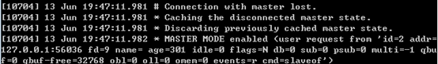

# Redis 主从复制

## 一、前言

**<font color="red">Redis 高可用的方案包括持久化、主从复制（及读写分离）、哨兵和集群</font>**。其中持久化侧重解决的是 Redis 数据的单机备份问题（从内存到硬盘的备份）；**<font color="red">而主从复制则侧重解决数据的多机热备。此外，主从复制还可以实现负载均衡和故障恢复</font>**。

这篇文章中，将详细介绍 Redis 主从复制的方方面面，包括：如何使用主从复制、主从复制的原理（重点是全量复制和部分复制、以及心跳机制）、实际应用中需要注意的问题（如数据不一致问题、复制超时问题、复制缓冲区溢出问题）等。

## 二、主从复制概述

主从复制，是指将一台 Redis 服务器的数据，复制到其他的 Redis 服务器。前者称为主节点 (master)，后者称为从节点 (slave)；数据的复制是单向的，只能由主节点到从节点。默认情况下，每台 Redis 服务器都是主节点；且一个主节点可以有多个从节点( 或没有从节点)，但一个从节点只能有一个主节点。

主从复制的作用主要包括：

1. 数据冗余：主从复制实现了数据的热备份，是持久化之外的一种数据冗余方式。
2. 故障恢复：当主节点出现问题时，可以由从节点提供服务，实现快速的故障恢复；实际上是一种服务的冗余。
3. 负载均衡：在主从复制的基础上，配合读写分离，可以由主节点提供写服务，由从节点提供读服务（即写 Redis 数据时应用连接主节点，读 Redis 数据时应用连接从节点），分担服务器负载；尤其是在写少读多的场景下，通过多个从节点分担读负载，可以大大提高 Redis 服务器的并发量。
4. 高可用基石：除了上述作用以外，主从复制还是哨兵和集群能够实施的基础，因此说主从复制是 Redis 高可用的基础。

## 三、如何使用主从复制

为了更直观的理解主从复制，在介绍其内部原理之前，先说明我们需要如何操作才能开启主从复制。

### 1.建立复制

需要注意，主从复制的开启，完全是在从节点发起的；不需要我们在主节点做任何事情。从节点开启主从复制，有 3 种方式：

- 配置文件：在从服务器的配置文件中加入：**`slaveof <masterip> <masterport>`**
- 启动命令：redis-server 启动命令后加入 **`--slaveof <masterip> <masterport>`**
- 客户端命令：Redis 服务器启动后，直接通过客户端执行命令：**`slaveof <masterip> <masterport>`**，则该 Redis 实例成为从节点。

上述 3 种方式是等效的，下面以客户端命令的方式为例，看一下当执行了 slaveof 后，Redis 主节点和从节点的变化。

### 2.示例

#### 2.1.准备工作：启动两个节点

方便起见，实验所使用的主从节点是在一台机器上的不同 Redis 实例，其中主节点监听 6379 端口，从节点监听 6380 端口；从节点监听的端口号可以在配置文件中修改：

<div align="center">
    
</div>

启动后可以看到：

<div align="center">
    
</div>

两个 Redis 节点启动后（分别称为 6379 节点和 6380 节点），默认都是主节点。

#### 2.2.建立复制

此时在 6380 节点执行 slaveof 命令，使之变为从节点：

<div align="center">
    
</div>

#### 2.3.观察效果

下面验证一下，在主从复制建立后，主节点的数据会复制到从节点中。

（1）首先在从节点查询一个不存在的 key：

<div align="center">
    
</div>

（2）然后在主节点中增加这个 key：

<div align="center">
    
</div>

（3）此时在从节点中再次查询这个 key，会发现主节点的操作已经同步至从节点：

<div align="center">
    
</div>

（4）然后在主节点删除这个 key：

<div align="center">
    
</div>

（5）此时在从节点中再次查询这个 key，会发现主节点的操作已经同步至从节点：

<div align="center">
    
</div>

#### 2.4 断开复制

通过 **`slaveof <masterip> <masterport>`** 命令建立主从复制关系以后，可以通过 slaveof no one 断开。需要注意的是，从节点断开复制后，不会删除已有的数据，只是不再接受主节点新的数据变化。从节点执行 slaveof no one 后，打印日志如下所示；可以看出断开复制后，从节点又变回为主节点。

<div align="center">
    
</div>

主节点打印日志如下：

<div align="center">
    
</div>

## 四、主从复制的实现原理

上面一节中，介绍了如何操作可以建立主从关系；本小节将介绍主从复制的实现原理。主从复制过程大体可以分为 3 个阶段：连接建立阶段（即准备阶段）、数据同步阶段、命令传播阶段；下面分别进行介绍。

### 1.连接建立阶段

该阶段的主要作用是在主从节点之间建立连接，为数据同步做好准备。

#### 1.1.步骤 1：保存主节点信息

当从服务器的客户端向从服务器发送发送以下命令时：

```java{.line-numbers}
127.0.0.1:12345> SLAVE OF 127.0.0.1:6479
OK 
```

从服务器首先要做的就是将客户端给定的主服务器 IP 地址和端口号保存到从服务器状态的 masterhost 和 masterport 属性里面：

```java{.line-numbers}
struct redisServer{
    // ...

    // 主服务器地址
    char* masterhost;
    // 主服务器端口
    char* masterport;

    //...
} 
```

从服务器内部维护了两个字段，即 masterhost 和 masterport 字段，用于存储主节点的 ip 和 port 信息。需要注意的是，slaveof 是异步命令，从节点完成主节点 ip 和 port 的保存后，向发送 slaveof 命令的客户端直接返回 OK，实际的复制操作在这之后才开始进行。

#### 1.2.步骤 2：建立 socket 连接

在 SLAVEOF 命令执行之后，从服务器将根据命令所设置的 IP 地址和端口，创建连向主服务器的套接字连接。

- **从节点**：**<font color="red">为该 socket 关联一个专门处理复制工作的文件事件处理器，负责后续的复制工作，如接收 RDB 文件、接收命令传播等</font>**。
- **主节点**：接收到从节点的 socket 连接后（即 accept 之后），为该 socket 创建相应的客户端状态，并将从节点看做是连接到主节点的一个客户端，后面的步骤会以从节点向主节点发送命令请求的形式来进行。这时从服务器同时具有服务器（Server）和客户端（Client）两个身份。

这个过程中，从节点打印日志如下：

<div align="center">
    
</div>

#### 1.3.步骤 3：发送 PING 命令

从节点成为主节点的客户端之后，发送 ping 命令进行首次请求，目的是：检查 socket 连接是否可用，以及主节点当前是否能够处理请求。从节点发送 PING 命令后，如果主服务器返回 PONG，则说明 socket 连接正常，并且主节点可以处理请求，复制过程继续。在主节点返回 pong 情况下，从节点打印日志如下：

<div align="center">
    
</div>

#### 1.4.步骤 4：身份验证

下面的流程图总结了从服务器在进行身份验证阶段可能遇到的情况，以及各个情况的处理情况：

<div align="center">
    
</div>

#### 1.5.步骤 5：发送从节点端口信息

身份验证之后，从节点会通过命令 **`REPLCONF listening-port <port number>`** 向主节点发送其监听的端口号（前述例子中为 6380），主节点将该信息保存到该从节点对应的客户端状态的 slave_listening_port 字段中；**<font color="red">`slave_listening_port` 的唯一作用是在主服务器执行 INFO replication 命令时打印出从服务器的端口号</font>**。

### 2.同步阶段

主从节点之间的连接建立以后，便可以开始进行数据同步，该阶段可以理解为从节点数据的初始化。具体执行的方式是：从节点向主节点发送 PSYNC 命令，开始同步。数据同步阶段是主从复制最核心的阶段，根据主从节点当前状态的不同，可以分为全量复制和部分复制，下面会有一章专门讲解这两种复制方式以及 PSYNC 命令的执行过程，这里不再详述。

需要注意的是，在数据同步阶段之前，从节点是主节点的客户端，主节点不是从节点的客户端；**<font color="red">而到了这一阶段及以后，主从节点互为客户端</font>**。原因在于：

- 如果 PSYNC 命令执行的是完整重同步操作，那么主服务器需要成为从服务器的客户端，才能将保存在复制缓冲区里面的写命令发送给从服务器执行。
-  如果 PSYNC 命令执行的是部分重同步操作，那么主服务器需要成为从服务器的客户端，才能向从服务器发送保存在复制积压缓冲区里面的写命令。

另外，在命令传播阶段，主节点需要主动向从节点发送其所执行的写命令，才能完成复制。

### 3.命令传播阶段

在同步操作执行完毕之后，主从服务器两者的数据库将达到一致状态，但这种一致状态并不是一成不变的，每当主服务器执行客户端发送过来的写命令时，主服务器的数据就可能会被修改，然后导致主从服务器状态不再一致。为了让主从服务器再次回到数据一致状态，主服务器需要对从服务器执行命令传播操作，在这个阶段主节点将自己执行的写命令发送给从节点，从节点接收命令并执行，从而保证主从节点数据的一致性。

## 五、数据同步阶段--全量复制和部分复制

在 Redis2.8 之前的版本中，旧版本的复制命令为 SYNC，即相当于只能执行全量复制这一种操作。接下来介绍一下旧版本复制功能的缺陷。

从服务器对主服务器的复制分为以下两种情况：

- 初次复制：从服务器以前没有复制过任何主服务器，或者从服务器当前要复制的主服务器和上一次复制的主服务器不同。
- 断线后重复制：处于命令传播阶段的主从服务器因为网络原因而中断了复制，但从服务器通过自动重连重新连接上了主服务器，并继续复制主服务器。

对于初次复制来说，旧版本的复制（也就是只有全量复制）可以很好地完成，但是对于断线后重复制来说，旧版本的复制功能虽然也能让主从服务器恢复到一致性阶段，但效率却非常低。举例如下：

<div align="center">
    
</div>

在时间 T10091，从服务器终于重新连接上主服务器，因为这时主服务器的状态已经不再一致，所以从服务器将向主服务器发送 SYNC 命令，而主服务器会将包含键 k1 至键 k10089 的 RDB 文件发送给从服务器，从服务器通过接收和载入这个 RDB 文件来将自己的数据库更新至主服务器数据库当前所处的状态。从这里可以看出，这种做法是相当低效的。

为了解决旧版复制功能在处理断线重复制情况下的低效问题，Redis2.8 版本开始，使用 PSYNC 命令代替了 SYNC 命令来执行复制时的同步操作。PSYNC 具有完整重同步（full resynchronization）和部分重同步（partial resynchronization）两种模式：

- 其中完整重同步用于处理初次复制的情况：完整重同步的执行步骤和 SYNC 命令的执行步骤基本一样，它们都是通过让主服务器创建并且发送 RDB 文件，以及向从服务器发送保存在缓冲区里面的写命令来进行同步。
- 部分重同步则用于从服务器断线重连后的复制，这时，主服务器将把中断期间主节点执行的写命令发送给从节点，从服务器只要接收并且执行这些写命令，就可以将数据库更新至主服务器当前所处的状态。

在 Redis2.8 及以后，从节点可以发送 PSYNC 命令请求同步数据，此时根据主从节点当前状态的不同，同步方式可能是全量复制或部分复制。后文介绍以 Redis2.8 及以后版本为例。

### 1.全量复制

Redis 通过 psync 命令进行全量复制的过程如下：

1. 从节点判断无法进行部分复制，向主节点发送全量复制的请求；或从节点发送部分复制的请求，但主节点判断无法进行部分复制；具体判断过程需要在讲述了部分复制原理后再介绍；
2. 主节点收到全量复制的命令后，执行 BGSAVE，在后台生成 RDB 文件，并使用一个缓冲区（称为复制缓冲区）记录从现在开始执行的所有写命令；
3. 主节点的 BGSAVE 执行完成后，将 RDB 文件发送给从节点；从节点首先清除自己的旧数据，然后载入接收的 RDB 文件，将数据库状态更新至主节点执行 bgsave 时的数据库状态；
4. 主节点将前述复制缓冲区中的所有写命令发送给从节点，从节点执行这些写命令，将数据库状态更新至主节点的最新状态；
5. 如果从节点开启了 AOF，则会触发 bgrewriteaof 的执行，从而保证 AOF 文件更新至主节点的最新状态；

通过全量复制的过程可以看出，全量复制是非常重型的操作：

1. 主节点通过 BGSAVE 命令 fork 子进程进行 RDB 持久化，该过程是非常消耗 CPU、内存( 页表复制)、硬盘 I/O 的；
2. 主节点通过网络将 RDB 文件发送给从节点，对主从节点的带宽都会带来很大的消耗
3. 从节点清空老数据、载入新 RDB 文件的过程是阻塞的，无法响应客户端的命令；如果从节点执行 bgrewriteaof，也会带来额外的消耗

### 2.部分复制

为了解决旧版复制功能在处理断线重复制情况下的低效问题，Redis2.8 版本开始，使用 PSYNC 命令代替了 SYNC 部分复制的实现，依赖于三个重要的概念：

#### 2.1.复制偏移量

主节点和从节点分别维护一个复制偏移量（offset），代表的是主节点向从节点传递的字节数；主节点每次向从节点传播 N 个字节数据时，主节点的 offset 增加 N；从节点每次收到主节点传来的 N 个字节数据时，从节点的 offset 增加 N。

**<font color="red">offset 用于判断主从节点的数据库状态是否一致：如果二者 offset 相同，则一致；如果 offset 不同，则不一致，此时可以根据两个 offset 找出从节点缺少的那部分数据</font>**。例如，如果主节点的 offset 是 1000，而从节点的 offset 是 500，那么部分复制就需要将 offset 为 501-1000 的数据传递给从节点。而 offset 为 501-1000 的数据存储的位置，就是下面要介绍的复制积压缓冲区。

#### 2.2 复制积压缓冲区

复制积压缓冲区是由主节点维护的、固定长度的、先进先出(FIFO) 队列，默认大小 1MB；当主节点开始有从节点时创建，其作用是备份主节点最近发送给从节点的数据。注意，无论主节点有一个还是多个从节点，都只需要一个复制积压缓冲区。

在命令传播阶段，主节点除了将写命令发送给从节点，还会发送一份给复制积压缓冲区，作为写命令的备份；除了存储写命令，复制积压缓冲区中还存储了其中的每个字节对应的复制偏移量（offset）。由于复制积压缓冲区定长且是先进先出，所以它保存的是主节点最近执行的写命令；时间较早的写命令会被挤出缓冲区。

由于该缓冲区长度固定且有限，因此可以备份的写命令也有限，**<font color="red">当主从节点 offset 的差距过大超过缓冲区长度时，将无法执行部分复制，只能执行全量复制</font>**。反过来说，为了提高网络中断时部分复制执行的概率，可以根据需要增大复制积压缓冲区的大小 (通过配置 repl-backlog-size)；例如如果网络中断的平均时间是 60s，而主节点平均每秒产生的写命令 (特定协议格式) 所占的字节数为 100KB，则复制积压缓冲区的平均需求为 6MB，保险起见，可以设置为 12MB，来保证绝大多数断线情况都可以使用部分复制。

从节点将 offset 发送给主节点后，主节点根据 offset 和缓冲区大小决定能否执行部分复制：

- 如果 offset 偏移量之后的数据，仍然都在复制积压缓冲区里，则执行部分复制；
- 如果 offset 偏移量之后的数据已不在复制积压缓冲区中（数据已被挤出），则执行全量复制。

#### 2.3 服务器运行 ID(runid)

每个 Redis 节点( 无论主从)，在启动时都会自动生成一个随机 ID( 每次启动都不一样)，由 40 个随机的十六进制字符组成；runid 用来唯一识别一个 Redis 节点。通过 info Server 命令，可以查看节点的 runid：

<div align="center">
    
</div>

主从节点初次复制时，主节点将自己的 runid 发送给从节点，从节点将这个 runid 保存起来；当断线重连时，从节点会将这个 runid 发送给主节点；主节点根据 runid 判断能否进行部分复制：

- 如果从节点保存的 runid 与主节点现在的 runid 相同，说明主从节点之前同步过，主节点会继续尝试使用部分复制 (到底能不能部分复制还要看 offset 和复制积压缓冲区的情况)；
- 如果从节点保存的 runid 与主节点现在的 runid 不同，说明从节点在断线前同步的 Redis 节点并不是当前的主节点，只能进行全量复制。

### 3.PSYNC 命令的执行

在了解了复制偏移量、复制积压缓冲区、节点运行 id 之后，本节将介绍 psync 命令的参数和返回值，从而说明 psync 命令执行过程中，主从节点是如何确定使用全量复制还是部分复制的。psync 命令的执行过程可以参见下图：

<div align="center">
    
</div>

1. 首先，从节点根据当前状态，决定如何调用 psync 命令：

- 如果从节点之前未执行过 slaveof 或最近执行了 slaveof no one，则从节点发送命令为 psync ? -1，向主节点请求全量复制；
- 如果从节点之前执行了 slaveof，则发送命令为 psync **`<runid> <offset>`**，其中 runid 为上次复制的主节点的 runid，offset 为上次复制截止时从节点保存的复制偏移量。

2. 主节点根据收到的 psync 命令，及当前服务器状态，决定执行全量复制还是部分复制：

- 如果主节点版本够新，且 runid 与从节点发送的 runid 相同，且从节点发送的 offset 之后的数据在复制积压缓冲区中都存在，则回复+CONTINUE，表示将进行部分复制，从节点等待主节点发送其缺少的数据即可；
- 如果主节点版本够新，但是 runid 与从节点发送的 runid 不同，或从节点发送的 offset 之后的数据已不在复制积压缓冲区中( 在队列中被挤出了)，则回复+FULLRESYNC **`<runid> <offset>`**，表示要进行全量复制，其中 runid 表示主节点当前的 runid，offset 表示主节点当前的 offset，从节点保存这两个值，以备使用；

## 六、命令传播阶段-心跳机制

在命令传播阶段，除了发送写命令，主从节点还维持着心跳机制：REPLCONF ACK **`<replication_offset>`**。心跳机制对于主从复制的超时判断、数据安全等有作用。

**<font color="red">在命令传播阶段</font>**，从节点会向主节点发送 REPLCONF ACK 命令，频率是每秒 1 次；命令格式为：REPLCONF ACK **`<replication_offset>`**，其中 offset 指从节点保存的复制偏移量。REPLCONF ACK 命令的作用包括：

（1）实时监测主从节点网络状态：该命令会被主节点用于复制超时的判断。此外，在主节点中使用 INFO REPLICATION，可以看到其从节点的状态中的 lag 值，代表的是主节点上次收到该 REPLCONF ACK 命令的时间间隔，在正常情况下，该值应该是 0 或 1，如下图所示：

<div align="center">
    
</div>

（2）检测命令丢失：从节点发送了自身的 offset，主节点会与自己的 offset 对比，如果从节点数据缺失（如网络丢包），主节点会推送缺失的数据（这里也会利用复制积压缓冲区）。**<font color="red">注意，offset 和复制积压缓冲区，不仅可以用于部分复制，也可以用于处理命令丢失等情形；区别在于前者是在断线重连后进行的，而后者是在主从节点没有断线的情况下进行的</font>**。

（3）辅助保证从节点的数量和延迟：Redis 主节点中使用 min-slaves-to-write 和 min-slaves-max-lag 参数，来保证主节点在不安全的情况下不会执行写命令；所谓不安全，是指从节点数量太少，或延迟过高。例如 min-slaves-to-write 和 min-slaves-max-lag 分别是 3 和 10，含义是如果从节点数量小于 3 个，或所有从节点的延迟值都大于 10s，则主节点拒绝执行写命令。**<font color="red">而这里从节点延迟值的获取，就是通过主节点接收到 REPLCONF ACK 命令的时间来判断的，即前面所说的 info Replication 中的 lag 值</font>**。


## 七、应用中的问题

### 1.读写分离及其中的问题

在主从复制基础上实现的读写分离，可以实现 Redis 的读负载均衡：由主节点提供写服务，由一个或多个从节点提供读服务（多个从节点既可以提高数据冗余程度，也可以最大化读负载能力）；在读负载较大的应用场景下，可以大大提高 Redis 服务器的并发量。下面介绍在使用 Redis 读写分离时，需要注意的问题。

#### 1.1.延迟与不一致

前面已经讲到，由于主从复制的命令传播是异步的，延迟与数据的不一致不可避免。如果应用对数据不一致的接受程度程度较低，可能的优化措施包括：优化主从节点之间的网络环境（如在同机房部署）；**<font color="red">监控主从节点延迟（通过 lag）判断，如果从节点延迟过大，通知应用不再通过该从节点读取数据</font>**；使用集群同时扩展写负载和读负载等。

#### 1.2.数据过期问题

在单机版 Redis 中，存在两种删除策略：

- 惰性删除：服务器不会主动删除数据，只有当客户端查询某个数据时，服务器判断该数据是否过期，如果过期则删除。
- 定期删除：服务器执行定时任务删除过期数据，但是考虑到内存和 CPU 的折中（删除会释放内存，但是频繁的删除操作对 CPU 不友好），该删除的频率和执行时间都受到了限制。

在主从复制场景下，为了主从节点的数据一致性，从节点不会主动删除数据，而是由主节点控制从节点中过期数据的删除。由于主节点的惰性删除和定期删除策略，都不能保证主节点及时对过期数据执行删除操作，因此，当客户端通过 Redis 从节点读取数据时，很容易读取到已经过期的数据。

#### 1.3.故障切换问题

在没有使用哨兵的读写分离场景下，应用针对读和写分别连接不同的 Redis 节点；**<font color="red">当主节点或从节点出现问题而发生更改时，需要及时修改应用程序读写 Redis 数据的连接</font>**；连接的切换可以手动进行，或者自己写监控程序进行切换，但前者响应慢、容易出错，后者实现复杂，成本都不算低。

### 2.超时问题

主从节点连接超时是导致复制中断的最重要的原因之一，本小节单独说明超时问题，下一小节说明其他会导致复制中断的问题。

#### 2.1.超时判断意义

在复制连接建立过程中及之后，主从节点都有机制判断连接是否超时，其意义在于：

1. 如果主节点判断连接超时，其会释放相应从节点的连接，从而释放各种资源，否则无效的从节点仍会占用主节点的各种资源（输出缓冲区、带宽、连接等）；此外连接超时的判断可以让主节点更准确的知道当前有效从节点的个数，有助于保证数据安全（配合前面讲到的 min-slaves-to-write 等参数）。
2. 如果从节点判断连接超时，则可以及时重新建立连接，避免与主节点数据长期的不一致。

#### 2.2.判断机制

