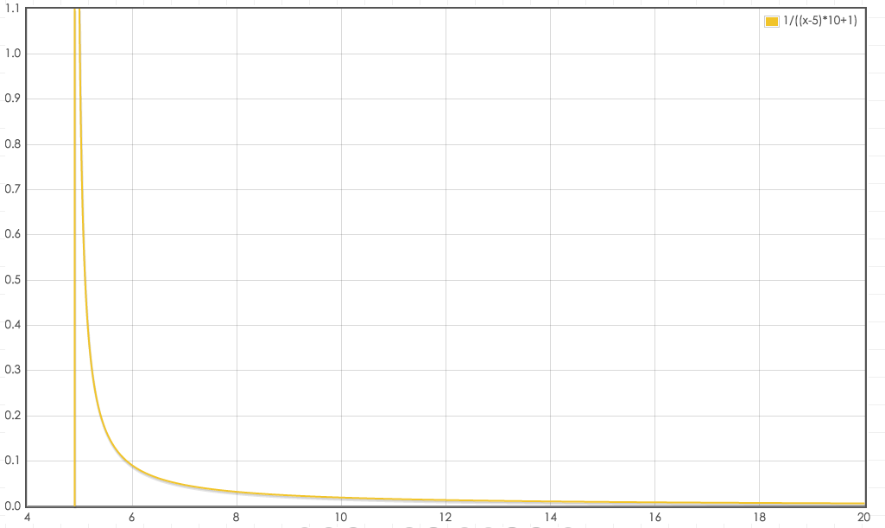

# Redis 之 LFU 算法

对于 Redis 中的 LRU 算法有一个缺陷，在如下情况下：

```c{.line-numbers}
~~~~~A~~~~~A~~~~~A~~~~A~~~~~A~~~~~A~~|
~~B~~B~~B~~B~~B~~B~~B~~B~~B~~B~~B~~B~|
~~~~~~~~~~C~~~~~~~~~C~~~~~~~~~C~~~~~~|
~~~~~D~~~~~~~~~~D~~~~~~~~~D~~~~~~~~~D| 
```

会将数据 D 误认为将来最有可能被访问到的数据。

Redis 作者曾想改进 LRU 算法，但发现 Redis 的 LRU 算法受制于随机采样数 maxmemory_samples，在 maxmemory_samples 等于 10 的情况下已经很接近于理想的 LRU 算法性能，也就是说，LRU 算法本身已经很难再进一步了。

于是将思路回到原点，淘汰算法的本意是保留那些将来最有可能被再次访问的数据，而 LRU 算法只是预测最近被访问的数据将来最有可能被访问到。我们可以转变思路，采用一种 LFU(Least Frequently Used) 算法，也就是最频繁被访问的数据将来最有可能被访问到。在上面的情况中，根据访问频繁情况，可以确定保留优先级：B>A>C=D。

## 1.Redis 中 LFU 算法思路

在 LFU 算法中，可以为每个 key 维护一个计数器。每次 key 被访问的时候，计数器增大。计数器越大，可以约等于访问越频繁。

上述简单算法存在两个问题：

- 在 LRU 算法中可以维护一个双向链表，然后简单的把被访问的节点移至链表开头，但在 LFU 中是不可行的，节点要严格按照计数器进行排序，新增节点或者更新节点位置时，时间复杂度可能达到 O(N)。
- 只是简单的增加计数器的方法并不完美。访问模式是会频繁变化的，一段时间内频繁访问的 key 一段时间之后可能会很少被访问到，只增加计数器并不能体现这种趋势。

第一个问题很好解决，可以借鉴 LRU 实现的经验，维护一个待淘汰 key 的 pool。第二个问题的解决办法是，记录 key 最后一个被访问的时间，然后随着时间推移，降低计数器。Redis 对象的结构如下：

```c{.line-numbers}
typedef struct redisObject {
    unsigned type:4;
    unsigned encoding:4;
    unsigned lru:LRU_BITS; /* LRU time (relative to global lru_clock) or
                            * LFU data (least significant 8 bits frequency
                            * and most significant 16 bits access time). */
    int refcount;
    void *ptr;
} robj; 
```

在 LRU 算法中，24 bits 的 lru 是用来记录 LRU time 的，在 LFU 中也可以使用这个字段，不过是分成 16 bits 与 8 bits 使用：

```c{.line-numbers}
     16 bits      8 bits
+----------------+--------+
+ Last decr time | LOG_C  |
+----------------+--------+ 
```

高 16 bits 用来记录最近一次计数器降低的时间 ldt，单位是分钟，低 8 bits 记录计数器数值 counter。

## 2.LFU 算法的配置

Redis4.0 之后为 maxmemory_policy 淘汰策略添加了两个 LFU 模式：

- volatile-lfu：对有过期时间的 key 采用 LFU 淘汰算法
- allkeys-lfu：对全部 key 采用 LFU 淘汰算法

还有 2 个配置可以调整 LFU 算法：

```c{.line-numbers}
lfu-log-factor 10
lfu-decay-time 1 
```

lfu-log-factor 可以调整计数器 counter 的增长速度，lfu-log-factor 越大，counter 增长的越慢。lfu-decay-time 是一个以分钟为单位的数值，可以调整 counter 的减少速度。

## 3.源码实现

### 3.1 lookupKey 函数

在 lookupKey 函数，代码如下：

```c{.line-numbers}
robj *lookupKey(redisDb *db, robj *key, int flags) {
    dictEntry *de = dictFind(db->dict,key->ptr);
    if (de) {
        robj *val = dictGetVal(de);

        /* Update the access time for the ageing algorithm.
         * Don't do it if we have a saving child, as this will trigger
         * a copy on write madness. */
        if (server.rdb_child_pid == -1 &&
            server.aof_child_pid == -1 &&
            !(flags & LOOKUP_NOTOUCH))
        {
            if (server.maxmemory_policy & MAXMEMORY_FLAG_LFU) {
                updateLFU(val);
            } else {
                val->lru = LRU_CLOCK();
            }
        }
        return val;
    } else {
        return NULL;
    }
} 
```

当采用 LFU 策略时，updateLFU 更新 lru：

```c{.line-numbers}
/* Update LFU when an object is accessed.
 * Firstly, decrement the counter if the decrement time is reached.
 * Then logarithmically increment the counter, and update the access time. */
void updateLFU(robj *val) {
    unsigned long counter = LFUDecrAndReturn(val);
    counter = LFULogIncr(counter);
    val->lru = (LFUGetTimeInMinutes()<<8) | counter;
} 
```

### 3.2 增长 LFULogIncr

增长函数 LFULogIncr 如下：

```c{.line-numbers}
/* Logarithmically increment a counter. The greater is the current counter value
 * the less likely is that it gets really implemented. Saturate it at 255. */
uint8_t LFULogIncr(uint8_t counter) {
    if (counter == 255) return 255;
    double r = (double)rand()/RAND_MAX;
    double baseval = counter - LFU_INIT_VAL;
    if (baseval < 0) baseval = 0;
    double p = 1.0/(baseval*server.lfu_log_factor+1);
    if (r < p) counter++;
    return counter;
} 
```

上面代码对应的计算公式如下：

```c{.line-numbers}
1/((counter-LFU_INIT_VAL)*server.lfu_log_factor+1) 
```

其中 LFU_INIT_VAL 为 5，我们看下概率分布图会有一个更直观的认识，以默认 server.lfu_log_factor=10 为例：

<div align="center">
    
</div>

counter 并不是简单的访问一次就 +1，而是采用了一个 0-1 之间的 p 因子控制增长。counter 最大值为 255。取一个 0-1 之间的随机数 r 与 p 比较，当 r < p 时，才增加 counter，这和比特币中控制产出的策略类似。p 取决于当前 counter 值与 lfu_log_factor 因子，counter 值与 lfu_log_factor 因子越大，p 越小，r < p 的概率也越小，counter 增长的概率也就越小。增长情况如下：

```c{.line-numbers}
+--------+------------+------------+------------+------------+------------+
| factor | 100 hits   | 1000 hits  | 100K hits  | 1M hits    | 10M hits   |
+--------+------------+------------+------------+------------+------------+
| 0      | 104        | 255        | 255        | 255        | 255        |
+--------+------------+------------+------------+------------+------------+
| 1      | 18         | 49         | 255        | 255        | 255        |
+--------+------------+------------+------------+------------+------------+
| 10     | 10         | 18         | 142        | 255        | 255        |
+--------+------------+------------+------------+------------+------------+
| 100    | 8          | 11         | 49         | 143        | 255        |
+--------+------------+------------+------------+------------+------------+ 
```

可见 counter 增长与访问次数呈现对数增长的趋势，随着访问次数越来越大，counter 增长的越来越慢。

### 3.3 降低 LFUDecrAndReturn

从上一小节的 counter 增长函数 LFULogIncr 中我们可以看到，随着 key 的访问量增长，counter 最终都会收敛为 255，这就带来一个问题，如果 counter 只增长不衰减就无法区分热点 key。为了解决这个问题，redis 提供了衰减因子 server.lfu_decay_time，其单位为分钟，计算方法也很简单，如果一个 key 长时间没有访问那么它的计数器 counter 就要减少，减少的值由衰减因子来控制。

首先，LFUDecrAndReturn 对 counter 进行减少操作：

```c{.line-numbers}
/* If the object decrement time is reached decrement the LFU counter but
 * do not update LFU fields of the object, we update the access time
 * and counter in an explicit way when the object is really accessed.
 * And we will times halve the counter according to the times of
 * elapsed time than server.lfu_decay_time.
 * Return the object frequency counter.
 *
 * This function is used in order to scan the dataset for the best object
 * to fit: as we check for the candidate, we incrementally decrement the
 * counter of the scanned objects if needed. */
unsigned long LFUDecrAndReturn(robj *o) {
    unsigned long ldt = o->lru >> 8;
    unsigned long counter = o->lru & 255;
    unsigned long num_periods = server.lfu_decay_time ? LFUTimeElapsed(ldt) / server.lfu_decay_time : 0;
    if (num_periods)
        counter = (num_periods > counter) ? 0 : counter - num_periods;
    return counter;
} 
```

函数首先取得高 16 bits 的最近降低时间 ldt 与低 8 bits 的计数器 counter，然后根据配置的 lfu_decay_time 计算应该降低多少。LFUTimeElapsed 用来计算当前时间与 ldt 的差值：

```c{.line-numbers}
/* Return the current time in minutes, just taking the least significant
 * 16 bits. The returned time is suitable to be stored as LDT (last decrement
 * time) for the LFU implementation. */
unsigned long LFUGetTimeInMinutes(void) {
    return (server.unixtime/60) & 65535;
}

/* Given an object last access time, compute the minimum number of minutes
 * that elapsed since the last access. Handle overflow (ldt greater than
 * the current 16 bits minutes time) considering the time as wrapping
 * exactly once. */
unsigned long LFUTimeElapsed(unsigned long ldt) {
    unsigned long now = LFUGetTimeInMinutes();
    if (now >= ldt) return now-ldt;
    return 65535-ldt+now;
} 
```

具体是当前时间转化成分钟数后取低 16 bits，然后计算与 ldt 的差值 now-ldt。当 ldt > now 时，默认为过了一个周期(16 bits，最大 65535)，取值 65535-ldt+now。然后用差值与配置 lfu_decay_time 相除，LFUTimeElapsed(ldt) / server.lfu_decay_time，已过去 n 个 lfu_decay_time，则将 counter 减少 n，counter - num_periods。

### 3.4 新生的 key 策略

另外一个问题是，当创建新对象的时候，对象的 counter 如果为 0，很容易就会被淘汰掉，还需要为新生 key 设置一个初始 counter，createObject:

```c{.line-numbers}
robj *createObject(int type, void *ptr) {
    robj *o = zmalloc(sizeof(*o));
    o->type = type;
    o->encoding = OBJ_ENCODING_RAW;
    o->ptr = ptr;
    o->refcount = 1;

    /* Set the LRU to the current lruclock (minutes resolution), or
     * alternatively the LFU counter. */
    if (server.maxmemory_policy & MAXMEMORY_FLAG_LFU) {
        o->lru = (LFUGetTimeInMinutes()<<8) | LFU_INIT_VAL;
    } else {
        o->lru = LRU_CLOCK();
    }
    return o;
} 
```

counter 会被初始化为 LFU_INIT_VAL，默认 5。

### 3.5 pool 算法

对于 LFU 算法而言，其 pool 算法和采用 LRU 策略进行内存置换时一样，源代码如下所示：

```c{.line-numbers}
if (server.maxmemory_policy & (MAXMEMORY_FLAG_LRU|MAXMEMORY_FLAG_LFU) ||
    server.maxmemory_policy == MAXMEMORY_VOLATILE_TTL) 
```

计算 idle 时有所不同：

```c{.line-numbers}
} else if (server.maxmemory_policy & MAXMEMORY_FLAG_LFU) {
    /* When we use an LRU policy, we sort the keys by idle time
     * so that we expire keys starting from greater idle time.
     * However when the policy is an LFU one, we have a frequency
     * estimation, and we want to evict keys with lower frequency
     * first. So inside the pool we put objects using the inverted
     * frequency subtracting the actual frequency to the maximum
     * frequency of 255. */
    idle = 255-LFUDecrAndReturn(o); 
```

使用了 255-LFUDecrAndReturn(o) 当做排序的依据。因为 LFUDecrAndReturn 的返回值越大，则表明 counter 值越大，对象被访问的频率比较高，计算得到的 idle 值就比较小。因此和 LRU 算法中的回收池的排序逻辑一样，也是 idle 值越大的 (表示空闲时间最大或者访问频率最小)，在回收池中的顺序就越靠后。

### 3.6 热点 key

业务中存在访问热点是在所难免的，redis 也会遇到这个问题，然而如何发现热点 key 一直困扰着许多用户，redis4.0 为我们带来了许多新特性，其中便包括基于 LFU 的热点 key 发现机制。从 LFU 的字面意思我们很容易联想到 key 的访问频率，**<font color="red">但是 4.0 最初版本仅用来做内存逐出，对于访问频率并没有很好的记录，那么经过一番改造，redis 于 4.0.3 版本开始正式支持基于 LFU 的热点 key 发现机制</font>**。

介绍完 LFU 算法，接下来就是我们关心的热点 key 发现机制。首先用户如何获取访问频率呢？redis 提供了 OBJECT FREQ 子命令来获取 LFU 信息，但是要注意需要先把内存逐出策略设置为 allkeys-lfu 或者 volatile-lfu，否则会返回错误：

```c{.line-numbers}
127.0.0.1:6379> config get maxmemory-policy
1) "maxmemory-policy"
2) "noeviction"
127.0.0.1:6379> object freq counter:000000006889
(error) ERR An LFU maxmemory policy is not selected, access frequency not tracked. Please note that when switching between policies at runtime LRU and LFU data will take some time to adjust.

127.0.0.1:6379> config set maxmemory-policy allkeys-lfu
OK
127.0.0.1:6379> object freq counter:000000006889
(integer) 3 
```

使用 scan 命令遍历所有 key，再通过 OBJECT FREQ 获取访问频率并排序，即可得到热点 key。为了方便用户使用，redis 4.0.3 同时也提供了 redis-cli 的热点 key 发现功能，执行 redis-cli 时加上--hotkeys 选项即可，示例如下：

```c{.line-numbers}
$./redis-cli --hotkeys

# Scanning the entire keyspace to find hot keys as well as
# average sizes per key type.  You can use -i 0.1 to sleep 0.1 sec
# per 100 SCAN commands (not usually needed).

[00.00%] Hot key 'counter:000000000002' found so far with counter 87
[00.00%] Hot key 'key:000000000001' found so far with counter 254
[00.00%] Hot key 'mylist' found so far with counter 107
[00.00%] Hot key 'key:000000000000' found so far with counter 254
[45.45%] Hot key 'counter:000000000001' found so far with counter 87
[45.45%] Hot key 'key:000000000002' found so far with counter 254
[45.45%] Hot key 'myset' found so far with counter 64
[45.45%] Hot key 'counter:000000000000' found so far with counter 93

-------- summary -------

Sampled 22 keys in the keyspace!
hot key found with counter: 254    keyname: key:000000000001
hot key found with counter: 254    keyname: key:000000000000
hot key found with counter: 254    keyname: key:000000000002
hot key found with counter: 107    keyname: mylist
hot key found with counter: 93    keyname: counter:000000000000
hot key found with counter: 87    keyname: counter:000000000002
hot key found with counter: 87    keyname: counter:000000000001
hot key found with counter: 64    keyname: myset 
```