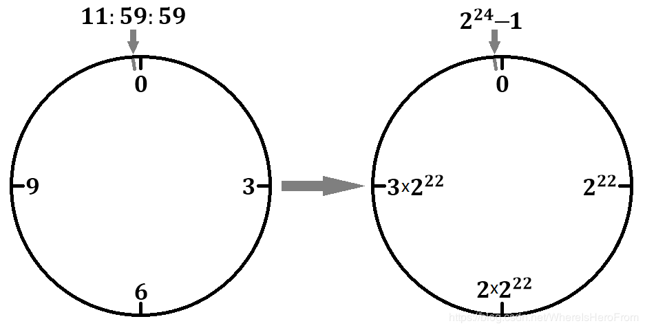

# Redis 之 LRU 算法

## 一、LRU 算法概述

LRU 是 Least Recently Used 的缩写，即最近最少使用，是内存管理的一种页面置换算法。算法的核心是：**<font color="red">如果一个数据在最近一段时间内没有被访问到，那么它在将来被访问的可能性也很小</font>**。换言之，当内存达到极限时，应该把内存中最久没有被访问或者说空闲时限最长的数据淘汰掉。

那么，如何表示这个最久呢？Redis 在实现上引入了一个 LRU 时钟来代替 unix 时间戳，每个对象的每次被访问都会记录下当前服务器的 LRU 时钟，然后用记录下的服务器 LRU 时钟减去对象本身的时钟，得到的就是这个对象没有被访问的时间间隔（也称空闲时间），空闲时间最大的就是需要淘汰的对象。

```c{.line-numbers}
#define LRU_BITS 24
#define LRU_CLOCK_MAX ((1<<LRU_BITS)-1)
#define LRU_CLOCK_RESOLUTION 1000
 
unsigned int getLRUClock(void) {
    return (mstime()/LRU_CLOCK_RESOLUTION) & LRU_CLOCK_MAX;
} 
```

以上这段代码的含义是通过当前的 unix 时间戳获取 LRU 时钟。unix 时间戳通过接口 mstime 获取，得到的是从 1970 年 1 月 1 日早上 8 点到当前时刻的时间间隔，以毫秒为单位（mstime 底层实现用的是 c 的系统函数 gettimeofday）。其中，LRU_BITS 表示 LRU 时钟的位数(24 位)；LRU_CLOCK_MAX 为 LRU 时钟的最大值 (2^24 - 1)；LRU_CLOCK_RESOLUTION 则表示 LRU 时钟的最小刻度为 1000 毫秒。

<div align="center">
    
</div>

因为 LRU_CLOCK_MAX 是 2 的幂减 1，即它的二进制表示全是 1，所以这里的 & 其实是取模的意思，例如，23 % 16 = 7 等价于 0x17 & 0x0F = 0x07，因此，当需要对2的次幂进行求余时，可以是使用&运算符来代替，效率会提高很多。当x = 2 ^ n(n为自然数)时，a % x = a & (x - 1)。那么 getLRUClock 函数的含义就是定位到 LRU 时钟的某个刻度。

## 二、Redis 中的 LRU 时钟

### 1.redis 对象

Redis 中的所有对象定义为 redisObject 结构体，也正是这些对象采用了 LRU 算法进行内存回收，所以每个对象需要一个成员来用来记录该对象的最近一次被访问的时间（即 lru 成员），由于时钟的最大值只需要 24 个比特位就能表示，所以结构体定义时采用了位域。定义如下：

```c{.line-numbers}
typedef struct redisObject {
    unsigned type:4;
    unsigned encoding:4;
    unsigned lru:LRU_BITS;
    int refcount;
    void *ptr;
} robj; 
```

### 2.redis 中的定时器

redis 在启动的时候初始化 ServerConfig 的时候，会初始化 lruclock。同时，在 Redis 中有一个全局的定时器函数 serverCron，用于刷新服务器的 LRU 时钟。初始化 ServerConfig 的代码如下：

```c{.line-numbers}
void initServerConfig(void) {
    ...
    unsigned int lruclock = getLRUClock();
    atomicSet(server.lruclock,lruclock);
    ...
} 
```

在 serverCron 中每 100ms 更新 LRUClock 的代码如下：

```c{.line-numbers}
int serverCron(struct aeEventLoop *eventLoop, long long id, void *clientData) {
    ...
    unsigned int lruclock = getLRUClock();
    atomicSet(server.lruclock,lruclock);
    ...
}
```

其中，server.lruclock 代表服务器的 LRU 时钟，这个时钟的刷新频率由 server.hz 决定，即每秒钟会调用 server.hz （默认值为 10）次 serverCron 函数。那么，服务器每 1/server.hz 秒就会调用一次定时器函数 serverCron。

### 3.Redis 对象的 LRU 时钟

每个 Redis 对象的 LRU 时钟的计算方式由宏 LRU_CLOCK 给出，实现如下：

```c{.line-numbers}
#define LRU_CLOCK() ((1000/server.hz <= LRU_CLOCK_RESOLUTION) ? server.lruclock : getLRUClock()) 
```

正如上文所提到的，1/server.hz 代表了 serverCron 这个定时器函数两次调用之间的最小时间间隔（以秒为单位），那么 1000/server.hz 就是以毫秒为单位了。如果这个最小时间间隔小于等于 LRU 时钟的精度，那么不需要重新计算 LRU时钟，直接用服务器 LRU时钟做近似值即可，因为时间间隔越小，server.lruclock 刷新的越频繁；相反，当serverCron函数调用的时间间隔很大的时候，server.lruclock 的刷新可能不及时，所以更新或者初始化对象LRU时钟时，需要用 getLRUClock 重新计算准确的 LRU 时钟。

如图所示，以  server.hz = 10 为例，sc 代表每次 serverCron 调用的时间结点，两次调用间隔 100ms，每次调用就会利用 getLRUClock 函数计算一次 LRU 时钟。由于 LRU时钟的最小刻度为 1000ms，所以图中 LRU_x 和 LRU_y 之间是没有其它刻度的，那么所有落在 LRU_x 和 LRU_y 之间计算出来的 LRU时钟 的值都为 LRU_x，于是为了避免重复计算，减少调用系统函数 gettimeofday 的时间，可以用最近一次计算得到的 LRU 时钟作为近似值，即 server.lruclock。

<div align="center">
    
</div>

Redis 对象更新 LRU 时钟的地方有两个：

- 对象创建时;
- 对象被使用时;

a) createObject 函数用于创建一个 Redis 对象，代码实现在 object.c 中：

```c{.line-numbers}
robj *createObject(int type, void *ptr) {
    robj *o = zmalloc(sizeof(*o));
    o->type = type;
    o->encoding = OBJ_ENCODING_RAW;
    o->ptr = ptr;
    o->refcount = 1;

    /* Set the LRU to the current lruclock (minutes resolution), or
     * alternatively the LFU counter. */
    if (server.maxmemory_policy & MAXMEMORY_FLAG_LFU) {
        o->lru = (LFUGetTimeInMinutes()<<8) | LFU_INIT_VAL;
    } else {
        o->lru = LRU_CLOCK();
    }
    return o;
} 
```

这里调用 LRU_CLOCK() 对 Redis 的对象成员 lru 进行 LRU 时钟的设置。

b) lookupKey 不会直接被 redis 命令调用，往往是通过lookupKeyRead()、lookupKeyWrite() 、lookupKeyReadWithFlags() 间接调用的，这个函数的作用是通过传入的 key 查找对应的 redis 对象，并且会在条件满足时设置上 LRU 时钟。也就是说在数据库每操作一个object都会更新这个robj的lruclock。同时有一点值得注意，为了避免fork子进程后额外的内存消耗，当进行bgsave或aof rewrite时，lru访问时间是不更新的。。为了便于阐述，这里简化了代码，源码实现在 db.c 中：

```c{.line-numbers}
robj *lookupKey(redisDb *db, robj *key, int flags) {
    dictEntry *de = dictFind(db->dict,key->ptr);
    if (de) {
        robj *val = dictGetVal(de);

        /* Update the access time for the ageing algorithm.
         * Don't do it if we have a saving child, as this will trigger
         * a copy on write madness. */
        if (server.rdb_child_pid == -1 &&
            server.aof_child_pid == -1 &&
            !(flags & LOOKUP_NOTOUCH))
        {
            if (server.maxmemory_policy & MAXMEMORY_FLAG_LFU) {
                unsigned long ldt = val->lru >> 8;
                unsigned long counter = LFULogIncr(val->lru & 255);
                val->lru = (ldt << 8) | counter;
            } else {
                val->lru = LRU_CLOCK();
            }
        }
        return val;
    } else {
        return NULL;
    }
} 
```

## 三、Redis 中的 LRU 内存回收

### 1.内存回收策略

当内存达到极限，就要开始利用回收策略对内存进行回收释放。回收的配置在 redis.conf 中填写，如下：

```c{.line-numbers}
maxmemory 1073741824
maxmemory-policy noeviction
maxmemory-samples 5
```

这三个配置项决定了 Redis 内存回收时的机制，maxmemory 指定了内存使用的极限，以字节为单位。当内存达到极限时，他会尝试去删除一些键值。删除的策略由 maxmemory-policy 配置来指定。如果根据指定的策略无法删除键或者策略本身就是 'noeviction'，那么，Redis 会根据命令的类型做出不同的回应：会给需要更多内存的命令返回一个错误，例如 SET、LPUSH 等等；而像 GET 这样的只读命令则可以继续正常运行。

maxmemory ：当你的 Redis 是主 Redis 时 （Redis 采用主从模式时），需要预留一部分系统内存给同步队列缓存。当然，如果设置的删除策略 'noeviction'，则不需要考虑这个问题。maxmemory-policy：当内存达到 maxmemory 时，采用的回收策略，总共有如下六种：

- noeviction：不会继续服务写请求 (DEL 请求可以继续服务)，读请求可以继续进行。这样可以保证不会丢失数据，但是会让线上的业务不能持续进行。这是默认的淘汰策略。
- volatile-lru：尝试淘汰设置了过期时间的 key，最少使用的 key 优先被淘汰。没有设置过期时间的 key 不会被淘汰，这样可以保证需要持久化的数据不会突然丢失。
- volatile-ttl 跟上面一样，除了淘汰的策略不是 LRU，而是 key 的剩余寿命 ttl 的值，ttl 越小越优先被淘汰。
- volatile-random 跟上面一样，不过淘汰的 key 是过期 key 集合中随机的 key。
- allkeys-lru 区别于 volatile-lru，这个策略要淘汰的 key 对象是全体的 key 集合，而不只是过期的 key 集合。这意味着没有设置过期时间的 key 也会被淘汰。
- allkeys-random 跟上面一样，不过淘汰的策略是随机的 key。

volatile-xxx 策略只会针对带过期时间的 key 进行淘汰，allkeys-xxx 策略会对所有的 key 进行淘汰。如果你只是拿 Redis 做缓存，那应该使用 allkeys-xxx，客户端写缓存时不必携带过期时间。如果你还想同时使用 Redis 的持久化功能，那就使用 volatile-xxx 策略，这样可以保留没有设置过期时间的 key，它们是永久的 key 不会被 LRU 算法淘汰。

maxmemory-samples：指定了在进行删除时的键的采样数量。LRU 和 TTL 都是近似算法，所以可以根据参数来进行取舍，到底是要速度还是精确度。默认值一般填 5。10 的话已经非常近似正式的 LRU 算法了，但是会多一些 CPU 消耗；3 的话执行更快，然而不够精确。

### 2.空闲时间

LRU 算法的执行依据是将空闲时间最大的淘汰掉，每个对象知道自己上次使用的时间，那么就可以计算出自己空闲了多久，可以通过 estimateObjectIdleTime 接口得出 idletime，实现在 object.c 中：

```c{.line-numbers}
unsigned long long estimateObjectIdleTime(robj *o) {
    unsigned long long lruclock = LRU_CLOCK();
    if (lruclock >= o->lru) {
        return (lruclock - o->lru) * LRU_CLOCK_RESOLUTION;
    } else {
        return (lruclock + (LRU_CLOCK_MAX - o->lru)) * LRU_CLOCK_RESOLUTION;
    }
} 
```

由于时钟是循环的，所以需要考虑服务器当前时钟和对象本身时钟的相对大小，从而计算出对象的空闲时间。然后通过对这个空闲时间的排序，就能筛选出空闲时间最长的进行回收了。那么上面这样计算有没有什么问题呢？其实是有的，比如一个 Redis Object 被访问后，更新了它内部的 lru 属性的值，然后这个对象一直没有被访问。但是这个对象被访问后服务器时钟 server.lruclock 一直在增加，即 server.lruclock 从和 redisObject 差不多的值一直增加，当 server.ruclock 增加到又超过了该对象保存的 lru 属性值时，就会出现计算错误。

这个时间是多久呢，在现有的 lru 时钟 1 秒分辨率下，24bit 可以表示的最长时间大约是 194 天，所以一个 key 如果连续 194 天没有访问了，Redis 计算该 key 的 idle 时间是有误的，但是这种情况应该非常罕见。

## 四、LRU 的回收流程

### 1.LRU 回收流程

Redis 的数据库是一个巨大的字典，最上层是由键值对组成的。当内存使用超过最大使用数时，就需要采用回收策略进行内存回收。如果回收策略采用 LRU，那么就会在这个大字典里面随机采样，挑选出空闲时间最大的键进行删除。而回收池会存在于整个服务器的生命周期中，所以它是一个全局变量。

#### 1.1 判断是否需要进行内存回收

这个删除操作发生在每一次处理客户端命令时。当 server.maxmemory 的值非 0，都会使用函数 freeMemoryIfNeeded 检测是否有需要回收的内存。如果有则继续执行 ，因此在 processCommand 中有如下实现：

```c{.line-numbers}
if (server.maxmemory) {
    int retval = freeMemoryIfNeeded();
    /* freeMemoryIfNeeded may flush slave output buffers. This may result
     * into a slave, that may be the active client, to be freed. */
    if (server.current_client == NULL) return C_ERR;
    
    /* It was impossible to free enough memory, and the command the client
     * is trying to execute is denied during OOM conditions? Error. */
    if ((c->cmd->flags & CMD_DENYOOM) && retval == C_ERR) {
        flagTransaction(c);
        addReply(c, shared.oomerr);
        return C_OK;
    }
} 
```

freeMemoryIfNeed 中，判断如果容量还足够就直接退出。如果需要开始剔除数据，就会根据不同的替换策略来剔除数据。这里我们只讨论 LRU-allkeys 的实现。

#### 1.2 对数据库进行采样，插入到回收池中 (eviction pool)

redis 会初始化一个 evictPool，默认长度为 16 (由宏 MAXMEMORY_EVICTION_POOL_SIZE 指定)，可以存放 16 个 evictionPoolEntry。evictionPoolEntry 的 struct 定义如下：

```c{.line-numbers}
struct evictionPoolEntry {
    unsigned long long idle;    /* Object idle time (inverse frequency for LFU) */ 
    sds key;                    /* Key name. */
    sds cached;                 /* Cached SDS object for key name. */   
    int dbid;                   /* Key DB number. */
}; 
```

Redis 然后随机从大字典中取出 server.maxmemory_samples 个键（实际取到的数量取决于大字典原本的大小），计算他们的 idle 时间，然后将这些键插入到回收池中，并且按照 idle 时间从小到大进行排序。最后从 evictionPool 池中取出 idletime 最大且在字典中存在的键作为 bestkey 执行删除，并且从 evictionPool 池中移除。所以 evictionPool 扮演的其实就是大顶堆的角色，并且在 Redis 服务器启动后一直存在。

<div align="center">
    
</div>

### 2.LRU 算法中源码分析

接下来我们看一下，LRU 算法的实际执行流程，freeMemoryIfNeeeded 函数的代码如下：

```c{.line-numbers}
int freeMemoryIfNeeded(void) {
    ...
    if (server.maxmemory_policy == MAXMEMORY_ALLKEYS_LRU ||
        server.maxmemory_policy == MAXMEMORY_VOLATILE_LRU) {
        struct evictionPoolEntry *pool = db->eviction_pool;              /* c */
        while(bestkey == NULL) {
            evictionPoolPopulate(dict, db->dict, db->eviction_pool);     /* d */
            for (k = MAXMEMORY_EVICTION_POOL_SIZE-1; k >= 0; k--) {
                if (pool[k].key == NULL) continue;
                de = dictFind(dict,pool[k].key);
                sdsfree(pool[k].key);
                memmove(pool+k,pool+k+1,
                  sizeof(pool[0])*(MAXMEMORY_EVICTION_POOL_SIZE-k-1));
                pool[MAXMEMORY_EVICTION_POOL_SIZE-1].key = NULL;
                pool[MAXMEMORY_EVICTION_POOL_SIZE-1].idle = 0;
                if (de) {
                    bestkey = dictGetKey(de);                            /* e */
                    break;
                } else {
                    continue;
                }
            }
        }
    }
    ...
} 
```

eviction_pool 是数据库对象 db 的成员，代表回收池，是 a) 中提到的 evictionPoolEntry 类型的数组，数组长度由宏  MAXMEMORY_EVICTION_POOL_SIZE 指定，默认值为 16。而 evictionPoolPopulate 函数用于随机采样数据库中的键，并且逐一和回收池中的键的空闲时间进行比较并且插入到回收池中，在回收池中最后一个元素时空闲时间最长的。在 freeMemoryIfNeed 函数中，选择从 pool 的最后一个元素开始往前遍历，找到第一个不为 NULL 的元素（idle 时间最长的那个元素），就作为需要剔除的 bestkey，然后把内容 free 掉。至此，完整 LRU 的逻辑实现就完成了。

### 3.回收池更新

evictionPoolPopulate 的实现在 server.c，主要是利用采样出来的键对回收池进行更新筛选，源码如下：

```c{.line-numbers}
#define EVICTION_SAMPLES_ARRAY_SIZE 16
void evictionPoolPopulate(dict *sampledict, dict *keydict, struct evictionPoolEntry *pool) {
    int j, k, count;
    dictEntry *_samples[EVICTION_SAMPLES_ARRAY_SIZE];
    dictEntry **samples;
 
    if (server.maxmemory_samples <= EVICTION_SAMPLES_ARRAY_SIZE) {
        samples = _samples;
    } else {
        samples = zmalloc(sizeof(samples[0])*server.maxmemory_samples);
    }
 
    count = dictGetSomeKeys(sampledict,samples,server.maxmemory_samples);
    for (j = 0; j < count; j++) {
        unsigned long long idle;
        sds key;
        robj *o;
        dictEntry *de;
 
        de = samples[j];
        key = dictGetKey(de);
 
        if (sampledict != keydict) de = dictFind(keydict, key);
        o = dictGetVal(de);
        idle = estimateObjectIdleTime(o);
 
        k = 0;
        while (k < MAXMEMORY_EVICTION_POOL_SIZE &&
               pool[k].key &&
               pool[k].idle < idle) k++;
        if (k == 0 && pool[MAXMEMORY_EVICTION_POOL_SIZE-1].key != NULL) {
            continue;                                                           /* a */
        } else if (k < MAXMEMORY_EVICTION_POOL_SIZE && pool[k].key == NULL) {   /* b */
        } else {
            if (pool[MAXMEMORY_EVICTION_POOL_SIZE-1].key == NULL) {             /* c */
                memmove(pool+k+1,pool+k,
                    sizeof(pool[0])*(MAXMEMORY_EVICTION_POOL_SIZE-k-1));
            } else {
                k--;                                                            /* d */
                sdsfree(pool[0].key);
                memmove(pool,pool+1,sizeof(pool[0])*k);
            }
        }
        pool[k].key = sdsdup(key);
        pool[k].idle = idle;
    }
    if (samples != _samples) zfree(samples);
} 
```

这是 LRU 算法的核心，首先从目标字典中随机采样出 server.maxmemory_samples 个键，缓存在 samples 数组中，然后一个一个取出来，并且和回收池中的已有的键对比空闲时间，从而更新回收池。更新的过程首先，利用遍历找到每个键的实际插入位置 k，然后，总共涉及四种情况如下：

- 回收池已满，且当前插入的元素的空闲时间最小，则不作任何操作；
- 回收池未满，且将要插入的位置 k 原本没有键，则可直接执行插入操作；
- 回收池未满，且将要插入的位置 k 原本已经有键，则将当前第 k 个以后的元素往后挪一个位置，然后执行插入操作；
- 回收池已满，则将当前第 k 个以前的元素往前挪一个位置，然后执行插入操作；

<div align="center">
    
</div>

### 4.redis 为什么在获取 lruclock 时使用原子操作？

我们知道 Redis 是单线程的，那为什么 lruclock 要使用原子操作 atomicGet 来获取呢？

```c{.line-numbers}
unsigned int LRU_CLOCK(void) {
    unsigned int lruclock;
    if (1000/server.hz <= LRU_CLOCK_RESOLUTION) {
        // 这里原子操作，通常会走这里，我们只需要注意这里
        atomicGet(server.lruclock,lruclock);  
    } else {
        // 直接通过系统调用获取时间戳，hz 配置的太低 (一般不会这么干)，lruclock 更新不及时，需要实时获取系统时间戳
        lruclock = getLRUClock(); 
    }
    return lruclock;
} 
```

因为 Redis 实际上并不是单线程，它背后还有几个异步线程也在默默工作。这几个线程也要访问 Redis 时钟，所以 lruclock 字段是需要支持多线程读写的。使用 atomic 读写能保证多线程 lruclock 数据的一致性。