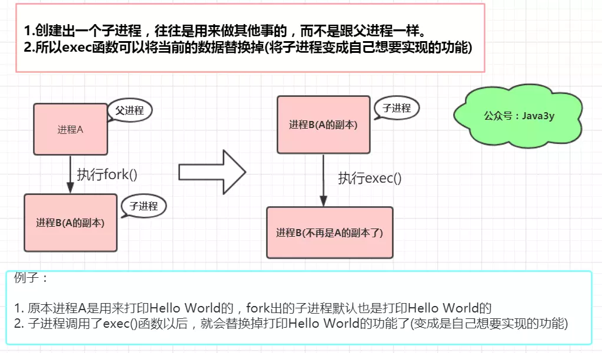
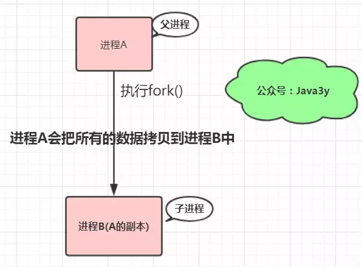

# Redis 之 Copy-on-Write 机制

## 1.Linux 下的 copy-on-write 机制

在说明 Linux 下的 copy-on-write 机制前，我们首先要知道两个函数：fork() 和 exec()。需要注意的是 exec() 并不是一个特定的函数，它是一组函数的统称，它包括了 execl()、execlp()、execv()、execle()、execve()、execvp()。

### 1.1 fork 的简单介绍

fork() 函数的定义为：fork is an operation whereby a process creates a copy of itself.

fork 是类 Unix 操作系统上创建进程的主要方法。fork 用于创建子进程 (等同于当前进程的副本)。新的进程要通过老的进程复制自身得到，这就是 fork！如果接触过 Linux，我们会知道 Linux 下 init 进程是所有进程的父进程 (相当于 Java 中的 Object 对象)，Linux 的进程都通过 init 进程或 init 的子进程 fork(vfork) 出来的。

```c{.line-numbers}
#include <unistd.h>  
#include <stdio.h>  
 
int main ()   
{   
    pid_t fpid; //fpid表示fork函数返回的值  
    int count=0;
	
	// 调用fork，创建出子进程  
    fpid=fork();

	// 所以下面的代码有两个进程执行！
    if (fpid < 0)   
        printf("创建进程失败!/n");   
    else if (fpid == 0) {  
        printf("我是子进程，由父进程fork出来/n");   
        count++;  
    }  
    else {  
        printf("我是父进程/n");   
        count++;  
    }  
    printf("统计结果是: %d/n",count);  
    return 0;  
}   
```

得到的结果为：

```c{.line-numbers}
我是子进程，由父进程fork出来

统计结果是: 1

我是父进程

统计结果是: 1
```

解释一下：fork 作为一个函数被调用。这个函数会有两次返回，将子进程的 PID 返回给父进程，0 返回给子进程。(如果小于 0，则说明创建子进程失败)。再次说明：当前进程调用 fork()，会创建一个跟当前进程完全相同的子进程 (除了 pid)，所以子进程同样是会执行 fork() 之后的代码。

所以说：

- 父进程在执行 if 代码块的时候，fpid 变量的值是子进程的 pid
- 子进程在执行 if 代码块的时候，fpid 变量的值是 0

### 1.2 exec() 函数简介

从上面我们已经知道了 fork 会创建一个子进程。子进程的是父进程的副本。exec 函数的作用就是：装载一个新的程序（可执行映像）覆盖当前进程内存空间中的映像，从而执行不同的任务。exec 系列函数在执行时会直接替换掉当前进程的地址空间。我去画张图来理解一下：

<div align="center">
    
</div>

### 1.3 Linux 中的 Copy-on-Write 机制介绍

fork() 会产生一个和父进程完全相同的子进程 (除了 pid)。如果按传统的做法，会直接将父进程的数据拷贝到子进程中，拷贝完之后，父进程和子进程之间的数据段和堆栈是相互独立的。

<div align="center">
    
</div>

但是，以我们的使用经验来说，往往子进程都会执行 exec() 来做自己想要实现的功能。所以如果按照上面的做法的话，创建子进程时复制过去的数据是没用的 (因为子进程执行 exec()，原有的数据会被清空)。既然很多时候复制给子进程的数据是无效的，于是就有了 Copy-On-Write 这项技术了，原理也很简单：

fork 创建出的子进程，与父进程共享内存空间。也就是说，如果子进程不对内存空间进行写入操作的话，内存空间中的数据并不会复制给子进程，这样创建子进程的速度就很快了，不用复制，直接引用父进程的物理空间。

在 fork 之后 exec 之前两个进程用的是相同的物理空间（内存区），子进程的代码段、数据段、堆栈都是指向父进程的物理空间，也就是说，两者的虚拟空间不同，但其对应的物理空间是同一个。当父子进程中有更改相应段的行为发生时，再为子进程相应的段分配物理空间。如果不是因为 exec，内核会给子进程的数据段、堆栈段分配相应的物理空间（至此两者有各自的进程空间，互不影响），而代码段继续共享父进程的物理空间（两者的代码完全相同）。而如果是因为 exec，由于两者执行的代码不同，子进程的代码段也会分配单独的物理空间。

Copy-on-Write 技术的实现原理：**<font color="red">fork() 之后，kernel 把父进程中所有的内存页的权限都设为 read-only，然后子进程的地址空间指向父进程</font>**。当父子进程都只读内存时，相安无事。当其中某个进程写内存时，CPU 硬件检测到内存页是 read-only 的，于是触发页异常中断（page-fault），陷入 kernel 的一个中断例程。中断例程中，kernel 就会把触发的异常的页复制一份，于是父子进程各自持有独立的一份。

Copy-on-Write 技术的好处：

- COW 技术可减少分配和复制大量资源时带来的瞬间延时。
- COW 技术可减少不必要的资源分配。比如 fork 进程时，并不是所有的页面都需要复制，父进程的代码段和只读数据段都不被允许修改，所以无需复制。

Copy On Write 技术缺点：如果在 fork() 之后，父子进程都还需要继续进行写操作，那么会产生大量的分页错误 (页异常中断 page-fault)，这样就得不偿失。

## 2. Redis 中的 Copy-on-Write 技术

Redis 在持久化时，如果是采用 BGSAVE 命令或者 BGREWRITEAOF 的方式，那 Redis 会 fork 出一个子进程来读取数据，从而写到磁盘中。总体来看，Redis 还是读操作比较多。如果子进程存在期间，发生了大量的写操作，那可能就会出现很多的分页错误 (页异常中断 page-fault)，这样就得耗费不少性能在内存复制上。

而在 rehash 阶段上，写操作是无法避免的。所以 Redis 在 fork 出子进程之后，将负载因子阈值提高，尽量减少写操作，避免不必要的内存写入操作，最大限度地节约内存。最后我们再来看一下写时复制的思想 (摘录自维基百科)：

写入时复制（英语：Copy-on-write，简称 COW）是一种计算机程序设计领域的优化策略。其核心思想是，如果有多个调用者（callers）同时请求相同资源（如内存或磁盘上的数据存储），他们会共同获取相同的指针指向相同的资源，直到某个调用者试图修改资源的内容时，系统才会真正复制一份专用副本（private copy）给该调用者，而其他调用者所见到的最初的资源仍然保持不变。这过程对其他的调用者都是透明的（transparently）。此作法主要的优点是如果调用者没有修改该资源，就不会有副本（private copy）被建立，因此多个调用者只是读取操作时可以共享同一份资源。