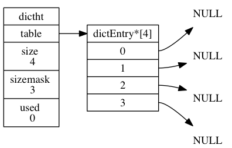
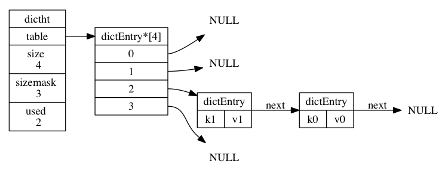

# Redis 之字典

## 1.字典简介

字典，又称为者映射 (map)，是一种用于保存键值对的抽象数据结构。在字典中，一个键 (key) 和一个值 (value) 进行关联，这些关联的键值对就称为键值对。字典中的每个键都是独一无二的，程序可以在字典中根据键查找与之关联的值，也可以通过键来更新值或者删除整个键值对。

字典在 Redis 中的使用相当广泛，首先 Redis 数据库就是使用字典来作为底层实现的，对数据库的增、删、查、改操作也是构建在对字典的操作之上的。除此之外，字典也是 Redis 中哈希键的底层实现之一。当一个哈希键包含的键值对比较多时，又或者键值对中的元素都是比较长的字符串时，Redis 就会使用字典来作为哈希键的底层实现。否则使用压缩列表来存储。

## 2.字典的实现

Redis 的字典使用哈希表作为底层实现，一个哈希表里面可以有多个哈希表节点 (dictEntry)，而每个哈希表节点就保存了字典中的一个键值对。

### 2.1.哈希表

Redis 所使用的哈希表由 dict.h/dictht 结构定义：

```c{.line-numbers}
typedef struct dictht {
    dictEntry **table; /* 哈希表数组 */
    unsigned long size; /* 哈希表大小 */
    unsigned long sizemask; /*哈希表大小掩码，用于计算索引值 总是等于 size - 1*/
    unsigned long used; /* 该哈希表已有节点的数量 */
} dictht; 
```

- table 属性是一个数组，数组中的每个元素都是一个指向 dict.h/dictEntry 结构的指针，每个 dictEntry 结构保存着一个键值对。
- size 属性记录了哈希表的大小，也即是 table 数组的大小
- used 属性则记录了哈希表目前已有节点（键值对）的数量
- sizemask 属性的值总是等于 size - 1 ，这个属性和哈希值一起决定一个键应该被放到 table 数组的哪个索引上面。一般是用哈希值对sizemask取余得到索引(哈希值 % sizemask)

下图为一个大小为 4 的空哈希表（没有包含任何键值对）：

<div align="center">
    
</div>

### 2.2.哈希表节点

哈希表节点使用 dictEntry 结构表示，每个 dictEntry 结构都保存着一个键值对：

```c{.line-numbers}
typedef struct dictEntry {
    // 键
    void *key;
    // 值
    union {
        void *val;
        uint64_t u64;
        int64_t s64;
    } v;
    // 指向下个哈希表节点，形成链表
    struct dictEntry *next;
} dictEntry; 
```

key 属性保存着键值对中的键，而 v 属性则保存着键值对中的值，其中键值对的值可以是一个指针，或者是一个 uint64_t 整数，又或者是一个 int64_t 整数。next 属性是指向另一个哈希表节点的指针，**<font color="red">这个指针可以将多个哈希值相同的键值对连接在一次，以此来解决键冲突（collision）的问题(链地址法)</font>**。

下图展示了如何通过next 指针，将两个索引值相同的键 k1 和 k0 连接在一起：

<div align="center">
    
</div>

### 2.3.字典

Redis 中的字典由 dict.h/dict 结构表示：

```c{.line-numbers}
typedef struct dict {
    // 类型特定函数
    dictType *type;
    // 私有数据
    void *privdata;
    // 哈希表
    dictht ht[2];
    // rehash 索引
    // 当 rehash 不在进行时，值为 -1
    int rehashidx; /* rehashing not in progress if rehashidx == -1 */
} dict;
```

type 属性和 privdata 属性是针对不同类型的键值对， 为创建多态字典而设置的：

- type 属性是一个指向 dictType 结构的指针， 每个 dictType 结构保存了一簇用于操作特定类
- privdata 属性则保存了需要传给那些类型特定函数的可选参数

ht 属性是一个包含两个项的数组，数组中的每个项都是一个 dictht 哈希表，一般情况下，字典只使用 ht[0] 哈希表，ht[1] 哈希表只会在对 ht[0] 哈希表进行 rehash 时使用。除了 ht[1] 之外，另一个和 rehash 有关的属性就是 rehashidx：它记录了 rehash 目前的进度，如果目前没有在进行 rehash，那么它的值为 -1。

下图展示了一个普通状态下（没有进行 rehash）的字典：