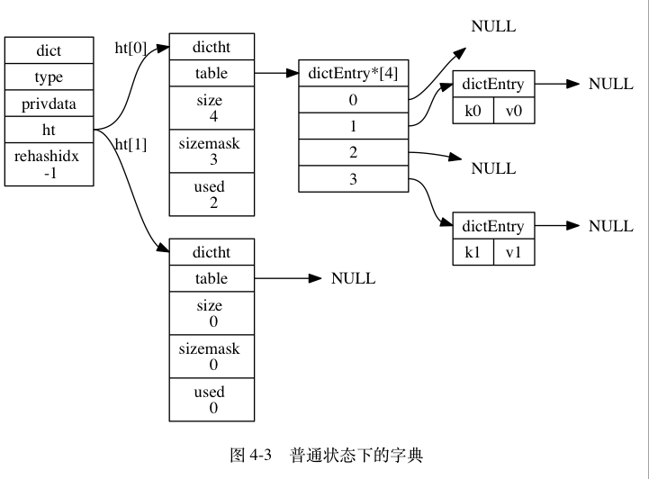
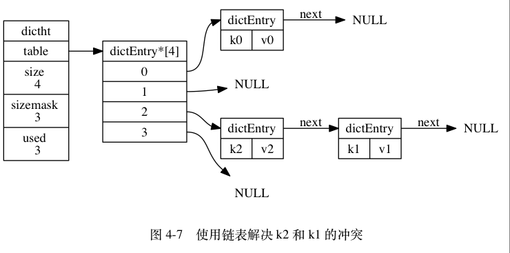

# Redis 之字典

## 1.字典简介

字典，又称为者映射 (map)，是一种用于保存键值对的抽象数据结构。在字典中，一个键 (key) 和一个值 (value) 进行关联，这些关联的键值对就称为键值对。字典中的每个键都是独一无二的，程序可以在字典中根据键查找与之关联的值，也可以通过键来更新值或者删除整个键值对。

字典在 Redis 中的使用相当广泛，首先 Redis 数据库就是使用字典来作为底层实现的，对数据库的增、删、查、改操作也是构建在对字典的操作之上的。除此之外，字典也是 Redis 中哈希键的底层实现之一。当一个哈希键包含的键值对比较多时，又或者键值对中的元素都是比较长的字符串时，Redis 就会使用字典来作为哈希键的底层实现。否则使用压缩列表来存储。

## 2.字典的实现

Redis 的字典使用哈希表作为底层实现，一个哈希表里面可以有多个哈希表节点 (dictEntry)，而每个哈希表节点就保存了字典中的一个键值对。

### 2.1.哈希表

Redis 所使用的哈希表由 dict.h/dictht 结构定义：

```c{.line-numbers}
typedef struct dictht {
    dictEntry **table; /* 哈希表数组 */
    unsigned long size; /* 哈希表大小 */
    unsigned long sizemask; /*哈希表大小掩码，用于计算索引值 总是等于 size - 1*/
    unsigned long used; /* 该哈希表已有节点的数量 */
} dictht; 
```

- table 属性是一个数组，数组中的每个元素都是一个指向 dict.h/dictEntry 结构的指针，每个 dictEntry 结构保存着一个键值对。
- size 属性记录了哈希表的大小，也即是 table 数组的大小
- used 属性则记录了哈希表目前已有节点（键值对）的数量
- sizemask 属性的值总是等于 size - 1，这个属性和哈希值一起决定一个键应该被放到 table 数组的哪个索引上面。一般是用哈希值对sizemask取余得到索引(哈希值 % sizemask)

下图为一个大小为 4 的空哈希表（没有包含任何键值对）：

<div align="center">
    
</div>

### 2.2.哈希表节点

哈希表节点使用 dictEntry 结构表示，每个 dictEntry 结构都保存着一个键值对：

```c{.line-numbers}
typedef struct dictEntry {
    // 键
    void *key;
    // 值
    union {
        void *val;
        uint64_t u64;
        int64_t s64;
    } v;
    // 指向下个哈希表节点，形成链表
    struct dictEntry *next;
} dictEntry; 
```

key 属性保存着键值对中的键，而 v 属性则保存着键值对中的值，其中键值对的值可以是一个指针，或者是一个 uint64_t 整数，又或者是一个 int64_t 整数。next 属性是指向另一个哈希表节点的指针，**<font color="red">这个指针可以将多个哈希值相同的键值对连接在一次，以此来解决键冲突（collision）的问题(链地址法)</font>**。

下图展示了如何通过next 指针，将两个索引值相同的键 k1 和 k0 连接在一起：

<div align="center">
    
</div>

### 2.3.字典

Redis 中的字典由 dict.h/dict 结构表示：

```c{.line-numbers}
typedef struct dict {
    // 类型特定函数
    dictType *type;
    // 私有数据
    void *privdata;
    // 哈希表
    dictht ht[2];
    // rehash 索引
    // 当 rehash 不在进行时，值为 -1
    int rehashidx; /* rehashing not in progress if rehashidx == -1 */
} dict;
```

type 属性和 privdata 属性是针对不同类型的键值对，为创建多态字典而设置的：

- type 属性是一个指向 dictType 结构的指针，每个 dictType 结构保存了一簇用于操作特定类
- privdata 属性则保存了需要传给那些类型特定函数的可选参数

ht 属性是一个包含两个项的数组，数组中的每个项都是一个 dictht 哈希表，一般情况下，字典只使用 ht[0] 哈希表，ht[1] 哈希表只会在对 ht[0] 哈希表进行 rehash 时使用。除了 ht[1] 之外，另一个和 rehash 有关的属性就是 rehashidx：它记录了 rehash 目前的进度，如果目前没有在进行 rehash，那么它的值为 -1。

下图展示了一个普通状态下（没有进行 rehash）的字典：

<div align="center">
    
</div>

### 2.4 哈希算法

当要将一个新的键值对添加到字典里面时，程序需要先根据键值对的键计算出哈希值和索引值，然后再根据索引值，将包含新键值对的哈希表节点放到哈希表数组的指定索引上面。Redis 计算哈希值和索引值的方法如下：

```c{.line-numbers}
// 使用字典设置的哈希函数，计算键 key 的哈希值
hash = dict->type->hashFunction(key);

// 使用哈希表的 sizemask 属性和哈希值，计算出索引值，等价于hash % size
// 根据情况不同，ht[x] 可以是 ht[0] 或者 ht[1]
index = hash & dict->ht[x].sizemask; 
```

### 2.5 解决键冲突

Redis 的哈希表使用链地址法（separate chaining）来解决键冲突：每个哈希表节点都有一个 next 指针，多个哈希表节点可以用 next 指针构成一个单向链表，被分配到同一个索引上的多个节点可以用这个单向链表连接起来，这就解决了键冲突的问题。举个例子，假设程序要将键值对 k2 和 v2 添加到哈希表里面，并且计算得出 k2 的索引值为 2，那么键 k1 和 k2 将产生冲突，而解决冲突的办法就是使用 next 指针将键 k2 和 k1 所在的节点连接起来，如下图所示。

<div align="center">
    
</div>

### 2.6 Rehash

#### 2.6.1 redis 进行 rehash 的步骤

随着操作的不断执行，哈希表保存的键值对会逐渐地增多或者减少，为了让哈希表的负载因子（load factor，ht[0].used / ht[0].size）维持在一个合理的范围之内，当哈希表保存的键值对数量太多或者太少时，程序需要对哈希表的大小进行相应的扩展或者收缩。扩展和收缩哈希表的工作可以通过执行 rehash（重新散列）操作来完成，Redis 对字典的哈希表执行 rehash 的步骤如下：

1. 为字典的 ht[1] 哈希表分配空间，这个哈希表的空间大小取决于要执行的操作，以及 ht[0] 当前包含的键值对数量（也即是 ht[0].used 属性的值）：
   1. 如果执行的是扩展操作，那么 ht[1] 的大小为第一个大于等于 ht[0].used * 2 的 2^n（2 的 n 次方幂）；
   2. 如果执行的是收缩操作，那么 ht[1] 的大小为第一个大于等于 ht[0].used 的 2^n；
2. 将保存在 ht[0] 中的所有键值对 rehash 到 ht[1] 上面：rehash 指的是重新计算键的哈希值和索引值，然后将键值对放置到 ht[1] 哈希表的指定位置上；
3. 当 ht[0] 包含的所有键值对都迁移到了 ht[1] 之后（ht[0] 变为空表），释放 ht[0]，将 ht[1] 设置为 ht[0]，并在 ht[1] 新创建一个空白哈希表，为下一次 rehash 做准备；

#### 2.6.2 Redis 进行 Rehash 的条件

当以下条件中的任意一个被满足时，程序会自动开始对哈希表执行扩展操作：

- 服务器目前没有在执行 BGSAVE 命令或者 BGREWRITEAOF 命令，并且哈希表的负载因子大于等于 1 ；
- 服务器目前正在执行 BGSAVE 命令或者 BGREWRITEAOF 命令，并且哈希表的负载因子大于等于 5 ；

其中哈希表的负载因子可以通过公式：

```sql{.line-numbers}
# 负载因子 = 哈希表已保存节点数量 / 哈希表大小
load_factor = ht[0].used / ht[0].size 
```

根据 BGSAVE 命令或 BGREWRITEAOF 命令是否正在执行，服务器执行扩展操作所需的负载因子并不相同，这是因为在执行 BGSAVE 命令或 BGREWRITEAOF 命令的过程中，Redis 需要创建当前服务器进程的子进程，而大多数操作系统都采用写时复制（copy-on-write）技术来优化子进程的使用效率，所以在子进程存在期间，服务器会提高执行扩展操作所需的负载因子，从而尽可能地避免在子进程存在期间进行哈希表扩展操作，这可以避免不必要的内存写入操作，最大限度地节约内存。

另一方面，当哈希表的负载因子小于 0.1 时，程序自动开始对哈希表执行收缩操作。

## 3.渐进式 Rehash

如果字典中键值对的数目很多，那么服务器在进行 rehash 的时候，由于庞大的计算量可能会使得服务器在一段时间内停止对外界提供服务。因此 Redis 中，服务器不是一次性将 ht[0] 里面的所有键值对全部 rehash 到 ht[1]，而是分多次、渐进式地将 ht[0] 里面的键值对慢慢地 rehash 到 ht[1]。

### 3.1 扩容

redis 中，每次插入键值对时，都会检查是否需要扩容。如果满足扩容条件，则进行扩容。在向 redis 中添加键时都会依次调用 **`dictAddRaw –> _dictKeyIndex –> _dictExpandIfNeeded`** 函数，在 **`_dictExpandIfNeeded`** 函数中会判断是否需要扩容。

```c{.line-numbers}
/*
 * 根据需要，初始化字典（的哈希表），或者对字典（的现有哈希表）进行扩展
 */
static int _dictExpandIfNeeded(dict *d)
{
    // 渐进式 rehash 已经在进行了，直接返回
    if (dictIsRehashing(d)) return DICT_OK;

    // 如果字典（的 0 号哈希表）为空，那么创建并返回初始化大小(默认为4)的 0 号哈希表
    // T = O(1)
    if (d->ht[0].size == 0) return dictExpand(d, DICT_HT_INITIAL_SIZE);

    // 一下两个条件之一为真时，对字典进行扩展
    // 1）字典已使用节点数和字典大小之间的比率接近 1：1
    //    并且 dict_can_resize 为真
    // 2）已使用节点数和字典大小之间的比率超过 dict_force_resize_ratio
    if (d->ht[0].used >= d->ht[0].size &&
        (dict_can_resize ||
         d->ht[0].used/d->ht[0].size > dict_force_resize_ratio))
    {
        // 新哈希表的大小至少是目前已使用节点数的两倍
        // T = O(N)
        return dictExpand(d, d->ht[0].used*2);
    }

    return DICT_OK;
} 
```

从上面代码和注释可以看到，如果没有进行初始化或者满足扩容条件则对字典进行扩容。先来看看字典初始化，在 redis 中字典中的 hash 表也是采用延迟初始化策略，在创建字典的时候并没有为哈希表分配内存，只有当第一次插入数据时，才真正分配内存。看看字典创建函数 dictCreate。

```c{.line-numbers}
/* Create a new hash table */
dict *dictCreate(dictType *type,
        void *privDataPtr)
{
    dict *d = zmalloc(sizeof(*d));

    _dictInit(d,type,privDataPtr);
    return d;
}

/* Initialize the hash table */
int _dictInit(dict *d, dictType *type,
        void *privDataPtr)
{
    _dictReset(&d->ht[0]);
    _dictReset(&d->ht[1]);
    d->type = type;
    d->privdata = privDataPtr;
    d->rehashidx = -1;
    d->iterators = 0;
    return DICT_OK;
}

static void _dictReset(dictht *ht)
{
    ht->table = NULL;
    ht->size = 0;
    ht->sizemask = 0;
    ht->used = 0;
} 
```

从上面的创建过程可以看出，ht[0].table 为 NULL，且 ht[0].size 为 0，直到第一次插入数据时，才调用 dictExpand 函数初始化。我们再看看 dict_can_resize 字段，该字段在 dictEnableResize 和 dictDisableResize 函数中分别赋值 1 和 0，在 updateDictResizePolicy 函数中会调用者两个函数。

```c{.line-numbers}
void updateDictResizePolicy(void) {
    if (server.rdb_child_pid == -1 && server.aof_child_pid == -1)
        dictEnableResize();
    else
        dictDisableResize();
}

void dictEnableResize(void) {
    dict_can_resize = 1;
}

void dictDisableResize(void) {
    dict_can_resize = 0;
} 
```

而在 redis 中每次开始执行 aof 文件重写或者开始生成新的 RDB 文件或者执行 aof 重写/ 生成 RDB 的子进程结束时，都会调用 updateDictResizePolicy 函数，所以从该函数中，也可以看出来，如果当前没有子进程在执行 aof 文件重写或者生成 RDB 文件，则运行进行字典扩容；否则禁止字典扩容。综上，字典扩容需要同时满足如下两个条件：

- 当前没有子进程在执行 aof 文件重写或者生成 RDB 文件，哈希表中保存的 key 数量超过了哈希表的大小（可以看出 size 既是哈希表大小，同时也是扩容阈值）；
- 保存的节点数与哈希表大小的比例超过了安全阈值（默认值为 5）；

### 3.2 缩容

当哈希表的负载因子小于 0.1 时，程序自动开始对哈希表执行收缩操作。在周期函数 serverCron 中，调用 databasesCron 函数，该函数中会调用 tryResizeHashTables 函数检查用于保存键值对的 redis 数据库字典是否需要缩容。如果需要则调用 dictResize 进行缩容，dictResize 函数中也是调用 dictExpand 函数。

看看 databasesCron 中相关部分：

```c{.line-numbers}
// 对数据库执行删除过期键，调整数据库键空间的大小，以及主动和渐进式 rehash
void databasesCron(void) {

    // 函数先从数据库中删除过期键，然后再对数据库的大小进行修改
    // 如果服务器不是从服务器，那么执行主动过期键清除
    if (server.active_expire_enabled && server.masterhost == NULL)
        // 清除模式为 CYCLE_SLOW ，这个模式会尽量多清除过期键
        activeExpireCycle(ACTIVE_EXPIRE_CYCLE_SLOW);

    // 在没有 BGSAVE 或者 BGREWRITEAOF 执行时，对哈希表进行 rehash
    if (server.rdb_child_pid == -1 && server.aof_child_pid == -1) {
        static unsigned int resize_db = 0;
        static unsigned int rehash_db = 0;
        unsigned int dbs_per_call = REDIS_DBCRON_DBS_PER_CALL;
        unsigned int j;

        /* Don't test more DBs than we have. */
        // 设定要测试的数据库数量
        if (dbs_per_call > server.dbnum) dbs_per_call = server.dbnum;

        /* Resize */
        // 调整字典的大小，也就是如果负载因子过小的话，缩小字典的大小
        for (j = 0; j < dbs_per_call; j++) {
            tryResizeHashTables(resize_db % server.dbnum);
            resize_db++;
        }

        //....
    }

}
```

可以看到要检查是否需要缩容的前提也是当前没有子进程执行 aof 重写或者生成 RDB 文件。

```c{.line-numbers}
/* If the percentage of used slots in the HT reaches HASHTABLE_MIN_FILL
 * we resize the hash table to save memory */
void tryResizeHashTables(int dbid) {
    if (htNeedsResize(server.db[dbid].dict))
        dictResize(server.db[dbid].dict);
    if (htNeedsResize(server.db[dbid].expires))
        dictResize(server.db[dbid].expires);
}

/* Hash table parameters */
#define HASHTABLE_MIN_FILL        10      /* Minimal hash table fill 10% */
int htNeedsResize(dict *dict) {
    long long size, used;

    size = dictSlots(dict);
    used = dictSize(dict);
    return (size > DICT_HT_INITIAL_SIZE &&
            (used*100/size < HASHTABLE_MIN_FILL));
}

/* Resize the table to the minimal size that contains all the elements,
 * but with the invariant of a USED/BUCKETS ratio near to <= 1 */
int dictResize(dict *d)
{
    int minimal;

    if (!dict_can_resize || dictIsRehashing(d)) return DICT_ERR;
    minimal = d->ht[0].used;
    if (minimal < DICT_HT_INITIAL_SIZE)
        minimal = DICT_HT_INITIAL_SIZE;
    return dictExpand(d, minimal);
} 
```

从 htNeedsResize 函数中可以看到，当哈希表保存的 key 数量与哈希表的大小的比例小于 10% 时需要缩容。最小容量为 4。

从 dictResize 函数中可以看到缩容时，缩容后的哈希表大小为当前哈希表中 key 的数量，当然经过 dictExpand 函数中_dictNextPower 函数计算后，缩容后的大小为第一个大于等于当前 key 数量的 2 的 n 次方。最小容量为 4。同样从 dictResize 函数中可以看到，如果当前正在执行 BGSAVE 命令或者 BGREWRITEAOF 命令，则不进行缩容。

### 3.3 渐进式 Rehash

#### 3.3.1 渐进式 Rehash 初始化

从上面可以看到，不管是扩容还是缩容，最终都是调用 dictExpand 函数来完成。看看 dictExpand 函数实现。

```c{.line-numbers}
/*
 * 创建一个新的哈希表，并根据字典的情况，选择以下其中一个动作来进行：
 *
 * 1) 如果字典的 0 号哈希表为空，那么将新哈希表设置为 0 号哈希表
 * 2) 如果字典的 0 号哈希表非空，那么将新哈希表设置为 1 号哈希表，
 *    并打开字典的 rehash 标识，使得程序可以开始对字典进行 rehash
 *
 * size 参数不够大，或者 rehash 已经在进行时，返回 DICT_ERR 。
 *
 * 成功创建 0 号哈希表，或者 1 号哈希表时，返回 DICT_OK 。
 */
int dictExpand(dict *d, unsigned long size)
{
    // 新哈希表
    dictht n; /* the new hash table */

    // 根据 size 参数，计算哈希表的大小
    unsigned long realsize = _dictNextPower(size);

    // 不能在字典正在 rehash 时进行
    // size 的值也不能小于 0 号哈希表的当前已使用节点
    if (dictIsRehashing(d) || d->ht[0].used > size)
        return DICT_ERR;

    // 为哈希表分配空间，并将所有指针指向 NULL
    n.size = realsize;
    n.sizemask = realsize-1;
    // T = O(N)
    n.table = zcalloc(realsize*sizeof(dictEntry*));
    n.used = 0;

    // 如果 0 号哈希表为空，那么这是一次初始化：
    // 程序将新哈希表赋给 0 号哈希表的指针，然后字典就可以开始处理键值对了。
    if (d->ht[0].table == NULL) {
        d->ht[0] = n;
        return DICT_OK;
    }

    // 如果 0 号哈希表非空，那么这是一次 rehash ：
    // 程序将新哈希表设置为 1 号哈希表，
    // 并将字典的 rehash 标识打开，让程序可以开始对字典进行 rehash
    d->ht[1] = n;
    d->rehashidx = 0;
    return DICT_OK;
} 
```

可以看到该函数计算一个新的哈希表大小，满足 2 的 n 次方，为什么要满足 2 的 n 次方？因为哈希表掩码 sizemask 为 size-1，当 size 满足 2 的 n 次方时，计算每个 key 的索引值时只需要用 key 的 hash 值与掩码 sizemask 进行位与操作，替代求余操作，计算更快。

然后分配了一个新的哈希表，为该哈希表分配了新的大小的内存。最后将该哈希表赋值给字典的 ht[1]，然后将 rehashidx 赋值为 0，打开渐进式 rehash 标志。同时该值也标志渐进式 rehash 当前已经进行到了哪个 hash 槽。从该函数中，我们并没有看到真正执行哈希表 rehash 的相关操作，只是分配了一个新的哈希表就结束了。我们知道哈希表 rehash 需要遍历原有的整个哈希表，对原有的所有 key 进行重新 hash，存放到新的哈希槽。在 redis 的实现中，没有集中的将原有的 key 重新 rehash 到新的槽中，而是分解到各个命令的执行中，以及周期函数中。

#### 3.3.2 操作辅助 rehash

在 redis 中每一个增删改查命令中都会判断数据库字典中的哈希表是否正在进行渐进式 rehash，如果是则帮助执行一次。

```c{.line-numbers}
dictEntry *dictAddRaw(dict *d, void *key, dictEntry **existing) {

    long index;
    dictEntry *entry;
    dictht *ht;

    if (dictIsRehashing(d)) _dictRehashStep(d);
    ......
} 
```

类似的在 dictFind、dictGenericDelete、dictGetRandomKey、dictGetSomeKeys 等函数中都有以下语句判断是否正在进行渐进式 rehash。

```c{.line-numbers}
if (dictIsRehashing(d)) _dictRehashStep(d);
//dictIsRehashing(d)定义如下，rehashidx不等于-1即表示正在进行渐进式rehash
#define dictIsRehashing(d) ((d)->rehashidx != -1) 
```

_dictRehashStep 函数的定义如下：

```c{.line-numbers}
/*
 * 在字典不存在安全迭代器的情况下，对字典进行单步 rehash 。
 *
 * 字典有安全迭代器的情况下不能进行 rehash ，
 * 因为两种不同的迭代和修改操作可能会弄乱字典。
 *
 * 这个函数被多个通用的查找、更新操作调用，
 * 它可以让字典在被使用的同时进行 rehash 。
 *
 */
static void _dictRehashStep(dict *d) {
    if (d->iterators == 0) dictRehash(d,1);
} 
```

#### 3.3.3 定时辅助 rehash

虽然 redis 实现了在读写操作时，辅助服务器进行渐进式 rehash 操作，但是如果服务器比较空闲，redis 数据库将很长时间内都一直使用两个哈希表。所以在 redis 周期函数中，如果发现有字典正在进行渐进式 rehash 操作，则会花费 1 毫秒的时间，帮助一起进行渐进式 rehash 操作。

在 databasesCron 函数中，实现如下：

```c{.line-numbers}
/* Rehash */
// 对字典进行渐进式 rehash
if (server.activerehashing) {
    for (j = 0; j < dbs_per_call; j++) {
        int work_done = incrementallyRehash(rehash_db % server.dbnum);
        rehash_db++;
        if (work_done) {
            /* If the function did some work, stop here, we'll do
             * more at the next cron loop. */
            break;
        }
    }
}
```

前提是配置了 activerehashing，允许服务器在周期函数中辅助进行渐进式 rehash，该参数默认值是 1。

```c{.line-numbers}
/* 
 * 虽然服务器在对数据库执行读取/写入命令时会对数据库进行渐进式 rehash ，
 * 但如果服务器长期没有执行命令的话，数据库字典的 rehash 就可能一直没办法完成，
 * 为了防止出现这种情况，我们需要对数据库执行主动 rehash 。
 *
 * 函数在执行了主动 rehash 时返回 1 ，否则返回 0 。
 */
int incrementallyRehash(int dbid) {

    /* Keys dictionary */
    if (dictIsRehashing(server.db[dbid].dict)) {
        dictRehashMilliseconds(server.db[dbid].dict,1);
        return 1; /* already used our millisecond for this loop... */
    }

    /* Expires */
    if (dictIsRehashing(server.db[dbid].expires)) {
        dictRehashMilliseconds(server.db[dbid].expires,1);
        return 1; /* already used our millisecond for this loop... */
    }

    return 0;
}

/*
 * 在给定毫秒数内，以 100 步为单位，对字典进行 rehash 。
 */
int dictRehashMilliseconds(dict *d, int ms) {
    // 记录开始时间
    long long start = timeInMilliseconds();
    int rehashes = 0;

    while(dictRehash(d,100)) {
        rehashes += 100;
        // 如果时间已过，跳出
        if (timeInMilliseconds()-start > ms) break;
    }

    return rehashes;
} 
```

#### 3.3.4 渐进式 rehash 的实现

从上面可以看到，不管是在操作中辅助 rehash 执行，还是在周期函数中辅助执行，最终都是调用 dictRehash 函数。

```c{.line-numbers}
/*
 * 执行 N 步渐进式 rehash 。
 *
 * 返回 1 表示仍有键需要从 0 号哈希表移动到 1 号哈希表，
 * 返回 0 则表示所有键都已经迁移完毕。
 *
 * Note that a rehashing step consists in moving a bucket (that may have more
 * than one key as we use chaining) from the old to the new hash table.
 *
 * 注意，每步 rehash 都是以一个哈希表索引（桶）作为单位的，
 * 一个桶里可能会有多个节点，
 * 被 rehash 的桶里的所有节点都会被移动到新哈希表。
 */
int dictRehash(dict *d, int n) {

    // 只可以在 rehash 进行中时执行
    if (!dictIsRehashing(d)) return 0;

    // 进行 N 步迁移
    // T = O(N)
    while(n--) {
        dictEntry *de, *nextde;

        /* Check if we already rehashed the whole table... */
        // 如果 0 号哈希表为空，那么表示 rehash 执行完毕
        // T = O(1)
        if (d->ht[0].used == 0) {
            // 释放 0 号哈希表
            zfree(d->ht[0].table);
            // 将原来的 1 号哈希表设置为新的 0 号哈希表
            d->ht[0] = d->ht[1];
            // 重置旧的 1 号哈希表
            _dictReset(&d->ht[1]);
            // 关闭 rehash 标识
            d->rehashidx = -1;
            // 返回 0 ，向调用者表示 rehash 已经完成
            return 0;
        }

        /* Note that rehashidx can't overflow as we are sure there are more
         * elements because ht[0].used != 0 */
        // 确保 rehashidx 没有越界
        assert(d->ht[0].size > (unsigned)d->rehashidx);

        // 略过数组中为空的索引，找到下一个非空索引
        while(d->ht[0].table[d->rehashidx] == NULL) d->rehashidx++;

        // 指向该索引的链表表头节点
        de = d->ht[0].table[d->rehashidx];
        /* Move all the keys in this bucket from the old to the new hash HT */
        // 将链表中的所有节点迁移到新哈希表
        // T = O(1)
        // 代码省略......
        // 将刚迁移完的哈希表索引的指针设为空
        d->ht[0].table[d->rehashidx] = NULL;
        // 更新 rehash 索引
        d->rehashidx++;
    }

    return 1;
} 
```

#### 3.3.5 渐进式 rehash 执行期间的哈希表操作

因为在进行渐进式 rehash 的过程中，字典会同时使用 ht[0] 和 ht[1] 两个哈希表，所以在渐进式 rehash 进行期间，字典的删除（delete）、查找（find）、更新（update）等操作会在两个哈希表上进行：比如说，要在字典里面查找一个键的话，程序会先在 ht[0] 里面进行查找，如果没找到的话，就会继续到 ht[1] 里面进行查找，诸如此类。

另外，在渐进式 rehash 执行期间，新添加到字典的键值对一律会被保存到 ht[1] 里面，而 ht[0] 则不再进行任何添加操作： 这一措施保证了 ht[0] 包含的键值对数量会只减不增，并随着 rehash 操作的执行而最终变成空表。

渐进式 rehash 带来的问题：渐进式 rehash 避免了 redis 阻塞，可以说非常完美，但是由于在 rehash 时，需要分配一个新的 hash 表，在 rehash 期间，同时有两个 hash 表在使用，会使得 redis 内存使用量瞬间突增，在 Redis 满容状态下由于 Rehash 会导致大量 Key 驱逐。