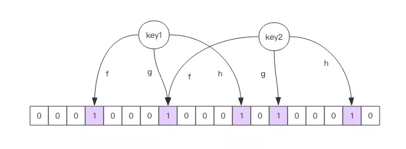
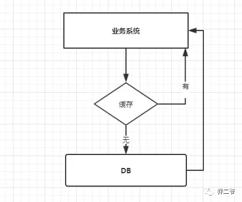
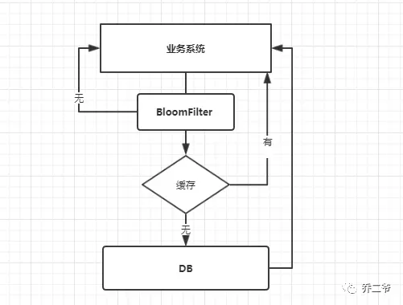

# Redis 之布隆过滤器

## 1.布隆过滤器

### 1.1 布隆过滤器的原理

布隆过滤器是一个神奇的数据结构，可以用来判断一个元素是否在一个集合中。很常用的一个功能是用来去重。在爬虫中常见的一个需求：目标网站 URL 千千万，怎么判断某个 URL 爬虫是否宠幸过？简单点可以爬虫每采集过一个 URL，就把这个 URL 存入数据库中，每次一个新的 URL 过来就到数据库查询下是否访问过。

```sql{.line-numbers}
select id from table where url = 'https://jaychen.cc' 
```

但是随着爬虫爬过的 URL 越来越多，每次请求前都要访问数据库一次，并且对于这种字符串的 SQL 查询效率并不高。除了数据库之外，使用 Redis 的 set 结构也可以满足这个需求，并且性能优于数据库。但是 Redis 也存在一个问题：耗费过多的内存。这个时候布隆过滤器就很横的出场了：这个问题让我来。

相比于数据库和 Redis，使用布隆过滤器可以很好的避免性能和内存占用的问题。布隆过滤器本质是一个位数组，位数组就是数组的每个元素都只占用 1 bit 。每个元素只能是 0 或者 1。这样申请一个 10000 个元素的位数组只占用 10000 / 8 = 1250 B 的空间。布隆过滤器除了一个位数组，还有 K 个哈希函数。当一个元素加入布隆过滤器中的时候，会进行如下操作：

- 使用 K 个哈希函数对元素值进行 K 次计算，得到 K 个哈希值。
- 根据得到的哈希值，在位数组中把对应下标的值置为 1。

举个🌰，假设布隆过滤器有 3 个哈希函数：f1, f2, f3 和一个位数组 arr。现在要把 https://jaychen.cc 插入布隆过滤器中：

- 对值进行三次哈希计算，得到三个值 n1, n2, n3。
- 把位数组中三个元素 arr[n1], arr[n2], arr[n3] 置为 1。

当要判断一个值是否在布隆过滤器中，对元素再次进行哈希计算，得到值之后判断位数组中的每个元素是否都为 1，如果值都为 1，那么说明这个值可能在布隆过滤器中，如果存在一个值不为 1，说明该元素一定不在布隆过滤器中。

<div align="center">
    
</div>

看了上面的说明，必然会提出一个问题：当插入的元素原来越多，位数组中被置为 1 的位置就越多，当一个不在布隆过滤器中的元素，经过哈希计算之后，得到的值在位数组中查询，有可能这些位置也都被置为 1。这样一个不存在布隆过滤器中的也有可能被误判成在布隆过滤器中。但是如果布隆过滤器判断说一个元素不在布隆过滤器中，那么这个值就一定不在布隆过滤器中。简单来说：

- 布隆过滤器说某个元素在，可能存在也可能不存在。
- 布隆过滤器说某个元素不在，那么一定不在。

这个布隆过滤器的缺陷放到上面爬虫的需求中，可能存在某些没有访问过的 URL 可能会被误判为访问过，但是如果是访问过的 URL 一定不会被误判为没访问过。

### 1.2 空间占用估计

布隆过滤器的空间占用有一个简单的计算公式，但是推导比较繁琐，这里就省去推导过程了，直接引出计算公式。

布隆过滤器有两个参数，第一个是预计元素的数量 n，第二个是错误率 f。公式根据这两个输入得到两个输出，第一个输出是位数组的长度 l，也就是需要的存储空间大小 (bit)，第二个输出是 hash 函数的最佳数量 k。hash 函数的数量也会直接影响到错误率，最佳的数量会有最低的错误率。

```c{.line-numbers}
k = 0.7*(l/n)  #k：哈希函数的数量 约等于
f = 0.6185^(l/n)  #f：错误率 ^ 表示次方计算，也就是 math.pow 
```

从公式中可以看出：

1. 位数组相对越长 (l/n)，错误率 f 越低，这个和直观上理解是一致的
2. 位数组相对越长 (l/n)，hash 函数需要的最佳数量也越多，影响计算效率
3. 当一个元素平均需要 1 个字节 (8bit) 的指纹空间时 (l/n=8)，错误率大约为 2%
4. 错误率为 10%，一个元素需要的平均指纹空间为 4.792 个 bit，大约为 5bit
5. 错误率为 1%，一个元素需要的平均指纹空间为 9.585 个 bit，大约为 10bit
6. 错误率为 0.1%，一个元素需要的平均指纹空间为 14.377 个 bit，大约为 15bit

你也许会想，如果一个元素需要占据 15 个 bit，那相对 set 集合的空间优势是不是就没有那么明显了？这里需要明确的是，set 中会存储每个元素的内容，而布隆过滤器仅仅存储元素的指纹。元素的内容大小就是字符串的长度，它一般会有多个字节，甚至是几十个上百个字节，每个元素本身还需要一个指针被 set 集合来引用，这个指针又会占去 4 个字节或 8 个字节，取决于系统是 32bit 还是 64bit。而指纹空间只有接近 2 个字节，所以布隆过滤器的空间优势还是非常明显的。

### 1.3 布隆过滤器的缺点

但是布隆过滤器的缺点和优点一样明显。误算率是其中之一。随着存入的元素数量增加，误算率随之增加。但是如果元素数量太少，则使用散列表足矣。

另外，一般情况下不能从布隆过滤器中删除元素。我们很容易想到把位数组变成整数数组，每插入一个元素相应的计数器加 1, 这样删除元素时将计数器减掉就可以了。然而要保证安全地删除元素并非如此简单。首先我们必须保证删除的元素的确在布隆过滤器里面。这一点单凭这个过滤器是无法保证的。另外计数器回绕也会造成问题。在降低误算率方面，有不少工作，使得出现了很多布隆过滤器的变种。

## 2.Redis 中的布隆过滤器

redis 布隆过滤器主要就两个命令：

- **<font color="red">bf.add</font>** 添加元素到布隆过滤器中：**<font color="red">bf.add urls</font>** https://jaychen.cc
- **<font color="red">bf.exists</font>** 判断某个元素是否在过滤器中：**<font color="red">bf.exists urls</font>** https://jaychen.cc

上面说过布隆过滤器存在误判的情况，在 redis 中有两个值决定布隆过滤器的准确率：

- error_rate：允许布隆过滤器的错误率，这个值越低过滤器的位数组的大小越大，占用空间也就越大
- initial_size：布隆过滤器可以储存的元素个数，当实际存储的元素个数超过这个值之后，过滤器的准确率会下降

redis 中有一个命令可以来设置这两个值：

```c{.line-numbers}
bf.reserve urls 0.01 100 
```

三个参数的含义：

- 第一个值是过滤器的名字。
- 第二个值为 error_rate 的值。
- 第三个值为 initial_size 的值。

使用这个命令要注意一点：执行这个命令之前过滤器的名字应该不存在，**<font color="red">如果执行之前就存在会报错：(error) ERR item exists</font>**。

## 3.缓存穿透

在我们使用缓存的时候，我们的业务系统大概的调用流程就是如下图：

<div align="center">
    
</div>

当我们查询一条数据时，先去查询缓存，如果缓存有就直接返回，如果没有就去查询数据库，然后返回。这种情况下就可能会出现一些现象。

正常情况下，我们去查询数据都是存在。那么请求去查询一条压根儿数据库中根本就不存在的数据，**<font color="red">也就是缓存和数据库都查询不到这条数据</font>**，但是请求每次都会打到数据库上面去。**<font color="red">这种查询不存在数据的现象我们称为缓存穿透</font>**。试想一下，如果有黑客会对你的系统进行攻击，拿一个不存在的 id 去查询数据，会产生大量的请求到数据库去查询。可能会导致你的数据库由于压力过大而宕掉。

解决的方案有两个如下：

### 3.1 缓存空值

之所以会发生穿透，就是因为缓存中没有存储这些空数据的 key。从而导致每次查询都到数据库去了。那么我们就可以为这些 key 对应的值设置为 null 丢到缓存里面去。后面再出现查询这个 key 的请求的时候，直接返回 null 。这样，就不用在到数据库中去走一圈了，但是别忘了设置过期时间。

### 3.2 BloomFilter

BloomFilter 类似于一个 hbase set 用来判断某个元素（key）是否存在于某个集合中。这种方式在大数据场景应用比较多，比如 Hbase 中使用它去判断数据是否在磁盘上。还有在爬虫场景判断 url 是否已经被爬取过。这种方案可以加在第一种方案中，在缓存之前在加一层 BloomFilter 。将所有可能存在的数据添加到布隆过滤器中，一个一定不存在的数据在绝大多数情况下会被拦截掉，从而避免了对底层存储系统的查询压力。在查询的时候先去 BloomFilter 去查询 key 是否存在，如果不存在就直接返回，存在再走查缓存 -> 查 DB。

<div align="center">
    
</div>

### 3.3 缓存击穿

缓存击穿是我们可能遇到的第二个使用缓存方案可能遇到的问题。在平常高并发的系统中，大量的请求同时查询一个 key 时，此时这个 key 正好失效了，就会导致大量的请求都打到数据库上面去。这种现象我们称为缓存击穿，这样会造成某一时刻数据库请求量过大，压力剧增。

上面的现象是多个线程同时去查询数据库的这条数据，那么我们可以在第一个查询数据的请求上使用一个 互斥锁来锁住它。其他的线程走到这一步拿不到锁就等着，等第一个线程查询到了数据，然后做缓存。后面的线程进来发现已经有缓存了，就直接走缓存。

### 3.4 缓存雪崩

缓存雪崩是指在我们设置缓存时采用了相同的过期时间，导致缓存在某一时刻同时失效，请求全部转发到 DB，DB 瞬时压力过重雪崩。缓存失效时的雪崩效应对底层系统的冲击非常可怕。**<font color="red">大多数系统设计者考虑用加锁或者队列的方式保证缓存的单线程（进程）写，从而避免失效时大量的并发请求落到底层存储系统上</font>**。这里分享一个简单方案就时讲缓存失效时间分散开，比如我们可以在原有的失效时间基础上增加一个随机值，比如 1-5 分钟随机，这样每一个缓存的过期时间的重复率就会降低，就很难引发集体失效的事件。