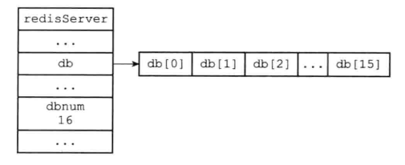
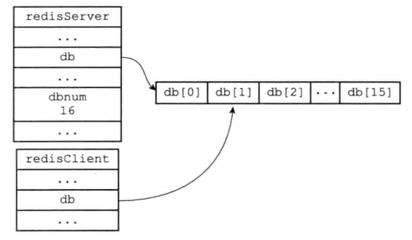
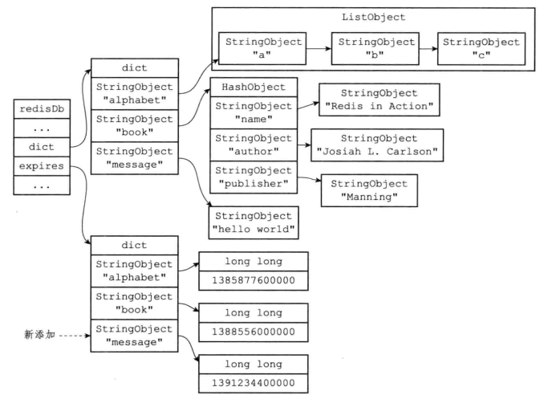
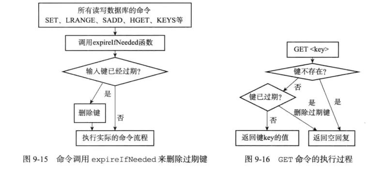

# Redis 之键的过期策略

## 1.Redis 数据库

### 1.1 服务器中的数据库

在介绍 Redis 的过期键策略之前，先讲解一下，键值对是如何在 Redis 数据库中存储的。Redis 服务器将所有数据库保存在服务器状态 redis.h/redisServer 结构的 db 数组中，db 数组的每个项都是一个 redis.h/redisDb 结构，每一个 redisDb 结构代表一个数据库。**<font color="red">在初始化服务器时，程序会根据服务器状态 redisServer 的 dbnum 属性来决定应该创建多少个数据库</font>**。

```c{.line-numbers}
struct redisServer {
    //....

    // serverCron() 每秒调用的次数
    int hz;                  
    // 一个数组，保存着服务器中的所有数据库
    redisDb *db;
    //服务器中数据库的数量
    int dbnum; 

    //....
} 
```

dbnum 的属性值由服务器配置的 database 选项来决定，默认情况下，该选项的值为 16，所以 Redis 服务器默认会创建 16 个数据库。

<div align="center">
    
</div>

每个 Redis 客户端都有自己的目标数据库，每当客户端执行数据库写命令或者客户端读命令时，目标数据库就会成为这些命令的操作对象。**<font color="red">默认情况下，Redis 客户端的目标数据库是 0 号数据库，但是客户端可以执行 select 命令来切换数据库</font>**。在服务器内部，客户端状态 redisClient 结构的 db 属性记录了客户端当前的目标数据库，这个属性是一个指向 redisDb 结构的指针。

```c{.line-numbers}
typedef struct redisClient {

    // 套接字描述符
    int fd;
    // 当前正在使用的数据库
    redisDb *db;
    // 当前正在使用的数据库的 id （号码）
    int dictid;
    // 客户端的名字
    robj *name;        
    // 查询缓冲区
    sds querybuf;
    //.......
} 
```

redisClient.db 指针指向 redisServer.db 数组中的一个元素，而被指向的元素就是客户端的目标数据库。

<div align="center">
    
</div>

### 1.2 Redis 键空间

Redis 是一个键值对数据库服务器，服务器中的每一个数据库都是由一个 redis.h/redisDb 结构表示的，其中 redisDb 结构 dict 字典保存了数据库中的所有键值对，我们将这个字典称为键空间：

```c{.line-numbers}
typedef struct redisDb {

    // 数据库键空间，保存着数据库中的所有键值对
    dict *dict;               
    // 键的过期时间，字典的键为键，字典的值为过期时间 UNIX 时间戳
    dict *expires;             
    // 正处于阻塞状态的键
    dict *blocking_keys;        
    // 可以解除阻塞的键
    dict *ready_keys;       
    struct evictionPoolEntry *eviction_pool;    
    // 数据库号码
    int id;                  
    // 数据库的键的平均 TTL ，统计信息
    long long avg_ttl;       
} redisDb; 
```

在这个键空间中的键也就是数据库的键，每个键都是一个字符串对象；键空间的值也就是数据库的值，每个值可以是字符串对象、列表对象、哈希表对象、集合对象或者有序集合对象中的任意一种 Redis 对象。

### 1.3 设置键的过期时间和生存时间

通过 EXPIRE 或者 PEXPIRE 命令，客户端可以以秒或者毫秒精度为数据库中的某个键设置生存时间 (Time to Live)，在经过指定的秒数或者毫秒数之后，服务器就会自动删除生存时间为 0 的键。同样，客户端可以通过 EXPIREAT 或者 PEXPIREAT 命令以秒或者毫秒的精度给数据库中的键设置过期时间 (expire time)。这个过期时间是一个 UNIX 时间戳，当键的过期时间来临时，服务器就会自动从数据库中删除这个键。

TTL 命令和 PTTL 命令接受一个带有生存时间或者过期时间的键，返回这个键的剩余生存时间，也就是返回这个键被服务器自动删除还有多长时间。在 redisDb 结构的 expires 字典保存了数据库中所有键的过期时间，我们称这个字典为过期字典：

- **<font color="red">过期字典的键是一个指针，这个指针指向键空间中的某个键对象</font>**。
- **<font color="red">过期字典的值是一个 long long 类型的整数，这个整数保存了键所指向的数据库键的过期时间———一个毫秒精度的 UNIX 时间戳</font>**。

<div align="center">
    
</div>

通过 PERSIST 命令可以移除一个键的过期时间，PERSIST 命令在过期字典中查找给定键，并且解除键和值 (过期时间) 在过期字典中的关联。而通过过期字典，程序可以通过以下步骤检查一个给定的键是否过期：

- 检查给定的键是否存在于过期字典中，如果存在，那么取得键的过期时间；
- 检查当前 UNIX 时间戳是否大于键的过期时间：如果是的话，那么键已经过期；否则，键未过期；

## 2.过期键的删除策略

通过前面我们了解了数据库键的过期时间都保存在过期字典中，又知道了如何根据过期时间去判断一个键是否过期，现在我们想知道的是：如果一个键过期了，它什么时候会被删除。对过期键的删除一般有以下三种策略：

### 2.1 定时删除

**<font color="red">在设置键的过期时间的同时，创建一个定时器 (Timer)，让定时器在键的过期时间来临时，立即执行对键的删除操作</font>**。定时删除策略对内存最友好，通过使用定时器，定时删除策略可以保证键在过期时间一定会被删除，删除后就释放该键之前占用的内存。但是，定时删除策略的缺点是，它对 CPU 时间是最不友好的，在过期键比较多的情况下，删除过期键这一行为可能会占用相当一部分 CPU 时间，对服务器的吞吐量和响应时间造成影响。

除此之外，**<font color="red">创建定时器需要用到 Redis 服务器中的时间事件，而当前时间事件的实现方式为无序链表，查找一个事件的时间复杂度为 O(N)</font>**，并不能够高效的处理大量时间事件。

### 2.2 惰性删除

**<font color="red">惰性删除是指放任键过期不管，但是每次从键空间中获取键时，都检查取得的键是否过期，如果过期的话就删除该键，如果没有过期就返回该键</font>**。惰性删除策略对 CPU 时间来说是最友好的，但对内存是最不友好的。如果数据库中有非常多的过期键，而这些过期键又恰好没有被访问到的话，那么他们也许永远也不会被删除。

### 2.3 定期删除策略

定期删除是指每隔一段时间，程序就对数据库进行一次检查，删除里面的过期键。定期删除策略是前两种策略的一种整合和折中：

- 定期删除策略每隔一段时间执行一次删除过期键操作，并通过限制删除操作执行的时长和频率来减少删除操作对 CPU 时间的影响。
- 除此之外，通过定期删除过期键，定期删除策略有效地减少了因为过期键带来的内存浪费。

定期删除策略的难点是确定删除操作执行的时长和频率。

## 3.Redis 的过期键删除策略

Redis 服务器实际使用的是惰性删除和定期删除两种策略：通过配合使用这两种删除策略，服务器可以很好的在合理使用 CPU 时间和避免浪费内存空间之间取得平衡。

### 3.1 惰性删除策略的实现

过期键的惰性删除策略是由 db.c/expireIfNeeded 函数实现，所有读写数据库的 Redis 命令在执行之前都会调用 expireIfNeeded 函数对输入键进行检查：

- 如果输入的键没有过期，那么 expireIfNeeded 函数不做动作；
- 如果输入的键已经过期，那么 expireIfNeeded 函数将输入的键从数据库中删除；

expireIfNeeded 函数就像一个过滤器，它可以在命令真正执行之前，过滤掉过期的输入键，从而避免命令接触到过期键。命令调用 expireIfNeeded 函数的过程如下：

<div align="center">
    
</div>

### 3.2 定期删除策略的实现

过期键的定期删除策略由 redis.c/activeExpireCycle 函数实现，每当 Redis 的服务器周期性操作 redis.c/serverCron 函数执行时， activeExpireCycle 函数就会被调用，它在规定的时间内分多次遍历服务器的各个数据库，从数据库的 expires 字典中随机检查一部分键的过期时间，并删除其中的过期键。activeExpireCycle 函数的源代码如下：

```c{.line-numbers}
#define REDIS_DBCRON_DBS_PER_CALL 16
#define ACTIVE_EXPIRE_CYCLE_SLOW_TIME_PERC 25 
#define ACTIVE_EXPIRE_CYCLE_LOOKUPS_PER_LOOP 20
// 返回给定字典的大小
#define dictSlots(d) ((d)->ht[0].size+(d)->ht[1].size)
// 返回字典的已有节点数量
#define dictSize(d) ((d)->ht[0].used+(d)->ht[1].used)
void activeExpireCycle(int type) {
    // 静态变量，用来累积函数连续执行时的数据
    // 因为每次调用activeExpireCycle函数不会一次性检查所有Redis数据库，所以需要记录下
    // 每次函数调用处理的最后一个Redis数据库的编号，这样下次调用activeExpireCycle函数
    // 还可以从这个数据库开始继续处理，这就是current_db被声明为static的原因，而另外一
    // 个变量timelimit_exit是为了记录上一次调用activeExpireCycle函数的执行时间是否达
    // 到时间限制了，所以也需要声明为static
    static unsigned int current_db = 0; /* Last DB tested. */
    static int timelimit_exit = 0;      /* Time limit hit in previous call? */
    static long long last_fast_cycle = 0; /* When last fast cycle ran. */

    unsigned int j, iteration = 0;
    // 默认每次处理的数据库数量，默认值为16
    unsigned int dbs_per_call = REDIS_DBCRON_DBS_PER_CALL;
    // 函数开始的时间
    long long start = ustime(), timelimit;

    // 快速模式
    // 快速模式的含义应该是使 activeExpireCycle 函数快速返回，因此如果上一次 timelimit_exit 没有触发
    // 说明 redis 的数据库中没有多少过期的键，因此不用进行清除，可以直接返回；
    // 同理，距离上次清理完过期键的时间太短的话，这段时间内过期的键可能比较少，也没必要进行清理，可以快速返回
    // 如果，必须要对过期键进行清理的话，也会将时间设置的比较短，大概1ms，以便于快速清理返回
    if (type == ACTIVE_EXPIRE_CYCLE_FAST) {
        // 如果上次函数没有触发 timelimit_exit ，那么不执行处理
        if (!timelimit_exit) return;
        // 如果距离上次执行未够一定时间，那么不执行处理
        if (start < last_fast_cycle + ACTIVE_EXPIRE_CYCLE_FAST_DURATION*2) return;
        // 运行到这里，说明执行快速处理，记录当前时间
        last_fast_cycle = start;
    }

    // 如果当前 Redis 服务器中的数据库个数小于 REDIS_DBCRON_DBS_PER_CALL，则处理全部数据库，
    // 如果上一次调用 activeExpireCycle 函数的执行时间达到了时间限制，说明失效主键较多，也
    // 会选择处理全部数据库
    if (dbs_per_call > server.dbnum || timelimit_exit)
        dbs_per_call = server.dbnum;

    // 执行 activeExpireCycle 函数的最长时间（以微秒计），其中REDIS_EXPIRELOOKUPS_TIME_PERC
    // 是单位时间内能够分配给activeExpireCycle函数执行的CPU时间比例，默认值为25，server.hz
    // 即为一秒内activeExpireCycle的调用次数，所以这个计算公式更明白的写法应该是这样的，即
    // (1000000 * (REDIS_EXPIRELOOKUPS_TIME_PERC / 100)) / server.hz
    // 上面公式的含义是每次调用 activeExpireCycle 函数的时间上限
    // 函数处理的微秒时间上限
    // ACTIVE_EXPIRE_CYCLE_SLOW_TIME_PERC 默认为 25 ，也即是 25 % 的 CPU 时间
    timelimit = 1000000*ACTIVE_EXPIRE_CYCLE_SLOW_TIME_PERC/server.hz/100;
    timelimit_exit = 0;
    if (timelimit <= 0) timelimit = 1;

    // 如果是运行在快速模式之下
    // 那么最多只能运行 FAST_DURATION 微秒 
    // 默认值为 1000 （微秒）
    if (type == ACTIVE_EXPIRE_CYCLE_FAST)
        timelimit = ACTIVE_EXPIRE_CYCLE_FAST_DURATION; /* in microseconds. */

    // 遍历数据库
    for (j = 0; j < dbs_per_call; j++) {
        int expired;
        // 指向要处理的数据库
        redisDb *db = server.db+(current_db % server.dbnum);

        // 为 DB 计数器加一，如果进入 do 循环之后因为超时而跳出
        // 那么下次会直接从下个 DB 开始处理
        current_db++;

        do {
            unsigned long num, slots;
            long long now, ttl_sum;
            int ttl_samples;

            // 获取数据库中所有键值对的数量：ht[0]->used + ht[1]->used
            // 如果该数量为 0 ，直接跳过这个数据库
            if ((num = dictSize(db->expires)) == 0) {
                db->avg_ttl = 0;
                break;
            }
            // 获取数据库中槽的数量：ht[0]->size + ht[1]->size
            slots = dictSlots(db->expires);
            // 当前时间
            now = mstime();

            // 这个数据库的使用率低于 1% ，数据库太稀疏，扫描起来太费力了（大部分都会 MISS）
            // 跳过这个数据库，等待字典收缩程序运行
            if ( num && slots > DICT_HT_INITIAL_SIZE &&
                ( num*100 / slots < 1)) break;

            // 已经过期的键计数器
            expired = 0;
            // 键的总 TTL 计数器
            ttl_sum = 0;
            // 总共处理的键计数器
            ttl_samples = 0;

             // 每次最多只能检查 LOOKUPS_PER_LOOP 个键，默认20个
             if (num > ACTIVE_EXPIRE_CYCLE_LOOKUPS_PER_LOOP)
                 num = ACTIVE_EXPIRE_CYCLE_LOOKUPS_PER_LOOP;
 
             // 开始遍历数据库
             while (num--) {
                 dictEntry *de;
                 long long ttl;
                 // 从 expires 中随机取出一个带过期时间的键
                 if ((de = dictGetRandomKey(db->expires)) == NULL) break;
                 // 计算 TTL
                 ttl = dictGetSignedIntegerVal(de)-now;
                 // 如果键已经过期，那么删除它，并将 expired 计数器增一
                 if (activeExpireCycleTryExpire(db,de,now)) expired++;
                 if (ttl < 0) ttl = 0;
                 // 累积键的 TTL
                 ttl_sum += ttl;
                 // 累积处理键的个数
                 ttl_samples++;
             }
 
             // 为这个数据库更新平均 TTL 统计数据
             if (ttl_samples) {
                 // 计算当前平均值
                 long long avg_ttl = ttl_sum/ttl_samples;
                 
                 // 如果这是第一次设置数据库平均 TTL ，那么进行初始化
                 if (db->avg_ttl == 0) db->avg_ttl = avg_ttl;
 
                 // 取数据库的上次平均 TTL 和今次平均 TTL 的平均值
                 db->avg_ttl = (db->avg_ttl+avg_ttl)/2;
             }
 
             // 我们不能用太长时间处理过期键，
             // 所以这个函数执行一定时间之后就要返回
             // 更新遍历次数
             iteration++;
 
             // 每遍历 16 次执行一次
             if ((iteration & 0xf) == 0 && 
                 (ustime()-start) > timelimit)
             {
                 // 如果遍历次数正好是 16 的倍数
                 // 并且遍历的时间超过了 timelimit
                 // 那么断开 timelimit_exit
                 timelimit_exit = 1;
             }
 
             // 已经超时了，返回
             if (timelimit_exit) return;
 
             // 如果已删除的过期键占当前总数据库带过期时间的键数量的 25 %
             // 那么不再遍历
         } while (expired > ACTIVE_EXPIRE_CYCLE_LOOKUPS_PER_LOOP / 4);
     }
 } 
```

activeExpireCycle 的主要工作流程使用伪代码表示如下：

```c{.line-numbers}
遍历redis中的数据库(最多不超过16个数据库)
{
    do{
        如果数据库中键值对数量为0或者负载因子小于0.01，则跳过这个数据库
        从每个数据库中取出默认20个键来进行过期检查
        如果过期了，则进行删除操作
        遍历计数器加一
        每遍历16次后(遍历计数器=16)，检查是否超过timelimit(时间限制)，如果超过，就直接退出
    }while(如果已删除的过期键占当前总数据库带过期时间的键数量的 25 %，就再对此数据库中的过期键进行遍历检查);
} 
```

Redis 默认会每秒进行十次过期扫描 (serverCron 函数每秒被调用 10 次)，过期扫描不会遍历过期字典中所有的 key，而是采用了一种简单的贪心策略。

1. 从过期字典中随机 20 个 key；
2. 删除这 20 个 key 中已经过期的 key；
3. 如果过期的 key 比率超过 1/4，那就重复步骤 1；

同时，为了保证过期扫描不会出现循环过度，导致线程卡死现象，算法还增加了扫描时间的上限，默认不会超过 25ms。

### 3.3 AOF 对过期键的处理

**1.AOF 重写**

和生成 RDB 文件类似，在执行 AOF 文件重写的过程中，程序会对数据库中的键进行检查，已经过期的键不会被保存到重写后的 AOF 文件中。

**2.AOF 文件写入**

当服务器以 AOF 持久化模式运行时，如果数据库中的某个键已经过期，但它还没有被惰性删除或者定期删除的时候，那么 AOF 文件不会因为这个过期键而产生任何影响。当过期键被惰性或者定期删除后，程序会向 AOF 文件显式地追加一条 DEL 语句，来显示地记录该键已经被删除。

### 3.4 RDB 对过期键的处理

**1.生成 RDB 文件**

在执行 SAVE 或者 BGSAVE 命令创建一个新的 RDB 文件时，程序会对数据库中的键进行检查，已经过期的键不会被保存到新创建的 RDB 文件中。

**2.载入 RDB 文件**

如果服务器以主服务器的模式运行，那么在载入 RDB 文件，没有过期的键会被载入到数据库中，而过期的键会被忽略。
如果服务器是以从服务器模式运行，那么在载入 RDB 文件时，文件中的所有键，不管有没有过期，都会被载入到数据库中。

### 3.5 复制

当服务器运行在复制模式下时，从服务器的过期键删除动作由主服务器控制：

- 主服务器在删除一个过期键之后，会显式地向所有的从服务器发送一个 DEL 命令，告知从服务器删除这个过期键；
- 从服务器在执行客户端发送的读命令时，即使碰到过期键也不会删除，而是继续像处理未过期的键一样来处理过期的键；
- 从服务器只有在接到主服务器发过来的 DEL 命令之后，才会删除过期键；