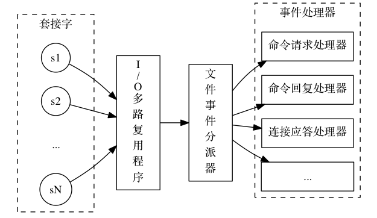
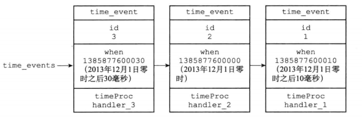

# Redis 事件解析

## 一、简介

Redis 服务器是一个事件驱动程序，服务器需要处理以下两类事件：

- 文件事件：Redis 服务器通过套接字与客户端（或者其它 Redis 客户端）进行连接，而文件事件就是服务器对套接字操作的抽象。服务器与客户端（或者其它服务器）的通信会产生相应的文件事件，而服务器则通过监听并且处理这些事件来完成网络的一系列网络通信操作。
- 时间事件：Redis 服务器的一些操作（比如 serverCron 函数）需要在给定的时间点执行，而时间事件就是服务器对这类操作的抽象。

## 二、文件事件

Redis 基于 Reactor 模式开发了自己的网络事件处理器： 这个处理器被称为文件事件处理器（file event handler）：

- 文件事件处理器使用 I/O 多路复用（multiplexing）程序来同时监听多个 socket，并根据 socket 目前执行的任务来为 socket 关联不同的事件处理器。
- 当被监听的 socket 准备好执行连接（accept）、读取（read）、写入（write）、关闭（close）等操作时，与操作相对应的文件事件就会产生，这时文件事件处理器就会调用 socket 之前关联好的事件处理器来处理这些事件。类似于回调函数。

### 1.文件事件处理器的构成

下图展示了文件事件处理器的四个组成部分：socket、 I/O 多路复用程序（类似于 Selector）、 文件事件分派器（dispatcher）、 以及事件处理器。

<div align="center">
    
</div>

每当一个 socket 连接准备好执行连接应答（accept）、写入、读取、关闭等操作时，就会产生一个文件事件。因为一个服务器通常会连接多个套接字，所以多个文件事件有可能会并发地出现。I/O 多路复用程序负责监听多个 socket，并向文件事件分派器传送那些产生了事件的 socket。

尽管多个文件事件可能会并发地出现，**<font color="red">但 I/O 多路复用程序总是会将所有产生事件的 socket 都放到一个队列里面，然后通过这个队列，以每次一个套接字的方式向文件事件分派器传送套接字</font>**：当上一个套接字产生的事件被处理完毕之后（该套接字为事件所关联的事件处理器执行完毕），I/O 多路复用程序才会继续向文件事件分派器传送下一个套接字。

文件事件分派器接收传送过来的 socket，并根据 socket 产生的事件的类型，调用相应的事件处理器。服务器会为执行不同任务的 socket 关联不同的事件处理器，这些处理器是一个个回调函数，它们定义了某个事件发生时，服务器应该执行的动作。

### 2.文件事件的类型

I/O 多路复用程序可以监听多个套接字的 ae.h/AE_READABLE 事件和 ae.h/AE_WRITABLE 事件，这两类事件和套接字操作之间的对应关系如下：

- **<font color="red">当套接字变得可读时（客户端对套接字执行 write 操作，或者执行 close 操作），或者有新的可应答（accept）套接字出现时</font>**（客户端对服务器的监听套接字执行 connect 操作），套接字产生 AE_READABLE 事件。
- 当套接字变得可写时（客户端对套接字执行 read 操作），套接字产生 AE_WRITABLE 事件。

### 3.文件事件处理器

Redis 为文件事件编写了多个处理器，这些事件处理器分别用于实现不同的网络通讯需求，比如说：

- 为了对连接到服务器的各个客户端进行应答，服务器要为监听套接字关联连接应答处理器。
- 为了接收客户端传来的命令请求，服务器要为客户端套接字关联命令请求处理器。
- 为了向客户端返回命令的执行结果，服务器要为客户端套接字关联命令回复处理器。
- 当主服务器和从服务器进行复制操作时，主从服务器都需要关联特别为复制功能编写的复制处理器。

在这些事件处理器里面，服务器最常用的要数与客户端进行通信的连接应答处理器、 命令请求处理器和命令回复处理器。

#### 3.1.连接应答处理器

networking.c/acceptTcpHandler 函数是 Redis 的连接应答处理器，这个处理器用于对连接到服务器的客户端连接进行处理。**<font color="red">当 Redis 服务器进行初始化的时候，程序会将这个连接应答处理器和服务器监听套接字的 AE_READABLE 事件关联起来</font>**，当有客户端用 sys/socket.h/connect 函数连接服务器监听套接字的时候，套接字就会产生 AE_READABLE 事件，引发连接应答处理器执行。

#### 3.2.命令请求处理器

networking.c/readQueryFromClient 函数是 Redis 的命令请求处理器，这个处理器负责从套接字中读入客户端发送的命令请求内容。当一个客户端通过连接应答处理器成功连接到服务器之后，服务器会将客户端 socket（注意，不是上面连接应答处理器中的监听套接字）的 AE_READABLE 事件和命令请求处理器关联起来，当客户端向服务器发送命令请求的时候，套接字就会产生 AE_READABLE 事件，引发命令请求处理器执行，从套接字中读取命令。

**<font color="red">在客户端连接服务器的整个过程中，服务器都会一直为客户端套接字的 AE_READABLE 事件关联命令请求处理器。</font>**

#### 3.3.命令回复处理器

networking.c/sendReplyToClient 函数是 Redis 的命令回复处理器，这个处理器负责将服务器执行命令后得到的命令回复通过套接字返回给客户端。当服务器有命令回复需要传送给客户端的时候，服务器会将客户端套接字的 AE_WRITABLE 事件和命令回复处理器关联起来，当客户端准备好读取服务器传回的命令回复时，就会产生 AE_WRITABLE 事件，引发命令回复处理器执行。

**<font color="red">当命令回复发送完毕之后，服务器就会解除命令回复处理器与客户端套接字的 AE_WRITABLE 事件之间的关联</font>**。

### 4.一次完整的客户端与服务器端连接事件

假设一个 Redis 服务器正在运作，那么这个服务器的监听套接字的 AE_READABLE 事件应该正处于监听状态之下，而该事件所对应的处理器为连接应答处理器。如果这时有一个 Redis 客户端向服务器发起连接，那么监听套接字将产生 AE_READABLE 事件，触发连接应答处理器执行。

处理器会对客户端的连接请求进行处理，**<font color="red">然后创建客户端套接字，以及客户端状态，并将客户端套接字的 AE_READABLE 事件与命令请求处理器进行关联，使得客户端可以向主服务器发送命令请求</font>**。之后，假设客户端向主服务器发送一个命令请求，那么客户端套接字将产生 AE_READABLE 事件，引发命令请求处理器执行，处理器读取客户端的命令内容，然后传给相关程序去执行。

执行命令将产生相应的命令回复，为了将这些命令回复传送回客户端，服务器会将客户端套接字的 AE_WRITABLE 事件与命令回复处理器进行关联： 当客户端尝试读取命令回复的时候，客户端套接字将产生 AE_WRITABLE 事件，触发命令回复处理器执行，当命令回复处理器将命令回复全部写入到套接字之后，服务器就会解除客户端套接字的 AE_WRITABLE 事件与命令回复处理器之间的关联。

## 三、时间事件

### 1.简介

Redis 的时间事件分为以下两类：

- 定时事件：让一段程序在指定的时间之后执行一次，比如说：让程序 X 在当前时间的 30 毫秒之后执行一次。
- 周期事件：让一段程序每隔指定时间就执行一次（目前 Redis 版本中，只使用了周期性事件，没有使用定时事件）。

一个时间事件主要由以下三个属性组成：

- id：服务器为时间事件创建的全局唯一 ID（标识号）。ID 号按从小到大的顺序递增，新事件的 ID 号比旧事件 ID 号要大。
- when：毫秒精度的 UNIX 时间戳，记录了时间事件到达时。
- timeProc：时间事件处理器，一个回调函数。当时间事件到达时，服务器就会调用相应的处理器来处理事件。

一个时间事件是定时事件还是周期事件取决于时间事件处理器的返回值：

- 如果返回值为 ae.h/AE_NOMORE，那么这个事件为定时事件，**<font color="red">该事件在到达一次之后就会被删除，之后不再到达</font>**。
- 如果事件处理器返回一个非 AE_NOMORE 的整数值，那么这个事件为周期性事件，**<font color="red">当一个时间事件到达之后，服务器会根据事件处理器的返回值，对时间事件的 when 属性进行更新，让这个事件在一段时间之后再次到达，并以这种方式一直更新并运行下去</font>**。

### 2.实现

服务器将所有的时间事件放到一个无序链表中，**<font color="red">每当时间事件执行器运行时，他就遍历整个链表，查找到所有已经到达的时间事件，并且调用相应的事件处理器</font>**。下图就是一个时间事件的链表的例子，链表中包含了三个不同的时间事件，因为新的时间事件总是插入到链表的表头，所以三个时间事件分别按 ID 逆序排序。

<div align="center">
    
</div>

注意，我们说链表为无序，指的不是链表不按 ID 排序，而是说，该链表不按 when 属性的大小排序。正因为链表没有按 when 属性进行排序，所以当时间事件执行器运行时，它必须遍历链表中的所有时间事件，这样才能确保服务器中所有已到达的时间事件都会被处理。**<font color="red">值得注意的是，在正常模式下，Redis 服务器只有 serverCron 一个时间事件</font>**。

持续运行的 Redis 服务器需要定期对自身的资源和状态进行检查和调整，这些定期操作由 redis.c/serverCron 函数负责执行，其主要工作如下：

1. 更新服务器的各类统计信息，比如时间，内存占用，数据库占用等情况；
2. 清理数据库中的过期键值对；
3. 关闭和清理连接失效的客户端；
4. 尝试进行 AOF 或者 RDB 持久化操作；
5. 如果服务器是主服务器，那么对从服务器从服务器进行定期同步；
6. 如果处于集群模式，对集群进行定期同步和连接测试；

Redis 服务器以周期性事件的方式来运行 serverCron 函数，在服务器运行期间，每秒运行 10 次 serverCron 函数，平均每间隔 100 毫秒运行一次，直到服务器关闭为止。

## 四、事件的调度和执行

因为服务器中同时存在文件事件和时间事件两种事件类型，所以服务器必须对这两种事件进行调度，决定何时应该处理文件事件，何时又应该去处理时间事件。事件的调度和执行由 ae.c/aeProcessEvents 函数负责，以下是该函数的伪代码：

```python{.line-numbers}
def aeProcessEvents():
    # 获取到达时间离当前时间最接近的时间事件
    time_event = aeSearchNearestTimer()
    
    # 计算最接近的时间事件距离到达还有多少毫秒
    remaind_ms = time_event.when - unix_ts_now()
    
    # 如果事件已到达，那么 remaind_ms 的值可能为负数，将它设定为 0
    if remaind_ms < 0:
        remaind_ms = 0
        
    # 根据remaind_ms的值，创建timeval结构
    timeval = create_timeval_with_ms(remaind_ms)
    
    # 阻塞并等待文件事件产生，最大阻塞时间由传入的 timeval 结构决定
    # 如果 remaind_ms 的值为0，那么 aeApiPoll 调用之后马上返回，不阻塞
    aeApiPoll(timeval)
    
    # 处理所有已产生的文件事件
    processFileEvents()
    
    # 处理所有已到达的时间事件
    processTimeEvents() 
```

将 aeProcessEvents 函数置于一个循环里面，加上初始化和清理函数，这就构成了 Redis 服务器的主函数，以下是该函数的伪代码表示：

```python{.line-numbers}
def main():
    # 初始化服务器
    init_server()
    # 一直处理事件，直到服务器关闭为止
    while server_is_not_shutdown():
        aeProcessEvents()
    # 服务器关闭，执行清理操作
    clean_server() 
```