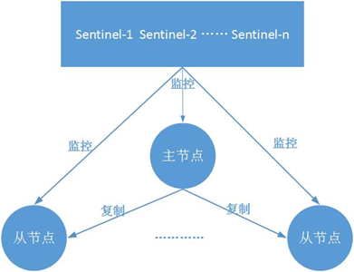
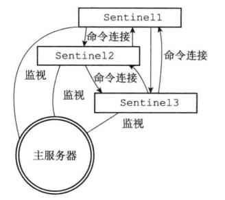
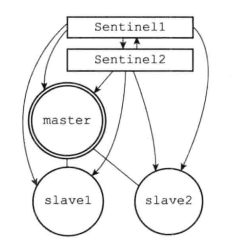

# Redis 哨兵模式

## 一、前言

**<font color="red">Redis 主从复制的作用有数据热备、负载均衡、故障转移与恢复等</font>**；但主从复制存在的一个问题是故障恢复无法自动化。**<font color="red">本文将要介绍的哨兵，它基于 Redis 主从复制，主要作用便是解决主节点故障恢复的自动化问题</font>**，进一步提高系统的高可用性。文章主要内容如下：首先介绍哨兵的作用和架构；然后讲述哨兵系统的部署方法，以及通过客户端访问哨兵系统的方法；然后简要说明哨兵实现的基本原理；最后给出关于哨兵实践的一些建议。

## 二、作用和架构

### 1.作用

在介绍哨兵之前，首先从宏观角度回顾一下 Redis 实现高可用相关的技术。它们包括：持久化、复制、哨兵和集群，其主要作用和解决的问题是：

- 持久化：持久化是最简单的高可用方法，主要作用是数据备份，即将数据存储在硬盘，保证数据不会因 Redis 服务器关闭而丢失。
- 复制：复制是高可用 Redis 的基础，哨兵和集群都是在复制基础上实现高可用的。复制主要实现了数据的多机备份，以及对于读操作的负载均衡和简单的故障恢复。缺陷：故障恢复无法自动化；写操作无法负载均衡；存储能力受到单机的限制。
- 哨兵：在复制的基础上，哨兵实现了自动化的故障恢复。缺陷：写操作无法负载均衡；存储能力受到单机的限制。
- 集群：通过集群，Redis 解决了写操作无法负载均衡，以及存储能力受到单机限制的问题，实现了较为完善的高可用方案。

Redis Sentinel，即 Redis 哨兵，在 Redis 2.8 版本开始引入。哨兵的核心功能是主节点的自动故障转移。下面是 Redis 官方文档对于哨兵功能的描述：

- 监控（Monitoring）：哨兵会不断地检查主节点和从节点是否运作正常。
- 自动故障转移（Automatic failover）：当主节点不能正常工作时，哨兵会开始自动故障转移操作，**<font color="red">即它会将失效主节点的其中一个从节点升级为新的主节点，并让其他从节点改为复制新的主节点</font>**。
- 配置提供者（Configuration provider）：客户端在初始化时，通过连接哨兵来获得当前Redis服务的主节点地址。
- 通知（Notification）：哨兵可以将故障转移的结果发送给客户端。

其中，监控和自动故障转移功能，使得哨兵可以及时发现主节点故障并完成转移；而配置提供者和通知功能，则需要在与客户端的交互中才能体现。

### 2.架构

典型的哨兵架构图如下所示：

<div align="center">
    
</div>

它由两部分组成，哨兵节点和数据节点：

- 哨兵节点：哨兵系统由一个或多个哨兵节点组成，**<font color="red">哨兵节点是特殊的 redis 节点，不存储数据</font>**。
- 数据节点：**<font color="red">主节点和从节点都是数据节点</font>**。

## 三、Sentinel 启动的基本过程

当一个 Sentinel 启动时，它需要执行以下步骤：

1. 初始化服务器
2. 将普通 Redis 服务器使用的代码替换成 Sentinel 专用代码
3. 初始化 Sentinel 状态
4. 根据给定的配置文件， 初始化 Sentinel 的监视主服务器列表
5. 创建连向主服务器的网络连接

### 1.初始化服务器

**<font color="red">Sentinel 的本质是一个运行在特殊模式下的 Redis 服务器，因此启动时必须对其进行初始化</font>**，但是由于 Sentinel 执行的工作与普通的服务器不同，所以它的初始化过程需要执行的操作和普通的 Redis 服务器并不完全相同。比如说 Sentinel 并不使用数据库，因此初始化时，不会载入 RDB 文件或者 AOF 文件。

### 2.使用 Sentinel 专用代码

**<font color="red">启动 Sentinel 的第二个步骤就是将一部分普通 Redis 服务器使用的代码替换成 Sentinel 专用代码</font>**。比如：普通 Redis 服务器使用 redis.c/redisCommandTable 作为服务器的命令表，而 Sentinel 则使用 sentinel.c/sentinelcmds 作为服务器的命令表。 有些命令比如 SET、GET、SETNX 等只存在于 redisCommandTable 命令表中。

这也就解释了为什么在 Sentinel 模式下， Redis 服务器不能执行诸如 SET、 DBSIZE、 EVAL 等等这些命 ——因为在 SENTINEL 模式下的 Redis 服务器根本没有在命令表中载入这些命令。PING、 SENTINEL 、INFO、SUBSCRIBE、UNSUBSCRIBE、PSUBSCRIBE 和 PUNSUBSCRIBE 这七个命令就是客户端可以对 SENTINEL 执行的全部命令了。

### 3.初始化 Sentinel 状态

在应用了 Sentinel 的专用代码之后， 接下来， 服务器会初始化一个 sentinel.c/sentinelState 结构（后面简称“Sentinel 状态”），用来保存服务器中所有和 Sentinel 功能有关的状态 （服务器的一般状态仍然由 redis.h/redisServer 结构保存）：

```c{.line-numbers}
struct sentinelState {
     // ......
     // 当前纪元，用于实现故障转移
     uint64_t current_epoch;
 
     // 保存了所有被这个 sentinel 监视的主服务器
     // 字典的键是主服务器的名字
     // 字典的值则是一个指向 sentinelRedisInstance 结构的指针
     dict *masters;
} sentinel;  
```

### 4.初始化 Sentinel 状态的 masters 属性

对 Sentinel 状态的初始化将引发对 masters 字典的初始化，而 masters 字典的初始化是根据被载入的 Sentinel 配置文件来进行的。masters 字典记录了所有被 Sentinel 监视的主服务器的相关信息，其中字典的键是被监视主服务器的名字。而字典的值则是被监视主服务器对应的 sentinel.c/sentinelRedisInstance 结构。每个 sentinelRedisInstance 结构（后面简称"实例结构"）代表一个被 Sentinel 监视的 Redis 服务器实例（instance），**<font color="red">这个实例可以是主服务器、从服务器、或者另外一个 Sentinel</font>**。下面为实例结构中的一部分属性：

```c{.line-numbers}
typedef struct sentinelRedisInstance {

    // 标识值，记录了实例的类型，以及该实例的当前状态
    int flags;
    // 实例的名字
    // 主服务器的名字由用户在配置文件中设置, 从服务器以及 Sentinel 的名字由 Sentinel 自动设置
    // 格式为 ip:port ，例如 "127.0.0.1:26379"
    char *name;
    // 实例的运行 ID
    char *runid;
    // 配置纪元，用于实现故障转移
    uint64_t config_epoch;
    // 实例的地址
    sentinelAddr *addr;
    // SENTINEL down-after-milliseconds 选项设定的值
    // 实例无响应多少毫秒之后才会被判断为主观下线（subjectively down）
    mstime_t down_after_period;

    dict *sentinels;    /* Other sentinels monitoring the same master. */
    dict *slaves;       /* Slaves for this master instance. */
    
    // SENTINEL monitor <master-name> <IP> <port> <quorum> 选项中的 quorum 参数
    // 判断这个实例为客观下线（objectively down）所需的支持投票数量
    int quorum;

    // SENTINEL failover-timeout <master-name> <ms> 选项的值
    // 刷新故障迁移状态的最大时限
    mstime_t failover_timeout;
    // ...

} sentinelRedisInstance; 
```

### 5.创建连向主服务器的网络连接

初始化 Sentinel 的最后一步是创建连向被监视主服务器的网络连接：Sentinel 将成为主服务器的客户端，它可以向主服务器发送命令，并从命令回复中获取相关的信息。对于每个被 Sentinel 监视的主服务器来说，Sentinel 会创建两个连向主服务器的异步网络连接：

- 一个是命令连接，这个连接专门用于向主服务器发送命令，并接收命令回复。
- 另一个是订阅连接，这个连接专门用于订阅主服务器的 **`__sentinel__:hello`** 频道。

## 四、获取主服务器信息

**<font color="red">Sentinel 默认会以每十秒一次的频率，通过命令连接向被监视的主服务器发送 INFO 命令，并通过分析 INFO 命令的回复来获取主服务器的当前信息</font>**。举个例子，假设主服务器 master 有三个从服务器 slave0、slave1 和 slave2，并且一个 Sentinel 正在连接主服务器，那么 Sentinel 将持续地向主服务器发送 INFO 命令，并获得类似于以下内容的回复：

```c{.line-numbers}
# Server
...
run_id: // 略
...

# Replication
role:master
connected_slaves:3
slave0:ip=127.0.0.1,port=11111,state=online,offset=43,lag=0
slave1:ip=127.0.0.1,port=22222,state=online,offset=43,lag=0
slave2:ip=127.0.0.1,port=33333,state=online,offset=43,lag=0
...

# Other sections
... 
```

通过分析主服务器返回的 INFO 命令回复，Sentinel 可以获取以下两方面的信息：

- 主服务器本身的信息，包括服务器运行 ID run_id，服务器角色 role 等；
- 主服务器属下的所有从服务器信息。包括从服务器的 IP 地址、端口号等，根据这些信息，Sentinel 无须用户提供从服务器的地址信息，就可以自动发现从服务器；

Sentinel 获得了从服务器的信息之后，会检查从服务器对应的实例结构是否已经存在于 slaves 字典，如果已存在，则更新主服务实例中的 slaves 字典；否则创建一个新的实例结构（也就是 sentinelRedisInstance），并且添加到 slaves 字典中。这个 slaves 字典记录了对应主服务器下属的所有从服务器的信息。

## 五、获取从服务器信息

当 SENTINEL 发现主服务器有新的从服务器时，SENTINEL 除了会创建相应的从服务器实例结构外，还会创建到从服务器的命令连接和订阅连接。**<font color="red">同样，Sentinel 也会以每 10 秒一次的频率，通过命令连接向从服务器发送 INFO 命令</font>**，并获得类似于以下内容的回复：

```c{.line-numbers}
# Server
...
run_id: // 略
...
# Replication
role:slave
master_host:127.0.0.1
master_port:6379
master_link_status:up
slave_repl_offset:11887
slave_priority:100

# Other sections
... 
```

根据 INFO 命令的回复，Sentinel 会提取出以下信息，根据这些信息，Sentinel 会对从服务器的实例结构进行更新：

- 从服务器的运行 ID run_id。
- 从服务器的角色 role。
- 主服务器的 IP 地址 master_host，以及主服务器的端口号 master_port。
- 主从服务器的连接状态 master_link_status。
- 从服务器的复制偏移量 slave_repl_offset。

## 六、向主服务器和从服务器发送信息

在默认情况下，Sentinel 会以每两秒一次的频率，通过命令连接向所有被监视的主服务器和从服务器发送以下格式的命令：

```java{.line-numbers}
PUBLISH __sentinel__:hello "<s_ip>,<s_port>,<s_runid>,<s_epoch>,<m_name>,<m_ip>,<m_port>,<m_epoch>" 
```

这条命令向服务器的 **`__sentinel__:hello`** 频道发送了一条消息，信息的内容由多个参数组成：

- 其中以 s_ 开头的参数记录的是 Sentinel 本身的信息。
- 而以 m_ 开头的参数记录的则是主服务器的信息。如果 Sentinel 正在监视的是主服务器，那么这些参数记录的就是主服务器的信息；如果 Sentinel 正在监视的是从服务器，那么这些参数记录的就是从服务器正在复制的主服务器的信息。

## 七、接收来自主服务器和从服务器的频道信息

当 Sentinel 与一个主服务器或者从服务器建立起订阅连接之后，Sentinel 就会通过 **<font color="red">订阅连接</font>**，向服务器发送以下命令：

```c{.line-numbers}
SUBSCRIBE __sentinel__:hello 
```

Sentinel 对 **`__sentinel__:hello`** 频道的订阅会一直持续到 Sentinel 与服务器的连接断开为止。**<font color="red">这也就是说，对于每个与 Sentinel 连接的服务器，Sentinel 既通过命令连接向服务器的 **`__sentinel__:hello`** 频道发送消息，又通过订阅连接从服务器的 **`__sentinel__:hello`** 频道接收消息</font>**。对于监视同一个服务器的多个 Sentinel 来说，一个 Sentinel 发送的消息会被其他 Sentinel 接收到，这些消息会被用于更新其他 Sentinel 对发送消息 Sentinel 的认知，也会被用于更新其他 Sentinel 对被监视服务器的认知。

举个例子，假设现在有sentinel1、sentinel2、sentinel3三个sentinel在监视同一个服务器，那么当sentinel1向服务器 **`__sentinel__:hello`** 频道发送一条信息时，所有订阅了这个频道的 Sentinel （包括sentinel1自己在内）都会收到这条信息。

当 Sentinel 通过频道信息发现一个新的 Sentinel 时，它不仅会为新 Sentinel 在 sentinels 字典中创建相应的实例结构，**<font color="red">还会创建一个连向新 Sentinel 的命令连接，而新 Sentinel 也同样会创建连向这个 Sentinel 的命令连接</font>**，最终监视同一主服务器的多个 Sentinel 将形成相互连接的网络：Sentinel A 有连向 Sentinel B 的命令连接，而 Sentinel B 也有连向 Sentinel A 的命令连接。使用命令连接相连的各个 Sentinel 可以通过向其他 Sentinel 发送命令请求来进行信息交换。

另外，需要注意的是：Sentinel 之间只会创建命令连接，不会创建订阅连接。

<div align="center">
    
</div>

## 八、检测主观下线状态

在默认情况下，**<font color="red">Sentinel 会以每秒一次的频率向所有与它创建了命令连接的实例（包括主服务器、从服务器、其他 Sentinel 在内）发送 PING 命令</font>**，并通过实例返回的 PING 命令回复来判断实例是否在线。下图中 Sentinel1 向 Sentinel2、主服务器 master、从服务器 slave1 和 slave2 发送 PING 命令，对于 Sentinel2 而言，也是同理向 Sentinel1、master、slave1、slave2 发送 PING 命令：

<div align="center">
    
</div>

实例对 PING 命令的回复如果是 +PONG、-LOADING、-MASTERDOWN 三种中的一种，那么就是有效回复，否则就是无效回复（指定时限内没有返回任何回复也是无效回复）。Sentinel 配置文件中的 down-after-milliseconds 选项指定了 Sentinel 判断实例进入主观下线所需的时间长度：**<font color="red">如果一个实例在 down-after-milliseconds 毫秒内，连续向 Sentinel 返回无效回复，那么 Sentinel 会修改这个实例所对应的实例结构，在结构的 flags 属性中打开 SRI_S_DOWN 标识，以此来表示这个实例已经进入主观下线状态</font>**。

用户设置的 down-after-milliseconds 选项的值，不仅会被 Sentinel 用来判断主服务器的主观下线状态，还会被用于判断主服务器属下的所有从服务器，以及所有同样监视这个主服务器的其他 Sentinel 的主观下线状态。

## 九、检查客观下线状态

当 Sentinel 将一个主服务器判断为主观下线之后，为了确认这个主服务器是否真的下线了，它会向同样监视这一主服务器的其他 Sentinel 进行询问，看它们是否也认为主服务器已经进入了下线状态（可以是主观下线或者客观下线）。当 Sentinel 从其他 Sentinel 那里接收到足够数量的已下线判断之后，Sentinel 就会将主服务器判定为客观下线，并对从服务器执行故障转移操作。

### 1.**发送 **`SENTINEL is-master-down-by-addr`** 命令**

Sentinel 使用以下命令询问其他 Sentinel 是否同意主服务器已下线：

```c{.line-numbers}
SENTINEL is-master-down-by-addr <ip> <port> <current_epoch> <runid>
```

其中 ip 和 port 表示被 Sentinel 判断为主观下线的主服务器的 ip 地址和 port 端口。runid 表示为 * 符号或者 Sentinel 的运行 ID：* 符号代表命令仅仅用于检测主服务器的客观下线状态，而 Sentinel 的运行 ID 则用于选举领头 Sentinel。

### 2.**接收 `SENTINEL is-master-down-by-addr` 命令**

当一个 Sentinl（目标 Sentinel）接收到另一个 Sentinel（源 Sentinel）发来的 SENTINEL is-master-down-by-addr 命令时，目标 Sentinel 会分析并取出命令请求中包含的各个参数，并根据其中的主服务器 IP 和端口号，检查主服务器是否已下线，然后向源 Sentinel 返回一条包含三个参数的 Multi Bulk 回复作为回复：**`down_state、leader_runid、leader_epoch`**。

其中 down_state 表示目标 Sentinel 对主服务器的检查结果，1 代表主服务器已下线，0 代表主服务器未下线；对于 leader_runid，可以是 * 符号或者目标 Sentinel 的局部领头 Sentinel 的运行 ID：* 符号代表命令仅仅用于检测主服务器的客观下线状态，而局部领头 Sentinel 的运行 ID 则用于选举领头 Sentinel。

根据其他 Sentinel 发回的 SENTINEL is-master-down-by-addr 命令回复，Sentinel 将统计其他 Sentinel 同意主服务器已下线的数量，当这一数量达到配置指定的判断客观下线所需的数量（也就是 SENTINEL 配置中的 quorum）时，Sentinel 会将主服务器实例结构 flags 属性的 SRI_O_DOWN 标识打开，表示主服务器已经进入客观下线状态。

## 十、哨兵选举与故障转移

### 1.哨兵选举

当一个主服务器被判断为客观下线时，监视这个下线主服务器的各个 Sentinel 会进行协商，选举出一个领头 Sentinel，并由领头 Sentinel 对下线主服务器执行故障转移操作。以下是 Redis 选举领头 Sentinel 的规则和方法：

- 所有在线的监视同一个主服务器的多个 Sentinel 都有被选为领头 Sentinel 的资格。并且每次进行领头 Sentinel 选举之后，不论选举是否成功，所有 Sentinel 的配置纪元（configration epoch）的值都会自增一次。
- 每个发现主服务器进入客观下线的 Sentinel 都会要求其他 Sentinel 将自己设置为局部领头 Sentinel。
- 当一个 Sentinel（源 Sentinel）向另一个 Sentinel（目标 Sentinel）发送 SENTINEL is-master-down-by-addr 命令，并且命令中的 runid 参数不是 * 符号而是源 Sentinel 的运行 ID 时，这表示源 Sentinel 要求目标 Sentinel 将前者设置为后者的局部领头 Sentinel。
- Sentinel 设置局部领头 Sentinel 的规则是先到先得：最先向目标 Sentinel 发送设置要求的源 Sentinel 将成为目标 Sentinel 的局部领头 Sentinel，而之后接收到的所有设置要求都会被目标 Sentinel拒绝。
- 目标 Sentinel 在接收到 SENTINEL is-master-down-by-addr 命令之后，将向源 Sentinel 返回一条命令回复，回复中的 leader_runid 参数和 leader_epoch 参数分别记录了目标 Sentinel 的局部领头 Sentinel 的运行 ID 和配置纪元。
- 源 Sentinel 在接收到目标 Sentinel 返回的命令回复之后，会检查回复中的 leader_epoch 参数的值和自己的配置纪元是否相同，如果相同的话，那么源 Sentinel 继续取出回复中的 leader_runid 参数，如果 leader_runid 参数的值和源 Sentinel 的运行 ID 一致，那么表示目标 Sentinel 将源 Sentinel 设置成了局部领头 Sentinel。
- **<font color="red">如果有某个 Sentinel 被半数以上的 Sentinel 设置成了局部领头 Sentinel，那么这个 Sentinel 成为领头 Sentinel</font>**。如果在给定时限内，没有一个 Sentinel 被选举为领头 Sentinel，那么各个 Sentinel 将在一段时间之后再次进行选举，直到选举出领头 Sentinel 为止。
  
从上面这些规则可以看出，选举使用的算法为 Raft 算法，即在一轮选举中，哨兵 A 向哨兵 B 发送 is-master-down-by-addr 命令，要求哨兵 B 将 A 设置为领头 Sentinel，如果此时 B 还没有同意过其他的哨兵，那么就会同意 A 称为领导者。如果最后同意哨兵 A 成为领导者的哨兵数目超过一半，那么就哨兵 A 最后就会称为领头 Sentinel。

### 2.故障转移

在选举产生出领头 Sentinel 之后，领头 Sentinel 将对已下线的主服务器执行故障转移操作，该操作包含以下三个步骤：

- 在已下线主服务器属下的所有从服务器里面，挑选出一个从服务器，并将其转换为主服务器。
- 让已下线主服务器属下的所有从服务器改为复制新的主服务器。
- 将已下线主服务器设置为新的主服务器的从服务器，当这个旧的主服务器重新上线时，他就会成为新的主服务器的从服务器。

## 十一、总结

### 1.过程总结

综上所述，Sentinel 在启动初始化完成之后，会建立与主服务器的两条连接（命令连接与订阅连接）。接着会以 10 秒一次的频率向主服务器发送 INFO 指令（通过命令连接），获取主服务器和从服务器的信息，并且根据所获得的从服务器信息，也与从服务器建立命令连接和订阅连接。然后 Sentinel 就会通过订阅连接订阅__sentinel__:hello 频道，这么做的主要目的就是为了发现其它监视同样服务器的 Sentinel，并且与这些新发现的 Sentinel 建立命令连接，为以后的哨兵选举做好准备。

如果说当某一个主服务器被判断为客观下线的时候，进行监视的各个 Sentinel 就会进行选举，选出一个领头 Sentinel，来对下线的主服务器进行故障转移操作。

### 2.原理总结

（1）定时任务：每个哨兵节点维护了 3 个定时任务。定时任务的功能分别如下：通过向主从节点发送 info 命令获取最新的主从结构；通过发布订阅功能获取其他哨兵节点的信息；通过向其他节点发送 ping 命令进行心跳检测，判断是否下线。

（2）主观下线：在心跳检测的定时任务中，如果其他节点超过一定时间没有回复，哨兵节点就会将其进行主观下线。顾名思义，主观下线的意思是一个哨兵节点“主观地”判断下线；与主观下线相对应的是客观下线。

（3）客观下线：哨兵节点在对主节点进行主观下线后，会通过 **`sentinel is-master-down-by-addr`** 命令询问其他哨兵节点该主节点的状态；如果判断主节点下线的哨兵数量达到一定数值，则对该主节点进行客观下线。需要特别注意的是，客观下线是主节点才有的概念；如果从节点和哨兵节点发生故障，被哨兵主观下线后，不会再有后续的客观下线和故障转移操作。

### 3.实践建议

1. 哨兵节点的数量应不止一个，一方面增加哨兵节点的冗余，避免哨兵本身成为高可用的瓶颈；另一方面减少对下线的误判。此外，这些不同的哨兵节点应部署在不同的物理机上。
2. 哨兵节点的数量应该是奇数，便于哨兵通过投票做出“决策”：领导者选举的决策、客观下线的决策等。
3. 各个哨兵节点的配置应一致，包括硬件、参数等；此外，所有节点都应该使用ntp或类似服务，保证时间准确、一致。
4. 哨兵的配置提供者和通知客户端功能，需要客户端的支持才能实现，如前文所说的Jedis；如果开发者使用的库未提供相应支持，则可能需要开发者自己实现。