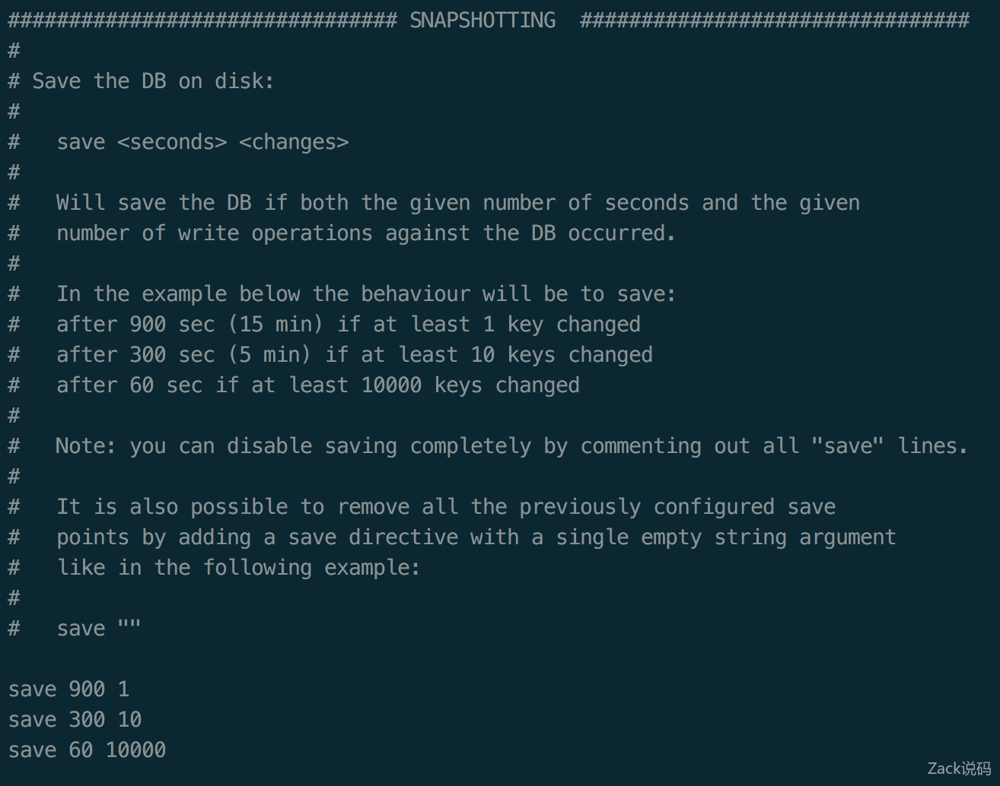
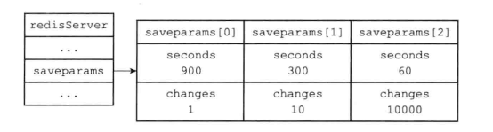
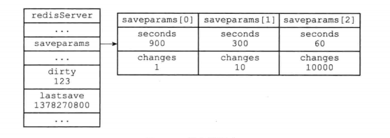
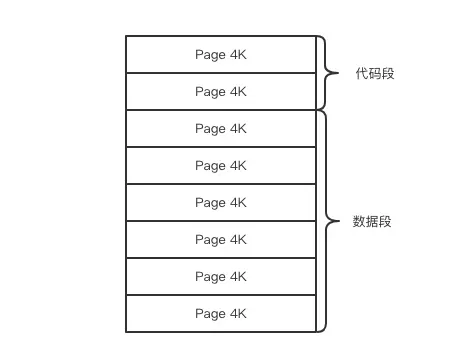
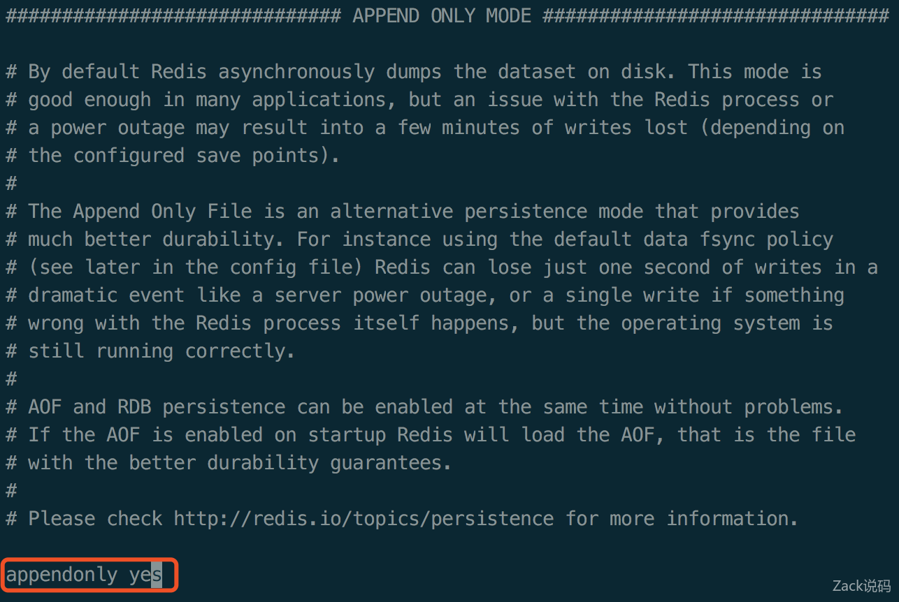

# Redis 持久化之 RDB 和 AOF 

## 一、Redis 持久化

Redis 作为一个键值对内存数据库(NoSQL)，数据都存储在内存当中，在处理客户端请求时，所有操作都在内存当中进行。

这样做有什么问题呢？其实，只要稍微有点计算机基础知识的人都知道，存储在内存当中的数据，只要服务器关机( 各种原因引起的)，内存中的数据就会消失了，不仅服务器关机会造成数据消失，Redis 服务器守护进程退出，内存中的数据也一样会消失。

对于只把 Redis 当缓存来用的项目来说，数据消失或许问题不大，重新从数据源把数据加载进来就可以了，但如果直接把用户提交的业务数据存储在 Redis 当中，把 Redis 作为数据库来使用，在其放存储重要业务数据，那么 Redis 的内存数据丢失所造成的影响也许是毁灭性。为了避免内存中数据丢失，Redis 提供了对持久化的支持，我们可以选择不同的方式将数据从内存中保存到硬盘当中，使数据可以持久化保存。

Redis 提供了 RDB 和 AOF 两种不同的数据持久化方式，下面我们就来详细介绍一下这种不同的持久化方式吧。

## 二、RDB 数据快照

### 1 RDB 文件的创建和载入

Redis 是一个键值对数据库服务器，服务器中通常包含着任意个非空数据库，而每个非空数据库中又可以包含任意个键值对。为了方便起见，我们将服务器中的非空数据库以及它们的键值对统称为数据库状态。RDB，提供一个某个时间点的数据的 Snapshot，保存在 RDB 文件中。它可以通过 SAVE/BGSAVE 命令手动执行，把数据 Snapshot 写到 RDB 文件，也可以通过配置，定时执行。该功能可以将某个时间点上的数据库状态保存到一个 RDB 文件，生成的 RDB 文件是一个经过压缩的二进制文件。Redis 也可以通过加载 RDB 文件，把数据从磁盘加载读取到 Redis 中。

#### 1.1 save 命令

```sql{.line-numbers}
# 同步数据到磁盘上
> save 
```

当客户端向服务器发送 save 命令请求进行持久化时，服务器会阻塞 save 命令之后的其他客户端的请求，直到数据同步完成。如果数据量太大，同步数据会执行很久，而这期间 Redis 服务器也无法接收其他请求，所以，最好不要在生产环境使用 save 命令。

#### 1.2 bgsave 命令

与 save 命令不同，bgsave 命令是一个异步操作。

```sql{.line-numbers}
# 异步保存数据集到磁盘上
> bgsave 
```

当客户端发服务发出 bgsave 命令时，Redis 服务器主进程会 forks 一个子进程来数据同步问题，在将数据保存到 rdb 文件之后，子进程会退出。所以，与 save 命令相比，Redis 服务器在处理 bgsave 采用子进程进行 IO 写入，而主进程仍然可以接收其他请求，**<font color="red">但 forks 子进程是同步的，所以 forks 子进程时，一样不能接收其他请求</font>**，这意味着，如果 forks 一个子进程花费的时间太久( 一般是很快的)，bgsave 命令仍然有阻塞其他客户端的请求的情况发生。

创建 RDB 文件实际上是由 rdb.c/rdbSave 函数完成的，SAVE 命令与 BGSAVE 命令会以不同的方式调用这个函数，以下伪代码可以看出这两个命令的区别：

```java{.line-numbers}
def SAVE():
    #创建rdb文件
    rdbSave()

def BGSAVE():
    #创建子进程
    pid = fork()
    
    if pid == 0:
        #子进程负责创建rdb文件
        rdbSave()
        #完成之后向父进程发送信号
        signal_parent()
    elif pid > 0:
        #父进程继续处理命令请求，并且通过轮询子进程的信号
        handle_request_and_wait_signal()
    else:
        #处理出错情况
        handle_fork_error() 
```

RDB 的载入工作是在 Redis 服务器启动时自动完成的，所以 Redis 并没有专门用于载入 RDB 的命令，只要 Redis 启动时检测到 RDB 文件的存在，它就会自动载入 RDB 文件。另外，由于 AOF 文件的更新频率要大于 RDB 文件，所以：

- 如果服务器开启了 AOF 持久化功能，那么服务器会优先使用 AOF 文件来还原数据库的状态
- 只有在 AOF 持久化关闭的时候，服务器才会使用 RDB 文件来还原数据库状态

载入 RDB 由 rdb.c/rdbLoad 函数完成。

#### 1.3 SAVE 命令执行时的服务器状态

正如前面所说的，当 SAVE 命令执行时，Redis 服务器会被阻塞，所以当 SAVE 命令正在执行时，客户端发送的所有命令请求都会被拒绝。只有在服务器执行完 SAVE 命令，客户端发送的命令才会被处理。

#### 1.4 BGSAVE 命令执行时的服务器状态

**<font color="red">在 BGSAVE 命令执行期间，客户端发送的 SAVE 命令会被拒绝</font>**，禁止 SAVE 命令和 BGSAVE 命令同时执行是因为可以避免父进程( 服务器进程，执行 SAVE 操作) 和子进程( 执行 BGSAVE 操作) 同时调用 rdbSave 函数，产生竞争条件

**<font color="red">在 BGSAVE 命令执行期间，客户端发送的 BGSAVE 命令会被拒绝</font>**。这是因为如果允许的话，服务器会产生另外一个子进程，这样就有两个子进程调用 rdbSave 函数，也会产生竞争条件。

**<font color="red">另外，BGREWRITEAOF 和 AOF 命令也不能同时执行</font>**：

- 如果 BGREWRITEAOF 命令正在执行，那么客户端发送的 BGSAVE 命令会被拒绝
- 如果 BGSAVE 命令正在进行，那么客户端发送的 BGREWRITEAOF 命令会被延迟到 BGSAVE 执行完毕后执行

BGREWRITEAOF 和 AOF 命令也不能同时执行实际上是出于性能方面的考虑，并发两个子进程，并且这两个子进程都同时执行大量的磁盘写入 IO 操作，这并不是一个好主意。

#### 1.5 RDB 载入时服务器的状态

服务器在载入 RDB 文件时，会一直处于阻塞状态，直到载入工作完成为止。

### 2 服务器配置自动触发

#### 2.1 设置保存条件

save 命令和 bgsave 命令是手动执行的过程，但在生产过程中我们很少手动的登上服务去执行操作，所以更多的时候是依赖 Redis 的配置，让服务器每个一段时间自动执行一次，即在 Redis 配置文件中的 save 指定到达触发 RDB 持久化的条件，比如【多少秒内至少达到多少写操作】就开启 RDB 数据同步。打开 redis.conf 配置文件，找到 SNAPSHOTTING 的配置，Save Point 的设置。

<div align="center">
    
</div>

save < 指定时间间隔> < 执行指定次数更新操作>，满足条件就将内存中的数据同步到硬盘中。用户可以通过 save 选项配置多个保存条件，但只要其中一个条件被满足，服务器就会执行 BGSAVE 命令。上图所示为服务器中默认配置，那么只要满足以下三个条件中的任意一个，BGSAVE 命令就会被执行：

- 服务器在 900s 内，对数据库做了至少 1 次修改
-  服务器在 300s 内，对数据库做了至少 10 次修改
-  服务器在 60s 内，对数据库做了至少 10000 次修改
  
#### 2.2 dirty 计数器和 lastsave 属性

当设置好 save 选项时，服务器程序会根据 save 选项所设置的保存条件，设置服务器状态 redisServer 结构中的 saveparams 属性：

```c{.line-numbers}
//redis.h
struct redisServer {
    //....
    //记录了save条件的数组
    struct saveparam *saveparams;
    //....
} 
```

saveparams 是一个数组，数组中的每个元素都是一个 saveparam 结构，每个 saveparam 结构都保存了一个 save 选项设置的保存条件：

```c{.line-numbers}
//redis.h
// 服务器的保存条件（BGSAVE 自动执行的条件）
struct saveparam {
    // 多少秒之内
    time_t seconds;
    // 发生多少次修改
    int changes;
}; 
```

如果说，save 想选的值为上图中的条件，那么服务器状态中的 saveparams 数组将会是下图所示：

<div align="center">
    
</div>

除了 saveparams 数组外，redisServer 中还保存着一个 dirty 计数器，以及一个 lastsave 属性：

- dirty 计数器记录距离上一次 SAVE 命令或者 BGSAVE 命令之外，服务器对数据库状态( 数据库中的所有数据) 进行了多少次修改( 包括写入、删除与更新)；
- lastsave 属性是一个 UNIX 时间戳，记录了服务器上一次成功执行 SAVE 命令或者 BGSAVE 命令的时间；

```c{.line-numbers}
//redis.h
struct redisServer {
    //....
    //记录了save条件的数组
    struct saveparam *saveparams;
    // 自从上次 SAVE 执行以来，数据库被修改的次数
    long long dirty;              
    // 最后一次完成 SAVE 的时间
    time_t lastsave;
    //....
} 
```

当服务器成功执行一个数据库修改命令之后，程序就会对 dirty 计数器进行更新：命令修改了多少次数据库，dirty 计数器的值就增加多少。比如，我们向一个集合中增加三个新元素：

```c{.line-numbers}
redis>SADD database Redis MongoDB MariaDB
(integer) 3 
```

那么程序会将 dirty 计数器的值增加 3。

#### 2.3 检查保存条件是否满足

Redis 服务器的周期性函数操作函数 serverCron 默认每隔 100 毫秒就会执行一次，该函数用于对正在运行的服务器进行维护，它的其中一项工作就是检查 save 选项所设置的保存条件是否满足，如果满足的话，就执行 BGSAVE 命令。

```c{.line-numbers}
//redis.c
int serverCron(struct aeEventLoop *eventLoop, long long id, void *clientData) {
    int j;
    //......
    /* Update the time cache. */
    // 更新redisServer中的unixtime和mstime，也就是每秒更新redisServer.hz次
    updateCachedTime();
    // 记录服务器执行命令的次数
    run_with_period(100) trackOperationsPerSecond();
    /* 
     * LRU 时间的精度可以通过修改 REDIS_LRU_CLOCK_RESOLUTION 常量来改变
     * 更新redisServer中的lruclock，也就是每秒更新redisServer.hz次
     */
    server.lruclock = getLRUClock();
    // 增加 loop 计数器
    server.cronloops++;

    /* If there is not a background saving/rewrite in progress check if
         * we have to save/rewrite now */
        // 既然没有 BGSAVE 或者 BGREWRITEAOF 在执行，那么检查是否需要执行它们

        // 遍历所有保存条件，看是否需要执行 BGSAVE 命令
        for (j = 0; j < server.saveparamslen; j++) {
            struct saveparam *sp = server.saveparams+j;

            /* Save if we reached the given amount of changes,
             * the given amount of seconds, and if the latest bgsave was
             * successful or if, in case of an error, at least
             * REDIS_BGSAVE_RETRY_DELAY seconds already elapsed. */
            // 检查是否有某个保存条件已经满足了
            if (server.dirty >= sp->changes &&
                server.unixtime-server.lastsave > sp->seconds &&
                (server.unixtime-server.lastbgsave_try >
                 REDIS_BGSAVE_RETRY_DELAY ||
                 server.lastbgsave_status == REDIS_OK))
            {
                redisLog(REDIS_NOTICE,"%d changes in %d seconds. Saving...",
                    sp->changes, (int)sp->seconds);
                // 执行 BGSAVE
                rdbSaveBackground(server.rdb_filename);
                break;
            }
        }
    //.......
} 
```

上面代码即为 serverCron 函数中关于 bgsave 相关的部分。也就是遍历 saveparams 数组，只要其中有一个条件满足，同时上一次 bgsave 的结果是成功的，或者上一次 bgsave 的结果是失败的，但是距离上一次 bgsave 的时间也超过了 REDIS_BGSAVE_RETRY_DELAY 的限制，那么就可以执行 BGSAVE，将数据库的状态保存到 rdb 文件中。最终，redis 服务器和 BGSAVE 有关的状态如下：

<div align="center">
    
</div>

### 3 Copy-On-Write 机制

本节只是简略的介绍一下，详细的请看专门的文章。

在 Redis 进行持久化的同时，内存数据结构还在改变，比如一个大型的 hash 字典正在持久化，结果一个请求过来把它给删掉了，还没持久化完。那该怎么办呢？事实上 Redis 使用操作系统的多进程 COW(Copy On Write) 机制来实现快照持久化，这个机制很有意思，也很少人知道。

Redis 在持久化时会调用 glibc 的函数 fork 产生一个子进程，快照持久化完全交给子进程来处理，父进程继续处理客户端请求。子进程刚刚产生时，它和父进程共享内存里面的代码段和数据段。这时你可以将父子进程想像成一个连体婴儿，共享身体。这是 Linux 操作系统的机制，为了节约内存资源，所以尽可能让它们共享起来。在进程分离的一瞬间，内存的增长几乎没有明显变化。

用 Python 语言描述进程分离的逻辑如下。fork 函数会在父子进程同时返回，在父进程里返回子进程的 pid，在子进程里返回零。如果操作系统内存资源不足，pid 就会是负数，表示 fork 失败。

```c{.line-numbers}
pid = os.fork()
if pid > 0:
    handle_client_requests()  # 父进程继续处理客户端请求
if pid == 0:
    handle_snapshot_write()  # 子进程处理快照写磁盘
if pid < 0:
    # fork error 
```

子进程做数据持久化，它不会修改现有的内存数据结构，它只是对数据结构进行遍历读取，然后序列化写到磁盘中。但是父进程不一样，它必须持续服务客户端请求，然后对内存数据结构进行不间断的修改。这个时候就会使用操作系统的 COW 机制来进行数据段页面的分离。数据段是由很多操作系统的页面组合而成，当父进程对其中一个页面的数据进行修改时，会将被共享的页面复制一份分离出来，然后对这个复制的页面进行修改。这时子进程相应的页面是没有变化的，还是进程产生时那一瞬间的数据。

<div align="center">
    
</div>

随着父进程修改操作的持续进行，越来越多的共享页面被分离出来，内存就会持续增长。但是也不会超过原有数据内存的 2 倍大小。另外一个 Redis 实例里冷数据占的比例往往是比较高的，所以很少会出现所有的页面都会被分离，被分离的往往只有其中一部分页面。每个页面的大小只有 4K，一个 Redis 实例里面一般都会有成千上万的页面。

子进程因为数据没有变化，它能看到的内存里的数据在进程产生的一瞬间就凝固了，再也不会改变，这也是为什么 Redis 的持久化叫「快照」的原因。接下来子进程就可以非常安心的遍历数据了进行序列化写磁盘了。

### 4 默认数据压缩

```java{.line-numbers}
rdbcompression yes
```

配置存储至本地数据库时是否压缩数据，默认为 yes。Redis 采用 LZF 压缩方式，但占用了一点 CPU 的时间。若关闭该选项，但会导致数据库文件变的巨大。建议开启。

### 5 触发 RDB 快照的时机

综上所述，触发 RDB 快照的时机如下所示：

- 在指定的时间间隔内，执行指定次数的写操作
- 执行 save（阻塞， 只管保存快照，其他的等待） 或者是 bgsave （异步）命令
- 执行 flushall 命令：当我们使用了则表明我们需要对数据进行清空，那 redis 当然需要对快照文件也进行清空，所以会触发 bgsave
- 执行 shutdown 命令：redis 在关闭前处于安全角度将所有数据全部保存下来，以便下次启动会恢复。
- 主从复制时，从库全量复制同步主库数据，此时主库会执行 bgsave 命令进行快照；

### 6 RDB 总结

对 RDB 持久化的总结为：用户可以通过手动的使用参数 SAVE 或者 BGSAVE 命令来主动对 Redis 进行持久化，生成 RDB 文件；同时，Redis 也可以根据用户对保存条件的配置，比如在多少秒的时间里面对数据库做了多少改动，如果达到了用户设置条件中的任意一个，就会触发 BGSAVE 命令，生成一个子进程生成 RDB 文件；这些 save 条件保存在服务器状态 redisServer 中的 saveparams 属性中，也就是 saveparam 数组，serverCron 函数默认每隔 100ms 被调用一次，在 serverCron 函数中会遍历 saveparams 数组，检查其中的条件是否满足，如果有一个满足的话，就会调用 rdbSaveBackground 函数进行 RDB 持久化。

在使用 BGSAVE 命令进行 RDB 持久化的时候，会有可能子进程在生成 RDB 文件的时候，主进程接收客户端的命令又继续对数据库进行修改，这时，会用到 Copy-on-Write 技术，也就是刚开始父子进程共享同一块物理内存，直到父进程对内存中的某一页进行修改，那么操作系统会对被修改的这一页进行复制，新的副本分配给子进程，父子进程对这一页分别持有一份副本。不过物理内存中的其它页任然是两个进程共享的。这样就可以使得子进程观察到的数据库状态保持不变。同时，当 Redis 在上一次进行 RDB 持久化之后，如果运行了一段时间，没有达到 save 条件，而服务器突然宕机了，那么这段时间内的数据就丢失了。

同时，Redis 服务器在 shutdown 数据库时，或者执行 flushall 命令都会触发 RDB 快照。

## 三、AOF—日志追加

与 RDB 存储某个时刻的快照不同，AOF 持久化方式会记录客户端对服务器的每一次写操作命令，并将这些写操作以 Redis 协议追加保存到以后缀为 aof 文件末尾，在 Redis 服务器重启时，如果开启了 AOF 持久化功能，则会加载并运行 aof 文件，以达到恢复数据的目的。

### 1.AOF 启用

Redis 默认不开启 AOF 持久化方式，打开 redis.conf 配置文件，找到 appendonly no 改成 appendonly yes。

<div align="center">
    
</div>

### 2.AOF 持久化的实现

#### 2.1 命令追加

当 AOF 功能处于打开状态时，那么服务器在执行完一个写命令之后，会以协议格式将被执行的写命令追加到服务器状态的 aof_buf 缓冲区的末尾：

```c{.line-numbers}
//redis.h
struct redisServer {
    //....
    //记录了save条件的数组
    struct saveparam *saveparams;
    // 自从上次 SAVE 执行以来，数据库被修改的次数
    long long dirty;              
    // 最后一次完成 SAVE 的时间
    time_t lastsave;
    //AOF缓冲区
    sds aof_buf;
    //....
} 
```

#### 2.2 AOF 文件的写入与同步

Redis 服务器进程就是一个事件循环，这个循环中的文件事件负责接收客户端的命令请求，以及向客户端发送命令回复。而时间事件则负责执行像 serverCron 函数这样要定时运行的函数。因为服务器在处理文件事件时可能会执行写命令，使得一些内容被追加到 aof_buf 缓冲区里面，所以在服务器在结束一个事件循环之前，它都会调用 flushAppendOnlyFile 函数，考虑是否需要将 aof_buf 缓冲区中的内容写入和保存到 AOF 文件里面。过程如下伪代码所示：

```c{.line-numbers}
def eventLoop():
    while True:
        #处理文件事件，接收命令请求以及发送命令回复
        #处理命令请求时可能会有新内容被追加到aof_buf缓冲区中
        processFileEvents()

        #处理时间事件
        processTimeEvents()

        #考虑是否要将aof_buf缓冲区中的内容写入和保存到AOF文件里面
        flushAppendOnlyFile()
```

flushAppendOnlyFile 函数的行为由服务器配置的 appendfsync 选项的值来决定，各个不同值行为如下所示：

- **`Always`**: 将 aof_buf 缓冲区中的所有内容写入并且同步到 AOF 文件
- **`Everysec`**: 将 aof_buf 缓冲区中的所有内容写入到 AOF 文件，如果上次同步 AOF 文件的时间距离现在超过一秒钟，那么再次对 AOF 文件进行同步。
- **`No`**: 将 aof_buf 缓冲区中的所有内容写入到 AOF 文件，但是并不对 AOF 文件进行同步，何时同步由操作系统来决定。

这里，要讲解一下操作系统中的**<font color="red">写入与同步(将保存在缓冲区中的数据强制刷新到磁盘中) 概念</font>**。为了提高文件的写入效率，在现代操作系统中，当用户调用 write 函数，将一些数据写入到文件的时候，操作系统会暂时将写入数据保存在一个内存缓冲区中，等到缓存区被填满，或者超过有限的时间之后，才真正的将缓冲区中的数据写入到磁盘里面。

这种做法虽然提高了效率，但也为写入数据带来了安全问题，如果计算机发生了停机，那么保存在内存缓冲区里面的写入数据将会丢失。为此，系统提供了 fsync 和 fdatasync 两个同步函数，他们可以强制让操作系统立即将缓冲区中的数据写入到硬盘里面，从而确保写入数据的安全性。

