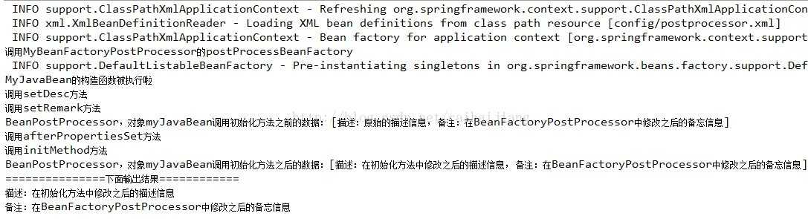
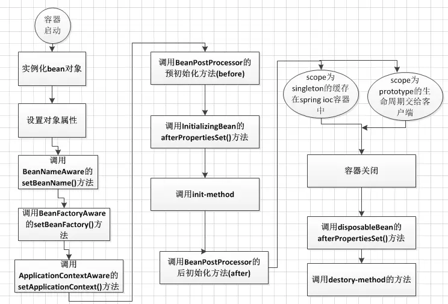
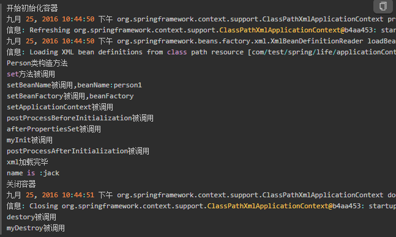

# Spring IoC 容器的启动分析

## 一、BeanFactoryPostProcessor 和 BeanPostProcessor

BeanFactoryPostProcessor 和 BeanPostProcessor，这两个接口，都是 Spring 初始化 bean 时对外暴露的扩展点。两个接口名称看起来很相似，但作用及使用场景却不同，分析如下：

### 1.BeanFactoryPostProcessor 接口

该接口的定义如下：

```java {.line-numbers}
public interface BeanFactoryPostProcessor {

    /**
     * Modify the application context's internal bean factory after its standard
     * initialization. All bean definitions will have been loaded, but no beans
     * will have been instantiated yet. This allows for overriding or adding
     * properties even to eager-initializing beans.
     * @param beanFactory the bean factory used by the application context
     * @throws org.springframework.beans.BeansException in case of errors
     */
    void postProcessBeanFactory(ConfigurableListableBeanFactory beanFactory) throws BeansException;

}
```

实现该接口，可以在 spring 的 bean 创建之前，修改 bean 的定义属性。也就是说，Spring 允许 BeanFactoryPostProcessor 在容器实例化任何其它 bean（即调用 bean 的构造函数）之前读取配置元数据，并可以根据需要进行修改，例如可以把 bean 的 scope 从 singleton 改为 prototype，也可以把 property 的值给修改掉。可以同时配置多个 BeanFactoryPostProcessor，并通过设置 "order" 属性来控制各个 BeanFactoryPostProcessor 的执行次序。

注意：BeanFactoryPostProcessor 是在 spring 容器加载了 bean 的定义文件之后，在 bean 实例化之前执行的。接口方法的入参是 ConfigurrableListableBeanFactory，使用该参数，可以获取到相关 bean 的定义信息。

### 2.BeanPostProcessor 接口

该接口的定义如下：

```java {.line-numbers}
public interface BeanPostProcessor {
    Object postProcessBeforeInitialization(Object bean, String beanName) throws BeansException;
    Object postProcessAfterInitialization(Object bean, String beanName) throws BeansException;
}
```

BeanPostProcessor，可以在 spring 容器实例化 bean，即在执行 bean 的初始化方法前后，添加一些自己的处理逻辑。这里说的初始化方法，指的是下面两种：

- bean 实现了 **`InitializingBean`** 接口，对应的方法为 afterPropertiesSet
- 在 XML 中定义 bean 的时候，通过 **`init-method`** 设置的方法

注意：BeanPostProcessor 是在 spring 容器加载了 bean 的定义文件并且实例化 bean 之后执行的。BeanPostProcessor 的执行顺序是在 BeanFactoryPostProcessor 之后。Spring 中，有内置的一些 BeanPostProcessor 实现类，比如 **`org.springframework.context.support.ApplicationContextAwareProcessor`**，这个是用来为 bean 注入 ApplicationContext 等容器对象。这些注解类的 BeanPostProcessor，在 spring 配置文件中，可以通过这样的配置 **`<context:component-scan base-package="*.*" />`** ，自动进行注册。

### 3.完整的例子

#### 3.1.定义一个 Java Bean

```java {.line-numbers}
public class MyJavaBean implements InitializingBean {
    private String desc;
    private String remark;

    public MyJavaBean() {
        System.out.println("MyJavaBean的构造函数被执行啦");
    }
    public String getDesc() {
        return desc;
    }
    public void setDesc(String desc) {
        System.out.println("调用setDesc方法");
        this.desc = desc;
    }
    public String getRemark() {
        return remark;
    }
    public void setRemark(String remark) {
        System.out.println("调用setRemark方法");
        this.remark = remark;
    }
    public void afterPropertiesSet() throws Exception {
        System.out.println("调用afterPropertiesSet方法");
        this.desc = "在初始化方法中修改之后的描述信息";
    }
    public void initMethod() {
        System.out.println("调用initMethod方法");
    }
    public String toString() {
        StringBuilder builder = new StringBuilder();
        builder.append("[描述：").append(desc);
        builder.append("， 备注：").append(remark).append("]");
        return builder.toString();
    }
}
```

#### 3.2.定义一个 BeanFactoryPostProcessor

```java {.line-numbers}
public class MyBeanFactoryPostProcessor implements BeanFactoryPostProcessor {

    public void postProcessBeanFactory(ConfigurableListableBeanFactory beanFactory) throws BeansException {
        System.out.println("调用MyBeanFactoryPostProcessor的postProcessBeanFactory");
        BeanDefinition bd = beanFactory.getBeanDefinition("myJavaBean");
        MutablePropertyValues pv =  bd.getPropertyValues();  
        if (pv.contains("remark")) {  
            pv.addPropertyValue("remark", "在BeanFactoryPostProcessor中修改之后的备忘信息");  
        }  
    }
}
```

#### 3.3.定义一个 BeanPostProcessor

```java {.line-numbers}
public class MyBeanPostProcessor implements BeanPostProcessor {

    public Object postProcessBeforeInitialization(Object bean, String beanName) throws BeansException {
        System.out.println("BeanPostProcessor，对象" + beanName + "调用初始化方法之前的数据： " + bean.toString());
        return bean;
    }
    public Object postProcessAfterInitialization(Object bean, String beanName) throws BeansException {
        System.out.println("BeanPostProcessor，对象" + beanName + "调用初始化方法之后的数据：" + bean.toString());
        return bean;
    }
}
```

#### 3.4.Spring 的配置

```java {.line-numbers}
<bean id="myJavaBean" class="com.ali.caihj.postprocessor.MyJavaBean" init-method="initMethod">
    <property name="desc" value="原始的描述信息" />
    <property name="remark" value="原始的备注信息" />
</bean>

<bean id="myBeanPostProcessor" class="com.ali.caihj.postprocessor.MyBeanPostProcessor" />
<bean id="myBeanFactoryPostProcessor" class="com.ali.caihj.postprocessor.MyBeanFactoryPostProcessor" />
```

#### 3.5.测试类

```java {.line-numbers}
public class PostProcessorMain {
    public static void main(String[] args) {
        ApplicationContext context = new ClassPathXmlApplicationContext("config/postprocessor.xml");
        MyJavaBean bean = (MyJavaBean) context.getBean("myJavaBean");
        System.out.println("===============下面输出结果============");
        System.out.println("描述：" + bean.getDesc());
        System.out.println("备注：" + bean.getRemark());

    }
}
```

#### 3.6.运行结果

<div align="center">  </div>

从上面的结果可以看出，BeanFactoryPostProcessor 在 bean 实例化之前执行，之后实例化 bean（调用构造函数，并调用 set 方法注入属性值），然后在调用两个初始化方法前后，执行了 BeanPostProcessor。初始化方法的执行顺序是，先执行 afterPropertiesSet，再执行 **`init-method`**。

## 二、Spring IoC 容器的启动过程

在 Spring 的体系中，依赖注入（Dependency Injection，简称 DI）是一个基础设施级的功能。一般说使用 Spring，默认都会认为必然会使用 DI 的功能。所以学习 Spring 的源代码，一般也会从 DI 入手。Spring 的依赖注入主要是靠应用上下文（ApplicationContext）来实现的。顾名思义，应用上下文就是持有了应用启动必须的各种信息的对象。在多种 ApplicationContext 中，ClassPathXmlApplicationContext 是比较简单的一个，从它的名字可以看出，它是基于 Java 的 Classpath 的，同时是基于 Xml 配置的。

下面就以 dubbo 源代码中提供的 demo 来跟踪一下 ClassPathXmlApplicationContext 这个应用上下文的启动过程。它主要通过下面这一行代码来启动：

```java {.line-numbers}
public class RpcServerStarter {
    public static void main(String[] args) {
        new ClassPathXmlApplicationContext("classpath:rpc-invoke-config-server.xml");
    }
}
```

ApplicationContext 启动过程中，会创建 Spring Bean 容器，然后初始化相关 Bean，再向 Bean 中注入其相关依赖。所以我们仅仅需要 Debug 跟踪 Main 方法中

```java{.line-numbers}
new ClassPathXmlApplicationContext("classpath:rpc-invoke-config-server.xml");
```

这一句代码,查看 Spring 是如何创建 ApplicationContext 容器并将 xml 中的配置信息装配进容器。

### 1.检查并设置 Spring XML 配置文件

我们进入到构造函数的源代码中如下：

```java {.line-numbers}
public ClassPathXmlApplicationContext(String configLocation) throws BeansException {
    this(new String[] { configLocation }, true, null);
}

public ClassPathXmlApplicationContext(String[] configLocations, boolean refresh, ApplicationContext parent)
        throws BeansException {
    super(parent);
    // 将我们程序传入的配置文件的路径保存到ClassPathXmlApplicationContext的父类中
    // 其实就是保存到AbstractRefreshableConfigApplicationContext中的configLocations属性
    setConfigLocations(configLocations);
    if (refresh) {
        refresh();
    }
}
```

设置此应用程序上下文的配置文件位置，如果未设置，Spring 可以根据需要使用默认值。将解析得到的 Spring 的 XML 配置文件地址存储到 configLocations 属性中。

### 2.执行创建 Bean 容器之前的准备工作

在上面设置好 XML 配置文件路径之后，剩余的步骤都在该类的 **`refresh();`** 这个方法中执行，整个 SpringApplication 的构建都在这个方法 里面，所以我们需要 Debug 跟进入这个法。refresh 的代码如下：

```java {.line-numbers}
//class:AbstractApplicationContext
@Override
public void refresh() throws BeansException, IllegalStateException {
    synchronized (this.startupShutdownMonitor) {
        // 执行创建容器前的准备工作 :记录下容器的启动时间、标记"已启动"状态、处理配置文件中的占位符
        prepareRefresh();

        // 创建Bean容器，加载XML配置信息：如果存在容器进行销毁旧容器，创建新容器，解析XML配置文件为一个个BeanDefinition定义
        // 注册到新容器(BeanFactory)中，注意Bean未初始化
        ConfigurableListableBeanFactory beanFactory = obtainFreshBeanFactory();

        // 设置 BeanFactory 的类加载器，添加几个 BeanPostProcessor，手动注册几个特殊的 bean
        prepareBeanFactory(beanFactory);

        try {
            // 加载并执行后置处理器
            postProcessBeanFactory(beanFactory);
            // 回调容器中那些实现了BeanFactoryPostProcessor接口的对象中的postProcessBeanFactory()方法
            invokeBeanFactoryPostProcessors(beanFactory);
            // 注册所有实现BeanPostProcessor接口的bean，即将这些bean实例化，然后将其放到beanFactory中
            registerBeanPostProcessors(beanFactory);
            // 初始化Spring容器的消息源
            initMessageSource();
            // 初始化Spring容器事件广播器
            initApplicationEventMulticaster();
            // 空方法
            onRefresh();
            // 注册事件监听器
            registerListeners();
            // 初始化（构造）所有在XML文件中配置的单例非延迟加载的bean
            finishBeanFactoryInitialization(beanFactory);
            // 清理缓存,如果容器中存Bean名为lifecycleProcessor的Bean
            // 对其进行注册,如果不存在创建一个DefaultLifecycleProcessor进行注册
            finishRefresh();
        } catch (BeansException ex) {
            // Destroy already created singletons to avoid dangling resources.
            destroyBeans();
            // 重置'有效'标志。
            cancelRefresh(ex);
            // 向调用者传播异常。
            throw ex;
        }
    }
}
```

其中，refresh 中的第一个方法 prepareRefresh，它的作用主要做了一些准备工作，如设置启动时间，设置关闭状态为 false，活动状态为 true，初始化属性源等。

### 3.创建 Bean 容器，加载并注册 Bean

refresh 中接下来的一个方法为 **`obtainFreshBeanFactory`**，**`obtainFreshBeanFactory`** 方法内部通过 **`AbstractRefreshableApplicationContext`** 中的 refreshBeanFactory 方法刷新 bean 工厂，它先判断内部的 BeanFactory 是否已存在，若存在则销毁它们保存的 bean，并关闭之。之后这个方法的核心工作是调用了 createBeanFactory 方法创建内部的 beanFactory。接下来 **`obtainFreshBeanFactory`** 的代码如下：

```java {.line-numbers}
//class:AbstractApplicationContext
protected ConfigurableListableBeanFactory obtainFreshBeanFactory() {
    // 调用AbstractRefreshableApplicationContext类中的refreshBeanFactory方法
    refreshBeanFactory();
    ConfigurableListableBeanFactory beanFactory = getBeanFactory();
    if (logger.isDebugEnabled()) {
        logger.debug("Bean factory for " + getDisplayName() + ": " + beanFactory);
    }
    return beanFactory;
}
```

```java {.line-numbers}
/**
 * class:AbstractRefreshableApplicationContext
 * 如果ApplicationContext中的BeanFactory属性已经有值，销毁此BeanFactory所有 Bean，关闭 BeanFactory，
 * 重新创建一个新的Bean容器设置给ApplicationContext的beanFactory属性。
 */
protected final void refreshBeanFactory() throws BeansException {
    if (hasBeanFactory()) {
        // 销毁容器
        destroyBeans();
        closeBeanFactory();
    }
    try {
        // 创建类型为DefaultListableBeanFactory新容器赋值给BeanFactory变量，
        // 默认创建的是DefaultListableBeanFactory容器
        DefaultListableBeanFactory beanFactory = createBeanFactory();
        beanFactory.setSerializationId(getId());
        // 设置 BeanFactory 的两个配置属性：是否允许 Bean 覆盖、是否允许循环引用
        customizeBeanFactory(beanFactory);
        // 这个方法将根据配置，加载各个Bean，然后放到 BeanFactory 中，这个方法是通过XmlBeanDefinitionReader去加载配置文件中的bean定义; 
        // 注意：这里的加载并不是初始化这个Bean，而是以Key-value的形式存储在beanFactory的beanDefinitionMap中; 
        // beanDefinitionMap存储的键值对的类型为beanName -> beanDefinition
        loadBeanDefinitions(beanFactory);
        synchronized (this.beanFactoryMonitor) {
            this.beanFactory = beanFactory;
        }
    } catch (IOException ex) {
        throw new ApplicationContextException("I/O error parsing bean definition source for " + getDisplayName(),
                ex);
    }
}
```

关注一下 BeanFactory 这个接口，它是访问 Spring bean 容器的根接口，提供了访问 bean 容器的基本功能。通过 loadBeanDefinition 加载各种 Bean 的定义到 BeanFactory 中。这个方法是通过 XmlBeanDefinitionReader 去加载 XML 配置文件中的 bean 定义。具体过程比较繁琐，这里就不展开了，后续有时间再专门介绍。加载完之后，会将 beanDefinition 保存在 DefaultListableBeanFactory 的一个 field 中：

```java {.line-numbers}
/** Map of bean definition objects, keyed by bean name */
private final Map<String, BeanDefinition> beanDefinitionMap = new ConcurrentHashMap<String, BeanDefinition>(256);
```

至此，Spring 容器启动过程中的第一大步骤就算基本完成了，就是将 bean 定义从配置文件中读取出来，并解析为 BeanDefinition 保存在应用上下文的内置 BeanFactory 的内部的一个 map 中，key 为配置文件中定义的 bean 的 name。

### 4.配置 Bean 容器: prepareBeanFactory

主要工作为在 Bean 容器创建完毕会手动注册一些特殊的 bean。官网这样解释: "配置工厂的标准上下文特征，例如上下文的 ClassLoader 和后处理器"。

```java {.line-numbers}
//class:AbstractApplicationContext
protected void prepareBeanFactory(ConfigurableListableBeanFactory beanFactory) {
    // 这里设置为加载当前 ApplicationContext 类的类加载器
    beanFactory.setBeanClassLoader(getClassLoader());
    // 设置 Bean的表达式解析器，默认使用EL表达式，可以使用#{bean.xxx}形式来调用相关的属性值
    beanFactory.setBeanExpressionResolver(new StandardBeanExpressionResolver());
    beanFactory.addPropertyEditorRegistrar(new ResourceEditorRegistrar(this, getEnvironment()));
    // 默认添加一个ApplicationContextAwareProcessor对象，它实现了BeanPostProcessor接口。在这个类的postProcessBeforeInitialization方法中，
    // 如果bean实现了ApplicationContextAware接口, 那么Spring会将上下文ApplicationContext注入Bean属性中。
    // 这个beanPostProcessor中的方法会在初始化bean时，被回调，主要是当被初始化的bean实现了ApplicationContextAware接口
    // 那么就会回调bean的setApplicationContext方法。
    beanFactory.addBeanPostProcessor(new ApplicationContextAwareProcessor(this));
    // 下面几行的意思就是，如果某个 bean 依赖于以下几个接口的实现类，在自动装配的时候忽略它们
    beanFactory.ignoreDependencyInterface(ResourceLoaderAware.class);
    beanFactory.ignoreDependencyInterface(ApplicationEventPublisherAware.class);
    beanFactory.ignoreDependencyInterface(MessageSourceAware.class);
    beanFactory.ignoreDependencyInterface(ApplicationContextAware.class);
    beanFactory.ignoreDependencyInterface(EnvironmentAware.class);

    // 省略代码.....
}
```

在这里我们需要关注一个特殊的 bean，那就是 ApplicationContextAwareProcessor，它实现了 BeanPostProcessor 接口。每当实例化一个 Spring 容器中的一个 bean（调用 bean 的构造函数以及调用各个 set 方法设置属性）之后，就会回调 ApplicationContextAwareProcessor 中的方法 postProcessBeforeInitialization。如果此时这个被实例化的 bean 实现了 ApplicationContextAware 接口，那么 postProcessBeforeInitialization 方法就会调用此接口中的 setApplicationContext 方法。

### 5.处理自定义 Bean 的后置处理器 BeanFactoryPostProcessor

主要功能是实例化在 XML 配置中实现了 BeanFactoryPostProcessor 接口的 bean，然后逐个回调这些 bean 中的 postProcessBeanFactory 方法。

```java {.line-numbers}
static class PostProcessorRegistrationDelegate {
        // class:PostProcessorRegistrationDelegate
        public static void invokeBeanFactoryPostProcessors(ConfigurableListableBeanFactory beanFactory,
                List<BeanFactoryPostProcessor> beanFactoryPostProcessors) {

            Set<String> processedBeans = new HashSet<String>();
            // 获取spring配置文件中定义的所有实现BeanFactoryPostProcessor接口的bean，然后将得到的bean分为三类，第一类为实现了PriorityOrdered接口，
            // 第二类为实现了Ordered接口的，第三类为其它普通的仅仅实现了BeanFactoryPostProcessor接口的bean（没有实现Ordered、PriorityOrdered接口）。
            // 之后对于每个BeanFactoryPostProcessor，调用postProcessBeanFactory方法。
            String[] postProcessorNames = beanFactory.getBeanNamesForType(BeanFactoryPostProcessor.class, true, false);

            // Separate between BeanFactoryPostProcessors that implement PriorityOrdered,
            // Ordered, and the rest.
            List<BeanFactoryPostProcessor> priorityOrderedPostProcessors = new ArrayList<BeanFactoryPostProcessor>();
            List<String> orderedPostProcessorNames = new ArrayList<String>();
            List<String> nonOrderedPostProcessorNames = new ArrayList<String>();
            for (String ppName : postProcessorNames) {
                if (processedBeans.contains(ppName)) {
                } else if (beanFactory.isTypeMatch(ppName, PriorityOrdered.class)) {
                    priorityOrderedPostProcessors.add(beanFactory.getBean(ppName, BeanFactoryPostProcessor.class));
                } else if (beanFactory.isTypeMatch(ppName, Ordered.class)) {
                    orderedPostProcessorNames.add(ppName);
                } else {
                    nonOrderedPostProcessorNames.add(ppName);
                }
            }
            // 首先，回调那些实现了PriorityOrdered接口的BeanFactoryPostProcessors
            // 代码省略......

            // 接着，回调那些实现了Ordered接口的BeanFactoryPostProcessors
            // 代码省略......

            // 最后，首先实例化BeanFactoryPostProcessor，然后回调其中的方法postProcessBeanFactory
            List<BeanFactoryPostProcessor> nonOrderedPostProcessors = new ArrayList<BeanFactoryPostProcessor>();
            for (String postProcessorName : nonOrderedPostProcessorNames) {
                nonOrderedPostProcessors.add(beanFactory.getBean(postProcessorName, BeanFactoryPostProcessor.class));
            }
            invokeBeanFactoryPostProcessors(nonOrderedPostProcessors, beanFactory);
        }
```

实例化并调用所有的 BeanFactoryPostProcessor，BeanFactoryPostProcessor 就是在 BeanFactory 的标准初始化流程结束之后，对 BeanFactory 进行一些特殊配置的类。这个接口和后面的一些接口都可以看出 Spring 设计的原则，那就是先定义好某个功能的标准处理流程，但也提供了进行定制化处理的接口，并通过先注册后调用的方式很有秩序的进行处理。

回到 refresh 方法中，接下来就是调用 initMessageSource 方法。

### 6.注册所有实现 BeanPostProcessor 接口的 bean

**<font color="red">registerBeanPostProcessors 方法会实例化容器中所有实现了 BeanPostProcessor 接口的 bean，并且将其注册到 BeanFactory 中，也就是将其添加到 BeanFactory 对象的 beanPostProcessors。</font>** BeanPostProcessor 和 BeanFactoryPostProcessor 类似，只不过一个是针对 bean factory，一个是针对具体的 bean。

BeanPostProcessor 接口定义了两个方法 **`postProcessBeforeInitialization`** 和 **`postProcessAfterInitialization`**。前者会在某个 bean 的初始化方法（InitializingBean 接口的 **`afterPropertiesSet`** 方法，或自定义的 **`init-method`**）调用之前被调用。后者则是在初始化方法调用之后调用。

```java {.line-numbers}
public static void registerBeanPostProcessors(ConfigurableListableBeanFactory beanFactory,
                AbstractApplicationContext applicationContext) {

            String[] postProcessorNames = beanFactory.getBeanNamesForType(BeanPostProcessor.class, true, false);
            // 省略代码......
            // 从Spring的配置文件中获取所有实现了BeanPostProcessor接口的对象bean，然后将其同样分为3类。
            List<BeanPostProcessor> priorityOrderedPostProcessors = new ArrayList<BeanPostProcessor>();
            List<BeanPostProcessor> internalPostProcessors = new ArrayList<BeanPostProcessor>();
            List<String> orderedPostProcessorNames = new ArrayList<String>();
            List<String> nonOrderedPostProcessorNames = new ArrayList<String>();
            for (String ppName : postProcessorNames) {
                if (beanFactory.isTypeMatch(ppName, PriorityOrdered.class)) {
                    BeanPostProcessor pp = beanFactory.getBean(ppName, BeanPostProcessor.class);
                    priorityOrderedPostProcessors.add(pp);
                    if (pp instanceof MergedBeanDefinitionPostProcessor) {
                        internalPostProcessors.add(pp);
                    }
                } else if (beanFactory.isTypeMatch(ppName, Ordered.class)) {
                    orderedPostProcessorNames.add(ppName);
                } else {
                    nonOrderedPostProcessorNames.add(ppName);
                }
            }
            // 省略代码.....
            // 实例化BeanFactory中所有实现了BeanPostProcessor接口的bean，并且把这个bean放入到beanFactory中的beanPostProcessors属性里面，
            // 等到后面调用 实现了InitializingBean接口的bean 的afterPropertiesSet方法之前/之后，再通过遍历beanPostProcessors，来执行其中
            // 的方法
            List<BeanPostProcessor> nonOrderedPostProcessors = new ArrayList<BeanPostProcessor>();
            for (String ppName : nonOrderedPostProcessorNames) {
                BeanPostProcessor pp = beanFactory.getBean(ppName, BeanPostProcessor.class);
                nonOrderedPostProcessors.add(pp);
                if (pp instanceof MergedBeanDefinitionPostProcessor) {
                    internalPostProcessors.add(pp);
                }
            }
            registerBeanPostProcessors(beanFactory, nonOrderedPostProcessors);
            // 省略代码.......
            beanFactory.addBeanPostProcessor(new ApplicationListenerDetector(applicationContext));
 }
```

```java {.line-numbers}
private static void registerBeanPostProcessors(ConfigurableListableBeanFactory beanFactory,
                List<BeanPostProcessor> postProcessors) {
    // 将实现了BeanPostProcessor接口的bean加入到beanFactory中，也就是beanFactory中的beanPostProcessors属性里面
    for (BeanPostProcessor postProcessor : postProcessors) {
          beanFactory.addBeanPostProcessor(postProcessor);
    }
 }
```

### 7.初始化 Spring 容器事件广播器

```java {.line-numbers}
//class:AbstractApplicationContext
//注册Spring的事件广播器用于广播Spring的内置事件和自定义事件
protected void initApplicationEventMulticaster() {
    ConfigurableListableBeanFactory beanFactory = getBeanFactory();
    //APPLICATION_EVENT_MULTICASTER_BEAN_NAME的值为字符串applicationEventMulticaster
    //如果beanFactory中已经有了applicationEventMulticaster的话，直接返回，
    //如果没有，则默认将其初始化为SimpleApplicationEventMulticaster，然后返回
    if (beanFactory.containsLocalBean(APPLICATION_EVENT_MULTICASTER_BEAN_NAME)) {
        this.applicationEventMulticaster =
                beanFactory.getBean(APPLICATION_EVENT_MULTICASTER_BEAN_NAME, ApplicationEventMulticaster.class);
        //省略代码......
    }
    else {
        this.applicationEventMulticaster = new SimpleApplicationEventMulticaster(beanFactory);
        beanFactory.registerSingleton(APPLICATION_EVENT_MULTICASTER_BEAN_NAME, this.applicationEventMulticaster);
        //省略代码......
    }
}
```

### 8.注册事件监听器

接下来会从 BeanFactory 中找出所有实现了 ApplicationListener 接口的 bean 的名字，并且把这个 bean 的名字添加到 applicationListeners 这个 Set 集合中。

```java {.line-numbers}
//class:AbstractApplicationContext
protected void registerListeners() {
    // 首先注册静态指定的侦听器
    for (ApplicationListener<?> listener : getApplicationListeners()) {
        getApplicationEventMulticaster().addApplicationListener(listener);
    }
    // 下面是我们自定义的监听器
    String[] listenerBeanNames = getBeanNamesForType(ApplicationListener.class, true, false);
    for (String lisName : listenerBeanNames) {
        getApplicationEventMulticaster().addApplicationListenerBean(lisName);
    }
}
```

### 9.初始化（构造）所有在 XML 文件中配置的单例非延迟加载的 bean

执行到这一步，Spring 的 XML 配置文件中的特殊的 Bean 基本上都注册了（比如实现了 BeanPostProcessor 接口的 Bean），或者被调用了（比如实现了 BeanFactoryPostProcessor 接口的 bean）。剩下的都是普通的 Bean 了，这些普通的 bean（仅仅是非延迟实例化的单例 Bean）在 **`finishBeanFactoryInitialization`** 方法中被实例化，也就是说这一步就已经完成了 Bean 工厂（ApplicationContext）的初始化。

```java {.line-numbers}
//class:AbstractApplicationContext
protected void finishBeanFactoryInitialization(ConfigurableListableBeanFactory beanFactory) {
    // 省略代码......
    // 实例化所有剩余（非延迟初始化）单例
    beanFactory.preInstantiateSingletons();
}
```

调用 BeanFactory 中的 **`preInstantiateSingletons`** 真正进行容器中各个 bean 的实例化，从上面的代码可以看出，对于非抽象类、非延迟初始化的单例 bean，在 spring 容器启动的时候调用 **`getBean`** 方法来实例化 bean，并进行相关初始化工作。

```java {.line-numbers}
//class:DefaultListableBeanFactory
public void preInstantiateSingletons() throws BeansException {
    //省略代码......
    List<String> beanNames;
    synchronized (this.beanDefinitionMap) {
        beanNames = new ArrayList<String>(this.beanDefinitionNames);
    }

    for (String beanName : beanNames) {
        RootBeanDefinition bd = getMergedLocalBeanDefinition(beanName);
        if (!bd.isAbstract() && bd.isSingleton() && !bd.isLazyInit()) {
            if (isFactoryBean(beanName)) {
                // 省略代码
            }
            else {
                // 实例化所有非延迟初始化单例
                getBean(beanName);
            }
        }
    }
    // 省略代码
}
```

**`getBean`** 会接着调用 **`doGetBean`** 方法，**`doGetBean`** 中会通过 **`getSingleton`** 来真正创建 beanName 所表示的 bean，这个方法最终会调用到 **`AbstractAutowireCapableBeanFactory`** 中的 **`doCreateBean`** 方法。

```java {.line-numbers}
//class:AbstractBeanFactory
public Object getBean(String name) throws BeansException {
    return doGetBean(name, null, null, false);
}
```

在该方法中，首先调用 **`createBeanInstance`** 方法，创建 bean 实例对象（这个时候执行 bean 的构造方法），然后调用 **`populateBean`** 方法，对 bean 进行填充，注入相关依赖，之后再调用方法 **`initializeBean`**，进行相关初始化工作：

```java {.line-numbers}
protected Object doCreateBean(final String beanName, final RootBeanDefinition mbd, final Object[] args) {
        // Instantiate the bean.
        BeanWrapper instanceWrapper = null;
        if (mbd.isSingleton()) {
            instanceWrapper = this.factoryBeanInstanceCache.remove(beanName);
        }
        if (instanceWrapper == null) {
            // 首先调用createBeanInstance方法，创建bean实例对象（这个时候执行bean的构造方法）
            instanceWrapper = createBeanInstance(beanName, mbd, args);
        }
        final Object bean = (instanceWrapper != null ? instanceWrapper.getWrappedInstance() : null);
        Class<?> beanType = (instanceWrapper != null ? instanceWrapper.getWrappedClass() : null);

        // 省略代码

        // Initialize the bean instance.
        Object exposedObject = bean;
        try {
            // 调用populateBean方法，对bean进行填充，注入相关依赖
            populateBean(beanName, mbd, instanceWrapper);
            if (exposedObject != null) {
                // 调用方法initializeBean，进行相关初始化工作
                exposedObject = initializeBean(beanName, exposedObject, mbd);
            }
        }catch (Throwable ex) {
            // 省略代码
        }
        // 省略代码
        return exposedObject;
    }
```

从下面 **`initializeBean`** 的实现可以看出，先调用 **`applyBeanPostProcessorsBeforeInitialization`** 方法，执行每个 BeanPostProcessor 的 **`postProcessBeforeInitialization`**，然后调用 **`invokeInitMethods`** 方法，执行 bean 的初始化方法，最后调用 **`applyBeanPostProcessorsAfterInitialization`** 方法，执行每个 BeanPostProcessor 的 **`postProcessAfterInitialization`** 方法：

```java {.line-numbers}
//class:AbstractAutowireCapableBeanFactory
protected Object initializeBean(final String beanName, final Object bean, RootBeanDefinition mbd) {
    if (System.getSecurityManager() != null) {
        // 省略代码
    }else {
        invokeAwareMethods(beanName, bean);
    }
    Object wrappedBean = bean;
    if (mbd == null || !mbd.isSynthetic()) {
        // 先调用applyBeanPostProcessorsBeforeInitialization方法，执行每个BeanPostProcessor
        // 的postProcessBeforeInitialization
        wrappedBean = applyBeanPostProcessorsBeforeInitialization(wrappedBean, beanName);
    }
    try {
        // 执行bean的初始化方法，如果这个bean实现了InitializingBean接口，就会回调afterPropertiesSet方法，
        // 然后调用用户自己定义的初始化方法（在init-method属性中指明）
        invokeInitMethods(beanName, wrappedBean, mbd);
    }catch (Throwable ex) {
        throw new BeanCreationException(
                (mbd != null ? mbd.getResourceDescription() : null),
                beanName, "Invocation of init method failed", ex);
    }

    if (mbd == null || !mbd.isSynthetic()) {
        // 调用applyBeanPostProcessorsAfterInitialization方法，执行每个BeanPostProcessor的
        // postProcessAfterInitialization方法
        wrappedBean = applyBeanPostProcessorsAfterInitialization(wrappedBean, beanName);
    }
    return wrappedBean;
}
```

其中 **`invokeAwareMethods`** 和 **`invokeInitMethods`** 这两个方法的代码如下：

```java {.line-numbers}
//class:AbstractAutowireCapableBeanFactory
//如果这个bean实现了BeanNameAware、BeanClassLoaderAware以及BeanFactoryAware接口的话，就回调对应的方法
private void invokeAwareMethods(final String beanName, final Object bean) {
    if (bean instanceof Aware) {
        if (bean instanceof BeanNameAware) {
            ((BeanNameAware) bean).setBeanName(beanName);
        }
        if (bean instanceof BeanClassLoaderAware) {
            ((BeanClassLoaderAware) bean).setBeanClassLoader(getBeanClassLoader());
        }
        if (bean instanceof BeanFactoryAware) {
            ((BeanFactoryAware) bean).setBeanFactory(AbstractAutowireCapableBeanFactory.this);
        }
    }
}
```

```java {.line-numbers}
//class:AbstractAutowireCapableBeanFactory
protected void invokeInitMethods(String beanName, final Object bean, RootBeanDefinition mbd)
        throws Throwable {
    boolean isInitializingBean = (bean instanceof InitializingBean);
    if (isInitializingBean && (mbd == null || !mbd.isExternallyManagedInitMethod("afterPropertiesSet"))) {
        if (System.getSecurityManager() != null) {
            // 调用代码
        }else {
            // 如果这个bean实现类InitializingBean接口，就会回调此bean的afterPropertiesSet方法
            ((InitializingBean) bean).afterPropertiesSet();
        }
    }
    if (mbd != null) {
        String initMethodName = mbd.getInitMethodName();
        if (initMethodName != null && !(isInitializingBean && "afterPropertiesSet".equals(initMethodName)) &&
                !mbd.isExternallyManagedInitMethod(initMethodName)) {
            // 回调我们自己指定的初始化方法，即在标签中通过init-method属性
            invokeCustomInitMethod(beanName, bean, mbd);
        }
    }
}
```

**<font color="red">从 `invokeInitMethods` 方法的实现可以看出，先执行 `afterPropertiesSet` 方法，然后再通过反射，执行 `init-method` 指定的方法。</font>**

## 三、Spring Bean 的生命周期

### 1.Spring Bean 生命周期介绍

Spring 的 ioc 容器功能非常强大，负责 Spring 的 Bean 的创建和管理等功能。而 Spring 的 bean 是整个 Spring 应用中很重要的一部分，了解 Spring Bean 的生命周期对我们了解整个 spring 框架会有很大的帮助。BeanFactory 和 ApplicationContext 是 Spring 两种很重要的容器，前者提供了最基本的依赖注入的支持，而后者在继承前者的基础进行了功能的拓展，例如增加了事件传播，资源访问和国际化的消息访问等功能。本文主要介绍了 ApplicationContext。

ApplicationContext 中的 Bean 的生命周期如下：

<div align="center">  </div>

ApplicationContext 容器中，Bean 的生命周期流程如上图所示，流程大致如下：

- 首先容器启动后，会对 scope 为 singleton 且非懒加载的 bean 进行实例化（相当于调用构造方法）；
- 按照 Bean 定义信息配置信息，注入所有的属性；
- 如果 Bean 实现了 BeanNameAware 接口，会回调该接口的 **`setBeanName()`** 方法，传入该 Bean 的 id，此时该 Bean 就获得了自己在配置文件中的 id；
- 如果 Bean 实现了 BeanFactoryAware 接口，会回调该接口的 **`setBeanFactory()`** 方法，传入该 Bean 的 BeanFactory（实现 BeanFactoryAware 主要目的是为了获取 Spring 容器，如 Bean 通过 Spring 容器发布事件等）；
- 如果 Bean 实现了 ApplicationContextAware 接口，会回调该接口的 **`setApplicationContext()`** 方法，传入该 Bean 的 ApplicationContext（作用与 BeanFactory 类似都是为了获取 Spring 容器，不同的是 Spring 容器在调用 **`setApplicationContext`** 方法时会把它自己作为 **`setApplicationContext`** 的参数传入，而 Spring 容器在调用 **`setBeanDactory`** 前需要程序员自己指定（注入）**`setBeanDactory`** 里的参数 BeanFactory）；
- 如果有 Bean 实现了 BeanPostProcessor 接口，则会回调该接口的 **`postProcessBeforeInitialzation()`** 方法（作用是在 Bean 实例创建成功后对进行增强处理，如对 Bean 进行修改，增加某个功能）；
- 如果 Bean 实现了 InitializingBean 接口，则会回调该接口的 **`afterPropertiesSet()`** 方法；
- 如果 Bean 配置了 **`init-method`** 方法，则会执行 **`init-method`** 配置的方法；
- 如果有 Bean 实现了 BeanPostProcessor 接口，则会回调该接口的 **`postProcessAfterInitialization()`** 方法；
- 经过上面这些流程之后，就可以正式使用该 Bean 了，对于 scope 为 singleton 的 Bean，Spring 的 ioc 容器中会缓存一份该 bean 的实例，而对于 scope 为 prototype 的 Bean,每次被调用都会 new 一个新的对象，然后生命周期就交给调用方管理了，不再是 Spring 容器进行管理了；
- 容器关闭后，如果 Bean 实现了 DisposableBean 接口，则会回调该接口的 **`destroy()`** 方法；
- 如果 Bean 配置了 **`destroy-method`** 方法，则会执行 **`destroy-method`** 配置的方法，至此，整个 Bean 的生命周期结束；

### 2.示例

我们定义了一个 Person 类，该类实现了 BeanNameAware、BeanFactoryAware、ApplicationContextAware、InitializingBean、DisposableBean 五个接口，并且在 **`applicationContext.xml`** 文件中配置了该 Bean 的 id 为 person1，并且配置了 **`init-method`** 和 **`destroy-method`**，为该 Bean 配置了属性 name 为 jack 的值，然后定义了一个 MyBeanPostProcessor 方法，该方法实现了 BeanPostProcessor 接口，且在 **`applicationContext.xml`** 文件中配置了该方法的 Bean,其代码如下所示：

```java {.line-numbers}
<bean id="person1" destroy-method="myDestroy" init-method="myInit" class="com.test.spring.life.Person">
    <property name="name">
        <value>jack</value>
    </property>
</bean>

<!-- 配置自定义的后置处理器 -->
<bean id="postProcessor" class="com.pingan.spring.life.MyBeanPostProcessor" />
```

定义的 Bean 代码如下：

```java {.line-numbers}
public class Person implements BeanNameAware, BeanFactoryAware,
        ApplicationContextAware, InitializingBean, DisposableBean {

    private String name;

    public Person() {
        System.out.println("PersonService类构造方法");
    }


    public String getName() {
        return name;
    }
    public void setName(String name) {
        this.name = name;
        System.out.println("set方法被调用");
    }

    //自定义的初始化函数
    public void myInit() {
        System.out.println("myInit被调用");
    }

    //自定义的销毁方法
    public void myDestroy() {
        System.out.println("myDestroy被调用");
    }

    public void destroy() throws Exception {
        // TODO Auto-generated method stub
     System.out.println("destory被调用");
    }

    public void afterPropertiesSet() throws Exception {
        // TODO Auto-generated method stub
        System.out.println("afterPropertiesSet被调用");
    }

    public void setApplicationContext(ApplicationContext applicationContext)
            throws BeansException {
        // TODO Auto-generated method stub
       System.out.println("setApplicationContext被调用");
    }

    public void setBeanFactory(BeanFactory beanFactory) throws BeansException {
        // TODO Auto-generated method stub
         System.out.println("setBeanFactory被调用,beanFactory");
    }

    public void setBeanName(String beanName) {
        // TODO Auto-generated method stub
        System.out.println("setBeanName被调用,beanName:" + beanName);
    }

    public String toString() {
        return "name is :" + name;
    }
```

```java {.line-numbers}
public class MyBeanPostProcessor implements BeanPostProcessor {
    public Object postProcessBeforeInitialization(Object bean,
                                                  String beanName) throws BeansException {
        System.out.println("postProcessBeforeInitialization被调用");
        return bean;
    }

    public Object postProcessAfterInitialization(Object bean,
                                                 String beanName) throws BeansException {
        System.out.println("postProcessAfterInitialization被调用");
        return bean;
    }
}
```

```java {.line-numbers}
public class AcPersonServiceTest {
    public static void main(String[] args) {
        System.out.println("开始初始化容器");
        ApplicationContext ac = new ClassPathXmlApplicationContext("com/test/spring/life/applicationContext.xml");
        System.out.println("xml加载完毕");
        Person person1 = (Person) ac.getBean("person1");
        System.out.println(person1);
        System.out.println("关闭容器");
        ((ClassPathXmlApplicationContext)ac).close();
    }
}
```

我们启动容器，可以看到整个调用过程：

<div align="center">  </div>

