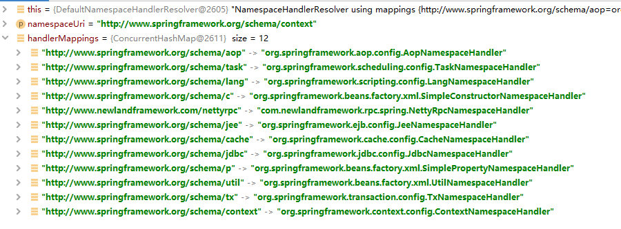

# Spring 自定义标签详解

Spring 的标签配置是通过 XML 来实现的，通过 XSD(XML Schema Definition) 来定义元素，属性，数据类型等。Spring 在解析 xml 文件中的标签的时候会区分当前的标签是四种基本标签（import、alias、bean 和 beans）还是自定义标签，如果是自定义标签，则会按照自定义标签的逻辑解析当前的标签。另外，即使是 bean 标签，其也可以使用自定义的属性或者使用自定义的子标签。本文将对自定义标签，并且会从源码的角度对自定义标签的实现方式进行讲解。

扩展 Spring 自定义标签配置一般需要以下几个步骤：

1. 创建一个需要扩展的组件
2. 定义一个 XSD 文件，用于描述组件内容
3. 创建一个实现 **`AbstractSingleBeanDefinitionParser`** 接口的类，又或者创建一个实现 **`BeanDefinitionParser`** 接口的类，用来解析 XSD 文件中的定义和组件定义。这两种实现方式对应不同的 XSD 文件配置方式。
4. 创建一个 Handler，继承 **`NamespaceHandlerSupport`**，用于将上面创建的 parser 注册到 Spring 容器中
5. 编写 Spring.handlers 和 Spring.schemas 文件

接下来，我们将创建 Parser 分为两种情况，第一种为创建一个实现了 **`AbstractSingleBeanDefinitionParser`** 接口的类，另外一个为实现了 **`BeanDefinitionParser`** 接口的类。

## 一、BeanDefinitionParser 实现方式

### 1.定义组件

```java {.line-numbers}
public class NettyRpcService implements ApplicationContextAware, InitializingBean {
    private String interfaceName;
    private String ref;
    private String filter;
    private ApplicationContext applicationContext;

    @Override
    public void afterPropertiesSet() throws Exception {
        ServiceFilterBinder binder = new ServiceFilterBinder();

        if (StringUtils.isBlank(filter) || !(applicationContext.getBean(filter) instanceof Filter)) {
            binder.setObject(applicationContext.getBean(ref));
        } else {
            binder.setObject(applicationContext.getBean(ref));
            binder.setFilter((Filter) applicationContext.getBean(filter));
        }

        MessageRecvExecutor.getInstance().getHandlerMap().put(interfaceName, binder);
    }

    @Override
    public void setApplicationContext(ApplicationContext applicationContext)
            throws BeansException {
        this.applicationContext = applicationContext;
    }

    public ApplicationContext getApplicationContext() {
        return applicationContext;
    }

    // interfaceName、ref、filter 这三个属性的 getter 和 setter 方法
}
```

### 2.定义 XSD 文件

```java {.line-numbers}
<?xml version="1.0" encoding="UTF-8"?>
<xsd:schema xmlns="http://www.newlandframework.com/nettyrpc"
            xmlns:xsd="http://www.w3.org/2001/XMLSchema"
            xmlns:beans="http://www.springframework.org/schema/beans"
            targetNamespace="http://www.newlandframework.com/nettyrpc"
            elementFormDefault="qualified"
            attributeFormDefault="unqualified">
    <xsd:import namespace="http://www.springframework.org/schema/beans"/>
    <xsd:element name="service">
        <xsd:complexType>
            <xsd:complexContent>
                <xsd:extension base="beans:identifiedType">
                    <xsd:attribute name="interfaceName" type="xsd:string" use="required"/>
                    <xsd:attribute name="ref" type="xsd:string" use="required"/>
                    <xsd:attribute name="filter" type="xsd:string" use="optional"/>
                </xsd:extension>
            </xsd:complexContent>
        </xsd:complexType>
    </xsd:element>
</xsd:schema>
```

在上述 XSD 文件中 targetNamespace 指明了一个新的名称空间 **`http://www.newlandframework.com/nettyrpc`**，并在这个空间里定义一个名称为 service 的元素。service 里面有 3 个 attribute，需要注意的是，其中 3 个属性与我们的 **`NettyRpcService`** 对象的属性没有直接的关系，这里只是一个 XSD 文件的声明，以表征 Spring 的 **`application.xml`** 文件中使用当前命名空间时可以使用的标签属性。命名是否一致根据个人喜好来。具体的和 **`NettyRpcService`** 类中属性的绑定得通过后面定义的 Parser 来完成。

### 3.定义 Parser 类

定义一个 Parser 类，该类实现 **`BeanDefinitionParser`** 接口，并实现构造方法和 **`parse()`** 两个方法。主要是用于解析 XSD 文件中的定义和组件定义。

```java {.line-numbers}
public class NettyRpcServiceParser implements BeanDefinitionParser {
    @Override
    public BeanDefinition parse(Element element, ParserContext parserContext) {
        String interfaceName = element.getAttribute("interfaceName");
        String ref = element.getAttribute("ref");
        String filter = element.getAttribute("filter");

        RootBeanDefinition beanDefinition = new RootBeanDefinition();
        beanDefinition.setBeanClass(NettyRpcService.class);
        beanDefinition.setLazyInit(false);
        beanDefinition.getPropertyValues().addPropertyValue("interfaceName", interfaceName);
        beanDefinition.getPropertyValues().addPropertyValue("ref", ref);
        beanDefinition.getPropertyValues().addPropertyValue("filter", filter);
        // 自定义标签 nettyrpc 类型的 bean 在容器中的名字 beanname，就是 nettyrpc 标签中 interfaceName 属性的值
        parserContext.getRegistry().registerBeanDefinition(interfaceName, beanDefinition);

        return beanDefinition;
    }
}
```

### 4.定义 Handler 类

```java {.line-numbers}
public class NettyRpcNamespaceHandler extends NamespaceHandlerSupport {
    @Override
    public void init() {
        registerBeanDefinitionParser("service", new NettyRpcServiceParser());
        registerBeanDefinitionParser("registry", new NettyRpcRegisteryParser());
        registerBeanDefinitionParser("reference", new NettyRpcReferenceParser());
    }
}
```

每个 Handler 与一个特定的命名空间相关联，比如 **`NettyRpcNamespaceHandler`** 就与上面 XSD 文件指定的命名空间 **`http://www.newlandframework.com/nettyrpc`** 相关联。并且为命名空间中定义的每个元素 service、registry、reference 都注册了一个 Parser 解析器（上面 XSD 限于篇幅，只给出了一个元素的定义）。并且这个命名空间和 Handler 的映射关系将会在接下来介绍的文件中指明。

### 5.Spring.handlers 和 Spring.schemas

编写 **`Spring.handlers`** 和 **`Spring.schemas`** 文件，默认位置放在工程的 META-INF 文件夹下。

**`Spring.handlers`** 文件如下，指明了命名空间和 Handler 的映射关系：

```java {.line-numbers}
http\://www.newlandframework.com/nettyrpc=com.newlandframework.rpc.spring.NettyRpcNamespaceHandler
```

**`Spring.schemas`** 文件如下：

```java {.line-numbers}
http\://www.newlandframework.com/nettyrpc/nettyrpc.xsd=META-INF/nettyrpc.xsd
```

### 6.创建配置文件

我们先在配置文件 Spring.xml 中使用自定义标签如下：

```java {.line-numbers}
<?xml version="1.0" encoding="UTF-8"?>
<beans xmlns="http://www.springframework.org/schema/beans"
       xmlns:xsi="http://www.w3.org/2001/XMLSchema-instance"
       xmlns:context="http://www.springframework.org/schema/context"
       xmlns:myTag="http://www.newlandframework.com/nettyrpc"
       xsi:schemaLocation="
    http://www.springframework.org/schema/beans http://www.springframework.org/schema/beans/spring-beans-3.0.xsd
    http://www.springframework.org/schema/context http://www.springframework.org/schema/context/spring-context.xsd
    http://www.newlandframework.com/nettyrpc http://www.newlandframework.com/nettyrpc/nettyrpc.xsd">
    <myTag:service id="demoAddService" interfaceName="com.newlandframework.rpc.services.AddCalculate"
            ref="calcAddService"/>
    <myTag:service id="demoMultiService" interfaceName="com.newlandframework.rpc.services.MultiCalculate"
            ref="calcMultiService"/>
</beans>
```

在这个配置文件中，**`xmlns:myTag="http://www.newlandframework.com/nettyrpc"`** 表示 myTag 这个自定义标签的命名空间为 **`http://www.newlandframework.com/nettyrpc`**。**<font color="red">当 Spring 容器解析这个 XML 文件时，如果发现一个标签是自定义标签，那么首先获得这个标签的命名空间 `http://www.newlandframework.com/nettyrpc`，然后到 `Spring.handlers` 文件中去找到和这个命名空间对应的 Handler，在这里是 `NettyRpcNamespaceHandler`，从这个 handler 中，我们可以得到命名空间中每一个元素对应的解析器，`service -> NettyRpcServiceParser`、`registry -> NettyRpcRegisteryParser`、`reference -> NettyRpcReferenceParser`。</font>** 在这里，我们需要的是 service 元素的解析器，因此调用 NettyRpcServiceParser 的 **`parse()`** 方法，来对这个标签进行解析，最终生成一个 BeanDefinition 对象。

## 二、自定义标签的解析的过程

### 1.Spring 中 XML 解析过程流程

在 Spring IoC 容器启动的时候，经过一些 XML 和 Spring 初始化配置加载后，进入到 **`AbstractApplicationContext#refresh()`** 方法中。

```java {.line-numbers}
ConfigurableListableBeanFactory beanFactory = obtainFreshBeanFactory();
```

在 **`obtainFreshBeanFactory()`** 方法中，会最终调用到 **`AbstractRefreshableApplicationContext#refreshBeanFactory()`** 方法，然后通过 **`loadBeanDefinitions(beanFactory)`** 方法解析 xml 和注解：

- xml 的解析类：AbstractXmlApplicationContext
- 注解的解析类：AnnotationConfigWebApplicationContext

解析 XML 文件的流程如下：

- **`ClassPathXmlApplicationContext#getConfigResources()`** 方法中，通过 **`getConfigResources()`** 这个方法将所有 xml 文件封装成 Resource 对象。
- 循环 resource 对象，解析每个 xml 文件。
  - 进入 **`XmlBeanDefinitionReader`** 类中的 **`loadBeanDefinitions()`** 方法进行 xml 解析，Spring 使用 dom4j 解析 XML。
  - 在 **`DefaultBeanDefinitionDocumentReader#parseBeanDefinitions(Element root, BeanDefinitionParserDelegate delegate)`** 方法中，通过 XML 的 root 根节点判断是默认的标签（Spring 中默认的标签为 import、alias、bean、beans）还是自定义的标签，分别进行解析。
  - 通过 xml 根节点获取所有子节点，循环每个子节点，并判断子节点是默认标签还是自定义标分别进行解析。
  - 将每个标签的元素解析后封装为 BeanDefinition 对象。BeanDefinition 对象再封装为 BeanDefinitionHolder 对象，BeanDefinitionHolder 包含 bean 的名字、别名和 bean 的 BeanDefinition 对象。

### 2.源码分析

接下来，我们以上面 **`<myTag:service/>`** 为例进行标签解析的源码分析。回顾一下我们开始解析标签的入口函数 **`parseBeanDefinitions(Element root, BeanDefinitionParserDelegate delegate)`**：

```java {.line-numbers}
protected void parseBeanDefinitions(Element root, BeanDefinitionParserDelegate delegate) {
    if (delegate.isDefaultNamespace(root)) {
        // 解析默认标签（beans标签）
        NodeList nl = root.getChildNodes();
        for (int i = 0; i < nl.getLength(); i++) {
            Node node = nl.item(i);
            if (node instanceof Element) {
                Element ele = (Element) node;
                if (delegate.isDefaultNamespace(ele)) {
                    // 解析默认标签（子级嵌套）
                    this.parseDefaultElement(ele, delegate);
                } else {
                    // 解析自定义标签（子级嵌套）
                    delegate.parseCustomElement(ele);
                }
            }
        }
    } else {
        // 解析自定义标签
        delegate.parseCustomElement(root);
    }
}
```

接下来我们探究一下自定义标签的解析过程，及 **`parseCustomElement(Element ele)`** 方法：

```java {.line-numbers}
public BeanDefinition parseCustomElement(Element ele) {
    return this.parseCustomElement(ele, null);
}
```

```java {.line-numbers}
public BeanDefinition parseCustomElement(Element ele, BeanDefinition containingBd) {
    // 获取标签的命名空间
    String namespaceUri = this.getNamespaceURI(ele);
    // 提取自定义标签命名空间处理器
    NamespaceHandler handler = this.readerContext.getNamespaceHandlerResolver().resolve(namespaceUri);
    if (handler == null) {
        error("Unable to locate Spring NamespaceHandler for XML schema namespace [" + namespaceUri + "]", ele);
        return null;
    }
    // 解析标签
    return handler.parse(ele, new ParserContext(this.readerContext, this, containingBd));
}
```

上述方法首先会去获取自定义标签 myTag 的命名空间定义，即 **`http://www.newlandframework.com/nettyrpc`**，然后基于命名空间解析得到对应的 NamespaceHandler，在我们的例子中是 **`NettyRpcNamespaceHandler`**，最后调用该 handler 对标签进行解析处理，本质上调用的就是前面自定义实现的 **`NettyRpcServiceParser`** 中的 **`parse()`** 方法。我们先来看一下自定义标签 **`NamespaceHandler`** 的解析过程，位于 **`DefaultNamespaceHandlerResolver`** 的 **`resolve(String namespaceUri)`** 方法中：

```java {.line-numbers}
public NamespaceHandler resolve(String namespaceUri) {
    // 获取所有已注册的handler集合
    Map<String, Object> handlerMappings = this.getHandlerMappings();
    // 获取namespaceUri对应的handler全程类名或handler实例
    Object handlerOrClassName = handlerMappings.get(namespaceUri);
    if (handlerOrClassName == null) {
        return null;
    } else if (handlerOrClassName instanceof NamespaceHandler) {
        // 已经解析过，直接返回handler实例
        return (NamespaceHandler) handlerOrClassName;
    } else {
        // 未做过解析，则解析对应的类路径className
        String className = (String) handlerOrClassName;
        try {
            // 使用反射创建handler实例
            Class<?> handlerClass = ClassUtils.forName(className, this.classLoader);
            if (!NamespaceHandler.class.isAssignableFrom(handlerClass)) {
                throw new FatalBeanException("Class [" + className + "] for namespace [" + namespaceUri + "] does not implement the [" + NamespaceHandler.class.getName() + "] interface");
            }
            // 初始化实例
            NamespaceHandler namespaceHandler = (NamespaceHandler) BeanUtils.instantiateClass(handlerClass);
            // 调用init()方法
            namespaceHandler.init();
            // 缓存解析后的handler实例
            handlerMappings.put(namespaceUri, namespaceHandler);
            return namespaceHandler;
        } catch (ClassNotFoundException ex) {
            throw new FatalBeanException("NamespaceHandler class [" + className + "] for namespace [" + namespaceUri + "] not found", ex);
        } catch (LinkageError err) {
            throw new FatalBeanException("Invalid NamespaceHandler class [" + className + "] for namespace [" + namespaceUri + "]: problem with handler class file or dependent class", err);
        }
    }
}
```

此方法的逻辑可以概括如下：

从 **`spring.handlers`** 获取所有注册的 handler 集合，这些集合保存在 Map 对象 handlerMapping 中，注意，获取到的 handler 集合中不仅仅包括我们自定义的 handler，还有 Spring 容器中自带的，比如 **`org.springframework.aop.config.AopNamespaceHandler`**，并且在最开始的时候，从 **`Spring.handlers`** 中获取到的保存在 handlerMapping 中的键值对全部是字符串，即 **`String -> String`**。

<div align="center">  </div>

当我们通过 namespaceUri 第一次从 handlerMappings 中获取到 handler 的时候，这个 handler 实际就是 handler 的全类名。然后才通过反射来创建一个 handler 对象，然后调用它的 **`init()`** 方法，比如我们创建的 NettyRpcNamespaceHandler，它的 **`init()`** 方法就是将 myTag 标签中的各个元素（service、registry、reference）和元素对应的解析器 parser 绑定起来。最后将其添加到 handlerMapping 中进行缓存。**<font color="red">当下一次获取同样命名空间的 handler 时，就可以直接获取到然后返回。</font>**

下面，我们具体来说，在 **`spring.handlers`** 中会配置 namespaceUri 与对应 handler 全称类名的键值对：

```java {.line-numbers}
http://www.zhenchao.org/schema/alias=org.zhenchao.handler.CustomNamespaceHandler
```

这里会拿到对应 handler 的全称类名，然后基于反射来创建 handler 实例，过程中会设置构造方法为 accessible。接下来就是轮到调用 **`init()`** 方法，这个方法是由开发人员自己实现的，我们前面的例子中通过该方法将我们自定义的解析器 NettyRpcServiceParser 注册到 handler 实例中。接下来就是调用 handler 实例处理自定义标签：

```java {.line-numbers}
public BeanDefinition parse(Element element, ParserContext parserContext) {
    // 寻找解析器并进行解析
    return this.findParserForElement(element, parserContext) // 找到对应的解析器
            .parse(element, parserContext);  // 进行解析（这里的解析过程是开发者自定义实现的）
}
```

这里主要分为获取 parser 实例和执行解析两个步骤，这里的解析器是在我们在 NettyRpcNamespaceHandler 的 **`init()`** 方法中进行注册的。而找到 parser 之后，直接回调其 **`parse()`** 方法，这里就是直接调用 NettyRpcServiceParser 中的 **`parse()`** 方法对标签进行解析，最后返回 BeanDefinition 对象。
