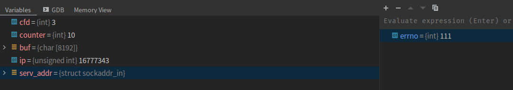

# connect 函数详解

## 一、connect 函数介绍

TCP 客户端使用 connect 函数来建立与 TCP 服务器的连接。

```c
// 若成功则返回 0，若出错则返回 -1
#include <sys/socket.h>
int connect(int sockfd, const struct sockaddr *servaddr, socklen_t addrlen);
```

sockfd 是由 socket 函数返回的套接字描述符，第二个、第三个参数分别是一个指向套接字地址结构的指针和该结构的大小。套接字地址结构必须含有服务器的 IP 地址和端口号。

客户在调用函数 connect 前不必非得调用 bind 函数，__因为如果需要的话，内核会确定源 IP 地址，并选择一个临时端口作为源端口__。如果是 TCP 套接字，调用 connect 函数将激发 TCP 的三路握手过程，而且仅在连接建立成功或出错时才返回，其中出错返回可能有以下几种情况。

**1) ETIMEDOUT 错误**

__若 TCP 客户没有收到 SYN 分节的响应，则返回 ETIMEDOUT 错误__。举例来说，调用 connect 函数时，4.4BSD 内核发送一个 SYN，若无响应则等待 6s 后再发送一个，若仍无响应则等待 24s 后再发送一个。若总共等了 75s 后仍未收到响应则返回本错误。

**2) ECONNREFUSED 错误**

**若对客户的 SYN 的响应是 RST (表示复位)，则表明该服务器主机在我们指定的端口上没有进程在等待与之连接 (例如服务器进程也许没在运行)**。这是一种硬错误 (hard error)，客户一接收到 RST 就马上返回 ECONNREFUSED 错误。RST 是 TCP 在发生错误时发送的一种 TCP 分节。

产生 RST 的三个条件是：

- 目的地为某端口的 SYN 到达，然而该端口上没有正在监听的服务器(如前所述)；
- TCP 想取消一个已有连接；
- TCP 接收到一个根本不存在的连接上的数据分组。

不启动服务端程序进程，启动客户端进程，与服务端程序尝试建立连接：

```c{.line-numbers}
int main() {

    int cfd;
    int counter = 10;
    char buf[BUFSIZ];
    unsigned int ip = 0;

    // 服务器地址结构
    struct sockaddr_in serv_addr;
    serv_addr.sin_family = AF_INET;
    serv_addr.sin_port = htons(SERV_PORT);
    inet_pton(AF_INET, "127.0.0.1", &ip);
    serv_addr.sin_addr.s_addr = ip;

    cfd = socket(AF_INET, SOCK_STREAM, 0);
    if (cfd == -1) {
        sys_err("socket error");
    }

    connect(cfd, (struct sockaddr*) &serv_addr, sizeof(serv_addr));
    connect(cfd, (struct sockaddr*) &serv_addr, sizeof(serv_addr));

    if (errno == ECONNREFUSED) {
        printf("connection is refused.\n");
    }

    return 0;
}
```

执行到第 20 行时，errno 变为 111，即 ECONNREFUSED，如下所示：

<div align="center">
    
</div>

最后客户端输出的结果如下所示：

```shell
/home/xuweilin/CLionProjects/linux_programming/cmake-build-debug/my_client
connection is refused.

Process finished with exit code 0
```

**3) EHOSTUNREACH/ENETUNREACH**

若客户发出的 SYN 在中间的某个路由器上引发了一个 "destination unreachable"（目的地不可达）ICMP 错误，则认为是一种软错误（soft error）。客户主机内核保存该消息，并按第一种情况中所述的时间间隔继续发送 SYN。**若在某个规定的时间（4.4BSD 规定 75s）后仍未收到响应，则把保存的消息（即 ICMP 错误）作为 EHOSTUNREACH 或 ENETUNREACH 错误返回给进程**。以下两种情形也是有可能的：一是按照本地系统的转发表，根本没有到达远程系统的路径；二是 connect 调用根本不等待就返回。

注意，即使 ICMP 错误指示目的网络不可达，图 A-15 中也没有列出 ENETUNREACH。**网络不可达的错误被认为已过时，应用进程应该把 ENEIUNREACH 和 EHOSTUNREACH 作为相同的错误对待**。

我们可以用一个简单客户程序来查看这些不同的出错情况。首先指定本地主机 (127.0.0.1)，它正在运行对应的时间获取服务器程序，我们观察正常的输出：

```shell
solaris 8 daytimetcpcli 127.0.0.1
Sun Jul 27 22:01:51 2003
```

为了查看返回响应的另一种格式，我们指定另外一个主机的 IP 地址：

```shell
solaris 8 daytimetcpcli 192.6.38.100
Sun Jul 27 22:04:59 PDT 2003
```

我们接着指定本地子网（192.168.1/24）上其主机 ID（100）并不存在的一个 IP 地址，也就是说本地子网上没有一个 ID 为 100 的主机（没有 IP 地址为 192.168.1.100 的主机），这样当客户主机发出 ARP 请求（要求那个不存在的主机响应以其硬件地址）时，它将永远收不到 ARP 响应：

```shell
solaris 8 daytimetcpcli 192.168.1.100
connect error: Connection timed out
```

我们等到 connect 函数超时后（对于 Solaris9 约为 4 分钟）才得到该 ETIMEDOUT 错误。

下一个例子中我们指定一个没有运行时间获取服务器程序的主机(其实是一个本地路由器)。服务器主机立刻响应以一个 RST 数据分组。

```shell
solaris 8 daytimetcpcli 192.168.1.5
connect error: Connection refused
```

最后一个例子中我们指定一个因特网中不可到达的 IP 地址。如果我们用 tcpdump 观察分组的情况，就会发现 6 跳以远的路由器返回了主机不可达的 ICMP 错误。

```shell
solaris & daytimetcpcli 192.3.4.5
connect error: No route to host
```

跟 ETIMEDOUT 错误一样，本例中的 connect 也在等待规定的一段时间之后才返回 EHOSTUNREACH 错误。

按照 TCP 状态转换图，connect 函数导致当前套接字从 CLOSED 状态（该套接字自
从由 socket 函数创建以来一直所处的状态）转移到 SYN_SENT 状态（**通过发送 SYN 报文进行了状态转移**），若成功则再转移到 ESTABLISHED 状态。__若 connect 失败则该套接字不再可用，必须关闭，我们不能对这样的套接字再次调用 connect 函数__。当循环调用函数 connect 为给定主机尝试各个 IP 地址直到有一个成功时，在每次 connect 失败后，都必须 close 当前的套接字描述符并重新调用 socket 函数创建出新的套接字。

## 二、非阻塞模式的 connect

### 1.非阻塞模式 connect 介绍

当在一个非阻塞的 TCP 套接字上调用 connect 时，**connect 将立即返回一个 `EINPROGRESS` 错误，不过已经发起的 TCP 三路握手继续进行**。我们接着使用 select 检测这个连接或成功或失败的已建立条件。非阻塞的 connect 有三个用途。

- 我们可以把三路握手叠加在其他处理上。**完成一个 connect 要花一个 RTT 时间（从 A 发出 SYN 报文给 B 到 A 收到 B 返回的 ACK 响应的时间）**，而 RTT 波动范围很大，从局域网上的几个毫秒到几百个毫秒甚至是广域网上的几秒。这段时间内也许有我们想要执行的其他处理工作可执行。
- 我们可以使用这个技术同时建立多个连接。这个用途已随着 Web 浏览器变得流行起来。
- 既然使用 select 等待连接的建立，我们可以给 select 指定一个时间限制，使得我们能够缩短connect 的超时。许多实现有着从 75 秒钟到数分钟的 connect 超时时间。**应用程序有时想要一个更短的超时时间，实现方法之一就是使用非阻塞 connect**。

非阻塞 connnct 虽然听似简单，却有一些我们必须处理的细节：

- 尽管套接字是非阻塞的，如果连接到的服务器在同一个主机上，那么当我们调用 connect 时，连接通常立刻建立。我们必须处理这种情形。
- 源自 Berkeley 的实现（和 POSIX）有关于 select 和非阻塞 connect 的以下两个规则：
  - 当连接成功建立时，描述符变为可写；
  - 当连接建立遇到错误时，描述符变为既可读又可写。

> 关于 select 的这两个规则出自前面关于描述符就绪条件的相关规则。一个 TCP 套接字变为可写的条件是：1.**其发送缓冲区中有可用空间** (对于连接建立中的套接字而言本条件总为真，因为尚未往其中写出任何数据)；2.**该套接字已建立连接** (本子条件为真发生在三路握手完成之后)；3.**一个 TCP 套接字上发生某个错误时**，这个待处理错误总是导致该套接字变为既可读又可写。

### 2.connect 函数在非阻塞模式下的使用

在 socket 是阻塞模式下 connect 函数会一直到有明确的结果才会返回（或连接成功或连接失败），如果服务器地址"较远"，连接速度比较慢，connect 函数在连接过程中可能会导致程序阻塞在 connect 函数处好一会儿（如两三秒之久），虽然这一般也不会对依赖于网络通信的程序造成什么影响，但在实际项目中，我们一般倾向使用所谓的异步的 connect 技术，或者叫非阻塞的 connect。这个流程一般有如下步骤：

1. 创建 socket，并将 socket 设置成非阻塞模式；
2. 调用 connect 函数，此时无论 connect 函数是否连接成功会立即返回；**如果返回 -1 并不表示连接出错，如果此时错误码是 EINPROGRESS**（manpage 对于此错误码的官方描述为 The socket is nonblocking and the connection cannot be completed immediately.）
3. 接着调用 select 函数，在指定的时间内判断该 socket 是否可写，如果可写说明连接成功，反之则认为连接失败。

按上述流程编写代码如下：

```cpp{.line-numbers}
/**
 * 异步的 connect 写法，nonblocking_connect.cpp
 */
#include <sys/types.h> 
#include <sys/socket.h>
#include <arpa/inet.h>
#include <unistd.h>
#include <iostream>
#include <string.h>
#include <stdio.h>
#include <fcntl.h>
#include <errno.h>

#define SERVER_ADDRESS "127.0.0.1"
#define SERVER_PORT     3000
#define SEND_DATA       "helloworld"

int main(int argc, char* argv[]) {
    // 1.创建一个 socket
    int clientfd = socket(AF_INET, SOCK_STREAM, 0);
    if (clientfd == -1) {
        std::cout << "create client socket error." << std::endl;
        return -1;
    }

    // 连接成功以后，我们再将 clientfd 设置成非阻塞模式，
    // 不能在创建时就设置，这样会影响到 connect 函数的行为
    int oldSocketFlag = fcntl(clientfd, F_GETFL, 0);
    int newSocketFlag = oldSocketFlag | O_NONBLOCK;
    if (fcntl(clientfd, F_SETFL,  newSocketFlag) == -1) {
        close(clientfd);
        std::cout << "set socket to nonblock error." << std::endl;
        return -1;
    }

    // 2.连接服务器
    struct sockaddr_in serveraddr;
    serveraddr.sin_family = AF_INET;
    serveraddr.sin_addr.s_addr = inet_addr(SERVER_ADDRESS);
    serveraddr.sin_port = htons(SERVER_PORT);
    for (;;) {
        int ret = connect(clientfd, (struct sockaddr *)&serveraddr, sizeof(serveraddr));
        // ret 为 0，说明 connect 调用成功与服务器建立好连接
        // 当服务器处于客户所在主机时这种情况有可能发生
        if (ret == 0) {
            std::cout << "connect to server successfully." << std::endl;
            close(clientfd);
            return 0;
        // ret 为 -1，还需要继续判断 errno 错误类型
        } else if (ret == -1) {
            if (errno == EINTR) {
                // connect 动作被信号中断，重试 connect
                std::cout << "connecting interruptted by signal, try again." << std::endl;
                break;
            } else if (errno == EINPROGRESS) {
                // 连接正在尝试中
                break;
            } else {
                // 真的出错了
                close(clientfd);
                return -1;
            }
        }
    }

    fd_set writeset;
    FD_ZERO(&writeset);
    FD_SET(clientfd, &writeset);
    // 可以利用 tv_sec 和 tv_usec 做更小精度的超时控制
    struct timeval tv;
    tv.tv_sec = 3;  
    tv.tv_usec = 0;
    // 使用 select 判断 clientfd 建立连接是否成功
    if (select(clientfd + 1, NULL, &writeset, NULL, &tv) == 1) {
        std::cout << "[select] connect to server successfully." << std::endl;
    } else {
        std::cout << "[select] connect to server error." << std::endl;
    }

    // 5. 关闭socket
    close(clientfd);

    return 0;
}
```

为了区别到底是在调用 connect 函数时判断连接成功还是通过 select 函数判断连接成功，我们在后者的输出内容中加上了 "[select]" 标签以示区别。我们先用 nc 命令启动一个服务器程序：

```shell
nc -v -l 0.0.0.0 3000
```

然后编译客户端程序并执行：

```shell
[root@localhost testsocket]# g++ -g -o nonblocking_connect nonblocking_connect.cpp 
[root@localhost testsocket]# ./nonblocking_connect 
[select] connect to server successfully.
```

我们把服务器程序关掉，再重新启动一下客户端，这个时候应该会连接失败，程序输出结果如下：

```shell
[root@localhost testsocket]# ./nonblocking_connect 
[select] connect to server successfully.
```

奇怪？为什么连接不上也会得出一样的输出结果？难道程序有问题？这是因为对于 Linux 系统，如果 select() 返回大于 0 的值，则说明检测到可读或可写的套接字描述符。源自 Berkeley 的实现有两条与 select 和非阻塞 I/O 相关的规则：

- 当连接建立成功时，套接口描述符变成**可写（连接建立时，写缓冲区空闲，所以可写）**
- 当连接建立出错时，套接口描述符变成**既可读又可写（由于有未决的错误，从而可读又可写）**

因此，当发现套接口描述符可读或可写时，需要进一步判断是连接成功还是出错。这里必须将第二种情况和另外一种连接正常的情况区分开，就是连接建立好了之后，服务器端发送了数据给客户端，此时 select 同样会返回非阻塞 socket 描述符既可读又可写。

所以上述流程并不适用于 Linux 系统。正确的做法是，connect 之后，**不仅要用 select 检测可写，还要检测此时 socket 是否出错，通过 getsockopt 获取错误码来检测确定是否连接成功**，错误码为 0 表示连接上，反之为未连接上。 

完整代码如下：

```cpp{.line-numbers}
  /**
   * Linux 下正确的异步的 connect 写法，linux_nonblocking_connect.cpp
   */
  #include <sys/types.h> 
  #include <sys/socket.h>
  #include <arpa/inet.h>
  #include <unistd.h>
  #include <iostream>
  #include <string.h>
  #include <stdio.h>
  #include <fcntl.h>
  #include <errno.h>

  #define SERVER_ADDRESS "127.0.0.1"
  #define SERVER_PORT     3000
  #define SEND_DATA       "helloworld"

  int main(int argc, char* argv[])
  {
      // 1.创建一个 socket
      int clientfd = socket(AF_INET, SOCK_STREAM, 0);
      if (clientfd == -1)
      {
          std::cout << "create client socket error." << std::endl;
          return -1;
      }

      // 连接成功以后，我们再将 clientfd 设置成非阻塞模式，
      // 不能在创建时就设置，这样会影响到 connect 函数的行为
      int oldSocketFlag = fcntl(clientfd, F_GETFL, 0);
      int newSocketFlag = oldSocketFlag | O_NONBLOCK;
      if (fcntl(clientfd, F_SETFL,  newSocketFlag) == -1)
      {
          close(clientfd);
          std::cout << "set socket to nonblock error." << std::endl;
          return -1;
      }

      // 2.连接服务器
      struct sockaddr_in serveraddr;
      serveraddr.sin_family = AF_INET;
      serveraddr.sin_addr.s_addr = inet_addr(SERVER_ADDRESS);
      serveraddr.sin_port = htons(SERVER_PORT);
      for (;;) {
          int ret = connect(clientfd, (struct sockaddr *)&serveraddr, sizeof(serveraddr));
          if (ret == 0) {
              std::cout << "connect to server successfully." << std::endl;
              close(clientfd);
              return 0;
          } else if (ret == -1) {
              if (errno == EINTR) {
                  // connect 动作被信号中断，重试 connect
                  std::cout << "connecting interruptted by signal, try again." << std::endl;
                  break;
              } else if (errno == EINPROGRESS) {
                  // 连接正在尝试中
                  break;
              } else {
                  // 真的出错了，
                  close(clientfd);
                  return -1;
              }
          }
      }

      fd_set writeset;
      FD_ZERO(&writeset);
      FD_SET(clientfd, &writeset);
      // 可以利用 tv_sec 和 tv_usec 做更小精度的超时控制
      struct timeval tv;
      tv.tv_sec = 3;  
      tv.tv_usec = 0;
      if (select(clientfd + 1, NULL, &writeset, NULL, &tv) != 1) {
          std::cout << "[select] connect to server error." << std::endl;
          close(clientfd);
          return -1;
      }

      int err;
      socklen_t len = static_cast<socklen_t>(sizeof err);
      if (::getsockopt(clientfd, SOL_SOCKET, SO_ERROR, &err, &len) < 0) {
          close(clientfd);
          return -1;
      }

      if (err == 0)
          std::cout << "connect to server successfully." << std::endl;
      else
          std::cout << "connect to server error." << std::endl;

      // 5.关闭socket
      close(clientfd);

      return 0;
}
```

如果描述符变为可写，我们就调用 getsockopt 取得套接字的待处理错误(使用 SO_ERROR 套接字选项)。**如果连接成功建立，该值将为 0。如果连接建立发生错误，该值就是对应连接错误的 errno值（譬如 ECONNREFUSED、ETIMEDOUT 等）**。这里我们会遇到第一个移植性问题。如果发生错误，getsockopt 源自 Berkeley 的实现将在我们的变量 error 中返回待处理错误，getsockopt 本身返回 0；然而 Solaris 却让 getsockopt 返回 -1，并把 errno 变量置为待处理错误。

当然，在实际的项目中，第 3 个步骤中 Linux 平台上你也可以使用 poll 函数来判断 socket 是否可写；在 Windows 平台上你可以使用 WSAEventSelect 或 WSAAsyncSelect 函数判断连接是否成功，这里暂且仅以 select 函数为例。

其次，既然我们不能假设套接字的可写条件是 select 返回套接字操作成功条件的唯一方法，下面是取代 getsockopt 调用的几种办法：

- 调用 `getpeername` 代替 `getsockopt`。**如果 `getpeername` 以 `ENOTCONN` 错误失败返回，那么连接建立已经失败**，我们必须接着以 SO_ERROR 调用 `getsockopt` 取得套接字上待处理的错误
- **以值为 0 的长度参数调用 read**。如果 read 失败，那么 connect 已经失败，read 返回的 errno 给出了连接失败的原因。如果连接建立成功，那么 read 应该返回。
- **再调用 connect 一次**。它应该失败，如果错误是 `EISCONN`，那么套接字已经连接，也就是说第一次连接已经成功。

经测试验证，上面第三种方法在 Linux 环境下是有效的：再次调用 connect，**相应返回失败，如果错误 errno 是 EISCONN，表示 socket 连接已经建立**，否则认为连接失败。

服务端的代码如下所示：

```c{.line-numbers}
#include <stdio.h>
#include <stdlib.h>
#include <unistd.h>
#include <sys/socket.h>
#include <netinet/in.h>
#include <ctype.h>
#include <arpa/inet.h>
#include "errno.h"
#include <sys/wait.h>

#define SERV_PORT 9523

void sys_err(const char* str) {
    perror(str);
    exit(1);
}

int main() {

    unsigned int ip = 0;
    int lfd = 0, cfd = 0;

    struct sockaddr_in serv_addr, clit_addr;
    socklen_t clit_addr_len;
    char buf[BUFSIZ], client_ip[1024];

    serv_addr.sin_family = AF_INET;
    serv_addr.sin_port = htons(SERV_PORT);
    serv_addr.sin_addr.s_addr = htonl(INADDR_ANY);

    lfd = socket(AF_INET, SOCK_STREAM, 0);
    if (lfd == -1) {
        sys_err("socket error");
    }

    bind(lfd, (struct sockaddr *) &serv_addr, sizeof(serv_addr));
    listen(lfd, 256);
    clit_addr_len = sizeof(clit_addr);
    cfd = accept(lfd, (struct sockaddr *) &clit_addr, &clit_addr_len);

    if (cfd == -1) {
        sys_err("accept error");
    }

    while (1) {
        int ret = read(cfd, buf, sizeof(buf));
        write(STDOUT_FILENO, buf, ret);
        for(int i = 0; i < ret; i++) {
            buf[i] = toupper(buf[i]);
        }
    }

    close(lfd);
    close(cfd);
    return 0;
}
```

客户端的代码如下所示：

```c{.line-numbers}
#include <stdio.h>
#include <stdlib.h>
#include <unistd.h>
#include <sys/socket.h>
#include <netinet/in.h>
#include <arpa/inet.h>

#define SERV_PORT 9523

void sys_err(const char* str);

int main() {

    int cfd;
    int counter = 10;
    char buf[BUFSIZ];
    unsigned int ip = 0;

    // 服务器地址结构
    struct sockaddr_in serv_addr;
    serv_addr.sin_family = AF_INET;
    serv_addr.sin_port = htons(SERV_PORT);
    inet_pton(AF_INET, "127.0.0.1", &ip);
    serv_addr.sin_addr.s_addr = ip;

    cfd = socket(AF_INET, SOCK_STREAM, 0);
    if (cfd == -1) {
        sys_err("socket error");
    }

    connect(cfd, (struct sockaddr*) &serv_addr, sizeof(serv_addr));
    connect(cfd, (struct sockaddr*) &serv_addr, sizeof(serv_addr));
    if (errno == EISCONN) {
        printf("cfd is already connected.\n");
    }

    while (counter--) {
        write(cfd, "hello\n", 6);
        int ret = read(cfd, buf, sizeof buf);
        write(STDOUT_FILENO, buf, ret);
    }

    return 0;
}
```

客户端连续调用了两次 connect 方法尝试连接服务器，最后输出如下：

```shell
/home/xuweilin/CLionProjects/linux_programming/cmake-build-debug/my_client
cfd is already connected.
```

对于一个正常的**阻塞式**套接字，如果其上的 connect 调用在 TCP 三路握手完成前被中断 (譬如说捕获了某个信号)，将会发生什么呢? 假设被中断的 connect 调用不由内核自动重启，那么它将返回 `EINTR`。我们不能再次调用 connect 等待未完成的连接继续完成。这样做将导致返回 `EADDRINUSE` 错误。

这种情形下我们只能调用 select，就像本节对于非阻塞 connect 所做的那样。连接建立成功时 select 返回套接字可写条件，连接建立失败时 select 返回套接字既可读又可写条件。

