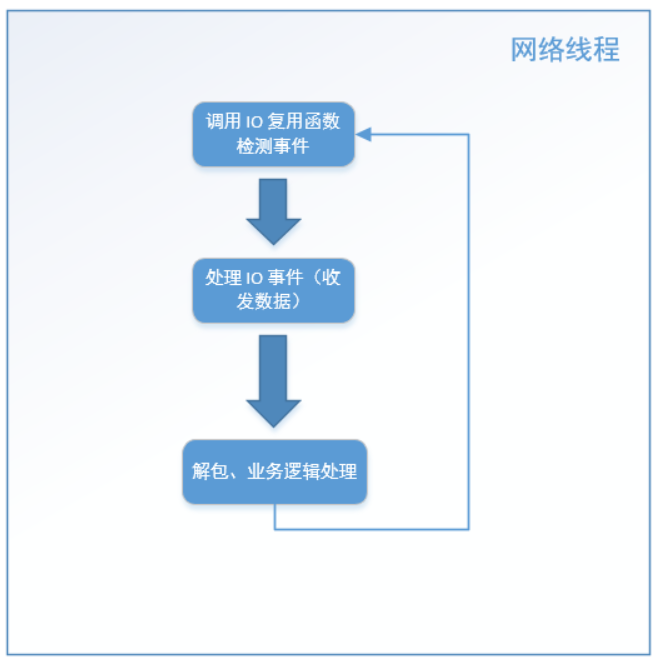
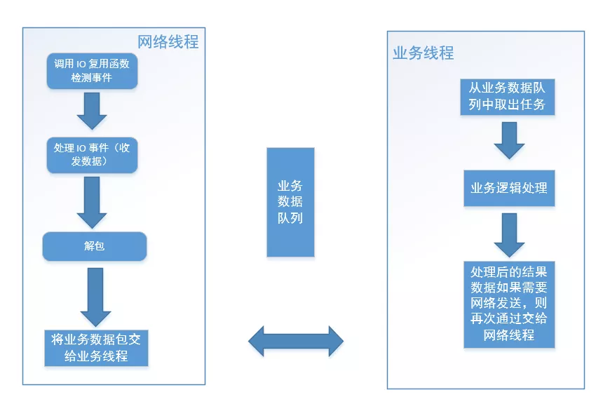

# 高性能服务器网络框架设计

## 一、网络框架设计细节

### 1.高性能网络框架设计概述

首先需要注意的是一般大型服务器，**其复杂程度在于其业务，而不是在于其代码工程的基本框架**。大型服务器一般有多个服务组成，可能会支持 CDN，或者支持所谓的"分布式"等，这篇文章不会介绍这些东西，因为不管结构多么复杂的服务器，都是由单个服务器组成的。**所以这篇文章的侧重点是讨论单个服务程序的结构，而且这里的结构指的也是单个服务器的网络通信层结构**，如果你能真正地理解了我所说的，那么在这个基础的结构上面开展任何业务都是可以的，也可以将这种结构扩展成复杂的多个服务器组，例如"分布式"服务。

文中的代码示例虽然是以 C++ 为例，但同样适合 Java，原理都是一样的，只不过 Java 可能在基本的操作系统网络通信 API 的基础上用虚拟机包裹了一层接口而已（Java 甚至可能基于一些常用的网络通信框架思想提供了一些现成的 API，例如 NIO）。有鉴于此，这篇文章不讨论那些大而空、泛泛而谈的技术术语，而是讲的是实实在在的能指导读者在实际工作中实践的编码方案或优化已有编码的方法。另外这里讨论的技术同时涉及 Windows 和 Linux 两个平台。

所谓**高性能就是服务器能流畅地处理各个客户端的连接并尽量低延迟地应答客户端的请求**；所谓**高并发，不仅指的是服务器可以同时支持多的客户端连接，而且这些客户端在连接期间内会不断与服务器有数据来往**。网络上经常有各种网络库号称单个服务能同时支持百万甚至千万的并发，然后我实际去看了下，结果发现只是能同时支持很多的连接而已。如果一个服务器能单纯地接受ｎ个连接（ｎ可能很大），但是不能有条不紊地处理与这些连接之间的数据来往也没有任何意义，这种服务器框架只是“玩具型”的，对实际生产和应用没有任何意义。

这篇文章将从两个方面来介绍，**一个是服务器中的基础的网络通信部件；另外一个是，如何利用这些基础通信部件整合成一个完整的高效的服务器框架**。注意：本文以下内容中的客户端是相对概念，指的是连接到当前讨论的服务程序的终端，所以这里的客户端既可能是我们传统意义上的客户端程序，也可能是连接该服务的其他服务器程序。

### 2.网络通信组件

需要解决的问题 既然是服务器程序肯定会涉及到网络通信部分，那么服务器程序的网络通信模块要解决哪些问题？目前，网络上有很多网络通信框架，如 libevent、boost asio、ACE，但都网络通信的常见的技术手段都大同小异，至少要解决以下问题：

- 如何检测有新客户端连接？
- 如何接受客户端连接？
- 如何检测客户端是否有数据发来？
- 如何收取客户端发来的数据？
- 如何检测连接异常？发现连接异常之后，如何处理？
- 如何给客户端发送数据？
- 如何在给客户端发完数据后关闭连接？

稍微有点网络基础的人，都能回答上面说的其中几个问题，比如接收客户端连接用 socket API 的 accept 函数，收取客户端数据用 recv 函数，给客户端发送数据用 send 函数，检测客户端是否有新连接和客户端是否有新数据可以用 I/O multiplexing 技术（I/O 复用）的 select、poll、epoll 等 socket API。确实是这样的，这些基础的 socket API 构成了服务器网络通信的地基，不管网络通信框架设计的如何巧妙，都是在这些基础的 socket API 的基础上构建的。但是如何巧妙地组织这些基础的 socket API，才是问题的关键。

我们说服务器很高效，支持高并发，实际上只是一个技术实现手段，不管怎样，**从软件开发的角度来讲无非就是一个程序而已，所以，只要程序能最大可能地满足“尽量减少等待或者不等待”这一原则就是高效的**，也就是说高效不是“忙的忙死，闲的闲死”，而是大家都可以闲着，但是如果有活要干，大家尽量一起干，而不是一部分忙着依次做事情 123456789，另外一部分闲在那里无所事事。说的可能有点抽象，下面我们来举一些例子具体来说明一下。例如：

- 默认情况下，recv 函数如果没有数据的时候，线程就会阻塞在那里；
- 默认情况下，send 函数，如果 tcp 窗口不是足够大，数据发不出去也会阻塞在那里；
- connect 函数默认连接另外一端的时候，也会阻塞在那里；
- 给对端发送一份数据，需要等待对端回答，如果对方一直不应答，当前线程就阻塞在这里。

以上都不是高效服务器的开发思维方式，因为上面的例子都不满足"尽量减少等待"的原则，为什么一定要等待呢？有没有一种方法，这些过程不需要等待，最好是不仅不需要等待，而且这些事情完成之后能通知我。这样在这些本来用于等待的 CPU 时间片内，我就可以做一些其他的事情。有，也就是我们下文要讨论的 I/O Multiplexing 技术（I/O 复用技术）。

### 3.几种网络复用机制比较

目前 windows 系统支持 select、WSAAsyncSelect、WSAEventSelect、完成端口（IOCP），linux 系统支持 select、poll、epoll。这里我们不具体介绍每个具体的函数的用法，我们来讨论一点深层次的东西，以上列举的 API 函数可以分为两个层次：

- 层次一：select 和 poll
- 层次二：WSAAsyncSelect、WSAEventSelect、完成端口（IOCP）、epoll

为什么这么分呢？先来介绍第一层次，select 和 poll 函数本质上还是在一定时间内主动去查询socket 句柄（可能是一个也可能是多个）上是否有事件，比如可读事件，可写事件或者出错事件，也就是说我们还是需要每隔一段时间内去主动去做这些检测，如果在这段时间内检测出一些事件来，我们这段时间就算没白花，但是倘若这段时间内没有事件呢？我们只能是做无用功了，说白了，还是在浪费时间，因为假如一个服务器有多个连接，在 CPU 时间片有限的情况下，我们花费了一定的时间检测了一部分 socket 连接，却发现它们什么事件都没有，而在这段时间内我们却有一些事情需要处理，那我们为什么要花时间去做这个检测呢？把这个时间用在做我们需要做的事情不好吗？

所以对于服务器程序来说，要**想高效，我们应该尽量避免花费时间主动去查询一些 socket 是否有事件，而是等这些 socket 有事件的时候告诉我们去处理**。这也就是层次二的各个函数做的事情，它们实际相当于变**主动查询是否有事件**为**当有事件时，系统会告诉我们，此时我们再去处理**，也就是“好钢用在刀刃”上了。只不过层次二的函数通知我们的方式是各不相同，比如 WSAAsyncSelect 是利用 windows 窗口消息队列的事件机制来通知我们设定的窗口过程函数，IOCP 是利用 GetQueuedCompletionStatus 返回正确的状态，epoll 是 epoll_wait 函数返回而已。

例如，connect 函数连接另外一端，如果用于连接 socket 是非阻塞的，那么 connect 虽然不能立刻连接完成，但是也是会立刻返回，无需等待，等连接完成之后，epoll 会产生 EPOLLOUT 事件，我们也能知道连接完成。甚至 socket 有数据可读时，WSAAsyncSelect 产生 FD_READ 事件，epoll 产生 EPOLLIN 事件，等等。**所以有了上面的讨论，我们就可以得到网络通信检测可读可写或者出错事件的正确姿势**。这是我这里提出的第二个原则：尽量减少做无用功的时间。这个在服务程序资源够用的情况下可能体现不出来什么优势，但是如果有大量的任务要处理，这里就成了性能的一个瓶颈。

### 4.检测网络事件的正确方式

根据上面的介绍，第一，为了避免无意义的等待时间，第二，不采用主动查询各个 socket 的事件，而是采用等待操作系统通知我们有事件的状态的策略。我们的 socket 都要设置成非阻塞的。在此基础上我们回到之前提到的七个问题：

**1) 如何检测有新客户端连接?**

如何接受客户端连接？ 默认 accept 函数会阻塞在那里，**如果 epoll 检测到侦听 socket 上有EPOLLIN 事件，或者 WSAAsyncSelect 检测到有 FD_ACCEPT 事件，那么就表明此时有新连接到来**，这个时候调用 accept 函数，就不会阻塞了。当然产生的新 socket 你应该也设置成非阻塞的。这样我们就能在新 socket 上收发数据了。 　　

**2) 如何检测客户端是否有数据发来?**

如何收取客户端发来的数据？ 同理，我们也应该在 socket 上有可读事件的时候才去收取数据，这样我们调用 recv 或者 read 函数时不用等待，至于一次性收多少数据好呢？我们可以根据自己的需求来决定，甚至你可以在一个循环里面反复 recv 或者 read，**对于非阻塞模式的 socket，如果没有数据了，recv 或者 read 也会立刻返回，错误码 EWOULDBLOCK 会表明当前已经没有数据了**。

**3) 如何检测连接异常?发现连接异常之后，如何处理?**

当我们收到异常事件后例如 EPOLLERR 或关闭事件 FD_CLOSE，我们就知道了有异常产生，我们对异常的处理一般就是关闭对应的 socket。另外，如果 read/recv 函数对一个 socket 进行操作时，如果返回 0，那说明对端已经关闭了 socket，此时这路连接也没必要存在了，我们也可以关闭对应的 socket。

**4) 如何给客户端发送数据？**

这也是一道常见的网络通信问题。给客户端发送数据，比收数据要稍微麻烦一点，也是需要讲点技巧的。**首先我们不能像注册检测数据可读事件一样一开始就注册检测数据可写事件**，因为如果检测可写的话，一般情况下只要对端正常收取数据，我们的 socket 就都是可写的，如果我们设置监听可写事件，会导致频繁地触发可写事件，但是我们此时并不一定有数据需要发送。

所以正确的做法是：**如果有数据要发送，则先尝试着去发送，如果发送不了或者只发送出去部分，剩下的我们需要将其缓存起来，然后再设置检测该 socket 上可写事件**，下次可写事件产生时，再继续发送，如果还是不能完全发出去，则继续设置侦听可写事件，如此往复，一直到所有数据都发出去为止。**一旦所有数据都发出去以后，我们要移除侦听可写事件**，避免无用的可写事件通知。

不知道你注意到没有，如果某次只发出去部分数据，剩下的数据应该暂且存起来，这个时候我们就需要一个缓冲区来存放这部分数据，这个缓冲区我们称为“发送缓冲区”。**发送缓冲区不仅存放本次没有发完的数据，还用来存放在发送过程中，上层又传来的新的需要发送的数据**。为了保证顺序，新的数据应该追加在当前剩下的数据的后面，发送的时候从发送缓冲区的头部开始发送。也就是说先来的先发送，后来的后发送。

**5) 如何在给客户端发完数据后关闭连接？**

这个问题比较难处理，因为这里的"发送完"不一定是真正的发送完，**我们调用 send 或者write 函数即使成功，也只是向操作系统的协议栈里面成功写入数据**，至于能否被发出去、何时被发出去很难判断，发出去对方是否收到就更难判断了。所以，我们目前只能简单地认为 send 或者 write 返回我们发出数据的字节数大小，我们就认为“发完数据”了。然后调用 close 等 socket API 关闭连接。当然，你也可以调用 shutdown 函数来实现所谓的“半关闭”。

### 5.被动关闭连接和主动关闭连接

在实际的应用中，**被动关闭连接是由于我们检测到了连接的异常事件**，比如 EPOLLERR，或者对端关闭连接，send 或 recv 返回 0，这个时候这路连接已经没有存在必要的意义了，我们被迫关闭连接。

而**主动关闭连接，是我们主动调用 close/closesocket 来关闭连接**。比如客户端给我们发送非法的数据，比如一些网络攻击的尝试性数据包。这个时候出于安全考虑，我们关闭 socket 连接。

### 6.接收缓冲区与发送缓冲区

上面已经介绍了发送缓冲区了，并说明了其存在的意义。接收缓冲区也是一样的道理，当收到数据以后，我们可以直接进行解包，但是这样并不好，有如下两个理由：

- 理由一：除非一些约定俗称的协议格式，比如 http 协议，大多数服务器的业务的协议都是不同的，**也就是说一个数据包里面的数据格式的解读应该是业务层的事情，和网络通信层应该解耦**，为了网络层更加通用，我们无法知道上层协议长成什么样子，因为不同的协议格式是不一样的，它们与具体的业务有关。
- 理由二：即使知道协议格式，我们在网络层进行解包处理对应的业务，**如果这个业务处理比较耗时**，比如需要进行复杂的运算，或者连接数据库进行账号密码验证，**那么我们的网络线程会需要大量时间来处理这些任务，这样其它网络事件可能没法及时处理**。鉴于以上二点，我们确实需要一个接收缓冲区，将收取到的数据放到该缓冲区里面去，并由专门的业务线程或者业务逻辑去从接收缓冲区中取出数据，并解包处理业务。

说了这么多，那发送缓冲区和接收缓冲区该设计成多大的容量？这是一个老生常谈的问题了，因为我们经常遇到这样的问题：预分配的内存太小不够用，太大的话可能会造成浪费。怎么办呢？**答案就是像 string、vector 一样，设计出一个可以动态增长的缓冲区，按需分配，不够还可以扩展**。

需要特别注意的是，这里说的**发送缓冲区和接收缓冲区是每一个 socket 连接都存在一个**。这是我们最常见的设计方案。

### 7.协议的设计

除了一些通用的协议，如 http、ftp 协议以外，大多数服务器协议都是根据业务制定的。协议设计好了，数据包的格式就根据协议来设置。我们知道 TCP/IP 协议是流式数据，所以流式数据就是像流水一样，数据包与数据包之间没有明显的界限。比如 A 端给 B 端连续发了三个数据包，每个数据包都是 50 个字节，B 端可能先收到 10 个字节，再收到 140 个字节；或者先收到 20 个字节，再收到 20 个字节，再收到 110 个字节；也可能一次性收到150 个字节。这 150 个字节可以以任何字节数目组合和次数被 B 收到。所以我们讨论协议的设计第一个问题就是如何界定包的界限，也就是接收端如何知道每个包数据的大小。

目前常用有如下三种方法：

1. 固定大小，这种方法就是假定每一个包的大小都是固定字节数目，例如上文中讨论的每个包大小都是 50 个字节，接收端每收气 50 个字节就当成一个包。
2. 指定包结束符，例如以一个\r\n(换行符和回车符)结束，这样对端只要收到这样的结束符，就可以认为收到了一个包，接下来的数据是下一个包的内容。
3. 指定包的大小，这种方法结合了上述两种方法，一般包头是固定大小，包头中有一个字段指定包体或者整个大的大小，对端收到数据以后先解析包头中的字段得到包体或者整个包的大小，然后根据这个大小去界定数据的界线。

协议要讨论的第二个问题是，设计协议的时候要尽量方便解包，也就是说协议的格式字段应该尽量清晰明了。

协议要讨论的第三个问题是，根据协议组装的单个数据包应该尽量小，注意这里指的是单个数据包，这样有如下好处：

- 对于一些移动端设备来说，其数据处理能力和带宽能力有限，小的数据不仅能加快处理速度，同时节省大量流量费用；
- 如果单个数据包足够小的话，对频繁进行网络通信的服务器端来说，可以大大减小其带宽压力，其所在的系统也能使用更少的内存。

试想：假如一个股票服务器，如果一只股票的数据包是 100 个字节或者 1000 个字节，那同样是 10000 只股票区别呢？

协议要讨论的第四个问题是，**对于数值类型，我们应该显式地指定数值的长度**，比如 long 型，在 32 位机器上是 32 位 4 个字节，但是如果在 64 位机器上，就变成了 64 位 8 个字节了。**这样同样是一个 long 型，发送方和接收方可能因为机器位数的不同会用不同的长度去解码**。所以建议最好，在涉及到跨平台使用的协议最好显式地指定协议中整型字段的长度，比如 int32、int64 等等。下面是一个协议的接口的例子，当然 java 程序员应该很熟悉这样的接口，**BinaryReadStream 是解码协议的类**：

```cpp{.line-numbers}
class BinaryReadStream
{
private:
    const char* const ptr;
    const size_t      len;
    const char*       cur;
    BinaryReadStream(const BinaryReadStream&);
    BinaryReadStream& operator=(const BinaryReadStream&);
public:
    BinaryReadStream(const char* ptr, size_t len);
    virtual const char* GetData() const;
    virtual size_t GetSize() const;
    bool IsEmpty() const;
    bool ReadString(string* str, size_t maxlen, size_t& outlen);
    bool ReadCString(char* str, size_t strlen, size_t& len);
    bool ReadCCString(const char** str, size_t maxlen, size_t& outlen);
    bool ReadInt32(int32_t& i);
    bool ReadInt64(int64_t& i);
    bool ReadShort(short& i);
    bool ReadChar(char& c);
    size_t ReadAll(char* szBuffer, size_t iLen) const;
    bool IsEnd() const;
    const char* GetCurrent() const{ return cur; }

public:
    bool ReadLength(size_t & len);
    bool ReadLengthWithoutOffset(size_t &headlen, size_t & outlen);
};
```

BinaryWriteStream 是编码协议的类：

```cpp{.line-numbers}
class BinaryWriteStream
{
public:
    BinaryWriteStream(string* data);
    virtual const char* GetData() const;
    virtual size_t GetSize() const;
    bool WriteCString(const char* str, size_t len);
    bool WriteString(const string& str);
    bool WriteDouble(double value, bool isNULL = false);
    bool WriteInt64(int64_t value, bool isNULL = false);
    bool WriteInt32(int32_t i, bool isNULL = false);
    bool WriteShort(short i, bool isNULL = false);
    bool WriteChar(char c, bool isNULL = false);
    size_t GetCurrentPos() const{ return m_data->length(); }
    void Flush();
    void Clear();
private:
    string* m_data;
};
```

可以按下面这种方式来编码和解码。 编码：

```cpp{.line-numbers}
std::string outbuf;
BinaryWriteStream writeStream(&outbuf);
writeStream.WriteInt32(msg_type_register);
writeStream.WriteInt32(m_seq);
writeStream.WriteString(retData);
writeStream.Flush();
```

解码的过程如下所示，解码的顺序等于编码的顺序：

```cpp{.line-numbers}
BinaryReadStream readStream(strMsg.c_str(), strMsg.length());
int32_t cmd;
if (!readStream.ReadInt32(cmd)) {
    return false;
}

if (!readStream.ReadInt32(m_seq)) {
    return false;
}

std::string data;
size_t datalength;
if (!readStream.ReadString(&data, 0, datalength)) {
    return false;
}
```

## 二、服务器程序结构的组织

### 1.概念介绍

上面的六个标题，我们讨论了很多具体的细节问题，现在是时候讨论将这些细节组织起来了。根据我的个人经验，目前**主流的思想是 one thread one loop + reactor 模式（也有proactor 模式）的策略**。通俗点说就是一个线程一个循环，即在一个线程的函数里面不断地循环依次做一些事情，这些事情包括**检测网络事件、读写数据、解包数据产生业务逻辑**。我们先从最简单地来说，设定一些线程在一个循环里面做网络通信相关的事情，伪码如下：

```c{.line-numbers}
while(退出标志)  {

    // I/O 复用技术检测 socket 可读事件、出错事件（如果有数据要发送，则也检测可写事件）  

    // 如果有可读事件，对于侦听 socket 则接收新连接；  
    // 如果有可读事件，对于普通 socket 则收取该 socket 上的数据，收取的数据存入对应的接收缓冲区，如果出错则关闭连接；  
    // 如果有数据要发送，有可写事件，则发送数据  
    // 如果有出错事件，关闭该连接   
}  
```

另外**设定一些线程去处理接收到的数据，并解包处理业务逻辑，这些线程可以认为是业务线程**了，伪码如下：

```cpp{.line-numbers}
// 从接收缓冲区中取出数据解包，分解成不同的业务来处理  
```

上面的结构是目前最通用的服务器逻辑结构，但是能不能再简化一下或者说再综合一下呢？我们试试，你想过这样的问题没有：假如现在的**机器有两个 CPU（准确的来说应该是两个核），我们的网络线程数量是 2 个，业务逻辑线程也是 2 个**，这样可能存在的情况就是：业务线程运行的时候，网络线程并没有运行，它们必须等待，如果是这样的话，干嘛要多建两个线程呢？除了程序结构上可能稍微清楚一点，对程序性能没有任何实质性提高，而且白白浪费 CPU 时间片在线程上下文切换上。所以，**我们可以将网络线程与业务逻辑线程合并**，合并后的伪码看起来是这样子的：

```cpp{.line-numbers}
while(退出标志)  {

    // I/O 复用技术检测 socket 可读事件、出错事件（如果有数据要发送，则也检测可写事件）  

    // 如果有可读事件，对于侦听 socket 则接收新连接；  
    // 如果有可读事件，对于普通 socket 则收取该 socket 上的数据，收取的数据存入对应的接收缓冲区，如果出错则关闭连接；  
    // 如果有数据要发送，有可写事件，则发送数据  
    // 如果有出错事件，关闭该连接   

    // 从接收缓冲区中取出数据解包，分解成不同的业务来处理  
}  
```

你没看错，其实就是简单的合并，**合并之后和不仅可以达到原来合并前的效果**，而且在没有网络 I/O 事件的时候，**可以及时处理我们想处理的一些业务逻辑**，并且减少了不必要的线程上下文切换时间。

我们再更进一步，甚至我们可以在这个 while 循环增加其它的一些任务的处理，比如程序的逻辑任务队列、定时器事件等等，伪码如下：

```cpp{.line-numbers}
while(退出标志)  
{  
    // 定时器事件处理  

    // I/O 复用技术检测 socket 可读事件、出错事件，（如果有数据要发送，则也检测可写事件）  

    // 如果有可读事件，对于侦听 socket 则接收新连接；  
    // 对于普通 socket 则收取该 socket 上的数据，收取的数据存入对应的接收缓冲区，如果出错则关闭连接；  
    // 如果有数据要发送，有可写事件，则发送数据  
    // 如果有出错事件，关闭该连接  

    // 从接收缓冲区中取出数据解包，分解成不同的业务来处理  

    // 程序自定义任务1  
    // 程序自定义任务2  
} 
```

注意：之所以将定时器事件的处理放在网络IO事件的检测之前，是因为避免定时器事件过期时间太长。假如放在后面的话，可能前面的处理耗费了一点时间，等到处理定时器事件时，时间间隔已经过去了不少时间。虽然这样处理，也没法保证定时器事件百分百精确，但是能尽量保证。当然 **linux 系统下提供 eventfd 这样的定时器对象，所有的定时器对象就能像处理socket 这样的 fd 一样统一成处理**。这也是网络库 libevent 的思想很像，libevent 将socket、定时器、信号封装成统一的对象进行处理。

### 2.代码讲解

说了这么多理论性的东西，我们来一款流行的开源网络库 muduo 来说明吧，原库是基于 boost 的，我改成了 C++11 的版本，并修改了一些 bug，在此感谢原作者陈硕。

上文介绍的核心线程函数的 while 循环位于 eventloop.cpp 中：

```cpp{.line-numbers}
void EventLoop::loop() {

    assert(!looping_);
    assertInLoopThread();
    looping_ = true;
    quit_ = false;  
    LOG_TRACE << "EventLoop " << this << " start looping";
    while (!quit_) {
        activeChannels_.clear();
        pollReturnTime_ = poller_->poll(kPollTimeMs, &activeChannels_);
        ++iteration_;
        if (Logger::logLevel() <= Logger::TRACE) {
            printActiveChannels();
        }
        // TODO sort channel by priority
        eventHandling_ = true;
        for (ChannelList::iterator it = activeChannels_.begin();
            it != activeChannels_.end(); ++it) {
            currentActiveChannel_ = *it;
            currentActiveChannel_->handleEvent(pollReturnTime_);
        }
        currentActiveChannel_ = NULL;
        eventHandling_ = false;
        doPendingFunctors();

        if (frameFunctor_) {
            frameFunctor_();
        }        
    }

    LOG_TRACE << "EventLoop " << this << " stop looping";
    looping_ = false;
}
```

**`poller_->poll`** 利用 epoll 分离网络事件，然后接着处理分离出来的网络事件，**每一个客户端 socket 对应一个连接，即一个 **`TcpConnection`** 和 **`Channel`** 通道对象**。**`currentActiveChannel_->handleEvent(pollReturnTime_)`** 根据是可读、可写、出错事件来调用对应的处理函数，这些函数都是回调函数，程序初始化阶段设置进来的：

```cpp{.line-numbers}
void Channel::handleEvent(Timestamp receiveTime) {

    std::shared_ptr<void> guard;  
    if (tied_) {  
        guard = tie_.lock();  
        if (guard) {  
            handleEventWithGuard(receiveTime);  
        }  
    } else {  
        handleEventWithGuard(receiveTime);  
    }  
}  

void Channel::handleEventWithGuard(Timestamp receiveTime) {  
    eventHandling_ = true;  
    LOG_TRACE << reventsToString();  
    if ((revents_ & POLLHUP) && !(revents_ & POLLIN)) {  
        if (logHup_) {  
            LOG_WARN << "Channel::handle_event() POLLHUP";  
        }  
        if (closeCallback_) closeCallback_();  
    }
    if (revents_ & POLLNVAL) {  
        LOG_WARN << "Channel::handle_event() POLLNVAL";  
    }  

    if (revents_ & (POLLERR | POLLNVAL)) {
        // 如果 socket 上出现错误，就对错误进行处理  
        if (errorCallback_) errorCallback_();  
    }  
    if (revents_ & (POLLIN | POLLPRI | POLLRDHUP))  
    {  
        // 当是侦听 socket 时，readCallback_ 指向 Acceptor::handleRead  
        // 当是客户端 socket 时，调用 TcpConnection::handleRead   
        if (readCallback_) readCallback_(receiveTime);  
    }  
    if (revents_ & POLLOUT)  
    {  
        //如果是连接状态服的 socket，则 writeCallback_ 指向 Connector::handleWrite()  
        if (writeCallback_) writeCallback_();  
    }  
    eventHandling_ = false; 
} 
```

当然，这里利用了 Channel 对象的“多态性”，如果是普通 socket，可读事件就会调用预先设置的回调函数；但是如果是侦听 socket，则调用 Aceptor 对象的 handleRead() 来接收新连接。

主循环里面的业务逻辑处理对应如下的代码块：

```cpp{.line-numbers}
doPendingFunctors();  
if (frameFunctor_) {  
   frameFunctor_();  
}       
```

`doPendingFunctors` 函数的具体代码如下所示：

```cpp{.line-numbers}
void EventLoop::doPendingFunctors() {  
    std::vector<Functor> functors;  
    callingPendingFunctors_ = true; 
    {  
        std::unique_lock<std::mutex> lock(mutex_);  
        functors.swap(pendingFunctors_);  
	}  
  
    for (size_t i = 0; i < functors.size(); ++i) {  
        functors[i]();  
    }  
    callingPendingFunctors_ = false;
} 
```

**这里增加业务逻辑是增加执行任务的函数指针的**，增加的任务保存在成员变量 **`pendingFunctors_`** 中，这个变量是一个函数指针数组（vector 对象），执行的时候，调用每个函数就可以了。上面的代码先利用一个栈变量将成员变量 **`pendingFunctors_`** 里面的函数指针换过来，接下来对这个栈变量进行操作就可以了，这样减少了锁的粒度。**因为成员变量 `pendingFunctors_` 在增加任务的时候，也会被用到，设计到多个线程操作，所以要加锁**，增加任务的地方是：

```cpp{.line-numbers}
void EventLoop::queueInLoop(const Functor& cb) {  
    {  
        std::unique_lock<std::mutex> lock(mutex_);  
        pendingFunctors_.push_back(cb);  
    }  

    if (!isInLoopThread() || callingPendingFunctors_) {  
        wakeup();  
    }  
}  
```

而 frameFunctor_ 就更简单了，就是通过设置一个函数指针就可以了。当然这里有个技巧性的东西，**即增加任务的时候，为了能够立即执行，使用唤醒机制**，通过往一个 fd 里面写入简单的几个字节，来唤醒 epoll，使其立刻返回，因为此时没有其它的 socket 有事件，这样接下来就执行刚才添加的任务了。

我们看一下数据收取的逻辑：

```cpp{.line-numbers}
void TcpConnection::handleRead(Timestamp receiveTime)  
{  
    loop_->assertInLoopThread();  
    int savedErrno = 0;  
    // 从套接字 socket 中读取数据
    ssize_t n = inputBuffer_.readFd(channel_->fd(), &savedErrno);  
    if (n > 0) {    
        // 将读取的数据交由用户注册的回调函数进行处理（解包、业务逻辑）
        messageCallback_(shared_from_this(), &inputBuffer_, receiveTime);  
    } else if (n == 0) {  
        // n = 0 说明对端关闭了连接
        handleClose();  
    } else {  
        errno = savedErrno;  
        LOG_SYSERR << "TcpConnection::handleRead";  
        handleError();  
    }  
}  
```

将收到的数据放到接收缓冲区里面，将来我们来解包：

```cpp{.line-numbers}
void ClientSession::OnRead(const std::shared_ptr<TcpConnection>& conn, Buffer* pBuffer, Timestamp receivTime) {  
    while (true) {  
        // 不够一个包头大小  
        if (pBuffer->readableBytes() < (size_t)sizeof(msg)) {  
            LOG_INFO << "buffer is not enough for a package header, pBuffer->readableBytes()=" << pBuffer->readableBytes() << ", sizeof(msg)=" << sizeof(msg);  
            return;  
        } 
     
        msg header;  
        memcpy(&header, pBuffer->peek(), sizeof(msg));  
        // 不够一个整包大小 
        if (pBuffer->readableBytes() < (size_t)header.packagesize + sizeof(msg))  
            return;  

        pBuffer->retrieve(sizeof(msg));  
        std::string inbuf;  
        inbuf.append(pBuffer->peek(), header.packagesize);  
        pBuffer->retrieve(header.packagesize);  
        if (!Process(conn, inbuf.c_str(), inbuf.length())) {  
            LOG_WARN << "Process error, close TcpConnection";  
            conn->forceClose();  
        }  
	}// end while-loop  
} 
```

先判断接收缓冲区里面的数据是否够一个包头大小，如果够再判断够不够包头指定的包体大小，如果还是够的话，接着在 Process 函数里面处理该包。

```cpp{.line-numbers}
void TcpConnection::sendInLoop(const void* data, size_t len) {

    loop_->assertInLoopThread();  
    ssize_t nwrote = 0;  
    size_t remaining = len;  
    bool faultError = false;  
    if (state_ == kDisconnected) {  
        LOG_WARN << "disconnected, give up writing";  
        return;  
    }  
    // if no thing in output queue, try writing directly  
    if (!channel_->isWriting() && outputBuffer_.readableBytes() == 0) {  
        nwrote = sockets::write(channel_->fd(), data, len);  
        if (nwrote >= 0) {  
            remaining = len - nwrote;  
            if (remaining == 0 && writeCompleteCallback_) {  
                loop_->queueInLoop(std::bind(writeCompleteCallback_, shared_from_this()));  
            }  
        } else // nwrote < 0  
        {  
            nwrote = 0;  
            if (errno != EWOULDBLOCK) {  
                LOG_SYSERR << "TcpConnection::sendInLoop";  
                if (errno == EPIPE || errno == ECONNRESET) {  
                    faultError = true;  
                }  
            }  
        }  
    }  
    assert(remaining <= len);  
    if (!faultError && remaining > 0) {  
        size_t oldLen = outputBuffer_.readableBytes();  
        if (oldLen + remaining >= highWaterMark_                          
            && oldLen < highWaterMark_  
            && highWaterMarkCallback_) {  
            loop_->queueInLoop(std::bind(highWaterMarkCallback_, shared_from_this(), oldLen + remaining));  
        }  
        outputBuffer_.append(static_cast<const char*>(data) + nwrote, remaining);  
        if (!channel_->isWriting()) {  
            channel_->enableWriting();  
        }  
    } 
} 
```

如果 **`!channel_->isWriting()`** 并且 **`outputBuffer_.readableBytes() == 0`** 的话，那么就尝试直接发送数据到 socket 套接字中，如果一次没有发送完毕的话，就将剩余的数据保存到 **`outputBuffer`** 中，并且监听可写事件，待 socket 套接字可写时，就再次尝试写入剩余的数据。`channel_->enableWriting()` 调用开始监听可写事件，可写事件处理如下：

```cpp{.line-numbers}
void TcpConnection::handleWrite() {

    loop_->assertInLoopThread();  
    if (channel_->isWriting()) {  
        ssize_t n = sockets::write(channel_->fd(), outputBuffer_.peek(), outputBuffer_.readableBytes());  
        if (n > 0) {  
            outputBuffer_.retrieve(n);  
            // 如果数据发送完成，那么移除可写事件
            if (outputBuffer_.readableBytes() == 0) {  
                channel_->disableWriting();  
                if (writeCompleteCallback_) {  
                    loop_->queueInLoop(std::bind(writeCompleteCallback_, shared_from_this()));  
                }  
                if (state_ == kDisconnecting) {  
                    shutdownInLoop();  
                }  
            }  
        } else {  
            LOG_SYSERR << "TcpConnection::handleWrite";  
            // if (state_ == kDisconnecting)  
            // {  
            //   shutdownInLoop();  
            // }  
        }  
    } else {  
        LOG_TRACE << "Connection fd = " << channel_->fd() << " is down, no more writing";  
    }  
}  
```

如果发送完数据以后调用 **`channel_->disableWriting()`** 移除监听可写事件。

很多读者可能一直想问，文中不是说**解包数据并处理逻辑是业务代码而非网络通信的代码**，你这里貌似都混在一起了，其实没有，这里实际的**业务代码处理都是框架曾提供的回调函数里面处理的**，具体怎么处理，由框架使用者——业务层自己定义。

## 三、业务数据一定要单独开线程吗？

在 《one thread one loop 思想》一文我们介绍了一个 loop 的主要结构一般如下所示：

```cpp{.line-numbers}
while (!m_bQuitFlag) {

	epoll_or_select_func();

	handle_io_events();

	handle_other_things();
}
```

对于一些业务逻辑处理比较简单、不会太耗时的应用来说，**`handle_io_events()` 方法除了收发数据也可以直接用来直接做业务的处理**，即其结构如下：

```cpp{.line-numbers}
void handle_io_events() {

	// 收发数据
	recv_or_send_data();
	
	// 解包并处理数据
	decode_packages_and_process();
}
```

其中 **`recv_or_send_data()`** 方法中调用 **`send/recv`** API 进行实际的网络数据收发。以收数据为例，收完数据存入接收缓冲区后，接下来使用 **`decode_packages_and_process()`**  函数进行解包处理，然后进行业务处理。例如一个登陆数据包，其业务就是验证登陆的账户密码是否正确、记录其登陆行为等等。从程序函数调用堆栈来看，**这些业务处理逻辑其实是直接在网络收发数据线程中处理的**。我的意思是：网络线程调用 handle_io_events() 方法，handle_io_events() 方法调用 decode_packages_and_process() 方法，decode_packages_and_process() 方法做具体的业务逻辑处理。

需要注意的是，为了让网络层与业务层脱耦，**网络层中通常会提供一些回调函数的接口，这些回调函数我们将其指向具体的业务处理函数**。以 libevent 网络库的用法为例：

```c{.line-numbers}
int main(int argc, char **argv) {

	struct event_base *base;
	struct evconnlistener *listener;
	struct event *signal_event;
	struct sockaddr_in sin;

	base = event_base_new();

	memset(&sin, 0, sizeof(sin));
	sin.sin_family = AF_INET;
	sin.sin_port = htons(PORT);

	// listener_cb 是我们自定义回调函数
	listener = evconnlistener_new_bind(base, listener_cb, (void *)base,
	    LEV_OPT_REUSEABLE|LEV_OPT_CLOSE_ON_FREE, -1,
	    (struct sockaddr*)&sin,
	    sizeof(sin));

	if (!listener) {
		fprintf(stderr, "Could not create a listener!\n");
		return 1;
	}

	// signal_cb 是我们自定义回调函数
	signal_event = evsignal_new(base, SIGINT, signal_cb, (void *)base);

	if (!signal_event || event_add(signal_event, NULL)<0) {
		fprintf(stderr, "Could not create/add a signal event!\n");
		return 1;
	}

	// 启动 loop
	event_base_dispatch(base);
	evconnlistener_free(listener);
	event_free(signal_event);
	event_base_free(base);

	printf("done\n");
	return 0;
}
```

上述代码根据 libevent 自带的 helloworld 示例修改而来，其中 listener_cb 和 signal_cb 是自定义的回调函数，**有相应的事件触发后，libevent 的事件循环会调用我们设置的回调**，在这些回调函数中，我们可以编写自己的业务逻辑代码。这种基本的服务器结构，我们可以绘制成如下流程图：

<div align="center">
    
</div>

这是这个结构的最基本逻辑，在这基础上可以延伸出很多变体。不知道读者有没有发现，上述流程图中第三步解包和业务逻辑处理这一步中（位于 **`handle_io_events()`** 中的 **`decode_packages_and_process()`** 方法中），如果业务逻辑处理过程比较耗时（例如，从数据库取大量数据、写文件），那么会导致 网络线程在这个步骤停留时间很长，导致很久以后才能执行下一次循环，影响网络数据的检测和收发，最终导致整个程序的效率低下。

因此，对于这种情形，我们需要将业务处理逻辑单独拆出来交给另外的业务工作线程处理，业务工作线程可以是一个线程池，这个过程业务数据从网络线程组流向业务线程组。

这样的程序结构图如下图所示：

<div align="center">
    
</div>

上图中，**对于网络线程将业务数据包交给业务线程，可以使用一个共享的业务数据队列来实现**，此时网络线程是生产者，业务线程从业务数据队列中取出任务去处理，业务线程是消费者。业务线程处理完成后如果需要将结果数据发出去，则再将数据交给网络线程。这里处理后的数据从业务线程再次流向网络线程，那么如何将数据从业务线程交给网络线程呢？这里以发数据为例，一般有三种方法：

**1) 方法一**

**直接调用相应的的发数据的方法**。如果你的网络线程本身也会调用这些发送数据的方法，那么此时就可能会出现网络线程和业务线程同时对发送方法进行调用，相当于多个线程同时调用 socket send 函数，这样可能会导致同一个连接上的数据顺序有问题。此时的做法是，**利用锁机制，同一时刻只有一个线程可以调用 socket send 方法**。这里给出一段伪代码，假设 TcpConnection 对象表示某路连接，无论网络线程还是业务线程处理完数据后需要发送数据，则使用：

```cpp{.line-numbers}
void TcpConnection::sendData(const std::string& data) {

	// 加上锁
	std::lock_guard<std::mutex> scoped_lock(m_mutexForConnection);
	// 在这里调用 send
}
```

**2) 方法二**

前面章节介绍了存在定时器结构的情况，网络线程结构变成如下流程：

```cpp{.line-numbers}
while (!m_bQuitFlag) {

	check_and_handle_timers();
	
	epoll_or_select_func();

	handle_io_events();
}
```

**业务线程可以将需要发送的数据放入另外一个共享区域中（例如相应的 TcpConnection 对象的一个成员变量中），定时器定时从这个共享区域取出来，再发送出去**。这种方案的优点是网络线程做了它该做的事情，缺点是需要添加定时器，让程序逻辑变得复杂，且定时器是每隔一段时间才会触发，发送的数据可能会有一定的延迟。

**3) 方法三**

利用线程执行流中的 handle_other_things() 方法，再来看下前面章节中介绍的基本结构：

```cpp{.line-numbers}
while (!m_bQuitFlag) {

	epoll_or_select_func();

	handle_io_events();

	handle_other_things();
}
```

我们在《one thread one loop 思想》章节介绍了 handle_other_things() 函数可以做一些"其他事情"，这个函数可以在需要执行时通过前面章节介绍的唤醒机制立即被唤醒执行。**业务线程将数据放入某个共享区域中（这一步和方法二介绍的一样），然后添加 "other_things"（可以为一个回调任务函数，真正执行发送数据的任务，并且把这个回调函数添加到任务队列中） ，在 handle_other_things() 中执行回调函数，发送数据**。

如果读者能清晰明白地看到这里，说明您大致明白了一个不错的服务器框架是怎么回事了。上面介绍的服务器结构是目前主流的基于 Reactor 模式的服务程序的通用结构，例如 libevent、libuv。

如果读者有兴趣，咱们可以再进一步深入讨论一下。

实际应用中，很多程序的业务逻辑处理其实是不耗时的，也就是说这些业务逻辑处理速度很快。由于 CPU 核数有限，当线程数量超过 CPU 数量时，各个线程（网络线程和业务线程）也不是真正地并行执行，**那么即使开了一组业务线程也不一定能真正地并发执行，而业务逻辑处理并不耗时，不会影响网络线程的执行效率，那么我们不如就在网络线程里面直接处理**。

上文介绍了在 **`handle_io_events()`** 方法中直接处理，如果处理的业务逻辑会产生新的其他任务，那么我们可以投递 "other_things"，最终交给 **`handle_other_things()`** 方法来处理。此时的服务器程序结构如下：

特别说明一下：这种方式仅限于 **`handle_io_events()`** 或 **`handle_other_things()`** 里面不会有耗时的逻辑，才可以替代专门开业务线程，如果有耗时操作还得老老实实单独开业务线程。虽然线程数量超过 CPU 数量时，各个线程不会得到真正的并行，但那是操作系统线程调度的事情了，应用层开发不必关心这点。

总结高性能服务器的结构：服务器中一般分为网络线程和业务线程两类，网络线程专门用来监听 I/O 复用函数上的读写事件，然后调用 **`recv/send`** **读取数据到缓冲区中或者将缓冲区中的数据发送出去**。先介绍读取数据，数据读取完毕后，保存到业务数据队列中，由业务线程进行解包和业务逻辑处理。如果业务线程处理完毕，有响应数据要发送回去，应该把数据放入某个共享区域中，然后添加 "**`other_things`**"（可以为一个回调任务函数，真正执行发送数据的任务，并且把这个回调函数添加到任务队列中），接着唤醒可能阻塞的网络线程，被唤醒的网络线程在 **`handle_other_things()`** 中从任务队列中取出并执行回调函数，发送数据。

## 四、一个服务器程序的架构介绍

该程序总共有 17 个线程，其中分为 9 个数据库工作线程 D 和一个日志线程 L，6 个普通工作线程 W，一个主线程 M。（以下会用这些字母来代指这些线程）

### 1.数据库工作线程的用途

9 个数据库工作线程在线程启动之初，与 mysql 建立连接，也就是说每个线程都与 mysql 保持一路连接，共 9 个数据库连接。

每个数据库工作线程同时存在两个任务队列，**第一个队列 A 存放需要执行数据库增删查改操作的任务 sqlTask**；**第二个队列 B 存放 sqlTask 执行完成后的结果**。sqlTask 执行完成后立即放入结果队列中，因而结果队列中任务也是一个个的需要执行的任务。大致伪代码如下：

```cpp{.line-numbers}
void db_thread_func()  {  
    while (!m_bExit)  
    {  
        if (NULL != (pTask = m_sqlTask.Pop()))  
        {  
            // 从 m_sqlTask 中取出的任务先执行完成后，pTask 将携带结果数据  
            res = pTask->Execute();              
            // 得到结果后，立刻将该任务放入结果任务队列  
            m_resultTask.Push(res);  
            continue;  
        }  

        sleep(1000);  
    }// end while-loop 
 }  
```

现在的问题来了：

- 任务队列 A 中的任务从何而来，目前只有消费者，没有生产者，那么生产者是谁？
- 任务队列 B 中的任务将去何方，目前只有生产者没有消费者。

这两个问题先放一会儿，等到后面我再来回答。

### 2.工作线程和主线程

在介绍主线程和工作线程具体做什么时，我们介绍下服务器编程中常常抽象出来的几个概念  (这里以 TCP 连接为例):

1. **TcpServer 即 Tcp 服务，服务器需要绑定 ip 地址和端口号，并在该端口号上侦听客户端的连接（往往由一个成员变量 TcpListener 来管理侦听细节）**。所以一个 TcpServer 要做的就是这些工作。除此之外，每当有新连接到来时，TcpServer 需要接收新连接，当多个新连接存在时，TcpServer 需要有条不紊地管理这些连接：连接的建立、断开等，即产生和管理下文中说的 TcpConnection 对象。
2. **一个连接对应一个 TcpConnection 对象**，TcpConnection 对象管理着这个连接的一些信息：如连接状态、本端和对端的 ip 地址和端口号等。
3. **数据通道对象 Channel，Channel 记录了 socket 的句柄**，因而是一个连接上执行数据收发的真正执行者，Channel 对象一般作为 TcpConnection 的成员变量。
4. **TcpSession 对象，是将 Channel 收取的数据进行解包**，或者对准备好的数据进行装包，并传给 Channel 发送。

归纳起来：一个 TcpServer 依靠 TcpListener 对新连接的侦听和处理，依靠 TcpConnection 对象对连接上的数据进行管理，**TcpConnection 实际依靠 Channel 对数据进行收发，依靠 TcpSession 对数据进行装包和解包**。也就是说一个 TcpServer 存在一个 TcpListener，对应多个 TcpConnection，有几个TcpConnection 就有几个 TcpSession，同时也就有几个 Channel。

以上说的 TcpServer、TcpListener、TcpConnection、Channel 和 TcpSession 是服务器框架的网络层。一个好的网络框架，应该做到与业务代码脱耦。即上层代码只需要拿到数据，执行业务逻辑，而不用关注数据的收发和网络数据包的封包和解包以及网络状态的变化（比如网络断开与重连）。

### 3.数据发送

当业务逻辑将数据交给 **`TcpSession`**，**`TcpSession`** 将数据装好包后（即编码操作，装包过程后可以有一些加密或压缩操作），交给 **`TcpConnection::SendData()`**，而 **`TcpConnection::SendData()`** 实际是调用 **`Channel::SendData()`**，因为 **`Channel`** 含有 socket 句柄，所以 **`Channel::SendData()`** 真正调用 send()/sendto()/write() 方法将数据发出去。

对于数据的接收，稍微有一点不同：

通过 select()/poll()/epoll() 等 I/O multiplex 技术，确定好了哪些 TcpConnection 上有数据到来后，激活该 TcpConnection 的 Channel 对象去调用 recv()/recvfrom()/read() 来收取数据。**数据收到以后，将数据交由 TcpSession 来解包处理，最终交给业务层**。注意数据收取、解包乃至交给业务层是一定要分开的。我的意思是：**最好不要解包并交给业务层和数据收取的逻辑放在一起**。因为数据收取是 I/O 操作，而解包和交给业务层是逻辑计算操作。I/O 操作一般比逻辑计算要慢。到底如何安排要根据服务器业务来取舍，也就是说你要想好你的服务器程序的性能瓶颈在网络 I/O 还是逻辑计算。

在之前讲解**主线程与工作线程的分工**中介绍了，工作线程的流程：

```cpp{.line-numbers}
while (!m_bQuit) {  
    epoll_or_select_func();  

    handle_io_events();  

    handle_other_things();  
}
```

其中 **`epoll_or_select_func()`** 即是上文所说的通过 **`select()/poll()/epoll()`** 等 I/O multiplex 技术，确定好了哪些 TcpConnection 上有数据到来。我的服务器代码中一般只会监测 socket 可读事件，而不会监测 socket 可写事件。至于如何发数据。所以对于可读事件，以 epoll 为例，这里需要设置的标识位是：

- **`EPOLLIN`**：普通可读事件（当连接正常时，产生这个事件，**`recv()/read()`** 函数返回收到的字节数；当连接关闭，这两个函数返回 0，也就是说我们设置这个标识已经可以监测到新来数据和对端关闭事件）
- **`EPOLLRDHUP`**：对端关闭事件（linux man 手册上说这个事件可以监测对端关闭，但我实际调试时发送即使对端关闭也没触发这个事件，仍然是 EPOLLIN，只不过此时调用 recv()/read() 函数，返回值会为 0，所以实际项目中是否可以通过设置这个标识来监测对端关闭，仍然待考证）
- **`EPOLLPRI`**：带外数据

muduo 里面将 epoll_wait 的超时事件设置为 1 毫秒，我的另一个项目将 epoll_wait 超时时间设置为 10 毫秒。这两个数值供大家参考。

这个项目中，工作线程和主线程都是上文代码中的逻辑，**主线程监听侦听 socket 上的可读事件，也就是监测是否有新连接来了**。主线程和每个工作线程上都存在一个 epollfd。如果新连接来了，则在主线程的 handle_io_events() 中接受新连接。产生的新连接的 socket 句柄挂接到哪个线程的 epollfd 上呢？这里采取的做法是 round-robin 算法，即存在一个对象 **`CWorkerThreadManager`** 记录了各个工作线程上工作状态。伪码大致如下：

```cpp{.line-numbers}
void attach_new_fd(int newsocketfd) {
    workerthread = get_next_worker_thread(next);  
    workerthread.attach_to_epollfd(newsocketfd);  
    ++next;  
    if (next > max_worker_thread_num)  
        next = 0;  
}  
```

即先从第一个工作线程的 **`epollfd`** 开始挂接新来 **`socket`**，接着累加索引，这样下次就是第二个工作线程了。如果所以超出工作线程数目，则从第一个工作重新开始。这里解决了新连接 **`socket`** “负载均衡”的问题。在实际代码中还有个需要注意的细节就是：**`epoll_wait`** 的函数中的 **`struct epoll_event`** 数量开始到底要设置多少个才合理？存在的顾虑是，多了浪费，少了不够用，我在曾经一个项目中直接用的是 4096。

我在陈硕的 muduo 网络库中发现作者采用了一个比较好的思路，即动态扩张数量：开始是 n 个，当发现有事件的 fd 数量已经到达 n 个后，将 struct epoll_event 数量调整成 2n 个，下次如果还不够，则变成 4n 个，以此类推，作者巧妙地利用 stl::vector 在内存中的连续性来实现了这种思路：

```cpp{.line-numbers}
// 初始化代码  
std::vector<struct epoll_event> events_(16);  

// 线程循环里面的代码  
while (m_bExit) {
    int numEvents = ::epoll_wait(epollfd_, &*events_.begin(), static_cast<int>(events_.size()), 1);  
    if (numEvents > 0) {  
        if (static_cast<size_t>(numEvents) == events_.size()) {  
            events_.resize(events_.size() * 2);  
        }  
    }  
}
```

读到这里，你可能觉得工作线程所做的工作也不过就是调用 **`handle_io_events()`** 来接收网络数据，其实不然，工作线程也可以做程序业务逻辑上的一些工作。也就是在 **`handle_other_things()`** 里面。那如何将这些工作加到 **`handle_other_things()`** 中去做呢？**写一个队列，任务先放入队列，再让 **`handle_other_things()`** 从队列中取出来做**。我在该项目中也借鉴了 muduo 库的做法。即 **`handle_other_things()`** 中调用一系列函数指针，伪码如下：

```cpp{.line-numbers}
void do_other_things() {  
    somefunc();  
}

// m_functors 是一个 stl::vector，其中每一个元素为一个函数指针  
void somefunc() {

    for (size_t i = 0; i < m_functors.size(); ++i) {  
        m_functors[i]();  
    }  

    m_functors.clear();  
}
```

当任务产生时，只要我们将执行任务的函数 **`push_back`** 到 **`m_functors`** 这个 **`stl::vector`** 对象中即可。但是问题来了，如果是其他线程产生的任务，两个线程同时操作 **`m_functors`**，必然要加锁，这也会影响效率。muduo 是这样做的：

```cpp{.line-numbers}
void add_task(const Functor& cb) {  
    std::unique_lock<std::mutex> lock(mutex_);  
    m_functors.push_back(cb);     
}  

void do_task() {  
    std::vector<Functor> functors;  
    {  
        std::unique_lock<std::mutex> lock(mutex_);  
        functors.swap(m_functors);  
    }  

    for (size_t i = 0; i < functors.size(); ++i) {  
        functors[i]();  
    }  
}
```

因为每个工作线程都存在一个 **`m_functors`**，现在问题来了，如何将产生的任务均衡地分配给每个工作线程。这个做法类似上文中如何将新连接的 socket 句柄挂载到工作线程的 epollfd 上，也是 **`round-robin`** 算法。上文已经描述，此处不再赘述。

还有种情况，就是希望任务产生时，工作线程能够立马执行这些任务，而不是等 epoll_wait 超时返回之后。这个时候的做法，就是使用一些技巧唤醒 **`epoll_wait`**，Linux 系统可以使用 **`socketpair`** 或 **`timerevent`**、**`eventfd`** 等技巧。

上文中留下三个问题：

**1) 问题 1**

**数据库线程任务队列 A 中的任务从何而来，目前只有消费者，没有生产者，那么生产者是谁?**

问题 1 的答案是：业务层产生任务可能会交给数据库任务队列 A，这里的业务层代码可能就是工作线程中 **`do_other_things()`** 方法从任务队列中取出并执行的回调函数。至于交给这个 9 个数据库线程的哪一个的任务队列，同样采用了 round-robin 算法。所以就存在一个对象 **`CDbThreadManager`** 来管理这九个数据库线程。下面的伪码是向数据库工作线程中加入任务：

```cpp{.line-numbers}
bool CDbThreadManager::AddTask(IMysqlTask* poTask ) {  
    if (m_index >= m_dwThreadsCount) {  
        m_index = 0;  
    }  

    return m_aoMysqlThreads[m_index++].AddTask(poTask);  
}
```

**2) 问题 2**

**数据库线程任务队列 B 中的任务将去何方，目前只有生产者没有消费者**。

问题 2 中的消费者也可能就是 **`do_other_things()`** 函数执行体中的调用。

**3) 问题 3**

**业务层的数据如何发送出去?**

业务层的数据产生后，经过 **`TcpSession`** 装包后，需要发送的话，产生任务丢给工作线程的 **`do_other_things()`**，然后在相关的 Channel 里面发送，因为没有监测该 socket 上的可写事件，所以该数据可能调用 **`send()`** 或者 **`write()`** 时会阻塞，没关系，**`sleep()`** 一会儿，继续发送，一直尝试，到数据发出去。伪码如下：

```cpp{.line-numbers}
bool Channel::Send() {

    int offset = 0;  
    while (true) {  
        int n = ::send(socketfd, buf + offset, length - offset);  
        if (n == -1) {  
            if (errno == EWOULDBLOCK) {  
                ::sleep(100);  
                continue;  
            }  
        }  
        // 对方关闭了 socket，这端建议也关闭  
        else if (n == 0) {  
            close(socketfd);  
            return false;  
        }  

        offset += n;  
        if (offset >= length)  
            break;  

    }  
    return true;      
}
```

## 五、心跳包机制设计

### 1.需要心跳包的情形

存在下面两种情形：

**1) 情形一**

一个客户端连接服务器以后，如果长期没有和服务器有数据来往，可能会被防火墙程序关闭连接，有时候我们并不想要被关闭连接。例如，对于一个即时通讯软件，如果服务器没有消息时，我们确实不会和服务器有任何数据交换，但是如果连接被关闭了，有新消息来时，我们再也没法收到了，这就违背了 "即时通讯" 的设计要求。

**情形一中的应用场景要求必须保持客户端与服务器之间的连接正常，就是我们通常所说的"保活"**。如上文所述，当服务器与客户端一定时间内没有有效业务数据来往时，我们只需要给对端发送心跳包即可实现保活。

**2) 情形二**

通常情况下，服务器与某个客户端一般不是位于同一个网络，其之间可能经过数个路由器和交换机，如果其中某个必经路由器或者交换器出现了故障，并且一段时间内没有恢复，导致这之间的链路不再畅通，而此时服务器与客户端之间也没有数据进行交换。**由于 TCP 连接是状态机，对于这种情况，无论是客户端或者服务器都无法感知与对方的连接是否正常，这类连接我们一般称之为"死链"**。

对于情形二中的死链，**只要我们此时任意一端给对端发送一个数据包即可检测链路是否正常，这类数据包我们也称之为"心跳包"，这种操作我们称之为"心跳检测"**。顾名思义，如果一个人没有心跳了，可能已经死亡了；一个连接长时间没有正常数据来往，也没有心跳包来往，就可以认为这个连接已经不存在，为了节约服务器连接资源，我们可以通过关闭 **`socket`**，回收连接资源。

根据上面的分析，让我再强调一下，心跳检测一般有两个作用：

- 保活
- 检测死链

### 2.TCP keepalive 选项

操作系统的 TCP/IP 协议栈其实提供了这个的功能，即 keepalive 选项。在 Linux 操作系统中，我们可以通过代码启用一个 socket 的心跳检测（**即每隔一定时间间隔发送一个心跳检测包给对端**），代码如下：

```c
// on 是 1 表示打开 keepalive 选项，为 0 表示关闭，0 是默认值
int on = 1;
setsockopt(fd, SOL_SOCKET, SO_KEEPALIVE, &on, sizeof(on));
```

但是，即使开启了这个选项，这个选项默认发送心跳检测数据包的时间间隔是 7200 秒（2 小时），这时间间隔实在是太长了，不具有实用性。

我们可以通过继续设置 keepalive 相关的三个选项来改变这个时间间隔，它们分别是 **`TCP_KEEPIDLE`**、**`TCP_KEEPINTVL`** 和 **`TCP_KEEPCNT`**，示例代码如下：

```c
// 发送 keepalive 报文的时间间隔
int val = 7200;
setsockopt(fd, IPPROTO_TCP, TCP_KEEPIDLE, &val, sizeof(val));

// 两次重试报文的时间间隔
int interval = 75;
setsockopt(fd, IPPROTO_TCP, TCP_KEEPINTVL, &interval, sizeof(interval));

int cnt = 9;
setsockopt(fd, IPPROTO_TCP, TCP_KEEPCNT, &cnt, sizeof(cnt));
```

**`TCP_KEEPIDLE`** 选项设置了发送 **`keepalive`** 报文的时间间隔，发送时如果对端回复 ACK，则本端 TCP 协议栈认为该连接依然存活，继续等 7200 秒（**`TCP_KEEPIDLE`** 值）后再发送 **`keepalive`** 报文；如果对端回复 RST 报文，说明对端进程已经重启，本端的应用程序应该关闭该连接。

**如果对端没有任何回复，则本端做重试，如果重试 9 次（`TCP_KEEPCNT` 值），前后重试间隔为 75 秒（`TCP_KEEPINTVL` 值）仍然不可达**，则向应用程序返回 **`ETIMEOUT`**（无任何应答）或 **`EHOST`** 错误信息。

我们可以使用如下命令查看 Linux 系统上的上述三个值的设置情况：

```vb
[root@iZ238vnojlyZ ~]# sysctl -a | grep keepalive
net.ipv4.tcp_keepalive_intvl = 75
net.ipv4.tcp_keepalive_probes = 9
net.ipv4.tcp_keepalive_time = 7200
```

### 3.应用层的心跳包机制设计

**由于 keepalive 选项需要为每个连接中的 socket 开启**，这不一定是必须的，可能会产生大量无意义的带宽浪费，且 keepalive 选项不能与应用层很好地交互，因此一般实际的服务开发中，还是建议读者在应用层设计自己的心跳包机制。那么如何设计呢？

从技术来讲，心跳包其实就是一个预先规定好格式的数据包，在程序中启动一个定时器，定时发送即可，这是最简单的实现思路。但是，如果通信的两端有频繁的数据来往，此时到了下一个发心跳包的时间点了，此时发送一个心跳包。这其实是一个流量的浪费，既然通信双方不断有正常的业务数据包来往，这些数据包本身就可以起到保活作用，为什么还要浪费流量去发送这些心跳包呢? 所以，对于用于保活的心跳包，我们最佳做法是，**设置一个上次包时间，每次收数据和发数据时，都更新一下这个包时间，而心跳检测计时器每次检测时，将这个包时间与当前系统时间做一个对比，如果时间间隔大于允许的最大时间间隔，则发送一次心跳包**。总而言之，就是在与对端之间，没有数据来往达到一定时间间隔时才发送一次心跳包。

发心跳包的伪码：

```cpp{.line-numbers}
bool CIUSocket::Send()
{
    int nSentBytes = 0;
    int nRet = 0;
    while (true) {
        nRet = ::send(m_hSocket, m_strSendBuf.c_str(), m_strSendBuf.length(), 0);
        if (nRet == SOCKET_ERROR) {
            if (::WSAGetLastError() == WSAEWOULDBLOCK)
                break;
            else {
                LOG_ERROR("Send data error, disconnect server:%s, port:%d.", m_strServer.c_str(), m_nPort);
                Close();
                return false;
            }
        } else if (nRet < 1) {
            // 一旦出现错误就立刻关闭 Socket
            LOG_ERROR("Send data error, disconnect server:%s, port:%d.", m_strServer.c_str(), m_nPort);
            Close();
            return false;
        }

        m_strSendBuf.erase(0, nRet);
        if (m_strSendBuf.empty())
            break;

        ::Sleep(1);
    }

    {
        // 记录一下最近一次发包时间
        std::lock_guard<std::mutex> guard(m_mutexLastDataTime);
        m_nLastDataTime = (long)time(NULL);
    }

    return true;
}

bool CIUSocket::Recv() {

    int nRet = 0;
    char buff[10 * 1024];
    while (true) {

        nRet = ::recv(m_hSocket, buff, 10 * 1024, 0);
        // 一旦出现错误就立刻关闭 Socket
        if (nRet == SOCKET_ERROR) {
            if (::WSAGetLastError() == WSAEWOULDBLOCK)
                break;
            else {
                LOG_ERROR("Recv data error, errorNO=%d.", ::WSAGetLastError());
                // Close();
                return false;
            }
        } else if (nRet < 1) {
            LOG_ERROR("Recv data error, errorNO=%d.", ::WSAGetLastError());
            // Close();
            return false;
        }

        m_strRecvBuf.append(buff, nRet);
        ::Sleep(1);
    }

    {
        std::lock_guard<std::mutex> guard(m_mutexLastDataTime);
        // 记录一下最近一次收包时间
        m_nLastDataTime = (long)time(NULL);
    }

    return true;
}

void CIUSocket::RecvThreadProc()
{
    LOG_INFO("Recv data thread start...");

    int nRet;
    // 上网方式 
    DWORD   dwFlags;
    BOOL    bAlive;
    while (!m_bStop) {
        // 检测到数据则收数据
        nRet = CheckReceivedData();
        // 出错
        if (nRet == -1) {
            m_pRecvMsgThread->NotifyNetError();
        }
        // 无数据
        else if (nRet == 0) {           
            long nLastDataTime = 0;
            {
                std::lock_guard<std::mutex> guard(m_mutexLastDataTime);
                nLastDataTime = m_nLastDataTime;
            }

            if (m_nHeartbeatInterval > 0) {
                // 当前系统时间与上一次收发数据包的时间间隔超过了 m_nHeartbeatInterval
                // 则发一次心跳包
                if (time(NULL) - nLastDataTime >= m_nHeartbeatInterval)
                    SendHeartbeatPackage();
            }
        }
        // 有数据
        else if (nRet == 1) {
            if (!Recv()) {
                m_pRecvMsgThread->NotifyNetError();
                continue;
            }

            DecodePackages();
        }// end if
    }// end while-loop

    LOG_INFO("Recv data thread finish...");
}
```

> 需要注意的是：一般是客户端主动给服务器端发送心跳包，服务器端做心跳检测决定是否断开连接。而不是反过来，从客户端的角度来说，客户端为了让自己得到服务器端的正常服务有必要主动和服务器保持连接状态正常，而服务器端不会局限于某个特定的客户端，如果客户端不能主动和其保持连接，那么就会主动回收与该客户端的连接。当然，服务器端在收到客户端的心跳包时应该给客户端一个心跳应答。

### 4.带业务数据的心跳包

上面介绍的心跳包是从纯技术的角度来说的，**在实际应用中，有时候我们需要定时或者不定时从服务器端更新一些数据，我们可以把这类数据放在心跳包中**，定时或者不定时更新。

这类带业务数据的心跳包，就不再是纯粹技术上的作用了（这里说的技术的作用指的上文中介绍的心跳包起保活和检测死链作用）。

这类心跳包实现也很容易，即在心跳包数据结构里面加上需要的业务字段信息，然后在定时器中定时发送，客户端发给服务器，服务器在应答心跳包中填上约定的业务数据信息即可。

### 5.心跳包与流量

通常情况下，多数应用场景下，与服务器端保持连接的多个客户端中，**同一时间段活跃用户（这里指的是与服务器有频繁数据来往的客户端）一般不会太多。当连接数较多时，进出服务器程序的数据包通常都是心跳包（为了保活）**。所以为了减轻网络代码压力，节省流量，尤其是针对一些 3/4 G 手机应用，我们在设计心跳包数据格式时应该尽量减小心跳包的数据大小。

### 6.心跳包与调试

如前文所述，对于心跳包，服务器端的逻辑一般是在一定时间间隔内没有收到客户端心跳包时会主动断开连接。在我们开发调试程序过程中，**我们可能需要将程序通过断点中断下来，这个过程可能是几秒到几十秒不等。等程序恢复执行时，连接可能因为心跳检测逻辑已经被断开**。

调试过程中，我们更多的关注的是业务数据处理的逻辑是否正确，不想被一堆无意义的心跳包数据干扰实线。

鉴于以上两点原因，我们一般在调试模式下关闭或者禁用心跳包检测机制。代码大致如下：

```cpp{.line-numbers}
ChatSession::ChatSession(const std::shared_ptr<TcpConnection>& conn, int sessionid): TcpSession(conn), m_id(sessionid), m_seq(0), m_isLogin(false)
{
    m_userinfo.userid = 0;
    m_lastPackageTime = time(NULL);

// 这里设置了非调试模式下才开启心跳包检测功能
#ifndef _DEBUG
    EnableHearbeatCheck();
#endif
}
```

当然，你也可以将开启心跳检测的开关做成配置信息放入程序配置文件中。

### 7.心跳包与日志

实际生产环境，我们一般会将程序收到的和发出去的数据包写入日志中，**但是无业务信息的心跳包信息是个例外，一般会刻意不写入日志**，这是因为心跳包数据一般比较多，如果写入日志会导致日志文件变得很大，且充斥大量无意义的心跳包日志，所以一般在写日志时会屏蔽心跳包信息写入。

我这里的建议是，可以将心跳包信息是否写入日志做成一个配置开关，一般处于关闭状态，有需要时再开启。例如，对于一个 WebSocket 服务，ping 和 pong 是心跳包数据，下面示例代码按需输出心跳日志信息：

```cpp
void BusinessSession::send(std::string_view strResponse) {

    bool success = WebSocketSession::send(strResponse);

    if (success) {

        bool enablePingPongLog = Singleton<Config>::Instance().m_bPingPongLogEnabled;

        // 其他消息正常打印，心跳消息按需打印
        if (strResponse != "pong" || enablePingPongLog) {
            LOGI("msg sent to client [%s], sessionId: %s, session: 0x%0x, clientId: %s, accountId: %s, frontId: %s, msg: %s",
                 getClientInfo(), m_strSessionId.c_str(), (int64_t)this, m_strClientID.c_str(), m_strAccountID.c_str(), BusinessSession::m_strFrontId.c_str(), strResponse.data());
        }
    }
}
```

## 六、日志系统设计

### 1.为什么需要日志

实际的软件项目产出都有一个流程，即先开发、测试，再发布生产，由于人的因素，既然是软件产品就不可能百分百没有 bug 或者逻辑错误，对于已经发布到生产的项目，一旦某个时刻产生非预期的结果，我们就需要去定位和排查问题。但是一般正式的生产环境的服务器或者产品是不允许开发人员通过附加调试器去排查问题的，主要有如下可能原因：

- 在很多互联网企业，开发部门、测试部分和产品运维部门是分工明确的，软件产品一旦发布到生产环境以后，将全部交由运维部门人员去管理和维护，而原来开发此产品的开发人员不再拥有相关的操作程序的权限。
- 对于已经上了生产环境的服务，其数据和程序稳定性是公司的核心产值所在，一般不敢或不允许被开发人员随意调试或者操作，以免造成损失。
- 发布到生产环境的服务，一般为了让程序执行效率更高、文件体积更小，都是去掉调试符号后的版本，不方便也不利于调试。

既然我们无法通过调试器去调试，这个时候为了跟踪和回忆当时的程序行为进而定位问题，我们就需要日志系统。

退一步说，即使在开发或者测试环境，我们可以把程序附加到调试器上去调试，但是对于一些特定的程序行为，我们无法通过设置断点，让程序在某个时刻暂停下来进行调试。**例如，对于某些网络通信功能，如果暂停时间过长（相对于某些程序逻辑来说），通信的对端可能由于彼端没有在规定时间内响应而断开连接，导致程序逻辑无法进入我们想要的执行流中去**；再例如，对于一些高频操作（如心跳包、定时器、界面绘制下的某些高频重复行为），可能在少量次数下无法触发我们想要的行为，而通过断点的暂停方式，我们不得不重复操作几十次、上百次甚至更多，这样排查问题效率是非常低下的。对于这类操作，我们可以通过打印日志，将当时的程序行为上下文现场记录下来，然后从日志系统中找到某次不正常的行为的上下文信息。这也是日志的另外一个作用。

本文将从技术和业务上两个方面来介绍日志系统相关的设计与开发，所谓技术上，就是如何从程序开发的角度设计一款功能强大、性能优越、使用方便的日志系统；而业务上，是指我们在使用日志系统时，应该去记录哪些行为和数据，既简洁、不啰嗦，又方便需要时快速准确地定位到问题。

### 2.日志系统的技术上实现

日志的最初的原型即将程序运行的状态打印出来，对于 C/C++ 这门语言来说，即可以利用 printf、std::cout 等控制台输出函数，将日志信息输出到控制台，这类简单的情形我们不在此过多赘述。

对于商业项目，为了方便排查问题，**我们一般不将日志写到控制台，而是输出到文件或者数据库系统**。不管哪一种，其思路基本上一致，我们这里以写文件为例来详细介绍

#### 2.1 同步写日志

**所谓同步写日志，指的是在输出日志的地方，将日志即时写入到文件中去**。根据笔者的经验，这种设计广泛地用于相当多的的客户端软件。笔者曾从事过数年的客户端开发（包括 PC、安卓软件），设计过一些功能复杂的金融客户端产品，在这些系统中采用的就是这种同步写日志的方式。之所以使用这种方式其主要原因就是设计简单，而又不会影响用户使用体验。说到这里读者可能有这样一个疑问：一般的客户端软件，一般存在界面，而界面部分所属的逻辑就是程序的主线程，如果采取这种同步写日志的方式，当写日志时，写文件是磁盘 IO 操作，相比较程序其他部分是 CPU 操作，前者要慢很多，这样势必造成CPU等待，进而导致主线程“卡”在写文件处，进而造成界面卡顿，从而导致用户使用软件的体验不好。读者的这种顾虑确实是存在的。但是，很多时候我们不用担心这种问题，主要有两个原因：

- 对于客户端程序，**即使在主线程（UI 线程）中同步写文件，其单次或者几次磁盘操作累加时间，与人（用户）的可感知时间相比，也是非常小的**，也就是说用户根本感觉不到这种同步写文件造成的延迟。当然，这里也给您一个提醒就是，如果在 UI 线程里面写日志，尤其是在一些高频操作中（如 Windows 的界面绘制消息 WM_PAINT 处理逻辑中），一定要控制写日志的长度和次数，否则就会因频繁写文件或一次写入数据过大而对界面造成卡顿。
- 客户端程序除了 UI 线程，**还有其他与界面无关的工作线程**，在这些线程中直接写文件，一般不会对用户的体验产生什么影响。

说了这么多，我们给出一个具体的例子。下面是**日志类的 .h 文件**：

```cpp{.line-numbers}
/**
 *@desc:   IULog.h
 */
#ifndef __LOG_H__
#define __LOG_H__

enum LOG_LEVEL
{
    LOG_LEVEL_INFO,
    LOG_LEVEL_WARNING,
    LOG_LEVEL_ERROR
};

// 注意：如果打印的日志信息中有中文，则格式化字符串要用 _T() 宏包裹起来，
#define LOG_INFO(...)     CIULog::Log(LOG_LEVEL_INFO, __FUNCSIG__,__LINE__, __VA_ARGS__)
#define LOG_WARNING(...)  CIULog::Log(LOG_LEVEL_WARNING, __FUNCSIG__, __LINE__,__VA_ARGS__)
#define LOG_ERROR(...)    CIULog::Log(LOG_LEVEL_ERROR, __FUNCSIG__,__LINE__, __VA_ARGS__)

class CIULog
{
public:
    static bool Init(bool bToFile, bool bTruncateLongLog, PCTSTR pszLogFileName);
    static void Uninit();

    static void SetLevel(LOG_LEVEL nLevel);

    // 不输出线程 ID 号和所在函数签名、行号
    static bool Log(long nLevel, PCTSTR pszFmt, ...);
    // 输出线程 ID 号和所在函数签名、行号
    // 注意: pszFunctionSig 参数为 Ansic 版本
    static bool Log(long nLevel, PCSTR pszFunctionSig, int nLineNo, PCTSTR pszFmt, ...);        
    static bool Log(long nLevel, PCSTR pszFunctionSig, int nLineNo, PCSTR pszFmt, ...);
private:
    CIULog() = delete;
    ~CIULog() = delete;

    CIULog(const CIULog& rhs) = delete;
    CIULog& operator=(const CIULog& rhs) = delete;

    static void GetTime(char* pszTime, int nTimeStrLength);

private:
    // 日志写入文件还是写到控制台  
    static bool             m_bToFile;              
    static HANDLE           m_hLogFile;
    // 长日志是否截断
    static bool             m_bTruncateLongLog;     
    // 日志级别
    static LOG_LEVEL        m_nLogLevel;            
};

#endif // !__LOG_H__
```

**1) 多线程同步写日志出现的问题一**

从上面的日志输出来看，这种同步的日志输出方式，**也存在时间顺序不正确的问题（时间戳大的日志比时间戳小的日志靠前）**。这是由于多线程同时写日志到同一个文件时，产生日志的时间和实际写入磁盘的时间不是一个原子操作。下图解释了该现象出现的根源：

<div align="center">
    
</div>

**多线程写同一个日志文件出现先产生的日志后写入到文件中的现象**。好在这种时间顺序不正确只会出现在不同线程之间，对于同一个线程的不同时间的日志记录顺序肯定是正确的。所以这种日期错乱现象，并不影响我们使用日志。

**2) 多线程同步写日志出现的问题二**

多线程同时写入同一个日志文件还有一个问题，就是假设线程 A 写某一个时刻追加日志内容为 "AAAAA"，线程 B 在同一时刻追加日志内容为 "BBBBB"，线程 C 在同一时刻追加日志内容为 "CCCCC"，那么最终的日志文件中的内容会不会出现 "AABBCCABCAACCBB" 这种格式？

**在类 Unix 系统上（包括 Linux），同一个进程内针对同一个 FILE* 的操作是线程安全的**，也就是说，在这类操作系统上得到的日志结果 A、B、C 各个字母组一定是连续在一起，也就是说最终得到的日志内容可能是 “AAAAACCCCCBBBBB” 或 “AAAAABBBBBCCCCC” 等这种连续的格式，绝不会出现 A、B、C 字母交错相间的现象。

而在 Windows 系统上，对于 FILE* 的操作并不是线程安全的。但是笔者做了大量实验，在 Windows 系统上也没有出现这种 A、B、C 字母相间的现象。（关于这个问题的讨论，可以参考这里：https://www.zhihu.com/question/40472431 ）

这种同步日志的实现方式，一般用于低频写日志的软件系统中（如客户端软件），所以我可以认为这种多线程同时写日志到一个文件中是可行的。

#### 2.2 异步写日志

当然，对于性能要求不高的应用（如大多数客户端程序、某些并发数量不高的服务）来说，这种同步写日志的实现方式是可以满足要求的。但是对于 QPS 要求很高或者对性能有一定要求的服务器程序，同步写日志等待磁盘 IO 的完成对于服务的关键性逻辑的快速执行和及时响应性会造成一定的性能损失。为了减小这种损失，我们可以采用异步日志。

所谓异步写日志，与同步写日志相反，**即产生日志的地方，不会将日志实时写入到文件中去，而是通过一些线程同步技术将日志先暂存下来，然后再通过一个或多个专门的日志写入线程去将这些缓存的日志写入到磁盘中去**，这样的话，原来输出日志的线程就不存在等待写日志到磁盘这样的效率损耗了。这本质上，其实就是一个生产者和消费者，产生日志的线程是生产者，将日志写入文件的线程是消费者。当然，对于日志的消费者线程，我这里提到"一个"或"多个"日志线程，**在实际开发中，如果多个日志消费线程，我们又要考虑多个线程可能会造成写日志的时间顺序错位**（时间较晚的日志写在时间较早的日志前面），这在上文中已经讨论过，这里不再赘述。

总结起来，为了方便读者理解和编码，我们可以认为异步写日志的逻辑一般存在一组专门写日志的线程（一个或多个），程序的其他线程为这些日志线程生产日志。

至于其他线程如何将产生的日志交给日志线程，这就是多线程之间资源同步的问题了。**我们可以使用一个队列来存储其他线程产生的日志**，日志线程从该队列中取出日志，然后将日志内容写入文件。最简单的方式是日志生产线程将每次产生的日志信息放入一个队列时、日志写入线程从队列中取出日志时，都使用一个 **互斥体( mutex )** 保护起来。代码示例如下(C++11 代码)：

```cpp{.line-numbers}
/**
 *@desc: AsyncLogger.cpp
 */
#include "stdafx.h"
#include <thread>
#include <mutex>
#include <list>
#include <string>
#include <sstream>
#include <iostream>

// 保护队列的互斥体
std::mutex log_mutex;
std::list<std::string> cached_logs;
FILE* log_file = NULL;

bool init_log_file() {
    // 以追加内容的形式写入文件内容，如果文件不存在，则创建
    log_file = fopen("my.log", "a+");
    return log_file != NULL;
}

void uninit_log_file() {
    if (log_file != NULL)
        fclose(log_file);
}

bool write_log_tofile(const std::string& line) {

    if (log_file == NULL)
        return false;

    if (fwrite((void*)line.c_str(), 1, line.length(), log_file) != line.length())
        return false;

    // 将日志立即冲刷到文件中去
    fflush(log_file);

    return true;
}

void log_producer() {

    int index = 0;
    while (true) {

        ++index;
        std::ostringstream os;
        os << "This is log, index: " << index << ", producer threadID: " << std::this_thread::get_id() << "\n";
        //使用花括号括起来为的是减小锁的粒度
        {
            std::lock_guard<std::mutex> lock(log_mutex);
            cached_logs.emplace_back(os.str());
        }

        std::chrono::milliseconds duration(100);
        std::this_thread::sleep_for(duration);
    }
}

void log_consumer() {

    std::string line;
    while (true) {
        // 使用花括号括起来为的是减小锁的粒度
        {
            std::lock_guard<std::mutex> lock(log_mutex);
            if (!cached_logs.empty()) {
                line = cached_logs.front();
                cached_logs.pop_front();
            }
        }

        if (line.empty()) {        
            std::chrono::milliseconds duration(1000);
            std::this_thread::sleep_for(duration);

            continue;
        }

        write_log_tofile(line);
        line.clear();
    }
}

int main(int argc, char* argv[]) {

    if (!init_log_file()) {
        std::cout << "init log file error." << std::endl;
        return -1;
    }

    std::thread log_producer1(log_producer);
    std::thread log_producer2(log_producer);
    std::thread log_producer3(log_producer);

    std::thread log_consumer1(log_consumer);
    std::thread log_consumer2(log_consumer);
    std::thread log_consumer3(log_consumer);

    log_producer1.join();
    log_producer2.join();
    log_producer3.join();

    log_consumer1.join();
    log_consumer2.join();
    log_consumer3.join();

    uninit_log_file();

    return 0;
}
```

上述代码分别模拟了三个生产日志的线程（log_producer1～3）和三个消费日志线程（log_consumer1～3）。当然上述代码可以继续优化，如果当前缓存队列中没有日志记录，那么消费日志线程会做无用功。

**优化方法一：**

可以使用条件变量，**如果当前队列中没有日志记录，则将日志消费线程挂起；当生产日志的线程产生了新的日志后，置信（signal）条件变量，这样日志消费线程会被唤醒**，以将日志从队列中取出来并写入文件。我们来看下代码：

```cpp{.line-numbers}
/**
 *@desc: AsyncLoggerLinux.cpp
 *@author: zhangyl
 *@date: 2018.11.10
 */
#include "stdafx.h"
#include <thread>
#include <mutex>
#include <condition_variable>
#include <list>
#include <string>
#include <sstream>
#include <iostream>

std::mutex log_mutex;
std::condition_variable log_cv;
std::list<std::string> cached_logs;
FILE* log_file = NULL;

bool init_log_file() {
    // 以追加内容的形式写入文件内容，如果文件不存在，则创建
    log_file = fopen("my.log", "a+");
    return log_file != NULL;
}

void uninit_log_file() {
    if (log_file != NULL)
        fclose(log_file);
}

bool write_log_tofile(const std::string& line) {

    if (log_file == NULL)
        return false;

    if (fwrite((void*)line.c_str(), 1, line.length(), log_file) != line.length())
        return false;

    // 将日志立即冲刷到文件中去
    fflush(log_file);
    return true;
}

void log_producer() {

    int index = 0;
    while (true) {
        ++ index;
        std::ostringstream os;
        os << "This is log, index: " << index << ", producer threadID: " << std::this_thread::get_id() << "\n";
        // 使用花括号括起来为的是减小锁的粒度
        {
            std::lock_guard<std::mutex> lock(log_mutex);
            cached_logs.emplace_back(os.str());
            log_cv.notify_one();
        }

        std::chrono::milliseconds duration(100);
        std::this_thread::sleep_for(duration);
    }
}

void log_consumer() {
    std::string line;
    while (true) {
        // 使用花括号括起来为的是减小锁的粒度
        {
            std::unique_lock<std::mutex> lock(log_mutex);
            if (cached_logs.empty())
            {
                // 无限等待
                log_cv.wait(lock);
            }

            line = cached_logs.front();
            cached_logs.pop_front();
        }

        if (line.empty()) {        
            std::chrono::milliseconds duration(1000);
            std::this_thread::sleep_for(duration);

            continue;
        }

        write_log_tofile(line);

        line.clear();
    }
}

int main(int argc, char* argv[]) {
    
    if (!init_log_file()) {
        std::cout << "init log file error." << std::endl;
        return -1;
    }

    std::thread log_producer1(log_producer);
    std::thread log_producer2(log_producer);
    std::thread log_producer3(log_producer);

    std::thread log_consumer1(log_consumer);
    std::thread log_consumer2(log_consumer);
    std::thread log_consumer3(log_consumer);

    log_producer1.join();
    log_producer2.join();
    log_producer3.join();

    log_consumer1.join();
    log_consumer2.join();
    log_consumer3.join();

    uninit_log_file();
    return 0;
}
```

**优化方法二**

除了条件变量以外，我们还可以使用信号量来设计我们的异步日志系统，信号量是带有资源计数的线程同步对象，**当每产生一条日志时，我们将信号量资源计数自增 1，日志消费线程默认是等待这个信号量是否受信，如果受信，每唤醒一个日志消费线程，信号量字数计数将自动减 1**。通俗地说就是生成者每生产一个资源，就将资源计数加 1，而消费者每消费一个资源数量，就将资源计数减一；如果当前资源计数已经为0，则消费者将自动挂起。

```cpp{.line-numbers}
/**
 *@desc: AsyncLogger.cpp，linux版本
 */
#include <unistd.h>
#include <list>
#include <stdio.h>
#include <pthread.h>
#include <semaphore.h>
#include <string>
#include <iostream>
#include <sstream>


std::list<std::string> cached_logs;
pthread_mutex_t log_mutex = PTHREAD_MUTEX_INITIALIZER;
sem_t           log_semphore;
FILE* plogfile = NULL;

bool init() {
    pthread_mutex_init(&log_mutex, NULL);
    // 初始信号量资源数目是 0
    sem_init(&log_semphore, 0, 0);
    // 如果文件不存在，则创建
    plogfile = fopen("my.log", "a++");

    return plogfile != NULL;
}

void uninit() {
    pthread_mutex_destroy(&log_mutex);
    sem_destroy(&log_semphore);

    if (plogfile != NULL)
        fclose(plogfile);
}

bool write_log_to_file(const std::string& line) {
    if (plogfile == NULL)
        return false;

    // 如果对于比较长的日志，应该分段写入，因为单次写入可能只能写入部分，这里为了演示方便，逻辑从简
    if (fwrite((void*)line.c_str(), 1, line.length(), plogfile) != line.length())
        return false;

    // 将日志立即冲刷到文件中去
    fflush(plogfile);
    return true;
}

void* producer_thread_proc(void* arg) {
    int index = 0;
    while (true) {
        ++ index;
        std::ostringstream os;
        os << "This is log, index: " << index << ", producer threadID: " << pthread_self() << "\n";

        pthread_mutex_lock(&log_mutex);
        cached_logs.push_back(os.str());
        pthread_mutex_unlock(&log_mutex);

        // 信号量的值增加一
        sem_post(&log_semphore);
        usleep(100000);
    }
}

void* consumer_thread_proc(void* arg) {
    std::string line;
    while (true) {     
        // 信号量的值减一
        // 如果信号量的值变为 0，那么就阻塞等待
        sem_wait(&log_semphore);

        pthread_mutex_lock(&log_mutex);
        if (!cached_logs.empty()) {
            line = cached_logs.front();
            cached_logs.pop_front();
        }     
        pthread_mutex_unlock(&log_mutex);

        if (line.empty()) {        
            sleep(1);
            continue;
        }

        write_log_to_file(line);
        line.clear();
    }
}

int main(int argc, char* argv[]) {

    if (!init()) {
        std::cout << "init log file error." << std::endl;
        return -1;
    }

    pthread_t producer_thread_id[3];
    for (int i = 0; i < sizeof(producer_thread_id) / sizeof(producer_thread_id[0]); ++i) {
        pthread_create(&producer_thread_id[i], NULL, producer_thread_proc, NULL);
    }

    pthread_t consumer_thread_id[3];
    for (int i = 0; i < sizeof(consumer_thread_id) / sizeof(consumer_thread_id[0]); ++i) {
        pthread_create(&consumer_thread_id[i], NULL, consumer_thread_proc, NULL);
    }

    // 等待消费者线程退出
    for (int i = 0; i < sizeof(producer_thread_id) / sizeof(producer_thread_id[0]); ++i) {
        pthread_join(producer_thread_id[i], NULL);
    }

    // 等待生产者线程退出
    for (int i = 0; i < sizeof(consumer_thread_id) / sizeof(consumer_thread_id[0]); ++i) {
        pthread_join(consumer_thread_id[i], NULL);
    }

    uninit();
    return 0;
}
```

