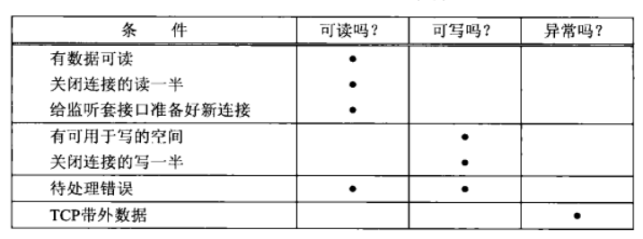

# I/O 多路复用函数详解

## 一、Select 函数

### 1. Select 函数简介

该函数允许进程指示内核等待多个事件中的任何一个发生，并只在有一个或多个事件发生或经历一段指定的时间后才唤醒它。作为一个例子，我们可以调用 select，告知内核仅在下列情况发生时才返回：

- 集合｛1,4,5｝中的任何描述符准备好读；
- 集合｛2,7｝中的任何描述符准备好写；
- 集合｛1,4｝中的任何描述符有异常条件待处理；
- 已经历了 10.2 秒。

也就是说，我们调用 select 告知内核对哪些描述符（读、写或异常条件）感兴趣以及等待多长时间。我们感兴趣的描述符不局限于套接字，任何描述符都可以使用 select 来测试。源自 Berkeley 的实现已经允许任何描述符的 I/O 复用。

```c
#include <sys/select.h>
#include <sys/time.h>

int select (int maxfdp1, fd_set *readset, fd_set *writeset, fd_set *exceptset, const struct timeval *timeout);
```

我们从该函数的最后一个参数 timeout 开始介绍，它告知内核等待所指定描述符中的任何一个就绪可花多长时间。其 `timeval` 结构用于指定这段时间的秒数和微秒数。

```c
struct timeval {
    long tv_sec；/*seconds */
    long tv_usec；/*microseconds */
}；
```

这个参数有以下三种可能。

1. 永远等待下去：**仅在有一个描述符准备好 I/O 时才返回**。为此，我们把该参数设置为空指针。
2. 等待一段固定时间：**在有一个描述符准备好 I/O 时返回**，但是不超过由该参数所指向的 `timeval` 结构中指定的秒数和微秒数。
3. 根本不等待：**检查描述符后立即返回，这称为轮询（polling）**。为此，该参数必须指向一个 `timeval` 结构，而且其中的定时器值（由该结构指定的秒数和微秒数）必须为 0。

尽管 `timeval` 结构允许我们指定了一个微秒级的分辨率，然而内核支持的真实分辨率往往粗糙得多。举例来说，许多 Unix 内核把超时值向上舍入成 10ms 的倍数。另外还涉及调度延迟，也就是说**定时器时间到后，内核还需花一点时间调度相应进程运行**。

timeout 参数的 const 限定词表示它在函数返回时不会被 select 修改。举例来说，如果我们指定一个 10s 的超时值，不过在定时器到时之前 select 就返回了（**结果可能是有一个或多个描述符就绪，也可能是得到 EINTR 错误**），那么 timeout 参数所指向的 timeval 结构不会被更新成该函数返回时剩余的秒数。如果我们需要知道这个值，那么必须在调用 select 之前取得系统时间，它返回后再取得系统时间，两者相减就是该值。

中间的三个参数 readset、writeset 和 exceptset 指定我们要让内核测试读、写和异常条件的描述符。

select 使用描述符集，**通常是一个整数数组，其中每个整数中的每一位对应一个描述符**。举例来说，假设使用 32 位整数，那么该数组的第一个元素对应于描述符 0~31，第二个元素对应于描述符 32~63 位，依次类推。描述符集隐藏在名为 fd_set 的数据类型和以下四个宏中：

```c
void FD_ZERO (fd_set *fdset); /* clear all bits in fdset */
void FD_SET (int fd, fd_set *fdset); /* turn on the bit for fd in fdset */
void FD_CLR (int fd, fd_set *fdset); /* trun off the bit for fd in fdset*/
int FD_ISSET (int fd, fd_set *fdset); /* is the bit for fd on in fdset ?*/
```

举个例子，以下代码用于定义一个 fd_set 类型的变量，然后打开描述符 1、4 和 5 的对应位:

```c
fd_set rset;
FD_ZERO (&rset); /* initialize the set: all bits off */
FD_SET (1, &rset); /* turn on bit for fd 1 */
FD_SET (4, &rset); /* turn on bit for fd 4 */
FD_SET (5, &rset); /* turn on bit for fd 5 */
```

select 函数的中间三个参数 readset、writeset 和 exceptset 中，如果我们对某一个的条件不感兴趣，就可以把它设为空指针。事实上，如果这三个指针均为空，我们就有了一个比 Unix 的 sleep 函数更为精确的定时器（sleep 睡眠以秒为最小单位）。

`maxfdp1` 参数指定待测试的描述符个数，它的值是待测试的最大描述符加 1（因此我们把该参数命名为 maxfdp1），描述符 0,1,2… 一直到 maxfdp1 - 1 均将被测试。

`maxfdp1` 参数迫使我们计算出所关心的最大描述符并告知内核该值。以前面给出的打开描述符 1、4 和 5 的代码为例，其 maxp1 值就是 6。是 6 而不是 5 的原因在于：我们指定的是描述符的个数而非最大值，而描述符是从 0 开始的。

select 函数修改由指针 readset、writeset 和 exceptset 所指向的的描述符集，因而这三个参数都是值-结果参数。调用该函数时，我们指定所关心的描述符的值，该函数返回时，结果将指示哪些描述符已就绪。该函数返回后，我们使用 `FD_ISSET` 宏来测试 `fd_set` 数据类型中的描述符。

描述符集内任何与未就绪描述符对应的位返回时均清成 0。为此，每次重新调用 select 函数时，我们都得再次把所有描述符集内所关心的位均置为 1。

该函数的返回值表示跨所有描述符集的已就绪的总位数。如果在任何描述符就绪之前定时器到时，那么返回 0。返回-1 表示出错（这是可能发生的，譬如本函数被一个所捕获的信号中断）。

### 2.select 描述符就绪条件

满足下列四个条件中的任何一个时，一个套接字准备好读。

1. **该套接字接收缓冲区中的数据字节数大于等于套接字接收缓冲区低水位标记的当前大小**。对这样的套接字执行读操作不会阻塞并将返回一个大于 0 的值 (也就是返回准备好读入的数据)。我们可以使用 SO_RCVLOWAT 套接字选项设置该套接字的低水位标记。对于 TCP 和 UDP 套接字而言，其默认值为 1（也就是 socket 接收缓冲区中只要有数据，此 socket 准备好读）
2. **该连接的读半部关闭 (也就是接收了 FIN 的 TCP 连接)**。对这样的套接字的读操作将不阻塞并返回 0 (也就是返回 EOF)
3. **该套接字是一个监听套接字且建立的新连接数不为 0**。对这样的套接字的 accept 通常不会阻塞。
4. 其上有一个套接字错误待处理。**对这样的套接字的读操作将不阻塞并返回-1 (也就是返回一个错误)**，同时把 errno 设置成确切的错误条件。

满足下列四个条件中的任何一个时，一个套接字准备好写。

1. **套接字内核发送缓冲区中的可用字节数大于或等于其低水位标记（有空间可以写入发送数据）**。此时可以无阻塞的写该 socket，并且写操作返回的字节数大于 0。我们可以使用 SO_SNDLOWAT 套接字选项来设置该套接字的低水位标记。对于 TCP 和 UDP 套接字而言， 其默认值通常为 2048。
2. **该连接的写半部关闭（也就是主动发送 FIN 包的 TCP 连接）**。对这样的套接字的写操作将产生 SIGPIPE 信号。这里解释一下原因，**可以通过调用 shutdown(SHUT_WR) 来关闭连接的写半部，这个函数都会使得套接字发送缓冲区的内容被发送到对端**，这样其发送缓冲区中的可用字节数大于等于其低水位标记，所以可写。但是由于写半部已经被关闭，因此会产生 SIGPIPE 信号。
3. **使用非阻塞式 connect 的套接字已建立连接**（也就是使用此 select 来监听建立连接的套接字，如果该套接字能够和服务器建立好连接，那么此套接字可写，可以使用此套接字往服务器发送消息，不会阻塞），或者 connect 已经以失败告终。
4. 其上有一个套接字错误待处理。对这样的套接字的写操作将不阻塞并返回 -1 (也就是返回一个错误) ，同时把 errno 设置成确切的错误条件。

接收低水位标记和发送低水位标记的目的在于：允许应用进程控制在 select 返回可读或可写条件之前有多少数据可读或有多大空间可用于写。举例来说，如果我们知道除非至少存在 64 个字节的数据，否则我们的应用进程没有任何有效工作可做，那么可以把接收低水位标记设置为 64，以防少于 64 个字节的数据准备好读时 select 唤醒我们。select 的就绪条件总结如下：

<div align="center">
    
</div>

socket select
socket close
socket shutdown
socket send/recv
socket read/write