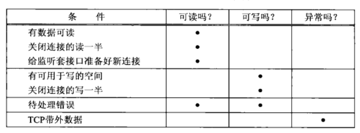
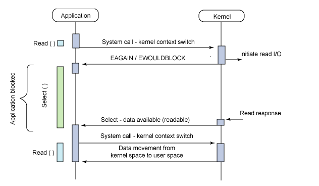
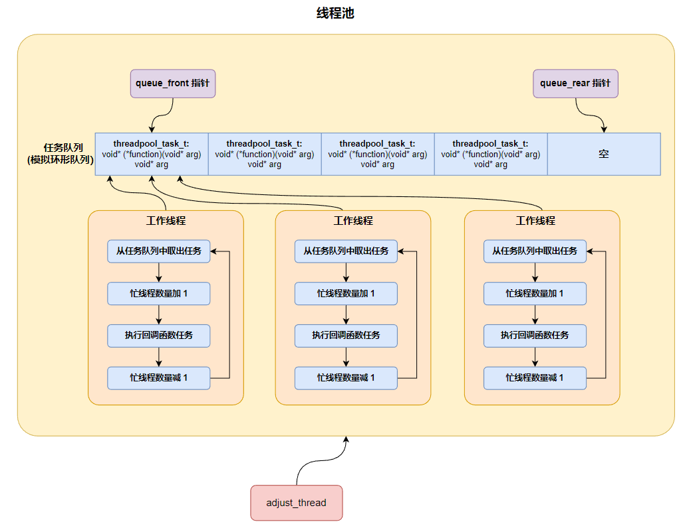
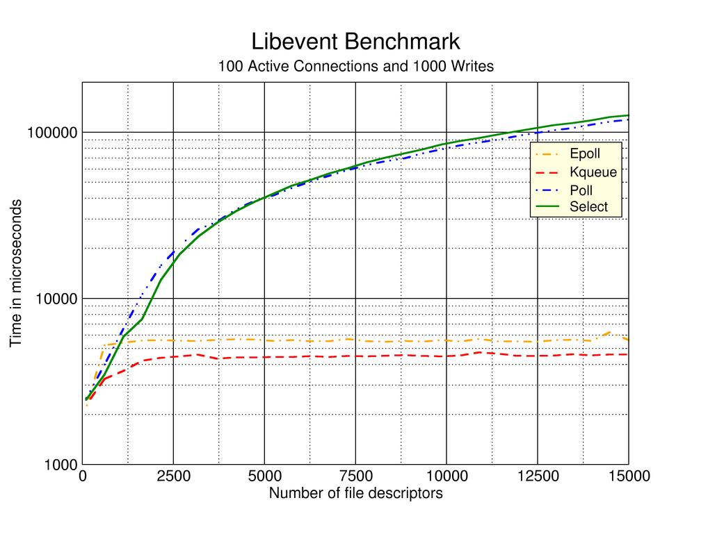

# I/O 多路复用函数详解

select，poll，epoll都是 I/O 多路复用的机制。I/O 多路复用就是通过一种机制，一个进程可以监视多个描述符，一旦某个描述符就绪（一般是读就绪或者写就绪），能够通知程序进行相应的读写操作。__但select，poll，epoll 本质上都是同步 I/O，因为他们都需要在读写事件就绪后自己负责进行读写__，也就是说这个读写过程是阻塞的，而异步 I/O 则无需自己负责进行读写，异步 I/O 的实现会负责把数据从内核拷贝到用户空间。

## 一、Select 函数

### 1. Select 函数简介

该函数允许进程指示内核等待多个事件中的任何一个发生，并只在有一个或多个事件发生或经历一段指定的时间后才唤醒它。作为一个例子，我们可以调用 select，告知内核仅在下列情况发生时才返回：

- 集合｛1,4,5｝中的任何描述符准备好读；
- 集合｛2,7｝中的任何描述符准备好写；
- 集合｛1,4｝中的任何描述符有异常条件待处理；
- 已经历了 10.2 秒。

也就是说，我们调用 select 告知内核对哪些描述符（读、写或异常条件）感兴趣以及等待多长时间。我们感兴趣的描述符不局限于套接字，任何描述符都可以使用 select 来测试。源自 Berkeley 的实现已经允许任何描述符的 I/O 复用。

```c
#include <sys/select.h>
#include <sys/time.h>

int select (int maxfdp1, fd_set *readset, fd_set *writeset, fd_set *exceptset, const struct timeval *timeout);
```

我们从该函数的最后一个参数 timeout 开始介绍，它告知内核等待所指定描述符中的任何一个就绪可花多长时间。其 `timeval` 结构用于指定这段时间的秒数和微秒数。

```c
struct timeval {
    long tv_sec；/*seconds */
    long tv_usec；/*microseconds */
}；
```

这个参数有以下三种可能。

1. 永远等待下去：**仅在有一个描述符准备好 I/O 时才返回**。为此，我们把该参数设置为空指针。
2. 等待一段固定时间：**在有一个描述符准备好 I/O 时返回**，但是不超过由该参数所指向的 `timeval` 结构中指定的秒数和微秒数。
3. 根本不等待：**检查描述符后立即返回，这称为轮询（polling）**。为此，该参数必须指向一个 `timeval` 结构，而且其中的定时器值（由该结构指定的秒数和微秒数）必须为 0。

尽管 `timeval` 结构允许我们指定了一个微秒级的分辨率，然而内核支持的真实分辨率往往粗糙得多。举例来说，许多 Unix 内核把超时值向上舍入成 10ms 的倍数。另外还涉及调度延迟，也就是说**定时器时间到后，内核还需花一点时间调度相应进程运行**。

timeout 参数的 const 限定词表示它在函数返回时不会被 select 修改。举例来说，如果我们指定一个 10s 的超时值，不过在定时器到时之前 select 就返回了（**结果可能是有一个或多个描述符就绪，也可能是得到 EINTR 错误**），那么 timeout 参数所指向的 timeval 结构不会被更新成该函数返回时剩余的秒数。如果我们需要知道这个值，那么必须在调用 select 之前取得系统时间，它返回后再取得系统时间，两者相减就是该值。

中间的三个参数 readset、writeset 和 exceptset 指定我们要让内核测试读、写和异常条件的描述符。

select 使用描述符集，**通常是一个整数数组，其中每个整数中的每一位对应一个描述符**。举例来说，假设使用 32 位整数，那么该数组的第一个元素对应于描述符 0~31，第二个元素对应于描述符 32~63 位，依次类推。描述符集隐藏在名为 fd_set 的数据类型和以下四个宏中：

```c
void FD_ZERO (fd_set *fdset); /* clear all bits in fdset */
void FD_SET (int fd, fd_set *fdset); /* turn on the bit for fd in fdset */
void FD_CLR (int fd, fd_set *fdset); /* trun off the bit for fd in fdset*/
int FD_ISSET (int fd, fd_set *fdset); /* is the bit for fd on in fdset ?*/
```

举个例子，以下代码用于定义一个 fd_set 类型的变量，然后打开描述符 1、4 和 5 的对应位:

```c
fd_set rset;
FD_ZERO (&rset); /* initialize the set: all bits off */
FD_SET (1, &rset); /* turn on bit for fd 1 */
FD_SET (4, &rset); /* turn on bit for fd 4 */
FD_SET (5, &rset); /* turn on bit for fd 5 */
```

select 函数的中间三个参数 readset、writeset 和 exceptset 中，如果我们对某一个的条件不感兴趣，就可以把它设为空指针。事实上，如果这三个指针均为空，我们就有了一个比 Unix 的 sleep 函数更为精确的定时器（sleep 睡眠以秒为最小单位）。

`maxfdp1` 参数指定待测试的描述符个数，它的值是待测试的最大描述符加 1（因此我们把该参数命名为 maxfdp1），描述符 0,1,2… 一直到 maxfdp1 - 1 均将被测试。

`maxfdp1` 参数迫使我们计算出所关心的最大描述符并告知内核该值。以前面给出的打开描述符 1、4 和 5 的代码为例，其 maxp1 值就是 6。是 6 而不是 5 的原因在于：我们指定的是描述符的个数而非最大值，而描述符是从 0 开始的。

select 函数修改由指针 readset、writeset 和 exceptset 所指向的的描述符集，因而这三个参数都是值-结果参数。调用该函数时，我们指定所关心的描述符的值，该函数返回时，结果将指示哪些描述符已就绪。该函数返回后，我们使用 `FD_ISSET` 宏来测试 `fd_set` 数据类型中的描述符。

描述符集内任何与未就绪描述符对应的位返回时均清成 0。为此，每次重新调用 select 函数时，我们都得再次把所有描述符集内所关心的位均置为 1。

该函数的返回值表示跨所有描述符集的已就绪的总位数。如果在任何描述符就绪之前定时器到时，那么返回 0。返回-1 表示出错（这是可能发生的，譬如本函数被一个所捕获的信号中断）。

### 2.select 描述符就绪条件

满足下列四个条件中的任何一个时，一个套接字准备好读。

1. **该套接字接收缓冲区中的数据字节数大于等于套接字接收缓冲区低水位标记的当前大小**。对这样的套接字执行读操作不会阻塞并将返回一个大于 0 的值 (也就是返回准备好读入的数据)。我们可以使用 SO_RCVLOWAT 套接字选项设置该套接字的低水位标记。对于 TCP 和 UDP 套接字而言，其默认值为 1（也就是 socket 接收缓冲区中只要有数据，此 socket 准备好读）
2. **该连接的读半部关闭 (也就是接收了 FIN 的 TCP 连接)**。对这样的套接字的读操作将不阻塞并返回 0 (也就是返回 EOF)
3. **该套接字是一个监听套接字且建立的新连接数不为 0**。对这样的套接字的 accept 通常不会阻塞。
4. 其上有一个套接字错误待处理。**对这样的套接字的读操作将不阻塞并返回-1 (也就是返回一个错误)**，同时把 errno 设置成确切的错误条件。

满足下列四个条件中的任何一个时，一个套接字准备好写。

1. **套接字内核发送缓冲区中的可用字节数大于或等于其低水位标记（有空间可以写入发送数据）**。此时可以无阻塞的写该 socket，并且写操作返回的字节数大于 0。我们可以使用 SO_SNDLOWAT 套接字选项来设置该套接字的低水位标记。对于 TCP 和 UDP 套接字而言， 其默认值通常为 2048。
2. **该连接的写半部关闭（也就是主动发送 FIN 包的 TCP 连接）**。对这样的套接字的写操作将产生 SIGPIPE 信号。这里解释一下原因，**可以通过调用 shutdown(SHUT_WR) 来关闭连接的写半部，这个函数都会使得套接字发送缓冲区的内容被发送到对端**，这样其发送缓冲区中的可用字节数大于等于其低水位标记，所以可写。但是由于写半部已经被关闭，因此会产生 SIGPIPE 信号。
3. **使用非阻塞式 connect 的套接字已建立连接**（也就是使用此 select 来监听建立连接的套接字，如果该套接字能够和服务器建立好连接，那么此套接字可写，可以使用此套接字往服务器发送消息，不会阻塞），或者 connect 已经以失败告终。
4. 其上有一个套接字错误待处理。对这样的套接字的写操作将不阻塞并返回 -1 (也就是返回一个错误) ，同时把 errno 设置成确切的错误条件。

接收低水位标记和发送低水位标记的目的在于：允许应用进程控制在 select 返回可读或可写条件之前有多少数据可读或有多大空间可用于写。举例来说，如果我们知道除非至少存在 64 个字节的数据，否则我们的应用进程没有任何有效工作可做，那么可以把接收低水位标记设置为 64，以防少于 64 个字节的数据准备好读时 select 唤醒我们。select 的就绪条件总结如下：

<div align="center">
    
</div>

### 3.str_cli 函数

现在我们可以使用 select 函数重写之前的 str_c1i 函数了，这样服务器进程一终止，客户就能马上得到通知。早先那个版本的问题在于：当套接字上发生某些事件时，客户可能阻塞于 fgets 调用。新版本改为阻塞于 select 调用，或是等待标准输入可读，或是等待套接字可读。

<div align="center">
    
</div>

客户的套接字上的三个条件处理如下：

1. 如果对端 TCP 发送数据， 那么该套接字变为可读， 并且 read 返回一个大于 0 的值 (即读入数据的字节数)。
2. 如果对端 TCP 发送一个 FIN(对端进程终止)，__那么该套接字变为可读， 并且 read 返回 0(EOF)__。
3. 如果对端 TCP 发送一个 RST (对端主机崩溃并重新启动)，__那么该套接字变为可读，并且 read 返回 -1，而 errno 中含有确切的错误码（errno = 104，表示 connectio reset by peer）__。

```c{.line-numbers}
#include "unp.h"

void str_cli(FILE *fp, int sockfd) {
    int maxfdp1;
    fd_set rset;
    char sendline[MAXLINE], recvline[MAXLINE];

    FD_ZERO(&rset);
    for (;;) {
        FD_SET(fileno(fp), &rset);
        FD_SET(sockfd, &rset);
        maxfdp1 = max(fileno(fp), sockfd) + 1;
        Select(maxfdp1, &rset, NULL, NULL, NULL);

        // socket is readable
        if (FD_ISSET(sockfd, &rset)) {
            if (Readline(sockfd, recvline, MAXLINE) == 0) {
                err_quit("str_cli: server terminated prematurely");
            }
            Fputs(recvline, stdout);
        }

        // input is readable
        if (FD_ISSET(fileno(fp), &rset)) {
            if (Fgets(sendline, MAXLINE, fp) == NULL) {
                /* all done */
                return;
            }
            Writen(sockfd, sendline, strlen(sendline));
        }
    }
}
```

注意，上面代码中的 Readline 有如下两个版本实现，第一个版本的代码为：

```c{.line-numbers}
#include "unp.h"
/* PAINFULLY SLOW VERSION -- example only */

ssize_t readline(int fd, void *vptr, size_t maxlen) {
    ssize_t n, rc;
    char c, *ptr;

    ptr = vptr;
    for (n = 1; n < maxlen; n++) {
        again:
        if ((rc = read(fd, &c, 1)) == 1) {
            *ptr++ = c;
            /* newline is stored in vptr, like fgets() */
            if (c == '\n') {
                break;
            }
        } else if (rc == 0) {
            *ptr = 0;
            /* EOF, n - 1 bytes were read */
            return (n - 1);
        } else {
            if (errno == EINTER) {
                goto again;
            }
            /* error, errno set by read() */
            return -1;
        }
    }

    /* null terminated like fgets() */
    /* \n 后面跟着一个 \0 标识字符串的结尾 */
    *ptr = 0;
    return n;
}

```

注意，第一个版本的 readline 函数每读一个字节的数据就调用一次系统的 read 函数。这是非常低效率的，为此我们特意在代码中注明 "PAINFULLY SLOW (极端地慢)"。当面临从某个套接字读入文本行这一需求时,改用标准 IO 函数库 (称为 stdio) 相当诱人。不过得先指出这是种危险的方法。解决性能问题的 stdio 缓冲机制却引发许多后期问题，可能导致在应用程序中存在相当隐蔽的缺陷。

究其原因在于 stdio 缓冲区的状态是不可见的。为了提升性能而使用 stdio 来缓冲数据使得应用进程在任何时刻都没有办法分辨 stdio 缓冲区中是否持有未预期的数据。

基于文本行的网络协议相当多,譬如 SMTP、HTTP、FTP 的控制连接协议以及 finger 等。因此针对文本行操作这一需求一再被提出。然而我们的建议是依照缓冲区而不是文本行的要求来考虑编程。

第二个版本的代码如下所示：

```c{.line-numbers}
#include "unp.h"

static int read_cnt;
static char *read_ptr;
static char read_buf[MAXLINE];

/*
 * 在 readline 中调用 my_read，my_read 函数使用 read 函数从接收缓冲区中一次读取最多 MAXLINE 个字符保存到 read_buf 中，然后每次返回一个字符给 readline
 */
static ssize_t my_read(int fd, char *ptr) {
    // 如果 read_cnt 小于等于 0，说明需要再次从 fd 中读取多个字符，然后保存到 read_buf 缓冲区中
    if (read_cnt <= 0) {
    again:
        if ((read_cnt = read(fd, read_buf, sizeof(read_buf))) < 0) {
            if (errno == EINTER) {
                goto again;
            }
            return -1;
        } else if (read_cnt == 0) {
            return 0;
        }
        read_ptr = read_buf;
    }

    read_cnt--;
    // 每次返回一个字符给 readline
    *ptr = *read_ptr++;
    return 1;
}

ssize_t readline(int fd, void *vptr, size_t maxlen) {
    ssize_t n, rc;
    char c, *ptr;

    ptr = vptr;
    for (n = 1; n < maxlen; n++) {
        if ((rc = my_read(fd, &c)) == 1) {
            *ptr++ = c;
            /* newline is stored in vptr, like fgets() */
            if (c == '\n') {
                break;
            }
        } else if (rc == 0) {
            *ptr = 0;
            /* EOF, n - 1 bytes were read */
            return (n - 1);
        } else {
            /* error, errno set by read() */
            return -1;
        }
    }

    /* null terminated like fgets() */
    /* \n 后面跟着一个 \0 标识字符串的结尾 */
    *ptr = 0;
    return n;
}

// readlinebuf 这个新函数能够展露内部缓冲区的状态，便于调用者查看在当前文本行之后
// 是否收到了新的数据。
ssize_t readlinebuf(void **vptrptr) {
    if (read_cnt)
        *vptrptr = read_ptr;
    return read_cnt;
}

```

第二个版本的 readline 函数较为快速，它使用自己的 read_buf 缓冲区而不是 stdio 提供的缓冲机制。其中重要的是 readline 内部缓冲区的状态是暴露的，这使得调用者能够查看缓冲区中到底收到了什么（使用 readlinebuf 函数）。

即使使用这个特性，readline 仍可能存在问题。因为 select 等系统函数不可能知道 readline 使用的内部缓冲区 read_buf 中是否有数据可读，因此编写不严谨的程序很可能发现自己在 select 上等待接收的数据早已收到并存放在 readline 的缓冲区中了。

### 4.批量输入

在第 3 节中 TCP 回射程序存在一些 bug，当我们把标准输入 stdio 和标准输出 stdout 的文件描述符重定向到文件时，即从文件读取文本行作为输入，然后发送给 TCP 服务器，然后从 socket 套接字上获取到返回数据，写入到另外一个文件中。__这就叫做批量输入__。

第一个 bug 就是在第 25 行，当使用 `Fgets` 读取到文本行的末尾时，会返回一个 NULL，然后直接退出程序。程序进程退出之后，该进程所拥有的所有文件/套接字描述符都会被 Init 进程关闭（调用 close 函数释放）。__调用 close 会使套接字接收缓冲区中内容被丢弃，另外可能还有请求在去往服务器的路上，或者服务器的响应值也在返回客户端的路上__。这些因素会导致输出文件的行数小于输入文件。我们可以使用 shutdown 来解决这个问题，在读取到文件结尾时，**可以调用 shutdown(sockfd, SHUT_WR)**，表示不会再发送数据，但是可以继续读取服务器发送过来的响应数据。

第二个 bug 为 fgets 的缓冲区。一般地说，为提升性能而引入缓冲机制增加了网络应用程序的复杂性。考虑有多个来自标准输入的文本输入行可用的情况。select 将使第 25 行代码用 fgets 读取输入，__这又转而使已可用的文本输入行被读入到 stdio 所用的缓冲区中。然而 fgets 只返回其中第一行，其余输入行仍在 stdio 缓冲区中__。第 29 行代码把 fgets 返回的单个输入行写给服务器。

随后 select 再次被调用以等待新的工作，而不管 stdio 缓冲区中还有额外的输入行待消费。__究其原因在于 select 不知道 stdio 使用了缓冲区__———它只是从 read 系统调用的角度指出是否有数据可读， 而不是从 fgets 之类调用的角度考虑。基于上述原因， 混合使用 stdio 和 select 被认为是非常容易犯错误的， 在这样做时必须极其小心。

第三个 bug 为 Readline 函数的缓冲区（这里为第二个版本的 Readline 函数）。这回 select 不可见的数据不是隐藏在 stdio 缓冲区中，而是隐藏在 readline 自己的缓冲区中。第二个版本的 Readline 会调用 read 函数一次读取最多不超过 MAXLINE 个字符，然后保存到 read_buf 缓冲区中。这样调用 select 函数时，select 函数并不知道 read_buf 缓冲区中的数据，很可能继续阻塞，而等待接收的数据早已收到并存放在 readline 的缓冲区中了。

### 5.str_cli 函数修订版

下面这个版本的 str_cli 对第 3 节中的程序进行了修改，解决了前面提出的三个 bug，它使用了 select 和 shutdown，其中前者只要服务器关闭它那一端的连接就会通知我们，后者允许我们正确地处理批量输入。__这个版本还废弃了以文本行为中心的代码，全部使用 read 和 write 函数，从而消除了缓冲区中数据对于 select 不可见的问题__。

```c{.line-numbers}
#include "unp.h"

void str_cli(FILE *fp, int sockfd) {
    int maxfdp1, stdineof;
    fd_set rset;
    char buf[MAXLINE];
    int n;

    stdineof = 0;
    FD_ZERO(&rset);
    for (;;) {
        if (stdineof == 0) {
            FD_SET(fileno(fp), &rset);
        }

        FD_SET(sockfd, &rset);
        maxfdp1 = max(fileno(fp), sockfd) + 1;
        Select(maxfdp1, &rset, NULL, NULL, NULL);

        // socket is readable
        if (FD_ISSET(sockfd, &rset)) {
            // EOF of socket
            if ((n = Read(sockfd, buf, MAXLINE)) == 0) {
                if (stdineof == 1) 
                    return;
                else 
                    err_quit("str_cli: server terminated prematurely");
            }
            Write(fileno(stdout), buf, n);
        }

        // input is readable
        if (FD_ISSET(fileno(fp), &rset)) {
            // EOF of file descriptor
            if ((n = Read(fileno(fp), buf, MAXLINE)) == 0) {
                stdineof = 1;
                Shutdown(sockfd, SHUT_WR);
                FD_CLR(fileno(fp), &rset);
                continue;
            }
            Write(sockfd, buf, n);
        }
    }
}
```

当我们在套接字上读到 EOF 时,如果我们已在标准输入上遇到 EOF,那就是正常的终止,于是函数返回;但是如果我们在标准输入上没有遇到 EOF,那么服务器进程已过早终止。我们改用 read 和 write 对缓冲区而不是文本行进行操作，使得 select 能够如期地工作。

### 6.select 函数的调用过程

select 的调用过程如下所示：

<div align="center">
    
</div>

- 使用 copy_from_user __从用户空间拷贝 fd_set 到内核空间__
- 注册回调函数 __pollwait
- 遍历所有 fd，调用其对应的 poll 方法（对于 socket，这个 poll 方法是 sock_poll，sock_poll 根据连接情况会调用到 tcp_poll，udp_poll 或者 datagram_poll），以 tcp_poll 为例，其核心实现就是 __pollwait，也就是上面注册的回调函数。__pollwait 的主要工作就是把 current（当前进程）挂到 fd 对应的设备等待队列中，不同的设备有不同的等待队列，对于 tcp_poll 来说，其等待队列是 sk->sk_sleep（注意把进程挂到等待队列中并不代表进程已经睡眠了）。**即每次调用 select 都会把 current 进程挂到各个 fd 对应的设备等待队列中**。
- 然后 poll 方法返回时会返回一个描述读写操作是否就绪的 mask 掩码，根据这个 mask 掩码给fd_set 赋值
- 如果遍历完所有的 fd（即第二步的操作，遍历所有 fd 并调用 poll 方法），还没有返回一个可读写的 mask 掩码，则会调用 schedule_timeout 使得调用 select 的进程（也就是 current）进入睡眠。当设备驱动发生自身资源可读写后，会唤醒其等待队列上睡眠的进程。
- 如果超过一定的超时时间（schedule_timeout 指定），还是没人唤醒，__则调用 select 的进程会重新被唤醒获得 CPU，进而重新遍历 fd（还是在 select 函数中），判断有没有就绪的 fd__（即 select 调用会遍历 fd，如没有就绪的，则休眠，过一会儿再次被唤醒遍历 fd，没有就绪的，再休眠，如此循环直到发生就绪事件）。
- 把 fd_set 从内核空间拷贝到用户空间。

根据上述 select 函数调用中的具体步骤，select 的缺点如下：

- 每次调用 select，__都需要把 fd 集合从用户态拷贝到内核态中，从而使 select 能够修改 fd_set 来标明哪些事件就绪，并且在结束的时候又从内核态拷贝到用户态__，供用户进程遍历 fd_set 进行判断，这个开销在 fd 很多时会很大
- 同时每次调用 select 都需要在内核遍历传递进来的所有 fd，这个开销在 fd 很多时也很大
- select 支持的文件描述符数量太小了，默认是 1024

不过 select 目前几乎在所有的平台上支持，其良好跨平台支持也是它的一个优点。

## 二、poll

```c
// 若有就绪描述符则为其数目，若超时则为 0，若出错则为 -1
int poll (struct pollfd *fdarray, unsigned int nfds, int timeout); 
```

不同于 select 使用三个位图来表示三个 fdset 的方式，poll 使用一个 pollfd 的指针实现。

```c
struct pollfd {
    int fd; /* file descriptor */
    short events; /* requested events to watch 感兴趣的事件 */
    short revents; /* returned events witnessed 实际发生的事件 */
}; 
```

pollfd 结构包含了要监视的 event 和发生的 event，不再使用 select "参数——值"传递的方式。同时，pollfd 并没有最大数量限制（但是数量过大后性能也是会下降）。和 select 函数一样，poll 返回后，应用程序需要轮询 pollfd 来获取就绪的描述符。除此之外，poll 和 select 操作基本上一致。

从上面看，select 和 poll 都需要在返回后，应用程序通过遍历文件描述符来获取已经就绪的 socket。事实上，同时连接的大量客户端在一时刻可能只有很少的处于就绪状态，因此随着监视的描述符数量的增长，其效率也会线性下降。

就 TCP 和 UDP 套接字而言，以下条件引起 poll 返回特定的 revent。不幸的是，POSIX 在其 poll 的定义中留了许多空洞 (也就是说有多种方法可返回相同的条件)。

- 所有正规 TCP 数据和所有 UDP 数据都被认为是普通数据
- **当 TCP 连接的读半部关闭时(譬如收到了一个来自对端的 FIN)，也被认为是普通数据随后的读操作将返回 0**。
- TCP 连接存在错误既可认为是普通数据，也可认为是错误 (POLLERR)。无论哪种情况随后的读操作将返回 -1，并把 errno 设置成合适的值。这可用于处理诸如接收到 RST 或发生超时等条件。
- 在监听套接字上有新的连接可用既可认为是普通数据，也可认为是优先级数据。大多数实现视之为普通数据。
- 非阻塞式 connect 的完成被认为是使相应套接字可写

poll 函数中结构数组中元素的个数是由 nfds 参数指定。timeout 参数指定 poll 函数返回前等待多长时间。它是一个指定应等待毫秒数的正值。当 timeout 的值为 `INFTIM` 时，poll 函数永远等待；timeout = 0 时，poll 函数立即返回，不阻塞进程；timeout > 0 时，等待指定数目的毫秒数。

 - 当发生错误时，poll 函数的返回值为 -1
 - 若定时器到时而没有任何描述符就绪，则返回 0
 - 否则返回就绪描述符的个数，即 revents 成员值非 0 的描述符个数。

__如果我们不再关心某个特定描述符，那么可以把与它对应的 pollfd 结构的 fd 成员设置成一个负值__。poll 函数将忽略这样的 pollfd 结构的 events 成员，返回时将它的 revents 成员的值置为 0。

## 三、epoll 

epoll 是在 Linux 2.6 内核中提出的，是之前的 select 和 poll 的增强版本。相对于 select 和poll 来说，epoll 更加灵活，没有描述符限制。epoll 使用一个文件描述符管理多个描述符，将用户关心的文件描述符的事件存放到内核的一个事件表中（也就是 eventpoll），这样在用户空间和内核空间的copy 只需一次。

### 1.epoll 基本 API

epoll 操作过程需要三个接口，分别如下：

```c
// 创建一个 epoll 的句柄，size 用来告诉内核这个监听的数目一共有多大
int epoll_create(int size);
int epoll_ctl(int epfd, int op, int fd, struct epoll_event *event);
int epoll_wait(int epfd, struct epoll_event * events, int maxevents, int timeout); 
```

**1) epoll_create 函数**

```c
int epoll_create(int size);
```

创建一个 epoll 的句柄，size 参数可以被忽略，因为以前对于监控文件描述符的组织是使用链表，现在使用的是红黑树。__当创建好 epoll 句柄后，它就会占用一个 fd 值__，在 linux 下如果查看 /proc/进程id/fd/，是能够看到这个 fd 的，__所以在使用完 epoll 后，必须调用 close() 关闭__，否则可能导致 fd 被耗尽。

**2) epoll_ctl 函数**

```c
int epoll_ctl(int epfd, int op, int fd, struct epoll_event *event)；
```

函数是对指定描述符 fd 执行 op 操作。

- epfd：是 epoll_create() 的返回值。
- op：表示 op 操作，用三个宏来表示：添加 EPOLL_CTL_ADD，删除 EPOLL_CTL_DEL，修改EPOLL_CTL_MOD。分别添加、删除和修改对 fd 的监听事件。
- fd：是需要监听的 fd（文件描述符）
- epoll_event：是告诉内核需要监听什么事，struct epoll_event 结构如下：

```c
struct epoll_event {
    __uint32_t events;  /* Epoll events */
    epoll_data_t data;  /* User data variable */
};

typedef union epoll_data {
    void *ptr;
    int fd;
    uint32_t u32;
    uint64_t u64;
} epoll_data_t;
```

其中 events 可以是如下几个宏的集合：

- EPOLLIN ：表示对应的文件描述符可以读，或者有新连接（包括对端 socket 正常关闭）；
- EPOLLOUT：表示对应的文件描述符可以写；
- EPOLLPRI：表示对应的文件描述符有紧急的数据可读（这里应该表示有带外数据到来）；
- EPOLLERR：表示对应的文件描述符发生错误；
- EPOLLHUP：表示对应的文件描述符被挂断；
- EPOLLET：将 EPOLL 设为边缘触发(Edge Triggered)模式，这是相对于水平触发(Level Triggered)来说的；
- EPOLLONESHOT：只监听一次事件，当监听完这次事件之后，如果还需要继续监听这个 socket 的话，需要再次把这个 socket 加入到 EPOLL 队列里

**3) epoll_wait**

```c
int epoll_wait(int epfd, struct epoll_event * events, int maxevents, int timeout);
```

等待 epfd 上的 I/O 事件，最多返回 maxevents 个事件。参数 events 用来从内核得到事件的集合，maxevents 告诉内核这个传入的 events 有多大，这个 maxevents 的值不能大于创建 epoll_create() 时的 size，参数 timeout 是超时时间（毫秒，0 会立即返回，-1 是永久阻塞，> 0 为指定毫秒数）。该函数返回需要处理的事件数目。

使用 epoll 函数编写的 server 示例如下所示：

```c{.line-numbers}
#include <stdio.h>
#include <stdlib.h>
#include <string.h>
#include <netinet/in.h>
#include <arpa/inet.h>
#include <sys/epoll.h>
#include <errno.h>
#include "wrap.h"

#define MAXLINE 80
#define SERV_PORT 6666
#define OPEN_MAX 1024

int main(int argc, char *argv[])
{
    int i, j, maxi, listenfd, connfd, sockfd;
    int nready, efd, res;
    ssize_t n;
    char buf[MAXLINE], str[INET_ADDRSTRLEN];
    socklen_t clilen;
    int client[OPEN_MAX];
    struct sockaddr_in cliaddr, servaddr;
    struct epoll_event tep, ep[OPEN_MAX];

    // 创建监听描述符
    listenfd = Socket(AF_INET, SOCK_STREAM, 0);

    bzero(&servaddr, sizeof(servaddr));
    servaddr.sin_family = AF_INET;
    servaddr.sin_addr.s_addr = htonl(INADDR_ANY);
    servaddr.sin_port = htons(SERV_PORT);

    // 绑定监听地址
    Bind(listenfd, (struct sockaddr *) &servaddr, sizeof(servaddr));
    Listen(listenfd, 20);

    for (i = 0; i < OPEN_MAX; i++)
        client[i] = -1;
    maxi = -1;

    efd = epoll_create(OPEN_MAX);
    if (efd == -1)
        perr_exit("epoll_create");
    // 设置 listenfd 的监听事件为 EPOLLIN，即监听新连接
    tep.events = EPOLLIN; 
    tep.data.fd = listenfd;
    // 将监听套接字 listenfd 添加到 efd 上，用于监听新连接
	res = epoll_ctl(efd, EPOLL_CTL_ADD, listenfd, &tep);
    if (res == -1)
        perr_exit("epoll_ctl");

    while (1) {
        /* 阻塞监听 */
        nready = epoll_wait(efd, ep, OPEN_MAX, -1); 
        if (nready == -1)
            perr_exit("epoll_wait");

        for (i = 0; i < nready; i++) {
            // server 只监听读事件
            if (!(ep[i].events & EPOLLIN))
                continue;
            // 如果是监听连接套接字 listenfd 上的读事件就绪（说明有新连接）
            if (ep[i].data.fd == listenfd) { 
                clilen = sizeof(cliaddr);
                connfd = Accept(listenfd, (struct sockaddr *)&cliaddr, &clilen);
                printf("received from %s at PORT %d\n", 
                        inet_ntop(AF_INET, &cliaddr.sin_addr, str, sizeof(str)), 
                        ntohs(cliaddr.sin_port));
                // 将新连接的套接字保存到 client 数组中
                for (j = 0; j < OPEN_MAX; j++) {
                    if (client[j] < 0) {
                        client[j] = connfd; /* save descriptor */
                        break;
                    }
                }
                // 如果新建立连接的数目超过 OPEN_MAX 的限额，就打印错误信息
                if (j == OPEN_MAX)
                    perr_exit("too many clients");
                if (j > maxi)
                    maxi = j; 		/* max index in client[] array */

                // 监听客户端 connfd 上的读事件
                tep.events = EPOLLIN; 
                tep.data.fd = connfd;
                res = epoll_ctl(efd, EPOLL_CTL_ADD, connfd, &tep);
                if (res == -1)
                    perr_exit("epoll_ctl");
            } else {
                sockfd = ep[i].data.fd;
                n = Read(sockfd, buf, MAXLINE);
                // 如果 n == 0，说明套接字 sockfd 被对方关闭
                if (n == 0) {
                    for (j = 0; j <= maxi; j++) {
                        if (client[j] == sockfd) {
                            client[j] = -1;
                            break;
                        }
                    }
                    // 从 efd 中监控的文件描述符中移除掉
                    res = epoll_ctl(efd, EPOLL_CTL_DEL, sockfd, NULL);
                    if (res == -1)
                        perr_exit("epoll_ctl");
                    // 关闭 sockfd 
                    Close(sockfd);
                    printf("client[%d] closed connection\n", j);
                } else {
                    for (j = 0; j < n; j++)
                        buf[j] = toupper(buf[j]);
                    Writen(sockfd, buf, n);
                }
            }
        }
    close(listenfd);
    close(efd);
    return 0;
}

```

### 2.epoll 事件模型

EPOLL 事件有两种模型：

- **Edge Triggered (ET) 边缘触发只有数据到来才触发，不管缓存区中是否还有数据**。
- **Level Triggered (LT) 水平触发只要有数据都会触发**。

思考如下步骤：

1.	假定我们已经把一个用来从管道中读取数据的文件描述符 (RFD) 添加到 epoll 描述符。
2.	管道的另一端写入了 2KB 的数据
3.	调用 epoll_wait，并且它会返回 RFD，说明它已经准备好读取操作
4.	读取 1KB 的数据
5.	调用 epoll_wait……

在这个过程中，有两种工作模式：

**1) ET 模式**

ET 模式即 Edge Triggered 工作模式。如果我们在第 1 步将 RFD 添加到 epoll 描述符的时候使用了 EPOLLET 标志，那么在第 5 步调用epoll_wait 之后将有可能会挂起，__因为剩余的数据还存在于文件的输入缓冲区内，而且数据发出端还在等待一个针对已经发出数据的反馈信息__。

只有在监视的文件句柄上发生了某个事件的时候 ET 工作模式才会汇报事件。因此在第 5 步的时候，调用者可能会放弃等待仍在存在于文件输入缓冲区内的剩余数据。**epoll 工作在 ET 模式的时候，必须使用非阻塞套接口**。最好以下面的方式调用 ET 模式的 epoll 接口，在后面会介绍避免可能的缺陷。

1. 基于非阻塞文件句柄
2. 只有当 read 或者 write 返回 EAGAIN (非阻塞读，暂时无数据) 时才需要挂起、等待。但这并不是说每次 read 时都需要循环读，直到读到产生一个 EAGAIN 才认为此次事件处理完成，当 read 返回的读到的数据长度小于请求的数据长度时，就可以确定此时缓冲中已没有数据了，也就可以认为此事读事件已处理完成。

**2) LT 模式**

LT 模式即 Level Triggered 工作模式。与 ET 模式不同的是，以 LT 方式调用 epoll 接口的时候，它就相当于一个速度比较快的 poll，无论后面的数据是否被使用。

**LT(level triggered)：LT 是缺省的工作方式**，并且同时支持 block 和 no-block socket。在这种做法中，内核告诉你一个文件描述符是否就绪了，然后你可以对这个就绪的 fd 进行 I/O 操作。如果你不作任何操作，内核还是会继续通知你的，所以，这种模式编程出错误可能性要小一点。传统的 select/poll 都是这种模型的代表。

ET(edge-triggered)：ET 是高速工作方式，只支持 no-block socket。在这种模式下，当描述符从未就绪变为就绪时，内核通过 epoll 告诉你。__然后它会假设你知道文件描述符已经就绪，并且不会再为那个文件描述符发送更多的就绪通知__。请注意，如果一直不对这个 fd 作 I/O 操作(从而导致它再次变成未就绪)，内核不会发送更多的通知(only once).

下面给出基于 ET 模式的非阻塞的例子。

```c{.line-numbers}
/* server.c */
#include <stdio.h>
#include <string.h>
#include <netinet/in.h>
#include <arpa/inet.h>
#include <sys/wait.h>
#include <sys/types.h>
#include <sys/epoll.h>
#include <unistd.h>
#include <fcntl.h>

#define MAXLINE 10
#define SERV_PORT 8080

int main(void)
{
    struct sockaddr_in servaddr, cliaddr;
    socklen_t cliaddr_len;
    int listenfd, connfd;
    char buf[MAXLINE];
    char str[INET_ADDRSTRLEN];
    int i, efd, flag;

    listenfd = socket(AF_INET, SOCK_STREAM, 0);

    bzero(&servaddr, sizeof(servaddr));
    servaddr.sin_family = AF_INET;
    servaddr.sin_addr.s_addr = htonl(INADDR_ANY);
    servaddr.sin_port = htons(SERV_PORT);

    bind(listenfd, (struct sockaddr *)&servaddr, sizeof(servaddr));
    listen(listenfd, 20);

    struct epoll_event event;
    struct epoll_event resevent[10];
    int res, len;
    efd = epoll_create(10);
    /* ET 边沿触发 ，默认是水平触发 */
    event.events = EPOLLIN | EPOLLET;		

    printf("Accepting connections ...\n");
    cliaddr_len = sizeof(cliaddr);
    connfd = accept(listenfd, (struct sockaddr *)&cliaddr, &cliaddr_len);
    printf("received from %s at PORT %d\n",
    inet_ntop(AF_INET, &cliaddr.sin_addr, str, sizeof(str)),
    ntohs(cliaddr.sin_port));

    // 将 connfd 描述符设置为非阻塞
    flag = fcntl(connfd, F_GETFL);
    flag |= O_NONBLOCK;
    fcntl(connfd, F_SETFL, flag);
    event.data.fd = connfd;
    // 监听套接字 connfd 上的读事件
    epoll_ctl(efd, EPOLL_CTL_ADD, connfd, &event);

    while (1) {
        printf("epoll_wait begin\n");
        res = epoll_wait(efd, resevent, 10, -1);
        printf("epoll_wait end res %d\n", res);
        // 如果 connfd 上有数据可读，那么直接循环读取 connfd 上的数据，知道读取完成
        if (resevent[0].data.fd == connfd) {
            while ((len = read(connfd, buf, MAXLINE/2)) > 0)
                write(STDOUT_FILENO, buf, len);
        }
    }
    return 0;
}
```

### 3. epoll + reactor 模式

使用 reactor 模型 + epoll 函数来实现高性能服务器，epoll 的本质和观察者模型类似，服务器在 epoll 注册事件以及和事件对应的处理器函数，当事件被触发时，就回调处理器函数。比如注册的 lfd 的 EPOLLIN 对应的 accept_conn 函数，当有用户连接时，就会触发，调用 accept 函数，建立连接。

然后把 cfd 也注册到 epoll 上，**并且有 EPOLLIN 事件和对应的 recvdata 函数，然后接收到数据时，回调 recvdata，将 EPOLLIN->recvdata 替换成 EPOLLOUT->senddata**，也就是待写时机成熟时，把接收到的数据返回给客户端。

下面实现了 echo server，就是将客户端发送过来的消息原封不动的转发回去。

```c{.line-numbers}
#include <stdio.h>
#include <unistd.h>
#include <stdlib.h>
#include <pthread.h>
#include <arpa/inet.h>
#include <sys/socket.h>
#include <sys/types.h>
#include <string.h>
#include <ctype.h>
#include <fcntl.h>
#include <signal.h>
#include <errno.h>
#include <sys/epoll.h>
#include "wrap_socket.h"

#define MAX_EVENTS 1024
#define BUFLEN 4096
#define SERV_PORT 8080

void recvdata(int fd, int events, void *arg);
void senddata(int fd, int events, void *arg);

struct myevent_s {
    // 要监听的文件描述符
    int fd;
    // 要监听的事件
    int events;
    // 泛型参数
    void *arg;
    // 回调函数
    void (*callback)(int fd, int events, void *arg);
    // 是否在监听:-1 -> 在红黑树上监听，0 -> 不在（红黑树）
    int status;
    char buf[BUFLEN];
    int len;
    // 记录每次加入红黑树 g_efd 的时间值
    long last_active;
};

// 全局变量，保存 epoll_create 返回的文件描述符
int g_efd;
// 自定义的结构体类型数组 +1 --> listenfd
struct myevent_s g_events[MAX_EVENTS + 1];

/* 初始化 myevent_s 结构体变量 */
void eventset(struct myevent_s *ev, int fd, void (*call_back)(int, int, void *), void *arg) {
    // 初始化 myevent_s 结构体中的属性字段
    ev->fd = fd;
    ev->events = 0;
    ev->status = 0;
    ev->last_active = time(NULL);
    ev->callback = call_back;
    ev->arg = arg;
    ev->len = ((struct myevent_s *) arg)->len;
}

/* 向 epoll 监听的红黑树添加一个文件描述符 */
void eventadd(int efd, int events, struct myevent_s *ev) {

    // efd 表示红黑树
    int op;
    struct epoll_event epv = {0, {0}};
    epv.data.ptr = ev;

    // EPOLLIN 或者 EPOLLOUT
    epv.events = ev->events = events;

    // 当前文件描述符不在红黑树上
    if (ev->status == 0) {
        // 将其加入到红黑树中，并将 status 置为 1
        op = EPOLL_CTL_ADD;
        ev->status = 1;
    }

    if ((epoll_ctl(efd, op, ev->fd, &epv)) < 0) {
        printf("event add failed [fd=%d], events[%d]\n", ev->fd, events);
    } else {
        printf("event add ok [fd=%d], events[%d]\n", ev->fd, events);
    }
}

/* 从 epoll 监听的红黑树中删除一个文件描述符 */
void eventdel(int efd, struct myevent_s *ev) {

    /*
     * struct epoll_event {
     *    __uint32_t events; 
     *    epoll_data_t data;
     * };
     */
    struct epoll_event epv = {0, {0}};

    if (ev->status == 0)
        return;

    epv.data.ptr = NULL;
    ev->status = 0;
    epoll_ctl(efd, EPOLL_CTL_DEL, ev->fd, &epv);

}

void accept_conn(int lfd, int events, void *arg) {

    struct sockaddr_in cin;
    socklen_t cli_len = sizeof(cin);
    int cfd, i;

    if ((cfd = accept(lfd, (struct sockaddr *) &cin, &cli_len)) < 0) {
        if (errno != EAGAIN && errno != EWOULDBLOCK){
            /* 暂时不做出错处理 */
        }
        printf("%s: accept, %s\n", __func__ , strerror(errno));
        return;
    }

    /**
     * do while(0) 是用来模拟 goto，因为 while(0) 是不会循环的，但是可以使用 break，当触发某一个条件时，调用 break，
     * 则可以退出 while 循环，后面的语句就不会执行
     */
    do {
        // 从全局数组 g_events 中找到一个空闲的元素，也就是不在红黑树上的元素
        for (i = 0; i < MAX_EVENTS; ++i) {
            if (g_events[i].status == 0){
                break;
            }
        }

        if (i == MAX_EVENTS) {
            printf("");
            break;
        }

        // 将 cfd 设置为非阻塞
        if (fcntl(cfd, F_SETFL, O_NONBLOCK) < 0) {
            printf("%s: fcntl failed, %s", __func__ , strerror(errno));
            break;
        }

        eventset(&g_events[i], cfd, recvdata, &g_events[i]);
        eventadd(g_efd, EPOLLIN, &g_events[i]);
    } while (0);

    printf("new connect [%s:%d][time:%ld], pos[%d]\n", 
           inet_ntoa(cin.sin_addr), ntohs(cin.sin_port), 
           g_events[i].last_active, i);
    
}

void recvdata(int fd, int events, void *arg) {
    
    struct myevent_s *ev = (struct myevent_s *) arg;
    ssize_t len;
    
    len = recv(fd, ev->buf, sizeof(ev->buf), 0);

    // 读取到数据之后，写出不能直接写，而要 epoll_wait 判断写出的时机满足之后（比如 kernel buffer 有空），才能写返回数据
    eventdel(g_efd, ev);
    
    if (len > 0) {
        ev->len = len;
        ev->buf[len] = '\0';

        printf("[%d]:%s\n", fd, ev->buf);
        // 设置 fd 对应的回调函数为 senddata，当可以写出数据时，回调 senddata
        eventset(ev, fd, senddata, ev);
        eventadd(g_efd, EPOLLOUT, ev);
    } else if (len == 0) {
        close(fd);
        printf("[fd=%d] pos[%ld] closed\n", fd, ev - g_events);
    } else {
        close(fd);
        printf("recv[fd=%d] error[%d]:%s\n", fd, errno, strerror(errno));
    }
    
}

void senddata(int fd, int events, void *arg)
{
    struct myevent_s *ev = (struct myevent_s *)arg;
    int len;

    // 直接将数据 回写给客户端。未作处理
    len = send(fd, ev->buf, ev->len, 0);
    // 从红黑树 g_efd 中移除
    eventdel(g_efd, ev);

    if (len > 0) {

        printf("send[fd=%d], [%d]%s\n", fd, len, ev->buf);
        // 将该 fd 的 回调函数改为 recvdata
        eventset(ev, fd, recvdata, ev);
        // 从新添加到红黑树上， 设为监听读事件
        eventadd(g_efd, EPOLLIN, ev);

    } else {
        // 关闭链接
        close(ev->fd);
        printf("send[fd=%d] error %s\n", fd, strerror(errno));
    }

    return ;
}

/* 创建 socket, 初始化 lfd */
void init_listen_socket(int efd, short port){

    struct sockaddr_in sin;

    int lfd = socket(AF_INET, SOCK_STREAM, 0);
    // 将 socket 设为非阻塞
    fcntl(lfd, F_SETFL, O_NONBLOCK);
    // 将 sockaddr_in 重置为 0
    memset(&sin, 0, sizeof(sin));
    sin.sin_family = AF_INET;
    sin.sin_addr.s_addr = INADDR_ANY;
    sin.sin_port = htons(port);

    bind(lfd, (struct sockaddr *)&sin, sizeof(sin));
    listen(lfd, 20);

    int opt = 1;
    setsockopt(lfd, SOL_SOCKET, SO_REUSEADDR, &opt, sizeof(opt));
    // void eventset(struct myevent_s *ev, int fd, void (*call_back)(int, int, void *), void *arg)
    // 使用 g_events[MAX_EVENTS] 来保存 lfd 对应的 event 参数，这就是为什么要 MAX_EVENTS + 1 的原因
    eventset(&g_events[MAX_EVENTS], lfd, accept_conn, &g_events[MAX_EVENTS]);

    /* void eventadd(int efd, int events, struct myevent_s *ev) */
    eventadd(efd, EPOLLIN, &g_events[MAX_EVENTS]);

}

int main() {

    unsigned short port = SERV_PORT;
    // 创建红黑树，返回给全局 g_efd
    g_efd = epoll_create(MAX_EVENTS + 1);
    
    if (g_efd <= 0)
        printf("create efd in %s err %s\n", __func__, strerror(errno));

    // 初始化监听 socket，并且将监听文件描述符添加到红黑树上，并且注册 accept_conn 回调函数
    init_listen_socket(g_efd, port);
    // 保存已经满足就绪事件的文件描述符数组
    struct epoll_event events[MAX_EVENTS+1];
    printf("server running:port[%d]\n", port);

    int checkpos = 0, i;

    while (1) {
        /* 超时验证，每次测试 100 个链接，不测试 listenfd 当客户端 60 秒内没有和服务器通信，则关闭此客户端接 */
        // 当前时间
        long now = time(NULL);

        // 一次循环检测 100 个。 使用 checkpos 控制检测对象
        // i 控制只检测 100 个链接，checkpos 控制检测的具体连接的编号
        for (i = 0; i < 100; i++, checkpos++) {
            if (checkpos == MAX_EVENTS)
                checkpos = 0;

            // 不在红黑树 g_efd 上
            if (g_events[checkpos].status != 1)
                continue;

            // 客户端不活跃的世间
            long duration = now - g_events[checkpos].last_active;

            if (duration >= 60) {
                // 关闭与该客户端链接
                close(g_events[checkpos].fd);
                printf("[fd=%d] timeout\n", g_events[checkpos].fd);
                // 将该客户端 从红黑树 g_efd 移除
                eventdel(g_efd, &g_events[checkpos]);
            }
        }

        /* 监听红黑树 g_efd, 将满足的事件的文件描述符加至 events 数组中, 1 秒没有事件满足, 返回 0 */
        int nfd = epoll_wait(g_efd, events, MAX_EVENTS + 1, 1000);
        if (nfd < 0) {
            printf("epoll_wait error, exit\n");
            break;
        }

        for (i = 0; i < nfd; i++) {
            /* 使用自定义结构体 myevent_s 类型指针, 接收 联合体 data 的 void *ptr 成员 */
            struct myevent_s *ev = (struct myevent_s *)events[i].data.ptr;

            if ((events[i].events & EPOLLIN) && (ev->events & EPOLLIN)) {           
                // 读就绪事件
                ev->callback(ev->fd, events[i].events, ev->arg);
            }

            if ((events[i].events & EPOLLOUT) && (ev->events & EPOLLOUT)) {         
                // 写就绪事件
                ev->callback(ev->fd, events[i].events, ev->arg);
            }
        }
    }

    return 0;
}
```

可以看到，其中 epoll_event 的 data 成员是一个联合体 epoll_data，其成员有一个void* 的指针 ptr，还有一个 fd，一般用法是直接把 socket 赋给 fd 即可，但是，__有了这个void* 的指针 ptr，我们就可以在注册 socket 的时候，传进我们想要的参数__。

epoll_data_t 中的 ptr 怎么用呢？是给用户自由使用的。epoll 不关心里面的内容。__用户可以用 epoll_data 这个 union 在 epoll_event 里面附带一些自定义的信息__，这个 epoll_data 会随着 epoll_wait 返回的 epoll_event 一并返回。那附带的自定义消息，就是 ptr 指向这个自定义消息。

### 4. 线程池

#### 4.1 线程池概述

在网络编程中一般需要使用线程池来对网络请求进行处理，使用 c 语言实现的一个简单线程池如下所示。

<div align="center">
    
</div>

在线程池中有以下三个基本组件：

- adjust_thread：调整线程，用来对整个线程池进行管理，当有任务积压时，需要增加线程来处理任务；当空闲线程比较多时（busy_thr_num * 2 < live_thr_num），需要关闭空闲的线程。
- thread：工作线程，不断循环从任务队列中取出任务，将 `busy_thr_num` 变量增加一，然后执行回调函数，然后将 `busy_thr_num` 数量减一。
- 任务队列：threadpool_task_t 结构体的数组，threadpool_task_t 结构体中有两个参数，一个为 `void* (*function)(void *)`，即要执行的回调函数；另外一个为 `void* arg`，即回调函数的参数。最后，__此任务队列使用 `queue_front` 和 `queue_rear` 两个指针模拟环形队列__

在线程池中还有以下 7 个参数：

- __`min_thr_num`__：线程池中存活的最小线程数，即使它们全部空闲，也要保留，不能关闭                  
- __`max_thr_num`__：线程池中允许存活的最大线程数
- __`live_thr_num`__：线程池中存活的线程数（包括正在执行任务或者空闲的线程数）
- __`busy_thr_num`__：线程池中存活，且正在执行任务的线程数
- __`wait_exit_thr_num`__：当线程池缩容时，指定要关闭或者说退出的线程个数
- __`queue_size`__：任务队列中待执行的任务个数
- __`queue_max_size`__：任务队列的容量

线程池数量的关系为：`min_thr_num` <= `busy_thr_num` <= `live_thr_num` <= `max_thr_num`

#### 4.2 `threadpool_thread` 方法

在线程池初始化时，会创建 `min_thr_num` 个线程，然后这些线程会从任务队列中不断获取任务，然后增加 `busy_thr_num` 的值，执行回调函数，减少 `busy_thr_num` 的值。

只有当修改变量 `busy_thr_num` 时，才会使用 `pthread_counter` 锁，而修改线程池 `threadpool_t` 中的所有属性时，都要加上 `lock`。

需要额外使用 `pthread_counter` 锁的原因是，线程从任务队列中取出任务执行时，需要频繁对变量 `busy_thr_num` 进行修改（执行任务前增加 1，任务执行完毕后减少 1）。__而只使用 `lock` 锁来对 `busy_thr_num` 变量进行并发控制的话，锁粒度太大，一直从取出任务前锁住到执行任务完毕（任务执行可能非常耗时）__，会阻塞其它线程从任务队列中获取任务并执行，影响线程池的运行效率，所以单独使用一个 `pthread_counter` 来控制对  `busy_thr_num` 变量的并发访问。

但是 `threadpool_thread` 循环中会碰到两种特殊情况，第一种就是如果工作线程被唤醒之后，如果发现 `wait_exit_thr_num` 变量大于 0，则说明管理线程在对线程池进行缩容，随机唤醒 10 （默认）个阻塞在条件变量 `queue_not_empty` 上的线程（即空闲线程），调用 `pthread_exit` 退出。在线程退出时，要判断存活的线程数目不能少于 `min_thr_num`。

第二种就是发现线程池已经被关闭，那么需要销毁线程池中的所有线程，也就是进行线程分离，这样线程调用 `pthread_exit` 退出后，内核会自动回收其资源。

#### 4.3 `adjust_thread` 方法

管理线程每隔 5s 对线程池的状态进行一次检查，根据线程池参数来判断是否需要进行扩容和缩容。

__1）扩容条件：任务数大于线程池中 `MIN_WAIT_TASK_NUM`，且存活的线程数少于最大线程个数时__

任务数大于线程池中最小等待被执行任务个数，说明任务存在积压，所以需要对线程池扩容，但是扩容后的线程数量不能超过用户指定的最大线程数。

__2）缩容条件：忙线程 *2 小于 存活的线程数且存活的线程数 大于 最小线程数时__

只有不到一半的线程数量有任务执行，其它线程都处于空闲状态，那么说明需要缩容，但缩容后线程数量不能小于用户指定的最小线程数量。缩容通过设置 `wait_exit_thr_num` 变量的值 > 0，并且唤醒阻塞在 `queue_not_empty` 上的线程（能阻塞在 `queue_not_empty` 上就说明此线程没有在执行回调函数，处于空闲状态）使其退出实现。

```c{.line-numbers}
#include <stdlib.h>
#include <pthread.h>
#include <unistd.h>
#include <assert.h>
#include <stdio.h>
#include <string.h>
#include <signal.h>
#include <errno.h>
#include "thread_pool.h"

/* 管理线程每隔 10s 检测一次，对线程池中的线程进行扩容或者销毁 */
#define DEFAULT_TIME 10
/* 如果 queue_size > MIN_WAIT_TASK_NUM 添加新的线程到线程池 */
#define MIN_WAIT_TASK_NUM 10
/* 每次创建和销毁线程的个数，类似于步长 */
#define DEFAULT_THREAD_VARY 10
#define true 1
#define false 0

/* 各子线程执行的任务结构体 */
typedef struct {
    /* 函数指针，回调函数 */
    void *(*function)(void *);
    /* 上面函数的参数 */
    void *arg;
} threadpool_task_t;                    

/* 描述线程池相关信息的结构体 */
struct threadpool_t {
    pthread_mutex_t lock;               /* 用于锁住本结构体，也就是对本结构体信息的互斥访问 */
    pthread_mutex_t thread_counter;     /* 记录忙状态线程个数的琐 -- 用户互斥访问 busy_thr_num 变量 */

    pthread_cond_t queue_not_full;      /* 当任务队列满时，添加任务的线程阻塞，等待此条件变量 */
    pthread_cond_t queue_not_empty;     /* 当任务队列为空时，执行任务的线程阻塞，等待此条件变量 */

    /* 
     * pthread_t 是 POSIX 线程库中的数据类型，用于代表线程标识符。在 C 语言中使用 POSIX 线程库时，通过 pthread_create 
     * 函数创建一个新的线程，该函数会返回一个 pthread_t 类型的值作为线程标识符，随后这个标识符就可以用于访问和操作这个新线程了。 
     */
    pthread_t *threads;                 /* 存放线程池中每个线程的 tid 数组 */
    pthread_t adjust_tid;               /* 存管理线程 tid */
    threadpool_task_t *task_queue;      /* 任务队列(数组首地址) */

    int min_thr_num;                    /* 线程池最小线程数 */
    int max_thr_num;                    /* 线程池最大线程数 */
    int live_thr_num;                   /* 当前存活线程个数 */
    int busy_thr_num;                   /* 忙状态线程个数 */
    int wait_exit_thr_num;              /* 要销毁的线程个数 */

    int queue_front;                    /* task_queue 队头下标 */
    int queue_rear;                     /* task_queue 队尾下标 */
    int queue_size;                     /* task_queue 队中实际任务数 */
    int queue_max_size;                 /* task_queue 队列可容纳任务数上限 */

    int shutdown;                       /* 标志位，线程池使用状态，true 或 false */
};

void *threadpool_thread(void *threadpool);
void *adjust_thread(void *threadpool);
int is_thread_alive(pthread_t tid);
int threadpool_free(threadpool_t *pool);

// threadpool_create(3,100,100);
/**
 * 初始化线程池中的各个参数，并且创建好 min_thr_num = live_thr_num 个线程，同时再创建好一个管理线程
 */
threadpool_t *threadpool_create(int min_thr_num, int max_thr_num, int queue_max_size) {

    int i;
    /* 线程池 结构体 */
    threadpool_t *pool = NULL;

    /* do while(0) 用来模拟 goto 语句，也就是当条件满足时，可以使用 break 直接退出，不执行后面的语句 */
    do {
        if((pool = (threadpool_t *)malloc(sizeof(threadpool_t))) == NULL) {
            printf("malloc threadpool fail");
            /* 跳出do while */
            break;
        }

        pool->min_thr_num = min_thr_num;
        pool->max_thr_num = max_thr_num;
        pool->busy_thr_num = 0;
        /* 活着的线程数 初值=最小线程数 */
        pool->live_thr_num = min_thr_num;
        pool->wait_exit_thr_num = 0;
        /* 任务队列中有 0 个产品 */
        pool->queue_size = 0;
        /* 最大任务队列数，任务队列的容量 */
        pool->queue_max_size = queue_max_size;
        pool->queue_front = 0;
        pool->queue_rear = 0;
        /* 不关闭线程池 */
        pool->shutdown = false;

        /* 根据最大线程上限数，给工作线程数组开辟空间，并清零 */
        pool->threads = (pthread_t *)malloc(sizeof(pthread_t) * max_thr_num);
        if (pool->threads == NULL) {
            printf("malloc threads fail");
            break;
        }
        memset(pool->threads, 0, sizeof(pthread_t) * max_thr_num);

        /* 给 任务队列 开辟空间 */
        pool->task_queue = (threadpool_task_t *) malloc(sizeof(threadpool_task_t) * queue_max_size);
        if (pool->task_queue == NULL) {
            printf("malloc task_queue fail");
            break;
        }

        /* 初始化互斥琐、条件变量 */
        if (pthread_mutex_init(&(pool->lock), NULL) != 0
            || pthread_mutex_init(&(pool->thread_counter), NULL) != 0
            || pthread_cond_init(&(pool->queue_not_empty), NULL) != 0
            || pthread_cond_init(&(pool->queue_not_full), NULL) != 0) {
            printf("init the lock or cond fail");
            break;
        }

        /* 启动 min_thr_num 个 work thread */
        for (i = 0; i < min_thr_num; i++) {
            /* pool 指向当前线程池结构体，threadpool_thread 是一个函数指针，用来获取任务队列中的任务进行执行 */
            pthread_create(&(pool->threads[i]), NULL, threadpool_thread, (void *)pool);
            printf("start thread 0x%x...\n", (unsigned int)pool->threads[i]);
        }
        /* 创建管理者线程，adjust_thread 是一个函数指针，用来对线程池中的线程进行扩容或者销毁 */
        pthread_create(&(pool->adjust_tid), NULL, adjust_thread, (void *)pool);

        return pool;

    } while (0);

    /* 前面代码调用失败时，释放 poll 存储空间 */
    threadpool_free(pool);

    return NULL;
}

/* 向线程池的任务队列 task_queue 数组中 添加一个任务 */
// threadpool_add(thp, process, (void*)&num[i]);  
/* 向线程池中添加任务 process: 小写---->大写 */
int threadpool_add(threadpool_t *pool, void*(*function)(void *arg), void *arg) {

    pthread_mutex_lock(&(pool->lock));

    /* == 为真，说明任务队列已经满， 调 wait 阻塞在 queue_not_full 条件变量上 */
    while ((pool->queue_size == pool->queue_max_size) && (!pool->shutdown)) {
        pthread_cond_wait(&(pool->queue_not_full), &(pool->lock));
    }

    if (pool->shutdown) {
        pthread_cond_broadcast(&(pool->queue_not_empty));
        pthread_mutex_unlock(&(pool->lock));
        return 0;
    }

    /* 清空 工作线程 调用的回调函数 的参数 arg */
    if (pool->task_queue[pool->queue_rear].arg != NULL) {
        pool->task_queue[pool->queue_rear].arg = NULL;
    }

    /* 添加任务到任务队列里，也就是设置到 task_queue 中 */
    pool->task_queue[pool->queue_rear].function = function;
    pool->task_queue[pool->queue_rear].arg = arg;

    /* 任务入队，队尾指针移动；如果是出队的话，队头指针移动, 模拟环形队列 */
    pool->queue_rear = (pool->queue_rear + 1) % pool->queue_max_size;
    pool->queue_size++;

    /* 添加完任务后，队列不为空，唤醒线程池中 等待处理任务的线程 */
    pthread_cond_signal(&(pool->queue_not_empty));
    pthread_mutex_unlock(&(pool->lock));

    return 0;
}

/* 线程池中各个工作线程 */
/**
 * 线程池中各个工作线程的执行逻辑，具体逻辑就是一个循环，不断从任务队列中取出任务，唤醒阻塞在 queue_not_full 变量上的线程，通知它们可以
 * 往任务队列中添加任务。在真正执行任务之前，忙状态线程数增加一，然后回调函数执行任务，在执行任务之后，忙状态线程数减一。但是有两种情况需要注意：
 *
 * 第一种就是如果工作线程被唤醒之后，如果发现 wait_exit_thr_num 变量大于 0，则说明管理线程在对线程池进行缩容，随机唤醒 10 个线程，调用
 * pthread_exit 退出。
 *
 * 第二种就是发现线程池已经被关闭，那么需要销毁线程池中的所有线程，也就是进行线程分离，这样线程调用 pthread_exit 退出后，内核会自动回收其
 * 资源。
 *
 * @param threadpool
 * @return
 */
void *threadpool_thread(void *threadpool) {

    threadpool_t *pool = (threadpool_t *)threadpool;
    threadpool_task_t task;

    while (true) {
        /* Lock must be taken to wait on conditional variable */
        /* 刚创建出线程，等待任务队列里有任务，否则阻塞等待任务队列里有任务后再唤醒接收任务 */
        pthread_mutex_lock(&(pool->lock));

        /* queue_size == 0 说明没有任务，调 wait 阻塞在条件变量上, 若有任务，跳过该while */
        while ((pool->queue_size == 0) && (!pool->shutdown)) {
            printf("thread 0x%x is waiting\n", (unsigned int)pthread_self());
            pthread_cond_wait(&(pool->queue_not_empty), &(pool->lock));

            /* 清除指定数目的空闲线程，如果要结束的线程个数大于 0，结束线程 */
            /* 
             * 如果 wait_exit_thr_num 参数大于 0，那么说明线程池要进行缩容，在线程池的所有线程中随机选取 10 个
             * 线程，唤醒，然后终止这些线程。注意当线程被唤醒，在退出 pthread_cond_wait 函数之前，还是需要尝试获取 lock 锁，只有获取到了，才会继续往下执行
             */
            if (pool->wait_exit_thr_num > 0) {
                pool->wait_exit_thr_num--;

                /* 如果线程池里线程个数大于最小值时可以结束当前线程 */
                if (pool->live_thr_num > pool->min_thr_num) {
                    printf("thread 0x%x is exiting\n", (unsigned int)pthread_self());
                    pool->live_thr_num--;
                    pthread_mutex_unlock(&(pool->lock));

                    pthread_exit(NULL);
                }
            }
        }

        /* 如果指定了 true，要关闭线程池里的每个线程，自行退出处理---销毁线程池 */
        if (pool->shutdown) {
            pthread_mutex_unlock(&(pool->lock));
            printf("thread 0x%x is exiting\n", (unsigned int)pthread_self());
            /* 使用 pthread_detach()，线程可以自行分离，望系统在线程终止时能够自动清理并移除之 */
            pthread_detach(pthread_self());
            /* 线程自行终止 */
            /* pthread_exit() 函数将终止调用线程，且其返回值可由另一线程通过调用 pthread_join() 来获取。 */
            pthread_exit(NULL);
        }

        /* 从任务队列里获取任务, 是一个出队操作 */
        task.function = pool->task_queue[pool->queue_front].function;
        task.arg = pool->task_queue[pool->queue_front].arg;

        /* 出队，模拟环形队列 */
        pool->queue_front = (pool->queue_front + 1) % pool->queue_max_size;
        pool->queue_size--;

        /* 通知可以有新的任务添加进来 */
        pthread_cond_broadcast(&(pool->queue_not_full));

        /* 任务取出后，立即将 线程池琐 释放 */
        pthread_mutex_unlock(&(pool->lock));

        /* 执行任务 */
        printf("thread 0x%x start working\n", (unsigned int) pthread_self());
        /* 忙状态线程数变量琐 */
        pthread_mutex_lock(&(pool->thread_counter));
        /* 忙状态线程数 + 1 */
        pool->busy_thr_num++;
        pthread_mutex_unlock(&(pool->thread_counter));

        /* 执行回调函数任务 */
        (*(task.function))(task.arg);

        /* 任务结束处理 */
        printf("thread 0x%x end working\n", (unsigned int) pthread_self());
        pthread_mutex_lock(&(pool->thread_counter));
        /* 处理掉一个任务，忙状态数线程数 - 1 */
        pool->busy_thr_num--;
        pthread_mutex_unlock(&(pool->thread_counter));
    }

    pthread_exit(NULL);
}

/* 管理线程 */
/* 管理线程会对线程池进行扩容和缩容，条件分别如下：
 *
 * 1.任务数 大于 线程池中最小任务个数, 且此时存活的线程数 少于 最大线程个数，会一次创建 10 个线程
 * 2.忙线程 X2 小于 存活的线程数 且此时存活的线程数 大于 最小线程数时，会随机唤醒阻塞在 queue_not_empty 条件变量上的 10 个线程，
 *   这些线程会自己调用 pthread_exit 方法退出
 */
void *adjust_thread(void *threadpool) {

    int i;
    threadpool_t *pool = (threadpool_t *)threadpool;
    while (!pool->shutdown) {

        /* 定时（每隔 5s）对线程池管理 */
        sleep(DEFAULT_TIME);

        pthread_mutex_lock(&(pool->lock));
        /* 任务队列中的任务数 */
        int queue_size = pool->queue_size;
        /* 现在线程池中存活的线程数 */
        int live_thr_num = pool->live_thr_num;
        pthread_mutex_unlock(&(pool->lock));

        pthread_mutex_lock(&(pool->thread_counter));
        /* 忙着的线程数 */
        int busy_thr_num = pool->busy_thr_num;
        pthread_mutex_unlock(&(pool->thread_counter));

        /* 创建新线程 算法：任务数大于线程池中 MIN_WAIT_TASK_NUM, 且存活的线程数少于最大线程个数时 如：30>=10 && 40<100 */
        /* 任务数大于线程池中最小等待被执行任务个数，说明任务存在积压，所以需要对线程池扩容，但是此时线程数量不能超过用户指定的最大线程池数量 */
        if (queue_size >= MIN_WAIT_TASK_NUM && live_thr_num < pool->max_thr_num) {
            pthread_mutex_lock(&(pool->lock));
            // add 表示已经创建了多少个新线程，并且 add 的数量必须少于步长 DEFAULT_THREAD_VARY
            int add = 0;

            /* 一次增加 DEFAULT_THREAD_VARY 个线程 */
            /*
             * 要满足以下两个条件：
             * 1.add < DEFAULT_THREAD_VARY，一次不能增加超过 DEFAULT_THREAD_VARY 个线程
             * 2.pool->live_thr_num < pool->max_thr_num，存活的线程数不能超过 max_thr_num
             */
            for (i = 0; i < pool->max_thr_num && add < DEFAULT_THREAD_VARY
                        && pool->live_thr_num < pool->max_thr_num; i++) {
                if (pool->threads[i] == 0 || !is_thread_alive(pool->threads[i])) {
                    pthread_create(&(pool->threads[i]), NULL, threadpool_thread, (void *)pool);
                    add++;
                    pool->live_thr_num++;
                }
            }

            pthread_mutex_unlock(&(pool->lock));
        }

        /* 销毁多余的空闲线程 算法：忙线程 X2 小于 存活的线程数 且 存活的线程数 大于 最小线程数时*/
        /* 只有不到一半的线程数量有任务执行，其它线程都处于空闲状态，那么说明需要缩容，但此时线程数量不能小于用户指定的最小线程数量 */
        if ((busy_thr_num * 2) < live_thr_num  &&  live_thr_num > pool->min_thr_num) {

            /* 一次销毁 DEFAULT_THREAD 个线程, 隨機唤醒阻塞在 queue_not_empty 条件变量上的 10 個线程即可 */
            pthread_mutex_lock(&(pool->lock));
            /* 要销毁的线程数 设置为10 */
            pool->wait_exit_thr_num = DEFAULT_THREAD_VARY;
            pthread_mutex_unlock(&(pool->lock));

            for (i = 0; i < DEFAULT_THREAD_VARY; i++) {
                /* 通知处在空闲状态的线程, 他们会自行终止 */
                pthread_cond_signal(&(pool->queue_not_empty));
            }
        }
    }

    return NULL;
}

int threadpool_destroy(threadpool_t *pool) {

    int i;
    if (pool == NULL) {
        return -1;
    }
    pool->shutdown = true;

    /* 先销毁管理线程 */
    pthread_join(pool->adjust_tid, NULL);

    for (i = 0; i < pool->live_thr_num; i++) {
        /* 通知所有的空闲线程，这些线程调用 pthread_exit 自行终止 */
        pthread_cond_broadcast(&(pool->queue_not_empty));
    }

    // 调用 pthread_join 获取到线程的退出值
    for (i = 0; i < pool->live_thr_num; i++) {
        pthread_join(pool->threads[i], NULL);
    }

    threadpool_free(pool);

    return 0;
}

int threadpool_free(threadpool_t *pool) {

    if (pool == NULL) {
        return -1;
    }

    if (pool->task_queue) {
        free(pool->task_queue);
    }
    if (pool->threads) {
        free(pool->threads);
        pthread_mutex_lock(&(pool->lock));
        pthread_mutex_destroy(&(pool->lock));
        pthread_mutex_lock(&(pool->thread_counter));
        pthread_mutex_destroy(&(pool->thread_counter));
        pthread_cond_destroy(&(pool->queue_not_empty));
        pthread_cond_destroy(&(pool->queue_not_full));
    }
    free(pool);
    pool = NULL;

    return 0;
}

int threadpool_all_threadnum(threadpool_t *pool) {

    int all_threadnum = -1;                 // 总线程数

    pthread_mutex_lock(&(pool->lock));
    all_threadnum = pool->live_thr_num;     // 存活线程数
    pthread_mutex_unlock(&(pool->lock));

    return all_threadnum;

}

int threadpool_busy_threadnum(threadpool_t *pool) {
    // 忙线程数
    int busy_threadnum = -1;

    pthread_mutex_lock(&(pool->thread_counter));
    busy_threadnum = pool->busy_thr_num;
    pthread_mutex_unlock(&(pool->thread_counter));

    return busy_threadnum;

}

int is_thread_alive(pthread_t tid) {

    // 发 0 号信号，测试线程是否存活
    // sending the signal 0 to a given PID just checks if any process with the given PID is running,
    // and you have the permission to send a signal to it. It returns -1 (and sets errno to ESRCH)
    // when something goes wrong.
    int kill_rc = pthread_kill(tid, 0);
    if (kill_rc == ESRCH) {
        return false;
    }
    return true;
}

/*测试*/

#if 1

/* 线程池中的线程，模拟处理业务 */
void *process(void *arg) {

    printf("thread 0x%x working on task %d\n ",(unsigned int)pthread_self(),(int)arg);
    sleep(1);                           //模拟 小---大写
    printf("task %d is end\n",(int)arg);

    return NULL;
}

int main(void) {

    /* threadpool_t *threadpool_create(int min_thr_num, int max_thr_num, int queue_max_size);*/
    /* 创建线程池，池里最小 3 个线程，最大 100，队列最大 100 */
    threadpool_t *thp = threadpool_create(3,100,100);
    printf("pool inited");

    // int *num = (int *)malloc(sizeof(int)*20);
    int num[20], i;
    for (i = 0; i < 20; i++) {
        num[i] = i;
        printf("add task %d\n",i);

        /* int threadpool_add(threadpool_t *pool, void*(*function)(void *arg), void *arg) */
        /* 向线程池中添加任务 */
        threadpool_add(thp, process, (void*)&num[i]);
    }

    /* 等子线程完成任务 */
    sleep(10);
    threadpool_destroy(thp);

    return 0;
}

#endif
```

### 4.4 epoll 和 select/poll 的不同点

高并发的核心解决方案是 1 个线程处理所有连接的"等待消息准备好"，这一点上 epoll 和 select是无争议的。但 select 预估错误了一件事，当数十万并发连接存在时，可能每一毫秒只有数百个活跃的连接，同时其余数十万连接在这一毫秒是非活跃的。select 的使用方法是这样的：

返回的活跃连接 == select（全部待监控的连接）

什么时候会调用 select 方法呢？在你认为需要找出有报文到达的活跃连接时，就应该调用。所以，调用 select 在高并发时是会被频繁调用的。这样，这个频繁调用的方法就很有必要看看它是否有效率，因为，它的轻微效率损失都会被"频繁"二字所放大。

它有效率损失吗？显而易见，全部待监控连接是数以十万计的，返回的只是数百个活跃连接，这本身就是无效率的表现。被放大后就会发现，处理并发上万个连接时，select 就完全力不从心了。此外，在 Linux 内核中，`select` 所用到的 `FD_SET` 是有限的，即内核中有个参数 `__FD_SETSIZE` 定义了每个 `FD_SET` 的句柄个数。

```c
 1 /linux/posix_types.h:
 2 
 3 #define __FD_SETSIZE         1024 
```

其次，__内核中实现 select 是用轮询方法__，即每次检测都会遍历所有 FD_SET 中的句柄，显然，select 函数执行时间与 FD_SET 中的句柄个数有一个比例关系，即 select 要检测的句柄数越多就会越费时。**_select 执行过程大致是每次调用把当前 current 进程加入到各个 fd 对应设备的等待队列中，然后轮询 fd 集合是否有 fd 上事件就绪，当没有 fd 就绪时，current 会进入睡眠状态。然后当有设备驱动发生自身资源可读写后，会唤醒其等待队列上睡眠的 current 进程，current 进程被唤醒后会再次检查 fd 集合中是否有 fd 就绪_**。

看到这里，您可能要要问了，你为什么不提 poll？笔者认为 select 与 poll 在内部机制方面并没有太大的差异。相比于 select 机制，poll 只是取消了最大监控文件描述符数限制，并没有从根本上解决 select 存在的问题。

而 epoll 虽然也存在睡眠--唤醒--查看是否有fd就绪这个过程，但是通过使用回调函数使得 epoll（确切地说是 epoll_wait）每次直接查看 rdlist 是否为空就行。

epoll 是对 select 和 poll 的改进，能避免前面所述 select 的三个缺点。那 epoll 都是怎么解决的呢？在此之前，我们先看一下 epoll 和 select/poll 的调用接口上的不同，select 和 poll 都只提供了一个函数————select 或者 poll 函数。而 epoll 提供了三个函数，epoll_create，epoll_ctl 和 epoll_wait，__epoll_create 是创建一个 epoll 句柄；epoll_ctl 是注册要监听的事件类型；epoll_wait 则是等待事件的产生__。

与 select 相比，epoll 分清了频繁调用和不频繁调用的操作。例如，epoll_ctl 是不太频繁调用的，而 epoll_wait 是非常频繁调用的。这时，epoll_wait 却几乎没有入参，这比 select 的效率高出一大截，而且，它也不会随着并发连接的增加使得入参越发多起来，导致内核执行效率下降。


**1) 第一个缺点**

**_select 的第一个缺点是每次调用 select，都需要把 fd 集合从用户态拷贝到内核态中，并且在结束的时候又从内核态拷贝到用户态。_**

对于第一个缺点，epoll 的解决方案在 epoll_ctl 函数中。每次注册新的事件到 epoll 句柄中时（在 epoll_ctl 中指定 EPOLL_CTL_ADD），会把对应的 fd 拷贝进内核，而不是在 epoll_wait的时候重复拷贝。这样 epoll 保证了每个 fd 在整个过程中只会拷贝一次。

也就是把 select 函数的功能拆分成两个函数来实现，分别是添加要监视的 fd 以及阻塞，__这是因为要监视的 fd（如 socket）在程序中一般不会怎么变化__，所以在使用 epoll_ctl 添加或者删除fd 后，接着每次调用 epoll_wait 方法时，都不需要再拷贝 fd 到内核空间中。不过，需要注意的是，__epoll 需要把发生或者说就绪的事件拷贝到用户地址空间中（rdlist）__。

**2) 第二个缺点**

**_每调用 select 都需要在内核遍历传递进来的所有 fd，这个开销在 fd 很多时也很大_。**

对于第二个缺点，epoll 的解决方案不像 select 或 poll 一样每次调用时都把 current （当前进程）轮流加入各个 fd 对应的设备等待队列中，而只在 epoll_ctl 时把 current 往等待队列上挂一次（注意这里的等待队列不是设备上的等待队列，而是 eventpoll 中维护的一个等待队列）并为每个 fd 指定一个回调函数，__当设备就绪时，就会调用这个回调函数，而这个回调函数会把就绪的 fd 加入一个就绪链表__。epoll_wait 的工作实际上就是在这个就绪链表中查看有没有就绪的fd（利用 schedule_timeout()实现睡一会，判断一会的效果，和 select 实现中的第 7 步是类似的）。

**3) 第三个缺点**

**_select 支持的文件描述符数量太小了，默认是 1024_**

对于第三个缺点，epoll 没有这个限制，它所支持的 FD 上限是最大可以打开文件的数目，这个数字一般远大于 2048，举个例子，在 1GB 内存的机器上大约是 10 万左右，具体数目可以 cat /proc/sys/fs/file -max 察看，一般来说这个数目和系统内存关系很大。

**4) 总结**

- select，poll 实现需要自己不断轮询所有 fd 集合，直到设备就绪，期间可能要睡眠和唤醒多次交替。而 epoll 其实也需要调用 epoll_wait 不断轮询就绪链表，期间也可能多次睡眠和唤醒交替。__虽然都要睡眠和交替，但是 select 和 poll 在"醒着"的时候要遍历整个 fd 集合，而 epoll 在"醒着"的时候只要判断一下就绪链表是否为空就行了__，这节省了大量的 CPU 时间。这就是回调机制带来的性能提升。
- select，poll 每次调用都要把 fd 集合从用户态往内核态拷贝一次，并且要把 current 往所有的设备等待队列中挂一次，而 epoll 只要一次拷贝，而且把 current 只在 epoll_wait 开始的时候往等待队列上挂一次（注意这里的等待队列并不是设备等待队列，只是一个 eventpoll 内部定义的等待队列）。这也能节省不少的开销。

下面是 select/poll/epoll 的 benchmark 测试图：

<div align="center">
    
</div>

