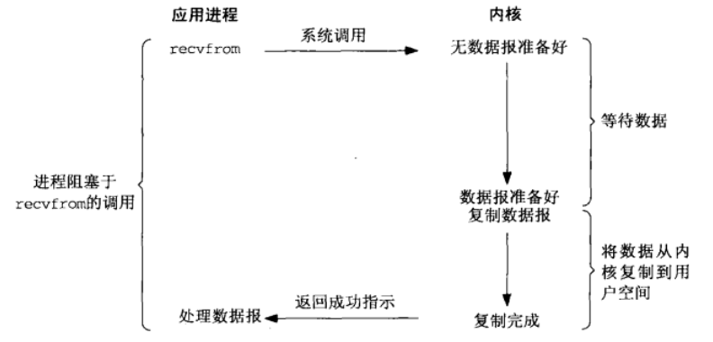
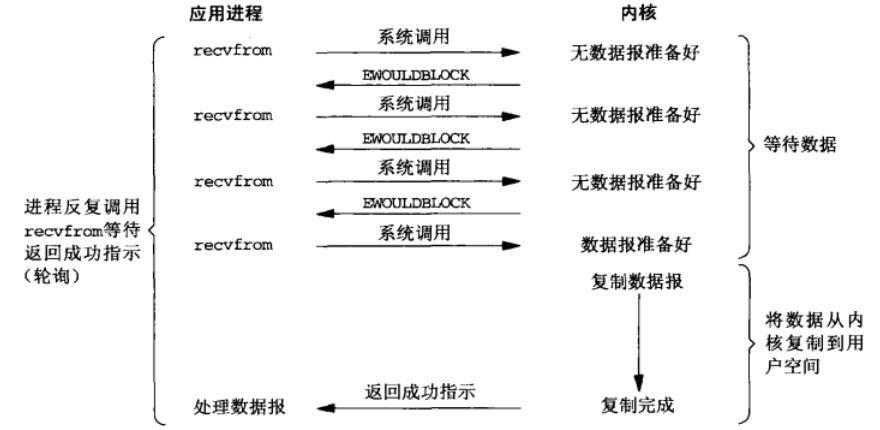
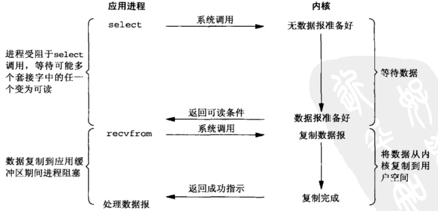
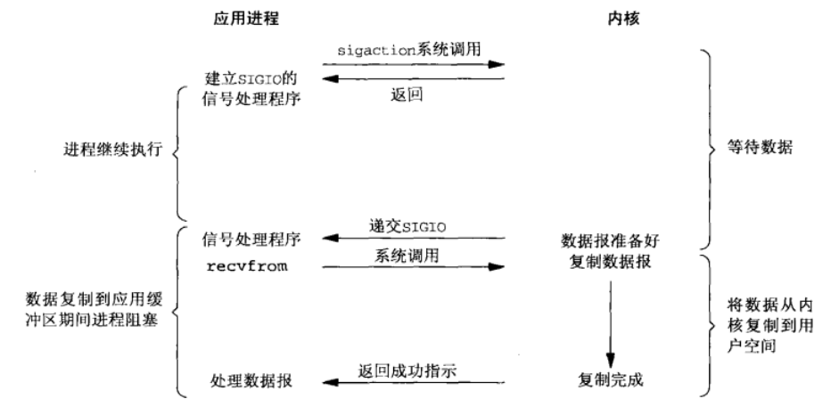
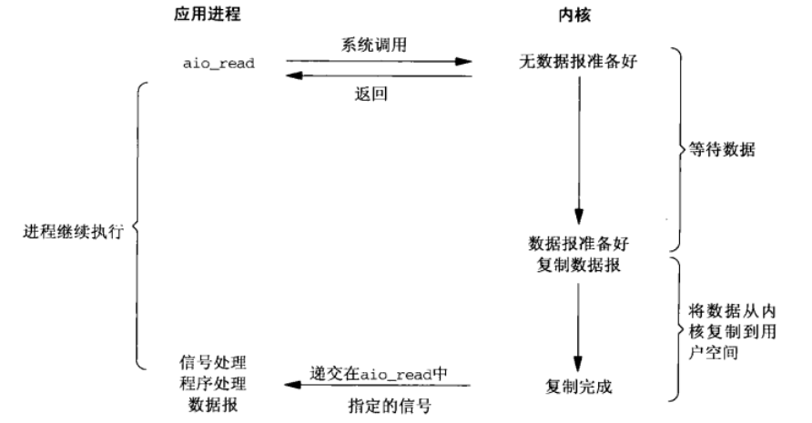
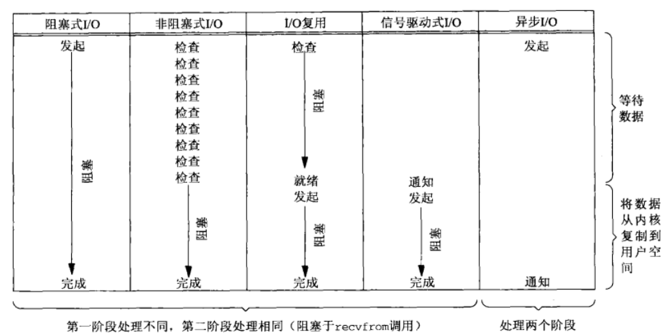

## Linux IO 模型详解

## 一、Linux I/O 模型简介

### 1.概述

假如 TCP 客户同时处理两个输入：标准输入和 TCP 套接字。我们遇到的问题是就在客户阻塞于（标准输入上的）fgets 调用期间，这时如果服务器进程被关闭，服务器 TCP 虽然正确地给客户 TCP 发送了一个 FIN，但是既然客户进程正阻塞于从标准输入读入的过程，它将看不到这个 EOF，直到从套接字读时为止（可能已过了很长时间）。

在这种情况下，进程就需要一种预先告知内核的能力，**使得内核一旦发现进程指定的一个或多个 I/O 条件就绪 (也就是说输入已准备好被读取，或者描述符已能承接更多的输出)，它就通知进程。这个能力称为 I/O 复用 (I/O multiplexing)**，是由 select 和 poll 这两个函数支持的。

I/O 复用典型使用在下列网络应用场合。

- 当客户处理多个描述符（通常是交互式输入和网络套接字）时，必须使用 I/O 复用。这是我们早先讲述过的场合。
- 一个客户同时处理多个套接字是可能的（使用 select、poll、epoll 函数）。
- 如果一个 TCP 服务器既要处理监听套接字，又要处理已连接套接字，一般就要使用/O 复用。
- 如果一个服务器即要处理 TCP，又要处理 UDP，一般就要使用 I/O 复用。
- 如果一个服务器要处理多个服务或者多个协议，一般就要使用 I/O 复用。

I/O 复用并非只限于网络编程，许多重要的应用程序也需要使用这项技术。

### 2.内核空间与用户空间

现在操作系统都是采用虚拟存储器，那么对 32 位操作系统而言，它的寻址空间（虚拟存储空间）为4G（2 的 32 次方）。操作系统的核心是内核，独立于普通的应用程序，可以访问受保护的内存空间，也有访问底层硬件设备的所有权限。

为了保证用户进程不能直接操作内核（kernel），保证内核的安全，操作系统将虚拟空间划分为两部分，一部分为内核空间，一部分为用户空间。针对 linux 操作系统而言，将最高的 1G 字节（从虚拟地址 0xC0000000 到 0xFFFFFFFF），供内核使用，称为内核空间，而将较低的 3G 字节（从虚拟地址 0x00000000 到 0xBFFFFFFF），供各个进程使用，称为用户空间。

### 3.进程的阻塞

正在执行的进程，由于期待的某些事件未发生，如请求系统资源失败、等待某种操作的完成、新数据尚未到达或无新工作做等，**则由系统自动执行阻塞原语 (Block)，使自己由运行状态变为阻塞状态**。可见，进程的阻塞是进程自身的一种主动行为，也因此**只有处于运行态的进程（获得 CPU），才可能将其转为阻塞状态。当进程进入阻塞状态，是不占用 CPU 资源的**。

### 4.文件描述符

文件描述符（File descriptor）是计算机科学中的一个术语，表示一个指向文件的引用。**文件描述符在形式上是一个非负整数。实际上，它是一个索引值，指向内核为每一个进程所维护的该进程打开文件的记录表**。当程序打开一个现有文件或者创建一个新文件时，内核向进程返回一个文件描述符。

### 5.缓存 IO

缓存 I/O 又被称作标准 I/O。在 Linux 的缓存 I/O 机制中，操作系统会将 I/O 的数据缓存在文件系统的页缓存（page cache）中，也就是说，**数据会先被拷贝到操作系统内核的缓冲区中，然后才会从操作系统内核的缓冲区拷贝到应用程序的地址空间**。因此缓存 I/O 的缺点是：数据在传输过程中需要在应用程序地址空间和内核进行多次数据拷贝操作，这些数据拷贝操作所带来的 CPU 以及内存开销是非常大的。

## 二、Linux 的五大 I/O 模型

刚才说了，对于一次 I/O 访问（以 read 举例），数据会先被拷贝到操作系统内核的缓冲区中，然后才会从操作系统内核的缓冲区拷贝到应用程序的地址空间。所以说，当一个 read 操作发生时，它会经历两个阶段：

1. 等待数据准备（等待数据从网络中到达，然后被拷贝到操作系统的内核缓冲区中）
2. 将数据从内核拷贝到进程中 

正是因为这两个阶段，Linux 系统产生了下面五种网络模式的方案：

- 阻塞 I/O（blocking IO）
- 非阻塞 I/O（nonblocking IO）
- I/O 多路复用（IO multiplexing）
- 信号驱动式 I/O（SIGIO）
- 异步 I/O（asynchronous IO）

### 1. 阻塞式 I/O

    

当用户进程调用了 recvfrom 这个系统调用（recvfrom 实际上是 UDP 的接收读取数据的函数，并且在这里被视为系统调用），kernel 就开始了 I/O 的第一个阶段：**准备数据（对于网络 I/O 来说，很多时候数据在一开始还没有到达。比如，还没有收到一个完整的 UDP 包。这个时候 kernel 就要等待足够的数据到来）**。这个过程需要等待，也就是说数据被拷贝到操作系统内核的缓冲区中是需要一个过程的。而在用户进程这边，整个进程会被阻塞。当 kernel 一直等到数据准备好了，它就会将数据从内核拷贝到用户内存，然后 kernel 返回结果，用户进程才解除 block 的状态，重新运行起来。

### 2. 非阻塞式 I/O

    

进程把一个套接字设置成非阻塞是在通知内核：**当所请求的 I/O 操作非得把本进程投入睡眠/阻塞才能完成时，不要把本进程投入睡眠，而是返回一个错误**。前三次调用 recvfrom 时没有数据可返回， 因此内核转而立即返回一个 EWOULDBLOCK 错误。第四次调用 recvfrom 时已有一个数据报准备好， 它被复制到应用进程缓冲区， 于是 recvfrom 成功返回，我们接着处理数据。**在数据从内核缓冲区拷贝到应用进程缓冲区时，非阻塞 I/O 也需要等待，或者说同步等待**。

当一个应用进程像这样对一个非阻塞描述符循环调用 recvfrom 时，我们称之为轮询(polling) 。应用进程持续轮询内核，以查看某个操作是否就绪。这么做往往耗费大量 CPU 时间，不过这种模型偶尔也会遇到，通常是在专门提供某一种功能的系统中才有。

所以，Nonblocking IO 的特点是用户程序中通过不断地自旋来检查数据，直到数据到达后才会跳出这种循环，所以这种写法仍然是一种同步模型。通过这个例子，**我们可以看出同步和阻塞并不等价，同步的意义只是说客户端发过来的数据到达之前，我干不了其他的事情。而阻塞强调的是调用一个函数，线程会不会休眠**。在上面的非阻塞模型里，虽然调用 recvfrom 不会再使线程休眠了，但程序并没有去执行什么有效的逻辑，所以这本质上仍然是一个同步模型。

### 3. I/O 复用模型

有了 I/O 复用 (I/O multiplexing)，我们就可以调用 select 或 poll，阻塞在这两个系统调用中的某一个之上，而不是阻塞在真正的 I/O 系统调用上。下图概括展示了 I/O 复用模型。

    

I/O multiplexing 就是我们说的 select，poll，epoll，有些地方也称这种 I/O 方式为 event driven I/O。select/epoll 的好处就在于单个进程/线程就可以同时处理多个网络连接的 I/O。它的基本原理就是 select，poll，epoll 这个 function 会不断的轮询所负责的所有 socket，当某个 socket 有数据到达了，就通知用户进程。

当用户进程调用了 select，那么整个进程会被 block，而同时，操作系统会"监视"所有 select 负责的 socket，当任何一个 socket 中的数据准备好了，select 就会返回。这个时候用户进程再调用 read 操作，将数据从内核拷贝到用户进程。

所以，**I/O 多路复用的特点是通过一种机制一个进程能同时等待多个文件描述符，而这些文件描述符（套接字描述符）其中的任意一个进入读就绪状态，select() 函数就可以返回**。这个图和 blocking I/O 的图其实并没有太大的不同，事实上，还更差一些。因为这里需要使用两个 system call (select 和 recvfrom)，而 blocking I/O 只调用了一个 system call (recvfrom)。但是，用 select 的优势在于它可以同时处理多个 connection。

所以，如果处理的连接数不是很高的话，使用 select/epoll 的 web server 不一定比使用multi-threading + blocking I/O 的 web server 性能更好，可能延迟还更大。**select/epoll的优势并不是对于单个连接能处理得更快，而是在于能处理更多的连接**。

### 4. 信号驱动式的 I/O 模型

    

我们也可以用信号，让内核在描述符就绪时发送 SIGIO 信号通知我们。我们称这种模型为信号驱动式 I/O（signal-driven I/O），上图是它的概要展示。

我们首先开启套接字的信号驱动式 I/O 功能，**并通过 sigaction 系统调用安装一个信号处理函数。该系统调用将立即返回，我们的进程继续工作，也就是说它没有被阻塞**。当数据报准备好读取时，内核就为该进程产生一个 SIGIO 信号。我们随后既可以在信号处理函数中调用 recvfrom 读取数据报，并通知主循环数据已准备好待处理。

**无论如何处理 SIGIO 信号，这种模型的优势在于等待数据报到达期间进程不被阻塞。主循环可以继续执行**，只要等待来自信号处理函数的通知。

### 5. 异步 I/O 模型

告知内核启动某个操作，并让内核在整个操作（包括将数据从内核复制到我们自己的缓冲区）完成后通知我们。这种模型与前一节介绍的信号驱动模型的主要区别在于：信号驱动式 I/O 是由内核通知我们何时可以启动一个 I/O 操作，而异步 I/O 模型是由内核通知我们 I/O 操作何时完成。

    

用户进程发起 read 操作之后，立刻就可以开始去做其它的事，不会阻塞。然后，当 kernel 接收到Asynchronous I/O 会等待数据准备完成，然后将数据拷贝到用户内存，当这一切都完成之后，kernel 会给用户进程发送一个 signal，告诉它 read 操作完成了。

### 6. 总结

#### 6.1 blocking 和 non-blocking 的区别

调用 blocking I/O 会一直 block 住对应的进程直到操作完成（阻塞住的进程不占用 CPU 资源），而 non-blocking I/O 在 kernel 还准备数据的情况下会立刻返回，进程需要轮询来判断数据是否准备好。

#### 6.2 synchronous I/O 和 asynchronous I/O 的区别

在说明 synchronous I/O 和 asynchronous I/O 的区别之前，需要先给出两者的定义。POSIX 的定义是这样子的：

- **A synchronous I/O operation causes the requesting process to be blocked until that I/O operation completes;**
- **An asynchronous I/O operation does not cause the requesting process to be blocked;**

两者的区别就在于 synchronous I/O 做 "I/O operation" 的时候会将 process 阻塞。按照这个定义，之前所述的 blocking I/O，non-blocking I/O，I/O multiplexing 都属于 synchronous I/O。

有人会说，non-blocking I/O 并没有被 block 啊。这里有个非常"狡猾"的地方，定义中所指的 "I/O operation" 是指真实的 I/O 操作，就是例子中的 recvfrom 这个 system call。Non-blocking I/O 在执行 recvfrom 这个 system call 的时候，如果 kernel 的数据没有准备好，这时候不会 block 进程。但是，当 kernel 中数据准备好的时候，recvfrom 会将数据从 kernel 拷贝到用户内存中，这个时候进程是被 block 了。**总结就是 blocking I/O，non-blocking I/O，I/O multiplexing 最后把数据从内核缓冲区中读到应用程序缓冲区中都是需要阻塞读取的，所以均为同步 I/O。**

而 asynchronous I/O 则不一样，当进程发起 I/O 操作之后，就直接返回再也不理睬了，直到kernel 发送一个信号，告诉进程说 I/O 完成。在这整个过程中，进程完全没有被 block。

五大 I/O 模型的比较图如下所示：

    

根据上述定义，**我们的前 4 种模型——阻塞式 I/O 模型、非阻塞式 I/O 模型、I/O 复用模型和信号驱动式 I/O 模型都是同步 I/O 模型， 因为其中真正的 I/O 操作 (recvfrom) 将阻塞进程**。只有异步 I/O 模型与 POSIX 定义的异步 I/O 相匹配。