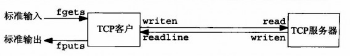
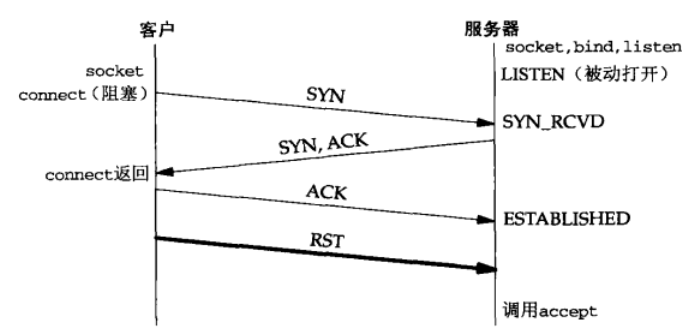
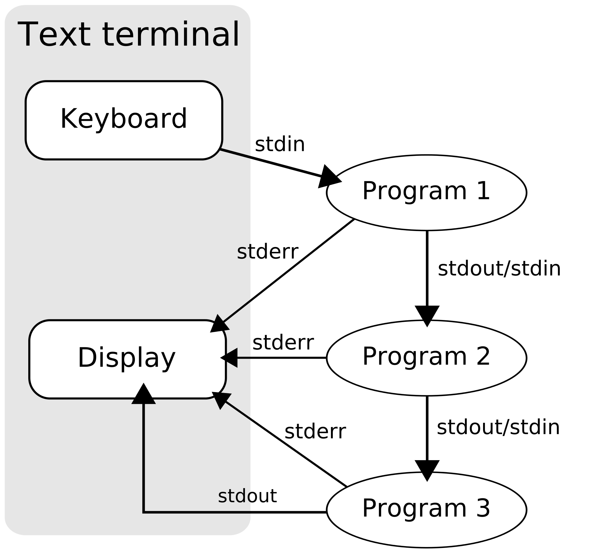
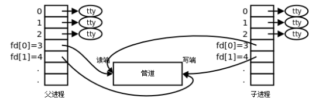

# 服务器编程示例与难点

## 一、简介

我们将在本章使用 socket 的基本函数编写一个完整的 TCP 客户/服务器程序示例。这个简单的例子是执行如下步骤的一个回射服务器（Echo Server）：

（1）客户从标准输入读入一行文本，并写给服务器；
（2）服务器从网络输入读入这行文本，并回射给客户；
（3）客户从网络输入读入这行回射文本，并显示在标准输出上。

其结构如下图所示：

<div align="center">
    
</div>

实现任何客户/服务器网络应用所需的所有基本步骤都可以通过 Echo Server 阐明，如果想要把这个例子扩充成其他的应用程度，只需要修改服务器对来自客户的输入处理过程。

### 1. TCP 回射服务器程序：main 函数

```c{.line-numbers}
int main(int argc, char **argv){
    int listenfd, connfd;
    pid_t childpid;
    socklen_t clilen;
    struct sockaddr_in cliaddr, servaddr;
    // Returns a file descriptor for the new socket, or -1 for errors.
    listenfd = Socket(AF_INET, SOCK_STREAM, 0);
    if (listenfd==-1){
        exit(0);
    }
    bzero(&servaddr, sizeof(servaddr));

    // 设置服务协议为 IPv4
    servaddr.sin_family = AF_INET;
    servaddr.sin_addr.s_addr= htonl(INADDR_ANY);
    servaddr.sin_port = htons(SERV_PORT);
    Bind(listenfd, (SA *) &servaddr, sizeof (servaddr));
    Listen(listenfd, LISTENQ);

    for(;;){
        clilen = sizeof(cliaddr);

        // 获取已连接连接队列(已完成三次握手的连接)获取队头的连接,如果已连接链接队列为空,程序进入睡眠(如果监听套接字为默认阻塞方式)
         connfd = Accept(listenfd, (SA *) &cliaddr, &clilen);
        if (connfd<0){
            // 因为在子进程发送信号,在处理信号函数返回时可能会出现系统中断,所以在这检测重启
            if (errno==EINTR){  
                continue;
            } else{
                err_sys("serv: accept failed");
            }
        }
        if ((childpid=Fork()) == 0) { 
            Close(listenfd);
            // 如果是子进程,执行业务函数
            str_echo(connfd);
            // 关闭描述符,其实不关闭也可以,因为exit函数本身在内核中会将全部描述符关掉
            Close(connfd);

            // 关闭进程
            exit(0);
        }
        Close(connfd);
    }
}
```

在第 15 行，创建一个 TCP 套接字。在待捆绑到该 TCP 套接字的网际网套接字地址结构中填入通配地址（INADDR_ANY），捆绑通配地址是在告知系统:要是系统是多网卡的主机，我们将接受目的地址为任何本地接口的连接。

第 33 行，**判断是父进程还是子进程，如果是父进程，此处为子进程的 pid；如果是子进程，此处为 0**。fork 函数会返回两次，一次在父进程中，一次在子进程中。fork 有两种用法：一种是创建一个父进程的副本进程，进行某些操作；一种是在创建一个副本进程(子进程)后，在子进程中执行 exec 函数，这样这个子进程映像就会被替换为被 exec 的程序文件，而且新的程序通常从 main 函数执行

fork 为每个客户派生一个处理它们的子进程。并且子进程关闭监听套接字（进程之间的地址空间完全独立，子进程的 listenfd 和父进程不一样，并且对子进程没有意义），**同理父进程关闭已连接套接字，然后父进程又会阻塞在 accept 函数上，等待下一次连接**。子进程接着调用 str_echo 处理客户。

### 2.TCP 回射服务器程序：str_echo 函数

```c{.line-numbers}
#include "unp.h"

void str_echo(int sockfd) {
    ssize_t n;
    char buf[MAXLINE];

again:
    while((n = read(sockfd, buf, MAXLINE)) > 0) {
        Writen(sockfd, buf, n);
    }
    if (n < 0 && errno == EINTR)
        goto again;
    else if (n < 0)
        err_sys("str_echo: read error");
}
```

read 函数从套接字读入数据，writen 函数把其中内容回射给客户。**如果客户关闭连接（这是正常情况），那么接收到客户的 FIN 将导致服务器子进程的 read 函数返回 0**，这又导致 str_echo 函数的返回，从而终止子进程。

在第 11 行，当 n < 0 且 errno == EINTER 时，说明操作被中断，可以 goto again 继续读取。
**如果 sockfd 被设置为非阻塞，那么 read 函数的返回值小于 0 时，还有 EWOULDBLOCK 和 EAGAIN 这两个 error，表示现在 socket 的接收缓冲区中还没有数据，需要等待重试（EWOULDBLOCK = EAGAIN）**。 但是当 sockfd 默认为阻塞时，不会出现 EWOULDBLOCK 和 EAGAIN，因此 n < 0 说明可能出现了其它错误（比如 BrokenPipe error 或者 connection reset by peer）

### 3.TCP 回射客户程序：main 函数

```c{.line-numbers}
#include "unp. h"
int main(int argc, char **argv){
    int sockfd;
    struct sockaddr_in servaddr;
    if (argc != 2)
        err__quit ("usage: tcpcli <IPaddress>");
    
    sockfd =Socket (AF_INET, SOCK_STREAM, 0);
    bzero (&servaddr, sizeof (servaddr));
    servaddr. sin_family = AF_INET;
    servaddr. sin_port = htons (SERV_PORT);
    Inet_pton (AF_INET, argv[1], &servaddr. sin_addr);
    Connect (sockfd, (SA *) &servaddr, sizeof (servaddr));
    /* do it all*/
    str_cli (stdin, sockfd);
    exit (0);
}
```

connect 建立与服务器的连接。str_cli 函数完成剩余部分的客户处理工作。

### 4.TCP 回射客户程序：str_cli 函数

```c{.line-numbers}
#include "unp. h"

void str_cli (FILE *fp, int sockfd) {
    char sendline[MAXLINE], recvline[MAXLINE];
    while (Fgets(sendline, MAXLINE, fp)!= NULL) {
        Writen(sockfd, sendline, strlen(sendline));
        if (Readline(sockfd, recvline, MAXLINE) == 0) 
            err_quit("str_cli: server terminated prematurely");
        Fputs(recvline, stdout);
    }
}
```

对于第 5 行，当遇到文件结束符或错误时，fgets 将返回一个空指针，于是客户处理循环终止。然后阻塞在 Readline 函数中，等待 echo server 返回的数据，然后通过 fputs 显示在控制台上。如果与服务器的连接关闭了，那么服务器会发送 EOF 给客户端，Readline 会直接返回 0，打印出 `str_cli: server terminated prematurely`。

## 二、正常启动

服务器启动后，它调用 socket、bind、listen 和 accept，并阻塞于 accept 调用。（我们还没有启动客户）。在启动客户之前，我们运行 netstat 程序来检查服务器监听套接字的状态。

```shell
linux % netstat -a
Active Internet connections (servers and established) 
Proto Recv-Q    Send-Q     Local Address   Foreign Address     State 
tcp   0             0           *:9877           *:*           LISTEN
```

这个输出正是我们所期望的：有一个套接字处于 LISTEN 状态，它有通配的本地 IP 地址，本地端口为 9877。netstat 用星号 * 来表示一个为 0 的 IP 地址（INADDR_ANY，通配地址）或为 0 的端口号。

我们接着在同一个主机上启动客户，并指定服务器主机的 P 地址为 127.0.0.1（环回地址）：

```shell
linux % tcpcli01 127.0.0.1
```

客户调用 socket 和 connect，后者引起 TCP 的三路握手过程。当三路握手完成后，客户中的 connect 和服务器中的 accept 均返回，连接于是建立。接着发生的步骤如下：

1. 客户调用 str_cli 函数，该函数将阻塞于 fgets 调用，因为我们还未曾键入过一行文本。
2. 当服务器中的 accept 返回时，服务器调用 fork，再由子进程调用 str_echo。该函数调用 readline，readline 调用 read,而 read 在等待客户送入一行文本期间阻塞。
3. 另一方面，服务器父进程再次调用 accept 并阻塞，等待下一个客户连接。

至此，我们有 3 个都在睡眠（即已阻塞）的进程：客户进程、服务器父进程和服务器子进程。使用 netstat 给出的输出如下：

```shell
linux % netstat -a
Active Internet connections (servers and established) 
Proto Recv-Q  Send-Q    Local Address       Foreign Address     State 
tcp     0      0        localhost:9877      localhost:42758   ESTABLISHED 
tcp     0      0        localhost:42758     localhost:9877    ESTABLISHED 
tcp     0      0        *：9877                *:*               LISTEN
```

## 三、正常终止

至此连接已经建立，不论我们在客户的标准输入中键入什么，都会回射到它的标准输出中。

```shell
linux % tcpcli01 127.0.0.1    我们已经给出过本行 
hello world                   现在键入这一行 
hello, world                  这一行被回射回来 
good bye 
good bye
^D                           <CtrH+D> 是我们的终端 EOF 字符
```

我们键入两行，每行都得到回射，我们接着键入终端 EOF 字符 ( Control-D) 以终止客户。接下来我们可以总结出正常终止客户和服务器的步骤：

1. 当我们键入 EOF 字符时，fgets 返回一个空指针，于是 str_cli 函数返回。
2. 当 str_cli 返回到客户的 main 函数时，main 通过调用 exit 终止。
3. 进程终止处理的部分工作是关闭所有打开的描述符，因此客户打开的套接字由内核关闭。这导致客户 TCP 发送一个 FIN 给服务器，服务器 TCP 则以 ACK 响应，这就是 TCP 连接终止序列的前半部分。至此，服务器套接字处于 CLOSE_WAIT 状态，客户套接字则处于 FIN_WAIT2 状态。
4. 当服务器 TCP 接收 FIN 时，服务器子进程阻塞于 readline 调用，于是 readline 返回 0。这导致 str_echo 函数返回服务器子进程的 main 函数。
5. 服务器子进程通过调用 exit 来终止。
6. 服务器子进程中打开的所有描述符随之关闭。由子进程来关闭已连接套接字会引发 TCP 连接终止序列的最后两个分节：一个从服务器到客户的 FIN 和一个从客户到服务器的 ACK。至此，连接完全终止，客户套接字进入 TIME_WAIT 状态。
7. 进程终止处理的另一部分内容是：在服务器子进程终止时，给父进程发送一个 SIGCHLD 信号。这一点在本例中发生了，但是我们没有在代码中捕获该信号，而该信号的默认行为是被忽略。既然父进程未加处理，子进程于是进入僵死状态。

## 四、客户端与服务器异常情况

### 1.accept 返回前连接中止

这里，三路握手完成从而连接建立之后，客户 TCP 却发送了一个 RST（复位）。**在服务器端看来，就在该连接已由 TCP 排队，等着服务器进程调用 accept 的时候 RST 到达。稍后，服务器进程调用 accept**。

模拟这种情形的一个简单方法就是：启动服务器，让它调用 socket、bind 和 listen，然后在调用 accept 之前睡眠一小段时间。在服务器进程睡眠时，启动客户，让它调用 socket 和 connect。一旦 connect 返回，就设置 SO＿LINGER 套接字选项以产生这个 RST，然后终止。

<div align="center">
    
</div>

但是，如何处理这种中止的连接依赖于不同的实现。源自 Berkeley 的实现完全在内核中处理中止的连接，服务器进程根本看不到。然而大多数 SVR4 实现返回一个错误给服务器进程，作为 accept 的返回结果，不过错误本身取决于实现。这些 SVR4 实现返回一个 EPROTO（“protocol error”，协议错误）errno 值。

而 POSIX 指出返回的 **errno 值必须是 ECONNABORTED（"software caused connection abort"，软件引起的连接中止）**。POSIX 作出修改的理由在于：流子系统（streams subsystem）中发生某些致命的协议相关事件时，也会返回 EPROTO。要是对于由客户引起的一个已建立连接的非致命中止也返回同样的错误，那么服务器就不知道该再次调用 accept 还是不该了。换成 ECONNABORTED 错误，服务器就可以忽略它，再次调用 accept 就行。

accept(2) man page 写道 `[ECONNABORTED] A connection arrived, but it was closed while waiting on the listen queue.`，即连接已到达，但在等待侦听队列时已关闭。

### 2.服务器进程终止/崩溃

现在启动我们的客户/服务器对，然后杀死服务器子进程。这是在模拟服务器进程崩溃的情形，我们可从中查看客户将发生什么。**(我们必须小心区别即将讨论的服务器进程崩溃与将在之后讨论的服务器主机崩溃)** 所发生的步骤如下所述：

1. 我们在同一个主机上启动服务器和客户，并在客户上键入一行文本，以验证一切正常。正常情况下该行文本由服务器子进程回射给客户。
2. 找到服务器子进程的进程 ID，并执行 kill 命令杀死它。作为进程终止处理的部分工作，服务器子进程中所有打开着的描述符都被关闭。这就导致向客户发送一个 FIN，而客户 TCP 则响应以一个 ACK。这就是 TCP 连接终止工作的前半部分。
3. SIGCHLD 信号被发送给服务器父进程，并得到正确处理。
4. 客户上没有发生任何特殊之事。客户 TCP 接收来自服务器 TCP 的 FIN 并响应以一个 ACK，然而问题是客户进程阻塞在 fgets 调用上，等待从终端接收一行文本，无法对 FIN 进行响应，及时关闭掉连接。
5. 此时，在另外一个窗口上运行 netstat 命令，以观察套接字的状态。

```shell
linux % netstat -a | grep 9877
tcp     0   0   *：9877          *:*                LISTEN
tcp     0   0   localhost:9877  localhost:43604     FIN_WAIT2
tcp     1   0   localhost:43604 localhost:9877      CLOSE_WAIT
```

6. 我们可以在客户上再键入一行文本。以下是从第一步开始发生在客户之事：

```shell
linux % tcpcli01 127.0.0.1              启动客户
hello                                   键入第一行文本
hello                                   它被正确回射
                                        在这儿杀死服务器子进程
another line                            然后键入下一行文本
str_cli: server terminated prematurely
```

当我们键入 "another line" 时，str_cli 调用 writen，客户 TCP 接着把数据发送给服务器。
TCP 允许这么做，因为客户 TCP 接收到 FIN 只是表示服务器进程已关闭了连接的服务器端，从而不再往其中发送任何数据而己。FIN 的接收并没有告知客户 TCP 服务器进程已经终止（虽然在本例子中它确实是终止了）。当服务器 TCP 接收到来自客户的数据时，既然先前打开那个套接字的进程已经终止，于是响应以一个 RST。

7. 然而客户进程看不到这个 RST，因为它在调用 writen 后立即调用 read1line，并且由于第 2 步中接收的 FIN，所调用的 readline 立即返回 0（表示 EOF）。我们的客户端此时收到 EOF，于是以出错信息 "server terminated prematurely"（服务器过早终止）退出。
8. 当客户终止时，它所有打开着的描述符都被关闭

我们的上述讨论还取决于本例子的时序，客户调用 readline 既可能发生在服务器的 RST 被客户收到之前，也可能发生在收到之后。**如果 readline 发生在收到 RST 之前（如本例子所示），那么结果是客户得到一个未预期的 EOF；否则结果是由 readline：返回一个 ECONNRESET ("connection reset by peer"，对方复位连接错误)**，表示服务端的进程被终止。

本例子的问题在于：**当 FIN 到达套接字时，客户正阻塞在 fgets 调用上，无法及时对 FIN 报文进行响应，关闭掉客户端连接，导致后续又向服务端发送报文，导致服务器发送 RST 重置为报文**。

客户实际上在应对两个描述符-套接字和用户输入，它不能单纯阻塞在这两个源中某个特定源的输入上（正如目前编写的 str_cli 函数所为），而是应该阻塞在其中任何一个源的输入上。事实上这正是 select 和 po11 这两个函数的目的之一，我们可以使用 I/O 多路复用函数重新编写 str_cli 函数之后，一旦杀死服务器子进程，客户就会立即被告知已收到 FIN。

### 3.SIGPIPE 信号

要是客户不理会 readline 函数返回的错误，反而写入更多的数据到服务器上，那又会发生什么呢？这种情况是可能发生的，举例来说，客户可能在读回任何数据之前执行两次针对服务器的写操作，而 RST 是由其中第一次写操作引发的。

适用于此的规则是：**当一个进程向某个已收到 RST 的套接字执行写操作时，内核向该进程发送一个 SIGPIPE 信号。该信号的默认行为是终止进程，因此进程必须捕获它以免不情愿地被终止**。

不论该进程是捕获了该信号并从其信号处理函数返回，还是简单地忽略该信号，**写操作都将返回 EPIPE 错误**。一个在 Usenet 上经常问及的问题 ( frequently asked question, FAQ) 是如何在第一次写操作时而不是在第二次写操作时捕获该信号。这是不可能的。遵照上述讨论，第一次写操作引发 RST，第二次写引发 SIGPIPE 信号。**写一个已接收了 FIN 的套接字不成问题，但是写一个已接收了 RST 的套接宇则是一个错误**。

接下来介绍一下如何处理 SIGPIPE 信号，处理 SIGPIPE 的建议方法取决于它发生时应用进程想做什么。如果没有特殊的事情要做，那么将信号处理办法直接设置为 SIG_IGN，并假设后续的输出操作将捕捉 EPIPE 错误并终止。如下所示：

```c
int main()
{
    signal(SIGPIPE, SIG_IGN);  // 忽略 SIGPIPE 信号
    // ...
}
```

如果信号出现时需采取特殊措施（可能需在日志文件中登记），那么就必须捕获该信号，以便在信号处理函数中执行所有期望的动作。**但是必须意识到，如果使用了多个套接字，该信号的递交无法告诉我们是哪个套接字出的错**。

### 4.服务器主机崩溃

我们来看看**当服务器主机崩溃**或者**当客户端发送数据时服务器主机不可达的情形（即建立连接后某些中间路由器不工作）**。为了模拟这种情况，我们可以先启动服务器，再启动客户，接着在客户上键入一行文本来确认连接正常工作，然后从网络上断开服务器主机，这也模拟了我们所说的第二种情况，即主机因为网络不可达。**在这两种情况下，服务器不会对客户端的请求作出任何响应（不会发送 FIN 报文，ACK 以及其它响应），可以归为一类**。

步骤如下：

- 当服务器主机崩溃时，来不及在连接上发出 FIN 报文。这里我们假设的是主机崩溃，而不是由操作员执行命令关机
- 我们在客户上键入一行文本，它由 writen 写入内核，再由客户 TCP 作为一个数据分节送出。客户随后阻塞于 readline 调用，等待回射的应答。
- 如果我们用 tcpdump 观察网络就会发现，客户 TCP 持续重传数据分节，试图从服务器上接收一个 ACK。源自 Berkeley 的实现重传该数据分节 12 次，共等待约 9 分钟才放弃重传。当客户 TCP 最后终于放弃时 (假设在这段时间内，服务器主机没有重新启动，或者如果是服务器主机未崩溃但是从网络上不可达，那么假设主机仍然不可达) ，给客户进程返回一个错误。
  - **假设服务器主机已崩溃，从而对客户的数据根本没有响应，那么所返回的错误 ETIMEDOUT**。
  - **假设某个中间路由器判定服务器主机已不可达，从而响应以一个 "destination unreachable"(目的地不可达) ICMP 消息， 那么所返回的错误是 EHOSTUNREACH 或 ENETUNREACH**。

### 5.服务器主机崩溃后重启

前一节中，当我们发送数据时，服务器主机仍然处于崩溃状态，在这一节中，在客户端发送数据前，虽然服务器之前已经崩溃了，但是现在已经重启。我们模拟这种情况最简单的办法就是：**客户端与服务器端先建立连接，再从网络上断开服务器主机，将它关机后再重新启动，最后把它重新连接到网络中**。

在模拟时，先断开网络，再对服务器关机，服务器不会给客户端发送一个 FIN 报文，这样客户端就不会知道服务器已经被关闭了。所发生的步骤如下所示：

1. 我们启动服务器和客户，并在客户键入一行文本以确认连接已经建立
2. 服务器之前主机崩溃，但是现在被重启
3. 在客户上键入一行文本，它将作为一个 TCP 数据分节发送到服务器主机
4. 当服务器主机崩溃后重启时，**它的 TCP 丢失了崩溃前的所有连接信息，因此服务器 TCP 对于所收到的来自客户的数据分节响应以一个 RST**
5. 当客户 TCP 收到该 RST 时，客户正阻塞于 readline 调用，导致该调用返回 ECONNRESET 错误

### 6.服务器主机关机

Unix 系统关机时，init 进程通常先给所有进程发送 SIGTERM 信号（该信号可被捕获），等待一段固定的时间（往往在 5 到 20 秒之间），然后给所有仍在运行的进程发送 SIGKILL 信号（该信号不能被捕获）。这么做留给所有运行的进程一小段时间来清除和终止。

如果我们不捕获 SIGTERM 信号并终止，我们的服务器将由 SIGKILL 信号终止。当服务器子进程终止时，它的所有打开着的描述符都被关闭，随后发生的步骤与**服务器进程终止/崩溃**中讨论过的一样。正如那一节所述，**我们必须在客户中使用 select 或 poll 函数，使得服务器进程的终止一经发生，客户就能检测到**。

### 7.总结

- 服务器 accept 前，客户端与服务器端的连接被关闭，这时服务器端会抛出 __`ECONNABORTED`__，此 errno 可以直接被忽略，服务器端再次调用 accept 函数即可
- 服务器端进程终止/崩溃，或者服务器被关机时，服务器中对应被关闭的套接字会发送 FIN 报文给客户端，客户端接收到 FIN 报文后（read 函数返回 0），可以继续向服务端发送数据，第一次发送，服务端会响应 RST 报文，客户端可能会产生 __`ECONNRESET`__ 错误；第二次发送，客户端内核可能直接产生 __`SIGPIPE`__ 错误。
- 服务器崩溃、崩溃后重启或者网络不可达时，对应套接字不会发送 FIN 报文（或者发送但是客户端接收不到），客户端不知道服务器已经崩溃，客户端向服务器发送消息然后调用阻塞在 read 函数上读取响应，这时会有以下 3 种情况：
    - 如果是因为服务器已经崩溃，对客户端没有任何响应，则产生 __`ETIMEDOUT`__ 错误；
    - 如果因为网络不可达，中间路由器向客户端产生目标不可达的 ICMP 报文，那么产生 __`ENETUNREACH`__ 或者 __`EHOSTUNREACH`__ 错误；
    - 如果服务器崩溃后重启之后，客户端向其发送数据，服务器会返回 RST 响应给客户端，产生 __`ECONNRESET`__ 错误；

## 五、实例分析

### 1.SIGPIPE 信号讲解

#### 1.1 进程间通信

在计算机科学中，进程间通信 (IPC) 特指操作系统提供的允许进程共享数据的机制。进程间通信有多种方式，比如文件、信号、管道、共享内存和 Socket 等。这篇文章涉及到的进程间通信方式主要有信号，管道和 Socket 三种。

#### 1.2 信号（Signal）

信号就是向一个进程或同一进程中的特定线程发送的异步通知，以通知它一个事件。大多数信号可以被忽略、阻止或处理（通过指定的代码），SIGSTOP（暂停）和 SIGKILL（立即终止）是两个例外。__信号常量是有整数值的，比如 SIGKILL 的整数值为 9__。下面介绍常用的信号：

- SIGINT：__当用户按下了<Ctrl+C>组合键时__，用户终端向正在运行中的由该终端启动的程序发出此信号。默认动作为终止进程。
- SIGQUIT：__当用户按下<ctrl+\\>组合键时产生该信号__，用户终端向正在运行中的由该终端启动的程序发出些信号。默认动作为终止进程。
- SIGKILL：无条件终止进程。__本信号不能被忽略，处理和阻塞__。默认动作为终止进程。它向系统管理员提供了可以杀死任何进程的方法。
- SIGTERM：程序结束信号，与 SIGKILL 不同的是，__该信号可以被阻塞和终止__。通常用来要示程序正常退出。执行 shell 命令 Kill 时，缺省产生这个信号。默认动作为终止进程。
- SIGSTOP：停止进程的执行。__信号不能被忽略，处理和阻塞__。默认动作为暂停进程。

再比如我们经常用 kill 系统函数来向指定进程发送信号：

```c
int kill(pid_t pid, int signum); /* declaration */
```

kill 命令的第二个参数就是一个标准的信号，如 SIGTERM 或 SIGKILL。当然也可以指定其他信号，比如 SIGUSR1 和 SIGUSR2，**这两个信号被用来告诉进程有一个用户定义的事件发生了，具体做什么取决于进程如何处理发送过来的信号，不一定是杀掉进程**，比如在 MongoDB 中，运行下边的命令就是告诉 MongoDB 该进行 log rotation 了。

```shell
kill -SIGUSR1 MONGODPID
```

当信号发出时，操作系统会中断目标进程的正常执行流程进而完成信号传递。进程可以在任何非原子指令期间被中断，如果进程之前已经注册了一个对这个信号的处理程序，则执行该程序，否则就执行默认的信号处理程序。

信号处理程序可以通过 signal(2) 或 sigaction(2) 这两个系统调用来设置，现在 sigaction()函数取代了 signal() 函数，应优先使用。在设置信号处理程序的时候还可以用这两个特殊的值：

- __SIG_IGN: 忽略信号（ignore）__
- __SIG_DFL: 和使用默认信号处理程序（default）__

#### 1.3 管道（Pipe）

管道是基于消息传递实现的，将一组进程的标准流链在一起，这样每个进程的输出（stdout）直接作为输入（stdin）传递给下一个进程。它们是并发执行的，也就是说后边的进程可以在前一个进程running 的时候被启动，直观来说：

```shell
process1 | process2 | process3
```

我们经常用到管道，比如要列出当前目录下的文件(ls)，只保留 ls 输出中包含字符串 "key" 的行(grep)，并在滚动页面中查看结果 (less)：

<div align="center">
    
</div>

```shell
ls -l | grep key | less
```

#### 1.4 SIGPIPE 信号

说了这么多前置知识，我们现在来看看本文的主角—— SIGPIPE 信号：

> The SIGPIPE signal is sent to a process when it attempts to write to a pipe without a process connected to the other end.

当一个进程试图向一个管道写入时，如果没有一个进程连接到另一端，则会向该尝试写入的进程发送 SIGPIPE 信号。__也就是说当一个进程试图向一个读端已经关闭的管道写入时，就会收到这个信号__，而收到这个信号的默认操作是终止进程。

假设有一个管道：

```shell
process1 | process2
```

如果 process2 已经死掉了，理应通知 process1 一下，不能让他在那一直做无用功，至于收到信号process1 怎么处理就是它自己的事了。举个例子：

```shell
yes | head -n 1
```

yes 命令的作用是将无限的 "y" 序列写入 STDOUT，而 head 则将其从管道的另一端读为 STDIN。head 读取第一行，然后退出，只要 head 终止，管道的接收端就关闭了。因此，Linux 内核会向 yes 进程发送 SIGPIPE 信号，表示没有 reader 了，然后 yes 进程就会终止。

不只是对于管道，Socket 也有这个机制：

> When a process writes to a socket that has received an RST, the SIGPIPE signal is sent to the process. The default action of this signal is to terminate the process, so the process must catch the signal to avoid being involuntarily terminated.

如果向一个收到 RST 的 Socket 继续发送数据，则会收到 SIGPIPE 信号。

先来回忆一下 RST 数据包，当一个意外的 TCP 数据包到达主机时，该主机通常会通过在同一连接上发送一个 RST 数据包来进行响应。RST 数据包就是一个没有有效载荷，并且在 TCP 头标志中设置了RST位的数据包。常见的意外的 TCP 数据包有：

- __SYN 数据包，试图建立连接到一个没有进程监听的服务器端口__
- 数据包到达之前建立的 TCP 连接上，但本地应用程序已经关闭了它的套接字或退出，操作系统关闭了套接字

### 2.管道的 SIGPIPE

#### 2.1 管道的读端全部关闭

如果所有指向管道读端的文件描述符都关闭了（管道读端引用计数为 0），这时有进程向管道的写端 write，那么该进程会收到信号 SIGPIPE，通常会导致进程异常终止。当然也可以对 SIGPIPE 信号实施捕捉，不终止进程。具体代码如下所示：

```c{.line-numbers}
int main() {
    int ret;
    int fd[2];
    pid_t pid;

    char *str = "hello pipe\n";
    char buf[1024];

    ret = pipe(fd);
    if (ret == -1) {
        perror("pipe error");
        exit(1);
    }

    pid = fork();
    if (pid > 0) {
        // 关闭父进程管道的读端 fd[0]
        close(fd[0]);
        sleep(3);
        write(fd[1], str, strlen(str));
        if (errno == EPIPE) {
            printf("epipe\n");
        }
        close(fd[1]);
    } else if (pid == 0){
        // 关闭子进程管道的读端 fd[0]
        close(fd[0]);
    }

    return 0;
}
```

当父进程 fork 出子进程时，父子进程与管道读写端的描述符如下所示：

<div align="center">
    
</div>

当使用 close 关闭管道的读端时，只有当管道的读端引用计数为 0 时，才会真正关闭读端的描述符，因此需要同时关闭父子进程的读端描述符。这时，父进程继续往管道中写时，会产生 SIGPIPE 信号，如下所示：

```c
/home/xuweilin/CLionProjects/linux_programming/cmake-build-debug/linux_programming

Process finished with exit code 141 (interrupted by signal 13: SIGPIPE)
```

#### 2.2 管道的写端全部关闭

```c{.line-numbers}
int main() {
    int ret;
    int fd[2];
    pid_t pid;

    char *str = "hello pipe\n";
    char buf[1024];

    ret = pipe(fd);
    if (ret == -1) {
        perror("pipe error");
        exit(1);
    }

    pid = fork();
    if (pid > 0) {
        // 关闭管道的写端 fd[1]
        close(fd[1]);
        sleep(3);
        write(fd[1], str, strlen(str));
        close(fd[0]);
    } else if (pid == 0){
        // 关闭管道的写端 fd[1]
        close(fd[1]);
        ret = read(fd[0], buf, sizeof(buf));
        write(STDOUT_FILENO, buf, ret);
        close(fd[0]);
    }

    return 0;
}
```

当我们把父子进程管道的写端描述符都关闭时，父进程向写端发送数据时，不会报错，直接向后执行。而当子进程执行 read 操作时，由于写端的描述符均被关闭，这时 read 直接返回 0（类似于读到文件结尾），ret = 0，因此控制台上不会显示字符串。如下所示：

```shell
/home/xuweilin/CLionProjects/linux_programming/cmake-build-debug/linux_programming

Process finished with exit code 0
```

总结管道的读写会发生的情况：

读管道：
1. 管道中有数据，read 返回实际读到的字节数。
2. 管道中无数据：
(1) **管道写端被全部关闭，read 返回 0 (好像读到文件结尾)**
(2) 写端没有全部被关闭，read 阻塞等待 (不久的将来可能有数据递达，此时会让出 CPU)

写管道：
1. **管道读端全部被关闭， 进程异常终止 (也可使用捕捉 SIGPIPE 信号，使进程不终止)**
2. 管道读端没有全部关闭：
(1) 管道已满，write 阻塞。
(2) 管道未满，write 将数据写入，并返回实际写入的字节数。

### 3.Socket 的 SIGPIPE

#### 3.1 Socket 中两次 write 产生 SIGPIPE 信号

我们使用以下的 client.c 和 server.c 代码来模拟出现 SIGPIPE 的情况。服务器端的代码如下所示，服务端通过 read(fd) 读取 socket 获取客户端数据，然后将小写转换为大写 toupper()，然后发送给客户端。

```c{.line-numbers}
// server.c
int main() {

    int lfd = 0, cfd = 0;

    struct sockaddr_in serv_addr, clit_addr;
    socklen_t clit_addr_len;
    char buf[BUFSIZ], client_ip[1024];
    serv_addr.sin_family = AF_INET;
    serv_addr.sin_port = htons(SERV_PORT);
    serv_addr.sin_addr.s_addr = htonl(INADDR_ANY);

    lfd = socket(AF_INET, SOCK_STREAM, 0);
    if (lfd == -1) {
        sys_err("socket error");
    }

    bind(lfd, (struct sockaddr *) &serv_addr, sizeof(serv_addr));
    listen(lfd, 256);
    clit_addr_len = sizeof(clit_addr);
    cfd = accept(lfd, (struct sockaddr *) &clit_addr, &clit_addr_len);

    printf("client ip:%s, port:%d\n",
           inet_ntop(AF_INET, &clit_addr.sin_addr.s_addr, client_ip, sizeof(clit_addr)),
           ntohs(clit_addr.sin_port));

    if (cfd == -1) {
        sys_err("accept error");
    }

    while (1) {
        int ret = read(cfd, buf, sizeof(buf));
        if (ret < 0) {
            if (errno == ECONNRESET ){
                write(STDOUT_FILENO, 'reset\n', 6);
            }
        }
        write(STDOUT_FILENO, buf, ret);

        for(int i = 0; i < ret; i++) {
            buf[i] = toupper(buf[i]);
        }

        write(cfd, buf, ret);
        // 服务器睡眠 5s，等待客户端进程执行完毕后退出，客户端进程退出时，会发送 FIN 报文
        sleep(5);
    }

    close(lfd);
    close(cfd);

    return 0;

}
```

客户端的代码如下所示，向服务端发送 10 次 'hello' 字符串，然后进程退出，在代码中没有显式关闭 cfd 套接字描述符，但是客户端进程退出后，Init 进程会自动关闭客户端进程所属的所有描述符，描述符被关闭时，会发出 FIN 报文。

```c{.line-numbers}
// client.c
int main() {

    int cfd;
    int counter = 10;
    char buf[BUFSIZ];
    unsigned int ip = 0;

    // 服务器地址结构
    struct sockaddr_in serv_addr;
    serv_addr.sin_family = AF_INET;
    serv_addr.sin_port = htons(SERV_PORT);
    inet_pton(AF_INET, "127.0.0.1", &ip);
    serv_addr.sin_addr.s_addr = ip;

    cfd = socket(AF_INET, SOCK_STREAM, 0);

    connect(cfd, (struct sockaddr*) &serv_addr, sizeof(serv_addr));

    while (counter--) {
        int ret = write(cfd, "hello\n", 6);
        printf("%d\n", counter);
    }

    return 0;
}
```

最后服务器端 server.c 运行的结果为：

```c
/home/xuweilin/CLionProjects/linux_programming/cmake-build-debug/server
client ip:127.0.0.1, port:40398
hello
hello

Process finished with exit code 141 (interrupted by signal 13: SIGPIPE)
```

client 向 server 发送 10 次 hello 字符串，然后进程退出，cfd 套接字描述符被关闭，并且向服务器端发送 FIN 报文。server 首先读取第一个 hello 字符串，然后转换成大写，再调用 write 写会给 client，而 client 此时进程已经退出，会返回一个 RST 报文给 server。但是此时 server 阻塞在 sleep 函数上。随后 server 读取第二个 hello 字符串，然后再次写回给 client，这时出现 SIGPIPE 错误。

#### 3.2 Socket 的 shutdown 产生 SIGPIPE

我们对上述 client.c 中的代码进行了一些修改，在客户端发送数据之前，调用 shutdown 关闭了连接的写部分，如下所示：

```c{.line-numbers}
int main() {

    int cfd;
    int counter = 10;
    char buf[BUFSIZ];
    unsigned int ip = 0;

    // 服务器地址结构
    struct sockaddr_in serv_addr;
    serv_addr.sin_family = AF_INET;
    serv_addr.sin_port = htons(SERV_PORT);
    inet_pton(AF_INET, "127.0.0.1", &ip);
    serv_addr.sin_addr.s_addr = ip;

    cfd = socket(AF_INET, SOCK_STREAM, 0);

    connect(cfd, (struct sockaddr*) &serv_addr, sizeof(serv_addr));

    while (counter--) {
        // 在发送数据之前，关闭此 socket 的写部分
        shutdown(cfd, SHUT_WR);
        int ret = write(cfd, "hello\n", 6);
        printf("%d\n", counter);
        sleep(60);
    }

    return 0;
}
```

最后 client.c 运行产生的结果如下所示：

```c
/home/xuweilin/CLionProjects/linux_programming/cmake-build-debug/my_client
Signal: SIGPIPE (Broken pipe)

Process finished with exit code 1
```

所以，对 A -> B 之间的 socket 使用 shutdown 函数关闭 A 的写部分，A 再往 socket 中写入数据时，会产生 SIGPIPE 错误。接下来我们测试一下关闭 B 端的读部分，A 继续往写入数据的情况。客户端的代码如下：

```c{.line-numbers}
    // client.c

    cfd = socket(AF_INET, SOCK_STREAM, 0);

    connect(cfd, (struct sockaddr*) &serv_addr, sizeof(serv_addr));

    while (counter--) {
        int ret = write(cfd, "hello\n", 6);
        sleep(10);
    }

    return 0;
```

服务端的代码如下所示：

```c{.line-numbers}
    // server.c

    while (1) {
        shutdown(cfd, SHUT_RD);
        int ret = read(cfd, buf, sizeof(buf));
        if (ret < 0) {
            if (errno == ECONNRESET ){
                write(STDOUT_FILENO, 'reset\n', 6);
            }
        }
        write(STDOUT_FILENO, buf, ret);

        for(int i = 0; i < ret; i++) {
            buf[i] = toupper(buf[i]);
        }

        write(cfd, buf, ret);
        sleep(5);
    }
```

server 端关闭 socket 的读部分，client 继续往 socket 中写入数据，最后 client 运行得到的结果如下所示（只显示了一部分）：

```c
/home/xuweilin/CLionProjects/linux_programming/cmake-build-debug/my_client
Signal: SIGPIPE (Broken pipe)
Signal: SIGPIPE (Broken pipe)
Signal: SIGPIPE (Broken pipe)
Signal: SIGPIPE (Broken pipe)

```

server 运行得到的结果如下所示：

```c
/home/xuweilin/CLionProjects/linux_programming/cmake-build-debug/server

```

可以看出，对 A -> B 之间的 socket 使用 shutdown 函数关闭 B 的读部分，A 继续往里面写入数据的话会报 SIGPIPE 异常，和管道 pipe 中的情况一样。