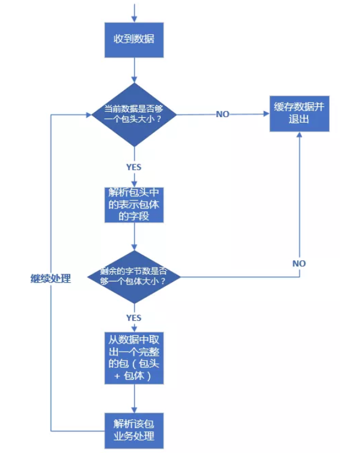
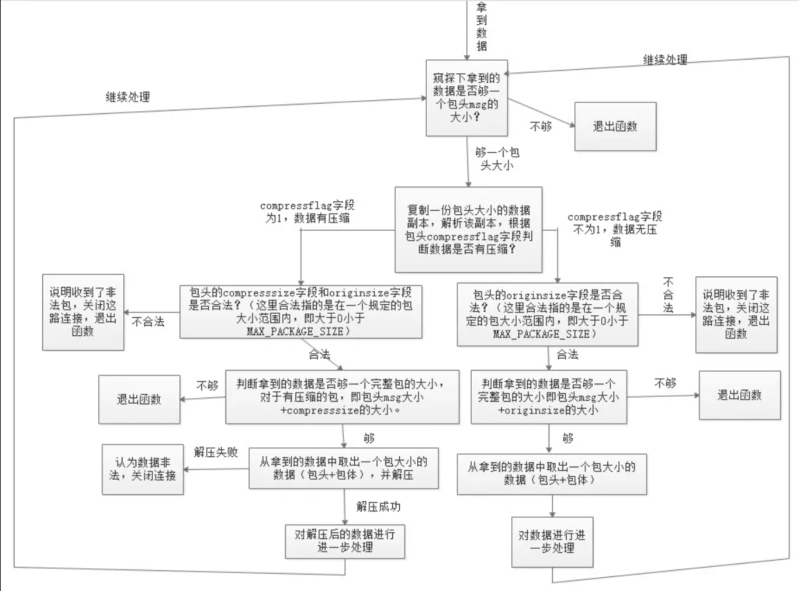
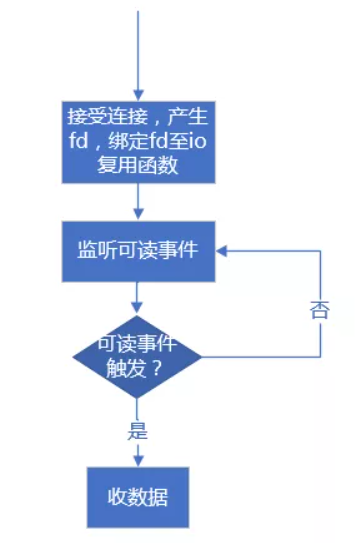
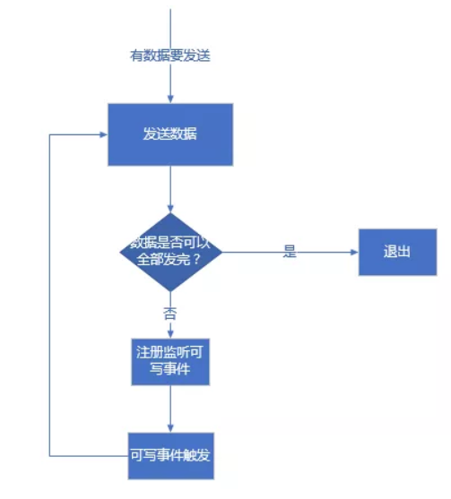

## 通信协议设计

### 一、TCP 协议如何解决半包和粘包问题

#### 1.TCP 协议是流式协议

很多读者从接触网络知识以来，应该听说过这句话：TCP 协议是流式协议。那么这句话到底是什么意思呢？所谓流式协议，即协议的内容是像流水一样的字节流，内容与内容之间没有明确的分界标志，需要我们人为地去给这些协议划分边界。

举个例子，A 与 B 进行 TCP 通信，A 先后给 B 发送了一个 100 字节和 200 字节的数据包，那么 B 是如何收到呢？B 可能先收到 100 字节，再收到 200 字节；也可能先收到 50 字节，再收到 250 字节；或者先收到 100 字节，再收到 100 字节，再收到 200 字节；或者先收到 20 字节，再收到 20 字节，再收到 60 字节，再收到 100 字节，再收到 50 字节，再收到 50 字节……

不知道读者看出规律没有？规律就是 A 一共给 B 发送了 300 字节，B 可能以一次或者多次任意形式的总数为 300 字节收到。假设 A 给 B 发送的 100 字节和 200 字节分别都是一个数据包，对于发送端 A 来说，这个是可以区分的，但是对于 B 来说，如果不人为规定多长为一个数据包，B 每次是不知道应该把收到的数据中多少字节作为一个有效的数据包的。而规定每次把多少数据当成一个包就是协议格式规范的内容之一。

经常会有新手写出类似下面这样的代码：

**发送端：**

```c
// ...省略创建 socket，建立连接等部分不相关的逻辑...
char buf[] = "the quick brown fox jumps over a lazy dog.";
int n = send(socket, buf, strlen(buf), 0);
// ...省略出错处理逻辑...
```

**接收端：**

```c
// 省略创建 socket，建立连接等部分不相关的逻辑...
char recvBuf[50] = { 0 };
int n = recv(socket, recvBuf, 50, 0);
// 省略出错处理逻辑...
printf("recvBuf: %s", recvBuf);
```

为了专注问题本身的讨论，我这里省略掉了建立连接和部分错误处理的逻辑。上述代码中发送端给接收端发送了一串字符 "the quick brown fox jumps over a lazy dog."，接收端收到后将其打印出来。

类似这样的代码在本机一般会工作的很好，接收端也如期打印出来预料的字符串，但是一放到局域网或者公网环境就出问题了，即接收端可能打印出来字符串并不完整；如果发送端连续多次发送字符串，接收端会打印出来的字符串不完整或出现乱码。不完整的原因很好理解，即对端某次收到的数据小于完整字符串的长度，recvBuf 数组开始被清空成 0，收到部分字符串后，该字符串的末尾仍然是 0，printf 函数寻找以 0 为结束标志的字符结束输出；乱码的原因是如果某次收入的数据不仅包含一个完整的字符串，还包含下一个字符串部分内容，那么 recvBuf 数组将会被填满，printf 函数输出时仍然会寻找以 0 为结束标志的字符结束输出，这样读取的内存就越界了，一直找到为止，而越界后的内存可能是一些不可读字符，显示出来后就乱码了。

我举这个例子希望你明白 能对 TCP 协议是流式协议有一个直观的认识。正因为如此，所以我们需要人为地在发送端和接收端规定每一次的字节流边界，以便接收端知道从什么位置取出多少字节来当成一个数据包去解析，这就是我们设计网络通信协议格式的要做的工作之一。

#### 2.如何解决粘包问题

网络通信程序实际开发中，或者技术面试时，面试官通常会问的比较多的一个问题是：网络通信时，如何解决粘包？

> 有的面试官可能会这么问：网络通信时，如何解决粘包、丢包或者包乱序问题？这个问题其实是面试官在考察面试者的网络基础知识，如果是 TCP 协议，在大多数场景下，是不存在丢包和包乱序问题的，TCP 通信是可靠通信方式，TCP 协议栈通过序列号和包重传确认机制保证数据包的有序和一定被正确发到目的地；如果是 UDP 协议，如果不能接受少量丢包，那就要自己在 UDP 的基础上实现类似 TCP 这种有序和可靠传输机制了（例如 RTP协议、RUDP 协议）。所以，问题拆解后，只剩下如何解决粘包的问题。

先来解释一下什么是粘包，所谓粘包就是连续给对端发送两个或者两个以上的数据包，对端在一次收取中可能收到的数据包大于 1 个，大于 1 个，可能是几个（包括一个）包加上某个包的部分，或者干脆就是几个完整的包在一起。当然，也可能收到的数据只是一个包的部分，这种情况一般也叫半包。

无论是半包还是粘包问题，其根源是上文介绍中 TCP 协议是流式数据格式。解决问题的思路还是想办法从收到的数据中把包与包的边界给区分出来。那么如何区分呢？目前主要有三种方法：

**1) 固定包长的数据包**

顾名思义，即每个协议包的长度都是固定的。举个例子，例如我们可以规定每个协议包的大小是 64 个字节，每次收满 64 个字节，就取出来解析（如果不够，就先存起来）。

这种通信协议的格式简单但灵活性差。如果包内容不足指定的字节数，剩余的空间需要填充特殊的信息，如 \0（如果不填充特殊内容，如何区分包里面的正常内容与填充信息呢？）；如果包内容超过指定字节数，又得分包分片，需要增加额外处理逻辑——在发送端进行分包分片，在接收端重新组装包片（分包和分片内容在接下来会详细介绍）。

**2) 以指定字符（串）为包的结束标志**

这种协议包比较常见，即字节流中遇到特殊的符号值时就认为到一个包的末尾了。例如，我们熟悉的 FTP 协议，发邮件的 SMTP 协议，一个命令或者一段数据后面加上 "\r\n"（即所谓的 CRLF）表示一个包的结束。对端收到后，每遇到一个 "\r\n" 就把之前的数据当做一个数据包。

这种协议一般用于一些包含各种命令控制的应用中，其不足之处就是如果协议数据包内容部分需要使用包结束标志字符，就需要对这些字符做转码或者转义操作，以免被接收方错误地当成包结束标志而误解析。

**3) 包头 + 包体格式**

这种格式的包一般分为两部分，即包头和包体，包头是固定大小的，且包头中必须含有一个字段来说明接下来的包体有多大。例如：

```c
struct msg_header
{
  int32_t bodySize;
  int32_t cmd;
};
```

这就是一个典型的包头格式，bodySize 指定了这个包的包体是多大。由于包头大小是固定的（这里是 size(int32_t) + sizeof(int32_t) = 8 字节），对端先收取包头大小字节数目（当然，如果不够还是先缓存起来，直到收够为止），然后解析包头，根据包头中指定的包体大小来收取包体，等包体收够了，就组装成一个完整的包来处理。在有些实现中，包头中的 bodySize可能被另外一个叫 packageSize 的字段代替，这个字段的含义是整个包的大小，这个时候，我们只要用 packageSize 减去包头大小（这里是 sizeof(msg_header)）就能算出包体的大小，原理同上。

> 在使用大多数网络库时，通常你需要根据协议格式自己给数据包分界和解析，一般的网络库不提供这种功能是出于需要支持不同的协议，由于协议的不确定性，因此没法预先提供具体解包代码。当然，这不是绝对的，也有一些网络库提供了这种功能。在 Java Netty 网络框架中，提供了FixedLengthFrameDecoder 类去处理长度是定长的协议包，提供了 DelimiterBasedFrameDecoder 类去处理按特殊字符作为结束符的协议包，提供 ByteToMessageDecoder 去处理自定义格式的协议包（可用来处理包头 + 包体 这种格式的数据包），然而在继承 ByteToMessageDecoder 子类中你需要根据你的协议具体格式重写 decode() 方法来对数据包解包。

#### 3.解包与处理

在理解了前面介绍的数据包的三种格式后，我们来介绍一下针对上述三种格式的数据包技术上应该如何处理。其处理流程都是一样的，这里我们以包头 + 包体 这种格式的数据包来说明。处理流程如下：

<div align="center">
    
</div>

假设我们的包头格式如下：

```c{.line-numbers}
// 强制一字节对齐
#pragma pack(push, 1)
// 协议头
struct msg
{   
    // 包体大小  
    int32_t  bodysize;         
};
#pragma pack(pop)
```

那么上面的流程实现代码如下：

```c{.line-numbers}
// 包最大字节数限制为 10M
#define MAX_PACKAGE_SIZE    10 * 1024 * 1024

void ChatSession::OnRead(const std::shared_ptr<TcpConnection>& conn, Buffer* pBuffer, Timestamp receivTime)
{
    while (true)
    {
        // 不够一个包头大小
        if (pBuffer->readableBytes() < (size_t)sizeof(msg))
        {
            LOGI << "buffer is not enough for a package header, pBuffer->readableBytes()=" << pBuffer->readableBytes() << ", sizeof(msg)=" << sizeof(msg);
            return;
        }

        // 取包头信息
        msg header;
        memcpy(&header, pBuffer->peek(), sizeof(msg));

        // 包头有错误，立即关闭连接
        if (header.bodysize <= 0 || header.bodysize > MAX_PACKAGE_SIZE)
        {
            // 客户端发非法数据包，服务器主动关闭之
            LOGE("Illegal package, bodysize: %lld, close TcpConnection, client: %s", header.bodysize, conn->peerAddress().toIpPort().c_str());
            conn->forceClose();
            return;
        }

        // 收到的数据不够一个完整的包
        if (pBuffer->readableBytes() < (size_t)header.bodysize + sizeof(msg))
            return;

        pBuffer->retrieve(sizeof(msg));
        // inbuf 用来存放当前要处理的包
        std::string inbuf;
        inbuf.append(pBuffer->peek(), header.bodysize);
        pBuffer->retrieve(header.bodysize);          
        // 解包和业务处理
        if (!Process(conn, inbuf.c_str(), inbuf.length()))
        {
            // 客户端发非法数据包，服务器主动关闭之
            LOGE("Process package error, close TcpConnection, client: %s", conn->peerAddress().toIpPort().c_str());
            conn->forceClose();
            return;
        }              
    }// end while-loop
}
```

上述流程代码的处理过程和流程图中是一致的，pBuffer 这里是一个自定义的接收缓冲区，这里的代码，已经将收到的数据放入了这个缓冲区，所以判断当前已收取的字节数目只需要使用这个对象的相应方法即可。上述代码有些细节我需要强调一下：

- 取包头时，你应该拷贝一份数据包头大小的数据出来，而不是从缓冲区 pBuffer 中直接将数据取出来（即取出来的数据从 pBuffer 中移除），这是因为倘若接下来根据包头中的字段得到包体大小时，如果剩余数据不够一个包体大小，你又得把这个包头数据放回缓冲区。为了避免这种不必要的操作，只有缓冲区数据大小够整个包的大小（代码中：header.bodysize + sizeof(msg)）你才需要把整个包大小的数据从缓冲区移除，这也是这里的 pBuffer->peek() 方法 peek 单词的含义（中文可以翻译成"瞟一眼"或者"偷窥"）。
- 通过包头得到包体大小时，你一定要对 bodysize 的数值进行校验，我这里要求 bodysize 必须大于 0 且不大于 10 * 1024 * 1024（即 10 M）。当然，实际开发中，你可以根据你自己的需求要决定 bodysize 的上下限（包体大小是 0 字节的包在某些业务场景下是允许的）。记住，一定要判断这个上下限，因为假设这是一个非法的客户端发来的数据，其 bodysize 设置了一个比较大的数值，例如 1 * 1024 * 1024 * 1024（即 1 G），你的逻辑会让你一直缓存该客户端发来的数据，那么很快你的服务器内存将会被耗尽，操作系统在检测到你的进程占用内存达到一定阈值时会杀死你的进程，导致服务不能再正常对外服务。如果你检测了 bodysize 字段的是否满足你设置的上下限，对于非法的 bodysize，直接关闭这路连接即可。这也是服务的一种自我保护措施，避免因为非法数据包带来的损失。
- 不知道你有没有注意到整个判断包头、包体以及处理包的逻辑放在一个 while 循环里面，这是必要的。如果没有这个 while 循环，当你一次性收到多个包时，你只会处理一个，下次接着处理就需要等到新一批数据来临时再次触发这个逻辑。这样造成的结果就是，对端给你发送了多个请求，你最多只能应答一个，后面的应答得等到对端再次给你发送数据时。这就是对粘包逻辑的正确处理。

以上逻辑和代码是最基本的粘包和半包处理机制，也就是所谓的技术上的解包处理逻辑（业务上的解包处理逻辑后面章节再介绍）。希望读者能理解他们，在理解了他们的基础之上，我们可以给解包拓展很多功能，例如，我们再给我们的协议包增加一个支持压缩的功能，我们的包头变成下面这个样子：

```c{.line-numbers}
#pragma pack(push, 1)
// 协议头
struct msg
{
    // 压缩标志，如果为 1，则启用压缩，反之不启用压缩
    char     compressflag;     
    // 包体压缩前大小
    int32_t  originsize;       
    // 包体压缩后大小
    int32_t  compresssize;     
    // 保留字段，用于将来拓展
    char     reserved[16];       
};
#pragma pack(pop)
```

修改后的代码如下：

```c{.line-numbers}
void ChatSession::OnRead(const std::shared_ptr<TcpConnection>& conn, Buffer* pBuffer, Timestamp receivTime)
{
    while (true)
    {
        // 不够一个包头大小
        if (pBuffer->readableBytes() < (size_t)sizeof(msg))
        {
            LOGI << "buffer is not enough for a package header, pBuffer->readableBytes()=" << pBuffer->readableBytes() << ", sizeof(msg)=" << sizeof(msg);
            return;
        }

        // 取包头信息
        msg header;
        memcpy(&header, pBuffer->peek(), sizeof(msg));

        // 数据包压缩过
        if (header.compressflag == PACKAGE_COMPRESSED)
        {
            // 包头有错误，立即关闭连接
            if (header.compresssize <= 0 || header.compresssize > MAX_PACKAGE_SIZE ||
                header.originsize <= 0 || header.originsize > MAX_PACKAGE_SIZE)
            {
                // 客户端发非法数据包，服务器主动关闭之
                LOGE("Illegal package, compresssize: %lld, originsize: %lld, close TcpConnection, client: %s",  header.compresssize, header.originsize, conn->peerAddress().toIpPort().c_str());
                conn->forceClose();
                return;
            }

            // 收到的数据不够一个完整的包
            if (pBuffer->readableBytes() < (size_t)header.compresssize + sizeof(msg))
                return;

            pBuffer->retrieve(sizeof(msg));
            std::string inbuf;
            inbuf.append(pBuffer->peek(), header.compresssize);
            pBuffer->retrieve(header.compresssize);
            std::string destbuf;
            if (!ZlibUtil::UncompressBuf(inbuf, destbuf, header.originsize))
            {
                LOGE("uncompress error, client: %s", conn->peerAddress().toIpPort().c_str());
                conn->forceClose();
                return;
            }

            // 业务逻辑处理
            if (!Process(conn, destbuf.c_str(), destbuf.length()))
            {
                // 客户端发非法数据包，服务器主动关闭之
                LOGE("Process error, close TcpConnection, client: %s", conn->peerAddress().toIpPort().c_str());
                conn->forceClose();
                return;
            }
        }
        // 数据包未压缩
        else
        {
            // 包头有错误，立即关闭连接
            if (header.originsize <= 0 || header.originsize > MAX_PACKAGE_SIZE)
            {
                //客户端发非法数据包，服务器主动关闭之
                LOGE("Illegal package, compresssize: %lld, originsize: %lld, close TcpConnection, client: %s", header.compresssize, header.originsize, conn->peerAddress().toIpPort().c_str());
                conn->forceClose();
                return;
            }

            // 收到的数据不够一个完整的包
            if (pBuffer->readableBytes() < (size_t)header.originsize + sizeof(msg))
                return;

            pBuffer->retrieve(sizeof(msg));
            std::string inbuf;
            inbuf.append(pBuffer->peek(), header.originsize);
            pBuffer->retrieve(header.originsize);
            // 业务逻辑处理
            if (!Process(conn, inbuf.c_str(), inbuf.length()))
            {
                // 客户端发非法数据包，服务器主动关闭之
                LOGE("Process error, close TcpConnection, client: %s", conn->peerAddress().toIpPort().c_str());
                conn->forceClose();
                return;
            }
        }// end else

    }// end while-loop
}
```

这段代码先根据包头的压缩标志字段判断包体是否有压缩，如果有压缩，则取出包体大小去解压，解压后的数据才是真正的业务数据。整个程序执行流程图如下：

<div align="center">
    
</div>

### 二、服务器端发送数据时，如果对端一直不收，怎么办？

这类问题一般出现在跨部门尤其是与外部开发人员合作的时候。假设现在有这样一种情况，我们的服务器提供对外的服务，指定好了协议，然后对外提供服务，客户端由外部人员去开发，由于存在太多的不确定性，如果我们在给对端（客户端）发送数据时，对端因为一些问题（可能是逻辑 bug 或者其他的一些问题）一直不从 socket 系统缓冲区中收取数据，而服务器端可能定期产生一些数据需要发送给客户端，再发了一段时间后，由于 TCP 窗口太小，导致数据发送不出去，这样待发送的数据会在服务器端对应的连接的发送缓冲区中积压，如果我们不做任何处理，很快系统就会因为缓冲区过大内存耗尽，导致服务被系统杀死。

对于这种情况，我们一般建议从以下几个方面来增加一些防御措施：

#### 1.场景 1

设置每路发送连接的发送缓冲区大小上限（如 2MB，或者小于这个值），当某路连接上的数据发送不出去的时候，即将数据存入发送缓冲区时，先判断一下缓冲区最大剩余空间，如果剩余空间已经小于我们要放入的数据大小，也就是说缓冲区中数据大小会超过了我们规定的上限，则认为该连接出现了问题，关闭该路连接并回收相应的资源（如清空缓冲区、回收套接字资源等）。示例代码如下：

```cpp{.line-numbers}
// outputBuffer_ 为发送缓冲区对象
size_t remainingLen = outputBuffer_.remainingBytes();
// 如果加入到缓冲区中的数据长度超出了发送缓冲区最大剩余量
if (remainingLen < dataToAppend.length())
{
		forceClose()
		return
}

outputBuffer_.append(static_cast<const char*>(dataToAppend.c_str()), dataToAppend.length());
```

#### 2.场景 2

还有另外一种场景，当有一部分数据已经积压在发送缓冲区了，此后服务器端未产生新的待发送的数据，此时如果不做任何处理，发送缓冲区的数据会一直积压，但是发送缓冲区的数据容量也不会超过上限。如果不做任何处理的话，该数据会一直在缓冲区中积压，白白浪费系统资源。对于这种情况一般我们会设置一个定时器，每隔一段时间（如 3 秒）去检查一下各路连接的发送缓冲区中是否还有数据未发送出去，也就是说如果一个连接超过一定时间内还存在未发送出去的数据，我们也认为该连接出现了问题，我们可以关闭该路连接并回收相应的资源（如清空缓冲区、回收套接字资源等）。示例代码如下：

```cpp{.line-numbers}
// 每 3 秒检测一次
const int SESSION_CHECK_INTERVAL = 3000;

SetTimer(SESSION_CHECK_TIMER_ID, SESSION_CHECK_INTERVAL);

void CSessionManager::OnTimer()
{
    for (auto iter = m_mapSession.begin(); iter != m_mapSession.end(); ++iter)
    {
        if (!CheckSession(iter->value))
        {
            // 关闭 session，回收相关的资源
            iter->value->ForceClose();

            iter = m_mapSession.erase(iter);
        }
    }
}

void CSessionManager::CheckSession(CSession* pSession)
{
    if (!pSession->GetConnection().OutputBuffer.IsEmpty())
        return false;

    return true;
}
```

### 三、网络中收发数据的正确方式

在网络通信中，我们可能既要通过 socket 去发送数据也要通过 socket 来收取数据。那么一般的网络通信框架是如何收发数据的呢？注意，这里讨论的范围是基于各种 IO 复用函数（select、poll、epoll 等）来判断 socket 读写来收发数据，其他情形比较简单，这里就不提了。

我们这里以服务器端为例。服务器端接受客户端连接后，产生一个与客户端连接对应的 socket（Linux 下也叫 fd，为了叙述方便，以后称之为 clientfd），我们可以通过这个 clientfd 收取从客户端发来的数据，也可以通过这个 clientfd 将数据发往客户端。但是收与发在操作流程上是有明显的区别的。

#### 1.收数据的正确方式

对于收数据，当接受连接成功得到 clientfd 后，我们会将该 clientfd 绑定到相应的 I/O 复用函数上并监听其可读事件。不同的 I/O 复用函数可读事件标志不一样，例如对于 poll 模型，可读标志是 POLLIN，对于 epoll 模型，可读事件标志是 EPOLLIN。当可读事件触发后，我们调用 recv 函数从 clientfd 上收取数据（这里不考虑出错的情况），根据不同的网络模式我们可能会收取部分，或一次性收完。收取到的数据我们会放入接收缓冲区内，然后做解包操作。这就是收数据的全部"姿势"。__对于使用 epoll 的 LT 模式（水平触发模式），我们每次可以只收取部分数据；但是对于 ET 模式（边缘触发模式），我们必须将本次收到的数据全部收完__。

> ET 模式收完的标志是 recv 或者 read 函数的返回值是 -1，错误码是 EWOULDBLOCK，针对 Windows 和 Linux 下区别，前面章节已经详细地说过了。

这就是读数据的全部姿势。流程图如下：

<div align="center">
    
</div>

#### 2.发数据的正确方式

对于发数据，除了 epoll 模型的 ET 模式外，epoll 的 LT 模式或者其他 IO 复用函数，我们通常都不会去注册监听该 clientfd 的可写事件。**这是因为，只要对端正常收数据，一般不会出现 TCP 窗口太小导致 send 或 write 函数无法写的问题**。因此大多数情况下，clientfd 都是可写的，如果注册了可写事件，会导致一直触发可写事件，而此时不一定有数据需要发送。故而，如果有数据要发送一般都是调用 send 或者 write 函数直接发送，__如果发送过程中，send 函数返回 -1，并且错误码是 EWOULDBLOCK 表明由于 TCP 窗口太小数据已经无法写入时，而仍然还剩下部分数据未发送，此时我们才注册监听可写事件__，并将剩余的服务存入自定义的发送缓冲区中，等可写事件触发后再接着将发送缓冲区中剩余的数据发送出去，如果仍然有部分数据不能发出去，继续注册可写事件，当已经无数据需要发送时应该立即移除对可写事件的监听。这是目前主流网络库的做法。

流程图如下所示：

<div align="center">
    
</div>

上述逻辑可以表述如下所示：

**直接尝试发送消息处理逻辑：**

```cpp{.line-numbers}
/**
 *@param data 待发送的数据
 *@param len  待发送数据长度
 */
void TcpConnection::sendMessage(const void* data, size_t len)
{    
    int32_t nwrote = 0;
    size_t remaining = len;
    bool faultError = false;
    if (state_ == kDisconnected) {
        LOGW("disconnected, give up writing");
        return;
    }

    // 当前未监听可写事件，且发送缓冲区中没有遗留数据
    if (!channel_->isWriting() && outputBuffer_.readableBytes() == 0) {
        // 直接发送数据
        nwrote = sockets::write(channel_->fd(), data, len);      
        if (nwrote >= 0) {
            remaining = len - nwrote;           
        }
        // nwrote < 0
        else {
            nwrote = 0;
            // 错误码不等于 EWOULDBLOCK 说明发送出错了
            if (errno != EWOULDBLOCK) {
                LOGSYSE("TcpConnection::sendInLoop");
                if (errno == EPIPE || errno == ECONNRESET) {
                    faultError = true;
                }
            }
        }
    }

    // 发送未出错且还有剩余字节未发出去
    if (!faultError && remaining > 0) {
        // 将剩余部分加入发送缓冲区
        outputBuffer_.append(static_cast<const char*>(data) + nwrote, remaining);
        if (!channel_->isWriting()) {
            // 注册可写事件
            channel_->enableWriting();
        }
    }
}
```

**不能全部发出去监听可写事件后，可写事件触发后处理逻辑：**

```cpp{.line-numbers}
// 可写事件触发后会调用 handleWrite() 函数
void TcpConnection::handleWrite()
{  
    // 将发送缓冲区中的数据发送出去
    int32_t n = sockets::write(channel_->fd(), outputBuffer_.peek(), outputBuffer_.readableBytes());
    if (n > 0) {
        // 发送多少从发送缓冲区移除多少
        outputBuffer_.retrieve(n);
        // 如果发送缓冲区中已经没有剩余，则移除监听可写事件
        if (outputBuffer_.readableBytes() == 0) {
            // 移除监听可写事件
            channel_->disableWriting();

            if (state_ == kDisconnecting) {
                shutdown();
            }
        }
    }
    else {
        // 发数据出错处理
        LOGSYSE("TcpConnection::handleWrite");           
        handleClose();
    } 
}
```

对于 epoll LT 模式注册监听一次可写事件后，可写事件触发后，尝试发送数据，如果数据此时还不能全部发送完，不用再次注册可写事件；如果是 epoll 的 ET 模式，注册监听可写事件后，可写事件触发后，尝试发送数据，如果数据此时还不能全部发送完，需要再次注册可写事件以便让可写事件下次再次触发（给予再次发数据的机会）。当然，这只是理论上的情况，实际开发中，如果一段数据反复发送都不能完全发送完（例如对端先不收，后面每隔很长时间再收一个字节），我们可以设置一个最大发送次数或最大发送总时间，超过这些限定，我们可以认为对端出了问题，应该立即清空发送缓冲区并关闭连接。

本节的标题是"收发数据的正确姿势"，其实还可以换一种说法，即"检测网络事件的正确姿势"，这里意指检测一个 fd 的读写事件的区别（对于侦听 fd，只检测可读事件）：

- 在 select、poll 和 epoll 的 LT 模式下，可以直接设置检测 fd 的可读事件；
- 在 select、poll 和 epoll 的 LT 模式下**不要直接设置检测 fd 的可写事件，应该先尝试发送数据，因为 TCP 窗口太小发不出去再设置检测 fd 的可写事件**，一旦数据发出去应立即取消对可写事件的检测。
- 在 epoll 的 ET 模式下，**需要发送数据时，每次都要设置检测可写事件**。