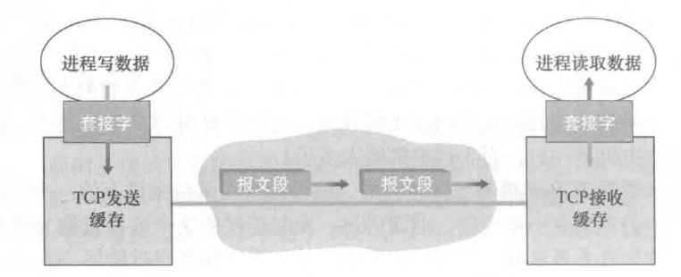
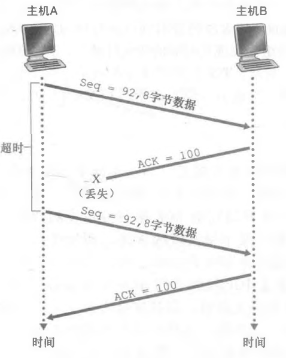
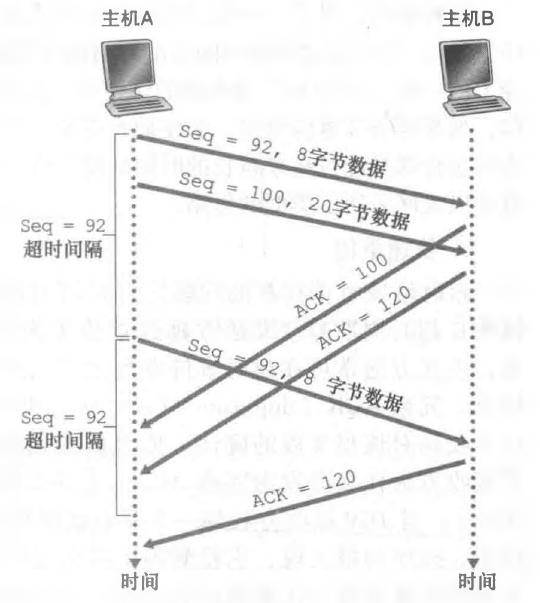
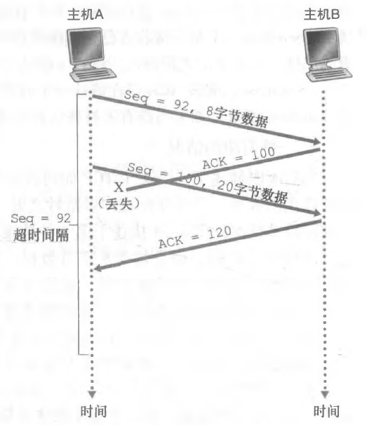

# TCP 协议之 TCP 可靠传输原理

## 0.简介

**<font color="red">TCP 是因特网运输层的面向连接的可靠的运输协议，为了实现可靠的传输协议，TCP 使用了差错检测、重传、累积确认、定时器、以及用于序号和确认号的首部字段。</font>**

## 1.TCP 连接

TCP 被称为是面向连接的（connection-oriented），这是因为在一个应用进程可以开始向另一个应用进程发送数据之前，这两个进程必须先相互 "握手"，即它们必须相互发送某些预备报文段，以建立确保数据传输的参数。

这种 TCP 连接不是一条像在电路交换网络中的端到端 TDM 或 FDM 电路。相反, 该连接是一条逻辑连接，其共同状态仅保留在两个通信端系统的 TCP 程序中。前面讲过，由于 TCP 协议只在端系统中运行，而不在中间的网络元素（路由器和链路层交换机）中运行，所以中间的网络元素不会维持 TCP 连接状态。中间路由器对 TCP 连接完全视而不见，他们看到的是 IP 数据报，而不是连接。TCP 连接也总是点对点（point-to-point）的，即在单个发送方与单个接收方之间的连接。所谓多播，即在一次发送操作中，从一个发送方将数据传送给多个接收方，这种情况对 TCP 来说是不可能的。

一旦建立起一条 TCP 连接，两个应用进程之间就可以相互发送数据了，客户进程通过套接字传递数据流。数据一旦通过该套接字，它就由客户中运行的 TCP 控制了。TCP 将这些数据引导到该连接的发送缓存（send buffer）里，发送缓存是发起三次握手期间设置的缓存之一。接下来 TCP 就会不时从发送缓存里取出一块数据，并将数据传递到网络层。在 TCP 的规范 RFC 793 中并没有提及 TCP 应该何时从发送缓存中取出数据，只是描述为 TCP 应该在它方便的时候以报文段的形式发送数据。

TCP 可从缓存中取出并放入报文段中的数据数量受限于最大报文段长度（Maximum Segment Size, MSS）。MSS 通常根据最初确定的由本地发送主机发送的最大链路层帧长度（即所谓的最大传输单元（Maximum Transmission Unit, MTU））来设置。设置该 MSS 要保证一个 TCP 报文段（当封装在一个 IP 数据报中）加上 TCP/IP 首部长度（通常 40 字节）将适合单个链路层帧。以太网和 PPP 链路层协议都具有 1500 字节的 MTU，因此 MSS 的典型值为 1460 字节。注意到 MSS 是指在报文段里应用层数据的最大长度，而不是指包括首部的 TCP 报文段的最大长度。（该术语很容易混淆，但是我们不得不采用它，因为它已经根深蒂固了）

当 TCP 在另一端接收到一个报文段后，该报文段的数据就被放入该 TCP 连接的接收缓存中。应用程序从此缓存中读取数据流。该连接的每一端都有各自的发送缓存和接收缓存。

从以上讨论中我们可以看出，TCP 连接的组成包括：一台主机上的缓存、变量和与进程连接的套接字，以及另一台主机上的另一组缓存、变量和与进程连接的套接字。如前面讲过的那样，在这两台主机之间的网络元素（路由器，交换机和中继器）中没有为该连接分配任何缓存和变量。

<div align="center">  </div>

## 2.TCP 报文段结构

TCP 报文段由首部字段和一个数据字段组成。数据字段包含一块应用数据。如前所述，MSS 限制了报文段数据字段的最大长度。当 TCP 发送一个大文件，例如某 Web 页面上的一个图像时，TCP 通常是将该文件划分成长度为 MSS 的若干块（最后一块除外，它通常小于 MSS）。然而，交互式应用通常传送长度远小于 MSS 的数据块。例如，对于像 Telnet 这样的远程登录应用，其 TCP 报文段的数据字段经常只有一个字节。（另外注意，在 TCP 实践中，PSH、URG 和紧急数据指针并没有使用）

### 2.1.确认号与序号

TCP 报文段首部中两个最重要的字段是序号字段和确认号字段。这两个字段是 TCP 可靠传输服务的关键部分。TCP 把数据看成一个无结构的、有序的字节流。我们从 TCP 对序号的使用上可以看出这一点，因为序号是建立在传送的字节流之上，而不是建立在传送的报文段的序列之上。一个报文段的序号（sequence number for a segment）是该报文段首字节的字节流编号。

举一个例子，假设主机 A 已收到一个来自主机 B 的包含字节 0 ~ 535 的报文段，以及另一个包含字节 900 ~ 1000 的报文段。由于某种原因，主机 A 还没有收到字节 536 ~ 899 的报文段。在这个例子中，主机 A 为了重新构建主机 B 的数据流，仍在等待字节 536（和其后的字节）。因此，A 到 B 的下一个报文段将在确认号字段中包含 536。因为 TCP 只确认该流中至第一个丢失字节为止的字节，所以 TCP 被称为提供累积确认（cumulative acknowledgment）。

最后一个例子也会引发一个重要而微妙的问题。主机 A 在收到第二个报文段（字节 536 ~ 899）之前收到第三个报文段（字节 900 ~ 1000）。因此，第三个报文段失序到达。该微妙的问题是：当主机在一条 TCP 连接中收到失序报文段时该怎么办？有趣的是，TCP RFC 并没有为此明确规定任何规则，而是把这一问题留给实现 TCP 的编程人员去处理。他们有两个基本的选择：1）接收方立即丢弃失序报文段（如前所述，这可以简化接收方的设计）；2）接收方保留失序的字节，并等待缺少的字节以填补该间隔。显然，后一种选择对网络带宽而言更为有效，是实践中采用的方法。

在前面我们假设初始序号为 0，事实上，一条 TCP 连接的双方均可随机选择初始序号（initial sequence number，isn）。这样做可以减少将那些仍在网络中存在的来自两台主机之间先前已经终止的连接的报文段，被误认为是后来这两台主机之间新建立的连接所产生的有效报文段的可能性（它碰巧与旧连接使用了相同的端口号）。

**<font color="red">注意，ISN 必须是随机初始化的，而不能是固定的。</font>** ISN 的具体的数值得由操作系统的源码来决定，有好几种生成方式。RFC1948 中提出了一个较好的初始化序列号 ISN 随机生成算法：**`ISN = M + F(localhost, localport, remotehost, remoteport)`**。

M 是一个计时器，这个计时器每隔 4 毫秒加 1。F 是一个 Hash 算法，根据源 IP、目的 IP、源端口、目的端口生成一个随机数值。要保证 hash 算法不能被外部轻易推算得出，用 MD5 算法是一个比较好的选择。下面解释为什么 ISN 值必须是随机初始化，而不能是固定的。

- 从攻击的角度：TCP 初始化序列号不能设置为一个固定值，因为这样容易被攻击者猜出后续的序列号，从而遭到攻击。
- 从 TCP 连接稳定角度：广域网的随机性，复杂性都很高，假设 client 与 server 连接状况不好，不停的断开又重连。那么之前交互的报文很可能在连接已断开时还没到达 server。如果 ISN 是固定的，那很可能在新连接建立后，上次连接通信的报文才到达 server，**<font color="red">这种情况有概率发生上次连接发送的报文的 seq 序列号正好是 server 希望收到的新连接的报文 seq 序列号。这就全乱了。因此，TCP 的 ISN 不能是固定的</font>**。

The Problem With Starting Every Connection Using the Same Sequence Number

In the example I gave in the topic describing the sliding windows system, I assumed for "simplicity" （ha ha, was that simple?）that each device would start a connection by giving the first byte of data sent sequence number 1. A valid question is, why wouldn't we always just start off each TCP connection by sending the first byte of data with a sequence number of 1? The sequence numbers are arbitrary, after all, and this is the simplest method.

In an ideal world, this would probably work, but we don't live in an ideal world. The problem with starting off each connection with a sequence number of 1 is that it introduces the possibility of segments from different connections getting mixed up. Suppose we established a TCP connection and sent a segment containing bytes 1 through 30.

However, there was a problem with the internetwork that caused this segment to be delayed, and eventually, the TCP connection itself to be terminated. We then started up a new connection and again used a starting sequence number of 1. As soon as this new connection was started, however, the old segment with bytes labeled 1 to 30 showed up. The other device would erroneously think those bytes were part of the new connection.

This is but one of several similar problems that can occur. To avoid them, each TCP device, at the time a connection is initiated, chooses a 32-bit initial sequence number（ISN）for the connection. Each device has its own ISN, and they will normally not be the same.

值得注意的是，对客户到服务器的数据的确认被装载在一个承载服务器到客户的数据的报文段中；这种确认被称为是被捎带（piggybacked）在服务器到客户的数据报文段中的。或者说被称为延迟确认（Delayed Ack），这两者是一类东西。

### 2.2.TCP 实践原则

与之前所介绍的 rdt3.0 协议类似，TCP 通过使用肯定确认与定时器来提供可靠数据传输。TCP 确认正确接收到的数据，而当认为报文段或其确认报文丢失或受损时，TCP 会重传这些报文段。有些版本的 TCP 还有一个隐式 NAK 机制（在 TCP 的快速重传机制下，收到对一个特定报文段的 3 个冗余 ACK 就可作为对后面报文段的一个隐式 NAK，从而在超时之前触发对该报文段的重传）。TCP 使用序号以使接收方能识别丢失或重复的报文段。像可靠数据传输协议 rdt3.0 的情况一样，TCP 自己也无法明确地分辨一个报文段或其 ACK 是丢失了还是受损了，或是时延过长了。在发送方，TCP 的响应是相同的：重传有疑问的报文段。

TCP 也使用流水线，使得发送方在任意时刻都可以有多个已发出但还未被确认的报文段存在。一个发送方能够具有的未被确认报文段的具体数量是由 TCP 的流量控制和拥寒控制机制决定的。

## 3.可靠的数据传输

### 3.1.TCP 简化版本

前面讲过，因特网的网络层服务（IP 服务）是不可靠的。**<font color="red">IP 不保证数据报的交付（出现丢失）, 不保证数据报的按序交付（出现乱序，重复），也不保证数据报中数据的完整性（比特受损）</font>**。对于 IP 服务，数据报能够溢出路由器缓存而永远不能到达目的地，数据报也可能是乱序到达，而且数据报中的比特可能损坏（由 0 变为 1 或者相反）。由于运输层报文段是被 IP 数据报携带着在网络中传输的，所以运输层的报文段也会遇到这些问题。

**<font color="red">TCP 在 IP 不可靠的尽力而为服务之上创建了一种可靠数据传输服务（reliable data transfer service）。</font>**

TCP 的可靠数据传输服务确保一个进程从其接收缓存中读出的数据流是无损坏、无间隙、非冗余和按序的数据流；即该字节流与连接的另一方端系统发送出的字节流是完全相同。

在我们前面研发可靠数据传输技术时，曾假定每一个已发送但未被确认的报文段都与一个定时器相关联，这在概念上是最简单的。虽然这在理论上很好，但定时器的管理却需要相当大的开销。因此，推荐的定时器管理过程［RFC 6298］仅使用单一的重传定时器，**<font color="red">即使有多个已发送但还未被确认的报文段。这个单一重传定时器只与最早未被确认的报文段是相关联的</font>**。

在接下来的讨论中，我们以两个递增的步骤来讲解 TCP 是如何进行可靠数据传输的。我们先给出一个 TCP 发送方的高度简化的描述，然后再给出一个更加全面的描述（在这个更全面的描述中，除了使用使用超时机制外，还使用冗余确认）。在接下来的讨论中，假定数据仅向一个方向发送，即从主机 A 到主机 B，且主机 A 在发送一个大文件。

```java {.line-numbers}
NextSeqNum=InitialSeqNumber
SendBase=InitialSeqNumber

// 假设发送方不受 TCP 流量和拥塞控制的限制，来自上层数据的长度小于 MSS，且数据传送只在一个方向进行
loop(永远) {
    switch(事件)

        事件：从上面应用程序接收到数据 e
            生成具有序号 NextSeqNum 的 TCP 报文段
            if (定时器当前没有运行)
                启动定时器
            向 IP 传递报文段
            NextSeqNum = NextSeqNum + length(data)
            break;

        事件：定时器超时
            重传具有最小序号但仍然未应答的报文段
            启动定时器（重新计时）
            break;

        事件：收到 ACK，具有 ACK 字段值 y
            if (y > SendBase) {
                SendBase = y
                if (当前滑动窗口中仍存在无任何应答的报文段)
                    为该报文段启动定时器
            }
            break;
}
```

我们看到在 TCP 发送方有 3 个与发送和重传有关的主要事件：从上层应用程序接收数据；定时器超时和收到 ACK。

第一个主要事件发生，TCP 从应用程序接收数据，将数据封装在一个报文段中，并把该报文段交给 IP。注意到每一个报文段都包含一个序号，这个序号就是该报文段第一个数据字节的字节流编号。还要注意到如果定时器还没有为某些其他报文段而运行，则当报文段被传给 IP 时，TCP 就启动该定时器（**<font color="red">在 TCP 协议中只有一个定时器，该定时器为与最早的未被确认的报文段相关联</font>**）。这时就说明该 TCP 报文段序号之前的数据，全部被接收方 B 收到，并且 A 接收到了 B 发回的 ACK 报文。当定时器已经被其它报文段所使用时，就不为该报文启动定时器。该定时器的过期间隔是 **`Timeoutinterval`**，它是由 **`EstimatedRTT`** 和 **`DevRTT`** 计算得出的。

第二个主要事件是超时。TCP 通过重传引起超时的报文段来响应超时事件。然后 TCP 重启定时器。

第三个主要是到达一个来自接收方的确认报文段（ACK）（更确切地说，是一个包含了有效 ACK 字段值的报文段）。当该事件发生时，TCP 将 ACK 的值 y 与它的变量 **`SendBase`** 进行比较。TCP 状态变量 **`SendBase`** 是最早未被确认的字节的序号。（因此 **`SendBase - 1`** 是指接收方已正确按序接收到的数据的最后一个字节的序号。）如前面指出的那样，TCP 采用累积确认，所以 y 确认了字节编号在 y 之前的所有字节都已经收到。如果 **`y > SendBase`**，则该 ACK 是在确认一个或多个先前未被确认的报文段。因此发送方更新它的 **`SendBase`** 变量；接下来如果发送方当前还有未被确认的报文段，TCP 还要为其中最小序号的报文段（也就是最早未被确认的报文段）重新启动定时器。

接下来介绍一下几种情况：

- A 向 B 发送一个报文段，序号为 92，包含 8 字节数据。在发岀该报文段之后，主机 A 等待一个来自主机 B 的确认号为 100 的报文段。虽然 A 发出的报文段在主机 B 上被收到，但从主机 B 发往主机 A 的确认报文丢失了。在这种情况下，超时事件就会发生，主机 A 会重传相同的报文段，而 B 会丢弃重传的报文段（之前已经收到过），然后会给 A 再次发送 ACK 确认报文段。

<div align="center">
    <div align="center" style="color: #F14; font-size:13px; font-weight:bold">因为确认丢失而重传</div>
    
</div>

- 主机 A 连续发回了两个报文段。第一个报文段序号是 92，包含 8 字节数据；第二个报文段序号是 100，包含 20 字节数据。这里只对第一个序号 92 的报文段启动定时器。假设两个报文段都完好无损地到达主机 B，并且主机 B 为每一个报文段分别发送一个确认。第一个确认报文的确认号是 100，第二个确认报文的确认号是 120。现在假设在超时之前这两个报文段中没有一个确认报文到达主机 A。当超时事件发生时，主机 A 重传序号 92 的第一个报文段，并重启定时器。当收到 **`ACK = 100`** 的确认报文时，TCP 关闭定时器，然后对序号为 100 的报文段启动定时器，**<font color="red">只要第二个报文段的 ACK 在新的超时发生以前到达，则第二个报文段将不会被重传</font>**。

<div align="center">
    <div align="center" style="color: #F14; font-size:13px; font-weight:bold">报文段 100 没有重传</div>
    
</div>

- 假设主机 A 与在第二种情况中完全一样，发送两个报文段。第一个报文段的确认报文在网络丢失，但在超时事件发生之前主机 A 收到一个确认号为 120 的确认报文。主机 A 因而知道主机 B 已经收到了序号为 119 及之前的所有字节；所以主机 A 不会重传这两个报文段中的任何一个。

<div align="center">
    <div align="center" style="color: #F14; font-size:13px; font-weight:bold">累计确认避免了第一个报文段的重传</div>
    
</div>

### 3.2.超时间隔加倍

我们现在讨论一下在大多数 TCP 实现中所做的一些修改。首先关注的是在定时器时限过期后超时间隔的长度。在这种修改中，每当超时事件发生时，如前所述，TCP 重传具有最小序号的还未被确认的报文段。只是每次 TCP 重传时都会将下一次的超时间隔设为先前值的两倍，而不是用从 **`EstimatedRTT`** 和 **`DevRTT`** 推算出的值。**<font color="red">然而，每当定时器在另两个事件（即收到上层应用的数据和收到 ACK）中的任意一个启动时，`Timeoutinterval` 由最近的 `EstimatedRTT` 值与 `DevRTT` 值推算得到</font>**。

**<font color="red">这种修改提供了一个形式受限的拥塞控制（可以看成是拥塞控制的简化版本）。</font>** 定时器过期很可能是由网络拥塞引起的，即太多的分组到达源与目的地之间路径上的一台（或多台）路由器的队列中，造成分组丢失或长时间的排队时延。在拥塞的时候，如果源持续重传分组，会使拥塞更加严重。相反，TCP 使用更文雅的方式，每个发送方的重传都是经过越来越长的时间间隔后进行的。

### 3.3.快速重传

超时触发重传存在的问题之一是超时周期可能相对较长。当一个报文段丢失时，这种长超时周期迫使发送方延迟重传丢失的分组，因而增加了端到端时延。发送方通常可在超时事件发生之前通过注意所谓冗余 ACK 来较好地检测到丢包情况。冗余 ACK（duplicate ACK）就是再次确认某个报文段的 ACK，而发送方先前已经收到对该报文段的确认。

### 3.4.产生 TCP ACK 的建议

超时触发重传存在的问题之一是超时周期可能相对较长。当一个报文段丢失时，这种长超时周期迫使发送方延迟重传丢失的分组，因而增加了端到端时延。发送方通常可在超时事件发生之前通过注意所谓冗余 ACK 来较好地检测到丢包情况。冗余 ACK（duplicate ACK）就是再次确认某个报文段的 ACK，而发送方先前已经收到对该报文段的确认。


1. 具有所期望序号的按序报文段到达。所有在期望序号及以前的数据都已经被确认  ——  延迟的 ACK。对另一个按序报文段的到达最多等待 500ms。如果下一个按序报文段在这个时间间隔内没有到达，则发送一个 ACK。
2. 具有所期望序号的按序报文段到达。另一个按序报文段等待 ACK 传输 —— 立即发送单个累积 ACK, 以确认两个按序报文段。
3. 比期望序号大的失序报文段到达。检测出间隔 —— 立即发送冗余 ACK，指示下一个期待字节的序号（其为间隔的低端的序号）。
4. 能部分或完全填充接收数据间隔的报文段到达 —— 倘若该报文段起始于间隔的低端，则立即发送 ACK。

对于第 3 点，当 TCP 接收方收到一个具有这样序号的报文段时，即其序号大于下一个所期望的、按序的报文段，它检测到了数据流中的一个间隔，这就是说有报文段丢失。这个间隔可能是由于在网络中报文段丢失或重新排序造成的。因为 TCP 不使用否定确认，所以接收方不能向发送方发回一个显式的否定确认。相反，它只是对已经接收到的最后一个按序字节数据进行重复确认（即产生一个冗余 ACK）即可。对于第 4 点，如果收到能部分或完全填充接收数据间隔的报文段，并且这个报文段起始于间隔的低端，就说明此报文段和之前的报文段是连续的，则立即发送 ACK。如果接收到的报文段不起始于间隔的低端，则属于第三种情况，检测出间隔，那么立即发送冗余的 ACK。

因为发送方经常一个接一个地发送大量的报文段，如果一个报文段丢失，就很可能引起许多一个接一个的冗余 ACK。如果 TCP 发送方接收到对相同数据的 3 个冗余 ACK，它把这当作一种指示，说明跟在这个已被确认过 3 次的报文段之后的报文段已经丢失。一旦收到 3 个冗余 ACK，TCP 就执行快速重传（fast retransmit）[RFC 5681]，即在该报文段的定时器过期之前重传丢失的报文段。

其中 RFC 5681 和 RFC 1122 规定了何时产生 TCP ACK。TCP 接收方应该延迟一段时间产生 ACK 确认，但是延迟确认不应该延迟太久，最多延迟 500ms，并且如果在延迟确认的过程中第二个报文段到达，那么应该立即发出 ACK 确认，不管是否延迟了 500ms（即上面所说的 1 和 2）。使用延迟确认的好处是减少了网络中 ACK 分组的数量，并且在延迟的过程中，如果接收方有数据要发送给对端，那么这些数据分组中可以捎带发送 ACK 确认。

RFC 1122 中对于延迟确认有如下说明：

A host that is receiving a stream of TCP data segments can increase efficiency in both the Internet and the hosts by sending fewer than one ACK（acknowledgment）segment per data segment received; this is known as a "delayed ACK" [TCP:5]. A TCP SHOULD implement a delayed ACK, but an ACK should not be excessively delayed; in particular, the delay MUST be less than 0.5 seconds, and in a stream of full-sized segments there SHOULD be an ACK for at least every second segment.

A delayed ACK gives the application an opportunity to update the window and perhaps to send an immediate response. In particular, in the case of character-mode remote login, a delayed ACK can reduce the number of segments sent by the server by a factor of 3（ACK, window update, and echo character all combined in one segment）.

In addition, on some large multi-user hosts, a delayed ACK can substantially reduce protocol processing overhead by reducing the total number of packets to be processed [TCP:5]. However, excessive delays on ACK's can disturb the round-trip timing and packet "clocking" algorithms [TCP:7].

RFC 5681 中对于延迟确认有如下说明：

The delayed ACK algorithm specified in [RFC1122] SHOULD be used by a TCP receiver. When using delayed ACKs, a TCP receiver MUST NOT excessively delay acknowledgments. Specifically, an ACK SHOULD be generated for at least every second full-sized segment, and MUST be generated within 500 ms of the arrival of the first unacknowledged packet.

The requirement that an ACK "SHOULD" be generated for at least every second full-sized segment is listed in [RFC1122] in one place as a SHOULD and another as a MUST. Here we unambiguously state it is a SHOULD. We also emphasize that this is a SHOULD, meaning that an implementor should indeed only deviate from this requirement after careful consideration of the implications.

See the discussion of "Stretch ACK violation" in [RFC2525] and the references therein for a discussion of the possible performance problems with generating ACKs less frequently than every second full-sized segment.

考虑接收到 3 个冗余 ACK 开始启动快速重传之后，TCP 发送方的伪代码如下所示：

```java {.line-numbers}
// 假设发送方不受 TCP 流量和拥塞控制的限制，来自上层数据的长度小于 MSS，且数据传送只在一个方向进行
loop(永远) {
    switch(事件)

        事件：从上面应用程序接收到数据 e
            生成具有序号 NextSeqNum 的 TCP 报文段
            if (定时器当前没有运行)
                启动定时器
            向 IP 传递报文段
            NextSeqNum = NextSeqNum + length(data)
            break;
        事件：定时器超时
            重传具有最小序号但仍然未应答的报文段
            启动定时器
            break;
        事件：收到 ACK，具有 ACK 字段值 y
            if (y > SendBase) {
                SendBase = y
                if (当前滑动窗口中仍存在无任何应答的报文段)
                    为该报文段启动定时器
            } else {
                /* 对已经确认的报文段的一个冗余 ACK */
                对 y 收到的冗余 ACK 数加一
                if (对 y 收到的冗余 ACK 数 == 3)
                    /* TCP 快速重传 */
                    重新发送具有序号 y 的报文段
            }
}
```

### 3.5.GBN 还是 SR 协议

接下来需要讲解一下，TCP 是一个 GBN 协议还是一个 SR 协议。前面讲过，TCP 确认是累积式的，正确接收但失序的报文段是不会像 SR 协议那样被接收方逐个确认的，在 TCP 中，接收方只会确认最近连续收到的字节。TCP 发送方仅需维持已发送过，但未被确认的字节的最小序号（`SendBase`）和下一个要发送的字节的序号（`NextSeqNum`）。在这种意义下，TCP 看起来更像一个 GBN 风格的协议。但是 TCP 和 GBN 协议之间有着一些显著的区别。许多 TCP 实现会将正确接收但失序的报文段缓存起来。

考虑一个实际例子，当发送方发送一组报文段 1, 2,…, N，进一步假设分组 n < N 的确认报文丢失，但是其余 **`N-1`** 个确认报文在分别超时以前到达发送端，这时 GBN 不仅会重传分组 n，还会重传所有后继的分组 n+1, n+2,…, N，此外，如果对报文段 n + 1 的确认报文在报文段 n 超时之前到达，TCP 甚至不会重传报文段 n.

GBN 会重传大量不必要的分组，因此 RFC 2018 提供了选择确认的 SACK 选项来解决这个问题，该选项参数告诉对方已经接收到并缓存的不连续的数据块，注意都是已经接收的，发送方可根据此信息检查究竟是哪个块丢失，从而发送相应的数据块。因此 TCP 协议应该看成是 GBN 和 SR 协议的一种混合体。

## 4.流量控制

前面讲过，一条 TCP 连接的每一侧主机都为该连接设置了接收缓存。当该 TCP 连接收到正确、按序的字节后，它就将数据放入接收缓存。相关联的应用进程会从该缓存中读取数据，但不必是数据刚一到达就立即读取。事实上，接收方应用也许正忙于其他任务，甚至要过很长时间后才去读取该数据。如果某应用程序读取数据时相对缓慢，而发送方发送得太多、太快，发送的数据就会很容易地使该连接的接收缓存溢出。

TCP 为它的应用程序提供了流量控制服务（flow control service）以消除发送方使接收方缓存溢岀的可能性。**<font color="red">流量控制因此是一个速度匹配服务，即发送方的发送速率与接收方【应用程序的读取速率】相匹配</font>**。TCP 通过让发送方维护一个称为接收窗口（receive window）的变量来提供流量控制。通俗地说，接收窗口用于给发送方一个指示——该接收方还有多少可用的缓存空间。

连接是如何使用变量 `rwnd` 来提供流量控制服务的呢？主机 B 通过把当前的 `rwnd` 值放入它发给主机 A 的报文段接收窗口字段中，通知主机 A 它在该连接的缓存中还有多少可用空间。开始时，主机 B 设定 `rwnd = RcvBuffer`。另外，为了解决零窗口可能出现的死锁问题，TCP 规范中要求：**<font color="red">当主机 B 的接收窗口为 0 时，主机 A 继续发送只有一个字节数据的报文段。这些报文段将会被接收方确认。最终缓存将开始清空，并且确认报文里将包含一个非 0 的 `rwnd` 值</font>**。

描述了 TCP 的流量控制服务以后，我们在此要简要地提一下 UDP 并不提供流量控制, 报文段由于缓存溢出可能在接收方丢失。

## 5.TCP 连接管理

这里主要说明一下 RST 报文。例如，假如一台主机接收了具有目的端口 80 的一个 TCP SYN 分组，但该主机在端口 80 不接受连接（即它不在端口 80 上运行 Web 服务器）。则该主机将向源发送一个特殊重置报文段。该 TCP 报文段将 RST 标志位置为 1。因此，当主机发送一个重置报文段时，它告诉该源 "我没有那个报文段的套接字。请不要再发送该报文段了"。当一台主机接收一个 UDP 分组，它的目的端口与进行中的 UDP 套接字不匹配，该主机发送一个特殊的 ICMP 数据报。

为了探索目标主机上的一个特定的 TCP 端口，如端口 6789, nmap 将对那台主机的目的端口 6789 发送一个特殊的 TCP SYN 报文段。有 3 种可能的输出：

1. 源主机从目标主机接收到一个 TCP SYNACK 报文段。因为这意味着在目标主机上一个应用程序使用 TCP 端口 6789 运行，nmap 返回 "打开"
2. 源主机从目标主机接收到一个 TCP RST 报文段。这意味着该 SYN 报文段到达了目标主机，但目标主机没有运行一个使用 TCP 端口 6789 的应用程序。但攻击者至少知道发向该主机端口 6789 的报文段没有被源和目标主机之间的任何防火墙所阻挡。
3. 源什么也没有收到。这很可能表明该 SYN 报文段被中间的防火墙所阻挡，无法到达目标主机。

## 6.总结

**<font color="red">TCP 和 rdt3.0 一样使用了差错检测，重传，ACK 确认，序号以及定时器技术，来实现数据的可靠传输。</font>** 同时 TCP 也实现了流水线协议，一次可以发送多个分组而不用等待确认，同时一次能发送的数据分组数量有上限 N，被称为滑动窗口的大小。另外，TCP 的差错恢复机制可以看成是 GBN 和 SR 协议的结合体，TCP 既使用了累积确认，即使出现了失序分组，正确接收但失序的报文段是不会像 SR 协议那样被接收方逐个确认的，在 TCP 中，接收方只会确认最近连续收到的字节。但是 TCP 又不像之前介绍的 GBN 协议一样，对于失序分组直接丢弃，而是会缓存在接收缓存中，提高网络资源的利用率。另外，TCP 选项字段引入了 SACK 选项，让 TCP 接收方告知目前已经接收到并缓存的不连续的数据块，注意都是已经接收的，发送方可根据此信息检查究竟是哪个块丢失，从而发送相应的数据块。

但是 TCP 有一些地方和之前的 rdt3.0 协议不一样。

1. 第一个就是 rdt3.0 协议中，每一个已经发送但是没有被确认的报文段都和一个定时器相关联，但是在 TCP 协议中，只设置了一个计时器，即对最早发送但未被确认的报文段设置定时器，即使有多个已发送但还未被确认的报文段。
2. 第二个就是在 rdt3.0 协议中，定时器的超时时间是一个固定的值，但是在 TCP 协议中定时器的超时时间需要通过 **`TimeoutInterval = EstimatedRTT + 4 * DevRTT`** 公式来计算。并且当出现超时后，**`Timeoutlnterval`** 值将加倍，以免即将被确认的后继报文段过早出现超时。然而，只要收到报文段并更新 `EstimatedRTT`，就使用上述公式再次计算 **`Timeoutinterval`**。这种处理方式类似于一种拥塞控制，即出现超时之后，重传的时间间隔要变长。
3. 第三个就是在 TCP 中隐式的实现了 NAK 否定确认报文。即如果发送方 A 收到接收方 B 发过来的连续三个冗余 ACK，那么说明此 ACK 确认的报文后面的报文段接收方 B 没有收到，因此不管定时器设置的超时时间有没有收到，都立即进行重传。
4. 第四个就是前面所说的差错恢复机制，TCP 可以看成是 GBN 和 SR 协议的混合体
5. 第五个就是 TCP 具有流量控制，rdt3.0 没有，它假设发送方以任意速率发送的数据接收方都能收到并且能够读取。但是 TCP 使用首部字段中的接受窗口 **`rwnd`** 来控制发送方的发送速率。也就是主机 A 保证 **`LastByteSent - LastByteAcked`** 的值在 **`rwnd`** 之内。
