# TCP 协议之交互数据流

## 一、TCP 交互数据流

前面讨论了 TCP 连接及其状态，从本节开始我们讨论通过 TCP 连接交换的应用程序数据。TCP 报文段所携带的应用程序数据按照长度分为两种：交互数据和成块数据。交互数据仅包含很少的字节。使用交互数据的应用程序(或协议)对实时性要求高，比如 telnet、ssh 等。成块数据的长度则通常为 TCP 报文段允许的最大数据长度。使用成块数据的应用程序(或协议)对传输效率要求高，比如 ftp。

考虑如下情况：在 **`ernest-laptop`**（**`192.168.1.108`**）上执行 telnet 命令登录到本机，然后在 shell 命令提示符后执行 ls 命令，同时用 tcpdump 抓取这一过程中 telnet 客户端和 telnet 服务器交换的 TCP 报文段。下面仅仅列出我们感兴趣的、执行 ls 命令产生的 tcpdump 输出，如下所示：

<div align="center"> 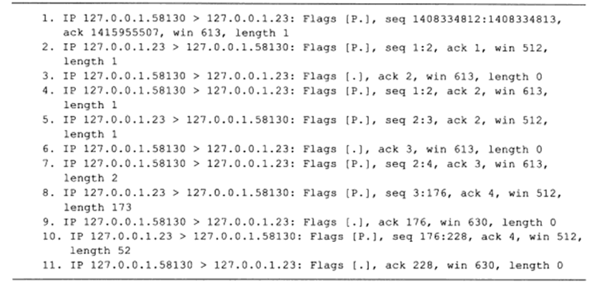 </div>

TCP 报文段 1 由客户端发送给服务器，它携带 1 个字节的应用程序数据，即字母 "l"。TCP 报文段 2 是服务器对 TCP 报文段 1 的确认，同时回显字母 "l"。TCP 报文段 3 是客户端对 TCP 报文段 2 的确认（TCP 协议的特性，发送出去的数据必须要得到它的确认，因此服务器发送过来的数据，客户端必须要发送确认）。第 4~6 个 TCP 报文段是针对字母 "s" 的上述过程。TCP 报文段 7 传送的 2 字节数据分别是：客户端键入的回车符和流结束符(EOF，本例中是 **`0x00`**)。TCP 报文段 8 携带服务器返回的客户查询的目录的内容(ls 命令的输出)，包括该目录下文件的文件名及其显示控制参数。TCP 报文段 9 是客户端对 TCP 报文段 8 的确认。TCP 报文段 10 携带的也是服务器返回给客户端的数据，包括一个回车符、一个换行符、客户端登录用户的 PS1 环境变量（第一级命令提示符）。TCP 报文段 11 是客户端对 TCP 报文段 10 的确认。

在上述过程中，客户端针对服务器返回的数据所发送的确认报文段(TCP 报文段 6、9 和 11)都不携带任何应用程序数据（长度为 0），而服务器每次发送的确认报文段 (TCP 报文段 2、5、8 和 10) 都包含它需要发送的应用程序数据。**<font color="red">服务器的这种处理方式称为延迟确认，即它不马上确认上次收到的数据，而是在一段延迟时间后查看本端是否有数据需要发送，如果有，则和确认信息一起发出</font>**。因为服务器对客户请求处理得很快，所以它发送确认报文段的时候总是有数据一起发送。延迟确认可以减少发送 TCP 报文段的数量。而由于用户的输入速度明显慢于客户端程序的处理速度，所以客户端的确认报文段总是不携带任何应用程序数据。前文曾提到，在 TCP 连接的建立和断开过程中，也可能发生延迟确认，也就是 TCP 结束连接一般是四次挥手，客户端（连接关闭发起方）发送 FIN 报文段，服务器回复 ACK 报文段，然后服务器再发送 FIN 报文段，结束从服务器到客户端方向的连接。但是有时候会出现服务器回复的 ACK 报文和 FIN 报文一起发送，于是四次挥手就变成了三次挥手，也就发生了延迟确认。

## 二、Nagle 算法详解

上例是在本地回路运行的结果，在局域网中也能得到基本相同的结果，但在广域网就未必如此了。广域网上的交互数据流可能经受很大的延迟，并且，携带交互数据的微小 TCP 报文段数量一般很多（一个按键输入就导致一个 TCP 报文段），这些因素都可能导致拥塞发生。解决该问题的一个简单有效的方法是使用 Nagle 算法。

Nagle 算法要求以下两点：

- 一个 TCP 连接的通信双方在任意时刻都最多只能发送一个未被确认的 TCP 报文段，在该 TCP 报文段的确认到达之前不能发送其他 TCP 报文段。
- 另一方面，发送方在等待确认的同时收集本端需要发送的微量数据，并在确认到来时以一个 TCP 报文段将它们全部发出。

这样就极大地减少了网络上的微小 TCP 报文段的数量。该算法的另一个优点在于其自适应性：确认到达得越快，数据也就发送得越快。TCP 中出现的另一个影响吞吐量问题叫做糊涂窗口综合征 (silly window syndrome) [RFC 813]，也会使 TCP 的性能变坏。设想一种情况：TCP 接收方的缓存已满，而交互式的应用进程一次只从接收缓存中读取 1 个字节(这样就使接收缓存空间仅腾出 1 个字节)，然后向发送方发送确认，并把窗口设置为 1 个字节(但发送的数据报是 40 字节长)。接着，发送方又发来 1 个字节的数据(请注意，发送方发送的 IP 数据报是 41 字节长)。接收方发回确认，仍然将窗口设置为 1 个字节。这样进行下去，使网络的效率很低。

要解决这个问题，可以让接收方等待一段时间，使得或者接收缓存已有足够空间容纳个最长的报文段，或者等到接收缓存已有一半空闲的空间。只要出现这两种情况之一，接收方就发出确认报文，并向发送方通知当前的窗口大小。此外，发送方也不要发送太小的报文段，而是把数据积累成足够大的报文段，或达到接收方缓存的空间的一半大小。上述两种方法（Nagle 算法和解决糊涂窗口综合征的算法）可配合使用。使得在发送方不发送很小的报文段的同时，接收方也不要在缓存刚刚有了一点小的空间就急忙把这个很小的窗口大小信息通知给发送方。

下面详细介绍 Nagle 算法和 Delayed Ack（延迟确认机制）。

### 1.Nagle 算法

Nagle 算法主要用来预防小分组的产生。在广域网上，大量 TCP 小分组极有可能造成网络的拥塞。Nagle 是针对每一个 TCP 连接的。它要求一个 TCP 连接上最多只能有一个未被确认的小分组（所谓 "小段"，指的是长度小于 MSS 尺寸的数据块，而未被确认则是指没有收到对方的 ACK 数据包）。在该分组的确认到达之前不能发送其他小分组。TCP 会搜集这些小的分组，然后在之前小分组的确认到达后将刚才搜集的小分组合并发送出去。

有时候我们必须要关闭 Nagle 算法，特别是在一些对时延要求较高的交互式操作环境中，所有的小分组必须尽快发送出去。我们可以通过编程取消 Nagle 算法，利用 **`TCP_NODELAY`** 选项来关闭 Nagle 算法。来看看 Nagle 大致的逻辑：

```java {.line-numbers}
if there is new data to send
  if the window size >= MSS and available data is >= MSS
    send complete MSS segment now
  else
    if there is unconfirmed data still in the pipe
      enqueue data in the buffer until an acknowledge is received
    else
      send data immediately
    end if
  end if
end if
```

另外参考 **`tcp_output.c`** 文件里 **`tcp_nagle_check`** 函数注释，Nagle 算法的具体实现如下所示：

- 如果包长度达到 MSS，则允许发送；
- 如果该数据包含有 FIN，则允许发送；
- 设置了 **`TCP_NODELAY`** 选项，则允许发送；
- 未设置 **`TCP_CORK`** 选项时，若所有发出去的小数据包（包长度小于 MSS）均被确认，则允许发送；
- 上述条件都未满足，但发送了超时（一般为 200 ms），则立即发送。

通过上面的逻辑可以看到，如果是大量数据需要发送，大部分情况都可以填满一个 MSS（也就不存在 "小包" 的问题），是不需要等待一个未确认包的。Nagle 算法是时代的产物，因为当时网络带宽有限。而当前的局域网、广域网的带宽则宽裕得多，所以目前的 TCP/IP 协议栈默认将 Nagle 算法关闭。

```java {.line-numbers}
long noDelay = 1;
setsockopt(m_hSocket, IPPROTO_TCP, TCP_NODELAY,(LPSTR)&noDelay, sizeof(long));
```

noDelay 为 1 打开 Nagle 算法，为 0 禁用 Nagle 算法。下面通过一些实验来验证。

#### 1.1.启用 Nagle 算法

实验要求：Client 端每次发送 1 个字节，将 hello 发送到 Server 端，然后 Server 再全部发送给 Client，其实要点在于 Client 的发送，预期的结果是：

1. 我们虽然一个字节一个字节的发，但是在协议中使用 Nagle 算法，可能会有延时等待的状况，即将几个字符合成一个片段进行发送；
2. 必须是收到对方的确认之后，才能再次发送；

实验结果如下所示：

<div align="center"> 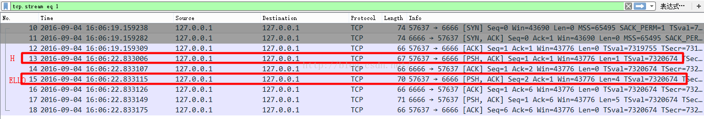 </div>

从图中的结果可以看出

- HELLO 被分成 2 个包发送了，应用层调用 send 5 次，由于 Nagle 算法，将 ELLO 合成一个包发送，这样大可以减少 Samll packet 的数量，增加 TCP 传输的效率。
- 分成的 2 个数据包，并没有连续被发出，这也符合 Nagle 算法的原则，即 TCP 连接上最多只能有一个未被确认的小分组，等待收到 ACK 之后，才发第二个封包。

#### 1.2.禁用 Nagle 算法

下面禁用 Nagle 算法，在默认的情况下，Nagle 算法是默认开启的，Nagle 算法比较适用于发送方发送大批量的小数据，并且接收方作出及时回应的场合，这样可以降低包的传输个数。同时协议也要求提供一个方法给上层来禁止掉 Nagle 算法。当你的应用不是连续请求+应答的模型的时候，而是需要实时的单项的发送数据并及时获取响应，这种 case 就明显不太适合 Nagle 算法，明显有 delay 的。Linux 提供了 **`TCP_NODELAY`** 的选项来禁用 Nagle 算法。

来看下禁用后同样发送 Hello 的实验结果：

<div align="center"> 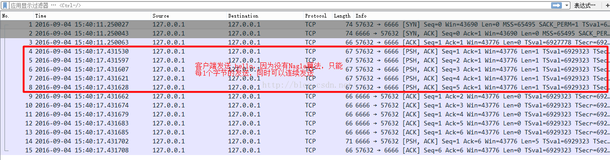 </div>

从实验结果中可以得出如下结论：

1. 禁止 Nagle 算法，每一次 send，都会组一个包进行发送，HELLO 被分成 5 个小包分别发送
2. 不用等待 ACK，可以连续发送

#### 1.3.Nagle 算法和 Delayed Ack

Nagle 指出 Nagle 算法与 Delay ACK 机制有共存的情况下会有一些非常糟糕的状况，比如举一个场景：PC1 和 PC2 进行通信，PC1 发数据给 PC2，PC1 使用 Nagle 算法，PC2 有 delay ACK 机制。

1. PC1 发送一个数据包给 PC2，PC2 会先不回应，delay ACK；
2. PC1 再次调用 send 函数发送小于 MSS 的数据，这些数据会被保存到 Buffer 中，等待 ACK，才能再次被发送；

从上面的描述看，显然已经死锁了，PC1 在等待 ACK，PC2 在 delay ACK，那么解锁的代价就是 Delay ACK 的 Timer 到期，至少 **`40ms[40ms~500ms 不等]`**，也就是 2 种算法在通信的时候，会产生不必要的延时。

可以看下实验的图示，9 包是发送 H 字符到 server，可以看到隔了 30ms 的 delay ack 延时才等到数据，发送一个 **`DATA+ACK`** 包，在这个时间段内其实也是用包发送的，但是 Nagle 算法是要等待 ACK 的到来才能发包的，所以也会看到 11 号包要在 ACK 包之后。如果 30ms 延时仍然没有数据，就是我们上述说的那样白白的等待一个 delay ack 超时。

<div align="center"> 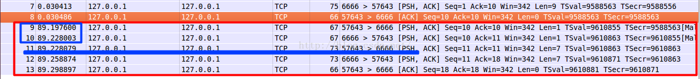 </div>

### 2.延迟确认机制（TCP delayed acknowledgment）

1989 RFC 1122 定义，全名 Delayed Acknowledgment，简称延迟 ACK，翻译为延迟确认。 与 Nagle 算法一样，延迟 ACK 的目的也是为了减少网络中传输大量的小报文数，但该报文数是针对 ACK 报文的。 一个来自发送端的报文到达接收端，TCP 会延迟 ACK 的发送，希望接收端应用程序会对刚刚收到的数据进行应答，这样就可以用新数据将 ACK 捎带过去。

### 3.当 Nagle 算法遇到 Delayed Ack

在一个有数据传输的 TCP 连接中，如果只有数据发送方启用 Nagle 算法，在其连续发送多个小报文时，Nagle 算法机制会减少网络中的小报文数量。这就意味着，传输相同大小的应用数据，在网络上的报文个数却不同。

举个例子，发送端需要连续发送 5 个写操作的小报文，首先发送第一个，由于 Nagle 算法的作用，在未收到第一个报文确认前，发送端不能发送后续写入的报文，这些写入的报文在等待 ACK 的时候会被保存到 TCP 发送缓冲区中，下一次会一起发送出去。接收端并未启用延迟确认（视 TCP delay ACK 时间为 0），尽管接收端刚收到该报文就发出确认，但由于网络延时的原因，在收集齐另外 4 个小报文后，发送方才收到了第一个报文的 ACK，则后面的 4 个报文会一起发送出去（大小未超过 MSS），接收端再次 ACK。

<div align="center"> 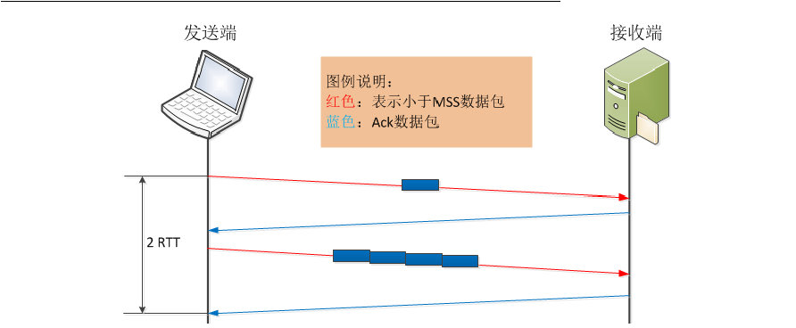 </div>

在上述发送 5 个小报文的过程中，只用了 4 个报文就实现了。但如果发送端未启用 Nagle 算法，完成整个过程则至少需要 8 个报文或 10 个报文才能实现，如下图所示（这里接收端未启用延迟确认）。启用 Nagle 算法和未启用 Nagle 算法的场景中，从完成数据发送的时间来看，未启用 Nagle 算法的方式花费的时间会更长一些，如下图所示。这里基本看到了 Nagle 算法的好处了。

<div align="center"> 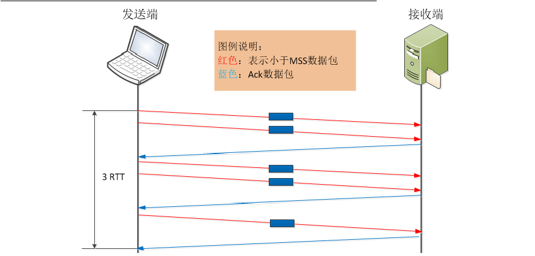 </div>

还是上述数据传输场景，发送端未启用 Nagle 算法，但接收端延迟确认默认时间为 200ms，来看看这时的情况。RFC 1122 规定，Delayed ACK 对单个的小报文可以延长确认的时间，但不允许有两个连续的小报文不被确认。所以，当发送端连续发送两个报文后，接收端必须给予确认。这时的数据传输情况如下图，只有当第 5 个报文到达后，接收端由于延迟确认机制，会导致 200ms 的延时存在。

<div align="center"> 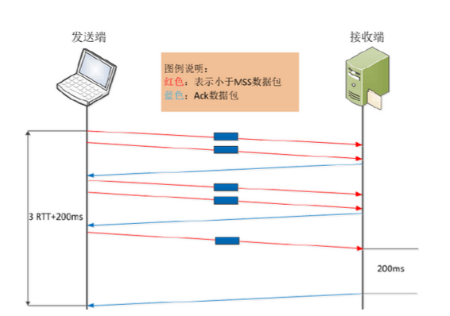 </div>

接下来看看，当 Nagle 算法遇到 Delayed ACK 时会是什么情况。按照常理推断，两种深思熟虑的功能设计，应该是 1+1>2 的效果。具体如何，还是请事实说话。先继续看上面的假设场景，该场景要求发送端向接收端发送 5 个连续的写操作数据，但网络延时较大，同时发送端启用 Nagle 算法，接收端 Delayed ACK 默认为 200ms。

发送方先发出一个小报文，接收端收到后，由于延迟确认的机制，等待发送方的下一个报文到达。而发送方由于 Nagle 算法机制，在未接收到第一个报文的确认前，不会发送已读取到的报文。 在这种场景下，暂不考虑应用处理时间，完成整个数据传输所需时间为 **`2RTT+400ms`**，貌似情况不是特别糟糕。

<div align="center">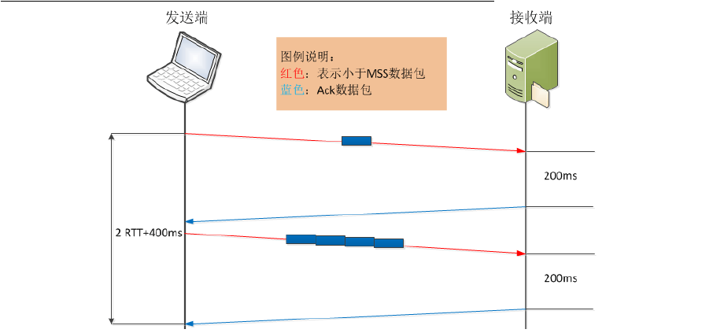</div>

如果上述其他条件不变，发送方应用写操作延时稍微变大，或发送端的应用操作延时稍大，我们再看看，完成这个操作的延时情况。 发送方先发出一个小报文，接收端收到后，由于延迟确认的机制，等待发送方的下一个报文到达。由于发送方应用数据写操作延时较大，在经过 **`RTT+200ms`** 后，读取到了下一个需要发送的内容，此时接收到了第一个报文的确认，发送方需要再将第二个小报文发送出去，以此类推，直到最后一个小报文被发送，且接收到该报文的确认，此时整个数据传输过程完成。在这种情景下，完成整个数据传输所需时间则为 **`5RTT + 5 * 200ms`**，明显增大了不少。如果相同情境下，有成千上万的小报文发送，则整体使用时间相当可观了。

<div align="center">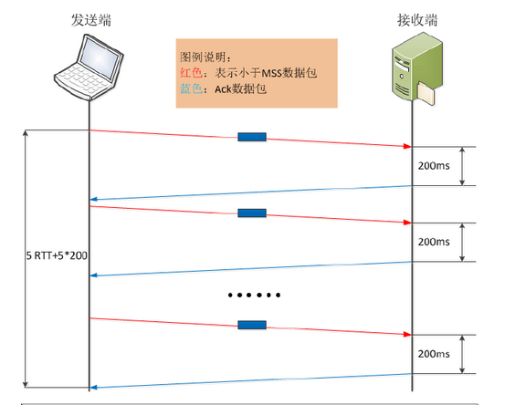</div>

## 三、交互式输入

一些有关 TCP 通信量的研究发现，如果按照分组数量计算，约有一半的 TCP 报文段包含成块数据（如 FTP、电子邮件和 Usenet 新闻），另一半则包含交互数据（如 Telnet 和 Rlogin）。如果按字节计算，则成块数据与交互数据的比例约为 90% 和10%。这是因为成块数据的报文段基本上都是满长度（full-sized）的（通常为 512 字节的用户数据），而交互数据则小得多（上述研究表明 Telnet 和 Rlogin 分组中通常约 90% 左右的用户数据小于 10 个字节）。很明显，TCP 需要同时处理这两类数据，但使用的处理算法则有所不同。本章将以 Rlogin 应用为例来观察交互数据的传输过程。**<font color="red">将揭示经受时延的确认是如何工作的以及 Nagle 算法怎样减少了通过广域网络传输的小分组的数目，这些算法也同样适用于 Telnet 应用。</font>**

首先来观察在一个 Rlogin 连接上键入一个交互命令时所产生的数据流。许多 TCP/IP 的初学者很吃惊地发现通常每一个交互按键都会产生一个数据分组，也就是说，每次从客户传到服务器的是一个字节（而不是每次一行）。而且，Rlogin 需要远程系统（服务器）回显我们（客户）键入的字符。这样就会产生 4 个报文段：（1）来自客户的交互按键；（2）来自服务器的按键确认;（3）来自服务器的按键回显；（4）来自客户的按键回显确认。下图表示了这个数据流。

<div align="center"> 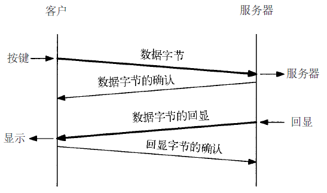 </div>

然而，我们一般可以将报文段 2 和 3 进行合并——按键确认与按键回显一起发送。之后将描述这种合并的技术（称为经受时延的确认）。在这里我们使用 Rlogin 作为例子，因为它每次总是从客户发送一个字节到服务器，而 Telnet 有一个选项允许客户发送一行到服务器，通过使用这个选项可以减少网络的负载。下图显示的是当我们键入 5 个字符 **`date\n`** 时的数据流。第 1 行客户发送字符 a 到服务器。第 2 行是该字符的确认及回显（也就是上图的中间两部分数据的合并）。第 3 行是回显字符的确认。与字符 a 有关的是第 4-6 行，与字符 t 有关的是第 7-9 行，第 10-12 行与字符 e 有关。**<font color="red">第 3-4、6-7、9-10 和 12-13 行之间半秒左右的时间差是键入两个字符之间的时延</font>**。

<div align="center"> 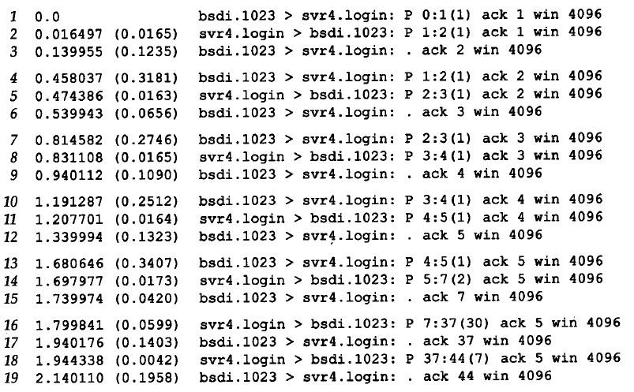 </div>

注意到 13~15 行稍有不同。从客户发送到服务器的是一个字符（按下 RETURN 键后产生的 UNIX 系统中的换行符），而回显的则是两个字符。这两个字符分别是回车和换行字符（**`CR/LF`**），它们的作用是将光标回移到左边并移动到下一行。第 16 行是来自服务器的 date 命令的输出。这 30 个字节由 28 个字符与最后的 **`CR/LF`** 组成。紧接着从服务器发往客户的 7 个字符（第 18 行）是在服务器主机上的客户提示符：**`svr4%`**。第 19 行确认了这 7 个字符。下图表示上面这幅图的数据交换的时间系列（在该时间系列中，去掉了所有的窗口通告，并增加了一个记号来表明正在传输何种数据。

<div align="center"> 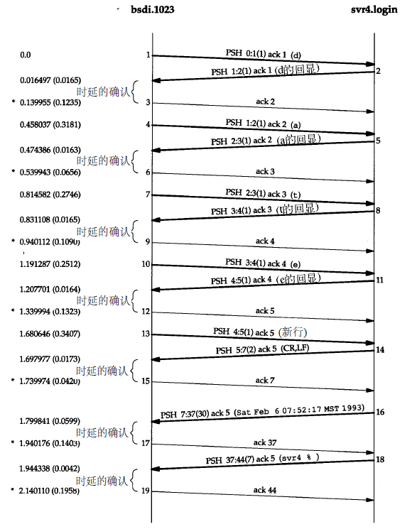 </div>

把从 bsdi 发送到 srv4 的 7 个 ACK 标记为经受时延的 ACK。通常 TCP 在接收到数据时并不立即发送 ACK；相反，它推迟发送，以便将 ACK 与需要沿该方向发送的数据一起发送（有时称这种现象为数据捎带 ACK）。绝大多数实现采用的时延为 200ms，也就是说，TCP 将以最大 200ms 的时延等待是否有数据一起发送。**<font color="red">在 Host Requirements RFC 中声明 TCP 需要实现一个经受时延的 ACK，但时延必须小于 500ms。</font>**

## 四、Nagle 算法

### 1.开启 Nagle 算法

在前一节我们看到，在一个 Rlogin 连接上客户一般每次发送一个字节到服务器，这就产生了一些 41 字节长的分组：20 字节的 IP 首部、20 字节的 TCP 首部和 1 个字节的数据。在局域网上，这些小分组通常不会引起麻烦，因为局域网一般不会出现拥塞。**<font color="red">但在广域网上，这些小分组则会增加拥塞出现的可能。</font>** 一种简单和比较好的方法就是采用 RFC896[Nagle1984 ] 中所建议的 Nagle 算法。**<font color="red">该算法要求一个 TCP 连接上最多只能有一个未被确认的未完成的小分组，在该分组的确认到达之前不能发送其他的小分组。</font>** 相反，TCP 收集这些少量的分组，并在确认到来时以一个分组的方式发出去。

我们接下来看一下广域网上的两台主机 slip 和 vangogh.cs.berkeley.edu 之间的 Rlogin 连接的工作情况，我们在 slip 客户端中快速键入字符（像一个快速打字员一样）时的一些数据流时间信息。比较图 4 与图 3，我们首先注意到从 slip 到 vangogh 不存在经受时延的 ACK。这是因为在时延定时器溢出之前总是有数据等待发送，在 slip 发送这些数据时，会捎带发送确认给服务器 vangogh。

其次，注意到从左到右待发数据的长度是不同的，分别为：1、1、2、1、2、2、3、1 和 3 个字节。**<font color="red">这是因为客户只有收到前一个数据的确认后才发送已经收集缓存的数据。</font>** 通过使用 Nagle 算法，为发送 16 个字节的数据客户只需要使用 9 个报文段，而不再是 16 个。报文段 14 和 15 看起来似乎是与 Nagle 算法相违背的，但我们需要通过检查序号来观察其中的真相。因为确认序号是 54，因此报文段 14 是报文段 12 中确认的应答。但客户在发送该报文段之前，接收到了来自服务器的报文段 13，报文段 15 中包含了对序号为 56 的报文段 13 的确认。

因此即使我们看到从客户到服务器有两个连续返回的报文段，客户也是遵守了 Nagle 算法的。在图 4 中可以看到存在一个经受时延的 ACK，但该 ACK 是从服务器到客户的（报文段 12），因为它不包含任何数据，因此我们可以假定这是经受时延的 ACK。服务器当时一定非常忙，因此无法在服务器的定时器溢出前及时处理所收到的字符（也就是无法及时处理收到的字符，然后发送给客户端回显字符，捎带回送确认）。

最后看一下最后两个报文段中数据的数量以及相应的序号。客户发送 3 个字节的数据（18，19 和 20），然后服务器确认这 3 个字节（最后的报文段中的 ACK21），但是只返回了一个字节（标号为 59）。这是因为当服务器的 TCP 一旦正确收到这 3 个字节的数据，就会返回对该数据的确认，但只有当 Rlogin 服务器发送回显数据时，它才能够发送这些数据的回显（说明 Rlogin 服务器还没有来得及处理这 3 个字节数据，它们依然停留在 TCP 的接收缓冲区中）。这表明 TCP 可以在应用读取并处理数据前发送所接收数据的确认。TCP 确认仅仅表明 TCP 已经正确接收了数据。最后一个报文段的窗口大小为 8189 而非 8192，表明服务器进程尚未读取这三个收到的数据。

<div align="center"> 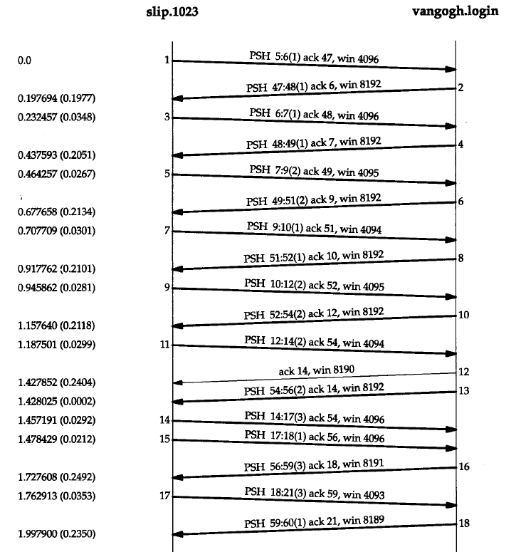 </div>

### 2.关闭 Nagle 算法

有时我们也需要关闭 Nagle 算法。一个典型的例子是 X 窗口系统服务器：小消息（鼠标移动）必须无时延地发送，以便为进行某种操作的交互用户提供实时的反馈。这里将举另外一个更容易说明的例子——在一个交互注册过程中键入终端的一个特殊功能键。这个功能键通常可以产生多个字符序列，经常从 ASCII 码的转义（escape）字符开始。如果 TCP 每次得到一个字符，它很可能会发送序列中的第一个字符（ASCII 码的 ESC），然后缓存其他字符并等待对该字符的确认（Nagle 算法）。但当服务器接收到该字符后，它并不发送确认，而是继续等待接收序列中的其他字符。这就会经常触发服务器的经受时延的确认算法，表示剩下的字符客户端没有在 200ms 内发送。对交互用户而言，这将产生明显的时延。**<font color="red">套接字 API 用户可以使用 **`TCP_NODELAY`** 选项来关闭 Nagle 算法。</font>** 下面举一个例子。

可以在 Nagle 算法和产生多个字符的按键之间看到这种交互的情况。在主机 slip 和主机 vangogh.cs.berkeley.edu 之间建立一个 Rlogin 连接，然后按下 F1 功能键，这将产生 3 个字节：一个 escape、一个左括号和一个 M。然后再按下 F2 功能键，这将产生另外 3 个字节。图 5 表示的是 tcpdump 的输出结果（我们去掉了其中的服务类型和窗口通告）。

<div align="center"> 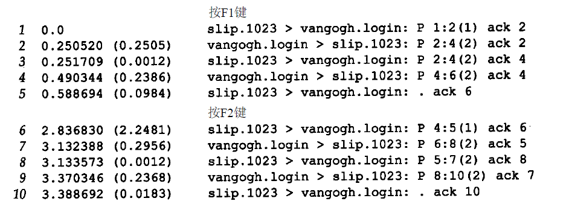 </div>

上面的图 5 表示这个交互过程的时间系列。在该图的下面部分我们给出了从客户发送到服务器的 6 个字节和它们的序号以及将要返回的 8 个字节的回显。

<div align="center"> 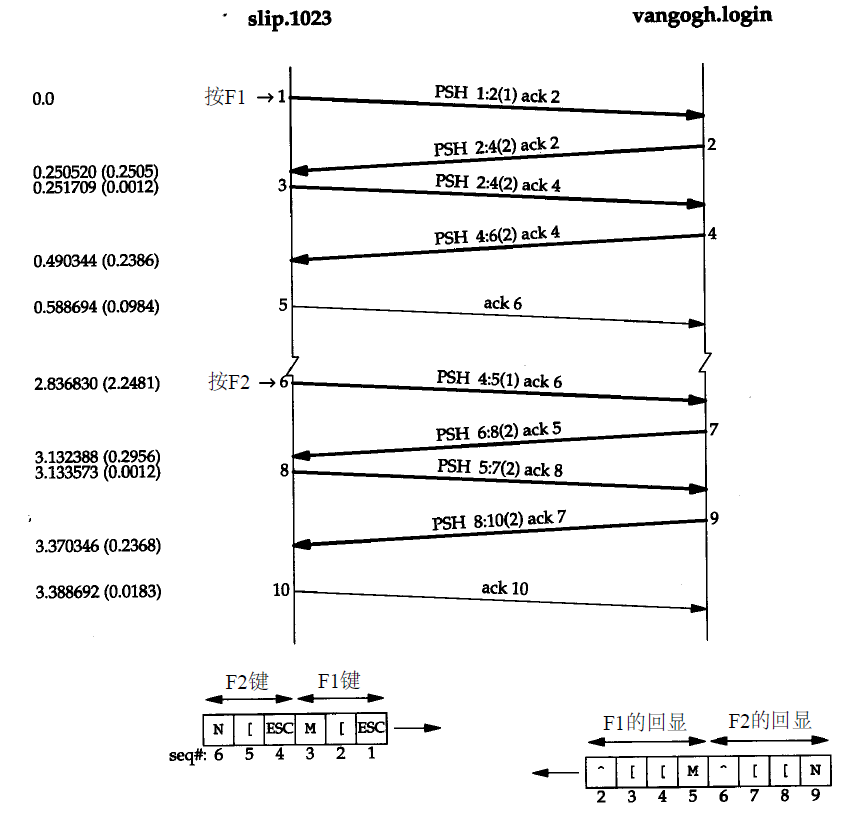 </div>

当 rlogin 客户读取到输入的第 1 个字节并向 TCP 写入时，该字节作为报文段 1 被发送。这是 F1 键所产生的 3 个字节中的第 1 个。它的回显在报文段 2 中被返回，此时剩余的 2 个字节才被发送（报文段 3）。这两个字节的回显在报文段 4 被接收，而报文段 5 则是对它们的确认。第 1 个字节的回显为 2 个字节（报文段 2）的原因是因为在 ASCII 码中转义符的回显是 2 个字节：插入记号和一个左括号。剩下的两个输入字节：一个左括号和一个 M，分别以自身作为回显内容。现在我们使用一个修改后关闭了 Nagle 算法的 rlogin 版本重复同样的实验。下图 7 显示了 tcpdump 的输出结果（同样去掉了其中的服务类型和窗口通告）。

<div align="center"> 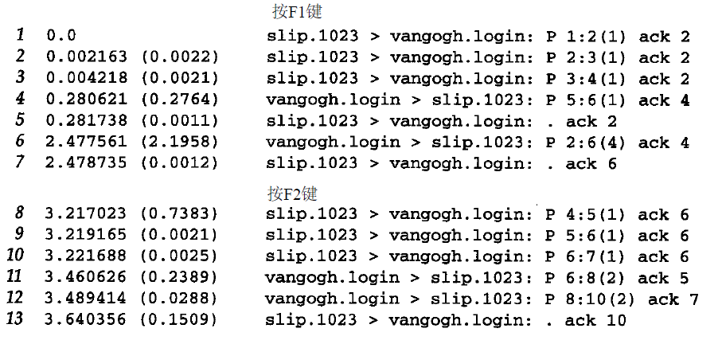 </div>

我们注意到的第 1 个变化是当 3 个字节准备好时它们全部被发送（报文段 1、2 和 3）。**<font color="red">没有时延发生——Nagle 算法被禁止。</font>** 在 tcpdump 输出中的下一个分组（报文段 4）中带有来自服务器的第 5 个字节及一个确认序号为 4 的 ACK。这是不正确的，因为客户并不希望接收到第 5 个字节，因此它立即发送一个确认序号为 2 而不是 6 的响应（没有被延迟）。看起来一个报文段丢失了（这个报文段包含第 2、3 和 第 4 个字节，且其确认序号为 3），在图 8 中我们用虚线表示。

现在回到禁止 Nagle 算法的讨论中来。可以观察到键入的下一个特殊功能键所产生的 3 个字节分别作为单独的报文段（报文段 8、9 和 10）被发送。这一次服务器首先回显了报文段 8 中的字节（报文段 11），然后回显了报文段 9 和 10 中的字节（报文段 12）。

<div align="center"> 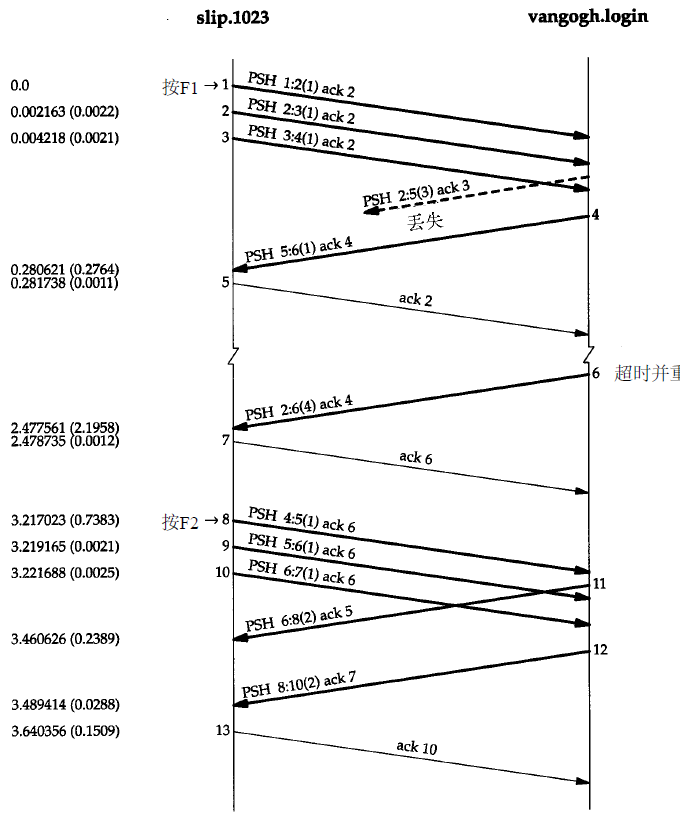 </div>
