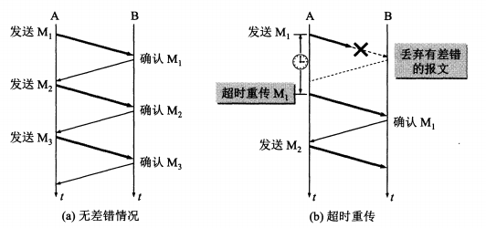
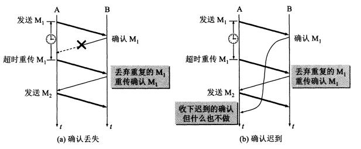
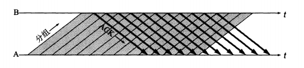
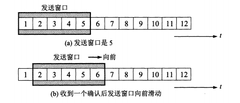

# TCP 协议之停止等待和 ARQ 协议

# 0 前言

我们知道 TCP 发送的报文段是交给 IP 层传送的。但是 IP 层只能提供 "尽最大努力服务"，也就是说 TCP 下面的网络所提供的是 "不可靠的传输"。因此 TCP 必须使用一些可靠地传输协议，当出现差错的情况下，让发送方重传出现差错的数据。同时在接收方来不及处理的情况下，即时的告知发送方适当的降低发送数据速率。这样就可以使不可靠的传输信道实现可靠传输。下面先介绍最简单的停止等待协议。注意，停止等待协议和 ARQ 协议只是为了讲解一下可靠传输的原理，而不是说 TCP 真正采用了这两种算法，不过停止等待协议和 ARQ 中的一些思想被 TCP 协议采纳，比如超时重传，确认，以及累积确认等。

# 1.停止等待协议

在下面的例子中，A 为发送方，B 为接收方。停止等待协议是指发送方每发送完一个分组，就停止发送，等待接收方的确认。在收到确认后，再发送下一个分组。停止等待协议的核心是：当一个分组被发送出去之后，必须要接收到此分组的确认，才能发送下一个分组。另外，对于每个分组，都设定一个计时器，如果在计时时间内没有收到该分组的确认，发送方就要重传此分组。并且在接收到确认之前，该分组的副本一定要保存在发送方的缓存中。

在停止等待协议中，可能会出现 4 种错误：

- A 发送的分组中途丢失：A 超时重传可以解决；
- 分组传送的过程中出错被 B 检测出来并且丢弃：A 超时重传可以解决；
- B 发送的确认丢失了：B 丢弃 A 重复发送的分组，并再次发送确认；
- B 发送的确认在网络中某处滞留了较长时间（超过了超时重传时间）：A 直接丢弃延迟一段时间后到达的确认；

## 1.1 无差错情况

停止等待协议可以用下图来说明，图 (a) 是最简单的无差错情况，A 发送分组 M1，发送完就暂停发送，等待 B 的确认。B 收到了 M1 就向 A 发送确认，A 在收到了对 M1 确认之后，就再发送下一个分组 M2。

     

## 1.2 出现差错

上图中的 (b) 是分组在传输的过程中出现差错的情况，假设 M1 在传输的过程中丢失了，或者由于发送的分组 M1 出现了差错被 B 丢弃，在这两种情况下，B 都不会发送任何消息。可靠传输协议对于这种情况是这么处理的：A 只要超过一段时间任然没有受到确认，就认为刚才发送的分组丢失了，因而重传前面发送的分组。这叫做超时重传。要实现超时重传，就要在发送完每一个分组的时候设置一个超时计时器。如果在超时计时器到期之前收到了对方的确认，就撤销已设置的超时计时器。

这里应注意以下三点。

1. A 在发送完一个分组后，必须暂时保留已发送的分组的副本（在发生超时重传时使用)。只有在收到相应的确认后才能清除暂时保留的分组副本。
2. 分组和确认分组都必须进行编号。这样才能明确是哪一个发送出去的分组收到了确认，而哪一个分组还没有收到确认。
3. 超时计时器设置的重传时间应当比数据在分组传输的平均往返时间更长一些。图（b）中的一段虚线表示如果 M1 正确到达 B 同时 A 也正确收到确认的过程。可见重传时间应设定为比平均往返时间更长一些。显然，如果重传时间设定得很长，那么通信的效率就会很低。但如果重传时间设定得太短，以致产生不必要的重传，就浪费了网络资源。

## 1.3 确认丢失和确认迟到

如果 A 在设定的超时重传时间内没有收到确认，可能是由以下 4 中情况：A 发送的分组中途丢失、分组传送的过程中出错被 B 检测出来并且丢弃、B 发送的确认丢失了或者 B 发送的确认在网络中某处滞留了较长时间（超过了超时重传时间）。对于前两种情况，A 直接超时重传就可以解决。对于后两种情况，A 在超时计时器到期后要重传 M1，现在应该注意 B 的动作，B 又收到了重传的分组 M1，这时应该依次采取两个行动：

- 丢弃这个重复的分组 M1，不向上层交付
- 向 A 发送确认，不能认为已经发送过的确认就不能再发送，因为 A 之所以重传 M1 就表示 A 没有收到对 M1 的确认

     

(b) 就是上面所说的第四种情况，传输的过程没有出现差错，但是 B 对分组 M1 的确认迟到了。其中 B 仍然会收到重复的 M1，并且同样要丢弃重复的 M1，并重传确认分组，A 对重复确认的处理很简单，收下后就丢弃。因此根据我们所讲的策略，A 最终总是可以收到对所有发出的分组的确认。如果 A 不断重传分组但总是收不到确认，就说明通信线路太差，不能进行通信。

使用上述的确认和重传机制，我们就可以在不可靠的传输网络上实现可靠通信。像上述的这种可靠传输像这种可靠传输协议常称为自动重传协议 ARQ（Automatic Repeat reQuest），也就是说发送方的重传请求是自动进行的，接收方不需要请求方对发送方重传某个出错的分组。

# 2 连续 ARQ 协议

为了提高传输效率以及信道利用率，发送方可以不使用低效率的停止等待协议，而是采用流水线传输。流水线传输就是发送方可以连续发送多个分组，不必每发完一个分组就停顿下来等待对方的确认，这样就可以使信道上一直有数据不间断地在传送。显然，这种传输方式可以获得很高的信道利用率。当使用流水线传输时，就要使用下面介绍的连续 ARQ 协议和滑动窗口协议。

     

下图表示发送方维持的发送窗口，它的意义是：位于发送窗口内的 5 个分组都可连续发送出去，而不需要等待对方确认，这样信道的利用率就提高了。连续的 ARQ 协议规定，发送方每收到一个确认，就把滑动窗口向前滑动一个分组的位置。下图 (b) 表示发送方收到了对第 1 个分组的确认，于是把发送窗口向前移动一个分组的位置。

     

接收方一般都是采用累积确认的方式，也就是说，接收方不必对收到的分组逐个发送确认，而是在收到几个分组后，对按序到达的最后一个分组发送确认，这就表示：到这个分组为止的所有分组都已经正确地收到了。累积确认有优点也有缺点。优点是：容易实现，即使确认丢失也不必重传（前面的确认丢失之后，如果收到了后面的确认，那么也不必重传）。但缺点是不能向发送方反映出接收方已经正确收到的所有分组的信息。例如，如果发送方发送了前 5 个分组，而中间的第 3 个分组丢失了。这时接收方只能对前两个分组发出确认。发送方无法知道后面三个分组的下落，而只好把后面的三个分组都再重传一次。这就叫做 Go-back-N (回退 N)，表示需要再退回来重传已发送过的 N 个分组。可见当通信线路质量不好时，连续 ARQ 协议会带来负面的影响。
