# TCP 协议之可靠传输原理

在这一节，讨论可靠数据传输（reliable data transportation）的原理，注意这里讨论并且使用的可靠传输数据传输技术不仅仅可以用在 TCP 协议上，更可以运用到一般的计算机网络协议中。**我们所使用的可靠数据传输协议（rdt）为上层实体提供的抽象是：数据可以通过一条可靠的信道进行传输。** 借助于可靠信道，传输数据比特就不会受到损坏（由 0 变为 1，或者相反）或丢失，而且所有数据都是按照其发送顺序进行交付。这恰好就是 TCP 向调用它的因特网应用所提供的服务模型。实现这种服务抽象是可靠数据传输协议（reliable data transfer protocol）的责任。由于可靠数据传输协议的下层协议也许是不可靠的，因此这是一项困难的任务。

在本节中，我们考虑的底层信道模型越来越复杂，会出现越来越多种类型的错误，比如最开始假设底层信道完全可靠，然后假设分组在信道传输的过程中会出现差错（会受损），最后就是假设会出现分组丢失（但是注意，我们在讨论的过程中始终假设信道不会对分组进行重排序）。接着根据这些不断变复杂的信道模型，我们将迭代开发一个可靠数据传输协议的发送方一侧和接收方一侧，直至最后达到一个非常完美的可靠数据传输协议。

 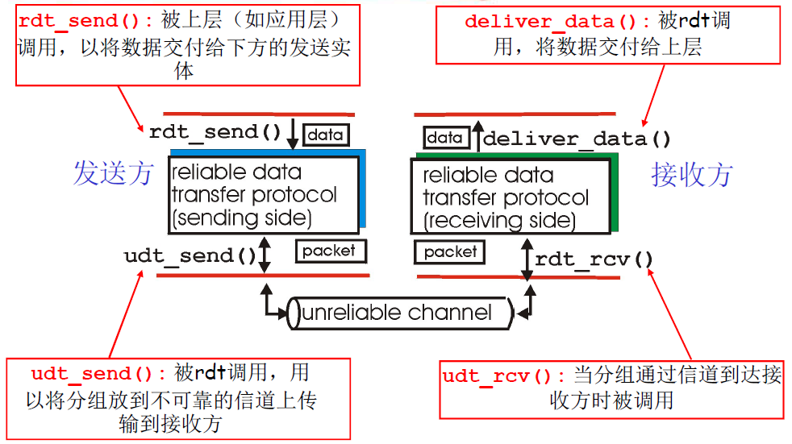 

上图示说明了用于数据传输协议的接口。通过调用 `rdt_send()` 函数，上层可以调用数据传输协议的发送方。它将要发送的数据交付给位于接收方的较高层。在接收端，当分组从信道的接收端到达时，将调用 `rdt_rcv()`。当 rdt 协议想要向较高层交付数据时，将通过调用 `deliver_data()` 来完成。后面，我们将使用术语 "分组" 而不用运输层的 "报文段"。因为本节研讨的理论适用于一般的计算机网络，而不只是用于因特网运输层，所以这时采用通用术语 "分组" 也许更为合适。

## 1.经完全可靠信道的可靠数据传输：rdt1.0

rdt1.0 假设信道是完全可靠的，也就是发送方发送的数据和接收方发送的确认不会丢失，也不会在传输的过程中出现差错，比如 0 比特变为 1 比特，1 比特变为 0 比特。同时假设接收方接收数据的速率和发送方发送数据的速率一样快（不需要进行流量控制）。**在这种情况下，发送方发送数据时只需要调用 `rdt_send(data)` 函数，并且将分组发送到信道中。** 而接收方通过调用 `rdt_rcv(packet)` 接收传递过来的数据即可，接收方不需要发送任何反馈给发送方。rdt1.0 协议中发送方和接收方的有限状态机图 FSM 如下所示：

 
    
rdt1.0 协议的发送端

    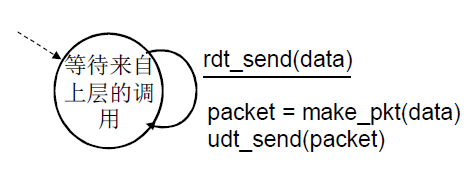

 
    
rdt1.0 协议的接收端

    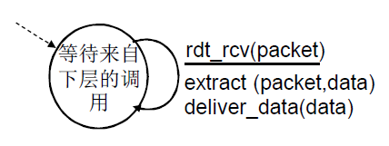

在这个简单的协议中，一个单元数据与一个分组没差别。而且，所有分组是从发送方流向接收方；有了完全可靠的信道，接收端就不需要提供任何反馈信息给发送方，因为不必担心出现差错，从上面的 FSM 中可以看出，发送端只需要不断发送分组给接收方即可，而接收方不断地接收数据。注意到我们也已经假定了接收方接收数据的速率能够与发送方发送数据的速率一样快。因此，接收方没有必要请求发送方慢一点。

## 2.经具有比特差错信道的可靠数据传输 rdt2.0

rdt2.0 协议考虑信道上可能出现的差错（更为实际的信道模型），比如比特 0 变成 1 或者反之，在分组的传输、传播或者缓存的过程中，这种比特差错通常会出现在网络的物理部件中。但是 rdt2.0 协议仍然假定所有发送的分组将按其发送的顺序被接收。另外注意，rdt2.0 协议只考虑发送方发送的数据分组出现差错的情况，而还没有考虑接收方发送的反馈 ACK 或者 NAK 分组出现差错，也不考虑出现包丢失的情况。

因此 rdt2.0 协议相比于 rdt1.0 需要增加以下三个功能：

1. 差错检测：首先，需要一种机制以使接收方检测到何时出现了比特差错。因此除了发送方发送的数据分组之外，还需要发送额外的比特用于差错检测，这个字段叫做分组检验和字段
2. 接收方反馈：rdt2.0 协议将从接收方向发送方回送 ACK 与 NAK 分组，表示发送方发送的数据是否出现差错，如果出现了，回复 NAK，否则回复 ACK。理论上，这些分组只需要一个比特长度;如用 0 表示 NAK，用 1 表示 ACK。这些控制报文使得接收方可以让发送方知道哪些内容被正确接收，哪些内容接收有误并因此需要重复。在计算机网络环境中，基于这样重传机制的可靠数据传输协议称为自动重传请求 (Automatic Repeat reQuest, ARQ) 协议。
3. 重传：接收方收到有差错的分组时，发送方将重传该分组文。

可以这么理解 rdt2.0 协议的三个功能，因为信道可能在传输过程中出现差错，因此需要数据分组要携带额外的比特来进行差错检测，另外如果接收方接收到了出现差错的数据，那么就必须要让发送方知道，所以使用 ACK 或者 NAK 来进行反馈，并且必须重传出错分组。rdt2.0 协议的有限状态机图 FSM 如下所示：

 
    
rdt2.0 协议的发送端

    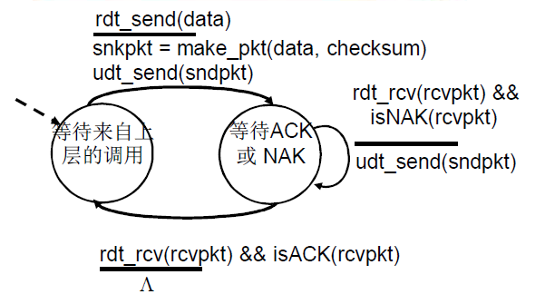

 
    
rdt2.0 协议的接收端

    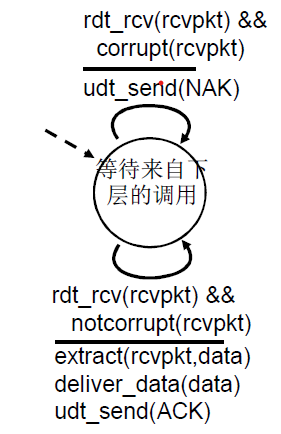

rdt2.0 协议的有限状态机的发送方 sender：

1. 发送方发送带有检验和的数据，然后等待接收方回复 ACK 或者 NAK
2. 如果发送方发送的数据分组出现差错，那么接收方回复 NAK，发送方重传数据，然后再次等待响应
3. 如果发送方接收到 ACK 响应，那么就说明数据分组被正常接收，那么发送方继续发送下一个分组数据

rdt2.0 协议的有限状态机的发送方 receiver：

1. 如果数据分组正常，那么就直接回复 ACK
2. 如果数据分组出现差错，那么直接回复 NAK

另外，当发送方处于等待 ACK 或 NAK 的状态时，它不能从上层获得更多的数据；这就是说，`rdt_send()` 事件不可能岀现；仅当接收到 ACK 并离开该状态时才能发生这样的事件。因此，只有当发送方发送出去的数据被接收方正确接收时，发送方才会发送下一个分组。**由于这种行为，rdt2.0 这样的协议被称为停止等待 (`stop-and-wait`) 协议。**

另外还需要注意的是，当发送方处于等待 ACK 或者 NAK 的状态时，它不能从上层获得更多的数据；这就是说，`rdt_send()` 事件不可能岀现；仅当接收到 ACK 并离开该状态时才能发生这样的事件。因此，发送方将不会发送 一块新数据，除非发送方确信接收方已正确接收当前分组。由于这种行为，rdt2.0 这样的协议被称为停等 (`stop-and-wait`) 协议。

## 3.可靠数据传输协议 rdt2.1

rdt2.1 协议相比于 rdt2.0 协议来说，考虑到了接收方发出的 ACK 或者 NAK 出现差错的情况，这里的难点在于，如果一个 ACK 或 NAK 分组受损，发送方无法知道接收方是否正确接收了上一块发送的数据。也就是发送方无法分辨传递过来的到底是 ACK 还是 NAK。

为了处理接收方发送的 ACK 和 NAK 分组受损的情况，当发送方收到受损的 ACK 和 NAK 消息时，就直接重发之前发送的数据分组。但是这样做会存在一个问题，就是对于 rdt2.0 这种简单的停止等待协议，接收方收到发送端重发的分组之后，并不知道这个分组是新的分组，还是重发的，这是因为 rdt2.0 协议发送的分组全部没有编号，所以接收方收到重传之后区分不了。

**因此发送方必须对发送出去的数据分组进行编号，这样接收方只需要检查序号就可以确定收到的分组是否为一次重传。** 但是对于像 rdt2.0 这种简单的停止等待协议，只需要使用一个 bit 来进行编号就可以。比如发送方发送的第一个数据分组编号为 0，而接收方接收并返回 ACK，发送方收到正常的 ACK，然后就会继续发送编号为 1 的数据分组，当这个分组也被正常接收，并且接收方返回的 ACK 也是正常的，发送方就再次发送编号为 0 的分组，这样不断循环。另外，如果接收方收到重复分组，那么就会丢弃重复分组，并且向发送方发送确认（收到重复分组就说明确认出现了差错）。

但是当发送方发送编号为 0 的分组之后，接收方返回的 ACK 在信道中出现差错，发送方检测到之后，仍然会发送编号为 0 的分组。在接收方接收到 0 号分组并且正常返回 ACK 之后，它希望接收到编号为 1 的分组，但是却接收到了 0 号分组，这就说明是发送方在进行重传，即自己发送的 ACK 出现了差错，马上重传 ACK。因为目前我们假定信道不丢分组，ACK 和 NAK 分组本身不需要指明它们要确认的分组序号。发送方知道所接收到的 ACK 和 NAK 分组（无论是否是含糊不清的）是为响应其最近发送的数据分组而生成的。rdt2.1 协议的有限状态机图如下所示：

 
    
rdt2.1 协议的发送端

    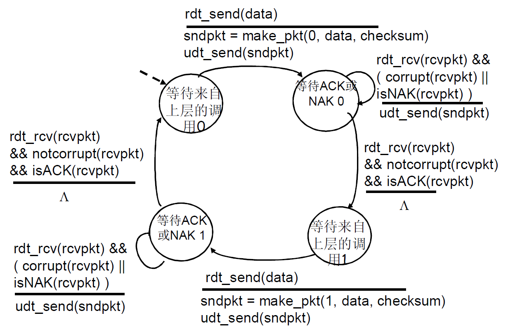

 
    
rdt2.1 协议的接收端

    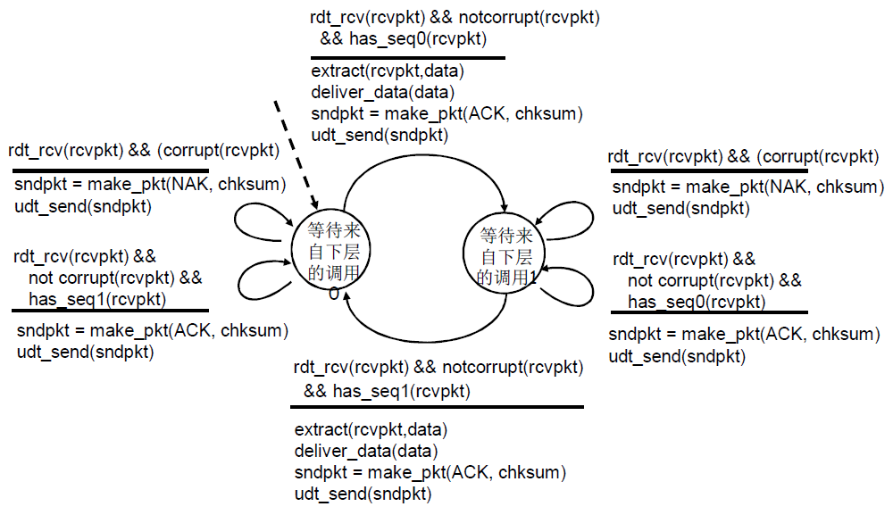

接下来介绍一下 rdt2.1 协议的有限状态机（FSM）的发送方 sender：

1. 首先发送方发送 0 号分组（编号为 0 的分组，下同），然后就等待 ACK 或者 NAK 确认。
2. 如果正常接收到了 NAK，就说明 0 号数据分组发送过程中出现了差错，因此需要重新发送 0 号数据分组。
3. 如果接收到的 ACK 或者 NAK 出现了差错，也要重传 0 号分组。
4. 如果正常接收到了 ACK，那么就接着发送 1 号数据分组。
5. 1 号分组发送和接收确认也经历和上面类似的过程，如果正常接收到了 ACK，那么就继续发送 0 号分组。

接下来介绍一下 rdt2.1 协议的有限状态机（FSM）的接收方 receiver：

1. 如果接收方收到了受损的 0 号分组，就会返回 NAK 给发送方，并继续等待接收 0 号分组，这里要注意一种特殊情况，那就是接收方发送的 NAK 受损，发送方检测之后，也是再发送 0 号分组，直到接收方正常接收，并且正常返回 ACK
2. 如果正确接收到了 0 号分组，就返回 ACK 确认给发送方，并且接下来等待接收 1 号分组；
3. 如果在等待接收到 1 号分组的过程中，又收到了 0 号分组，那么就说明之前发送的 ACK 受损，应该立即再次发送 ACK 分组。
4. 接下来对 1 号分组的处理也是和上面类似的过程

## 4.可靠数据传输协议 rdt2.2

rdt2.2 是在有比特差错信道上实现的一个无 NAK 的可靠数据传输协议，如果不发送 NAK，而是对上次正确接收的分组发送一个 ACK，我们也能实现与 NAK 一样的效果。发送方接收到对同一个分组的两个 ACK (即接收冗余 ACK (duplicate ACK)) 后，就知道接收方没有正确接收到跟在被确认两次的分组后面的分组。rdt2.1 和 rdt2.2 之间的细微变化在于，接收方此时必须包括由一个 ACK 报文所确认的分组序号（这可以通过在接收方 FSM 中，在 `make_pkt` 中包含参数 ACK 0 或者 ACK 1 来实现），发送方此时必须检查接收到的 ACK 报文中被确认的分组序号（这可以通过在发送方 FSM 中，在 `isAck` 中包括参数 0 或者 1 来实现）。

 
    
rdt2.2 协议的发送端

    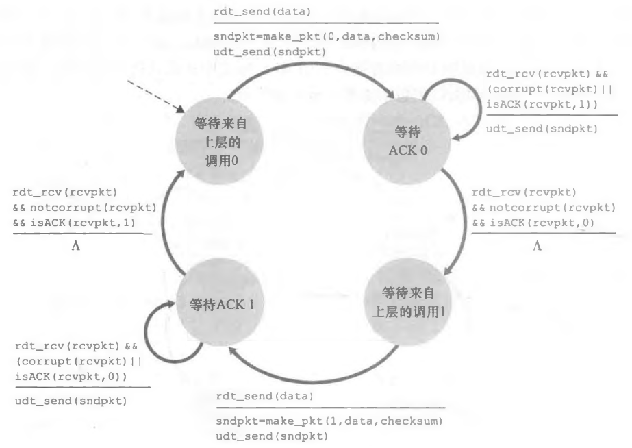

 
    
rdt2.2 协议的接收端

    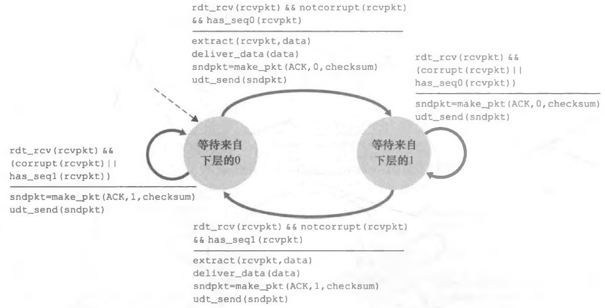

下面介绍一下 rdt2.2 协议的有限状态机（FSM）的发送方 sender：

1. 首先发送方发送 0 号数据分组，然后等待 ACK 0 确认
2. 如果正常接收到了 ACK 1 确认（正常只是表明数据没有在传输过程中受损），那么说明发送的 0 号分组出错，接收方对上一个分组进行了确认，因此重传 0 号数据
3. 如果接收到的 ACK 0 和 ACK 1 出现了差错，那么也重传 0 号分组
4. 如果正常接收到了 ACK 0 确认，就继续发送 1 号数据分组，并且重复上述过程

下面介绍一下 rdt2.2 协议的有限状态机（FSM）的接收方 receiver：

1. 如果接收方正确接收到 0 号数据之后，就发送 ACK 0 给发送方，并等待接收 1 号数据
2. 如果接收到 0 号数据，就说明接收方发送的 ACK 0 在传输的过程中出现了差错，因此发送方重新发送了 0 号数据，因此重新发送 ACK 0
3. 如果接收方收到的 1 号数据有差错，那么就重发 ACK 0 给发送方，对上一个数据分组进行确认
4. 如果正常接收到了 1 号数据之后，就发送 ACK 1 给发送方，并且等待接收 0 号数据

## 5.经具有比特差错的丢包信道的可靠数据传输：rdt3.0

**rdt3.0 相比于 rdt2.1 和 rdt2.2 协议考虑到分组在信道上传输时出现丢失的情况，可能数据分组和确认分组都会丢失，在这两种情况下，发送方都收不到应当到来的接收方的响应。** 在这两种情况下，可以给每个分组设定一个计时器，当时间超时之后没有收到确认，就重传数据分组。注意到如果一个分组经历了一个特别大的时延，发送方可能会重传该分组，即使该数据分组及其 ACK 都没有丢失，这时发送方可能会收到重复确认。这就在发送方到接收方的信道中引入了冗余数据分组（duplicate data packet）的可能性，当接收方收到冗余数据分组时，会重新发送确认，并且丢弃重复分组。当发送方收到冗余确认时，也会直接丢弃。另外，超时时间应该为：即发送方与接收方之间的一个往返时延（可能会包括在中间路由器的缓冲时延）加上接收方处理一个分组所需的时间。

为了实现基于时间的重传机制，需要一个倒数计时器，在一个给定的时间量过期后，可中断发送方。因此，发送方需要能做到：①每次发送一个分组（包括第一次分组和重传分组）时，便启动一个定时器。②响应定时器中断（采取适当的动作）。③终止定时器。rdt3.0 协议的有限状态机（FSM）如下所示：

    
rdt3.0 协议的发送方

    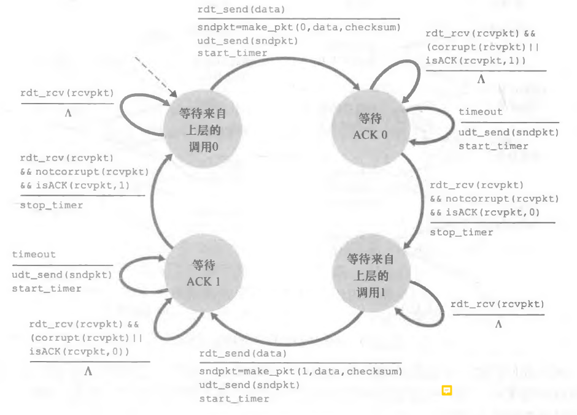

rdt3.0 协议有限状态机的发送方 sender：

1. 首先发送方发送 0 号分组，开启计时器，并且等待 ACK 0 确认
2. 如果正常接收到了 ACK 1 确认（正常只是表明数据没有在传输过程中受损），那么说明发送的 0 号分组出错，接收方对上一个分组进行了确认，因此等待超时重传 0 号数据
3. 如果接收到的 ACK 0 和 ACK 1 出现了错误，那么也重传 0 号分组
4. 如果出现了超时，也就是在计时器时间内没有接收到确认，那么就重传 0 号分组，这时可能有 3 种原因引起超时：
   1. 0 号分组丢失
   2. 确认丢失
   3. 确认和分组都没有丢失，往返时延大于计时器的时间，这时发送方可能重复接收到确认
5. 如果正常接收到了 ACK 0 确认，就继续等待发送 1 号数据分组
6. 如果重复接收到确认，发送方此时直接忽略掉
   1. 发送方发送数据分组丢失时，发送方直接重传分组
   2. 发送方发送数据分组正常，接收方发送的 ACK 丢失，发送方重传分组，接收方会收到冗余分组，接收方直接丢弃，并且重传确认 ACK
   3. 数据分组和 ACK 都正常，只是时延太大，那么发送方在计时器时间内没有收到分组会重发数据分组，接收方在收到重复分组之后，丢弃分组，再次发送确认，发送方就会收到确认。但是之前发送的 ACK 之后隔一段时间后会到达，发送方直接丢弃 ACK

## 6 流水线可靠数据传输协议

rdt3.0 协议本质上还是一个停止等待协议，传输数据的效率很低。这种特殊的性能问题的一个简单解决方法是：不以停等方式运行，允许发送方发送多个分组而无须等待确认。因为许多从发送方向接收方输送的分组可以被看成是填充到一条流水线中，故这种技术被称为流水线（pipelining）。下面就是停止等待协议和流水线协议的示意图：

    
停止等待协议

    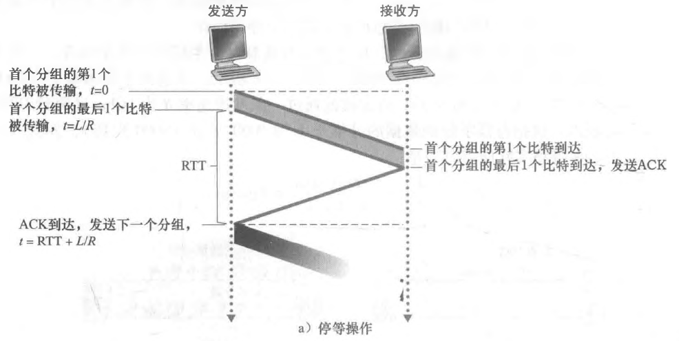

    
流水线协议

    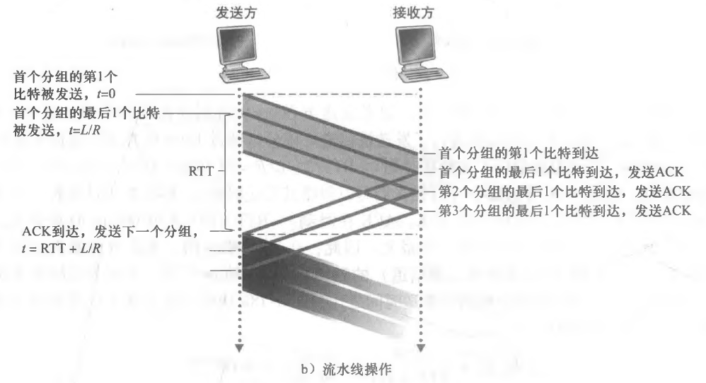

流水线技术要对 rdt3.0 协议做出如下更改：

1. 由于发送方一次可以发送多个分组，并且每个输送中的分组（不计算重传的）必须有一个唯一的序号，同时接收方必须对这些分组进行确认，因此必须增加序号范围
2. 协议的发送方和接收方两端也许不得不缓存多个分组。发送方最低限度应当能缓冲那些已发送但没有确认的分组。如下面讨论的那样，接收方或许也需要缓存那些已正确接收的分组
3. 解决流水线的差错恢复有两种基本方法：回退 N 步（Go-Back-N）和选择重传（Selective Repeat, SR）

## 7.回退 N 步（Go-Back-N）

在回退 N 步（GBN）协议中，允许发送方发送多个分组（当有多个分组可用时）而不需等待确认，但是也不能无限制发送，**GBN 规定在流水线中已发送但未确认的分组数最多不能超过某个最大允许数 N（通过拥塞控制和流量控制来限制）。** 在 GBN 协议中，那些已被发送但还未被确认的分组的许可序号范围可以被看成是一个在序号范围内长度为 N 的窗口。随着协议的运行，该窗口在序号空间向前滑动。因此，N 常被称为窗口长度（window size）, GBN 协议也常被称为滑动窗口协议。接下来介绍 GBN 协议的序号范围：

 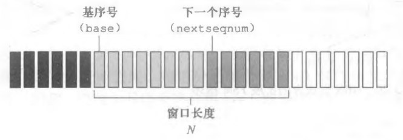 

如果我们将基序号（base）定义为最早未确认分组的序号，将下一个序号（nextseqnum）定义为最小的未使用序号（即下一个待发分组的序号），则可将序号范围分割成 4 段。在 [0, base - 1] 段内的序号对应于已经发送并被确认的分组。[base, nextseqnum - 1] 段内对应已经发送但未被确认的分组。[nextseqnum, base + N - 1] 段内的序号能用于那些要被立即发送的分组，如果有数据来自上层的话。最后，大于或等于 base + N 的序号是不能使用的，直到当前流水线中未被确认的分组（特别是序号为 base 的分组）已得到确认为止。

GBN 协议发送方和接收方的有限状态机图如下所示：

    
GBN 协议的发送方

    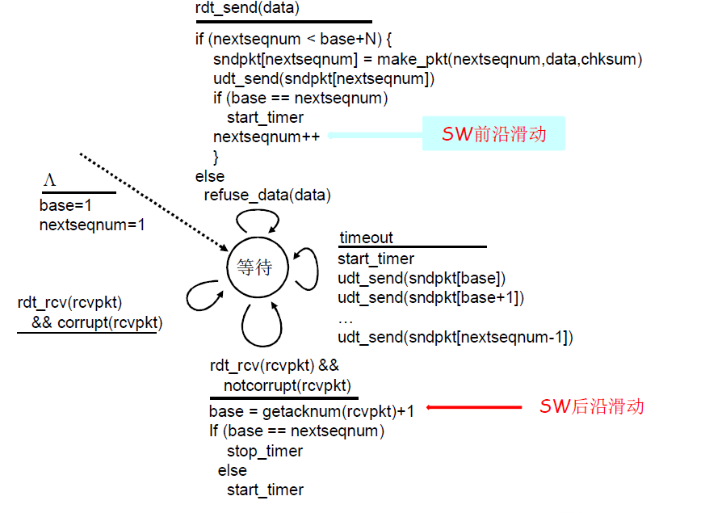

    
GBN 协议的接收方

    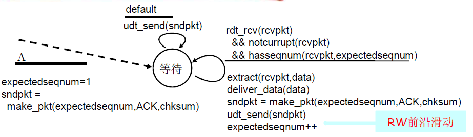

GBN 发送方必须响应的三种类型的事件：

### 7.1.上层调用

当上层调用 `rdt_send` 时，发送方首先检查发送窗口是否已满，即是否有 N 个已发送但未被确认的分组。

如果窗口未满，则产生一个分组并将其发送，并相应地更新变量 nextseqnum（变量 + 1），nextseqnum 表示下一个要发送的分组的序号。base 表示 **`1 - (base-1)`** 序号区间内的分组都已经被接收到了。在真正发送分组之前（nextseqnum 被更新之前），如果检测到 nextseqnum 和 base 相等，那么要重新开始计时器，检测是否有分组超时。这是因为，在接收 ACK 响应时，如果 **`base == nextseqnum`**（nextseqnum 表示 **`1 - (nextseqnum-1)`** 区间内的数据都已发送），表明所有已发送出去的分组都已经被接收到了，所以计时器没必要再开启了，会关闭掉计时器。因此在发送分组时，如果检测到 **`base == nextseqnum`**，说明计时器已经被关闭了，必须要重新开启。

如果窗口已满，发送方只需将数据返回给上层，隐式地指示上层该窗口已满。然后上层可能会过一会儿再试。在实际实现中，发送方更可能 缓存（并不立刻发送）这些数据，或者使用同步机制（如一个信号量或标志）允许上层在仅当窗口不满时才调用 `rdt.send`

### 7.2.收到一个 ACK

当发送方收到序号为 n 的分组的确认时，表明 1 到 n 的分组，接收端都已经收到。并且在 GBN 协议中，接收方丢失所有的失序分组，比如接收方期望接收分组 n（说明 n-1 分组都已经被接收方接收到了），那么如果收到了 n+1，n+2，n+m，接收方都是直接丢弃，并且每次收到乱序分组，都重传 ACK n-1，即为最近按序接收的分组重新发送 ACK。

接收方收到了确认 ACK 之后，就更新 base 为 **`ack_num + 1`**，这时 base 表明 base 之前的所有分组都已经收到了确认（即 1 - base-1）。如果 **`base == nextseqnum`**，表示所有发送出去的分组都收到了确认，则关闭计时器。否则，更新 base 之后重新开始计时。

### 7.3.超时

发送方仅使用一个定时器，它可被当作是最早的已发送但未被确认的分组所使用的定时器。base 表明 base 之前的所有分组都已经收到了确认（即 1 - base-1），nextseqnum 表示 1 - (nextseqnum-1) 的数据都已发送。如果出现超时，那么发送方重传所有已经被发送但是还没有被确认过的分组。也就是重发 **`base - (nextseqnum - 1)`** 之间的分组。

GBN 接收方处理的事件：

接收方会丢弃所有的失序分组，也就是接收方不会缓存任何失序分组，而是只需要维护一个 expectedseqsum 变量，表示期望下一个接收到的分组序号。如果发送过来的序号不等于 expectedseqsum，那么就直接丢弃该分组，并返回 expectedseqsum - 1 分组的 ACK。如果序号等于 expectedseqsum，那么就回复 ACK，ACK 的序号也等于发送过来的分组序号，等于 expectedseqsum，然后再对 expectedseqsum 变量加一。

这里解释一下为什么定时器超时时，需要重传 **`base - (nextseqnum - 1)`** 之间的分组。比如 A 为发送端，B 为接收端，A 发送 1 2 3 4 5 个分组，其中分组 3 丢失了，B 接收到了 1 2，接下来希望接收到分组 3，如果收到了分组 4，则直接丢弃，然后返回 ACK 2，如果收到了 5 也是同理。这时，A 等待 ACK 3，但是一直没有等到，就要重传 3 4 5。重传 4 5 是因为 A 不知道接收端收到 4 5 分组的情况，存在两种情况：

1. 如果 B 收到了，那么会被直接丢弃（乱序），此时 A 必须要重传。
2. 也有可能 B 还没有收到 4 5 分组（传播时延太大），可能等到收到了重传的 3 号分组之后，才收到 4 5 分组

第二种情况下 A 理论上不用重传 4 5 分组，但是没有办法分清楚具体是哪一种情况，所以直接重传 3 4 5 分组。因此总结，此 GBN 协议相比于 rdt3.0 协议引入了如下机制：

1. GBN 允许流水线和滑动窗口机制：即连续发送多个数据分组，而不用像停止等待协议那样，发送一个分组，必须等到确认之后，才能再去发送下一个分组。不过发送的分组数目也不能无限，最多允许有 N 个数据分组发出但是没有收到确认。
2. GBN 使用累计确认：即接收方回复 ACK N 时，表明 1-N 之间的数据已经被接收到。
3. GBN 出现超时时，发送方会重传所有已经发送，但是还没有被确认过的分组。在此 GBN 协议中，只设置了一个计时器，即 base 指针指向分组的计时器，指针 base 表示 **`1-(base-1)`** 之间的数据已经被确认了，当出现超时之后，由于无法确认 base 之后数据的接收情况，直接重传 **`base-(nextseqnum - 1)`** 之间的数据。出现超时的时候重传所有已经发送但是还没有被确认的数据，这和使用累计确认是相配套的，因为累积确认在发送数据出现丢包时，无法明确指明接收方的接收情况，所以必须要重传多份数据。

## 8.选择重传

当使用流水线传输分组时，当分组出现差错（传输错误或者丢失）时，可以使用两种不同方式来进行处理，第一种就是 GBN（Go-Back-N），第二种方式为选择重传。GBN 协议本身也有一些性能问题，单个分组的差错就会引起 GBM 重传大量分组，许多分组根本没有必要重传。随着信道差错率的增加，流水线可能会被这些不必要重传的分组所充斥。

下面介绍选择重传协议，注意这里介绍的选择重传 SR 协议是针对一般的网络协议，着重介绍思想，和 TCP 中真正的 SR 实现不相同。**顾名思义，选择重传（SR）协议通过让发送方仅重传那些它怀疑在接收方出错（即丢失或受损）的分组而避免了不必要的重传。** 这种个别的、按需的重传要求接收方【逐个地】确认正确接收的分组。这里注意，在 SR 协议中，接收方不使用累积确认，而是对单独每一个分组发送确认。SR 接收方将确认一个正确接收的分组而不管其是否按序。失序的分组将被缓存直到所有丢失分组（即序号更小的分组）皆被收到为止，这时才可以将一批分组按序交付给上层。

SR 发送方的事件与动作：

1. 从上层收到数据：当从上层接收到数据后，SR 发送方检查下一个可用于该分组的序号。如果序号位于发送方的窗口内，则将数据发送；否则就像在 GBN 中一样，要么将数据缓存，要么将其返回给上层以便以后传输。
2. 超时：定时器再次被用来防止丢失分组。然而，现在每个分组必须拥有其自己的逻辑定时器。因为接收方每收到一个分组之后，就只对这个分组发送确认，而发送方的某一个分组在超时之后仍然没有收到确认的话，也只会重传这一个分组。
3. 收到 ACK：如果收到 ACK，倘若该分组序号在窗口内，则 SR 发送方将那个被确认的分组标记为已接收。如果该分组的序号等于 send_base 则窗口基序号向前移动到具有最小序号的未确认分组处。如果窗口移动了并且有序号落在窗口内的未发送分组，则发送这些分组。

SR 接收方的事件与动作：

1. 序号在 **`[rcv_base, rcv_base + N - 1]`** 内的分组被正确接收：在此情况下，收到的分组落在接收方的窗口内，一个选择 ACK （对单个分组的确认）被回送给发送方。如果该分组以前没收到过，则缓存该分组。如果该分组的序号等于接收窗口的基序号（也就是 rcv_base），则该分组以及以前缓存的连续的（起始于 rcv_base 的）分组交付给上层。然后，接收窗口向前移动。举例子来说，当收到一个序号为 rcv_base=2 的分组时，该分组及分组 3,4,5 是连续的，可被交付给上层，然后滑动窗口向前移动 6 号分组。
2. 序号在 **`[rcv_base - N, rcv_base - 1]`** 内的分组被正确收到。在此情况下，也必须产生一个 ACK，即使该分组是接收方以前已确认过的分组。
3. 其他情况，忽略该分组。

接下来讲解一下第二点，首先为什么 SR 接收方会收到 **`[rcv_base - N, rcv_base - 1]`** 内的序号分组。举例，B 为接收方，A 端的分组序号为 1 2 3 4 5 6 1 2 ...（序号空间大小为 6，A 和 B 的窗口大小都为 3，序号是循环使用），窗口范围为 5 6 1。这时，B 只可能接收到 A 发送过来的 2 3 4 分组。这是因为 B 的窗口范围为 5 6 1，那么说明 A 发送了 1 2 3 4 分组，这样 B 才能接收到分组，窗口往前移动。但是由于 A 的窗口大小为 3，因此 A 窗口范围内分组【可能】的最小序号是 2（还有可能比 2 大），即窗口范围为 2 3 4（不能为 1 2 3，这样 A 发送不了 4 号分组）。因此 B 接收到 2 3 4 号分组时，说明 A 有可能没有收到确认，在进行重传，因此 B 必须再次发送 ACK 让 A 知道分组被接收到。而 1 号分组 A 已经发送并且接收到 B 发送的确认，这样 A 才能向前移动。

总结就是 B 收到了序号在 **`[rcv_base, rcv_base + N - 1]`** 和 **`[rcv_base - N, rcv_base - 1]`** 之间的分组，即使之前已经收到了分组并且发送确认，也必须再次发送。因为 A 重传，那么就说明 A 没收到确认。至于 rcv_base - N 之前的序号，A 肯定收到了确认。

对于 SR 协议来说，发送方和接收方的窗口并不总是一致的。当我们面对有限序号范围的现实时，发送方和接收方窗口间缺乏同步会产生严重的后果。结论为窗口长度必须小于或者等于序号空间大小的一半，否则接收方有可能无法区分发送过来的分组是新的分组，还是重传的分组。考虑下面例子中可能发生的情况，该例有包括 4 个分组序号 0、1、2、3 的有限序号范围且窗口长度为 3。假定发送了分组 0 至 2，并在接收方被正确接收且确认了。此时, 接收方窗口落在第 4、5、6 个分组上，其序号分别为 3、0、1。现在考虑两种情况。在第 一种情况下，如图（a）所示，对前 3 个分组的 ACK 丢失，因此发送方重传这些分组。因此，接收方下一步要接收序号为 0 的分组，即第一个发送分组的副本。

 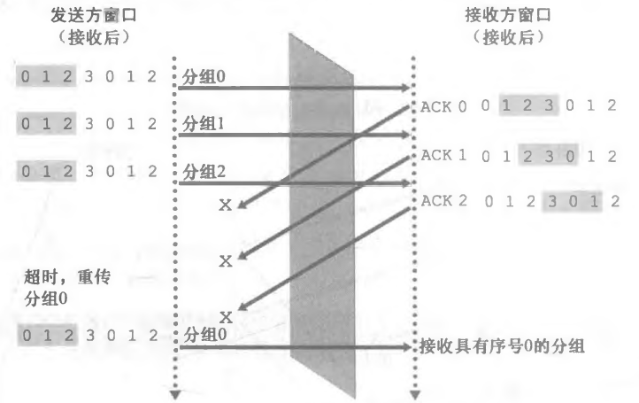 

在第二种情况下，如图（b）所示，对前 3 个分组的 ACK 都被正确交付。因此发送方向前移动窗口并发送第 4、5、6 个分组，其序号分别为 3、0、10 序号为 3 的分组丢失，但序号为 0 的分组到达（一个包含新数据的分组）。这两种情况对于接收方来说是等同的，无法进行区分。

 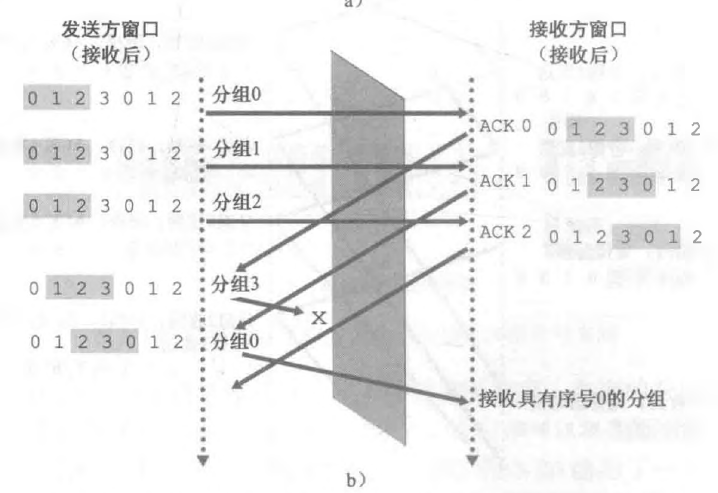 

出现这种情况的原因不在发送方，而在接收方。发送方没有收到 ACK 确认，重发了窗口内的帧，也没有滑动，但是接收方自己发送过 ACK 确认了，窗口滑动了（接收方和发送方的窗口不同步），这个序号已经变成窗口外的了，此时如果窗口太大，这个序号就会同时进入接收方窗口中的待接受帧（序号是循环使用的），那么接收方分不清了，到底是正常发送的新帧，还是已经接收过，在窗口之外的旧帧。简而言之就是如果窗口的大小大于序号空间大小的一半，意味着，在发送方还没有全部收到最开始发送的一批分组的确认 ACK 的情况下，序号已经开始了第一次循环使用(数学逻辑)，也就必然出现序号重复的问题。

那为什么小于等于一半时就不会出现这种情况呢？

和上面的逻辑相同，窗口的大小小于等于序号空间大小的一半时，意味着，在发送方还没有全部收到最开始发送的一批分组的确认 ACK 的情况下，接收方是不可能出现序号重复使用的问题。同时也意味着，当一个序号开始循环使用时，第一次该序号所代表的分组的确认 ACK 必然被发送方正确收到了（参考之前所说，B 端的 **`rcv_base - N`** 之前的序号，A 肯定收到了 B 发送的确认）。因为，只有这样发送方的滑动窗口才能继续向右移动，也只有这样才会出现一个序号的循环使用。因此如果 B 收到该序号的分组，说明此序号肯定为新发送的分组。

## 9.总结

最后对整个可靠传输协议进行总结，包括 rdt1.0 到 rdt3.0，以及流水线、GBN 和 SR 协议。假设 A 为发送方，B 为接收方。

rdt1.0 协议假设底层信道完全可靠，A,B 发送的数据不会出现差错，并且 A 发送的数据，B 发送的确认都不会丢失。这时 A 发送数据，B 接收数据即可，B 不需要发送确认给 A

rdt2.0 协议假设 A 发送给 B 的分组可能会出现差错，其它和 rdt1.0 协议一样。这时需要增加差错检测、接收方反馈/确认以及重传。

1. 差错检测：首先，需要一种机制以使接收方检测到何时出现了比特差错。因此除了发送方发送的数据分组之外，还需要发送额外的比特用于差错检测，这个字段叫做分组检验和字段
2. 接收方反馈：rdt2.0 协议将从接收方向发送方回送 ACK 与 NAK 分组，表示发送方发送的数据是否出现差错，如果出现了，回复 NAK，否则回复 ACK。理论上，这些分组只需要一个比特长度;如用 0 表示 NAK，用 1 表示 ACK。
3. 重传：接收方收到有差错的分组时，发送方将重传该分组文。

rdt2.1 协议相比于 rdt2.0 多了 B 发送给 A 的确认可能出现差错，其它也和 rdt1.0 一样，为了处理接收方发送的 ACK 和 NAK 分组受损的情况，当发送方收到受损的 ACK 和 NAK 消息时，就直接重发之前发送的数据分组。但是这样做会存在一个问题，就是对于 rdt2.0 这种简单的停止等待协议，接收方收到发送端重发的分组之后，并不知道这个分组是新的分组，还是重发的，这是因为 rdt2.0 协议发送的分组全部没有编号，所以接收方收到重传之后区分不了。因此发送方必须对发送出去的数据分组进行编号。此时 A 收到出现差错的确认以及 NAK 确认都需要重传分组。

rdt2.2 协议相比于 rdt2.1 取消掉 NAK 确认分组，并且在 ACK 分组中增加了序号，表示 B 收到了哪一个分组。当 B 收到的分组出现差错时，就会重传对收到的上一个分组的确认（rdt 协议为停止等待协议，B 一次只接收一个分组，A 一次只发送一个分组），因此当 A 连续收到对同一个分组的两个 ACK 后，就知道接收方没有正确接收到跟在被确认两次的分组后面的分组。

rdt3.0 协议相比于 rdt2.1 和 rdt2.2 多考虑了数据分组和确认分组丢失的情况。前面的措施无法处理这种情况，比如 A 发送的分组丢失，B 自然也不会发送确认，这时需要在 A 发送端增加超时重传机制，当 A 在一段时间内没有收到确认时，重传分组。这也可以用来处理确认丢失，比如 B 发送的确认丢失，那么 A 超时重传，B 收到分组之后再次发送确认，但是把重复收到的分组丢弃。

流水线协议：rdt 为停止等待协议，B 一次只接收一个分组，A 一次只发送一个分组，这种协议对于信道的利用率太低，因此引入了流水线协议，也就是在 rdt 协议的基础上，A 可以一次发送多个分组数据，而不用等待确认。不过发送的数据分组没有限制，一般上限为 N，称为滑动窗口。当流水线出现差错时，可以使用 GBN 和 SR 协议两种不同的方式进行处理。

GBN 协议：在流水线协议的基础上，引入了累积确认，即接收方发送 ACK M，则表明接收方 M - 1 的数据分组都被接收到了。GBN 协议的接收方 B 只维护一个变量表示期望下一个接收到的分组序号，而所有失序分组都会被丢弃。但是使用累积确认的一个缺点是发送方不清楚丢包后面的数据分组是否被收到，所以会重传所有已经发送，但是还没有被确认过得分组，这也是 GBN 协议（回退 N 步）名字的由来。

SR 协议：GBN 协议本身也有一些性能问题，单个分组的差错就会引起 GBN 重传大量分组，许多分组根本没有必要重传。SR 协议不使用累积确认，对接收方 B 来说，B 也维护一个滑动窗口，即使接收到失序报文段，不会丢弃而是缓存在滑动窗口中，并且接收方单独对每一个收到的分组进行确认。对于发送方 A 来说，收到对一个分组的 ACK 后，则标记该分组为已接收，并且 A 对窗口中的每一个分组都设置有定时器，当超时没有收到 ACK 时，就会重新发送分组。也就是说 SR 协议核心在于使定时器和确认 ACK 的粒度更小，这样就知道哪些分组收到，哪些分组没有接收。
