# TCP 协议之复位 RST 报文段

我们都知道 TCP 正常情况下断开连接是用四次挥手，那是正常时候的优雅做法。但异常情况下，收发双方都不一定正常，连挥手这件事本身都可能做不到，所以就需要一个机制去强行关闭连接。RST 就是用于这种情况，一般用来异常地关闭一个连接。它是一个 TCP 包头中的标志位。正常情况下，不管是发出，还是收到置了这个标志位的数据包，相应的内存、端口等连接资源都会被释放。从效果上来看就是 TCP 连接被关闭了。而接收到 RST 的一方，一般会看到一个 **`connection reset`** 或 **`connection refused`** 的报错。

简单来说，就是在某些特殊条件下，TCP 连接的一端（A 端）会向另一端（B 端）发送携带 RST 标志的报文段，即复位报文段，以通知对方关闭连接或重新建立连接。本节讨论产生复位报文段的 4 种情况。

## 1.怎么知道收到 RST 报文？

我们知道内核跟应用层是分开的两层，网络通信功能在内核，我们的客户端或服务端属于应用层。应用层只能通过 **`send/recv`** 与内核交互，才能感知到内核是不是收到了 RST。

- 当本端收到远端发来的 RST 后，内核已经认为此链接已经关闭。此时如果本端应用层尝试去执行读数据操作，比如 recv，应用层就会收到 **`Connection reset by peer`** 的报错，意思是远端已经关闭连接。
- 如果本端应用层尝试去执行写数据操作，比如 send，那么应用层就会收到 **`Broken pipe`** 的报错，意思是发送通道已经坏了。

下面介绍 RST 报文段出现的场景，一般有四种

- 对端的端口不可用
  - 端口根本就没被监听过，或者换句话说，端口在对端根本不存在（端口未监听和端口不存在是一个意思）
  - 端口被监听过，曾经可用，但是现在监听端口的进程崩溃了，现在不可用了
- socket 提前关闭
  - 本端提前关闭
  - 对端关闭【没有提前这两个限定词】

## 2.端口未监听/端口不存在

当客户端访问一个不存在的端口时（即目的端口没有进程正在监听），目标主机将给它发送一个复位报文段。考虑从 Kongming20（**`192.168.1.109`**）上执行 telnet 命令登陆 ernest-laptop 上一个不存在的 54321 端口，并且利用 tcpdump 抓取该过程中两台主机交换的 TCP 报文段，具体操作过程如下：

<div align="center"> 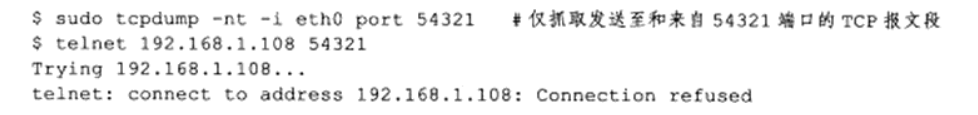 </div>

telnet 程序的输出显示连接被拒绝了，因为这个端口不存在。tcpdump 抓取到的 TCP 报文段内容如下所示：

<div align="center"> 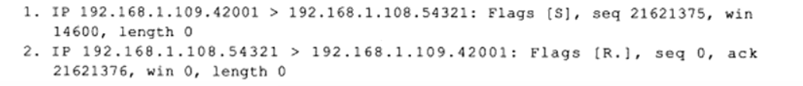 </div>

由此可见，ernest-laptop 针对 Kongming20 的连接请求（同步报文段）回应了一个复位报文段（tcpdump 输出 R 标志）。因为复位报文段的接收通告窗口大小为 0，所以可以预见：收到复位报文段的一端应该关闭连接或者重新连接，而不能回应这个复位报文段。实际上，当客户端程序向服务器的某个端口发起连接，而该端口仍被处于 TIME_WAIT 状态的连接所占用时，客户端程序也将收到复位报文段。

服务端 listen 方法会创建一个 sock 放入到全局的哈希表中。此时客户端发起一个 connect 请求到服务端。服务端在收到数据包之后，第一时间会根据 IP 和端口从哈希表里去获取 sock。如果服务端执行过 listen，就能从全局哈希表里拿到 sock。但如果服务端没有执行过 listen，那哈希表里也就不会有对应的 sock，结果当然是拿不到。此时，正常情况下服务端会发 RST 给客户端。

<div align="center"> 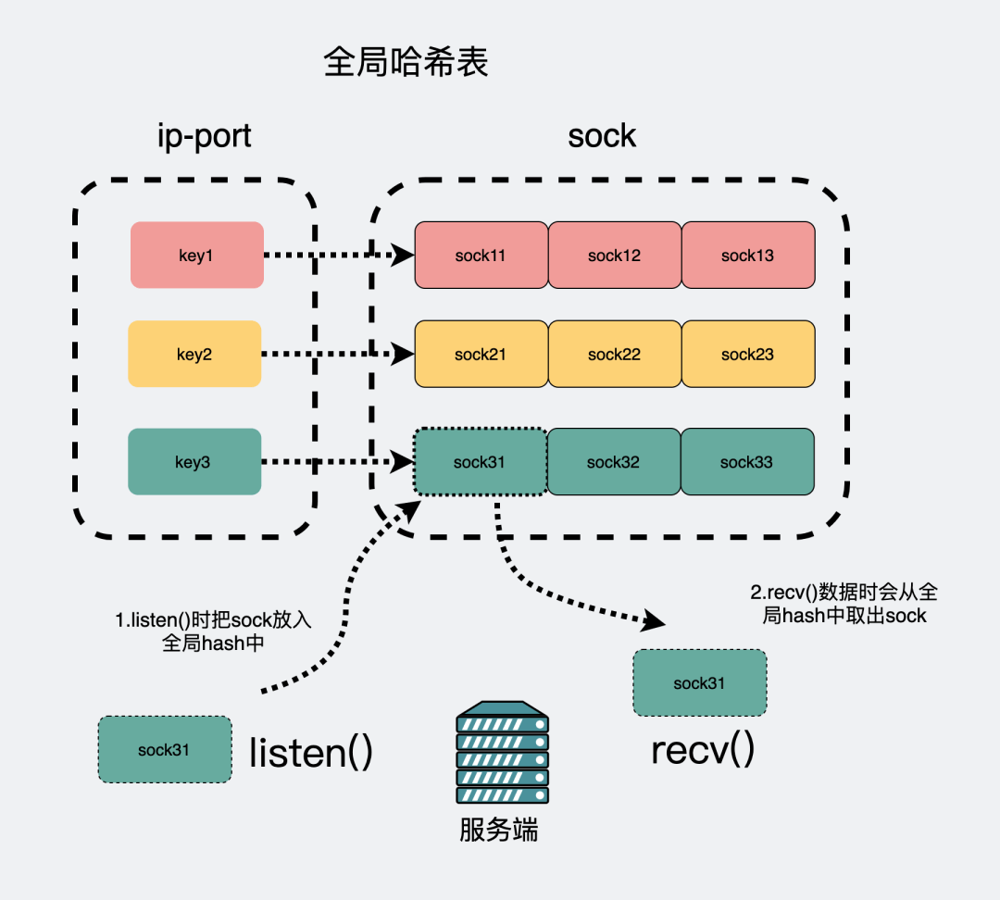 </div>

不过这里注意，端口未监听/端口不存在不一定就会发送 RST 报文，上面提到，发 RST 的前提是正常情况下，我们看下源码：

```java{.line-numbers}
// net/ipv4/tcp_ipv4.c
// 代码经过删减
int tcp_v4_rcv(struct sk_buff *skb)
{
    // 根据 ip、端口等信息获取 sock。
    sk = __inet_lookup_skb(&tcp_hashinfo, skb, th->source, th->dest);
    if (!sk)
        goto no_tcp_socket;

no_tcp_socket:
    // 检查数据包有没有出错
    if (skb->len < (th->doff << 2) || tcp_checksum_complete(skb)) {
        // 错误记录
    } else {
        // 发送 RST
        tcp_v4_send_reset(NULL, skb);
    }
}
```

内核在收到数据后会从物理层、数据链路层、网络层、传输层、应用层，一层一层往上传递。到传输层的时候，根据当前数据包的协议是 TCP 还是 UDP 走不一样的函数方法。可以简单认为，TCP 数据包都会走到 `tcp_v4_rcv()`。这个方法会从全局哈希表里获取 sock，如果此时服务端没有 `listen()` 过，那肯定获取不了 sock，会跳转到 **`no_tcp_socket`** 的逻辑。注意这里会先走一个 `tcp_checksum_complete()`，目的是看看数据包的校验和（Checksum）是否合法。

如果在发送端到接收端传输过程中，数据发生任何改动，比如被第三方篡改，那么接收方能检测到校验和有差错，此时 TCP 段会被直接丢弃。如果校验和没问题，那才会发 RST。所以，只有在数据包没问题的情况下，比如校验和没问题，才会发 RST 包给对端。其实在五层网络，不管是哪一层，只要遇到了这种数据，推荐的做法都是默默扔掉，而不是去回复一个消息告诉对方数据有问题。

- 如果对方用的是 TCP，是可靠传输协议，发现很久没有 ACK 响应，自己就会重传。
- 如果对方用的是 UDP，说明发送端已经接受了"不可靠会丢包"的事实，那丢了就丢了。

## 3.程序启动但是崩溃了（半打开连接）

考虑下面的情况：服务器（或客户端）监听端口的进程因为自身错误而崩溃，而对方没有接收到结束报文段（比如发生了网络故障），此时，客户端（或服务器）还维持着原来的连接，而服务器（或客户端）即使重启，也已经没有该连接的任何信息了。我们将这种状态称为半打开状态，处于这种状态的连接称为半打开连接。如果客户端（或服务器）往处于半打开状态的连接写入数据，则对方将回应一个复位报文段。

举例来说，我们在 Kongming20（**`192.168.1.109`**）上使用 nc 命令模拟一个服务器程序，使之监听 12345 端口，然后从 ernest-laptop（**`192.168.1.108`**）运行 telnet 命令登录到该端口上，接着拔掉 ernest-laptop 的网线（模拟发生了网络故障，使得客户端还维持原来的连接），并在 Kongming20 上中断服务器程序。显然，此时 ernest-laptop 上运行的 telnet 客户端程序维持着一个半打开连接。然后接上 ernest-laptop 的网线，并从客户端程序往半打开连接写入 1 字节的数据 "a"。同时，运行 tcpdump 程序抓取整个过程中 telnet 客户端和 nc 服务器交换的 TCP 报文段。具体操作过程如下：

<div align="center"> 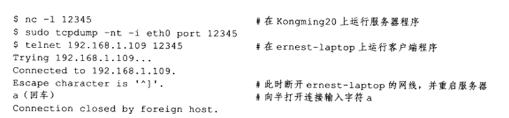 </div>

telnet 的输出显示，连接被服务器关闭了。tcpdump 抓取到的 TCP 报文段内容如下所示：

<div align="center"> 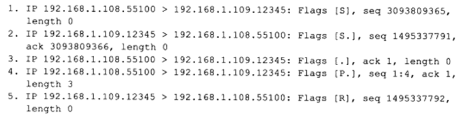 </div>

该输出内容中，前 3 个 TCP 报文段是正常建立 TCP 连接的 3 次握手的过程。第 4 个 TCP 报文段由客户端发送给服务器，它携带了 3 字节的应用程序数据，这 3 字节依次是：字母 "a"、回车符 "r" 和换行符 "In"。不过因为服务器程序已经被中断，所以 Kongming20 对客户端发送的数据回应了一个复位 RST 报文段 5。

<div align="center"> 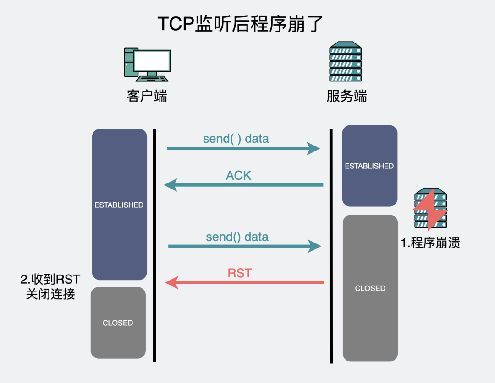 </div>

这种情况跟端口未监听本质上类似，在服务端的应用程序崩溃后，原来监听的端口资源就被释放了，从效果上来看，类似于处于 CLOSED 状态。此时服务端又收到了客户端发来的消息，内核协议栈会根据 IP 端口，从全局哈希表里查找 sock，结果当然是拿不到对应的 sock 数据，于是走了跟上面"端口未监听"时一样的逻辑，回了个 RST。客户端在收到 RST 后也释放了 sock 资源，从效果上来看，就是连接断了。

下面将一下 RST 报文和 502 消息之间的关系。上面这张图，服务端程序崩溃后，如果客户端再有数据发送，会出现 RST。但如果在客户端和服务端中间再加一个 nginx，就像下图一样。

<div align="center"> 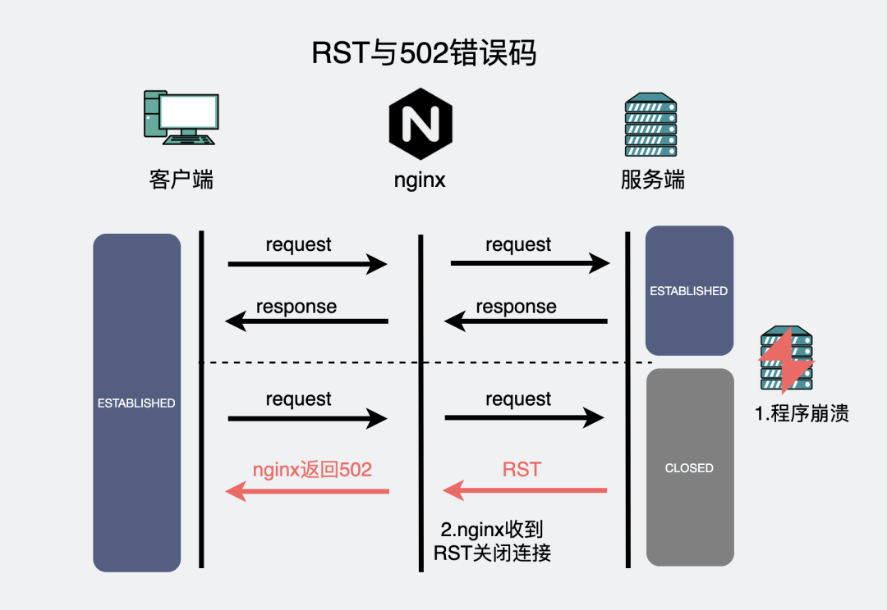 </div>

Nginx 会作为客户端和服务端之间的"中间人角色"，负责转发请求和响应结果。但当服务端程序崩溃，比如出现野指针或者 OOM 的问题，那转发到服务器的请求，必然得不到响应，后端服务端还会返回一个 RST 给 nginx。Nginx 在收到这个 RST 后会断开与服务端的连接，同时返回客户端一个 502 错误码。所以，出现 502 问题，一般情况下都是因为后端程序崩了，基于这一点假设，去看看监控是不是发生了 OOM 或者日志是否有空指针等报错信息。

## 4.本端 socket 提前关闭（异常终止）

前面讨论的连接终止方式都是正常的终止方式：也就是一方发送 FIN，这有时也被称为有序释放（orderly release），因为在所有排队数据都已经发送之后才发送 FIN，正常情况下没有任何数据丢失。但也有可能发送一个复位报文段而不是 FIN 来中途释放一个连接，这有时也被称为异常释放（abortive release）。**<font color="red">TCP 提供了异常终止一个连接的方法，即给对方发送一个复位报文段。一旦发送了复位报文段，发送端所有排队等待发送的数据都将被丢弃，并且 RST 的接收方会区分另外一端执行的是异常关闭还是正常关闭</font>**。应用程序可以使用 socket 选项 **`SO_LINGER`** 来发送复位报文段，以异常终止一个连接。

我们使用 sock 程序可以观察这种异常关闭的过程。我们加上 -L（即开启 **`SO_LINGER`**）选项并将停留时间设为 0。这将导致连接关闭时进行复位而不是正常的 FIN。我们连接到处于服务器上的 sock 程序，并键入一输入行：

<div align="center"> 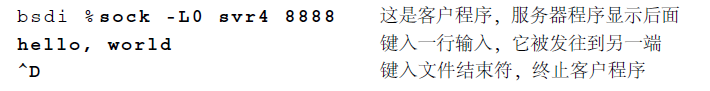 </div>

下面是这个例子的 tcpdump 输出显示（在这个图中我们已经删除了所有窗口大小的说明，因为它们与讨论无关）。第 1~3 行显示出建立连接的正常过程，第 4 行发送我们键入的数据行（12 个字符和 Unix 换行符），第 5 行是对收到的数据的确认。第 6 行对应为终止客户程序而键入的文件结束符（Control D）。由于我们指明使用异常关闭而不是正常关闭（命令行中的 -L0 选项），因此主机 bsdi 端的 TCP 发送一个 RST 而不是通常的 FN。RST 报文段中包含一个序号和确认序号。需要注意的是 RST 报文段不会导致另一端产生任何响应，即另外一端根本不发送确认。收到 RST 的一方将终止该连接，并通知应用层连接复位。我们会在服务器上面收到如下的差错信息：

<div align="center"> 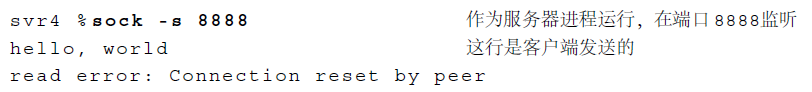 </div>

这个服务器程序从网络中接收数据并将它接收的数据显示到其标准输出上。通常，从它的 TCP 上收到文件结束符后便将结束，但这里我们看到当收到 RST 时，它产生了一个差错。这个差错正是我们所期待的：连接被对方复位了。

接下来讲解一下 socket 编程中使用的 close 函数，缺省 `close()` 的行为是把套接字标记为已关闭，然后立即返回到调用进程，该套接字描述符不能再由调用进程使用。如果有数据残留在 socket 发送缓冲区中则系统中 TCP 模块将继续发送这些数据给对方，等待被确认后，就进行正常的 TCP 连接终止序列（四次挥手）。

而在多进程并发服务器中，父子进程共享着套接字，套接字描述符引用计数记录着共享着的进程个数，当父进程或某一子进程 close 掉套接字时，描述符引用技术会相应的减一，当引用计数仍大于 0 时，这个 close 调用就不会引发 TCP 的四次挥手断连过程。

以上是 close 函数的默认行为，不过我们可以利用 **`SO_LINGER`** 选项，将此缺省行为设置为以下两种：

- a：立即关闭该连接，通过发送 RST 分组（而不是用正常的 FIN|ACK|FIN|ACK 四个分组）来关闭该连接。至于发送缓冲区中如果有未发送完的数据，则丢弃。主动关闭一方的 TCP 状态则跳过 TIME_WAIT，直接进入 CLOSED。
- b：将连接的关闭设置一个超时。如果 socket 发送缓冲区中仍残留数据，进程进入睡眠，内核进入定时状态去尽量去发送这些数据。在超时之前，如果所有数据都发送完且被对方确认，内核用正常的 FIN|ACK|FIN|ACK 四个分组来关闭该连接，`close()` 成功返回。如果超时之时，数据仍然未能成功发送及被确认，用上述 1 方式来关闭此连接。`close()` 返回 EWOULDBLOCK。

**`SO_LINGER`** 选项使用如下结构：

```java{.line-numbers}
struct linger {
     int l_onoff;
     int l_linger;
};
```

- **`l_onoff`** 为 0，则该选项关闭，l_linger 的值被忽略，`close()` 用上述缺省方式关闭连接。
- **`l_onoff`** 非 0，**`l_linger`** 为 0，`close()` 用上述 a 方式关闭连接。
- **`l_onoff`** 非 0，**`l_linger`** 非 0，`close()` 用上述 b 方式关闭连接。

因此本小节所说的异常关闭连接，就是主动关闭一方调用已经通过 SO_LINGER 选项设置过得 `close()` 函数，给对方发送 RST 报文，而不是 FIN 报文来关闭一条连接，这种被称为异常关闭。进程关闭 socket 的默认方式是正常关闭，如果需要异常关闭，利用 SO_LINGER 选项来控制。异常关闭一个连接对应用程序来说有两个优点：

- 丢弃任何待发的已经无意义的数据，并立即发送 RST 报文段；
- RST 的接收方利用关闭方式来区分另一端执行的是异常关闭还是正常关闭。

**<font color="red">值得注意的是 RST 报文段不会导致另一端产生任何响应，另一端根本不进行确认，发生确认报文 ACK</font>**。收到 RST 的一方将终止该连接。程序行为如下：

- 阻塞模型下，内核无法主动通知应用层出错，只有应用层主动调用 `read()` 或者 `write()` 这样的 IO 系统调用时，内核才会利用出错来通知应用层对端 RST。
- 非阻塞模型下，select 或者 epoll 会返回 sockfd 可读，应用层对其进行读取时，`read()` 会报错 RST。

## 5.远端已经关闭

远端已经调用 `close()` 函数关闭了 socket，此时本端还在尝试发送数据给远端。那么远端就会返回一个 RST 复位报文。TCP 是一个全双工协议，但是 socket 编程中的 close 函数会把调用端的

<div align="center"> 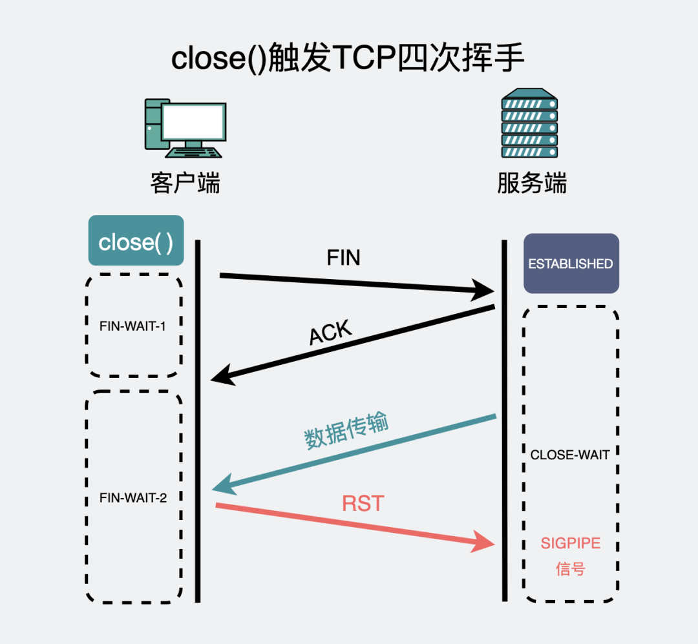 </div>

假设 server 和 client 已经建立了连接，server 调用了 close，发送 FIN 段给 client（其实不一定会发送 FIN 段，前面说过，有可能会根据 SO_LINGER 选项发送 RST 复位报文），此时 server 不能再通过 socket 发送和接收数据，此时 client 调用 read，如果接收到 FIN 段会返回 0。但 client 此时还是可以 write 给 server 的，write 调用只负责把数据交给 TCP 发送缓冲区就可以成功返回了，所以不会出错，而 server 收到数据后应答一个 RST 段，表示服务器已经不能接收数据，连接重置，client 收到 RST 段后无法立刻通知应用层，只把这个状态保存在 TCP 协议层。如果 client 再次调用 write 发数据给 server，由于 TCP 协议层已经处于 RST 状态了，因此不会将数据发出，而是发一个 SIGPIPE 信号给应用层，SIGPIPE 信号的缺省处理动作是终止程序。

有时候代码中需要连续多次调用 write，可能还来不及调用 read 得知对方已关闭了连接就被 SIGPIPE 信号终止掉了，如果不想被 SIGPIPE 信号终止掉进程，这就需要在初始化时调用 sigaction 处理 SIGPIPE 信号，对于这个信号的处理我们通常忽略即可，`signal(SIGPIPE, SIG_IGN);` 如果 SIGPIPE 信号没有导致进程异常退出（捕捉信号/忽略信号），write 返回 -1 并且 errno 为 **`EPIPE（Broken pipe）`**。（非阻塞地 write）

```java{.line-numbers}
#include <unistd.h>
int close(int fd);
```

close 关闭了自身数据传输的两个方向。

## 6 对方没收到 RST，会怎么样？

我们知道 TCP 是可靠传输，意味着本端发一个数据，远端在收到这个数据后就会回一个 ACK，意思是"我收到这个包了"。而 RST，不需要 ACK 确认包。因为 RST 本来就是设计来处理异常情况的，既然都已经在异常情况下了，还指望对方能正常回你一个 ACK 吗？可以幻想，不要妄想。但问题又来了，网络环境这么复杂，丢包也是分分钟的事情，既然 RST 包不需要 ACK 来确认，那万一对方就是没收到 RST，会怎么样？

<div align="center"> 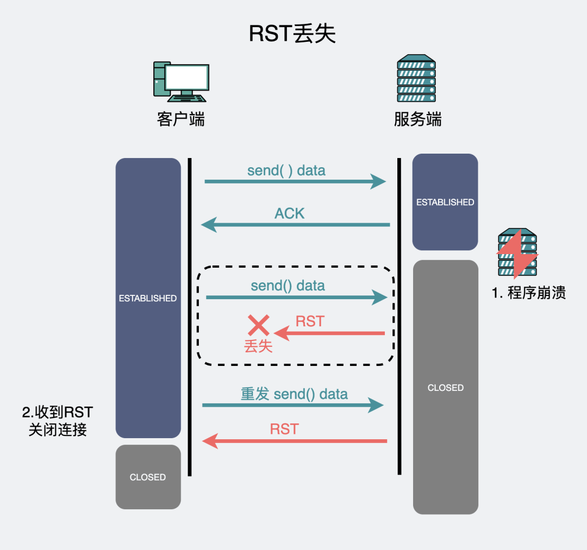 </div>

RST 丢了，问题不大。比方说上图服务端，发了 RST 之后，服务端就认为连接不可用了。如果客户端之前发送了数据，一直没等到这个数据的确认 ACK，就会重发，重发的时候，自然就会触发一个新的 RST 包。而如果客户端之前没有发数据，但服务端的 RST 丢了，TCP 有个 keepalive 机制，会定期发送探活包，这种数据包到了服务端，也会重新触发一个 RST。

<div align="center"> 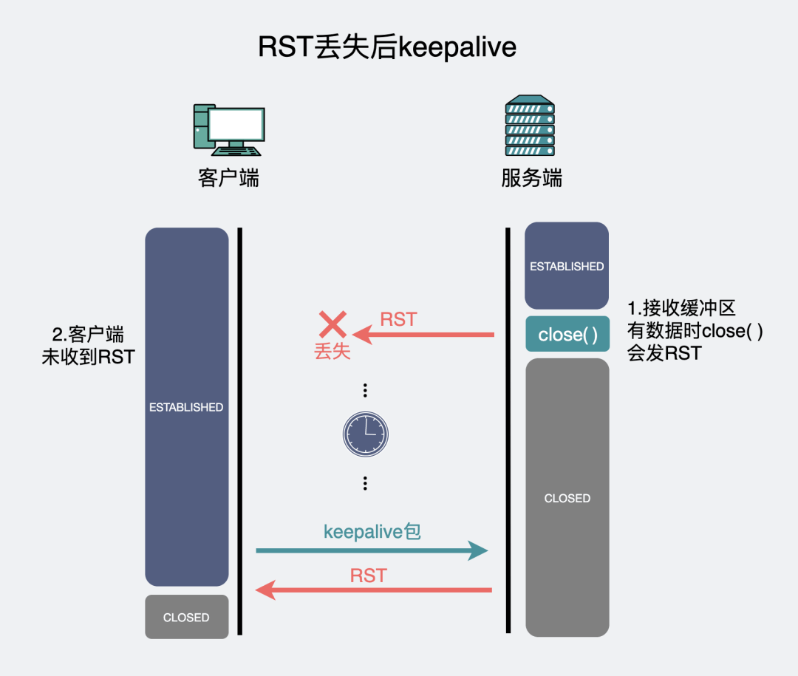 </div>