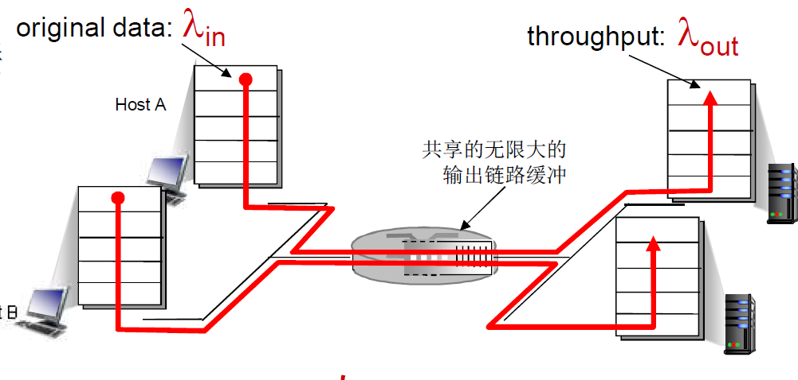
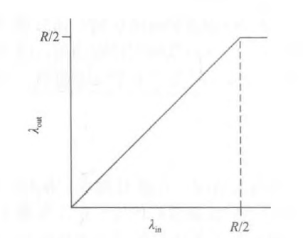
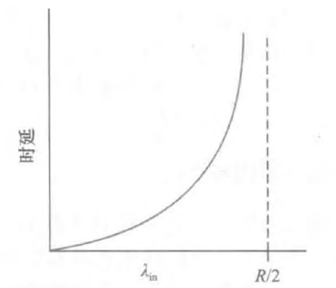
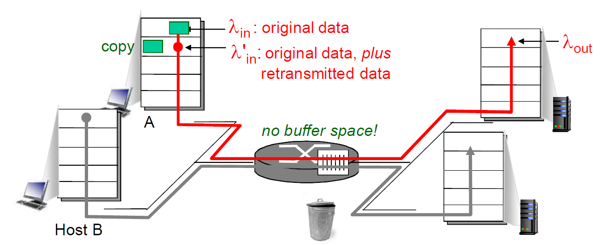
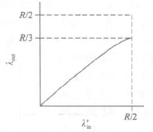
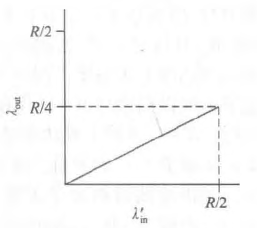
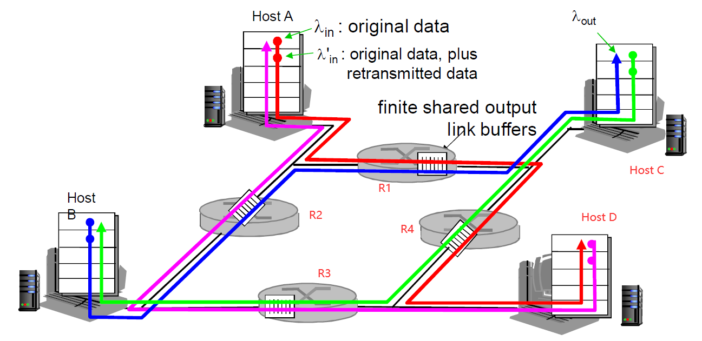

## 0.简介

在前面介绍过，TCP 一般使用超时重传和快速重传两种方式在分组丢失时提供可靠的数据传输服务。这种丢包一般是当网络变得拥塞时由于路由器的缓存溢出引起的，分组重传因此被视为网络拥塞的征兆（某个特定的运输层报文段的丢失）来对待（更为具体的网络拥塞征兆是发生了超时和接收到 3 次冗余 ACK），但是却无法处理导致网络拥塞的原因，因为有太多的源想以过高的速率发送数据。

我们通过分析 3 个复杂性越来越高的发生拥塞的情况，开始对拥塞控制的一般性研究。在每种情况下，我们首先将看看出现拥塞的原因以及拥塞的代价（根据资源未被充分利用以及端系统得到的低劣服务性能来评价）。我们暂不关注如何对拥塞做出反应或避免拥塞。

## 1.情况 1：两个发送方和一台具有无穷大缓存的路由器

  

上图说明了是最简单的拥塞情况：两台主机（A 和 B）都有一条连接，且这两条连接共享源与目的地之间的单跳路由。我们假设主机 A 中的应用程序以 $\bold{λ_{in}}$ 字节/秒的平均速率将数据发送到连接中（例如，通过一个套接字将数据传递给运输层协议）。这些数据是初始数据，这意味着每个数据单元仅向套接字中发送一次，即不考虑发生数据重传的情况（也就是说应用层传递给传输层多少数据，传输层协议就往连接中发送多少数据）这就是初始数据的含义。

下面的运输层协议是一个简单的协议。数据被封装并发送；不 执行差错恢复（如重传）、流量控制或拥塞控制。忽略由于添加运输层和较低层首部信息 产生的额外开销，在第一种情况下，主机 A 向路由器提供流量的速率是 $\bold{λ_{in}}$ 字节/秒。主机 B 也以同样的方式运行，为了简化问题，我们假设它也是以速率 $\bold{λ_{in}}$ 字节/秒发送数据。来自主机 A 和主机 B 的分组通过一台路由器，在一段容量为 R 的共享式输出链路上传输。 该路由器带有缓存，可用于当分组到达速率超过该输出链路的容量时存储 "到达的分组"。在此第一种情况下，我们将假设路由器有无限大的缓存空间。

描绘出了第一种情况下主机 A 的连接性能。左边的图形描绘了每连接的吞吐量（接收方每秒接收的字节数）与该连接发送速率之间的函数关系。当发送速率在 **`0-R/2`** 之间时，接收方的吞吐量等于发送方的发送速率，即发送方发送的所有数据经有限时延后到达接收方。然而当发送速率超过 **`R/2`** 时，它的吞吐量只能达 **`R/2`**。这个吞吐量上限是由两条连接之间共享链路容量造成的。

    
吞吐量和发送速率的关系

    

    
时延与发送速率的关系

    

从上图左边看起来取得每连接吞吐量 **`R/2`** 似乎是一个好的事情，但是当发送速率接近 **`R/2`** 时（从左至右），平均时延就会越来越大。当发送速率超过 **`R/2`** 时，路由器中的平均排队分组数就会无限增长，源与目的地之间的平均时延也会变成无穷大。**这就是网络拥塞的第一个代价：即当分组的到达速率接近链路容量时，分组经历巨大的排队时延**。

## 2.情况 2：两个发送方和一台具有有限缓存的路由器

现在我们从下列两个方面对情况 1 稍微做两点修改。第一点就是，假定路由器缓存的容量是有限的。这种现实世界的假设的结果是，当分组到达一个已满的缓存时会被丢弃。第二点就是假定每条连接都是可靠的。如果一个包含有运输层报文段的分组在路由器中被丢弃，那么它终将被发送方重传。

由于分组可以被重传，所以现在应用程序的发送速率和运输层的发送速率有可能不相同，因为应用程序只需要发送初始数据，而运输层除了发送初始数据之外，还需要发送重传数据。这里我们再次以 $\bold{λ_{in}}$ 字节/秒表示应用程序将初始数据发送到套接字中的速率。运输层向网络中发送报文段（含有初始数据或重传数据）的速率用 $\bold{λ_{in}^{'}}$ 字节/秒表示。$\bold{λ_{in}^{'}}$ 有时被称为网络的供给载荷（offered load）。

  

接下来考虑两种情况，第一种就是发送方在确定了一个分组已经丢失时才会进行重传（注意，这里发送主机可以将超时的时间设置的足够长，从而总可以确定当一个分组的确认没有收到时，就说明这个分组已经被丢失了，而不是网络延迟以及滞留在网络中的某一处）。在这种情况下，性能就和下面的吞吐量图 a 类似。考虑一下供给载荷 $\bold{λ_{in}^{'}}$ （初始数据传输加上重传的总速率）等于 `R/2` 的情况。根据吞吐量图 a 所示，在这一供给载荷值时，数据被交付给接收方应用程序的速率是 `R/3`。因此，在所发送的 `0.5R` 单位数据当中，从平均的角度说，`0.333R` 字节/秒是初始数据，而 `0.1667R` 字节/秒是重传数据。**我们在此看到了另一种网络拥塞的代价，即发送方必须执行重传以补偿因为缓存溢出而丢弃（丢失）的分组**。

第二种情况相比于第一种情况更加真实，也就是说，发送方并不能确定分组是否已经真正丢失，即发送方也许会提前发生超时并重传滞留在路由器队列中，但还未丢失的分组。在这种情况下，初始数据分组和重传分组都可能到达接收方。不过，接收方只需要一份这样的分组副本，重传的分组将被丢弃。在这种情况下，路由器转发重传的初始分组副本是在做无用功，因为接收方已收到了该分组的初始版本。而路由器本可以利用链路的传输能力去发送另一个分组。这里，我们又看到了网络拥塞的另一种代价，即发送方在遇到大时延时所进行的不必要重传会引起路由器利用其链路带宽来转发不必要的分组副本。图 b 显示了当假定每个分组被路由器转发（平均）两次时，吞吐量与供给载荷的对比情况。由于每个分组被转发两次，当其供给载荷接近 `R/2` 时，其吞吐量将渐近 `R/4`。

    
(a)

    

    
(b)

    

## 3.情况 3: 4 个发送方和具有有限缓存的多台路由器以及多跳路径

在最后一种拥塞情况中，有 4 台主机发送分组，每台都通过交叠的两跳路径传输，如图所示。我们再次假设每台主机都采用超时/重传机制来实现可靠数据传输服务，所有的主机都有相同的 $\bold{λ_{in}}$ 值，所有路由器的链路容量都是 R 字节/秒。考虑路由器 `R4`。不管 $\bold{λ_{in}}$ 的值是多大，到达路由器 `R4` 的 `C-D` 流量（在经过路由器 `R1` 转发后到达路由器 `R4`）的到达速率至多是 $\bold{λ_{in}}$，也就是从 `R1` 到 `R4` 的链路容量。如果 $\bold{λ_{in}}$ 对于所有连接 （包括 `C-B` 连接）来说是极大的值，那么在 `R4` 上，`C-B` 流量的到达速率可能会比 `A-D` 流量的到达速率大得多。因为 `C-B` 流量与 `A-D` 流量在路由器 `R4` 上必须为有限缓存空间而竞争，所以当来自 `C-B` 连接的供给载荷越来越大时，`A-D` 连接上成功通过 `R4`（即由于缓存 溢出而未被丢失）的流量会越来越小。在极限情 况下，当供给载荷趋近于无穷大时，`R4` 的空闲缓存会立即被 `C-B` 连接的分组占满，因而 `A-D` 连接在 `R4` 上的吞吐量趋近于 0。

  

因此，在上面这种情况中，当 `A-D` 路径上的分组通过 `R1` 转发给 `R4` 并且被 `R4` 丢弃之后，那么 `R1` 所做的将分组转发给第二跳路由器 `R4` 的努力就白费了。因此当选择一个分组发送时，路由器最好优先考虑那些已经历过一定数量的上游路由器的分组。所以，我们在此又看到了由于拥塞而丢弃分组的另一种代价，即当一个分组沿一条路径被丢弃时，每个上游路由器用于转发该分组到丢弃该分组而使用的传输容量最终被浪费掉了。
