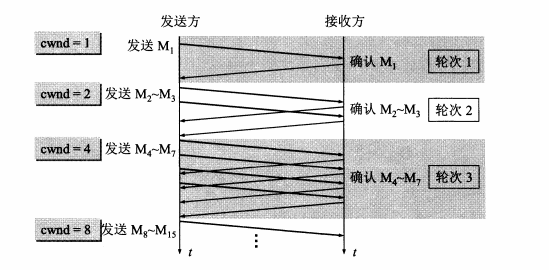
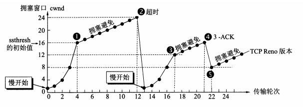
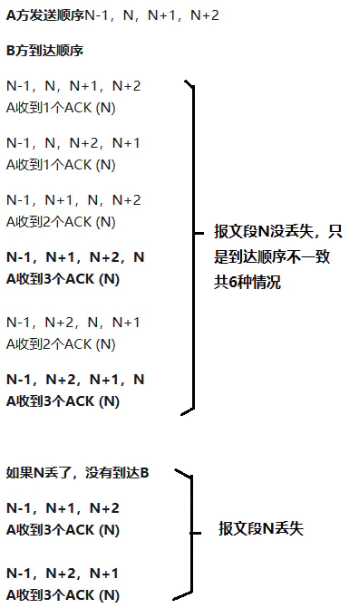
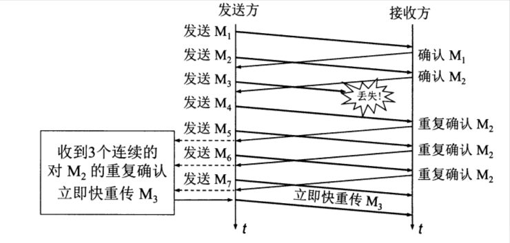
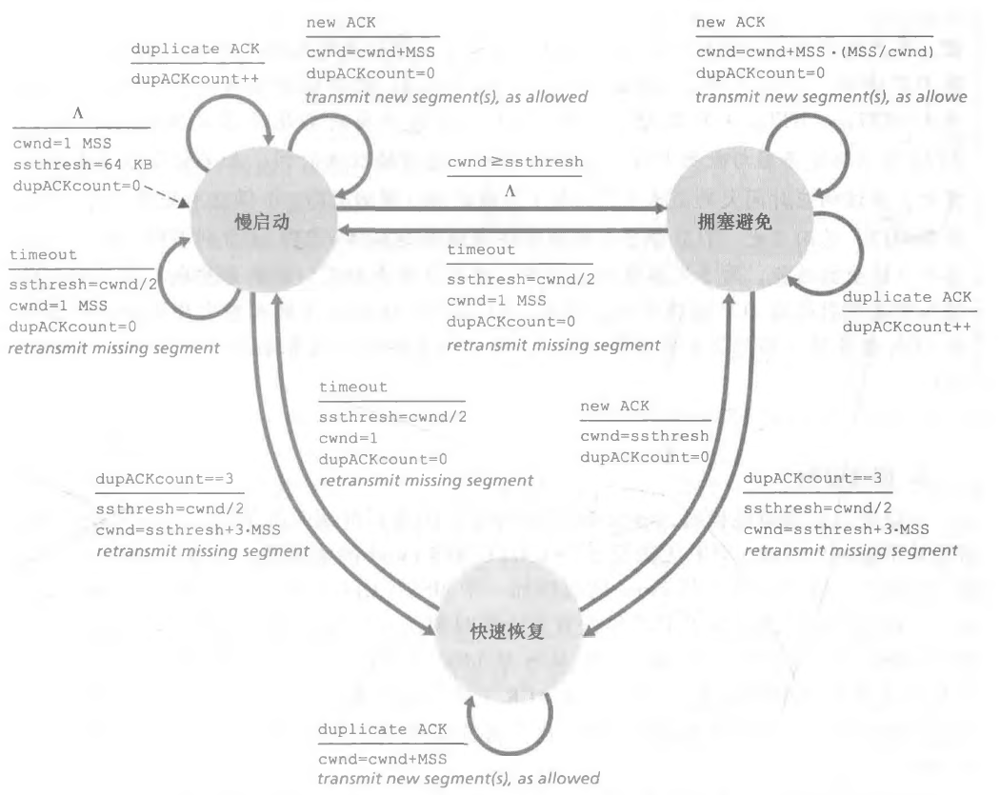
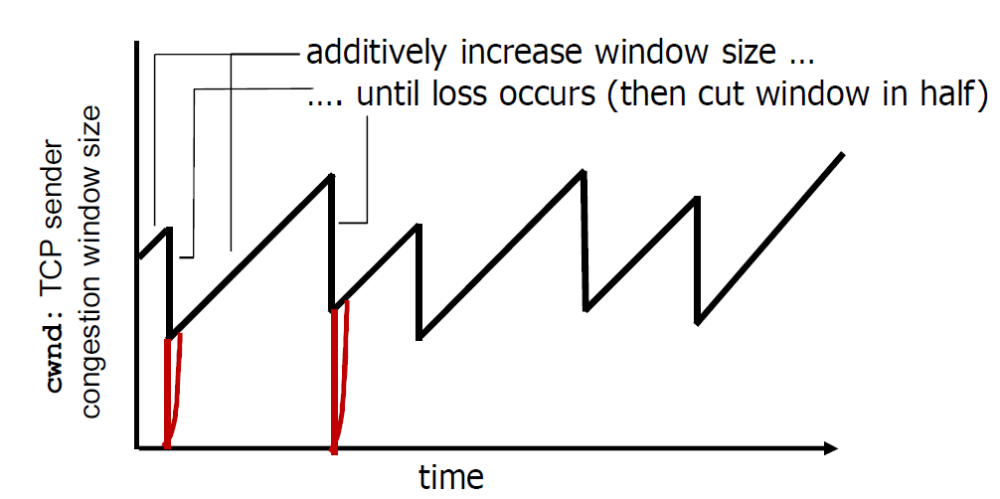
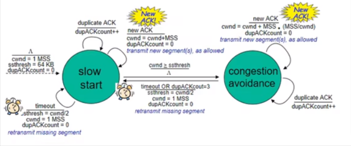
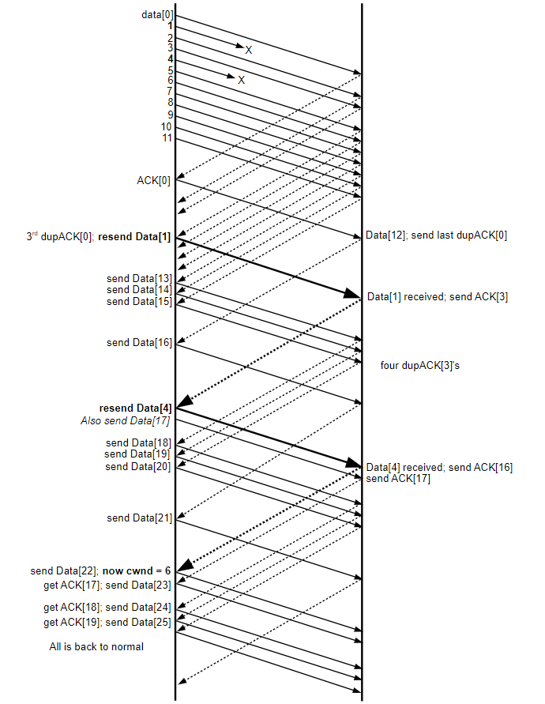

# TCP 协议之拥塞控制

## 一、TCP 拥塞控制

### 1.简介

在计算机网络中的链路容量（即带宽）、交换节点中的缓存和处理机等，都是网络的资源。**在某段时间，若对网络中某一资源的需求超过了该资源所能提供的可用部分，网络的性能就要变坏，这种情况就叫做拥塞。** 拥塞控制与流量控制的区别：

- **所谓的拥塞控制就是防止过多的数据注入到网络中，这样可以使网络中的路由器或者链路不致过载。** 拥塞控制所要做的都有一个前提，就是网络能够承受现有的网络负荷。拥塞控制是一个全局性的过程，涉及到所有的主机、所有的路由器，以及与降低网络传输性能有关的所有因素。
- 流量控制往往为在给定的发送端和接收端之间的点对点通信量的控制。流量控制所要做的就是抑制发送端发送数据的速率，以便使接收端来得及接收。

在最为宽泛的级别上，我们可以根据网络层是否为运输层拥塞控制提供了显式帮助，来区分拥塞控制方法。

- 端到端拥塞控制。在端到端拥塞控制方法中，网络层没有为运输层拥塞控制提供显式支持。即使网络中存在拥塞，端系统也必须通过对网络行为的观察（如分组丢失与时延）来推断之。TCP 采用端到端的方法解决拥塞控制，因为 IP 层不会向端系统提供有关网络拥塞的反馈信息。**TCP 报文段的丢失（通过超时或者 3 次冗余确认而得知）被认为是网络拥塞的一个迹象。**
- 网络辅助的拥塞控制。在在网络辅助的拥塞控制中，路由器向发送方提供关于网络中拥塞状态的显式反馈信息。

### 2.TCP 拥塞控制的一般原理

TCP 所采用的方法是让每一个发送方根据所感知到的网络拥塞程度来限制其能向连接发送流量的速率。如果一个 TCP 发送方感知从它到目的地之间的路径上没什么拥塞，则 TCP 发送方增加其发送速率；如果发送方感知沿着该路径有拥塞，则发送方就 会降低其发送速率。但是这种方法提出了如下三个问题：

1. 一个 TCP 发送方如何限制它向其连接发送流量的速率呢？
2. 一个 TCP 发送方如何感知从它到目的地之间的路径上存在拥塞呢？
3. 当发送方感知到端到端的拥塞时，采用何种算法来改变其发送速率呢？

#### 2.1.TCP 如何限制发送速率

我们首先分析一下 TCP 发送方是如何限制向其连接发送流量的。在之前我们看到，TCP 连接的每一端都是由一个接收缓存、一个发送缓存和几个变量（LastByteRead、 rwnd 等）组成。运行在发送方的 TCP 拥塞控制机制跟踪一个额外的变量，即拥塞窗口（congestion window）。**拥塞窗口表示为 cwnd，它对一个 TCP 发送方能向网络中发送流量的速率进行了限制。** 特别是，在一个发送方中未被确认的数据量不会超过 cwnd 与 rwnd 中的最小值，即：**`LastByteSent - LastByteAcked <= min {cwnd, rwnd}`**。

上面的约束限制了发送方中未被确认的数据量，因此间接地限制了发送方的发送速率。为了理解这一点，我们来考虑一个丢包和发送时延均可以忽略不计的连接。因此粗略地讲，在每个往返时间（RTT）的起始点，上面的限制条件允许发送方向该连接发送 cwnd 个字节的数据，在该 RTT 结束时发送方接收对数据的确认报文。因此，该发送方的发送速率大概是 **`cwnd/RTT`** 字节/秒。通过调节 cwnd 的值，发送方因此能调整它向连接发送数据的速率。

#### 2.2.TCP 如何感知发生了拥塞？

我们接下来考虑 TCP 发送方是如何感知在它与目的地之间的路径上出现了拥塞的。我们将一个 TCP 发送方的 "丢包事件" 定义为：要么出现超时，要么收到来自接收方的 3 个冗余 ACK。

这里需要注意，当出现了超时现象时，有两种可能情况，第一种就是分组由于连接路径上的一台或者多台路由器的缓存已满被丢弃，这时就表明网络出现过度的拥塞。第二种情况就是出错被丢弃了，没有通过校验。但是第二种情况在现在的网络信道中出现的概率比较小，因此主要是第一种情况。而当接收方收到 3 个冗余 ACK 时，就说明网络轻微拥塞，这是因为后续的分组还能到达接收方，让接收方返回冗余的确认 ACK，这说明网络还能进行一定程度的传输，拥塞情况比第一种好。

丢包事件被视为拥塞的标志，而 TCP 发送方将未确认报文段确认的正常到达作为一切正常的指示，即在网络上传输的报文段正被成功地交付给目的地，并且使用确认来增加窗口的长度（及其传输速率）。

#### 2.3.TCP 使用何种算法来改变发送速率？

- 一个丢失的报文段意味着拥塞，**因此当丢失报文段时应当降低 TCP 发送方的速率**。对于给定报文段，一个超时事件或四个确认（一个初始 ACK 和其后的三个冗余 ACK）被解释为跟随该四个 ACK 的报文段的 "丢包事件" 的一种隐含的指示。
- 一个确认报文段指示该网络正在向接收方交付发送方的报文段，**因此，当对先前未确认报文段的确认到达时，能够增加发送方的速率**。确认的到达被认为是一切顺利的隐含指示，即报文段正从发送方成功地交付给接收方，因此该网络不拥塞。拥塞窗口长度因此能够增加。
- 带宽探测：给定 ACK 指示源到目的地路径无拥塞，而丢包事件指示路径拥塞，TCP 调节其传输速率的策略是增加其速率以响应到达的 ACK，除非岀现丢包事件，此时才减小传输速率。因此，为探测拥塞开始出现的速率，TCP 发送方增加它的传输速率，从该速率后退，进而再次开始探测，看看拥塞开始速率是否发生了变化。注意到网络中没有明确的拥塞状态信令，即 ACK 和丢包事件充当了隐式信号，并且每个 TCP 发送方根据异步于其他 TCP 发送方的本地信息而行动。

TCP 进行拥塞控制的算法有四种，即慢开始（slow-start）、拥塞避免（congestion avoidance）、快重传（fast retransmit）和快恢复（fast recovery）。为了集中精力讨论拥塞控制，我们假定：

1. 数据是单方向传送的,对方只传送确认报文。
2. 接收方总是有足够大的缓存空间,因而发送窗口的大小由网络的拥塞程度来决定。

## 二、TCP Reno 算法

### 1.慢开始和拥塞避免

下面讨论的拥塞控制也叫做基于窗口的拥塞控制。为此，发送方维持一个叫做拥塞窗口 cwnd（congestion window）的状态变量。拥塞窗口的大小取决于网络的拥塞程度，并且动态地在变化。发送方让自己的发送窗口等于拥塞窗口。发送方控制拥塞窗口的原则是：只要网络没有出现拥塞，拥塞窗口就再增大一些，以便把更多的分组发送出去，提高网络的利用率。但只要网络出现拥塞，拥塞窗口就减小一些，以减少注入到网络中的分组数。**而只要发送方没有按时收到应当到达的确认报文，即出现了超时，那么就可以猜想网络出现了拥塞**。

发送端的主机在确定发送报文段的速率时，既要根据接收端的能力，又要考虑不使网络发生拥塞，因此 TCP 要求发送端维护以下两个窗口：

- 接收端窗口 rwnd：接收端根据其目前接收缓存的大小所许诺的最新窗口值，反映了接收端的容量
- 拥塞窗口 cwnd：发送端根据自己估计的网络拥塞程度而设置的窗口值，反映了网络的当前容量

发送端发送窗口的上限值应该取 rwnd 和 cwnd 两个变量中较小的一个。不过我们接下来的讨论都假设接收端的缓存大小为无限大，因此发送窗口的大小只由网络的拥塞程度来决定（**发送端让自己的发送窗口的大小等于拥塞窗口的大小**）。

#### 1.1.慢开始

慢开始算法的思路是这样的:当主机开始发送数据时，由于并不清楚网络的负荷情况，所以如果立即把大量数据字节注入到网络，那么就有可能引起网络发生拥塞。经验证明，较好的方法是先试探一下，即由小到大逐渐增大发送窗口，也就是说，由小到大逐渐增加拥塞窗口数值。

慢开始的具体算法如下（使用报文段作为窗口大小的单位）：

**（1）拥塞窗口的初始值**

旧的规定是这样的：在刚刚开始发送报文段时，先把初始拥塞窗口 cwnd 设置为 1 至 2 个发送方的最大报文段 SMSS（Sender Maximum Segment Size）的数值，但新的 RFC5681 把初始拥塞窗口 cwnd 设置为不超过 2 至 4 个 SMSS 的数值。具体的新规定如下：

- 若 **`SMSS>2190`** 字节，则设置初始拥塞窗口 **`cwnd=2×SMSS`** 字节，且不得超过 2 个报文段。
- 若 （**`SMSS>1095`** 字节） 且 （**`SMSS≤2190`** 字节），则设置初始拥塞窗口 **`cwnd=3×SMSS`** 字节，且不得超过 3 个报文段。
- 若 **`SMSS≤1095`** 字节，则设置初始拥塞窗口 **`cwnd=4×SMSS`** 字节，且不得超过 4 个报文段。

可见这个规定就是限制初始拥塞窗口的字节数。

**（2）拥塞窗口的增加**

慢开始算法规定，在每收到一个对新的报文段的确认之后，可以把拥塞窗口增加最多一个 SMSS 的数值，具体的算法：**`拥塞窗口 cwnd 每次的增加量 = min(N, SMSS)`**。

其中 N 是原先未被确认的、但现在被刚收到的确认报文段所确认的字节数。不难看出，当 **`N < SMSS`** 时，拥塞窗口每次的增加量要小于 SMSS。这里使用 N 是因为既然发送方收到了接收方对 N 个字节的确认，就说明这 N 个字节已经被接收方接收并且保存到了缓存中，这 N 个字节已经离开了网络，不再消耗网络资源，所以可以把拥塞窗口适当的扩大 N 个字节，但是这 N 个字节不能超过 SMSS 报文的大小。用这样的方法逐步增大发送方的拥塞窗口 cwnd，可以使分组注入到网络的速率更加合理。下面用例子说明慢开始算法的原理。请注意，虽然实际上 TCP 是用字节数作为窗口大小的单位。但为叙述方便起见，我们用报文段的个数作为窗口大小的单位，这样可以使用较小的数字来阐明拥塞控制的原理。

在一开始发送方先设置 **`cwnd=1`**（1 个报文段大小），发送第一个报文段 M1，接收方收到后确认 M1。发送方收到对 M1 的确认后，把 cwnd 从 1 增大到 2，于是发送方接着发送 M2 和 M3 两个报文段。接收方收到后发回对 M2 和 M3 的确认。发送方每收到一个对新报文段的确认（重传的不算在内）就使发送方的拥塞窗口加 1，因此发送方在收到两个确认后，**`cwnd`** 就从 2 增大到 4，并可发送 M4~M7 共 4 个报文段。因此使用慢开始算法后，每经过一个传输轮次（transmission round），拥塞窗口 cwnd 就加倍。

  

**我们还要指出，慢开始的 "慢" 并不是指 cwnd 的增长速率慢，而是指在 TCP 开始发送报文段时先设置 cwnd=1，使得发送方在开始时只发送一个报文段（目的是试探一下网络的拥塞情况），然后再逐渐增大 cwnd。** 这当然比设置大的 cwnd 值一下子把许多报文段注入到网络中要 "慢得多"。这对防止网络出现拥塞是一个非常好的方法。

#### 1.2.拥塞避免

为了防止拥塞窗口 cwnd 增长多大引起网络拥塞，还需要设置一个慢开始门限 ssthresh 状态变量（如何设置 ssthresh，后面还要讲）。慢开始门限 ssthresh 的用法如下:

- 当 **`cwnd<ssthresh`** 时，使用上述的慢开始算法。
- 当 **`cwnd=ssthresh`** 时，既可使用慢开始算法，也可使用拥塞避免算法。
- 当 **`cwnd>ssthresh`** 时，停止使用慢开始算法而改用拥塞避免算法。

拥塞避免算法的思路是让拥塞窗口 cwnd 缓慢地增大，即每经过一个往返时间 RTT 就把发送方的拥塞窗口 cwnd 加 1，而不是像慢开始阶段那样加倍增长。

请注意，因为现在是讲原理，把窗口的单位改为报文段的个数。实际上应当是 "拥塞窗口仅增加一个 SMSS 的大小，单位是字节"。在具体实现拥塞避免算法的方法时，可以按照下述公式来完成，只要收到一个新的确认，就使拥塞窗口 cwnd 增加 **`SMSS * SMSS / cwnd`** 个字节。例如，假定 cwnd 等于 10 个 SMSS 的长度，而 SMSS 是 1460 字节。发送方可一连发送 14600 字节（即 10 个报文段）。假定接收方每收到一个报文段就发回一个确认。于是发送方每收到一个新的确认，就把拥塞窗口稍微增大一些，即增大 **`SMSS * 0.1 = 146`** 字节。经过一个往返时间 RTT（或一个传输轮次）后，发送方共收到 10 个新的确认，拥塞窗口就增大了 1460 字节，正好是一个 MSS 的大小。**`拥塞窗口 cwnd 每次的增加量 = SMSS * SMSS / cwnd`**。

我们用以下的例子来进行说明。当 TCP 连接进行初始化时，把拥塞窗口 cwnd 置为 1。为了便于理解，图中的窗口单位不使用字节而使用报文段的个数。在本例中，慢开始门限的初始值设置为 16 个报文段，即 **`ssthresh=16`**。在执行慢开始算法时，发送方每收到一个对新报文段的确认 ACK，就把拥塞窗口值加 1，然后开始下一轮的传输（请注意，下图中的横坐标是传输轮次，不是时间）。

因此拥塞窗口 cwnd 随着传输轮次按指数规律增长。当拥塞窗口 cwnd 增长到慢开始门限值 ssthresh 时（图中的点 0，此时拥塞窗口 **`cwnd=16`**），就改为执行拥塞避免算法，拥塞窗口按线性规律增长。但请注意，"拥塞避免" 并非完全能够避免了拥塞。"拥塞避免" 是说把拥塞窗口控制为按线性规律增长，使网络比较不容易出现拥塞。

    
拥塞控制图

    

当拥塞窗口 **`cwnd=24`** 时，网络出现了超时（图中的点②），发送方判断为网络拥塞。**于是调整门限值 **`ssthresh=cwnd/2=12`**，同时设置拥塞窗口 cwnd=1，就开始慢开始阶段**。按照慢开始算法，发送方每收到一个对新报文段的确认 ACK，就把拥塞窗口值加 1。当拥塞窗口 **`cwnd=ssthresh=12`** 时（图中的点 3，这时新得 ssthresh 值），改为执行拥塞避免算法，拥塞窗口按线性规律增大。但是在图中的 4 点，发送方一连接收到 3 个对同一个报文段的重复确认（图中标记为 **`3-ACK`**），这和快重传和快恢复算法有关。

### 2.快速重传

我们知道基本的 TCP 超时重传算法，是设定一个计时器，如果在计时器设定的时间范围内，没有收到对某一个已发送报文段的确认，就要重传该报文段。这样做有两个缺点：

- 第一个就是当一个报文段丢失时，会等待一定的超时周期然后才重传分组，增加了端到端的时延。
- 第二个就是，当出现计时器超时时，发送端就会误认为网络发生了拥塞。这就导致发送方错误地启动慢开始，把拥塞窗口 cwnd 又设置为 1，因而降低了传输效率。

快速重传是 RFC5681 定义的一个过程。快速重传不依赖定时器的超时，而是依靠 ACK 确认包来进行重传。使用快速重传相比 RTO 超时重传通常可以更高效的修复 TCP 丢包问题。快速重传是基于两个前提：

- 即按照 RFC5681，当 TCP 收到一个乱序报文的时候应该立即回复 ACK 确认包，或者换一种说法，即当接收端收到比期望序号大的报文段时，便会重复发送最近一次确认的报文段的确认信号，我们称之为冗余 ACK（duplicate ACK）。从这里可知，包丢失以及包乱序都会引发 dup ack
- 不会延迟 ACK 确认

我们举个例子假设有 5 个 TCP 报文，P1(1-10)、P2(11-20)、P3(21-30)、P4(31-40)、P5(41-50)，其中括号中标注的是报文的比特系列号，每个报文的长度都为 10bytes。假设发送端依次发送这 5 个报文，其中 P2 报文在网络传输过程中丢失，P1、P3、P4、P5 报文依次按序到达，接收端收到这 P1 的时候发送 ack=11 的确认包（实际上这里可能会延迟发送 ACK 报文，为了描述简单我们假设立即发送 ACK 报文），接收端收到 P3 的时候发现是乱序的报文则会立即回复 ack=11 确认包（还记得 ACK 是累计确认的吧，因为 P2 丢失了 ACK 只能累计到 11），同样后面收到 P4 和 P5 的时候还是会回复 ack=11 的确认包。这样发送端就会连续接收到 4 个 ack=11 的确认包，后面三个确认包因为和第一个 ack number 重复，因为称呼为 duplicate ACK。因此接收端就可以依据 dup ACK 来推测接收端的接收情况。

但是我们之前说过 IP 层不会向 TCP 提供有序的数据报文，如果网络传输过程中发生乱序导致接收端接收顺序变为 P1、P3、P2、P4、P5，这样的情况下也会产生一个 dup ACK（ack=11，收到 P1 时，回复 ack=11，收到 P3 时，也回复 ack=11，即为 dup ack，这之后的 ack 都不同）。我们通过一个 dup ACK 并不能可靠的确认是发生了丢包还是发生了乱序传输，因此会存在一个门限（duplicate ACK threshold 或者叫做 dupthresh），当 TCP 收到的 dup ACK 数超过这个门限的时候，就会认为发生了丢包，进而初始化一个快速重传。最初协议中给出的 dupthresh 这个门限是 3。

接下来我们要着重讲解一下，为什么是 3 次冗余 ACK，首先要明白一点，即使发送端是按序发送，由于 TCP 包是封装在 IP 包内，IP 包在传输时乱序，意味着 TCP 包到达接收端也是乱序的，乱序的话也会造成接收端发送冗余 ACK。那发送冗余 ACK 是由于乱序造成的还是包丢失造成的，这里便需要好好权衡一番，因为把 3 次冗余 ACK 作为判定丢失的准则其本身就是估计值。假定通信双方如下：

A 为发送端，B 为接收端
A 的待发报文段序号为 N-1，N，N+1，N+2，假设报文段 N-1 成功到达

  

TCP segment 乱序有 2/5 = 40% 的概率会造成 A 收到三次 duplicated ACK(N)，而如果 N 丢了，则会 100% 概率 A 会收到三次 duplicated ACK(N)，基于以上的统计，当 A 接收到三次 duplicated ACK(N) 启动 Fast Retransmit 算法是合理的，即立马 retransmit N，可以起到 Fast Recovery 的功效，快速修复一个丢包对 TCP 管道的恶劣影响。而如果 A 接收到二次 duplicated ACK(N)，则一定说明是乱序造成的，即然是乱序，说明数据都到达了 B，B 的 TCP 负责重新排序而已，没有必要 A 再来启动 Fast Retransmit 算法。（注意，3 次冗余 ACK 是不包括最开始的正常 ACK 的，以上只是为了说明情况，就直接使用三次 ACK 进行举例，需要注意区分）。

最后是 RFC 文档的解释：Since TCP does not know whether a duplicate ACK is caused by a lost segment or just a reordering of segments, it waits for a small number of duplicate ACKs to be received. It is assumed that if there is just a reordering of the segments, there will be only one or two duplicate ACKs before the reordered segment is processed, which will then generate a new ACK. If three or more duplicate ACKs are received in a row, it is a strong indication that a segment has been lost. TCP then performs a retransmission of what appears to be the missing segment, without waiting for a retransmission timer to expire.

  

如上图所示，接收方收到了 M1 和 M2 后都分别及时发出了确认。现假定接收方没有收到 M3 但却收到了 M4。但按照快重传算法，收到了失序的报文段 M4，因此接收方必须发送对 M2 的重复确认（不能延迟确认）。发送方接着发送 M5 和 M6。接收方收到后也仍要再次分别发出对 M2 的重复确认。这样，发送方共收到了接收方的 4 个对 M2 的确认，其中后 3 个都是重复确认。**快重传算法规定，发送方只要一连收到 3 个重复确认，就知道接收方确实没有收到报文段 M3，因而应当立即进行重传（即 "快重传"），而不会等待计时器超时，发送方也不就会误认为出现了网络拥塞。** 这样也就解决了之前提到过的两个缺点。使用快重传可以使整个网络的吞吐量提高约 20%。

### 3.快速恢复

在拥塞控制图中的点 ④，发送方知道现在只是丢失了个别的报文段。于是不启动慢开始，而是执行快恢复算法。这时，发送方调整门限值 **`ssthresh=cwnd/2=8`**，同时设置拥塞窗口 **`cwnd=ssthresh=8`**，并开始执行拥塞避免算法。注意，虽然 RFC 5681 给出了根据已发送出但还未被确认的数据的字节数来设置 ssthresh 的新的计算公式，即 **`ssthresh=max (FlightSize / 2, 2 x SMSS)`**。这里 FlightSize 是正在网络中传送的数据量。但在讨论拥塞控制原理时，我们就采用这种把问题简化的方法（即把慢开始门限减半）来表述。

### 4.总结

  

上图是 TCP 拥塞控制的有限状态机图，确切地说是 TCP Reno 算法的有限状态机图。刚开始 TCP 处于慢启动状态，**`cwnd = 1`**，然后如果每收到对一个报文段的 ACK 确认，那么拥塞窗口 cwnd 的长度就增加 1，也就是每经过一个传输轮次 RTT，cwnd 的窗口值就翻倍。如果在慢启动阶段发生了超时，那么还是处于慢启动阶段并且将 ssthresh 设置为发生拥塞时 cwnd 的一半（目的是为了准确探测出拥塞开始时的速率）。如果 cwnd 的值到达 ssthresh，这个 ssthresh 就是上次发生拥塞时，cwnd 窗口值的一半，因此当拥塞窗口达到了 ssthresh 时，再和慢启动时一样指数增长是不妥的，我们的目的是探测出拥塞开始的速率，因此进入拥塞避免状态，每经过一个 RTT 传输轮次，cwnd 的长度增加 1，即 cwnd 慢慢增大。当收到 3 个冗余 ACK 时，说明网络可能发生了轻微拥塞，要进入到快速恢复阶段，并且重传丢失的分组（即 3 次冗余确认 ACK 后面的分组）。在快速恢复阶段，如果继续收到冗余 ACK，那么就发送新的报文段（这里可能是因为收到冗余确认，说明后续发送的新报文段被接收方接收到，即网络还存在一些通信的能力，因此可以发送新的报文段），每经过一个 RTT 传输轮次，cwnd 就增大一倍。如果在快速恢复阶段，又收到了新的 ACK 确认（不是冗余确认），那么就进入到拥塞避免阶段。

**忽略一条连接开始时初始的慢启动阶段，假定丢包由 3 个冗余的 ACK 而不是超时指示，TCP 的拥塞控制是：每个 RTT 内 cwnd 线性（加性）增加 1MSS，然后出现 3 个冗余 ACK 事件时 cwnd 减半（乘性减）。** 因此，TCP 拥塞控制常常被称为加性增、乘性减 （Additive-Increase, Multiplicative-Decrease, 在下图中所示的 "锯齿" 行为，这也 很好地图示了我们前面 TCP 检测带宽时的直觉，即 TCP 线性地增加它的拥塞窗口长度（因此增加其传输速率），直到出现 3 个冗余 ACK 事件。然后以 2 个因子来减少它的拥塞窗口长度，然后又开始了 线性增长，探测是否还有另外的可用带宽。下图中红色的部分表示慢启动，但是慢启动由于是指数增长，因此持续时间很短，可以忽略不计。

  

下面介绍 TCP 拥塞控制其余两个算法：Tahoe 和 New Reno 算法。

## 三、TCP 拥塞控制之 Tahoe 算法

  

Reno 算法有三个状态：慢开始、拥塞避免以及快速恢复，但是 Tahoe 算法只有两个状态：慢开始和拥塞避免。Tahoe 也是通过超时和三次冗余 ACK 来判断网络中是否出现拥塞。Tahoe 算法的具体过程如下（与 Reno 非常类似）：

- 慢开始状态：每经过一个 RTT 传输轮次，拥塞窗口 cwnd 就加倍。当发生超时或者接收到 3 次冗余 ACK 时，重传丢失分组，并且重新进入到慢启动阶段，**`cwnd = 1MSS`**，拥塞窗口 cwnd 的一半变成新的警戒状态。当达到警戒阈值时，从慢开始状态进入到拥塞避免状态。
- 拥塞避免状态：每经过一个 RTT 传输轮次，拥塞窗口 cwnd 就增加 1 个 MSS 长度，超时或者接收到 3 个冗余 ACK 时，重发丢失分组，并且进入到慢启动状态。

## 四、TCP 拥塞控制之 New Reno 算法

在之前的第二节，介绍了 TCP 中最经典的 Reno 拥塞控制算法，这里介绍对 Reno 算法的改进 -- New Reno 算法。Reno 算法的问题就是在收到一个新的 ACK 就退出了快速恢复状态，比较适合于单个段被丢弃的情况。但是经常地在拥塞时，出现成串分组被丢弃，比如下面 A-F 依次发出给接收方，但是 C、D、E 这三个分组在传送的过程中丢失。如果发送方收到对于分组 B 的三次冗余确认，那么就重传 C 并进入到快速恢复阶段。此时若 TCP 发送方收到了对于 C 分组的确认，按照 Reno 算法，收到新的确认就会进入到拥塞避免（CA）状态，在这个 CA 状态中，D 和 E 分组就不会被重发，而是会出现超时问题，进入到慢启动状态，使得发送的速率降得过低。又或者在 CA 状态中，又收到了对于 D 分组的 3 次冗余确认，进入到快速恢复阶段，拥塞窗口 cwnd 的大小频繁减半。

  

**New Reno 算法的改进之处在于，需要等待所有待确认的段都被重传，并且得到确认之后（当然超时也会从该状态中走出）才可以从快速恢复阶段走出。** New Reno 算法适合的场景是多个分组（段）被丢弃的情况，避免丢失段后续的丢失段超时，进入慢启动状态，降低吞吐量。下面看一下 RFC 6582 是如何介绍 TCP New Reno 算法。

For the typical implementation of the TCP fast recovery algorithm described in [RFC5681] （first implemented in the 1990 BSD Reno release, and referred to as the "Reno algorithm" in [FF96]）, the TCP data sender only retransmits a packet after a retransmit timeout has occurred, or after three duplicate acknowledgments have arrived triggering the fast retransmit algorithm. A single retransmit timeout might result in the retransmission of several data packets, but each invocation of the fast retransmit algorithm in RFC 5681 leads to the retransmission of only a single data packet.

Two problems arise with Reno TCP when multiple packet losses occur in a single window. First, Reno will often take a timeout, as has been documented in [Hoe95]. Second, even if a retransmission timeout is avoided, multiple fast retransmits and window reductions can occur, as documented in [F94]. When multiple packet losses occur, if the SACK option [RFC2883] is available, the TCP sender has the information to make intelligent decisions about which packets to retransmit and which packets not to retransmit during fast recovery.

This document applies to TCP connections that are unable to use the TCP Selective Acknowledgment（SACK）option, either because the option is not locally supported or because the TCP peer did not indicate a willingness to use SACK.

In the absence of SACK, there is little information available to the TCP sender in making retransmission decisions during fast recovery. From the three duplicate acknowledgments, the sender infers a packet loss, and retransmits the indicated packet. After this, the data sender could receive additional duplicate acknowledgments, as the data receiver acknowledges additional data packets that were already in flight when the sender entered fast retransmit.

In the case of multiple packets dropped from a single window of data, the first new information available to the sender comes when the sender receives an acknowledgment for the retransmitted packet（that is, the packet retransmitted when fast retransmit was first entered）. If there is a single packet drop and no reordering, then the acknowledgment for this packet will acknowledge all of the packets transmitted before fast retransmit was entered. However, if there are multiple packet drops, then the acknowledgment for the retransmitted packet will acknowledge some but not all of the packets transmitted before the fast retransmit. We call this acknowledgment a partial acknowledgment.

The basic idea of these extensions to the fast retransmit and fast recovery algorithms described in Section 3.2 of [RFC5681] is as follows. The TCP sender can infer, from the arrival of duplicate acknowledgments, whether multiple losses in the same window of data have most likely occurred, and avoid taking a retransmit timeout or making multiple congestion window reductions due to such an event. The NewReno modification applies to the fast recovery procedure that begins when three duplicate ACKs are received and ends when either a retransmission timeout occurs or an ACK arrives that acknowledges all of the data up to and including the data that was outstanding when the fast recovery procedure began.

接下来结合具体的例子讲解 TCP New Reno 算法。假定 A 为发送方，B 为接收方，并且拥塞窗口的大小为 12。从图中可以看出，1 和 4 号分组已经丢失，因此 A 发送的 0 - 11 号（窗口大小为 12，只能发送 12 个分组）分组，B 都回复 ACK[0]。也就是只确认了 A 发送的 0 号分组，因此拥塞窗口只能向前移动一个分组，然后发送 12 号分组。接下来，A 收到了 3 次冗余 ACK[0] 确认，因此重传丢失的 data[1] 分组，并进入到快速恢复阶段。在快速恢复阶段，如果接收到冗余确认，并且上层应用程序有数据分组要发送，那么就可以传输新分组。

但是从图中看出，可能没有新的数据要发送，因此 A 重传丢失分组并随后接收到多个冗余确认后，没有进行任何动作。但是随后发送了 13、14、15、16 三个分组到接收方 B。接着当 A 收到 ACK[3] 这个部分确认（partial acknowledgment）之后，就意味着出现了数据丢失，因此重传 4 号分组，并且在收到部分确认之后，如果有新的分组要发送，也可以随后发送出去。接下来，A 每收到一次重复确认，就继续发送新的数据分组。当 A 收到 ACK[16]（也就是 A 重传 4 号分组之前，一共发送了 16 个数据分组，如果 A 收到的不是 ACK[16]，而是要比 ACK[16] 小，那么就说明还有丢失分组需要继续重传），就从快速恢复状态中离开，cwnd 被设置为 ssthresh，也就是 6，进入拥塞避免状态。

  

综上，New Reno 只是对 Reno 算法中处于快速恢复状态的行为进行了修改（其余状态和 Reno 算法一致），具体算法如下：

- 进入快速恢复状态 FR：三个冗余 ACK，同 Reno（**`ssthresh = cwnd / 2`**，**`cwnd = ssthresh + 3`**）
- 在快速恢复状态 FR：
  - 再收到冗余 ACK：同 Reno（cwnd = cwnd + 1，条件允许传新段）
  - 部分确认（PACK）：收到部分新确认，仍然保持在快速恢复状态
    - 发送确认后面的段，冗余 ACK 数量 = 0，定时器复位不要超时了，**`cwnd = cwnd + 1`**
    - 有新的段可以发送，发送新的段
  - 恢复确认（RACK）：收到所有段的确认
    - **`cwnd = ssthresh`**，定时器复位
    - 进入到拥塞避免 CA 阶段

不过 New Reno 也存在一些问题，就是一个 RTT 也只能恢复一个段的丢失。
