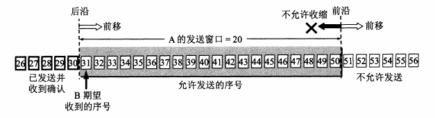
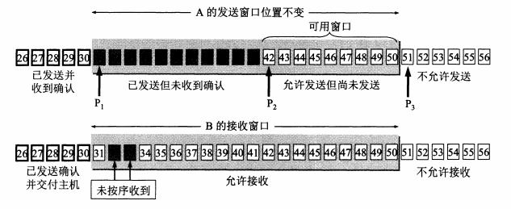
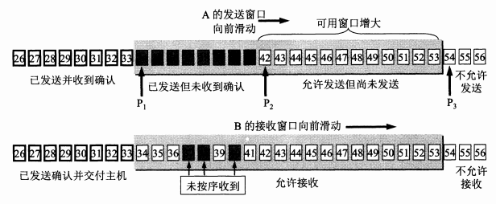
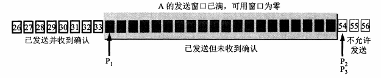
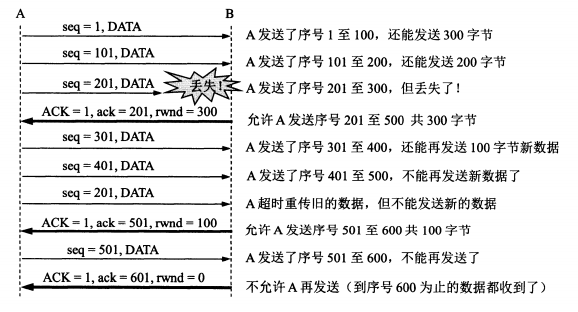

# TCP 协议之滑动窗口

我们首先介绍以字节为单位的滑动窗口，为了讨论方便，假定数据的传输只在一个方向进行。A 发送数据，B 给出确认。

## 1.以字节为单位的滑动窗口

**TCP 的滑动窗口是以字节为单位的。** 现在假定 A 收到了 B 发来的确认报文段，其中窗口是 20 字节（B 现在最多可以接收 20 个字节数据），而确认号是 31（这表明 B 期望收到的下一个字节序号是 31）根据这两个数据，A 就构造出来了自己的发送窗口，如下所示：

  

A 的发送窗口表示：在没有收到 B 的确认的情况下，A 可以连续把窗口内的数据都发送出去，凡是已经发送过的数据，在未收到确认之前都必须暂时保留，以便在超时重传时使用。发送窗口里面的序号表示允许发送的序号，显然，窗口越大，发送方就可以在收到对方确认之前连续发送更多的数据，因而能够获得更高的传输效率。**不过 A 的发送窗口一定不能超过 B 的接收窗口数值。** 同时，发送窗口的大小还要受到网络拥塞程度的制约。

发送窗口后沿后面的部分表示已发送且已经收到了确认，这些数据显然不需要再保留。而发送窗口前沿的前面部分表示不允许发送的，因为接收方都没有为这部分数据保留临时存放的缓存空间。发送窗口的位置由窗口前沿和后沿的位置共同确定。发送窗口后沿的变化情况有两种可能，即不动（没有收到新的确认）和前移（收到了新的确认）。发送窗口后沿不可能向后移动，因为不能撤销掉己收到的确认。发送窗口前沿通常是不断向前移动，但也有可能不动。这对应于两种情况：一是没有收到新的确认，对方通知的窗口大小也不变：二是收到了新的确认但对方通知的窗口缩小了，使得发送窗口前沿正好不动。

## 2.滑动窗口举例

现在假定 A 发送了序号 31-41 的数据，这时，发送窗口位置并未改变，但发送窗口内有 11 个黑色小方框表示的字节，表明已经发送但是还没有收到确认。而发送窗口内的其余 9 个字节是允许发送的，但是尚未发送的。

  

再看一下 B 的接收窗口，B 的接收窗口的大小为 20，在接收窗口外面，到 30 号为止的数据是已发送过确认，并且数据已经交付给主机，因此可以不保留这些数据。接收窗口内的序号（31-50）是允许接收的。在上图中，B 收到了序号为 32 和 33 的数据，这些数据没有按序到达（31 数据没有收到），这里请注意，B 只能对按序收到的数据中的最高序号给出确认，因此 B 发送的确认报文段的确认号任然为 31（期望收到的序号）。

现在假定 B 收到了 31 数据，并且把 31-33 代表的数据交付给了主机，然后 B 删除这些数据。接着把接收窗口向前移动了 3 个序号，同时给 A 发送确认，在确认报文中，窗口值仍然为 20，但确认号为 34。我们注意到，B 还收到了序号 37,38,40 的数据，但是这些都没有按序到达，只能先缓存在接收窗口中。A 收到 B 的确认后，就可以把发送窗口向前移动 3 个序号。

  

A 在继续发送完序号 42-53 的数据后，指针 P2 向前移动和 P3 重合。发送窗口内的序号都已经用完，但还没有收到确认。由于 A 的发送窗口已满，可用窗口已经减小到 0，因此必须停止发送。请注意，也存在以下可能性，就是发送窗口内所有的数据都已经正确到达 B，B 也早已发出了确认。但不幸的是，所有这些确认都滞留在网络中。在没有收到 B 的确认时，为了保证可靠传输，A 只能认为 B 还没有收到这些数据。于是，A 在经过一段时间后（由超时计时器控制）就重传这部分数据，重新设置超时计时器，直到收到 B 的确认为止。

  

根据以上讨论，我们还需要强调以下 4 点：

- 虽然 A 的发送窗口是根据 B 的接收窗口设置的，但是在同一时刻，A 的发送窗口并不总是和 B 的接收窗口一样大。这是因为通过网络传送窗口值需要经历一定的时间滞后性（也因为同时还需要考虑拥塞窗口的大小）。
- **对于不按序到达的数据应该如何处理：如果接收方把不按序到达的数据一律丢弃，那么接收窗口的管理会比较简单，但这样做对网络资源的利用不利（因为发送方会重复传送比较多的数据）。因此 TCP 通常对不按序到达的数据是先临时存放在窗口中，等到字节流中所缺少的字节收到后，再按序交付上层的应用进程。**
- TCP 要求接收方必须要有累积确认的功能。另外接收方可以在合适的时候发送确认，也可以在自己有数据要发送时把确认信息顺便捎带上。但请注意两点。一是接收方不应过分推迟发送确认，否则会导致发送方不必要的重传，这反而浪费了网络的资源。**TCP 标准规定，确认推迟的时间不应超过 0.5 秒。** 二是捎带确认实际上并不经常发生，因为大多数应用程序很少同时在两个方向上发送数据。
- 最后就是 TCP 的通信是全双工通信。通信中的每一方都在发送和接收报文段。因此，每一方都有自己的发送窗口和接收窗口。在谈到这些窗口时，一定要弄清是哪方的窗口。

## 3.流量控制

在这一小节，我们介绍一下如何用前面所讲的滑动窗口来实现流量控制。一般说来，我们总是希望数据传输的更快一些，但如果发送方把数据传输的过快，接收方可能来不及接收，这就会造成数据的丢失。**所谓流量控制就是让发送方的发送速率不要太快，要让接收方来得及接收。** 而利用滑动窗口机制可以很方便的在 TCP 连接上实现对发送方的流量控制。

  

设 A 向 B 发送数据。在连接建立时，B 通知 A 接收窗口的大小为 `rwnd=400`（`rwnd` 表示 receiver window）（TCP 建立连接时，窗口的协商过程在图中没有显示出来）。而且，发送方的发送窗口不能超过接收方给出的接收窗口的数值。请注意，TCP 的窗口单位是字节，而不是报文段。图中箭头上面大写 ACK 表示首部中的确认位 ACK，小写 ack 表示确认字段的值。

上图中，接收方的主机 B 进行了三次流量控制，第一次把窗口减小到 `rwnd=300`，第二次有减小到 `rwnd=100`，最后减小到 `rwnd=0`，即不允许发送方再发送数据了。这种使发送方暂停发送的状态将持续到主机 B 重新发送一个新的窗口值为止。现在我们考虑一种情况，B 向 A 发送了零窗口报文不久，B 的接收缓存又有了一些存储空间。于是 B 向 A 发送了 `rwnd=400` 的报文段，然而这个报文段在传送的过程中丢失了。A 一直等待收到 B 发送的非零窗口通知，而 B 也一直等待 A 发送的数据。这就形成了一个死锁局面。

**为了解决上面这个问题，TCP 为每个连接设置一个持续计时器（persistence timer)，只要 TCP 连接的一方（比如 A）收到对方的零窗口通知，A 就启动持续计时器。** 若持续计时器设置的时间到期，A 就发送一个零窗口探测报文，而对方（也就是 B）就在确认这个探测报文时给出了现在的窗口值，如果窗口值仍然为 0，那么 A 就开始重新设置持续计时器。如果窗口不为 0，那么死锁的僵局就可以打破了。
