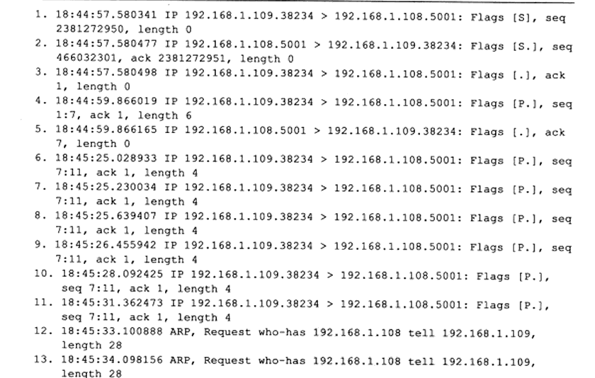
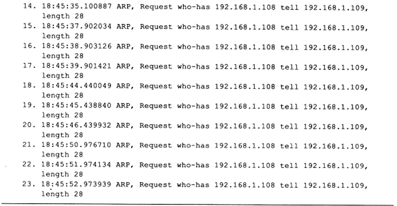
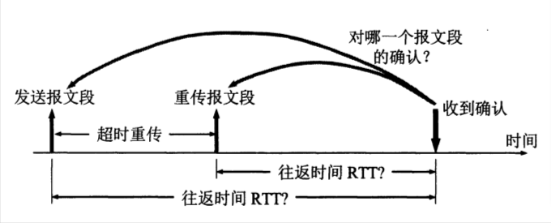

# TCP 协议之超时重传

## 1 超时重传简介

在之前，我们讲述了 TCP 在正常网络情况下的数据流。从本节开始，我们讨论异常网络状况下（开始出现超时或丢包），TCP 如何控制数据传输以保证其承诺的可靠服务。**TCP 服务必须能够重传超时时间内未收到确认的 TCP 报文段。** 为此，TCP 模块为每个 TCP 报文段都维护一个重传定时器，该定时器在 TCP 报文段第一次被发送时启动。如果超时时间内未收到接收方的应答，TCP 模块将重传 TCP 报文段并重置定时器。至于下次重传的超时时间如何选择，以及最多执行多少次重传，就是 TCP 的重传策略。我们通过实例来研究 Linux 下 TCP 的超时重传策略。

在 ernest-laptop（**`192.168.1.108`**）上启动 iperf 服务器程序，然后从 Kongming20（**`192.168.1.109`**）上执行 telnet 命令登录该服务器程序。接下来，从 telnet 客户端发送一些数据（此处是 "1234"）给服务器，然后断开服务器的网线并再次从客户端发送一些数据给服务器（此处是 "12"）。同时，用 tcpdump 抓取这一过程中客户端和服务器交换的 TCP 报文段。具体操作过程如下：

  

  

TCP 报文段 1~3 是三次握手建立连接的过程，TCP 报文段 4~5 是客户端发送数据 "1234"（应用程序数据长度为 6，包括回车，换行两个字符）以及服务器确认的过程。TCP 报文段 6 是客户端第一次发送数据 "12" 的过程。因为服务器的网线被断开，所以客户端无法接收到 TCP 报文段 6 的确认报文段。此后，客户端对 TCP 报文段 5 执行了 5 次重传，它们是 TCP 报文段 7-11，这可以从每个 TCP 报文段的序号得知。此后数据包 12-23 都是 ARP 模块的输出内容，即 Kongming20 查询 ernest-laptop 的 MAC 地址。

## 2.超时重传时间选择

上面已经讲到，TCP 的发送方在规定的时间内没有收到确认就要重传已发送的报文段。由于 TCP 的下层是互联网环境，发送的报文段可能只经过一个高速率的局域网，也可能经过多个低速率的网络，并且每个 IP 数据报所选择的路由还可能不同。**如果把超时重传时间设置得太短，就会引起很多报文段的不必要的重传，使网络负荷增大。但若把超时重传时间设置得过长，则又使网络的空闲时间增大降低了传输效率。**

TCP 采用了一种自适应算法，它记录一个报文段发出的时间，以及收到相应的确认的时间。这两个时间之差就是报文段的往返时间 RTT。TCP 保留了 RTT 的一个加权平均往返时间 RTTs（这又称为平滑的往返时间，S 表示 Smoothed。因为进行的是加权平均，因此得出的结果更加平滑）。每当第一次测量到 RTT 样本时，RTTs 值就取为所测量到的 RTT 样本值。但以后每测量到一个新的 RTT 样本，就按下式重新计算一次 RTTs。

**`新的 RTTs = (1 - α) × (旧的 RTTs) + α × (新的 RTT 样本)`**

在上式中，**`0 ≤ α < 1`**。若 α 很接近于零，表示新的 RTTs 值和旧的 RTTs 值相比变化不大，新的 RTT 样本影响不大（RTT 值更新较慢）。若选择 α 接近于 1，则表示新的 RTTs 值受新的 RTT 样本的影响较大（RTT 值更新较快）。已成为建议标准的 RFC6298 推荐的值为 1/8，即 0.125。用这种方法得出的加权平均往返时间 RTTs 就比测量出的 RTT 值更加平滑。显然，超时计时器设置的超时重传时间 RTO（Retransmission Time-Out）应略大于上面得出的加权平均往返时间 RTTs。RFC6298 建议使用下式计算 RTO：

**`RTO = RTTs + 4 × 〖RTT〗_D`**

而 ****`RTT_D`**** 是 RTT 的偏差的加权平均值，它与 RTTs 和新的 RTT 样本之差有关。RFC6298 建议这样计算 **`RTT_D`**。当第一次测量时，**`RTT_D`** 值取为测量到的 RTT 样本值的一半。在以后的测量中，则使用下式计算加权平均的 **`RTT_D`**：

**`新的 RTT_D = (1−β)×(旧的 RTT_D) + β×|RTT_S−新的 RTT 样本|`**

这里的 β 是个小于 1 的系数，它的推荐值为 1/4，即 0.25。

如下图所示，发送出一个报文段，设定的重传时间到了，还没有收到确认。于是重传报文段。经过了一段时间后，收到了确认报文段。现在的问题是：**如何判定此确认报文段是对先发送的报文段的确认，还是对后来重传的报文段的确认？** 这个问题就是 retransmission ambiguity problem（当没有使用 TSOPT 选项，单纯的 ACK 报文并不会指示对应初传包还是重传包，因此就会发生这个问题）。由于重传的报文段和原来的报文段完全一样，因此源主机在收到确认后，就无法做出正确的判断，而正确的判断对确定加权平均 RTTs 的值关系很大。

若收到的确认是对重传报文段的确认，但却被源主机当成是对原来的报文段的确认，则这样计算出的 RTTs 和超时重传时间 RTO 就会偏大。若后面再发送的报文段又是经过重传后才收到确认报文段，则按此方法得出的超时重传时间 RTO 就越来越长。同样，若收到的确认是对原来的报文段的确认，但被当成是对重传报文段的确认，则由此计算出的 RTTs 和 RTO 都会偏小。这就必然导致报文段过多地重传。这样就有可能使 RTO 越来越短。

  

**根据以上所述，Karn 提出了一个算法：在计算加权平均 RTTS 时，只要报文段重传了，就不采用其往返时间样本。** 这样得出的加权平均 RTTS 和 RTO 就较准确。这是 Karn 算法的第一部分。但是，这又引起新的问题。设想出现这样的情况：报文段的时延突然增大了很多。因此在原来得出的重传时间内，不会收到确认报文段。于是就重传报文段。但根据 Karn 算法，不考虑重传的报文段的往返时间样本。这样，超时重传时间就无法更新。

**因此要对 Karn 算法进行修正。方法是：报文段每重传一次，就把超时重传时间 RTO 增大一些。** 典型的做法是取新的重传时间为旧的重传时间的 2 倍，这是 Karn 算法的第二部分。当不再发生报文段的重传时，才根据上面给出的式子计算超时重传时间 RTO。实践证明，这种策略较为合理。总之，Karn 算法能够使运输层区分开有效的和无效的往返时间样本，从而改进了往返时间的估测，使计算结果更加合理。

Phil Karn, radio-packet enthusiast (KA9Q :-) proposed the following modification to TCP:

- Do not take into account the RTT sampled from packets that have been retransmitted.
- On sucesive retransmissions, set each timeout to twice the previous one.

The reason for the first point is to face the previously stated problem of the uncertainy about matching the retransmitted packets and their acknowledgements. But if we are discarding RTT samples from those packets that were retransmitted, an additional mechanism is needed to feed the TimeOut estimation when that happens.
