# TCP 协议之连接建立和释放

## 一、TCP 连接的建立

### 1.TCP 连接建立过程

TCP 是面向连接的协议。TCP 连接的建立和释放是每一次通信中必不可少的过程。因此，运输连接就有三个阶段，即：连接建立、数据传输和连接释放。连接的管理就是使连接的建立和释放都能正常地运行。TCP 建立连接的过程叫做握手，握手需要在客户和服务器之间交换三个 TCP 报文段。下图表示三报文握手建立 TCP 连接的过程。

 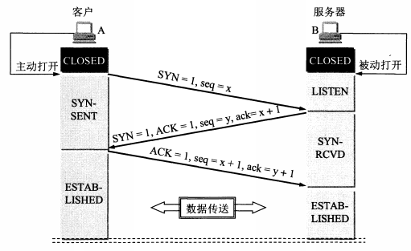 

假定主机 A 运行的是 TCP 客户程序，而 B 运行 TCP 服务器程序。最初两端的 TCP 进程都处于 CLOSED（关闭）状态。图中在主机下面的方框分别是 TCP 进程所处的状况。注意，在本例中。一开始，B 准备接受客户进程的连接请求。然后服务器进程就处于 LISTEN（收听）状态，等待客户的连接请求。如有，即做出响应。

A 在打算建立 TCP 连接时，向 B 发出连接请求报文段，这时首部中的同步位 **`SYN=1`**（**`SYN=1`** 时，表明这是一个连接请求或者连接确认报文），同时选择一个初识序号 **`seq=x`**。TCP 规定，SYN 报文段（即 **`SYN=1`** 的报文段）不能携带数据，但是要消耗掉一个序号。这时，TCP 客户进程进入 **`SYN-SENT`**（同步已发送）状态。B 收到连接请求报文段后，如同意建立连接，即向 A 发送确认。在确认报文段中应把 SYN 位和 ACK 位都置 1，确认号是 **`ack=x+1`**，同时也为自己选择一个初始序号 **`seq=y`**。请注意，这个报文段也不能携带数据，但是同样要消耗掉一个序号。这是 TCP 服务器进程进入 SYN-RCVD（同步收到）状态。

TCP 客户进程 A 收到 B 的确认后，还要向 B 给出确认。确定报文段的 ACK 置 1，确认号 ack=y+1，而自己的序号 **`seq=x+1`**。TCP 的标准规定，ACK 报文段可以携带数据，但是如果不携带数据则不消耗序号，在这种情况下，下一个数据报文段序号仍然是 **`seq=x+1`**。这时，TCP 连接已经建立，A 进入 ESTABLISHED（已建立连接）状态。当 B 收到 A 的确认后，也进入 ESTABLISHED 状态。

另外，上面给出的连接建立过程叫做三报文握手，但是上图中 B 发送给 A 的报文段也可以拆分成两个报文段。可以先发送一个确认报文段，再发送一个同步报文段。这样的过程就变成了四报文握手，但是效果是一样的。

为什么 A 最后还要发送一次确认呢？这主要是为了防止已失效的连接请求报文段突然又传送到了 B，因而产生错误。现假定出现一种异常情况，即 A 发送的第一个连接请求报文段没有丢失，而是在某些网络节点长时间滞留了，以延误到连接释放后的某个时间才到达 B。本来这是一个早已失效的报文段。但 B 收到此失效的连接请求报文段后，就误认为是 A 又发出一次新的连接请求。于是就向 A 发出确认报文段，同意建立连接。假设不采取报文握手，那么只要 B 发出确认，新的连接就建立了。

由于现在 A 没有发出建立连接的请求，因为不会理睬 B 的确认，也不会向 B 发送数据。但 B 却认为新的运输连接已经建立了，并一直等待 A 发来数据。B 的许多资源就这样白白浪费了。采用三报文握手的方法，可以防止上述现象的发生。例如在刚才的异常情况下，A 不会向 B 的确认发出确认。B 由于收不到确认，就知道 A 并没有要求建立连接。

**发送第一个 SYN 的一端将执行主动打开（active open）。接收这个 SYN 并发回下一个 SYN 的另一端执行被动打开（passive open）**（不过我们后面将介绍有些 TCP 实现可以支持同时打开）。当一端为建立连接而发送它的 SYN 时，它为连接选择一个初始序号。ISN 随时间而变化，因此每个连接都将具有不同的 ISN。**`RFC 793 [Postel 1981c]`** 指出 ISN 可看作是一个 32 比特的计数器，每 4ms 加 1。这样选择序号的目的在于防止在网络中被延迟的分组在以后又被传送，而导致某个连接的一方对它作错误的解释。

### 2.连接超时

前面我们讨论的是很快建立连接的情况。如果客户端访问一个距离它很远的服务器，或者由于网络繁忙，导致服务器对于客户端发送出的同步报文段没有应答，此时客户端程序将产生什么样的行为呢？显然，对于提供可靠服务的 TCP 来说，它必然是先进行重连（可能执行多次），如果重连仍然无效，则通知应用程序连接超时。

接下来从 Kongming20（**`192.168.1.109`**）上执行 telnet 命令登录到 ernest-laptop（**`192.168.1.108`**），并用 tcpdump 抓取这个过程中双方交换的 TCP 报文段。具体操作如下：

 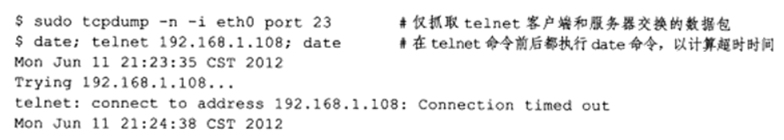 

本次 tcpdump 的输出如代码清单所示：

 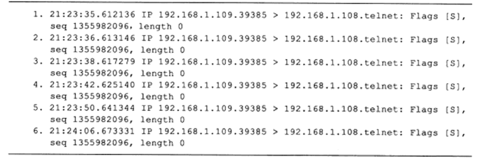 

我们一共抓取到 6 个 TCP 报文段，它们都是同步报文段，并且具有相同的序号值，这说明后面 5 个同步报文段都是超时重连报文段。观察这些 TCP 报文段被发送的时间间隔，它们分别为 1s、2s、4s、8s 和 16s（由于定时器精度的问题，这些时间间隔都有一定偏差），可以推断最后一个 TCP 报文段的超时时间是 32s。因此，TCP 模块一共执行了 5 次重连操作，这是由 **`/proc/sys/net/ipv4/tcp_syn_retries`** 内核变量所定义的。每次重连的超时时间都增加一倍。在 5 次重连均失败的情况下，TCP 模块放弃连接并通知应用程序。

## 二、TCP 连接的释放

### 1.TCP 连接释放解析

建立一个连接需要三次握手，而终止一个连接要经过 4 次握手。这由 TCP 的半关闭（half-close）造成的。**既然一个 TCP 连接是全双工（即数据在两个方向上能同时传递），因此每个方向必须单独地进行关闭**。这原则就是当一方完成它的数据发送任务后就能发送一个 FIN 来终止这个方向连接。当一端收到一个 FIN，它必须通知应用层另一端已经终止了那个方向的数据传送。发送 FIN 通常是应用层进行关闭的结果。首先进行关闭的一方（即发送第一个 FIN）将执行主动关闭，而另一方（收到这个 FIN）执行被动关闭。通常一方完成主动关闭而另一方完成被动关闭。

数据传输结束后，通信的双方都可释放连接。现在 A 和 B 都处于 ESTABLISHED 状态。A 先向其 TCP 发出连接释放报文段，并停止再发送数据，主动关闭 TCP 连接。A 把连接释放报文段首部的终止控制位 FIN 置 1。这时 A 进入 **`FIN-WAIT-1`**（终止等待 1）状态，等待 B 的确认。请注意，TCP 规定，FIN 报文段即使不携带数据，它也消耗掉一个序号。

 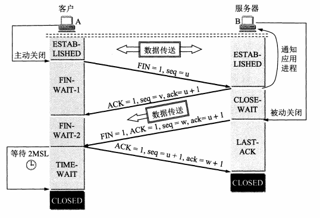 

B 收到连接释放报文段后即发出确认报文。然后 B 进入 **`CLOSE-WAIT`**（关闭等待）状态。TCP 服务器进程这时应通知高层应用进程，因而从 A 到 B 这个方向的连接就释放了，这时的 TCP 连接处于半关闭（half-close）状态，也就是说，从 B 到 A 这个方向的连接并未关闭，B 可能还要向 A 发送一些数据才能关闭，这个状态可能会持续一段时间。

A 收到来自 B 的确认后，就进入 **`FIN-WAIT-2`**（终止等待 2）状态，等待 B 发出的连接释放报文段。若 B 已经没有要向 A 发送的数据，其应用进程就通知 TCP 释放连接。这时 B 发出的连接释放报文段必须使 **`FIN=1`**。这时 B 就进入 **`LAST-ACK`**（最后确认）状态，等待 A 的确认。

A 在收到 B 的连接释放报文段后，必须对此发出确认。在确认报文段中把 ACK 置 1。然后进入到 **`TIME-WAIT`**（时间等待）状态。请注意，现在 TCP 连接还没有释放掉。必须经过时间等待计时器（TIME-WAIT timer）设置的时间 2MSL 后，A 才进入到 CLOSED 状态。时间 MSL 叫做最长报文段寿命（Maximum Segment Lifetime），一般为 2 分钟。因此，从 A 进入 **`TIME-WAIT`** 状态后，要经过 4 分钟才能进入到 CLOSED 状态，才能开始建立下一个新的连接。

为什么 A 在 **`TIME-WAIT`** 状态必须等待 2MSL 的时间呢？

这是为了保证 A 发送的最后一个 ACK 报文段能够到达 B。这个 ACK 报文段有可能丢失。如果 B 没有收到 A 发送的确认报文，B 会超时重传 **`FIN+ACK`** 报文段，而 A 就能在 2MSL 时间内收到这个重传的 FIN-ACK 报文段。接着 A 重传一次确认，重新启动 2MSL 计时器。最后，A 和 B 都正常进入到 CLOSED 状态。如果 A 在 **`TIME-WAIT`** 状态下不等待一段时间，而是在发送完 ACK 报文段后立即释放连接，那么就无法收到 B 重传的 **`FIN+ACK`** 报文段，因此也不会再发送一次确认报文段。这样，B 就无法按照正常步骤进入 CLOSED 状态。2MSL 中的一个 MSL 是等待自己的确认 ACK 报文发送到服务器端，而另外一个 MSL 是保证服务器端的 FIN 报文（重传的）能够发送到客户端。

除时间等待计时器外，TCP 还设有一个保活计时器（keepalive timer）。设想有这样的情况：客户已主动与服务器建立了 TCP 连接。但后来客户端的主机突然出故障。显然，服务器以后就不能再收到客户发来的数据。因此，应当有措施使服务器不要再白白等待下去。这就是使用保活计时器。服务器每收到一次客户的数据，就重新设置保活计时器，时间的设置通常是两小时。若两小时没有收到客户的数据，服务器就发送一个探测报文段，以后则每隔 75 秒钟发送一次。若一连发送 10 个探测报文段后仍无客户的响应，服务器就认为客户端出了故障，接着就关闭这个连接。

最后总结如下，连接通常是由客户端发起的，这样第一个 SYN 从客户传到服务器。每一端都能主动关闭这个连接（即首先发送 FIN）。然而，一般由客户端决定何时终止连接，因为客户进程通常由用户交互控制，用户会键入诸如 "quit" 一样的命令来终止进程。

### 2.半关闭状态

 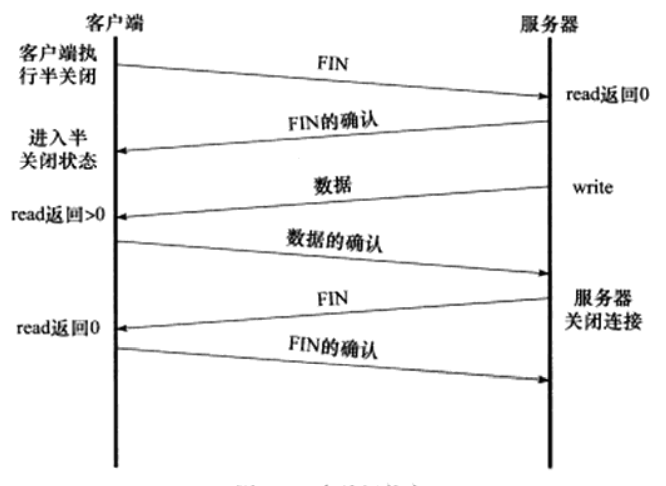 

TCP 连接是全双工的，所以它允许两个方向的数据传输被独立关闭。换言之，通信的一端可以发送结束报文段给对方，告诉它本端已经完成了数据的发送，但允许继续接收来自对方的数据，直到对方也发送结束报文段以关闭连接。TCP 连接的这种状态称为半关闭（halfclose）状态。TCP 提供了连接的一端在结束它的发送后还能接收来自另一端数据的能力。这就是所谓的半关闭。为了使用这个特性，编程接口必须为应用程序提供一种方式来说明 "我已经完成了数据传送，因此发送一个文件结束（FIN）给另外一端，但是我还想接收另外一端发过来的数据，直到它给我发来文件结束（FIN）"。

请注意，在上图中，服务器和客户端应用程序判断对方是否已经关闭连接的方法是：read 系统调用返回 0（收到结束报文段）。当然，Linux 还提供其他检测连接是否被对方关闭的方法。Socket 网络编程接口通过 shutdown 函数提供了对半关闭的支持，我们将在后续章节讨论它。

## 三、TCP 状态转移过程

 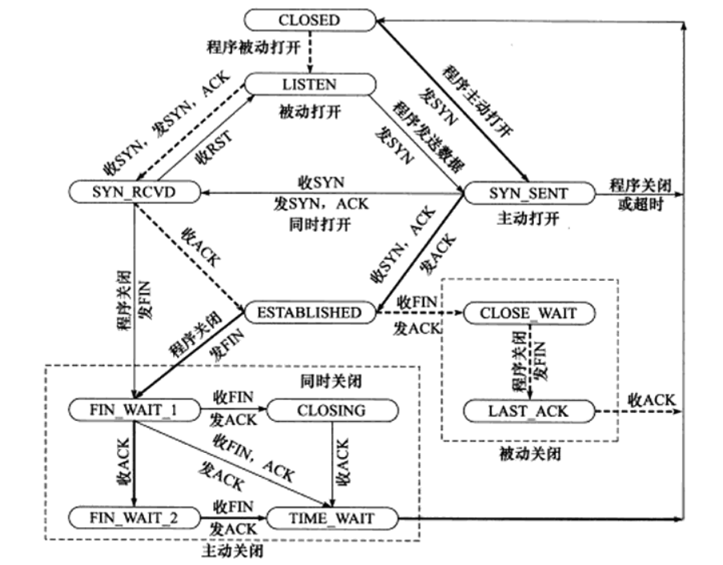 

上图描述了 TCP 连接从建立到关闭的整个过程中通信两端所有可能的状态转换。其中粗虚线表示典型的服务器端连接的状态转移，粗实线表示典型的客户端连接的状态转移。CLOSED 是一个假想的起始点，而并不是一个实际的状态。

### 1.服务器状态转移过程

服务器通过 listen 系统调用进入 LISTEN 状态，被动等待客户端连接，因此执行的是所谓的被动打开。服务器一旦监听到某个连接请求（收到同步报文段），就将该连接放人内核等待队列中，并向客户端发送带 SYN 标志的确认报文段。此时该连接处于 **`SYN_RCVD`** 状态。如果服务器成功地接收到客户端发送回的确认报文段，则该连接转移到 ESTABLISHED 状态。即两个导致进入 ESTABLISHED 状态的变迁对应打开一个连接，而两个导致从 ESTABLISHED 状态离开的变迁对应关闭一个连接。ESTABLISHED 状态是连接双方能够进行双向数据传输的状态。

当客户端主动关闭连接时（通过 close 或 shutdown 系统调用向服务器发送结束报文段），服务器通过返回确认报文段使连接进入 **`CLOSE_WAIT`** 状态。这个状态的含义很明确：等待服务器应用程序关闭连接。通常，服务器检测到客户端关闭连接后，也会立即给客户端发送一个结束报文段来关闭连接。这将使连接转移到 **`LAST_ACK`** 状态，以等待客户端对结束报文段的最后一次确认。一旦确认完成，连接就彻底关闭了。

### 2.客户端状态转移过程

客户端通过 connect 系统调用主动与服务器建立连接。connect 系统调用首先给服务器发送一个同步报文段，使连接转移到 **`SYN_SENT`** 状态。此后，connect 系统调用可能因为如下两个原因失败返回：

- 如果 connect 连接的目标端口不存在（未被任何进程监听），或者该端口仍被处于 **`TIME_WAIT`** 状态的连接所占用（见后文），则服务器将给客户端发送一个复位报文段，connect 调用失败。
- 如果目标端口存在，但 connect 在超时时间内未收到服务器的确认报文段，则 connect 调用失败。

connect 调用失败将使连接立即返回到初始的 CLOSED 状态。如果客户端成功收到服务器的同步报文段和确认，则 connect 调用成功返回，连接转移至 ESTABLISHED 状态。当客户端执行主动关闭时，它将向服务器发送一个结束报文段，同时连接进人 FIN_WAIT_1 状态。若此时客户端收到服务器专门用于确认目的的确认报文段，则连接转移至 FIN_WAIT_2 状态。当客户端处于 FIN_WAIT_2 状态时，服务器处于 CLOSE_WAIT 状态，这一对状态是可能发生半关闭的状态。此时如果服务器也关闭连接（发送结束报文段），则客户端将给予确认并进人 **`TIME_WAIT`** 状态。关于 **`TIME_WAIT`** 状态的含义，我们将在下一节讨论。

图中还给出了客户端从 FIN_WAIT1 状态直接进入到 **`TIME_WAIT`** 状态的一条线路（不经过 **`FIN_WAIT2`** 状态），前提是处于 **`FIN_WAIT1`** 状态的服务器直接收到带确认信息的结束报文段（而不是先收到确认报文段，再收到结束报文段）。前面说过，处于 **`FIN_WAIT2`** 状态的客户端需要等待服务器发送结束报文段，才能转移至 **`TIME_WAIT`** 状态，否则它将一直停留在这个状态。如果不是为了在半关闭状态下继续接收数据，连接长时间地停留在 **`FIN_WAIT2`** 状态并无益处。

连接停留在 **`FIN_WAIT2`** 状态的情况可能发生在：客户端执行半关闭后，未等服务器关闭连接就强行退出了。此时客户端连接由内核来接管，可称之为孤儿连接（和孤儿进程类似）。Linux 为了防止孤儿连接长时间存留在内核中，定义了两个内核变量：**`/proc/sys/net/ipv4/tcp_max_orphans`** 和 **`/proc/sys/net/ipv4/tcp_fin_timeout`**。前者指定内核能接管的孤儿连接数目，后者指定孤儿连接在内核中生存的时间。至此，我们简单地讨论了服务器和客户端程序的典型 TCP 状态转移路线。

### 3.TIME_WAIT 状态

#### 3.1.理论分析

从上面的状态转换图来看，客户端连接在收到服务器的结束报文段 FIN 之后，并没有直接进人 CLOSED 状态，而是转移到 **`TIME_WAIT`** 状态。在这个状态，客户端连接要等待段长为 2MSL（Maximum Segment Life，报文段最大生存时间）的时间，才能完全关闭。MSL 是 TCP 报文段在网络中的最大生存时间，我们知道这个时间是有限的的，**因为 TCP 报文段以 IP 数据报在网络内传输，而 IP 数据报则有限制其生存时间的 TTL 字段**，标准文档 RFC 1122 的建议值是 2 min。**`TIME_WAIT`** 状态存在的原因有两点：

- 可靠地终止 TCP 连接（让 TCP 再次发送最后的 ACK 以防这个 ACK 丢失，当 ACK 丢失时，另一端会超时并重发最后的 FIN）。
- 保证让迟来的 TCP 报文段有足够的时间被识别并丢弃。

第一个原因很好理解。假设用于确认服务器 FIN 结束报文段的 TCP 报文段 ACK 丢失，那么根据超时重传机制，服务器将重发结束报文段 FIN。因此客户端需要停留在某个状态以处理可能重复收到的结束报文段（即向服务器发送确认报文段）。否则，客户端直接关闭之后，遇到服务器发送 FIN 报文，将以复位报文段 RST 来回应服务器，服务器则认为这是一个错误，因为它期望的是一个 ACK 确认报文段。

第二个原因，在 Linux 系统上，一个 TCP 端口不能被同时打开多次（两次及以上）。当一个 TCP 连接处于 **`TIME_WAIT`** 状态时，定义这个连接的套接字四元组（客户的 IP 地址和端口号，服务器的 ip 地址和端口号）不能再被使用，这个连接只能在 2MSL 结束后才能再次被使用。并且遗憾的是大多数 TCP 实现强加了更为严格的限制，在 2MSL（即 **`TIME_WAIT`** 期间）我们将无法立即使用该连接占用着的端口来建立一个新连接。

反过来思考，如果不存在 **`TIME_WAIT`** 状态，则应用程序能够立即建立一个和刚关闭的连接相似的连接（这里说的相似，是指它们具有相同的 IP 地址和端口号）。这个新的、和原来相似的连接被称为原来的连接的化身（incarnation）。新的化身可能接收到属于原来的连接的、携带应用程序数据的 TCP 报文段（迟到的报文段），这显然是不应该发生的。这就是 **`TIME_WAIT`** 状态存在的第二个原因。

另外，因为 TCP 报文段的最大生存时间是 MSL，所以坚持 2MSL 时间的 **`TIME_WAIT`** 状态能够确保网络上两个传输方向上尚未被接收到的、迟到的 TCP 报文段都已经消失（被中转路由器丢弃）。因此，一个连接的新的化身可以在 2MSL 时间之后安全地建立，而绝对不会接收到属于原来连接的应用程序数据，这就是 **`TIME_WAIT`** 状态要持续 2MSL 时间的原因。

有时候我们希望避免 **`TIME_WAIT`** 状态，因为当程序退出后，我们希望能够立即重启它。但由于处在 **`TIME_WAIT`** 状态的连接还占用着端口，程序将无法启动（直到 2MSL 超时时间结束）。对客户端程序来说，我们通常不用担心前面描述的重启问题。因为客户端一般使用系统自动分配的临时端口号来建立连接，而由于随机性，临时端口号一般和程序上一次使用的端口号（还处于 **`TIME_WAIT`** 状态的那个连接使用的端口号）不同，所以客户端程序一般可以立即重启。上面的例子仅仅是为了说明问题，我们强制客户端使用 12345 端口，这才导致立即重启客户端程序失败。但如果是服务器主动关闭连接后异常终止，则因为它总是使用同一个知名服务端口号，所以连接的 **`TIME_WAIT`** 状态将导致它不能立即重启。不过，我们可以通过 socket 选项 **`SO_REUSEADDR`** 来强制进程立即使用处于 **`TIME_WAIT`** 状态的连接占用的端口。

最后一点需要说明的是，一般执行主动关闭的一方会进入到 **`TIME_WAIT`** 阶段，而执行被动关闭的一方则不会进入到 **`TIME_WAIT`** 状态。

#### 3.2 Sock 程序演示

以上的分析可以通过 sock 程序看到这一切。我们启动服务器程序，从一个客户程序进行连接，然后停止这个服务器程序。

 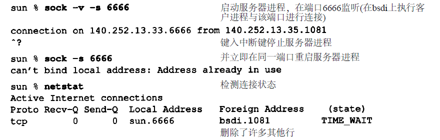 

当重新启动服务器程序时，程序报告一个差错信息说明不能绑定它的熟知端口，因为该端口已被使用（即它处于 2MSL 等待）。运行 netstat 程序来查看连接的状态，以证实它的确处于 2MSL 等待状态。如果我们一直试图重新启动服务器程序，并测量它直到成功所需的时间，我们就能确定出 2MSL 值。对于 SunOS4.1.3、SVR4、BSD/386 和 AIX3.2.2，它需要 1 分钟才能重新启动服务器程序，这意味着它们的 MSL 值为 30 秒。而对于 Solaris2.2，它需要 4 分钟才能重新启动服务器程序，这表示它的 MSL 值为 2 分钟。当然，如果一个客户程序试图申请一个处于 2MSL 等待的端口（客户程序通常不会这么做），就会出现同样的差错。

 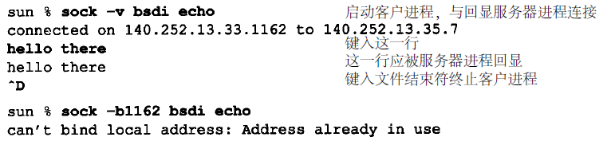 

我们在第 1 次执行客户程序时采用 -v 选项来查看它使用的本地端口为（1162）。第 2 次执行客户程序时则采用 -b 选项来选择端口 1162 为它的本地端口。正如我们所预料的那样，客户程序无法那么做，因为那个端口是一个还处于 2MSL 等待连接的一部分。需要再次强调 2MSL 等待的一个效果，和以前介绍的一样，一个插口对（即包含本地 IP 地址、本地端口、远端 IP 地址和远端端口的 4 元组）在它处于 2MSL 等待时，将不能再被使用。尽管许多具体的实现中允许一个进程重新使用仍处于 2MSL 等待的端口（通常是设置选项 **`SO_REUSEADDR`**），但 TCP 不能允许一个新的连接建立在相同的插口对上。可通过下面的试验来看到这一点：

 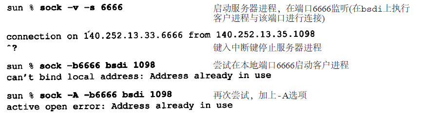 

在第 1 次运行 sock 程序中，我们将它作为服务器程序，端口号为 6666，并从主机 bsdi 上的一个客户程序与它连接，这个客户程序使用的端口为 1098。我们终止服务器程序，因此它将执行主动关闭。这将导致 4 元组 **`140.252.13.33`**（本地 IP 地址）、6666（本地端口号）、**`140.252.13.35`**（另一端 IP 地址）和 1098（另一端的端口号）在服务器主机进入 2MSL 等待。

在第 2 次运行 sock 程序时，我们将它作为客户程序，并试图将它的本地端口号指明为 6666，同时与主机 bsdi 在端口 1098 上进行连接。但这个程序在试图将它的本地端口号赋值为 6666 时产生了一个差错，因为这个端口是处于 2MSL 等待 4 元组的一部分。为了避免这个差错，我们再次运行这个程序，并使用选项 A 来设置前面提到的 **`SO_REUSEADDR`**。这将让 sock 程序能将它的本地端口号设置为 6666，但当我们试图进行主动打开时，又出现了一个差错。即使它能将它的本地端口设置为 6666，但它仍不能和主机 bsdi 在端口 1098 上进行连接，因为定义这个连接的插口对仍处于 2MSL 等待状态。

#### 3.3 平静时间的概念

对于来自某个连接的较早替身的迟到报文段，2MSL 等待可防止将它解释成使用相同插口对的新连接的一部分。但这只有在处于 2MSL 等待连接中的主机处于正常工作状态时才有效。如果使用处于 2MSL 等待端口的主机出现故障，它会在 MSL 秒内重新启动，并立即使用故障前仍处于 2MSL 的插口对来建立一个新的连接吗？如果是这样，在故障前从这个连接发出而迟到的报文段会被错误地当作属于重启后新连接的报文段。无论如何选择重启后新连接的初始序号，都会发生这种情况。

为了防止这种情况，RFC793 指出 TCP 在重新启动后的 MSL 秒内不能建立任何连接（启动大概需要 MSL 时间，再等待 MSL 时间，加起来就是 2MSL 时间，保证迟到的报文段在网络中被丢弃）。这就称为平静时间（quiet time），**不过只有极少的实现版遵守这一原则，因为大多数主机重启动的时间都比 MSL 秒要长**。

#### 3.4 FIN_WAIT_2 状态

在 **`FIN_WAIT_2`** 状态我们已经发出了 FIN，并且另一端也已对它进行确认。除非我们在实行半关闭，否则将等待一端的应用层意识到它已收到一个文件结束符说明，并向我们发一个 FIN 来关闭另一方向的连接。只有当另一端的进程完成这个关闭，我们这端才会从 **`FIN_WAIT_2`** 状态进入 TIME_WAIT 状态。

这意味着我们这端可能永远保持这个状态。另一端也将处于 CLOSE_WAIT 状态，并一直保持这个状态直到应用层决定进行关闭。许多伯克利实现采用如下方式来防止这种在 **`FIN_WAIT_2`** 状态的无限等待。如果执行主动关闭的应用层将进行全关闭，而不是半关闭来说明它还想接收数据，就设置一个定时器。如果这个连接空闲 10 分钟 75 秒，TCP 将进入 CLOSED 状态。在实现代码的注释中确认这个实现代码违背协议的规范。

### 4.同时打开

两个应用程序同时彼此执行主动打开的情况是可能的，尽管发生的可能性极小。每一方必须发送一个 SYN，且这些 SYN 必须传递给对方。这需要每一方使用一个对方熟知的端口作为本地端口。这又称为同时打开（simultaneous open）。例如，主机 A 中的一个应用程序使用本地端口 7777，并与主机 B 的端口 8888 执行主动打开。主机 B 中的应用程序则使用本地端口 8888，并与主机 A 的端口 7777 执行主动打开。

这与下面的情况不同：主机 A 中的 Telnet 客户程序和主机 B 中 Telnet 的服务器程序建立连接，与此同时，主机 B 中的 Telnet 客户程序与主机 A 的 Telnet 服务器程序也建立连接。在这个 Telnet 例子中，两个 Telnet 服务器都执行被动打开，而不是主动打开，并且 Telnet 客户选择的本地端口不是另一端 Telnet 服务器进程所熟悉的端口。

TCP 是特意设计为了可以处理同时打开，对于同时打开它仅建立一条连接而不是两条连接（其他的协议族，最突出的是 OSI 运输层，在这种情况下将建立两条连接而不是一条连接）。当出现同时打开的情况时，两端几乎在同时发送 SYN，进入 SYN-SENT 状态。当每一端收到 SYN 时，状态变为 SYN-RCVD，同时它们都再发 SYN 并对收到的 SYN 进行确认。当双方都收到 SYN 及相应的 ACK 时，状态都变迁为 ESTABLISHED。下图显示了这些状态变迁过程。

 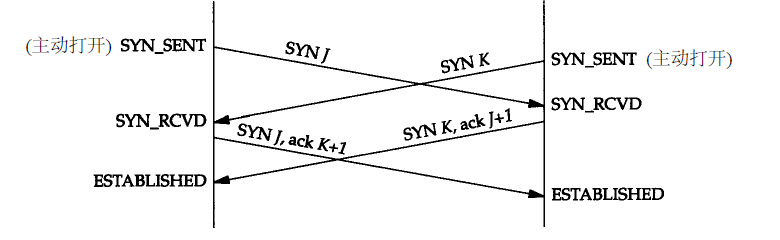 

一个同时打开的连接需要交换 4 个报文段，比正常的三次握手多一个。此外，要注意的是我们没有将任何一端称为客户或服务器，因为每一端既是客户又是服务器。

尽管很难，但仍有可能产生一个同时打开的连接。两端必须几乎在同时启动，以便收到彼此的 SYN。只要两端有较长的往返时间就能保证这一点。这样我们将一端设置在主机 bsdi 上，另一端则设置在主机 vangogh.cs.berkeley.edu 上。由于两端之间有一条拨号链路 SLIP，它的往返时间对保证双方同步收到 SYN 是足够长的（几百毫秒）。一端（bsdi）将本地端口设置为 8888（使用命令行选项 -b），并对另一端主机端口 7777 执行主动打开。

 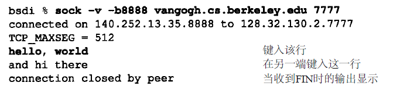 

另外一端几乎在同一时间将本地端口设置为 7777，并且对端口 8888 执行主动打开。

 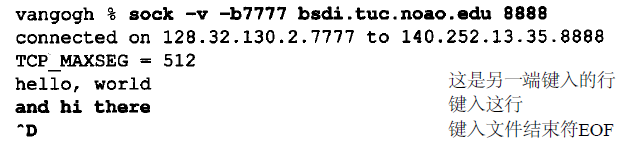 

为证实两端确实在相互交谈，我们在每一端还输入一行字符，看它们是否会被送到另一端并显示出来。下图显示了这个连接的段交换过程。注意两个 SYN（第 1~2 行）后跟着两个带 ACK 的 SYN（第 3~4 行）。它们将执行同时打开。第 5 行显示了由 bsdi 发送给 vangogh 的输入行 "hello, world"，第 6 行对此进行确认。第 7~8 行对应另一方向的输入行 "and hi there" 和确认。第 9~12 行显示正常的连接关闭。

 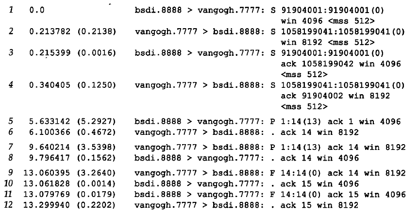 

### 5.同时关闭

我们在以前讨论过一方（通常但不总是客户方）发送第一个 FIN 执行主动关闭。双方都执行主动关闭也是可能的，TCP 协议也允许这样的同时关闭（simultaneous close）。在下图当中，当应用层发出关闭命令时，两端均从 ESTABLISHED 变为 **`FIN_WAIT_1`**。这将导致双方各发送一个 FIN，两个 FIN 经过网络传送后分别到达另一端。收到 FIN 后，状态由 **`FIN_WAIT_1`** 变迁到 CLOSING，并发送最后的 ACK。当收到最后的 ACK 时，状态变化为 **`TIME_WAIT`**。下图总结了这些状态的变化：

 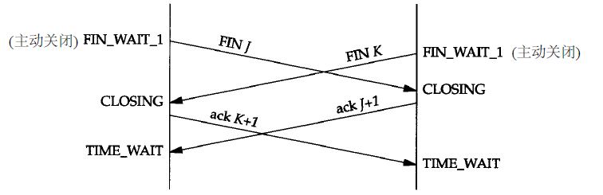 

同时关闭与正常关闭使用的段交换数目相同。
