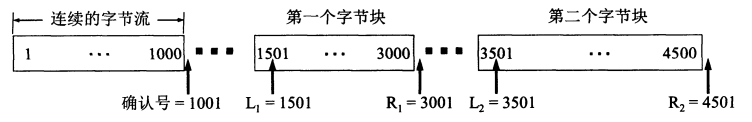
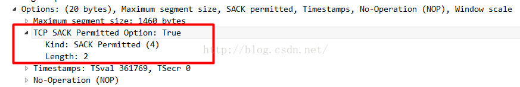

# TCP 协议之选择重传

## 一、SACK 选择重传

### 1.概述

接下来讨论一下 TCP 报文首部中的 SACK 重传选项。这就是若收到的报文段无差错，只是未按序号，中间还缺少一些序号的数据，那么能否设法只传送缺少的数据而不重传已经正确到达接收方的数据？**<font color="red">答案是可以的。选择确认就是一种可行的处理方法。</font>**

我们用一个例子来说明选择确认 （Selective ACK） 的工作原理。TCP 的接收方在接收对方发送过来的数据字节流的序号不连续，结果就形成了一些不连续的字节块（如下图所示）。可以看出，序号 1-1000 收到了，但序号 1001 - 1500 没有收到。接下来的字节流又收到了，可是又缺少了 3001-3500。再后面从序号 4501 起又没有收到。也就是说，接收方收到了和前面的字节流（1-1000）不连续的两个字节块（1501-3000 和 3501-4500）。如果这些字节的序号都在接收窗口之内，那么接收方就先收下这些数据，但要把这些信息准确地告诉发送方，使发送方不要再重复发送这些已收到的数据。

<div align="center">  </div>

从图中可以看出，和前后字节不连续的每一个字节块都有两个边界：左边界和右边界。因此在图中用四个指针标记这些边界。请注意，第一个字节块的左边界 **`L1=1501`**，但右边界 **`R1=3001`** 而不是 3000。这就是说，左边界指出字节块的第一个字节的序号，但右边界减 1 才是字节块中的最后一个序号。同理，第二个字节块的左边界 **`L2=3501`**，而右边界 **`R2=4501`**。

我们知道，TCP 的首部没有哪个字段能够提供上述这些字节块的边界信息。RFC 2018 规定，如果要使用选择确认 SACK，那么在建立 TCP 连接时，就要在 TCP 首部的选项中加上 "允许 SACK" 的选项，而双方必须都事先商定好。如果使用选择确认，那么原来首部中的 "确认号字段" 的用法仍然不变。只是以后在 TCP 报文段的首部中都增加了 SACK 选项，以便报告收到的不连续的字节块的边界。由于首部选项的长度最多只有 40 字节，而指明一个边界就要用掉 4 字节（因为序号有 32 位，需要使用 4 个字节表示），因此在选项中最多只能指明 4 个字节块的边界信息。这是因为 4 个字节块共有 8 个边界，因而需要用 32 个字节来描述。另外还需要两个字节。一个字节用来指明是 SACK 选项，另一个字节是指明这个选项要占用多少字节。如果要报告五个字节块的边界信息，那么至少需要 42 个字节。

**<font color="red">这就超过了选项长度的 40 字节的上限。</font>** 互联网建议标准 RFC 2018 还对报告这些边界信息的格式都做出了非常明确的规定，这里从略。然而，SACK 文档并没有指明发送方应当怎样响应 SACK。因此大多数的实现还是重传所有未被确认的数据块。

### 2.引入选择重传的理由

在 TCP/IP 的超时重传机制介绍中，有介绍到快速重传和超时重传都会面临到一个重传什么包的问题，因为发送端也不清楚丢失包后面传送的数据是否有成功的送到。主要原因还是对于 TCP 的确认系统，不是特别的好处理这种不连续确认的状况了，只有低于 ACK number 的片段都被收到才有进行 ACK，**`out-of-order`** 的片段只能是等待，同时，这个时间窗口是无法向右移动的。

因此，之前 TCP 通信时，如果发送序列中间某个数据包丢失，TCP 会通过重传最后确认的包开始的后续包，这样原先已经正确传输的包也可能重复发送，急剧降低了 TCP 性能。**<font color="red">为改善这种情况，发展出 SACK（Selective Acknowledgment，选择性确认）技术，使 TCP 只重新发送丢失的包，不用发送后续所有的包，而且提供相应机制使接收方能告诉发送方哪些数据丢失，哪些数据重发了，哪些数据已经提前收到等。</font>**

举个例子：

1. 服务发送 4 个片段给客户端，**`seg1(seq=1,len=80)`**，**`seg2(seq=81,len=120)`**，**`seg3(seq=201,len=160)`**，**`seg4(seq=361,len=140)`**
2. 服务器收到 seg1 和 seg2 的 ACK = 201，所以此时 seg1 seg2 变成发送并已经确认范畴的数据包，被移除滑动窗口，此时服务器又可以多发 80+120 byte 数据
3. 假设 seg3 由于某些原因丢失，这个时候服务器仍然可以像客户端发送数据，但是服务器会等待 seg3 的 ACK，否则窗口无法滑动，卡住了
4. seg3 丢失了，即使后面的 seg4 收到了，客户端也无法告知服务器已经收到了 seg4，试想一下，如果窗口也够大，服务器可以继续持续发送更多的片段，那么这些片段被客户端接收，只能存放到队列中，无法进行确认
5. 正式因为后续 **`out-of-order`** 的报文段的发送状况也不清楚，所以 server 也不是特别清楚要如何去处理这种状况，不过一般来说只能有 2 种状况：
   1. 只重传超时的数据包，这种方法是最常想到的，**<font color="red">比较适用于后面的数据包都能够正常接收的状况，只重传超时的数据包</font>**。但是如果比较坏的情况下，比如丢失了很多封包的时候，那就需要一个一个的等待超时了，很浪费时间。
   2. 重传这个片段以及之后的所有包，这种方法在最坏的状况下（比如丢失了很多封包的时候），看起来效率还是挺高的。但是如果只有一个包丢失，就去重传后面所有接受到的包，流量浪费也是很严重的。

总之对于上面阐述的问题，a 和 b 两种方案都有各自的局限性。但是 RFC2018 提供了一个 SACK 的方法，有效的解决这个问题。

### 3.SACK 的报文格式

SACK 信息是通过 TCP 头的选项部分提供的，信息分两种，一种标识是否支持 SACK，是在 TCP 握手时发送；另一种是具体的 SACK 信息。

**<font color="red">SACK 是一个 TCP 的选项，来允许 TCP 单独确认接收端收到并缓存的非连续片段，用于告知发送端真正丢失的包，只重传丢失的片段。</font>** 要使用 SACK，2 个设备必须同时支持 SACK 才可以，建立连接的时候需要使用 **`SACK Permitted`** 的 option，如果允许，后续的传输过程中 TCP segment 中的可以携带 SACK option，这个 option 内容包含一系列接收端收到的非连续数据块的 seq range。

<div align="center">  </div>

下面介绍一下 SACK 允许选项的格式：

```java {.line-numbers}
+---------+---------------+
| Kind=4  | Length=2|
+---------+---------------+
```

Option 格式中 kind 类型值：4，注意该选项只允许在有 SYN 标志的 TCP 包中，也即 TCP 握手的前两个包中，分别表示各自是否支持 SACK。接下来介绍一下 SACK 选项的格式，选项类型为 5，选项长度：可变，但整个 TCP 选项长度不超过 40 字节，实际最多不超过 4 组边界值。

```java {.line-numbers}
                        +--------+-------+
                        | Kind=5 | Length|
+--------+--------+----------+-----------+
|      Left Edge of 1st Block            |
+--------+--------+----------+-----------+
|      Right Edge of 1st Block           |
+--------+--------+----------+-----------+
|                                        |
/            . . .                       /
|                                        |
+--------+--------+----------+-----------+
|      Left Edge of nth Block            |
+--------+--------+----------+-----------+
|      Right Edge of nth Block           |
+--------+--------+----------+-----------+
```

该选项参数告诉对方已经接收到并缓存的不连续的数据块，注意都是已经接收的，发送方可根据此信息检查究竟是哪个块丢失，从而发送相应的数据块。

- **`Left Edge of Block`**：不连续块的第一个数据的序列号
- **`Right Edge of Block`**：不连续块的最后一个数据的序列号之后的序列号。

表示 **`(Left Edge - 1)`** 和 **`(Right Edge)`** 处序列号的数据没能接收到。

#### 3.1.对中间有丢包或延迟时的 SACK

如果 TCP 接收方接收到非期待序列号的数据块时，如果该块的序列号小于期待的序列号，说明是网络复制或重发的包，可以丢弃；如果收到的数据块序列号大于期待的序列号，说明中间包被丢弃或延迟，此时可以发送 SACK 通知发送方出现了网络丢包。为反映接收方的接收缓存和网络传输情况，SACK 中的第一个块必须描述是那个数据块激发此 SACK 选项的，接收方应该尽可能地在 SACK 选项部分中填写尽可能多的块信息，即使空间有限不能全部写完，SACK 选项中要报告最近接收的不连续数据块，让发送方能了解当前网络传输情况的最新信息。

#### 3.2.对重发包的 SACK （D-SACK）

RFC2883 中对 SACK 进行了扩展，在 SACK 中描述的是收到的数据段，这些数据段可以是正常的，也可能是重复发送的，SACK 字段具有描述重复发送的数据段的能力，在第一块 SACK 数据中描述重复接收的不连续数据块的序列号参数，其他 SACK 数据则描述其他正常接收到的不连续数据，因此第一块 SACK 描述的序列号甚至可能小于当前的 ACK 值。通过这种方法，发送方可以更仔细判断出当前网络的传输情况，可以发现数据段被网络复制、错误重传、ACK丢失引起的重传、重传超时等异常的网络状况。

#### 3.3.发送方对 SACK 的响应

TCP 发送方都应该维护一个未确认的重发送数据队列，数据未被确认前是不能释放的，这个从重发送队列中的每个数据块都有一个标志位 "SACKed" 标识是否该块被 SACK 过，对于已经被 SACK 过的块，在重新发送数据时将被跳过。发送方接收到接收方 SACK 信息后，根据 SACK 中数据标志重发送队列中相应的数据块的 "SACKed" 标志。

### 4.RFC 关于 SACK 和 D-SACK 的资料

This section specifies the use of SACK blocks when the SACK option is used in reporting a duplicate segment.  When D-SACK is used, the first block of the SACK option should be a D-SACK block specifying the sequence numbers for the duplicate segment that triggers the acknowledgement.  If the duplicate segment is part of a larger block of non-contiguous data in the receiver's data queue, then the following SACK block should be used to specify this larger block. Additional SACK blocks can be used to specify additional non-contiguous blocks of data, as specified in RFC 2018.

The guidelines for reporting duplicate segments are summarized below:

- SACK does not change the meaning of ACK field.
- SACK cannot be sent unless SACK permitted option has been received.
- If SACKs are sent, they should be included in all TCP-PDUs when out-of-order data has been buffered.
- First SACK must ack most recently received out-of-order PDU.
- Receiver returns as many distinct SACKs as possible.
- SACK option is filled out by repeating most recently reported SACK blocks. There may be some data in receiver’s queue which should be SACKed but is not.
- If D-SACK block reports duplicate PDU from （possibly larger） block of data in the receiver buffer above the cumulative acknowledgement, the second SACK block （the first non D-SACK block） should specify this block.
- As only, the first SACK block is considered as D-SACK block, if multiple sequences are duplicated, only the first is contained in the D-SACK block.
- No difference between SACK & D-SACK, except that first SACK block is used to report a duplicate PDU in D-SACK.
- No separate negotiation/options for D-SACK.
- D-SACK is compatible with current implementations of SACK option in TCP.

#### 4.1. Example 1: Reporting a duplicate segment.

Because several ACK packets are lost, the data sender retransmits packet 3000-3499, and the data receiver subsequently receives a duplicate segment with sequence numbers 3000-3499.  The receiver sends an acknowledgement with the cumulative acknowledgement field set to 4000, and the first, D-SACK block specifying sequence numbers 3000-3500.

```java {.line-numbers}
Transmitted    Received      ACK Sent
Segment        Segment        (Including SACK Blocks)

3000-3499      3000-3499   3500 (ACK dropped)
3500-3999      3500-3999   4000 (ACK dropped)
3000-3499      3000-3499   4000, SACK=3000-3500
                                                                      ----------------D-SACK
```

#### 4.2. Example 2: Reporting an out-of-order segment and a duplicate segment.

Following a lost data packet, the receiver receives an out-of-order data segment, which triggers the SACK option as specified in  RFC 2018.  Because of several lost ACK packets, the sender then retransmits a data packet.  The receiver receives the duplicate
packet, and reports it in the first, D-SACK block:

```java {.line-numbers}
Transmitted    Received       ACK Sent
Segment        Segment         (Including SACK Blocks)

3000-3499      3000-3499   3500 (ACK dropped)
3500-3999      3500-3999   4000 (ACK dropped)
4000-4499      (data packet dropped)
4500-4999      4500-4999   4000, SACK=4500-5000 (ACK dropped)
3000-3499      3000-3499   4000, SACK=3000-3500, 4500-5000
                                                                      ---------------D-SACK
```

#### 4.3. Example 3: Reporting a duplicate of an out-of-order segment.

Because of a lost data packet, the receiver receives two out-of-order segments.  The receiver next receives a duplicate segment for one of  these out-of-order segments:

```java {.line-numbers}
Transmitted    Received        ACK Sent
Segment          Segment        (Including SACK Blocks)

3500-3999      3500-3999     4000
4000-4499      (data packet dropped)
4500-4999      4500-4999     4000, SACK=4500-5000
5000-5499      5000-5499     4000, SACK=4500-5500
                         (duplicated packet)
                         5000-5499     4000, SACK=5000-5500, 4500-5500
                                                                        ---------------D-SACK
```

#### 4.4. Example 4: Reporting a single duplicate subsegment.

The sender increases the packet size from 500 bytes to 1000 bytes. The receiver subsequently receives a 1000-byte packet containing one 500-byte subsegment that has already been received and one which has not.  The receiver reports only the already received subsegment using a single D-SACK block.

```java {.line-numbers}
Transmitted    Received    ACK Sent
Segment        Segment     (Including SACK Blocks)

500-999           500-999     1000
1000-1499      (delayed)
1500-1999      (data packet dropped)
2000-2499      2000-2499   1000, SACK=2000-2500
1000-2000      1000-1499   1500, SACK=2000-2500
                          1000-2000   2500, SACK=1000-1500
                                                                       -------------- D-SACK
```

#### 4.5. Example 5: Two non-contiguous duplicate subsegments covered by the cumulative acknowledgement.

After the sender increases its packet size from 500 bytes to 1500 bytes, the receiver receives a packet containing two non-contiguous duplicate 500-byte subsegments which are less than the cumulative acknowledgement field.  The receiver reports the first such duplicate segment in a single D-SACK block. As only, the first SACK block is considered as D-SACK block, if multiple sequences are duplicated, only the first is contained in the D-SACK block.

```java {.line-numbers}
Transmitted    Received    ACK Sent
Segment          Segment     (Including SACK Blocks)

500-999           500-999     1000
1000-1499      (delayed)
1500-1999      (data packet dropped)
2000-2499      (delayed)
2500-2999      (data packet dropped)
3000-3499      3000-3499   1000, SACK=3000-3500
1000-2499      1000-1499   1500, SACK=3000-3500
                 2000-2499   1500, SACK=2000-2500, 3000-3500
                     1000-2499   2500, SACK=1000-1500, 3000-3500
                                                                      --------------D-SACK
```
