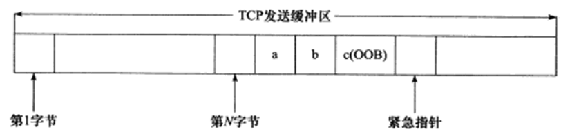
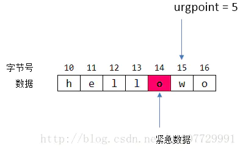

# TCP 协议之带外数据

## 一、紧急数据

### 1.带外（Out-of-Band）数据简介

有些传输层协议具有带外 (Out Of Band, OOB) 数据的概念，用于迅速通告对方本端发生的重要事件。因此，带外数据比普通数据(也称为带内数据)有更高的优先级，它应该总是立即被发送，而不论发送缓冲区中是否有排队等待发送的普通数据。带外数据的传输可以使用一条独立的传输层连接，也可以映射到传输普通数据的连接中。实际应用中，带外数据的使用很少见，已知的仅有 **`telnet、rlogin、ftp`** 等远程非活跃程序。

**前两个程序会将中止字符作为紧急数据发送到远程端**。**这会允许远程端冲洗所有未处理的输入，并且丢弃所有未发送的终端输出**。这会快速中断一个向我们屏幕发送大量数据的运行进程。**`ftp`** **命令使用带外数据来中断一个文件的传输**。

**`UDP`** 没有实现带外数据传输，**`TCP`** 也没有真正的带外数据。不过 **`TCP`** 利用其头部中的紧急指针标志和紧急指针两个字段，给应用程序提供了一种紧急方式。**`TCP`** 的紧急方式利用传输普通数据的连接来传输紧急数据。这种紧急数据的含义和带外数据类似，因此后文也将 **`TCP`** 紧急数据称为带外数据。

### 2.带外数据的发送

我们先来介绍 TCP 发送带外数据的过程。假设一个进程已经往某个 TCP 连接的发送缓冲区中写人了 N 字节的普通数据，并等待其发送。在数据被发送前，该进程又向这个连接写人了 3 字节的带外数据 "abc”。此时，待发送的 TCP 报文段的头部将被设置 URG 标志，并且紧急指针被设置为指向最后一个带外数据的下一字节(**紧急指针和紧急偏移值是两个概念**)。

下面看两个例子，第一个例子如图所示：

<div align="center">
    
</div>

由上图可见，发送端一次发送的多字节的带外数据中只有最后一字节被当作带外数据（字母 c），而其他数据（字母 a 和 b） 被当成了普通数据。如果 **`TCP`** 模块以多个 **`TCP`** 报文段来发送上图所示 **`TCP`** 发送缓冲区中的内容，**则每个 **`TCP`** 报文段都将设置 **`URG`** 标志**，并且它们的紧急指针指向同一个位置（数据流中带外数据的下一个位置），但只有一个 **`TCP`** 报文段其正携带带外数据。

第二个例子如下所示：

<div align="center">
    
</div>

上图中的 16 位紧急指针是配合 **`URG`** 标志位一起使用的，言外之意就是这个字段只有在 **`URG`** 被置位时才有意义。因为只有一个紧急指针，这也意味着它只能标识一个字节的数据（上图中标识的是字符 o）。这个指针指向了紧急数据最后一个字节的下一个字节。我们知道 **`TCP`** 在传输数据时是有顺序的，它有字节号，**`URG`** 配合紧急指针，就可以找到紧急数据的字节号。紧急数据的字节号公式如下：

```shell
紧急指针(urgpoint) = TCP 报文序号(seq) + 紧急偏移(urgoffset)
紧急数据字节号(urgSeq) = TCP 报文序号(seq) + 紧急偏移(urgoffset) − 1
```

比如图中的例子，如果 seq = 10, urgpoint = 5，那么字节序号 urgSeq = 10 + 5 - 1 = 14。知道了字节号后，就可以计算紧急数据字位于所有传输数据中的第几个字节了，如果从第 0 个字节开始算起，那么紧急数据就是第 **`urgSeq - ISN - 1`** 个字节（还记得 **`ISN`** 吗，它表示初始序列号），减 1 表示不包括第一个 **`SYN`** 段，因为一个 **`SYN`** 段会消耗一个字节号。

给定的上图所示的 TCP 套接字发送缓冲区状态，**发送端 TCP 将为待发送的下一个分节在 TCP 首部中设置 URG 标志**，并把紧急偏移字段设置为指向带外字节之后的字节，不过该分节可能含也可能不含我们标记的 OOB 的那个字节。OOB 字节是否发送取决于**在套接字发送缓冲区中先于它的字节数，TCP 准备发送给对端的分节大小以及对端通告的当前窗口**。

这是 TCP 紧急模式的一个重要特点：**TCP 首部指出发送端已经进入紧急模式（即伴随紧急偏移的 URG 标志已经设置），但是由紧急指针所指的实际带外数据（OOB）却不一定随同送出**。事实上即使发送端 TCP 因流量控制而暂停发送数据（接收端的套接字接收缓冲区已满，导致其 TCP 向发送端 TCP 通告了一个值为 0 的窗口），紧急通知照样不伴随任何数据的发送。这也是应用进程使用 TCP 紧急模式（即带外数据）的一个原因：**即便数据的流动会因为 TCP 的流量控制而停止，紧急通知却总是无障碍的发送到对端 TCP**。

接下来实际介绍两个例子：

#### 2.1.接口：send(sockfd,＂X＂,1,MSG_OOB);

设当前的 sockfd 的发送缓冲区为：Send_Buff: 1 2 3 4 5 6 7 8，调用 send(sockfd,＂X＂, 1,MSG_OOB); 发出紧急数据 X，那么发送缓冲区为：Send_Buff: 1 2 3 4 5 6 7 8 X

- 情况 1： 发送窗口大于等于 9，那么紧急数据刚好在这次被发出，tcp 包头部 URG 被置位，紧急指针值为 10（seq）。
- 情况 2：
  - 发送窗口小于 9，那么由流式机制可知，先要将 X 前面的字节发出。假设窗口为 6，第一个 tcp 包发出，**`URG`** 被置位，紧急指针值为 10（seq）。数据部分为：1 2 3 4 5 6。
  - 第二个 tcp 包发出，**`URG`** 被置位，紧急指针值为 10（seq）。数据部分为：7 8 X。

对端收到第一个 tcp 包时，检测 **`URG`** 可知进入了紧急状态，**但是由当前报文段的序号 seq （报文段中第一个字节序号）和接受的数据量即之和小于紧急指针的值**，那么说明紧急数据还未到来。下一个包到来时，判定紧急指针与前一包是相同的值，说明是同一个紧急指针，同理通过判定指针和当前接受的数据量来确定紧急数据是否到来。假设当前的紧急指针和前一个包的紧急指针不是一个值，那么说明有新的紧急数据到来了。

#### 2.2.奇葩的 send(sockfd, "90X", 1, MSG_OOB)

发送缓冲区为：1 2 3 4 5 6 7 8 9 0 X。由于紧急指针只能标识一个字节的数据，所以只有 X 为紧急数据，90 将被视为正常数据。

最后需要注意**紧急偏移**与**紧急指针**的区别，**在 TCP 首部中的紧急指针实际上是紧急偏移，它和序号字段的值相加才表示紧急指针**，即最后一个紧急数据的下一字节的序号。

### 3.带外数据的接收

此我们已经讲述了带外数据的发送，下面从接收端的角度查看一下：

1. 当收到一个设置了 **`URG`** 标志的分节时，接收端 **`TCP`** 检查紧急指针，确实它是否指向新的带外数据。发送端 **`TCP`** 往往发送多个含有 **`URG`** 标志且紧急指针指向同一个数据字节的分节（通常是在一小段时间内）。**这些分节中只有第一个到达的会导致通知接收进程有新的带外数据到达**。
2. 当有新的紧急指针到达时，接收进程被通知到。首先，内核给接收套接字的属主进程发送 **`SIGURG`** 信号，前提是接收进程（或其他进程）曾调用 **`fcntl`** 或 **`ioctl`** **为这个套接字建立了属主，而且该属主进程已为这个信号建立了信号处理函数**。或者，**如果接收进程阻塞在 **`select`** 调用中以等待这个套接字描述符出现一个异常条件**，**`select`** 调用就返回。

一旦有新的紧急指针到达，不论由紧急指针指向的实际数据字节是否已经到达接收端 TCP，这两个潜在通知接收进程的手段就发生动作。只有一个 OOB 标记，如果新的 OOB 字节在旧的 OOB 字节被读取之前就到达，旧的 OOB 字节会被丢弃。

当由紧急指针指向的实际数据字节到达接收端 TCP，该数据字节既可能被保存在以下两个地方：

- 保存在单独的带外缓冲区
- 保存在带内，即和普通数据一起保存在接收缓冲区中。

#### 3.1 套接字选项 SO_OOBINLINE 未被设置（默认）

SO_OOBINLINE 套接字选项默认情况下是禁止的，对于这样的接收端套接字，该数据字节并不放入套接字接收缓冲区，而是被放入该连接的一个独立的单字节带外缓冲区。接收进程从这个单字节缓冲区读入数据的方法是**指定 MSG_OOB 标志调用 recv，recvfrom 或 recvmsg 或者在服务器端程序里面捕捉 SIGURG 信号来及时接受数据**。如果新的 OOB 字节在旧的 OOB 字节被读取之前就到达，旧的 OOB 字节会被丢弃。

这一字节的带外数据被放置在套接字带外数据缓冲区中，这个缓冲区大小为一个字节。进程读取方法：

```c{.line-numbers}
recv(sockfd, &ch, 1, MSG_OOB);
```

#### 3.2 套接字选项 SO_OOBINLINE 被设置

如果接收进程开启了 SO_OOBINLINE 套接字选项，**那么由 `TCP` 紧急指针指向的实际数据字节将被留在通常的套接字接收缓冲区中**。这种情况下，接收进程不能指定 **`MSG_OOB`** 标志读入该数据字节。相反，接收进程通过检查该连接的带外标记以提前判断下一字节是否为带外数据：

```c{.line-numbers}
ioctl(fd, SIOCATMARK, &flag); if (flag) read(sockfd, &ch, 1);
```

SO_OOBINLINE 模式原理：当带外数据到达接受缓冲区后，套接字有特殊字段记录该紧急数据在接受缓冲区中与缓冲区头部的偏移量。当应用程序读取前面的正常数据时，该偏移量将作出修正。当偏移量为 0 时，表示即前被读取的字节是带外数据，此时套接字状态字段的 SIOCATMARK 置 1。

#### 3.3 带外数据接收可能引起的错误

- 如果接收进程请求读入带外数据（通过指定 **`MSG_OOB`** 标志），但是对端尚未发送任何带外数据，读入操作将返回 **`EINVAL`**。
- 在接收进程已被告知对端发送了一个带外字节（通过 **`SIGURG`** 或 **`select`** 手段）的前提下，如果接收进程读入该字节，但是该字节尚未到达，读入操作将返回 **`EWOULDBLOCK`**。接收进程此时能做的仅仅是从套接字接收缓冲区读入数据（要是没有存放这些数据的空间，可能还得丢弃他们），以便在该缓冲区中腾出空间，继而允许对端 TCP 发送出那个带外字节。
- 如果接收进程试图多次读入同一个带外字节，读入操作将返回 **`EINAVL`**。
- 如果接收进程已经开启 **`SO_OOBINLINE`** 套接字选项，后来试图通过指定的 **`MSG_OOB`** 标志读入带外数据，读入操作将返回 **`EINVAL`**。

从上面的 TCP 紧急模式的机制可以看到，似乎没有加快将数据交给应用程序处理的步骤，TCP 做的只是尽快将紧急数据发送出去（即使对方的接收窗口大小为 0，紧急数据也可以被发送出去），尽快将紧急数据从内核缓冲区放到接收缓冲区中，也许在设计应用程序时，就要考虑到 TCP 协议栈进入到紧急状态时，本应用程序该做一些特别处理吧（例如加快数据处理速度，或者终止当前数据处理等）。

### 4.带外数据实验

#### 4.1 例 1

```c{.line-numbers}
int main(int argc, char **argv)
{
    int  sockfd;

    if (argc != 3)
        err_quit("usage: tcpsend01 <host> <port#>");

    sockfd = Tcp_connect(argv[1], argv[2]);

    Write(sockfd, "123", 3);
    printf("wrote 3 bytes of normal data\n");
    // 间以停顿的目的是让每个 write 或 send 的数据作为单个 TCP 分节在本端发送并在对端接受
    sleep(1);

    Send(sockfd, "4", 1, MSG_OOB);
    printf("wrote 1 byte of OOB data\n");
    sleep(1);

    Write(sockfd, "56", 2);
    printf("wrote 2 bytes of normal data\n");
    sleep(1);

    Send(sockfd, "7", 1, MSG_OOB);
    printf("wrote 1 byte of OOB data\n");
    sleep(1);

    Write(sockfd, "89", 2);
    printf("wrote 2 bytes of normal data\n");
    sleep(1);

    exit(0);
}
```

该程序共发送 9 个字节，每个输出操作之间有一个 1s 的 sleep。停顿的目的是让每个 write 或 send 的数据作为单个 TCP 分节在本端发送并在对端接收。程序运行结果：

```shell
/home/xuweilin/CLionProjects/linux_programming/cmake-build-debug/my_client
wrote 3 bytes of normal data
wrote 1 byte of OOB data
wrote 2 bytes of normal data
wrote 1 byte of OOB data
wrote 2 bytes of normal data

Process finished with exit code 0
```

接收端的代码如下所示：

```c{.line-numbers}
#include "unp.h"
int listenfd, connfd;
void sig_urg(int);
int main(int argc, char * * argv) {
    int n;
    char buff[100];
    if(argc == 2) {
        listenfd = Tcp_listen(NULL, argv[1], NULL);
    } else if(argc = 3) {
        listenfd = Tcp_listen(argv[1], argv[2], NULL);
    } else {
        err_quit("usage: tcprecv01 [ <host> ] <port#>");
    }

    connfd = Accept(listen, NULL, NULL);
    /* 建立 SIGURG 的信号处理程序 */
    Signal(SIGURG, sig_urg); 
    /* 并用 fcntl 设置已连接套接口的属主，使用SIGURG 前，必须设置 socket 的宿主进程或进程组 */
    Fcntl(connfd, F_SETOWN, getpid());
    /* 进程从套接口中读，输出每个由 read 返回的字符串，当发送者终止连接后，接收者也就终止了 */ 
    for( ; ; ) {
        if( (n = Read(connfd, buff, sizeof(buff)-1) ) == 0 ) {
          printf("recived EOF\n");
          exit(0);
        }
        /* null terminate */
        buff[n] = 0; 
        printf("read %d bytes: %s\n", n, buff);
    }
}

void sig_urg(int signo) {
    int n;
    char buff[100];
    printf("SIGURG received\n");
    n = Recv(connfd, buff, sizeof(buff)-1, MSG_OOB);
    /* null terminate */
    buff[n] = 0; 
    printf("read %d OOB byte: %s\n", n, buff);
}
```

运行结果如下：

```shell
/home/xuweilin/CLionProjects/linux_programming/cmake-build-debug/server
read 3 bytes: 123
SIGURG received
read 1 OOB byte: 4
read 2 bytes: 56
SIGURG received
read 1 OOB byte: 7
read 2 bytes: 89
recived EOF

Process finished with exit code 0
```

直到 accept 返回之后才建立信号处理函数，这么做会错过一些以小概率出现的带外数据，**带外数据在 TCP 完成三次握手之后但在 accept 返回之前到达**。然而如果我们在调用 **`accept`** 之前注册信号处理函数并设置监听套接字的属主（本属性将传承给已连接套接字），那么如果带外数据在 **`accept`** 之前到达，我们的信号处理函数将没有真正的 **`connfd`** 值可用。

如果这种情形对于应用程序确实重要，它就应该把 **`connfd`** 初始化为 -1，在信号处理函数中检查该值是否为 -1，若为真则简单的设置一个标志，供主循环在 **`accept`** 返回之后检查。

#### 4.2 例 2

如果我们将带外数据发送端的部分代码修改如下，即只发送 "1234567" 7 个字节，"5" 为带外数据，并且取消 sleep 函数睡眠时间。

```c{.line-numbers}
    send(cfd, "123", 3, 0);
    printf("wrote 3 bytes of normal data\n");

    send(cfd, "45", 2, MSG_OOB);
    printf("wrote 1 byte of OOB data\n");

    write(cfd, "67", 2);
    printf("wrote 2 bytes of normal data\n");
```

接收端的运行结果如下所示：

```shell
/home/xuweilin/CLionProjects/linux_programming/cmake-build-debug/server
read 3 bytes: 123
SIGURG received
read 1 OOB byte: 5
read 1 bytes: 4
read 2 bytes: 67
recived EOF

Process finished with exit code 0
```

由此可见，客户端发送给接收端的 2 字节的带外数据 "45" 中，只有最后一个字符 "5" 被服务器当成真正的带外数据接收。并且，服务器对正常数据的接收将被带外数据截断，即前一部分正常数据 "1234" 和后续的正常数据 "67" 是不能被一个 recv 函数调用全部读取出来的。

使用 **`sudo tcpdump -i 3 -nt`** （3 表示 loopback 接口）命令对上述程序进行抓包，得到的结果如下所示：

```shell
tcpdump: verbose output suppressed, use -v[v]... for full protocol decode
listening on lo, link-type EN10MB (Ethernet), snapshot length 262144 bytes
<--------------------------------- 三次握手 ---------------------------------->
IP 127.0.0.1.44140 > 127.0.0.1.9523: Flags [S], seq 3232653469, win 65495, options [mss 65495,sackOK,TS val 3204469183 ecr 0,nop,wscale 7], length 0
IP 127.0.0.1.9523 > 127.0.0.1.44140: Flags [S.], seq 2478257409, ack 3232653470, win 65483, options [mss 65495,sackOK,TS val 3204469183 ecr 3204469183,nop,wscale 7], length 0
IP 127.0.0.1.44140 > 127.0.0.1.9523: Flags [.], ack 1, win 512, options [nop,nop,TS val 3204469183 ecr 3204469183], length 0

<------------------------------发送 123 三个字符------------------------------->
IP 127.0.0.1.44140 > 127.0.0.1.9523: Flags [P.], seq 1:4, ack 1, win 512, options [nop,nop,TS val 3204470184 ecr 3204469183], length 3
IP 127.0.0.1.9523 > 127.0.0.1.44140: Flags [.], ack 4, win 512, options [nop,nop,TS val 3204470184 ecr 3204470184], length 0

<------------------------------发送 45 两个字符------------------------------->
IP 127.0.0.1.44140 > 127.0.0.1.9523: Flags [P.U], seq 4:6, ack 1, win 512, urg 2, options [nop,nop,TS val 3204470184 ecr 3204470184], length 2
IP 127.0.0.1.9523 > 127.0.0.1.44140: Flags [.], ack 6, win 512, options [nop,nop,TS val 3204470184 ecr 3204470184], length 0

<------------------------------发送 67 两个字符------------------------------->
IP 127.0.0.1.44140 > 127.0.0.1.9523: Flags [P.], seq 6:8, ack 1, win 512, options [nop,nop,TS val 3204470184 ecr 3204470184], length 2
IP 127.0.0.1.9523 > 127.0.0.1.44140: Flags [.], ack 8, win 512, options [nop,nop,TS val 3204470184 ecr 3204470184], length 0

<--------------------------------- 四次挥手 ---------------------------------->
IP 127.0.0.1.44140 > 127.0.0.1.9523: Flags [F.], seq 8, ack 1, win 512, options [nop,nop,TS val 3204470184 ecr 3204470184], length 0
IP 127.0.0.1.9523 > 127.0.0.1.44140: Flags [F.], seq 1, ack 9, win 512, options [nop,nop,TS val 3204470185 ecr 3204470184], length 0
IP 127.0.0.1.44140 > 127.0.0.1.9523: Flags [.], ack 2, win 512, options [nop,nop,TS val 3204470185 ecr 3204470185], length 0
```

据前所述，有如下公式：

```shell
紧急指针(urgpoint) = TCP 报文序号(seq) + 紧急偏移(urgoffset)
紧急数据字节号(urgSeq) = TCP 报文序号(seq) + 紧急偏移(urgoffset) − 1
```

在 seq 4:6，这里我们第一次看到 tcpdump 输出标志 U，这表示该 TCP 报文段的头部被设置了紧急标志。"urg 2"是 TCP 首部中的紧急偏移值，它指出带外数据在字节流中的位置的下一字节位置（其实就是紧急指针的值）是 6 (2 + 4，其中 4 是该 TCP 报文段的序号值相对初始序号值的偏移)。因此，带外数据是字节流中的第 5 字节，即字符 "5"。

当然，接收端程序的运行结果也可能如下：

```shell
/home/xuweilin/CLionProjects/linux_programming/cmake-build-debug/server
SIGURG received
read 1 OOB byte: 5
read 4 bytes: 1234
read 2 bytes: 67
recived EOF

Process finished with exit code 0
```

#### 4.3 例 3

这里我们介绍一下如何使用 select 来接收带外数据。如果有一个套接字存在带外数据或者仍然处于带外标记，那么它有异常条件待处理。发送端代码如下所示，一共发送 "123456789a" 这 10 个字符，其中字符 "5" 和 "8" 都是带外数据。

```c{.line-numbers}
    connect(cfd, (struct sockaddr*) &serv_addr, sizeof(serv_addr));

    if (errno == ECONNREFUSED) {
        printf("connection is refused.\n");
    }

    sleep(1);
    send(cfd, "123", 3, 0);
    printf("wrote 3 bytes of normal data\n");
    // 间以停顿的目的是让每个 write 或 send 的数据作为单个 TCP 分节在本端发送并在对端接受
    sleep(1);

    send(cfd, "45", 2, MSG_OOB);
    printf("wrote 1 byte of OOB data\n");
    sleep(1);

    write(cfd, "67", 2);
    printf("wrote 2 bytes of normal data\n");
    sleep(1);

    send(cfd, "8", 1, MSG_OOB);
    printf("wrote 1 byte of OOB data\n");
    sleep(1);

    write(cfd, "9a", 2);
    printf("wrote 2 bytes of normal data\n");
    sleep(1);
```

接收端的代码如下所示：

```c{.line-numbers}
    connfd = accept(lfd, (struct sockaddr *) &clit_addr, &clit_addr_len);
    printf("client ip:%s, port:%d\n",
           inet_ntop(AF_INET, &clit_addr.sin_addr.s_addr, client_ip, sizeof(clit_addr)),
           ntohs(clit_addr.sin_port));

    if (connfd == -1) {
        sys_err("accept error");
    }

    int n;
    char buff[100];

    FD_ZERO(&rset);
    FD_ZERO(&xset);
    for ( ; ; ) {
        FD_SET(connfd, &rset);
        FD_SET(connfd, &xset);
        select(connfd + 1, &rset, NULL, &xset, NULL);

        // 如果收到了异常数据，就可能是带外（OOB）数据
        if (FD_ISSET(connfd, &xset)) {
            n = recv(connfd, buff, sizeof(buff)-1, MSG_OOB);
            buff[n] = 0;        /* null terminate */
            printf("read %d OOB byte: %s\n", n, buff);
        }

        // 如果是正常数据，直接读取
        if (FD_ISSET(connfd, &rset)) {
            if ( (n = read(connfd, buff, sizeof(buff)-1)) == 0) {
                printf("received EOF\n");
                exit(0);
            }
            buff[n] = 0;    /* null terminate */
            printf("read %d bytes: %s\n", n, buff);
        }
    }

    close(lfd);
    close(connfd);

    return 0;
```

接收端的运行结果如下所示：

```shell
/home/xuweilin/CLionProjects/linux_programming/cmake-build-debug/server
client ip:127.0.0.1, port:54834
read 3 bytes: 123
read 1 OOB byte: 5
read 1 bytes: 4
read 2 bytes: 67
read 1 OOB byte: 8
read 2 bytes: 9a
received EOF

Process finished with exit code 0
```

如果不开启 **`SO_OOBINLINE`** 选项，则使用一个独立的单字节缓冲区存储带外数据，如果新的 **`OOB`** 字节在旧的 **`OOB`** 字节被读取之前就到达，旧的 **`OOB`** 字节会被丢弃。因此如果把发送端的 **`sleep()`** 函数去掉，发送端中间没有停止阻塞的时间，后面发送的带外数据 "8" 把前面的带外数据 "5" 给覆盖掉。具体接收端的运行结果如下所示，"1234567" 都被当成是普通数据，而 "8" 覆盖掉了 "5" 被当成是带外数据。

```shell
/home/xuweilin/CLionProjects/linux_programming/cmake-build-debug/server
client ip:127.0.0.1, port:42284
read 1 OOB byte: 8
read 7 bytes: 1234567
read 2 bytes: 9a
received EOF

Process finished with exit code 0
```

#### 4.4 例 4

之前讨论的带外数据的接收过程（不设置 **`SO_OOBINLINE`** 选项）是 **`TCP`** 模块接收带外数据的默认方式。**如果我们给 `TCP` 连接设置了 `SO_OOBINLINE` 选项，则带外数据将和普通数据一样被 `TCP` 模块存放在 `TCP` 接收缓冲区中**。此时应用程序需要像读取普通数据一样来读取带外数据。那么这种情况下如何区分带外数据和普通数据呢?显然，紧急指针可以用来指出带外数据的位置，**`socket`** 编程接口也提供了系统调用来识别带外数据。

每当收到一个带外数据时，就有一个与之关联的带外标记。这是发送进程发送带外字节时该字节在发送端普通数据流中的位置。在从套接字读入期间，接收进程通过调用 **`sockatmark`** 函数确定是否处于带外标记。

```c{.line-numbers}
#include <sys/socket.h>
int sockatmark(int sockfd);
```

判断被读到的下一个数据是否有带外数据，如果是则返回 1，不是则返回 0。如下给出了常见的基于 ioctl 函数完成的一个实现：

```c{.line-numbers}
int sockatmark(int fd) {
    int flag;
    if (ioctl(fd, SIOCATMARK, &flag) < 0)
        return(-1);
    return(flag != 0);
}
```

我们现在给出一个简单的例子说明带外标记的以下两个特性：

- 带外标记总是指向普通数据最后一个字节紧后的位置。这意味着，如果带外数据在线接收，那么如果下一个待读入的字节是使用 **`MSG_OOB`** 标志发送的，**`sockatmask`** 就返回真。
- 读操作总是停在带外标记上。也就是说，如果在套接字接收缓冲区有 100 个字节，不过在带外标记之前只有 5 个字节，而进程执行一个请求 100 个字节的 **`read`** 调用，那么返回的是带外标记之前的 5 个字节。**这种在带外标记上强制停止读操作的做法使得进程能够调用 `sockatmark` 确实缓冲区指针是否处于带外标记**。

如下是我们的发送程序。它发送 3 个字节普通数据，1 个字节带外数据，再跟 2 个字节普通数据。每个输出操作之间没有停顿。

```c{.line-numbers}
    connect(cfd, (struct sockaddr*) &serv_addr, sizeof(serv_addr));

    if (errno == ECONNREFUSED) {
        printf("connection is refused.\n");
    }

    send(cfd, "123", 3, 0);
    printf("wrote 3 bytes of normal data\n");

    send(cfd, "5", 1, MSG_OOB);
    printf("wrote 1 byte of OOB data\n");

    write(cfd, "67", 2);
    printf("wrote 2 bytes of normal data\n");

    return 0;
```

 接收端的代码如下所示，接收端首先设置了 **`SO_OOBINLINE`** 选项，所以带外数据和普通数据一起放在接收缓冲区中，然后接收端等待了 5s 再开始读取数据，这时接收端 TCP 模块已经收到了所有数据。然后使用 sockatmark 函数检测是否有带外数据到来，如果是，则打印 "at OOB mark"，最后所有数据都使用 recv(,,,0) 读取（等价于 read 函数）。

 ```c{.line-numbers}
    bind(lfd, (struct sockaddr *) &serv_addr, sizeof(serv_addr));
    listen(lfd, 256);
    clit_addr_len = sizeof(clit_addr);

    setsockopt(lfd, SOL_SOCKET, SO_OOBINLINE, &on, sizeof(on));

    connfd = accept(lfd, (struct sockaddr *) &clit_addr, &clit_addr_len);
    printf("client ip:%s, port:%d\n",
           inet_ntop(AF_INET, &clit_addr.sin_addr.s_addr, client_ip, sizeof(clit_addr)),
           ntohs(clit_addr.sin_port));

    if (connfd == -1) {
        sys_err("accept error");
    }

    int n;
    char buff[100];
    sleep(5);

    for ( ; ; ) {
        if (sockatmark(connfd))
            printf("at OOB mark\n");

        if ( (n = recv(connfd, buff, sizeof(buff)-1, 0)) == 0) {
            printf("received EOF\n");
            exit(0);
        }
        buff[n] = 0;    /* null terminate */
        printf("read %d bytes: %s\n", n, buff);
    }

    close(lfd);
    close(connfd);

    return 0;
 ```

接收端的运行结果如下所示：

```shell
/home/xuweilin/CLionProjects/linux_programming/cmake-build-debug/server
client ip:127.0.0.1, port:48634
read 3 bytes: 123
at OOB mark
read 3 bytes: 567
received EOF

Process finished with exit code 0
```

尽管接收进程首次调用 **`recv`** 时接收端 **`TCP`** 已经接收了所有数据（因为接收进程调用了 sleep），但是首次 **`recv`** 调用因遇到带外标记而仅仅返回 3 个字节即在第四个字节（OOB 标记）将会停在这里。

如果在接收端，我们不设置 **`SO_OOBINLINE`** 选项，那么带外数据是单独保存在一个带外数据缓冲区中，接收端和发送端的其余部分不改变，接收端的结果如下所示，同样，首次 recv 调用因遇到带外标记而仅仅返回 3 个字节，但是由于 recv 的 flag 标志位被设置为 0，因此无法读取出带外数据 "5"。

```shell
/home/xuweilin/CLionProjects/linux_programming/cmake-build-debug/server
client ip:127.0.0.1, port:46810
read 3 bytes: 123
at OOB mark
read 2 bytes: 67
received EOF

Process finished with exit code 0
```

如果我们对于接收端还是不设置 **`SO_OOBINLINE`** 选项，并修改代码，当使用 sockatmark 函数检测到带外数据时，使用 MSG_OOB 标记读取。

```c{.line-numbers}
    bind(lfd, (struct sockaddr *) &serv_addr, sizeof(serv_addr));
    listen(lfd, 256);
    clit_addr_len = sizeof(clit_addr);

    connfd = accept(lfd, (struct sockaddr *) &clit_addr, &clit_addr_len);
    printf("client ip:%s, port:%d\n",
           inet_ntop(AF_INET, &clit_addr.sin_addr.s_addr, client_ip, sizeof(clit_addr)),
           ntohs(clit_addr.sin_port));

    if (connfd == -1) {
        sys_err("accept error");
    }

    int n;
    char buff[100], oob;
    sleep(5);

    for ( ; ; ) {
        if (sockatmark(connfd)) {
            printf("at OOB mark\n");
            recv(connfd, &oob, 1, MSG_OOB);
            printf("oob data %c\n", oob);
        }

        if ((n = recv(connfd, buff, sizeof(buff)-1, 0)) == 0) {
            printf("received EOF\n");
            exit(0);
        }

        buff[n] = 0;    /* null terminate */
        printf("read %d bytes: %s\n", n, buff);
    }

    close(lfd);
    close(connfd);
    return 0;
```

此时，接收端的代码如下所示，可以看出，使用 **`MSG_OOB`** 标志的 **`recv`** 函数才可以读取出带外数据。

```shell
/home/xuweilin/CLionProjects/linux_programming/cmake-build-debug/server
client ip:127.0.0.1, port:56006
read 3 bytes: 123
at OOB mark
oob data 5
read 2 bytes: 67
received EOF

Process finished with exit code 0
```

#### 4.5 例 5

我们现在给出另一个简单的例子，用于展示早先提到过的带外数据的另外两个特性。

- 即使因为流量控制而停止发送数据，TCP 仍然发送带外数据的通知（即它的紧急指针）。
- 在带外数据到达之前，接收进程可能被通知说发送进程已经发送了带外数据（使用 SIGURG 信号或通过 select）。如果接收进程紧接着指定 MSG_OOB 调用 recv，而带外数据却尚未到达，recv 将返回 EWOULDBLOCK 错误。

发送端程序如下所示，该进程把它的套接字发送缓冲区大小设置为 32768，写出 16384 字节的普通数据，然后睡眠 5 秒钟。我们稍后将看到接收进程把它的套接字接收缓冲区大小设置为 4096，**因此发送进程的这些操作确保发送端 TCP 填满接收端得套接字接收缓冲区**。发送进程接着发送单字节的带外数据，后跟 1024 字节的普通数据，然后终止。

```c{.line-numbers}
int main() {

    int cfd, size = 32768;
    unsigned int ip = 0;

    // 服务器地址结构
    struct sockaddr_in serv_addr;
    serv_addr.sin_family = AF_INET;
    serv_addr.sin_port = htons(SERV_PORT);
    inet_pton(AF_INET, "127.0.0.1", &ip);
    serv_addr.sin_addr.s_addr = ip;

    cfd = socket(AF_INET, SOCK_STREAM, 0);
    // 设置发送缓冲区大小为 32768 字节
    setsockopt(cfd, SOL_SOCKET, SO_SNDBUF, &size, sizeof(size));
    connect(cfd, (struct sockaddr*) &serv_addr, sizeof(serv_addr));

    char buff[16384] = {0};
    // 第一次发送 16384 个字节
    send(cfd, buff, sizeof(buff), 0);
    printf("wrote 16384 bytes of normal data\n");
    sleep(5);

    // 第二次发送 1 个字节 a
    send(cfd, "a", 1, MSG_OOB);
    printf("wrote 1 byte of OOB data\n");

    // 第三次发送 1024 个字节
    write(cfd, buff, 1024);
    printf("wrote 1024 bytes of normal data\n");

    return 0;
}
```

接收端的程序如下所示：

```c{.line-numbers}
int main() {

    int lfd = 0, on = 1;

    struct sockaddr_in serv_addr, clit_addr;
    socklen_t clit_addr_len;
    char buf[BUFSIZ], client_ip[1024];

    serv_addr.sin_family = AF_INET;
    serv_addr.sin_port = htons(SERV_PORT);
    serv_addr.sin_addr.s_addr = htonl(INADDR_ANY);

    lfd = socket(AF_INET, SOCK_STREAM, 0);
    bind(lfd, (struct sockaddr *) &serv_addr, sizeof(serv_addr));
    listen(lfd, 256);

    clit_addr_len = sizeof(clit_addr);
    int size = 4096;
    // 接受缓冲区的大小设置为 4096
    setsockopt(lfd, SOL_SOCKET, SO_RCVBUF, &size, sizeof(size));

    connfd = accept(lfd, (struct sockaddr *) &clit_addr, &clit_addr_len);
    printf("client ip:%s, port:%d\n",
           inet_ntop(AF_INET, &clit_addr.sin_addr.s_addr, client_ip, sizeof(clit_addr)),
           ntohs(clit_addr.sin_port));

    signal(SIGURG, sig_urg);
    fcntl(connfd, F_SETOWN, getpid());

    int n;
    char buff[100], oob;

    for ( ; ; ) {
    }

    close(lfd);
    close(connfd);
    return 0;
}

void sig_urg(int signo)
{
    int n;
    char buff[100];
    printf("SIGURG received\n");
    n = recv(connfd, buff, sizeof(buff)-1, MSG_OOB);
    // 如果接收带外数据时，发送过来的数据分有带外标志，但是没有带外数据，那么会产生 EWOULDBLOCK 和 EAGAIN
    if (errno == EWOULDBLOCK || errno == EAGAIN) {
        printf("oob data in the way, EWOULDBLOCK/EAGAIN, errno: %d\n", errno);
        return;
    }
    buff[n] = 0; /* null terminate */
    printf("read %d OOB byte: %s\n", n, buff);
}
```

接收进程把监听套接字接收缓冲区大小设置为 4096，连接建立之后，这个大小将传承给已连接套接字。接收进程接着 accept 连接，建立一个 SIGURG 信号处理函数，并建立套接字的属主。主程序然后再一个无穷循环。信号处理函数调用 recv 读入带外数据（使用 MSG_OOB 标志）。接收端的运行结果如下所示：

```shell
/home/xuweilin/CLionProjects/linux_programming/cmake-build-debug/server
client ip:127.0.0.1, port:34238
SIGURG received
oob data in the way, EWOULDBLOCK, errno: 11

```

接收进程的输出结果说明即使滑动窗口大小为 0，发送端 TCP 依然向接收端 TCP 发送了带外通知（因为产生递交给接收进程的 **`SIGURG`** 信号）。然而当接收进程指定 **`MSG_OOB`** 标志调用 recv 时，因为带外数据还没有到达，所以产生了 **`errno = 11`** 的信号，即 **`EAGAIN`**，验证了带外数据的两个特性。

