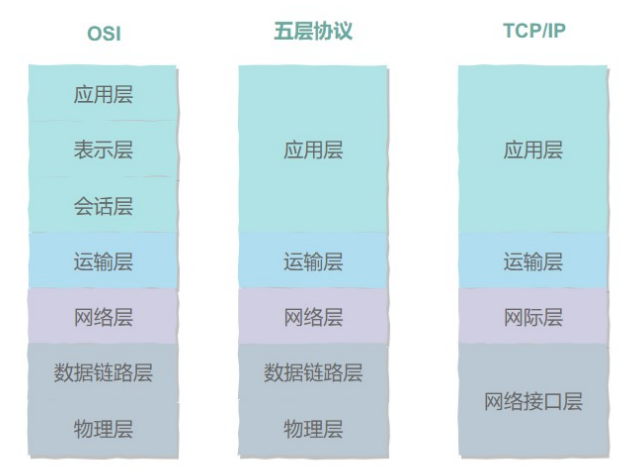
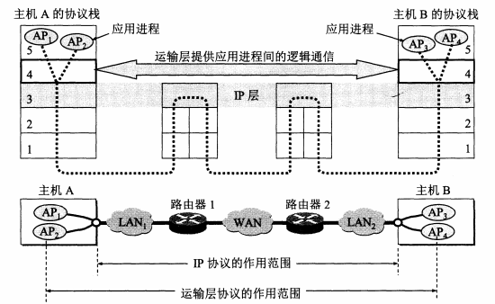
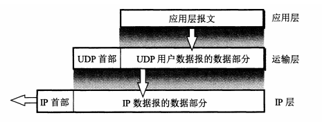
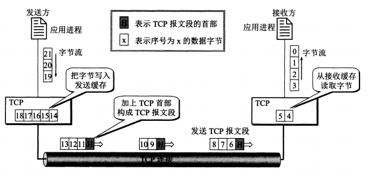
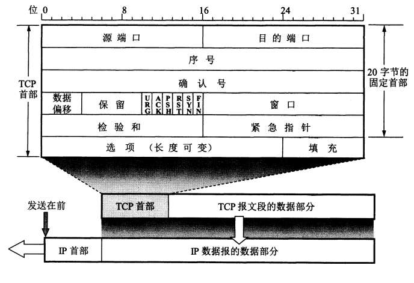
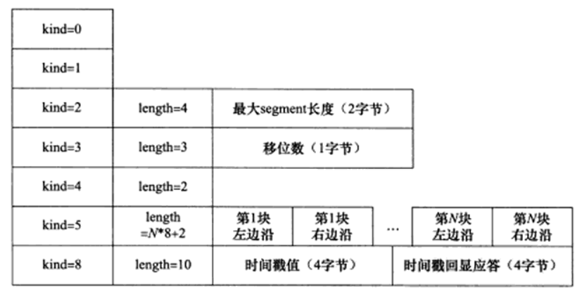
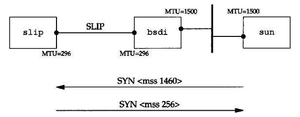
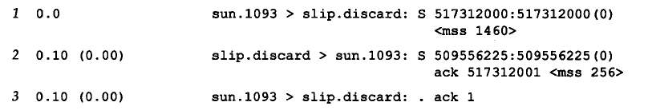

# TCP 协议概述

## 一、网络分层介绍

<div align="center"> </div>

五层协议的内容如下：

- 应用层：**<font color="red">为特定应用程序提供数据传输服务</font>**，例如 HTTP、DNS 等协议。数据单位为报文（报文）。
- 传输层：**<font color="red">为进程提供通用数据传输服务</font>**。由于应用层协议很多，定义通用的传输层协议就可以支持不断增多的应用层协议。运输层包括两种协议：传输控制协议 TCP，提供面向连接、可靠的数据传输服务，数据单位为报文段；用户数据报协议 UDP，提供无连接、尽最大努力的数据传输服务，数据单位为用户数据报。TCP 主要提供可靠性服务，UDP 主要提供及时性服务（报文段/数据报）。
- 网络层：**<font color="red">为主机提供数据传输服务</font>**。而传输层协议是为主机中的进程提供数据传输服务。网络层把传输层传递下来的报文段或者用户数据报封装成分组。
- 数据链路层：主机之间可以有很多链路，**<font color="red">链路层协议就是为同一链路上的主机提供数据传输服务</font>**。数据链路层把网络层传下来的分组封装成帧（帧）。
- 物理层：考虑的是怎样在传输媒体上传输数据比特流，而不是指具体的传输媒体。**<font color="red">物理层的作用是尽可能屏蔽传输媒体和通信手段的差异</font>**，使数据链路层感觉不到这些差异（比特流）。

在向下的过程中，需要添加下层协议所需要的首部或者尾部，而在向上的过程中不断拆开首部和尾部。路由器只有下面三层协议，因为路由器位于网络核心中，不需要为进程或者应用程序提供服务，因此也就不需要传输层和应用层。

## 二、运输层协议概述

### 1.进程之间的通信

从通信和信息处理的角度看，运输层向它上面的应用层提供通信服务，它属于面向通信部分的最高层，同时也是用户功能中的最低层。这里有一个问题，我们知道 IP 协议可以把源主机 A 发送的分组，按照首部中的目的地址，送交到目的主机 B。那就是有了 IP 层之后，为什么还需要运输层？

**<font color="red">对于网络层来说，通信的两端是两台主机，但是真正进行通信的实体是在主机中的进程，是 A 中的一个进程与 B 中的一个进程在进行通信</font>**。因此严格来讲，IP 协议虽然能把分组送到目的主机，但是这个分组还停留在主机的网络层而没有交付到主机中的应用进程。对于运输层来说，通信的真正端点并不是主机而是主机中的进程。在下图中，A 的进程 AP1 和 B 的进程 AP3 正在进行通信，而 A 的进程 AP2 正在和 B 的进程 AP4 进行通信。这表明了运输层有一个很重要的功能：复用和分用。

<div align="center">  </div>

复用指的是发送方中的多个进程可以使用同一个运输层协议来传送数据，而分用指的是该接收方的运输层在剥去报文的首部之后能够把这些数据正确地交付目的应用进程。**<font color="red">从这里可以看出网络层和运输层有明显的区别：网络层为主机之间提供逻辑通信，而运输层为应用进程之间提供端到端的逻辑通信</font>**。另外运输层还要进行差错检验，在网络层，IP 数据报首部中的校验和字段，只检验首部是否出现差错而不检查数据部分。

### 2.运输层的两个协议

TCP/IP 运输层有两个主要协议都是互联网的正式标准：用户数据报协议 UDP（User Datagram Protocol）、传输控制协议 TCP（Transmission Control Protocol）。**<font color="red">UDP 在传输数据之前不需要先建立连接。远地主机的运输层在收到 UDP 报文之后，不需要给出任何确认</font>**，虽然 UDP 不提供可靠交付，但是在某些情况下 UDP 确是一种最有效的工作方式。比如说视频会议这种对于实时性要求比较高的场合。

TCP 则提供面向连接的服务，在传送数据之前必须先建立连接，数据传送结束之后要释放连接。TCP 不提供广播或者多播服务。由于 TCP 要提供可靠的、面向连接的运输服务，因此不可避免地增加了许多的开销，如确认、流量控制、超时重传以及连接管理等。

## 三、用户数据报协议 UDP

用户数据报协议 UDP 只在 IP 协议上增加了很少一点的功能，**<font color="red">这就是复用和分用的功能以及差错检测的功能</font>**。UDP 的主要特点是：

1. **<font color="red">UDP 是无连接的，即发送数据之前不需要建立连接</font>**，因此减少了开销和发送数据之前的时延
2. **<font color="red">UDP 尽最大努力交付，即不保证可靠交付</font>**，因此主机不需要维持复杂的连接状态表。**<font color="red">远地主机在收到 UDP 数据报之后不会给出任何确认</font>**。
3. **<font color="red">UDP 是面向报文的</font>**，发送方的 UDP 对应用程序交下来的报文，在添加首部后就向下交付 IP 层。**<font color="red">UDP 对应用层交下来的报文，既不合并，也不拆分</font>**，而是保留这些报文的边界。这就是说，应用层交给 UDP 多长的报文，UDP 就照样发送，即一次发送一个报文，如下图所示。在接收方的 UDP，对 IP 层交上来的 UDP 用户数据报，去除首部后就原封不动地选择上层的应用进程。也就是说，UDP 一次交付一个完整的报文。

<div align="center">  </div>

4. UDP 没有拥塞控制（保证及时性），因此网络出现的拥塞不会使源主机的发送速率降低。这对某些实时应用是很重要的。很多的实时应用（如 IP 电话、实时视频会议等）要求源主机以恒定的速率发送数据，并且允许在网络发生拥塞时丢失一些数据，但却不允许数据有太大的时延。UDP 正好适合这种要求。
5. UDP 的首部开销小，只有 8 个字节，比 TCP 的 20 字节的首部要短

用户数据报 UDP 有两个字段：数据字段和首部字段。首部字段很简单，只有 8 个字节，由四个字段组成，每个字段的长度都是两个字节。各字段的意义如下：

- 源端口：源端口号，在需要对方回信的时候选用。不需要时可用全 0
- 目的端口：目的端口号，这在终点交付报文时必须使用
- 长度：UDP 用户数据报的长度，其最小值是 8（仅有首部）
- 检验和：检测 UDP 用户数据报在传输的过程中是否有错，有错就丢弃

**<font color="red">当运输层从 IP 层收到 UDP 数据报时，就根据首部中的目的端口，把 UDP 数据报通过相应的端口，上交最后的终点——应用进程</font>**。如果接收方 UDP 发现收到的报文中的目的端口号不正确（即不存在对应于该端口号的应用进程)，就丢弃该报文，并由网际控制报文协议 ICMP 发送 "端口不可达" 差错报文给发送方。之前讨论 traceroute 时，就是让发送的 UDP 用户数据报故意使用一个非法的 UDP 端口，结果 ICMP 就返回 "端口不可达" 差错报文，因而达到了测试的目的。请注意，虽然在 UDP 之间的通信要用到其端口号，但由于 UDP 的通信是无连接的，因此不需要使用套接字(TCP 之间的通信必须要在两个套接字之间建立连接)。

## 四、传输控制协议 TCP

### 1.TCP 最主要的特点

TCP 服务的特点主要包括三点：面向连接、字节流以及可靠传输。下面将详细介绍这三点：

1. 面向连接：

- 使用 TCP 协议通信的双方必须先建立连接，然后才能开始数据的读写。
- TCP 连接是全双工的，即允许通信双方的进程在任何时候都能向对方发送数据。TCP 连接的两端都设有发送缓存和接收缓存，用来临时存放双向通信的数据。在发送时，应用程序在把数据传送给 TCP 的缓存后，就可以做自己的事，而 TCP 在合适的时候把数据发送出去。在接收时，TCP 把收到的数据放入缓存，上层的应用进程在合适的时候读取缓存中的数据。
- 通信双方完成数据交换之后，都必须断开连接以释放系统资源。
- TCP 协议的这种连接是一对一的，所以基于广播和多播（目标是多个主机地址）的应用程序不能使用 TCP 服务。而无连接协议 UDP 则非常适合于广播和多播。

2. 字节流传输：

- TCP 发送端执行的写操作次数和接收端执行的读操作次数之间没有任何数量关系，这就是字节流概念，应用程序对数据的发送和接收是没有边界限制的。
  - 当发送端应用程序连续执行多次写操作时，TCP 模块先将这些数据放入 TCP 发送缓冲区中。当 TCP 模块真正开始发送数据时，发送缓冲区中这些等待发送的数据可能被封装成一个或多个 TCP 报文发出
  - 当接收端收到一个或多个 TCP 报文段后，TCP 模块将按照 TCP 报文段的序号依次放人 TCP 接收缓冲区中，并通知应用程序读取数据。接收端应用程序可以一次性将 TCP 接收缓冲区中的数据全部读出，也可以分多次读取。
- UDP 和 TCP 相反，发送端应用程序每执行一次写操作，UDP 模块就将其封装成一个 UDP 数据报并发送之。接收端必须及时针对每一个 UDP 数据报执行读操作（通过 recvfrom 系统调用）

3. 可靠传输：通过 TCP 连接传送的数据，**<font color="red">_无差错、不丢失、不重复_</font>**，并且按序到达。具体通过以下 4 种方式实现：

- 发送应答机制：发送端发送的每个 TCP 报文段都必须得到接收方的应答，才能认为这个 TCP 报文段传输成功
- 超时重传机制：发送端在发送出一个 TCP 报文段之后就启动定时器，如果在定时时间内未收到应答，就重发该报文段。**<font color="red">这里需要说明，TCP 的重传机制分为两种，第一种就是这里所说的超时重传机制，第二种就是快速重传机制</font>**。
- 报文段编号机制：TCP 依赖于 IP 协议进行数据传输，而由于 IP 协议的不可靠性（会出现乱序，重复），所以 TCP 协议发送时会对每一个报文段进行编号，在接收之后会依据编号对 TCP 报文段进行重排、整理。
- 拥塞控制：**<font color="red">当网络中出现拥塞的时候，会降低源主机发送的速率</font>**。

<div align="center">  </div>

TCP 协议是面向字节流的。"面向字节流" 的含义是虽然应用程序和 TCP 的交互是一次一个数据块(大小不等)，**<font color="red">但 TCP 把应用程序交下来的数据仅仅看成是一连串的无结构的字节流</font>**。TCP 并不知道所传送的字节流的含义。**<font color="red">TCP 不保证接收方应用程序所收到的数据块和发送方应用程序所发出的数据块具有对应大小的关系</font>** (例如，发送方应用程序交给发送方的 TCP 共 10 个数据块，但接收方的 TCP 可能只用了 4 个数据块就把收到的字节流交付上层的应用程序)。当然，接收方的应用程序必须有能力识别收到的字节流，把它还原成有意义的应用层数据。

TCP 和 UDP 在发送报文时所采用的方式完全不同，TCP 并不关心应用进程一次把多长的报文发送到 TCP 的缓存中，而是会根据对方给出的窗口值以及网络当前的拥塞程度来决定一个报文应该包含多少个字节。

TCP 把连接作为最基本的抽象，前面已经讲过，每一条 TCP 有两个端点，这个端点叫做套接字（socket）或者插口。IP 地址 + 端口号即构成了套接字。因此套接字的表示方法为在点分十进制的 IP 地址后面写上端口号，中间用冒号或者逗号隔开。因此，我们有 **<font color="red">套接字 socket = （IP 地址：端口号）</font>**。每一条 TCP 连接唯一地被通信两端的两个端点（即两个套接字）所确定：

```java{.line-numbers}
TCP连接 ::= {socket1, socket2} = {(IP1:port1)，(IP2:port2)}
```

因此，TCP 连接就是由协议软件所提供的一种抽象。同一个 IP 地址可以有多个不同的 TCP 连接，而且同一个端口号也可以出现在多个不同的 TCP 连接中。

### 2.TCP 报文的首部

**<font color="red">TCP 虽然是面向字节流的，但 TCP 传送的数据单元却是报文段</font>**。一个 TCP 报文段分为首部和数据两部分，而 TCP 的全部功能都体现在它首部中各字段的作用。因此，只有弄清楚 TCP 首部各字段的作用才能掌握 TCP 的工作原理。下面讨论 TCP 报文段的首部格式。TCP 报文段首部的前 20 个字节是固定的，后面有 4n 字节是根据需要而增加的选项(n 是整数)。因此 TCP 首部的最小长度是 20 字节。首部固定部分各字段的意义如下：

<div align="center">  </div>

**（1）源端口和目的端口**

各占 2 个字节，分别写入源端口号和目的端口号。和前面的 UDP 的分用相似，TCP 的分用功能也是通过端口实现的，即告知主机该报文段是来自哪里（源端口）以及传给哪个上层协议或应用程序（目的端口）的。进行 TCP 通信时，客户端通常使用系统自动选择的临时端口号，而服务器则使用知名服务端口号。所有知名的服务使用的端口号都定义在 **`/etc/services`** 文件中。

**（2）序号**

序号占 4 字节。TCP 是面向字节流的。在一个 TCP 连接中传送的字节流的每一个字节都按顺序编号。首部中的序号字段值则指的是 **<font color="red">本报文段所发送的数据的第一个字节的序号</font>**。例如，一报文段的序号是 301，而携带的数据共有 100 字节。这就表明：本报文段的数据的第一个字节的序号是 301，最后一个字节的序号是 400。显然，下一个报文段(如果还有的话)中第一个字节的序号应当从 401 开始，即下一个报文段的序号字段值应为 401。这份字段的名称也叫做 "报文段序号"。

另外假设主机 A 和主机 B 进行 TCP 通信，A 发送给 B 的第一个 TCP 报文段中，序号值被系统初始化为某个随机值 ISN（Initial SequenceNumber,初始序号值）。

**（3）确认号**

确认号占 4 字节，是 **<font color="red">期望收到对方下一个报文段的第一个数据字节的序号</font>**。例如，B 正确收到了 A 发送过来的一个报文段，其序号字段值是 501，而数据长度是 200 字节（序号 501~700），这表明 B 正确收到了 A 发送的到 700 为止的数据。因此，B 期望收到 A 的下一个数据序号是 701，于是 B 在发送给 A 的确认报文段中把确认号置为 701。总之，应当记住：**`若确认号 = N`**，则表明：到序号 N-1 为止的所有数据都已正确收到。

另外主机 A 和 B 在进行 TCP 通信时，A 发送出的 TCP 报文段不仅携带自己的序号，而且包含对 B 发送来的 TCP 报文段的确认号。反之，B 发送出的 TCP 报文段也同时携带自己的序号和对 A 发送来的报文段的确认号。

**（4）数据偏移**

数据偏移占 4 位，它指出 TCP 报文段的数据起始处距离 TCP 报文段的起始处有多远。**<font color="red">这个字段实际上是指出 TCP 报文段的首部长度</font>**。由于首部中还有长度不确定的选项字段，因此数据偏移字段是必要的。但应注意，"数据偏移" 的单位是 32 位的字（即以 4 字节长的字为基本单位）。由于 4 位二进制数能够表示的最大数字是 15，因此数据偏移的最大值是 60 字节，这也是 TCP 首部的最大长度（即选项长度不能超过 40 字节）。

**（5）保留**

   保留字段占 6 位，保留为今后使用，但目前应置为 0。下面有 6 个控制位，用来说明本报文段的性质，它们的意义见下面的 (6)~(11)

**（6）紧急 URG（URGent）**

当 **`URG = 1`** 时，表明紧急指针字段有效。它告诉系统此报文段中有紧急数据，应尽快传送(相当于高优先级的数据)，而不是按原来的排队顺序来传送。

**（7）确认 ACK（ACKnowledgment）**

仅当 ACK = 1 时确认号字段才有效。当 **`ACK = 0`** 时，确认号无效。TCP 规定，在连接建立后（渡过了 3 次握手机会）所有传送的报文段都必须把 ACK 置 1。另外要注意把确认 ACK 标志和确认号字段区分开来。

**（8）推送 PSH（PuSH）**

PSH 标志，提示接收端应用程序应该立即从 TCP 接收缓冲区中读走数据，为接收后续数据腾出空间(如果应用程序不将接收到的数据读走，它们就会一直停留在 TCP 接收缓冲区中)。

**（9）复位 RST（Reset）**

当 RST = 1 时，表明 TCP 连接中出现严重差错(如由于主机崩溃或其他原因)，必须释放连接，然后【对方】再重新建立运输连接。RST 置 1 还用来拒绝【对方】发送过来的非法报文段或拒绝和【对方】建立连接。RST 也可称为重建位或者重置位。

**（10）同步 SYN（SYNCHRONIZATION）**

在连接建立时用来同步序号。当 **`SYN = 1`** 而 **`ACK = 0`** 时，表明这是一个连接请求报文段。对方若同意建立连接，则应在响应的报文段中使 SYN＝1 和 ACK＝1。因此，SYN 置为 1 就表示这是一个连接请求或者连接接受报文。我们称携带 SYN 标志的 TCP 报文段为同步报文段。

**（11）终止 FIN**

用来释放一个连接。当 FIN = 1 时，表明此报文段的发送方的数据已发送完毕，并要求释放运输连接。我们称携带 FIN 标志位的 TCP 报文段为结束报文段。

**（12）窗口**

TCP 流量控制的一个手段。这里说的窗口，指的是接收通告窗口 (Receiver Window, RWND)（而不是发送窗口）。它告诉对方本端的 TCP 接收缓冲区还能容纳多少字节的数据，这样对方就可以控制发送数据的速度。

占 2 字节。这个窗口字段指的是发送报文段的一方的接收窗口。窗口值告诉对方：从本报文段首部中的确认号算起，接收方目前允许对方发送的数据量（以字节为单位）。之所以要有这个限制，是因为接收方的数据缓存空间是有限的。总之，窗口值作为接收方让发送方设置其发送窗口的依据。举个例子，发送了一个报文段，其确认号是 701，窗口字段是 1000，这就是告诉对方：从 701 号算起，我的接收缓存空间还可以接收 1000 个字节数据（序号为 701~1700），你在给我发送数据时，必须要考虑到这一点。

**（13）检验和**

占 2 字节。检验和字段检验的范围包括首部和数据这两部分。

**（14）紧急指针**

占 2 字节。紧急指针仅在 **`URG = 1`** 时才有意义，字段的值是一个正的偏移量。它和序号字段的值相加表示最后一个紧急数据的下一字节的序号（即紧急指针指出了紧急数据的末尾在报文段中的位置）。因此，确切地说，这个字段是紧急指针相对当前序号的偏移，不妨称之为紧急偏移。TCP 的紧急指针是发送端向接收端发送紧急数据的方法。值得注意的是，即使窗口为零也可发送紧急数据。

**（15）选项**

长度可变，最长可达 40 字节，当没有使用 "选项" 时，TCP 的首部长度是 20 字节。

### 3 TCP 头部的选项字段

#### 3.1 头部选项字段介绍

典型的 TCP 头部选项结构如下所示：

<div align="center">  </div>

选项的第一个字段 kind 说明选项的类型。有的 TCP 选项没有后面两个字段，仅包含 1 字节的 kind 字段。第二个字段 length（如果有的话)指定该选项的总长度，该长度包括 kind 字段和 length 字段占据的 2 字节。第三个字段 info (如果有的话)是选项的具体信息。常见的 TCP 选项有 7 种，如图所示：

<div align="center">  </div>

**kind = 0 是选项表结束选项。**

kind = 1 是空操作 (nop) 选项，没有特殊含义，一般用于将 TCP 选项的总长度填充为 4 字节的整数倍。

**kind = 2 是最大报文段长度选项。**

**<font color="red">TCP 连接初始化时，通信双方使用该选项来协商最大报文段长度(Max Segment Size, MSS)</font>**。TCP 模块通常将 MSS 设置为 (MTU-40) 字节(减掉的这 40 字节包括 20 字节的 TCP 头部和 20 字节的 IP 头部)。这样携带 TCP 报文段的 IP 数据报的长度就不会超过 MTU (假设 TCP 头部和 IP 头部都不包含选项字段，并且这也是一般情况)，从而避免本机发生 IP 分片。对以太网而言，MSS 值是 1460 (1500-40) 字节。kind = 2 选项一般只在连接建立进行协商时才会去使用，在建立连接之后，不会再去使用该选项，或者说连接建立好之后，其余的额外字段很少使用，因此 MTU 只需要减去 TCP 和 IP 首都长度就可以了。

**kind = 3 是窗口扩大因子选项。**

TCP 连接初始化时，通信双方使用该选项来协商接收通告窗口的扩大因子。在 TCP 的头部中，接收通告窗口大小是用 16 位表示的，故最大为 65 535 字节，但实际上 TCP 模块允许的接收通告窗口大小远不止这个数(为了提高 TCP 通信的吞吐量)。窗口扩大因子解决了这个问题。假设 TCP 头部中的接收通告窗口大小是 N，窗口扩大因子(移位数)是 M，那么 TCP 报文段的实际接收通告窗口大小是 N 乘 2^M，或者说 N 左移 M 位。注意，M 的取值范围是 0~14。我们可以通过修改 /proc/sys/net/ipv4/tcp_windowscaling 内核变量来启用或关闭窗口扩大因子选项。

**<font color="red">和 MSS 选项一样，窗口扩大因子选项只能出现在同步报文段中，否则将被忽略。但同步报文段本身不执行窗口扩大操作</font>**，即同步报文段头部的接收通告窗口大小就是该 TCP 报文段的实际接收通告窗口大小。当连接建立好之后，每个数据传输方向的窗口扩大因子就固定不变了。

**kind = 4 是选择性确认（Selective Acknowledgment，SACK）选项**

TCP 通信时，如果某个 TCP 报文段丢失，则 TCP 模块会重传最后被确认的 TCP 报文段后续的所有报文段，这样原先已经正确传输的 TCP 报文段也可能重复发送，从而降低了 TCP 性能。SACK 技术正是为改善这种情况而产生的，它使 TCP 模块只重新发送丢失的 TCP 报文段，不用发送所有未被确认的 TCP 报文段。**<font color="red">选择性确认选项用在连接初始化时，表示是否支持 SACK 技术</font>**。我们可以通过修改 **`proc/sys/.net/ipv4/tcp sack`** 内核变量来启用或关闭选择性确认选项。

**kind = 5 是 SACK 实际工作的选项**

**<font color="red">该选项的参数告诉发送方【本端已经收到并缓存的】不连续的数据块</font>**，从而让发送端可以据此检查并重发丢失的数据块。每个块边沿 (edge of block) 参数包含一个 4 字节的序号。其中块左边沿表示不连续块的第一个数据的序号，而块右边沿则表示不连续块的最后一个数据的序号的下一个序号。这样一对参数（块左边沿和块右边沿)之间的数据是已经收到的。因为一个块信息占用 8 字节，所以 TCP 头部选项中实际上最多可以包含 4 个这样的不连续数据块（考虑选项类型和长度占用的 2 字节）。

**kind = 8 是时间戳选项**
 
该选项提供了较为准确的计算通信双方之间的回路时间 (RoundTrip Time, RTT) 的方法，从而为 TCP 流量控制提供重要信息。我们可以通过修改 **`proc/sys/net/ipv4/tcp_timestamps`** 内核变量来启用或关闭时间戳选项。

#### 3.2 最大报文段长度

**<font color="red">最大报文段长度（MSS）表示 TCP 传往另一端的 TCP 最大块数据的长度</font>**。当一个连接建立时，连接的双方都要通告各自的 MSS。在有些书中，将它看作可 "协商" 选项。它并不是任何条件下都可协商。当建立一个连接时，每一方都有用于通告它期望接收的 MSS 选项（MSS 选项只能出现在 SYN 报文段中）。如果一方不接收来自另一方的 MSS 值，则 MSS 就定为默认值 536 字节（这个默认值允许 20 字节的 IP 首部和 20 字节的 TCP 首部以适合 576 字节 IP 数据报)。一般说来，如果没有分段发生，MSS 还是越大越好。报文段越大允许每个报文段传送的数据就越多，相对 IP 和 TCP 首部有更高的网络利用率。当 TCP 发送一个 SYN 时，或者是因为一个本地应用进程想发起一个连接，或者是因为另一端的主机收到了一个连接请求，**<font color="red">它都能将 MSS 值设置为外出接口上的 MTU 长度减去固定的 IP 首部和 TCP 首部长度。对于一个以太网，MSS 值可达 1460 字节</font>**。使用 IEEE 802.3 的封装，它的 MSS 可达 1452 字节。

在这里涉及 BSD/386 和 SVR4 的 MSS 为 1024，这是因为许多 BSD 的实现版本需要 MSS 为 512 的倍数。其它系统，如 SunOS 4.1.3、Solaris 2.2 和 AIX 3.2.2，当双方都在一个本地以太网上时都规定 MSS 为 1460。

**<font color="red">如果目的 IP 地址为 "非本地的(nonlocal)"，MSS 通常的默认值为 536</font>**。而区分地址是本地还是非本地是简单的，如果目的 IP 地址的网络号与子网号都和我们的相同，则是本地的；如果目的 IP 地址的网络号与我们的完全不同，则是非本地的；如果目的 IP 地址的网络号与我们的相同而子网号与我们的不同，则可能是本地的，也可能是非本地的。大多数 TCP 实现版都提供了一个配置选项，让系统管理员说明不同的子网是属于本地还是非本地。这个选项的设置将确定 MSS 可以选择尽可能的大（达到外出接口的 MTU 长度）或是默认值 536。

MSS 让主机限制另一端发送数据报的长度。加上主机也能控制它发送数据报的长度，这将使以较小 MTU 连接到一个网络上的主机避免分段。考虑我们的主机 slip，通过 MTU 为 296 的 SLIP 链路连接到路由器 bsdi 上。下图显示这些系统和主机 sun。

<div align="center">  </div>

从 sun 向 slip 发起一个 TCP 连接，并且使用 tcpdump 来观察报文段。下图显示这个连接的建立（省略了通告窗口的大小）。

<div align="center">  </div>

在这个例子中，sun 发送的报文段不能超过 256 字节的数据，因为它收到的 MSS 选项值为 256（第 2 行）。此外，由于 slip 知道它外出接口的 MTU 长度为 296，即使 sun 已经通告它的 MSS 为 1460，但为避免将数据分段，它不会发送超过 256 字节数据的报文段。系统允许发送的数据长度小于另一端的 MSS 值。只有当一端的主机以小于 576 字节的 MTU 直接连接到一个网络中，避免这种分段才会有效。如果两端的主机都连接到以太网上，都采用 536 的 MSS，但中间网络采用 296 的 MTU，也将会出现分段。使用路径上的 MTU 发现机制是关于这个问题的唯一方法。