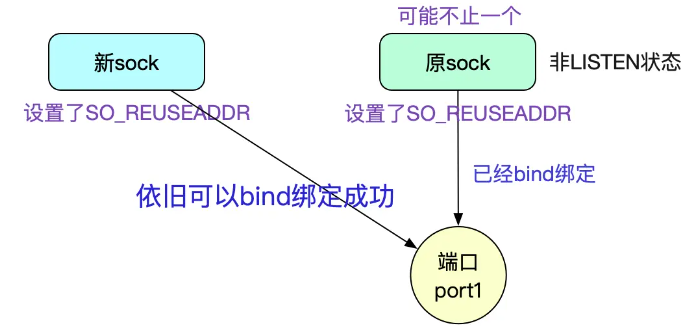

# bind 函数详解

## 一、bind 函数介绍

### 1.bind 函数介绍

__bind 函数把一个本地协议地址赋予一个套接字__。对于网际网协议，协议地址是 32 位的 IPv4 地址或 128 位的 IPv6 地址与 16 位的 TCP 或 UDP 端口号的组合。

```c{.line-numbers}
// bind 函数若成功则返回 0，若出差则返回 -1
#include <sys/socket.h>
int bind(int sockfd, const struct sockaddr *myaddr, socklen_t addrlen);
```

第二个参数是一个指向特定于协议的地址结构的指针，第三个参数是该地址结构的长度。对于 TCP，**调用 bind 函数可以指定一个端口号，或指定一个 IP 地址，也可以两者都指定，还可以都不指定**。

服务器在启动时捆绑它们的众所周知端口，__如果一个 TCP 客户或服务器未曾调用 bind 捆绑一个端口，当调用 connect 或 listen 时，内核就要为相应的套接字选择一个临时端口__。让内核来选择临时端口对于 TCP 客户来说是正常的，除非应用需要一个预留端口；然而对于 TCP 服务器来说却极为罕见，因为服务器是通过它们的众所周知端口被大家认识的。

这个规则的例外是远程过程调用（Remote Procedure Call, RPC）服务器。它们通常就由内核为它们的监听套接字选择一个临时端口，而该端口随后通过 RPC 端口映射器进行注册。客户在 connect 这些服务器之前，必须与端口映射器联系以获取它们的临时端口。

进程可以把一个特定的 IP 地址捆绑到它的套接字上，不过这个 IP 地址必须属于其所在主机的网络接口之一。对于 TCP 客户，这就为在该套接字上发送的 IP 数据报指派了源 IP 地址。对于 TCP 服务器，这就限定该套接字只接收那些目的地为这个 IP 地址的客户连接。

TCP 客户通常不把 IP 地址捆绑到它的套接字上。当连接套接字时，内核将根据所用外出网络接口来选择源 IP 地址，而所用外出接口则取决于到达服务器所需的路径。__如果 TCP 服务器没有把 IP 地址捆绑到它的套接字上，内核就把客户发送的 SYN 的目的 IP 地址作为服务器的源 IP 地址__。

在调用 bind 函数时，可以指定 IP 地址或者端口，也可以两者都指定，也可以两者都不指定：

<div align="center">
    
</div>

如果指定端口号为 0，那么内核就在 bind 被调用时选择一个临时端口。__然而如果指定 IP 地址为通配地址（wildcard），那么内核将等到套接字已连接 (TCP) 或已在套接字上发出数据报 (UDP) 时才选择一个本地 IP 地址__。这是因为 socket 套接字需要一个真正的 IP 地址。

对于 IPv4 来说，通配地址由常值 **_INADDR_ANY_** 来指定，其值一般为 0。它告知内核去选择 IP
地址。使用方法如下所示：

```c{.line-numbers}
struct sockaddr_in servaddr;
servaddr.sin_addr.s_addr = htonl(TNADDR_ANY);  /* wildcard */
```

如此赋值对 IPv4 是可行的，因为其 IP 地址是一个 32 位的值，可以用一个简单的数字常值表示（本例中为 0），对于 IPv6，我们就不能这么做了，因为 128 位的 IPv6 地址是存放在一个结构中的。（在 C 语言中，赋值语句的右边无法表示常值结构。）为了解决这个问题，我们改写为：

```c{.line-numbers}
struct sockaddr_in6 serv;
serv.sin6_addr = in6addr_any;    /* wildcard */
```

如果让内核来为套接字选择一个临时端口号，那么必须注意，函数 bind 并不返回所选择的值。实际上，由于 bind 函数的第二个参数有 const 限定词，它无法返回所选之值。__为了得到内核所选择的这个临时端口值，必须调用函数 getsockname 来返回协议地址__。

最后从 bind 函数返回的一个常见错误是 EADDRINUSE（"address already in use"，地址已使用）。

### 2.总结

TCP/UDP 连接由五个值组成的元组进行标识：

```c
{<protocol>, <src addr>, <src port>, <dest addr>, <dest port>}
```

任何独特的这些值的组合都可以标识一个连接。因此，没有两个连接可以具有相同的五个值，否则系统将无法区分这些连接。

套接字的协议 `<protocol>` 是在使用 socket() 函数创建套接字时设置的。源地址 `<src addr>` 和端口 `<src port>` 是通过 bind() 函数设置的。目标地址 `<dest addr>` 和端口 `<dest port>` 是通过 connect() 函数设置的。由于 UDP 是一种无连接协议，因此可以在不连接它们的情况下使用 UDP 套接字。**在无连接模式下，当首次发送数据时没有明确绑定的 UDP 套接字通常会被系统自动绑定（所谓绑定，其实就是指明【协议】【源地址】【源端口】），因为未绑定的 UDP 套接字无法接收任何（回复）数据。对于未绑定的 TCP 套接字也是如此，它会在连接之前自动绑定**。

如果显式绑定一个套接字，可以将其绑定到端口 0，表示"任何端口"。由于套接字实际上不能绑定到所有现有端口，因此在这种情况下，系统将不得不自行选择一个特定的端口（通常从预定义的操作系统特定源端口范围中选择）。源地址也存在类似的通配符，它可以是“任何地址”（IPv4 的 0.0.0.0）。与端口不同，__在实践中，套接字确实可以【绑定】到“任何地址”，这意味着“所有本地接口的所有源 IP 地址”__。如果稍后连接套接字，系统必须选择一个特定的源 IP 地址，**因为套接字不能同时【连接】并绑定到任何本地 IP 地址**。根据目标地址和路由表的内容，系统将选择一个合适的源地址，并将“任意”绑定替换为绑定到所选源 IP 地址。

**默认情况下，没有两个套接字可以绑定到相同的源地址和源端口组合。只要源端口不同，源地址实际上是无关紧要的（这就是很常见的情况，一台服务器上不同进程监听不同的端口）；当源地址不同时，源端口也可以相同**。如果 ipA != ipB 成立，那么将 socketA 绑定到 ipA:portA 并将 socketB 绑定到 ipB:portB 始终是可行的，即使 portA == portB。例如，socketA 属于 FTP 服务器程序，并绑定到 192.168.0.1:21，而 socketB 属于另一个 FTP 服务器程序，并绑定到 10.0.0.1:21，两个绑定都将成功。但请注意，如果一个套接字绑定到 0.0.0.0:21，它将同时绑定到所有现有本地地址，在这种情况下，无论其他套接字尝试绑定到哪个特定的 IP 地址，都不能绑定到端口 21，因为 0.0.0.0 与所有现有的本地 IP 地址发生冲突。这就需要后面介绍的 SO_REUSEADDR/SO_REUSEPORT 参数。

## 二、SO_REUSEADDR 参数介绍

SO_REUSEADDR 套接字选项能起到以下 4 个不同的功用。

### 1.作用一

SO_REUSEADDR 允许启动一个监听服务器并捆绑其众所周知端口，即使以前建立的将该端口用作它们的本地端口的连接仍存在。这个条件通常是这样碰到的：

1. 启动一个监听服务器；
2. 连接请求到达，派生一个子进程来处理这个客户；
3. 监听服务器终止，但子进程继续为现有连接上的客户提供服务；
4. 重启监听服务器。

默认情况下，当监听服务器在步骤 4 通过调用 socket、bind 和 listen 重新启动时，由于它试图捆绑一个现有连接 (即正由早先派生的那个子进程处理着的连接) 上的端口，从而 bind 调用会失败。**但是如果该服务器在 socket 和 bind 两个调用之间设置了 SO_REUSEADDR 套接字选项，那么 bind 将成功**。所有 TCP 服务器都应该指定本套接字选项，以允许服务器在这种情形下被重新启动。

### 2.作用二

**SO_REUSEADDR 会改变绑定 wildcard 地址的行为，所谓绑定 wildcard 地址，就是绑定 0.0.0.0 这个地址，表示这个 socket 绑定在当前主机的所有网络接口地址上**。

SO_REUSEADDR 允许在同一端口上启动同一服务器的多个实例（即多个进程），只要每个实例捆绑一个不同的本地 IP 地址即可。这对于使用 IP 别名技术托管多个 HTTP 服务器的网点（site）来说是很常见的。

举例来说，假设本地主机的主 IP 地址为 198.69.10.2，不过它有两个别名：198.69.10.128 和 198.69.10.129。在其上启动三个 HTTP 服务器。第一个 HTTP 服务器以本地通配 IP 地址 INADDR_ANY 和本地端口号 80（HTTP 的众所周知端口）调用 bind。第二个 HTTP 服务器以本地 IP 地址 198.69.10.128 和本地端口号 80 调用 bind。__这次调用 bind 将失败，除非在调用前设置了 SO_REUSEADDR 套接字选项__（因为通配符 INADDR_ANY 可以看成是包括了 198.69.10.128 地址）。第三个 HTTP 服务器以本地 IP 地址 198.69.10.129 和本地端口号 80 调用 bind。这次调用 bind 成功的先决条件同样是预先设置 SO_REUSEADDR。

假设 SO_REUSEADDR 均已设置，从而三个服务器都启动了，目的 IP 地址为 198.69.10.128、目的端口号为 80 的外来 TCP 连接请求将被递送给第二个服务器，目的 IP 地址为 198.69.10.129、目的端口号为 80 的外来请求将被递送给第三个服务器，目的端口号为 80 的所有其他 TCP 连接请求将都递送给第一个服务器。

__这个"默认"服务器处理目的地址为 198.69.10.2 或该主机已配置的任何其他 IP 别名的请求。这里通配地址的意思就是"没有更好的（即更为明确的）匹配的任何地址"__。

对于 TCP，我们绝不可能启动捆绑相同 IP 地址和相同端口号的多个服务器：这是完全重复的捆绑 (completely duplicate binding)。也就是说，我们不可能在启动绑定 198.69.10.2 和端口 80 的服务器后，再启动同样捆绑 198.69.10.2 和端口 80 的另一个服务器，即使我们给第二个服务器设置了SO_REUSEADDR 套接字选项也不管用。___其实也是可以绑定的，A 绑定了 198.69.10.2:80 地址，B 服务器也可以绑定到 192.168.10.2:80 地址，前提是 A 不处于 listen 状态__。使用代码进行说明，A 的代码如下所示：

```c{.line-numbers}
// A 的 socket 代码
#define SERV_PORT 9523

int main() {

    unsigned int ip = 0;
    int lfd = 0, cfd = 0;
    struct sockaddr_in serv_addr, clit_addr;
    socklen_t clit_addr_len;
    char buf[BUFSIZ], client_ip[1024];

    serv_addr.sin_family = AF_INET;
    serv_addr.sin_port = htons(SERV_PORT);
    inet_pton(AF_INET, "192.168.128.17", &ip);
    serv_addr.sin_addr.s_addr = ip;

    lfd = socket(AF_INET, SOCK_STREAM, 0);
    if (lfd == -1) {
        sys_err("socket error");
    }

    int opt = 1;
    // 设置 SO_REUSEADDR 选项
    setsockopt(lfd, SOL_SOCKET, SO_REUSEADDR, &opt, sizeof opt);
    bind(lfd, (struct sockaddr *) &serv_addr, sizeof(serv_addr));

    while (1) {
    }

    return 0;

}
```

client 的代码如下所示：

```c{.line-numbers}
// B 的 socket 代码
#define SERV_PORT 9523

int main() {

    int cfd;
    int counter = 10;
    char buf[BUFSIZ];
    unsigned int ip = 0;

    cfd = socket(AF_INET, SOCK_STREAM, 0);

    // 服务器地址结构
    struct sockaddr_in serv_addr;
    serv_addr.sin_family = AF_INET;
    serv_addr.sin_port = htons(SERV_PORT);
    inet_pton(AF_INET, "192.168.128.17", &ip);
    serv_addr.sin_addr.s_addr = ip;

    int opt = 1;
    setsockopt(cfd, SOL_SOCKET, SO_REUSEPORT, &opt, sizeof opt);
    bind(cfd, (struct sockaddr *) &serv_addr, sizeof(serv_addr));

    if (errno == EADDRINUSE) {
        printf("address already in use\n");
    }

    return 0;
}
```

A 与 B 两个进程都会绑定 192.168.128.17:9523 这个地址，先绑定 A 再绑定 B 的地址，则 B 端的输出如下所示，没有出现绑定失败的情况。

```shell
/home/xuweilin/CLionProjects/linux_programming/cmake-build-debug/my_client

Process finished with exit code 0
```

如果将 A 端代码中第 25 行添加上 `listen(lfd, 10);`，再次先启动 A 进程，再启动 B 进程，那么 B 端的输出如下所示，即 A 处于 listen 状态之后，B 无法绑定到同一地址，errno 为 98，即 EADDRINUSE。

```shell
/home/xuweilin/CLionProjects/linux_programming/cmake-build-debug/my_client
address already in use

Process finished with exit code 0
```

为了安全起见，有些操作系统不允许对已经绑定了通配地址的端口再捆绑任何“更为明确的”地址，也就是说不论是否预先设置 SO_REUSEADDR，上述例子中的系列 bind 调用都会失败。在这样的系统上，执行通配地址捆绑的服务器进程必须最后一个启动。__这么做是为了防止把恶意的服务器捆绑到某个系统服务正在使用的 IP 地址和端口上，造成合法请求被截取（即端口劫持）__。

If SO_REUSEADDR is enabled on a socket prior to binding it, the socket can be successfully bound unless there is a conflict with another socket **bound to exactly the same combination of source address and port**. Now you may wonder how is that any different than before? The keyword is "exactly". SO_REUSEADDR mainly changes the way how wildcard addresses ("any IP address") are treated when searching for conflicts.

Without SO_REUSEADDR, binding socketA to 0.0.0.0:21 and then binding socketB to 192.168.0.1:21 will fail (with error EADDRINUSE), since **0.0.0.0 means "any local IP address"**, thus all local IP addresses are considered in use by this socket and this includes 192.168.0.1, too. With SO_REUSEADDR it will succeed, **since 0.0.0.0 and 192.168.0.1 are not exactly the same address**, one is a wildcard for all local addresses and the other one is a very specific local address. Note that **the statement above is true regardless in which order socketA and socketB are bound**; without SO_REUSEADDR it will always fail, with SO_REUSEADDR it will always succeed.

To give you a better overview, let's make a table here and list all possible combinations:

```c
SO_REUSEADDR       socketA        socketB       Result
---------------------------------------------------------------------
  ON/OFF       192.168.0.1:21   192.168.0.1:21    Error (EADDRINUSE)
  ON/OFF       192.168.0.1:21      10.0.0.1:21    OK
  ON/OFF          10.0.0.1:21   192.168.0.1:21    OK
   OFF             0.0.0.0:21   192.168.1.0:21    Error (EADDRINUSE)
   OFF         192.168.1.0:21       0.0.0.0:21    Error (EADDRINUSE)
   ON              0.0.0.0:21   192.168.1.0:21    OK
   ON          192.168.1.0:21       0.0.0.0:21    OK
  ON/OFF           0.0.0.0:21       0.0.0.0:21    Error (EADDRINUSE)
```

The table above assumes that socketA has already been successfully bound to the address given for socketA, then socketB is created, either gets SO_REUSEADDR set or not, and finally is bound to the address given for socketB. **Result is the result of the bind operation for socketB**. If the first column says ON/OFF, the value of SO_REUSEADDR is irrelevant to the result.

Okay, SO_REUSEADDR has an effect on wildcard addresses, good to know. Yet that isn't its only effect it has. There is another well known effect which is also the reason why most people use SO_REUSEADDR in server programs in the first place. For the other important use of this option we have to take a deeper look on how the TCP protocol works.

对于 BSD 版本的 SO_REUSEADDR 参数，有如下需要注意的地方： Everything written above will work as long as the socket you want to bind to has address reuse enabled. It is not necessary that the other socket, the one which is already bound or is in a TIME_WAIT state, also had this flag set when it was bound. **_The code that decides if the bind will succeed or fail only inspects the SO_REUSEADDR flag of the socket fed into the bind() call_**, for all other sockets inspected, this flag is not even looked at. 也就是，A、B 两个套接字先后绑定到相同 ip:port 地址，只需要 B 套接字设置了 SO_REUSEADDR 选项，那么就可以实现绑定，A 是否设置 SO_REUSEADDR 选项不会影响最后的结果。

但是对于 Linux 系统而言却不是这样，A、B 两个套接字必须设置好 SO_REUSEADDR 选项，否则会出现 EADDRINUSE 错误。A 端代码示例如下所示，没有设置 SO_REUSEADDR 选项，并且先调用 bind 函数。

```c{.line-numbers}
// A 端代码
#define SERV_PORT 9523

int main() {

    unsigned int ip = 0;
    int lfd = 0, cfd = 0;

    struct sockaddr_in serv_addr, clit_addr;
    socklen_t clit_addr_len;
    char buf[BUFSIZ], client_ip[1024];

    serv_addr.sin_family = AF_INET;
    serv_addr.sin_port = htons(SERV_PORT);
    inet_pton(AF_INET, "192.168.17.128", &ip);
    serv_addr.sin_addr.s_addr = ip;

    lfd = socket(AF_INET, SOCK_STREAM, 0);
    if (lfd == -1) {
        sys_err("socket error");
    }

    bind(lfd, (struct sockaddr *) &serv_addr, sizeof(serv_addr));

    while (1) {
    }

    return 0;
}
```

B 端代码如下所示，设置了 SO_REUSEADDR 选项，等待 A 启动并调用完 bind 函数后，B 再调用 bind 函数。

```c{.line-numbers}
// B 端代码
#define SERV_PORT 9523

int main() {

    int cfd;
    int counter = 10;
    char buf[BUFSIZ];
    unsigned int ip = 0;

    cfd = socket(AF_INET, SOCK_STREAM, 0);

    // 服务器地址结构
    struct sockaddr_in serv_addr;
    serv_addr.sin_family = AF_INET;
    serv_addr.sin_port = htons(SERV_PORT);
    inet_pton(AF_INET, "192.168.17.128", &ip);
    serv_addr.sin_addr.s_addr = ip;

    int opt = 1;
    setsockopt(cfd, SOL_SOCKET, SO_REUSEADDR, &opt, sizeof(opt));
    bind(cfd, (struct sockaddr *) &serv_addr, sizeof(serv_addr));

    if (errno == EADDRINUSE) {
        printf("address already in use\n");
    }

    return 0;
}
```

最后 B 端输出结果如下所示：

```shell
/home/xuweilin/CLionProjects/linux_programming/cmake-build-debug/my_client
address already in use

Process finished with exit code 0
```

当 A 添加上 SO_REUSEADDR 选项时，B 端的输出结果如下所示：

```shell
/home/xuweilin/CLionProjects/linux_programming/cmake-build-debug/my_client

Process finished with exit code 0
```

这也就证明了我们的结论，Linux 系统中，如果多个 socket 要绑定到同一个 ip:port 地址，那么这些 socket 必须都要设置有 SO_REUSEADDR 选项。

### 3.作用三

SO_REUSEADDR 允许完全重复的捆绑：当一个 IP 地址和端口已绑定到某个套接字上时，如果传输协议支持，同样的 IP 地址和端口还可以捆绑到另一个套接字上。一般来说本特性仅支持 UDP 套接字（用于多播）。

本特性用于多播时（多播使用 UDP 协议实现），允许在同一个主机上同时运行同一个应用程序的多个副本。当一个 UDP 数据报需由这些重复捆绑套接字中的一个接收时，所用规则为：__如果该数据报的目的地址是一个广播地址或多播地址，那就给每个匹配的套接字递送一个该数据报的副本；但是如果该数据报的目的地址是一个单播地址，那么它只递送给单个套接字__。在单播数据报情况下，如果有多个套接字匹配该数据报，那么该选择由哪个套接字接收它取决于实现。

### 4.connect 函数的 EADDRINUSE 错误

大多数人都知道，bind() 可能会失败并出现 EADDRINUSE 错误，但是如果你开始尝试地址重用，你可能会遇到这样的奇怪情况：connect() 也会因为相同的错误而失败。那么这是怎么回事呢？远程地址，毕竟这是 connect() 添加到套接字中的内容，怎么可能被占用呢？连接多个套接字到完全相同的远程地址以前从来没有问题过，所以这里出现了什么问题？

正如之前所述，一个连接由五个值组成的元组定义，并且这五个值必须是唯一的，否则系统就无法再区分两个连接了。现在使用地址重用，我们可以将两个相同协议的套接字绑定到相同的源地址和端口。这意味着这些两个套接字的三个值已经相同。如果现在尝试将这两个套接字都连接到相同的目标地址和端口，那么将创建两个连接套接字，它们的元组是完全相同的。

这对于 TCP 连接来说是不可行的。如果数据到达任何一个连接，系统将无法确定数据属于哪个连接。至少目标地址或目标端口必须对于每个连接都不同，这样系统就没有办法识别传入的数据属于哪个连接。

因此，__如果你将两个相同协议的套接字绑定到相同的源地址和端口，并尝试将它们都连接到相同的目标地址和端口，则 connect() 实际上会对第二个套接字失败并出现 EADDRINUSE 错误__，这意味着已经有一个具有完全相同的五元组的套接字已经连接。

### 5.潜在的安全问题

SO_REUSEADDR 有一个潜在的安全问题。举例来说，假设存在一个绑定了通配地址和端口 5555 的套接字，如果指定 SO_REUSEADDR，我们就可以把相同的端口捆绑到不同的 IP 地址上，譬如说就是所在主机的主 IP 地址。此后目的地为端口 5555 及新绑定 IP 地址的数据报将被递送到新的套接字，而不是递送到绑定了通配地址的已有套接字。这些数据报可以是 TCP 的 SYN 分节。

**对于大多数众所周知的服务如 HTTP、FTP 和 Telnet 来说，这不成问题，因为这些服务器绑定的是保留端口（用户编写的程序无法占用这些保留端口）**。这种情况下，后来的试图捆绑这些端口更为明确的实例（也就是盗用这些端口）的任何进程都需要超级用户特权。然而 NFS 可能是一个问题，因为它的通常端口（2049）并不是保留端口。

## 三、SO_REUSEPORT 参数介绍

4.4BSD 随多播支持的添加引入了 SO_REUSEPORT 这个套接字选项。给 SO_REUSEPORT 引入了以下语义：

1. 本选项允许完全重复的捆绑，**不过只有在想要捆绑同一 IP 地址和端口的每个套接字都指定了本套接字选项才行**；
2. 如果被捆绑的 IP 地址是一个多播地址，那么 SO_REUSEADDR 和 SO_REUSEPORT 被认为是等效的。

SO_REUSEPORT is what most people would expect SO_REUSEADDR to be. Basically, SO_REUSEPORT allows you to bind an arbitrary number of sockets to exactly the same source address and port as long as all prior bound sockets also had SO_REUSEPORT set before they were bound. If the first socket that is bound to an address and port does not have SO_REUSEPORT set, no other socket can be bound to exactly the same address and port, regardless if this other socket has SO_REUSEPORT set or not, until the first socket releases its binding again. Unlike in case of SO_REUSEADDR the code handling SO_REUSEPORT will not only verify that the currently bound socket has SO_REUSEPORT set but it will also verify that the socket with a conflicting address and port had SO_REUSEPORT set when it was bound.

本 SO_REUSEPORT 套接字选项的问题在于并非所有系统都支持它。在那些不支持本选项但是支持多播的系统上；**我们改用 SO_REUSEADDR 以允许合理的完全重复的捆绑**（也就是同一时刻在同一个主机上可运行多次且期待接收广播或多播数据报的 UDP 程序）。

Most people ignore the fact that multicast addresses exist, but they do exist. While unicast addresses are used for one-to-one communication, multicast addresses are used for one-to-many communication. Most people got aware of multicast addresses when they learned about IPv6 but multicast addresses also existed in IPv4, even though this feature was never widely used on the public Internet.

The meaning of SO_REUSEADDR changes for multicast addresses as it allows multiple sockets to be bound to exactly the same combination of source multicast address and port. **_In other words, for multicast addresses SO_REUSEADDR behaves exactly as SO_REUSEPORT for unicast addresses_**（对应于我们所说的第二点，即 SO_REUSEADDR 和 SO_REUSEPORT 对于多播地址是等效的）. Actually, the code treats SO_REUSEADDR and SO_REUSEPORT identically for multicast addresses, that means you could say that SO_REUSEADDR implies SO_REUSEPORT for all multicast addresses and the other way round.

在 Linux 3.9 系统中支持了 SO_REUSEPORT 选项，与 BSD 系统中该选项的实现同样有一些差异。

To prevent "port hijacking", there is one special limitation: All sockets that want to share the same address and port combination **_must belong to processes that share the same effective user ID_**! So one user cannot "steal" ports of another user. 

## 四、Linux 系统 bind 函数源码分析

### 1.manpage 文档描述

首先看看在官方文档（manpage 文档），看看是怎么描述的这两个套接字选项的:

> SO_REUSEADDR: Indicates that the rules used in validating addresses supplied in a bind(2) call should allow reuse of local addresses. For AF_INET sockets this means that a socket may bind, except when there is an active listening socket bound to the address. When the listening socket is bound to INADDR_ANY with a specific port then it is not possible to bind to this port for any local address. Argument is an integer boolean flag.

简单翻译一下：SO_REUSEADDR 提供了一套复用地址的规则。对于 AF_INET 套接字，这意味着一个套接字可以绑定，除非有一个活动的监听套接字绑定到该地址。当监听套接字使用特定端口绑定到 INADDR_ANY 时，就不可能为任何本地地址重新绑定到该端口。__这是因为监听套接字处于 LISTEN 状态，如果不处于 LISTEN 状态，那么通过使用 SO_REUSEADDR 选项，两个套接字可以绑定到同一个 ip:port 地址，或者一个套接字绑定 INADDR_ANY:portA，另外一个绑定到 ip:portA（其中 ip 是同一台机器上更为具体的 ip 地址）__。

> SO_REUSEPORT: Permits multiple AF_INET or AF_INET6 sockets to be bound to an identical socket address. This option must be set on each socket (including the first socket) prior to calling bind(2) on the socket. To prevent port hijacking, all of the processes binding to the same address __must have the same effective UID__. This option can be employed with both TCP and UDP sockets.
> 
> For TCP sockets, this option allows accept(2) load distribution in a multi-threaded server to be improved __by using a distinct listener socket for each thread__. This provides improved load distribution as compared to traditional techniques such using a single accept(2)ing thread that distributes connections, or __having multiple threads that compete to accept(2) from the same socket__.
>
> For UDP sockets, the use of this option can provide better distribution of incoming datagrams to multiple processes (or threads) as compared to the traditional technique of having multiple processes compete to receive datagrams on the same socket.

此选项允许多个 AF_INET 或者 AF_INET6 的套接字绑定到同一个 socket 地址上。必须每一个调用bind函数的socket套接字都要设置这个选项(包括第一个)才能生效。为了防止端口劫持，所有绑定到相同地址的进程必须是同一个 UID。 这个选项适用于 TCP 和 UDP 套接字。

对于 TCP 套接字而言，这个选项通过每个监听线程使用不同的 listen fd 来改进 accpet 的负载分配。相对于传统的做法如只有一个 accept 线程在处理连接，或者是多个线程使用同一个listen fd 进行 accept，REUSEPORT 有助于负载均衡的改进。

对于 UDP 而言，相比如以前多个进程(或线程)都在同一个 socket 上接收数据报的情况的传统做法, 此选项能够提供一种更好的负载均衡能力。

### 2.bind 函数测试

首先做几个测试，我的测试虚拟机是 centos8，基于 Linux version 4.18.0-305.3.1.el8.x86_64版本。两个简单地测试用例如下，有兴趣的同学可以自行测试一遍。server1.cpp 的代码如下：

```cpp{.line-numbers}
int main(int argc, char* argv[]) {
    int listenfd = socket(AF_INET, SOCK_STREAM, 0);
    if (listenfd < 0) {
        std::cout << "socket error" << std::endl;
        return -1;  
    }
    int port = 30001;
    std::string addr_str = "127.0.0.1";
    std::cout << "tcp server_test1, addr:" << addr_str << ":" << port << "fd=" << listenfd << std::endl;

    sockaddr_in addr;
    addr.sin_family = AF_INET;
    addr.sin_port = htons(port);
    addr.sin_addr.s_addr = inet_addr(addr_str.c_str());

    int ret = bind(listenfd, (sockaddr*)&addr, sizeof(addr));

    if (ret < 0) {
        std::cout << "bind error! errno=" << errno << ", err = " << strerror(errno) << std::endl;
        return -1;  
    }

    std::cout << "bind succ! server_test1, addr:" << addr_str << ":" << port << "fd=" << listenfd << std::endl;
    ret = listen(listenfd, 5);
    if (ret < 0) {
        std::cout << "listen error! errno=" << errno << ", err = " << strerror(errno) << std::endl;
        return -1;
    }
    std::cout << " listen succ" << std::endl;
    while (1) {
        sockaddr cli_addr;
        socklen_t len;
        std::cout << "to accept " << std::endl;
        int connfd = accept(listenfd, &cli_addr, &len);
        if (connfd < 0) {
            std::cout << "accept error, error=" << strerror(errno) << std::endl;
        }
        std::cout << "accept succ, connfd=" << connfd << std::endl;
        std::cout << "cin 1 to close connection, go to timewait" << std::endl;
        int close_flag;
        std::cin >> close_flag;
        if (close_flag == 1) {
            shutdown(connfd, SHUT_WR);
        }
        std::cout << "succ call shutdown, now exit" << std::endl;
        return 0;
    }

    close(listenfd);
    return 0;
}
```

server2.cpp 的代码如下所示：

```cpp{.line-numbers}
int main(int argc, char* argv[]) {
    int listenfd = socket(AF_INET, SOCK_STREAM, 0);
    if (listenfd < 0) {
        std::cout << "socket error" << std::endl;
        return -1;
    }
    int port = 30001;
    std::string addr_str = "127.0.0.1";
    std::cout << "tcp server_test2, addr:" << addr_str << ":" << port << "fd=" << listenfd << std::endl;
    sockaddr_in addr;
    addr.sin_family = AF_INET;
    addr.sin_addr.s_addr = inet_addr(addr_str.c_str());
    addr.sin_port = htons(port);

    int ret = bind(listenfd, (sockaddr*)&addr, sizeof(addr));
    if (ret < 0) {
        std::cout << "bind error! errno=" << errno << ", err = " << strerror(errno) << std::endl;
        return -1;
    }
    std::cout << "bind succ, fd = " << listenfd << ", addr: [127.0.0.1:30001]" << std::endl;
    std::cout << "bind succ, server_test2, addr:" << addr_str << ":" << port << "fd=" << listenfd << std::endl;

    while (1) {
    }
    close(listenfd);
    return 0;
}
```

**1) 测试 1**

不开启 SO_REUSEADDR，也不调用 listen 函数，两个使用相同的 ip:port 进行 bind，结果如下：

```c
server1 ：127.0.0.1:30001, bind 成功
server2 ：127.0.0.1:30001, bind 失败
```

很遗憾，server2 试图 bind 时候得到了错误：`bind error! errno=98, err = Address already in use！`，这就说明如果不开启 SO_REUSEADDR，那么两个套接字无法绑定到相同 ip:port 地址。

**2) 测试 2**

开启 SO_REUSEADDR，不进行 listen，两个使用相同 ip:port 进行 bind，结果如下：

```c
server1 ：127.0.0.1:30001, bind 成功
server2 ：127.0.0.1:30001, bind 成功
```

可以看到，开启 SO_REUSEADDR 并且没有 listen 的情况下，两次 bind 都成功了。说明如果开启 SO_REUSEADDR 选项，并且第一次 socket 调用不处于 listen 状态时，可以绑定到相同的 ip:port 地址。

**3) 测试 3**

开启 SO_REUSEADDR，并且调用 listen 使套接字称为监听状态，两个使用相同 ip:port 进行bind，结果如下：

```c
server1 ：127.0.0.1:30001, bind 成功
server2 ：127.0.0.1:30001, bind 失败
```

可以看到，尽管开启了 SO_REUSEADDR，但是由于套接字调用了 listen 函数，变为了 TCP_LISTEN 状态，第二次 bind 就会失败。

**4) 测试 4**

与测试 3 相同，只是不开启 SO_REUSEADDR，开启 SO_REUSEPORT。

```c
server1 ：127.0.0.1:30001, bind 成功
server2 ：127.0.0.1:30001, bind 成功
```

可以看到，虽然没开启 SO_REUSEADDR，但是开启了 SO_REUSEPORT。套接字调用了 listen 函数，变为了 TCP_LISTEN 状态，但是第二次 bind 还是成功的。

**5) 测试 5**

不开启 REUSEADDR，不开启 REUSEPORT。启动 server1 并监听。 使用 telnet 模拟客户端，当客户端连接上来后，此时 conn_sock 连接处于 ESTABLISHED 状态，而 listen_sock（监听套接字）还是处于 TCP_LISTEN 状态。使用 netstat 观察如下：

<div align="center">
    
</div>

然后我们让服务端主动断开 TCP 连接，然后退出程序。根据 TCP 四次挥手的过程，此时 conn_sock 最终预期会进入 TCP_TIMEWAIT 状态。而 listen_sock 由于程序退出，所以 netstat 看不到了。

<div align="center">
    
</div>

与此同时，在 TCP_TIMEWAIT 状态下赶紧启动 server2 试图绑定同一个 ip:port，观察是否能正常 bind，很遗憾，bind 失败了。

<div align="center">
    
</div>

linux 下 TCP_TIMEWAIT 大约维持 60s 左右，等到 TCP_TIMEWAIT 状态结束后，再启动 server2，发现是能正常绑定的。也就是说，不开启 REUSEADDR，不开启 REUSEPORT。当存在处于 TCP_TIMEWAIT 的连接时时，我们不能马上对这个地址重新 bind。

**6) 测试 6**

与测试 5 完全相同，唯一区别是 server1 和 server2 均开启了 REUSEADDR，不开启 REUSEPORT。实验结果：server2 能在 server1 的 TCP_TIMEWAIT 状态下成功绑定这个地址。

**7) 测试 7**

与测试 5 完全相同，唯一区别是 server1 和 server2 均开启了 REUSEPORT, 不开启 REUSEADDR。实验结果：server2 同样能在 server1 的 TCP_TIMEWAIT 状态下成功绑定这个地址。

### 3.源码分析

#### 3.1 函数调用关系

```c{.line-numbers}
#------------------- *用户态* ---------------------------
bind
#------------------- *内核态* ---------------------------
__x64_sys_bind # 内核系统调用。
    |-- __sys_bind # net/socket.c
        |-- sockfd_lookup_light # net/socket.c - 通过 fd 查找对应的 socket.
        |-- move_addr_to_kernel # net/socket.c - 将用户态的参数数据拷贝进内核。
        |-- inet_bind # net/ipv4/af_inet.c
            |-- 如果协议有自定义的 bind 函数，那么调用自定义的 bind
            |-- __inet_bind # net/ipv4/af_inet.c
                |-- AF_INET 兼容性检查
                |-- < 1024 的端口权限检查
                |-- 广播与多播地址处理
                |-- inet_csk_get_port # net/ipv4/inet_connection_sock.c - 端口分配和保存逻辑。
```

bind 的核心逻辑就是将 socket 和地址端口联系起来。在实现过程中，有一些特殊功能需要注意：

- 端口可以设置为 0 吗？
> 答：可以，系统会分配一个随机端口。但是服务程序一般都指定特定的端口，而不是由系统随机分配。

- 地址端口可以重复绑定吗?
> 答：可以，了解一下这两个设置项：SO_REUSEADDR/SO_REUSEPORT。
> 1.SO_REUSEADDR 是为了解决 TCP_TIME_WAIT 问题。
> 2.SO_REUSEPORT 是为了解决惊群问题，允许多个进程共同使用相同的地址端口。

#### 3.2 结构

地址和端口会保存在对应的 socket 结构体中，对应的网络端口信息也会存储在内核的哈希表里。

**1) socket 的结构关系如下所示**：

<div align="center">
    
</div>

**2) 哈希表**

glibc 的 bind 最终会调用到内核的 __inet_bind 函数。内核维持了一个绑定端口的哈希表，由于判断端口冲突。在内核中 bind 实际上底层是依靠这个 hash 表实现的，这个 hash 表的示意结构如下：

<div align="center">
    
</div>

哈希存储 IP 地址/端口相关数据结构信息。哈希表时间复杂度是 O(1)，非常快。但是这里也有缺点，因为哈希表是由数组和链表的组合结构，自身有冲突链表（哈希链），而且 `inet_bind_bucket` 有 owners 链表，保存共享端口（端口相同）的 socket 数据。

查询数据时，可能需要遍历两个链表，而且在同一个网域下，以端口作为哈希索引，导致不同的 IP 地址相同端口的数据也会在同一个 `inet_bind_bucket` 里。所以 `inet_bind_bucket` 要使用 `fastreuse` 和 `fastreuseport` 去优化，尽量避免链表遍历。更为具体的 hash 结构如下所示：

<div align="center">
    
</div>

在上图中，inet_hashinfo 结构体中的 bhash 指针指向的就是 inet_bind_hashbucket 数组。而 inet_bind_hashbucket 结构体中，chain 为 struct hlist_head 类型，其中的 first 指向 inet_bind_bucket 结构体中的 node 结点，这些 node 结点将 inet_bind_bucket 串联成一个链表。并且在每一个 inet_bind_bucket 结构体中，有一个 owners 指向 sock 结构体链表。在这个链表中，每一个 sock 的端口号相同。

```c{.line-numbers}
// defined in include/linux/types.h

struct hlist_head {
    struct hlist_node *first;
};

struct hlist_node {
    struct hlist_node *next, **pprev;
};
```

哈希表其实就是一个以 inet_bind_hashbucket 为元素的数组，**而 hash_key 是一个根据端口号 port、net 等算出来的一个值**。利用 hase_key 找到一个 inet_bind_hashbucket 元素。而 inet_bind_hashbucket 持有一个 inet_bind_bucket 结构体组成的链表。每个 inet_bind_bucket 结构体又持有一个 sock 结构体组成的链表 owners，这条 sock 链表的所有 sock 的 port 端口一定是一样的。**当我们调用 bind 函数时，其实就是去对应的 sock 链表上，添加新的 sock**。

__inet_bind 函数调用 get_port 这个函数指针成员去 bind 端口号。get_port 其实就是 inet_csk_get_port 函数。如果 inet_csk_get_port 无法绑定端口号，就会报错 EINADDRUSE，也就是我们经常遇到的哪个错误码了。这个错误的原因其实就是因为我们新插入的 sock 与原来的 sock 链表中的某个sock 产生冲突了。

哈希表各个结构体的具体源码如下所示：

```c{.line-numbers}
/* net/ipv4/tcp_ipv4.c */
struct inet_hashinfo tcp_hashinfo;

/* include/net/inet_hashtables.h */
struct inet_bind_hashbucket {
    spinlock_t        lock;
    struct hlist_head chain;
};

/* hash 结构，保存了端口对应的 socket 信息。 */
struct inet_hashinfo {
    ...
    /* Ok, let's try this, I give up, we do need a local binding
     * TCP hash as well as the others for fast bind/connect.
     */
    struct kmem_cache            *bind_bucket_cachep;
    struct inet_bind_hashbucket  *bhash;
    unsigned int                 bhash_size;
    ...
};

/* Networking protocol blocks we attach to sockets.
 * socket layer -> transport layer interface
 */
struct proto {
    char name[32];
    ...
    int (*get_port)(struct sock *sk, unsigned short snum);
    ...
    union {
        struct inet_hashinfo *hashinfo;
        ...
    } h;
    ...
}

/* net/ipv4/tcp_ipv4.c */
struct proto tcp_prot = {
    .name       = "TCP",
    ...
    .get_port   = inet_csk_get_port,
    ...
    // tcp_hashinfo 相当于是编译器自己给 inet_hashinfo 分配了一块内存空间
    .h.hashinfo = &tcp_hashinfo,
    ...
};

/* include/net/inet_hashtables.h */
struct inet_bind_bucket {
    possible_net_t       ib_net;
    int                  l3mdev;
    unsigned short       port;          /* 端口号。 */
    signed char          fastreuse;     /* SO_REUSEADDR 选项。*/
    signed char          fastreuseport; /* SO_REUSEPORT 选项。*/
    kuid_t               fastuid;       /* SO_REUSEPORT 选项的用户 id。*/
#if IS_ENABLED(CONFIG_IPV6)
    struct in6_addr      fast_v6_rcv_saddr;
#endif
    __be32               fast_rcv_saddr;
    unsigned short       fast_sk_family;
    bool                 fast_ipv6_only;
    struct hlist_node    node;   /* bucket 列表，保存哈希冲突的 bucket。*/
    struct hlist_head    owners; /* socket 信息。 */
};
```

哈希表逻辑操作：

```c{.line-numbers}
/* net/ipv4/tcp.c
 * 初始化哈希表。也就是分配一个 inet_bind_hashbucket 结构体数组，并将数组指针赋值给 inet_hashinfo 结构体中的 bhash 
 */
void __init tcp_init(void) {
    ...
    tcp_hashinfo.bhash =
        alloc_large_system_hash("TCP bind",
                    sizeof(struct inet_bind_hashbucket),
                    tcp_hashinfo.ehash_mask + 1,
                    17, /* one slot per 128 KB of memory */
                    0,
                    &tcp_hashinfo.bhash_size,
                    NULL,
                    0,
                    64 * 1024);
    tcp_hashinfo.bhash_size = 1U << tcp_hashinfo.bhash_size;
    for (i = 0; i < tcp_hashinfo.bhash_size; i++) {
        spin_lock_init(&tcp_hashinfo.bhash[i].lock);
        // #define INIT_HLIST_HEAD(ptr) ((ptr)->first = NULL)
        INIT_HLIST_HEAD(&tcp_hashinfo.bhash[i].chain);
    }
    ...
}

/* 添加 hash bucket。创建一个 inet_bind_bucket 结构体，并添加到 inet_bind_hashbucket 结构体中的 chain 链表中
 * net/ipv4/inet_connection_sock.c
 * Allocate and initialize a new local port bind bucket.
 * The bindhash mutex for snum's hash chain must be held here.
 */
struct inet_bind_bucket *inet_bind_bucket_create(struct kmem_cache *cachep,
                         struct net *net,
                         struct inet_bind_hashbucket *head,
                         const unsigned short snum,
                         int l3mdev)
{
    struct inet_bind_bucket *tb = kmem_cache_alloc(cachep, GFP_ATOMIC);

    if (tb) {
        write_pnet(&tb->ib_net, net);
        tb->l3mdev    = l3mdev;
        tb->port      = snum;
        tb->fastreuse = 0;
        tb->fastreuseport = 0;
        // #define INIT_HLIST_HEAD(ptr) ((ptr)->first = NULL)
        INIT_HLIST_HEAD(&tb->owners);
        // 使用链表的头插法，将 tb->node 插入到 head->chain 中
        hlist_add_head(&tb->node, &head->chain);
    }
    return tb;
}

// 将 n 插入到 h 与 h->first 之间，其实就是使用链表头插法
static inline void hlist_add_head(struct hlist_node *n, struct hlist_head *h) {
    struct hlist_node *first = h->first;
    n->next = first;
    if (first)
        first->pprev = &n->next;
    WRITE_ONCE(h->first, n);
    n->pprev = &h->first;
}

/* 哈希表与 socket 相互建立联系。 */
// 使用头插法，将 sock 结构体插入到 inet_bind_bucket 的 owners 链表中
void inet_bind_hash(struct sock *sk, struct inet_bind_bucket *tb, const unsigned short snum) {
    inet_sk(sk)->inet_num = snum;
    sk_add_bind_node(sk, &tb->owners);
    inet_csk(sk)->icsk_bind_hash = tb;
}

static inline void sk_add_bind_node(struct sock *sk, struct hlist_head *list) {
    hlist_add_head(&sk->sk_bind_node, list);
}
```

#### 3.3 inet_bind 函数分析

```c{.line-numbers}
int inet_bind(struct socket *sock, struct sockaddr *uaddr, int addr_len)
{
    struct sock *sk = sock->sk;
    int err;

    /* If the socket has its own bind function then use it. (RAW) */
    // 如果有协议自定义的 bind 函数，那么调用自定义的 bind 函数
    if (sk->sk_prot->bind) {
        return sk->sk_prot->bind(sk, uaddr, addr_len);
    }

    // 传入的参数是否有误
    if (addr_len < sizeof(struct sockaddr_in))
        return -EINVAL;

    /* BPF prog is run before any checks are done so that if the prog
     * changes context in a wrong way it will be caught.
     */
    err = BPF_CGROUP_RUN_PROG_INET4_BIND(sk, uaddr);
    if (err)
        return err;

    return __inet_bind(sk, uaddr, addr_len, false, true);
}
```
```c{.line-numbers}
/* Sockets 0-1023 can't be bound to unless you are superuser */
#define PROT_SOCK    1024

int __inet_bind(struct sock *sk, struct sockaddr *uaddr, int addr_len,
        bool force_bind_address_no_port, bool with_lock) {
    // 省略代码......

    // 检测 AF_INET 的兼容性
    if (addr->sin_family != AF_INET) {
        /* Compatibility games : accept AF_UNSPEC (mapped to AF_INET)
         * only if s_addr is INADDR_ANY.
         */
        err = -EAFNOSUPPORT;
        if (addr->sin_family != AF_UNSPEC || addr->sin_addr.s_addr != htonl(INADDR_ANY))
            goto out;
    }

    // 省略代码.....

    snum = ntohs(addr->sin_port);
    err = -EACCES;
    // 如果端口号 snum 小于 1024（inet_prot_sock 会返回一个宏，PROT_SOCK，也就是 1024
    // 需要检测是否有 CAP_NET_BIND_SERVICE 权限，CAP_NET_BIND_SERVICE 是指 Linux 系统中的一种特殊权限，用于允许一个非特权用户进程绑定到小于 1024 的网络端口。
    if (snum && snum < inet_prot_sock(net) && !ns_capable(net->user_ns, CAP_NET_BIND_SERVICE))
        goto out;

    // 省略代码..... 
    // 多播和广播地址处理
    inet->inet_rcv_saddr = inet->inet_saddr = addr->sin_addr.s_addr;
    if (chk_addr_ret == RTN_MULTICAST || chk_addr_ret == RTN_BROADCAST)
        inet->inet_saddr = 0;  /* Use device */

    /* Make sure we are allowed to bind here. */
    // bind_address_no_port 是在 do_ip_setsockopt 函数中设置，如果用户设置了 IP_BIND_ADDRESS_NO_PORT 选项，那么就会将 inet->bind_address_no_port设置为 1
    // IP_BIND_ADDRESS_NO_PORT 这个标志位其实就是告诉系统: "socket 需要绑定某个网卡并且接下来要去 connect, 你不要给我绑定端口, 端口到连接的时候再分配".
    // 如果端口 snum 不为 0，直接进入到 if 语句块中，调用 get_port 函数来设置和校验端口
    // 如果端口 snum 为 0，这时由于我们没有设置 bind_address_no_port 选项，而 force_bind_address_no_port 直接被赋值为 false，因此也会进入 if 语句块，调用 get_port 方法
    if (snum || !(inet->bind_address_no_port || force_bind_address_no_port)) {
        if (sk->sk_prot->get_port(sk, snum)) {
            inet->inet_saddr = inet->inet_rcv_saddr = 0;
            err = -EADDRINUSE;
            goto out_release_sock;
        }
        err = BPF_CGROUP_RUN_PROG_INET4_POST_BIND(sk);
        if (err) {
            inet->inet_saddr = inet->inet_rcv_saddr = 0;    
            goto out_release_sock;
        }
    }

    // 省略代码......
    
    inet->inet_sport = htons(inet->inet_num);
    inet->inet_daddr = 0;
    inet->inet_dport = 0;
    sk_dst_reset(sk);
    err = 0;
out_release_sock:
    if (with_lock)
        release_sock(sk);
out:
    return err;
}

static inline int inet_prot_sock(struct net *net) {
    return PROT_SOCK;
}
```

inet_bind 与 __inet_bind 这两个函数主要做了两个操作，一是检测是否允许 bind，二是获取可用的端口号。这边值得注意的是。如果我们设置需要 bind 的端口号为 0，那么 Kernel 会帮我们随机选择一个可用的端口号来进行 bind！

```c{.line-numbers}
// 让系统随机选择可用端口号
sock_addr.sin_port = 0;
call_err=bind(sockfd_server,(struct sockaddr*)(&sock_addr),sizeof(sock_addr));
```

让我们看下 inet_bind 的流程：

<div align="center">
    
</div>

值得注意的是，由于对于 <1024 的端口号需要 CAP_NET_BIND_SERVICE, 我们在监听 80 端口号 (例如启动 nginx 时候), 需要使用 root 用户或者赋予这个可执行文件 CAP_NET_BIND_SERVICE 权限。

```shell
use root 
 or
setcap cap_net_bind_service=+eip ./nginx 
```

#### 3.4 inet_csk_get_port 函数

```c{.line-numbers}
/* 
 * Obtain a reference to a local port for the given sock,
 * if snum is zero it means select any available local port.
 * We try to allocate an odd port (and leave even ports for connect())
 */
int inet_csk_get_port(struct sock *sk, unsigned short snum)
{
    // 当前待绑定的 sock 是否具有 reuse 条件：
    // 具体要求为该 sock 开启了 reuseaddr 并且该 sock 状态不是 TCP_LISTEN
    bool reuse = sk->sk_reuse && sk->sk_state != TCP_LISTEN;
    struct inet_hashinfo *hinfo = sk->sk_prot->h.hashinfo;
    int ret = 1, port = snum;
    struct inet_bind_hashbucket *head;
    struct net *net = sock_net(sk);
    struct inet_bind_bucket *tb = NULL;

    /* 如果传入的端口为 0，内核从合法的端口范围内，自动分配一个端口给 socket。 */
    /* 内核自己选的端口无需判断冲突，直接 goto success */
    if (!port) {
        head = inet_csk_find_open_port(sk, &tb, &port);
        if (!head)
            return ret;
        if (!tb)
            goto tb_not_found;
        goto success;
    }

    // 使用 inet_bhashfn 函数与端口号计算出 hash 索引，然后从哈希表中取出该索引上的 inet_bind_hashbucket 结构体
    // inet_bind_hashbucket 持有一个链表，这个链表是由多个 inet_bind_bucket 组成的
    head = &hinfo->bhash[inet_bhashfn(net, port, hinfo->bhash_size)];
    spin_lock_bh(&head->lock);

    // 遍历 inet_bind_hashbucket 持有的链表上的每一个 inet_bind_bucket
    // 找到 port一致、网络命名空间一致、l3mdev一致的 inet_bind_bucket 结构体
    // inet_bind_bucket 这个结构体有一个 owners 成员, owners 是一个 以 sock 为元素组成的链表。
    // 这个链表上每个 sock 的 port 都是一样的，网络命名空间也是一致的。 但是 ip 不一定一样
    inet_bind_bucket_for_each(tb, &head->chain)
        if (net_eq(ib_net(tb), net) && tb->port == port)
            goto tb_found;
tb_not_found:
    /* 如果哈希表里没有 inet_bind_bucket，创建一个对应的结构体，并添加到 inet_bind_hashbucket 结构体中的 chain 链表中 */
    tb = inet_bind_bucket_create(hinfo->bind_bucket_cachep, net, head, port);
    if (!tb)
        goto fail_unlock;
tb_found:
    // 如果找到了 inet_bind_bucket 结构体，判断要绑定的地址是否会发生冲突
    // 因为 inet_bind_bucket 的 owners 链表中所有的 sock 结构体的端口号相同，必须要判定是否会发生冲突
    if (!hlist_empty(&tb->owners)) {
        // 如果 sk 强制 reuse_addr，直接绑定，不判断冲突
        // 注意这个跟用户设置 SO_REUSEADDR 无关
        if (sk->sk_reuse == SK_FORCE_REUSE)
            goto success;

        // 使用 inet_bind_bucket 的 fastreuse 等标志快速判断是否复用，尽量避免遍历 sock 链表来判断
        // 先判断 SO_REUSEADDR 选项，再判断 SO_REUSEPORT 选项
        if ((tb->fastreuse > 0 && reuse) || sk_reuseport_match(tb, sk))
            goto success;
        // 调用 inet_csk_bind_conflict 去遍历 sock 链表判断是否冲突
        if (inet_csk_bind_conflict(sk, tb, true, true))
            goto fail_unlock;
    }
success:
    // 重新设置 tb 上的 fastreuse 和 fastreuseport 两个标志位
    inet_csk_update_fastreuse(tb, sk);

    if (!inet_csk(sk)->icsk_bind_hash)
        /* 将 socket 与哈希表绑定。 */
        /* 使用头插法，将 sock 结构体插入到 inet_bind_bucket 的 owners 链表中 */
        inet_bind_hash(sk, tb, port);
    WARN_ON(inet_csk(sk)->icsk_bind_hash != tb);
    ret = 0;

fail_unlock:
    spin_unlock_bh(&head->lock);
    return ret;
}
```

看一小段代码：

```c{.line-numbers}
if ((tb->fastreuse > 0 && reuse) || sk_reuseport_match(tb, sk))
    goto success;
```

这里使用了 inet_bind_bucket 的 fastreuse 成员来判断，fastreuse 是一个标志位，它标志着当前是否支持 SO_REUSEADDR。每当向 sock 结构体里面插入一个 sock 之后，fastreuse 就会更新标志。**实际上，只要当前 sock 链表上的所有的 sock 都开启了 SO_REUSEADDR 并且所有 sock 都不是 TCP_LISTEN 状态，那么这个 fastreuse 就是 true**（只要套接字都开启了 SO_REUSEADDR 以及不处于 LISTEN 状态，那么多个套接字可以绑定到同一个 ip:port 地址）。只要一直维持好这个标志位的值，就可以快速判断是否能复用地址，而不需要再去依次遍历 sock 链表上的每一个 sock。这个优化是很利于效率提升的。

sk_reuseport_match 这个函数效果是一样的，其实就是利用 fastreuseport 这个标志位，快速判断是否支持 REUSEPORT。注意这里有个条件会判断 uid。这表示尽管开启了 REUSERPORT，但是如不是同一个 EUID 的话也会 bind 失败。内核这么做的目的这主要是为了防止端口劫持。`sk_reuseport_match` 主要判断当前 inet_bind_bucket 的 fastreuseport 标志位、要绑定的 sk_reuseport 标志位、【上一个被添加到 owners 链表中】并且【开启了 SO_REUSEPORT 选项】的 sock 和当前 sock 的 uid 以及地址是否相等。`sk_reuseport_match` 函数主要用于 REUSEPORT 快速检测。

`tb->fastreuseport` 和 `tb->fastreuse` 这两个值的具体设置由函数 `inet_csk_update_fastreuse` 来完成。

```c{.line-numbers}

#define FASTREUSEPORT_ANY    1
#define FASTREUSEPORT_STRICT    2

static inline int sk_reuseport_match(struct inet_bind_bucket *tb, struct sock *sk) {
    kuid_t uid = sock_i_uid(sk);

    // inet_bind_bucket 中的 fastreuseport 为 0，说明 owners 链表中存在 sock 结构体没有开启 SO_REUSEPORT
    if (tb->fastreuseport <= 0)
        return 0;
    // 新 sock 没开启 SO_REUSEPORT 直接冲突
    if (!sk->sk_reuseport)
        return 0;
    if (rcu_access_pointer(sk->sk_reuseport_cb))
        return 0;
    // tb->fastuid 是在 inet_csk_update_fastreuse 中被设置
    // 其实就是【上一个被添加到 owners 链表中】并且【开启了 SO_REUSEPORT 选项】的 sock 中 uid 的值
    if (!uid_eq(tb->fastuid, uid))
        return 0;
    // 如果 fastreuseport 为 FASTREUSEPORT_ANY，说明现在 owners 链表中只有一个 sock 结构，并且开启了 SO_REUSEPORT
    // 快速判断通过，可以直接添加当前要绑定的 sock 到 owners 链表中
    if (tb->fastreuseport == FASTREUSEPORT_ANY)
        return 1;

    // tb->fast_rcv_saddr 其实也是【上一个被添加到 owners 链表中】并且【开启了 SO_REUSEPORT 选项】的 sock 中 sk_rcv_saddr 的值    
    // 执行到这一步，说明当前 sock 也开起来 SO_REUSEPORT 选项
    // 如果 ipv4_rcv_saddr_equal 返回 True，说明当前 sock 和上一个已经绑定的 sock 地址相同，快速判断成功（都有 SO_REUSEPORT，以及处在同一用户组中）
    return ipv4_rcv_saddr_equal(tb->fast_rcv_saddr, sk->sk_rcv_saddr, ipv6_only_sock(sk), true, false);
}

/* 
 * match_sk*_wildcard == true:  0.0.0.0 equals to any IPv4 addresses
 * match_sk*_wildcard == false: addresses must be exactly the same, i.e. 0.0.0.0 only equals to 0.0.0.0
 */
static bool ipv4_rcv_saddr_equal(__be32 sk1_rcv_saddr, __be32 sk2_rcv_saddr, bool sk2_ipv6only, bool match_sk1_wildcard,
                 bool match_sk2_wildcard) {
    if (!sk2_ipv6only) {
        // 如果地址完全相等，192.168.15.7 == 192.168.15.7
        if (sk1_rcv_saddr == sk2_rcv_saddr)
            return true;
        // 如果地址不完全相等，如果 match_sk1_wildcard 开启了通配符匹配，且 sk1_rcv_saddr 为通配符 0.0.0.0（实际上就是 0），也返回 True
        // 对于 match_sk2_wildcard 也是同理
        return (match_sk1_wildcard && !sk1_rcv_saddr) || (match_sk2_wildcard && !sk2_rcv_saddr);
    }
    return false;
}
```

如果快速判断没有通过，那么就会进入 `inet_csk_bind_conflict` 函数。`inet_csk_bind_conflict` 函数其实本质就是遍历 sock 链表，判断是否有冲突。之前讲过，`tb->fastreuseport` 和 `tb->fastreuse` 这两个值的具体设置由函数 `inet_csk_update_fastreuse` 来完成。

```c{.line-numbers}
void inet_csk_update_fastreuse(struct inet_bind_bucket *tb, struct sock *sk) {
    kuid_t uid = sock_i_uid(sk);
    // 当前待绑定的 sock 是否具有 reuse 条件：
    // 具体要求为该 sock 开启了 reuseaddr 并且该 sock 状态不是 TCP_LISTEN
    bool reuse = sk->sk_reuse && sk->sk_state != TCP_LISTEN;

    // 如果 inet_bind_bucket 结构体中的 owners 链表为空（即还没有 sock 结构体）
    if (hlist_empty(&tb->owners)) {
        // 则直接设置 inet_bind_bucket 结构体中 fastreuse 参数为要绑定的 sock 的 reuse 条件
        tb->fastreuse = reuse;
        // 如果要绑定的 sock 结构体设置了 SO_REUSEPORT 选项，那么设置 fastreuseport 为 FASTREUSEPORT_ANY
        // 在后面调用 sk_reuseport_match 函数判断链表是否有端口冲突时，会检查 FASTREUSEPORT_ANY，
        // 在要绑定的 sock 自身设置了 SO_REUSEPORT 选项，并且处于同一个用户组时，sk_reuseport_match 直接返回 True，表示可以绑定
        if (sk->sk_reuseport) {
            tb->fastreuseport = FASTREUSEPORT_ANY;
            tb->fastuid = uid;
            tb->fast_rcv_saddr = sk->sk_rcv_saddr;
            tb->fast_ipv6_only = ipv6_only_sock(sk);
            tb->fast_sk_family = sk->sk_family;
        } else {
            // 如果要绑定的 sock 没有设置 SO_REUSEPORT 选项，那么 fastreuseport 被设置为 0
            tb->fastreuseport = 0;
        }

    // 如果 inet_bind_bucket 结构体中的 owners 链表不为空
    } else {
        // 如果要绑定的 sock 自身不满足 reuse 条件，就把 inet_bind_bucket 结构体中的 fastreuse 设置为 0
        if (!reuse)
            tb->fastreuse = 0;
        
        // 如果要绑定的 sock 自身设置了 SO_REUSEPORT 选项    
        if (sk->sk_reuseport) {
            /* We didn't match or we don't have fastreuseport set on the tb, but we have sk_reuseport set on this socket
             * and we know that there are no bind conflicts with
             * this socket in this tb（但是此 sock 还是被添加到 tb 的 owners 链表中，而没有发生冲突）, so reset our tb's reuseport
             * settings so that any subsequent sockets that match our current socket will be put on the fast path.
             *
             * If we reset we need to set FASTREUSEPORT_STRICT so we do extra checking for all subsequent sk_reuseport socks.
             */
            if (!sk_reuseport_match(tb, sk)) {
                tb->fastreuseport = FASTREUSEPORT_STRICT;
                tb->fastuid = uid;
                tb->fast_rcv_saddr = sk->sk_rcv_saddr;
                tb->fast_ipv6_only = ipv6_only_sock(sk);
                tb->fast_sk_family = sk->sk_family;
            }
        } else {
            tb->fastreuseport = 0;
        }
    }
}
```

#### 3.5 端口冲突

在介绍如何判定端口冲突之前，需要先介绍 sock 结构体中的两个属性：`sk_reuse` 和 `sk_reuseport`，它们最开始在 `setsockopt` 函数中被实现：

```c{.line-numbers}
int sock_setsockopt(struct socket *sock, int level, int optname, sockptr_t optval, unsigned int optlen) {

    struct so_timestamping timestamping;
    struct sock_txtime sk_txtime;
    struct sock *sk = sock->sk;
    int val;
    int valbool;

    if (copy_from_sockptr(&val, optval, sizeof(val)))
        return -EFAULT;

    valbool = val ? 1 : 0;
    lock_sock(sk);

    switch (optname) {
    // .......
        case SO_REUSEADDR:
            sk->sk_reuse = (valbool ? SK_CAN_REUSE : SK_NO_REUSE);
            break;
        case SO_REUSEPORT:
            sk->sk_reuseport = valbool;
            break;
    // .......
    }

}
```

struct socket 是内核对 socket 结构体的封装，这里只需要知道他与我们用户代码中拿到的 socket_fd 是一一对应的就行了。这里其实实现很简单，仅仅是把 sock 结构体的成员值就行了：例如设置了 SO_REUSEADDR，则 sk->sk_reuse 设为 SK_CAN_REUSE；如设置了 SO_REUSEPORT，则设置 sk->re_reuseport。

冲突的必要：新旧 socket 都绑定在相同设备上，而且IP地址/端口相同。这个判断端口冲突的逻辑，有点烧脑，主要检查两个选项场景： SO_REUSEADDR 和 SO_REUSEPORT。先检查 SO_REUSEADDR 的使用场景，再检查 SO_REUSEPORT 的使用场景。

1. SO_REUSEADDR 是为了解决前一个 socket 处于 TCP_TIME_WAIT 没完全退出的问题。
2. SO_REUSEPORT 是为了解决惊群问题的，允许多个进程共同使用同一个 IP 地址/端口。

```c{.line-numbers}
static int inet_csk_bind_conflict(const struct sock *sk,
                  const struct inet_bind_bucket *tb,
                  bool relax, bool reuseport_ok)
{
    struct sock *sk2;
    bool reuse = sk->sk_reuse;
    bool reuseport = !!sk->sk_reuseport && reuseport_ok;
    kuid_t uid = sock_i_uid((struct sock *)sk);

    /*
     * Unlike other sk lookup places we do not check for sk_net here, since _all_ the socks listed
     * in tb->owners list belong to the same net - the one this bucket belongs to.
     */

    // 遍历 sock 链表上每一个 sock，一旦提前 break 退出，那就说明有冲突，此时无法 bind，如果没有提前退出，最后 sk2 == NULL, 此时说明不存在冲突，可以 bind
    /* 遍历已经 bind 端口的 socket. */
    sk_for_each_bound(sk2, &tb->owners) {
        /* 如果 sk2 也绑定到同一个设备上，那么进行检查。 */
        if (sk != sk2 && (!sk->sk_bound_dev_if || !sk2->sk_bound_dev_if || sk->sk_bound_dev_if == sk2->sk_bound_dev_if)) {
            /* 当前或者前一个 socket 没有设置 SO_REUSEADDR，或者前一个 socket 已经处于 listen 状态了。 */
            if ((!reuse || !sk2->sk_reuse || sk2->sk_state == TCP_LISTEN) &&
                /* 当前或者前一个 socket 没有设置 SO_REUSEPORT */
                (!reuseport || !sk2->sk_reuseport || rcu_access_pointer(sk->sk_reuseport_cb) ||
                /* 或者 sk2 不处于 TCP_TIME_WAIT 状态并且两个 uid 不一样。  */
                (sk2->sk_state != TCP_TIME_WAIT && !uid_eq(uid, sock_i_uid(sk2))))) {
                /* 两个地址一样。 */
                if (inet_rcv_saddr_equal(sk, sk2, true))
                    break;
            }
            if (!relax && reuse && sk2->sk_reuse && sk2->sk_state != TCP_LISTEN) {
                if (inet_rcv_saddr_equal(sk, sk2, true))
                    break;
            }
        }
    }
    return sk2 != NULL;
}
```

我们来捋一下上面的冲突条件，结果如下：

- 当前或者前一个 socket 都开启 `REUSRADDR`，并且前一个 sock 不是 `TCP_LISTEN` 状态。这种情况下无论是否支持 `REUSEPORT` 都不会产生冲突。
- 当前或者前一个 socket 之一未开启 `REUSEADDR` 或者有存在 `TCP_LISTEN` 状态的 sock 情况下，这时候分为三种情况：
  - 当前或者前一个 socket 没有设置 `SO_REUSEPORT，` 直接冲突
  - 均开启 `REUSEPORT`, 但是存在某个 sock 状态不是 `TCP_TIME_WAIT`，并且 euid 不同。冲突
  - 其他情况不冲突

注意这里有个条件，不是 TCP_TIME_WAIT 并且 euid 不同才会冲突。**当然以上发生冲突的情况还有一个前提是 ip 地址也是一样的，如果 ip 不一样是永远不可能发生冲突的**。

上面的代码有点绕，笔者就讲一下，对于我们日常开发要关心什么。 我们在上面的 bind 里面经常见到 sk_reuse 和 sk_reuseport 这两个 socket 的 Flag。这两个 Flag 能够决定是否能够 bind (绑定) 成功。这两个 Flag 的设置在 C 语言里面如下代码所示:

```c
 setsockopt(sockfd_server, SOL_SOCKET, SO_REUSEADDR, &(int){ 1 }, sizeof(int));
 setsockopt(sockfd_server, SOL_SOCKET, SO_REUSEPORT, &(int){ 1 }, sizeof(int));
```

在之前的源码里面，我们看到判断 bind 是否冲突的时候，有这么一个分支:

```c
(!reuse || !sk2->sk_reuse || sk2->sk_state == TCP_LISTEN /* 暂忽略reuseport */){
	// 即有一方没有设置
}
```

如果 sk2 (即已 bind 的 socket) 是 TCP_LISTEN 状态或者，sk2 和新 sk 两者之一没有设置_REUSEADDR 的时候，可以判断为冲突。我们可以得出，如果原 sock 和新 sock 都设置了 SO_REUSEADDR 的时候，并且原 sock 不是 Listen 状态，都可以绑定成功，甚至 ESTABLISHED 状态也可以！

<div align="center">
    
</div>

这个在我们平常工作中，最常见的就是原 sock 处于 TIME_WAIT 状态，这通常在我们关闭 Server 的时候出现，如果不设置 SO_REUSEADDR, 则会绑定失败，进而启动不来服务。而设置了 SO_REUSEADDR, 由于不是 TCP_LISTEN, 所以可以成功。

<div align="center">
    
</div>

SO_REUSEPORT 是 Linux 在 3.9 版本引入的新功能。在海量高并发连接的创建时候，由于正常的模型是单线程 listener 分发，无法利用多核优势，这就会成为瓶颈。我们看下一般的 Reactor 线程模型:

<div align="center">
    
</div>

明显的其单线程 listen/accept 会存在瓶颈 (如果采用多线程 epoll accept，则会惊群，加 WQ_FLAG_EXCLUSIVE 可以解决一部分)，尤其是在采用短链接的情况下。鉴于此，Linux 增加了 SO_REUSEPORT, 让我们在多次 bind 监听相同 ip:port 地址的时候，如果设置了 SO_REUSEPORT 的时候不会报错，也就是让我们有个多线程 (进程) bind/listen 的能力。

<div align="center">
    
</div>

直接在内核层面做负载均衡，将 accept 的任务分散到不同的线程的不同 socket 上 (Sharding)，毫无疑问可以多核能力，大幅提升连接成功后的 socket 分发能力。