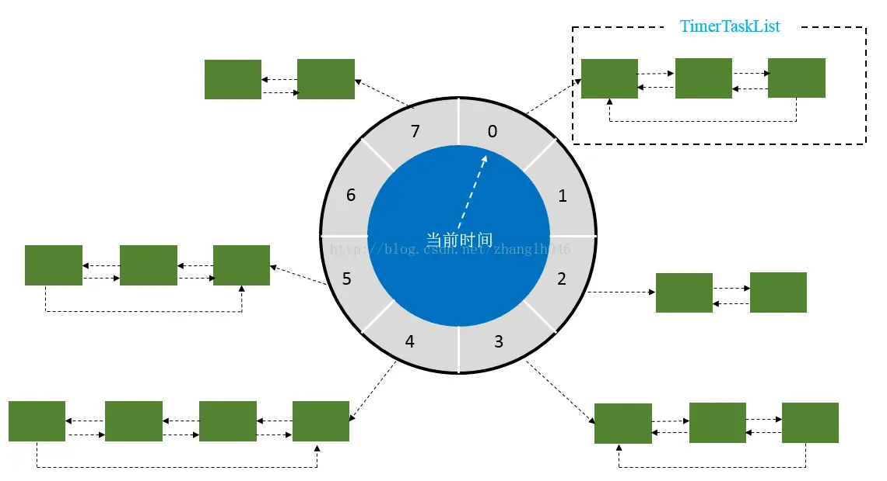
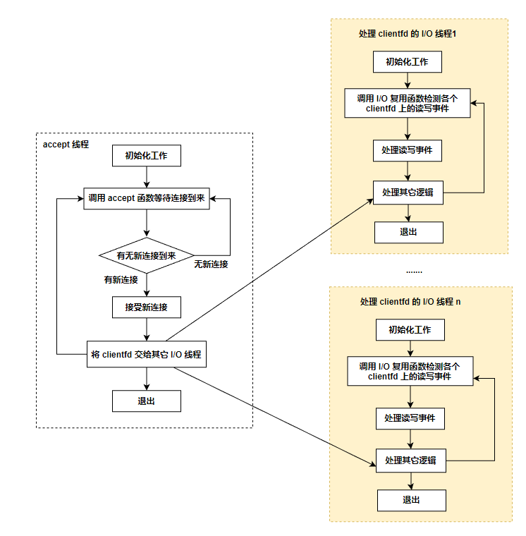
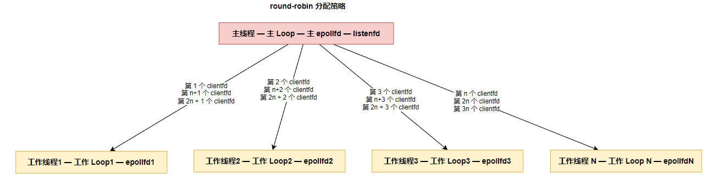
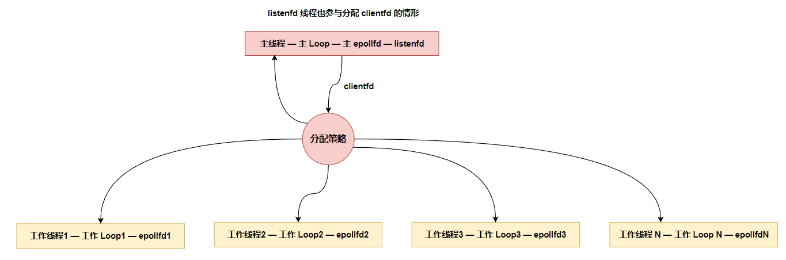
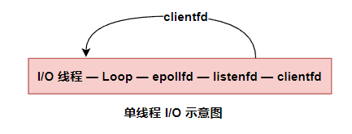

## 七、后端服务中的定时器设计

### 1.最简单的定时器

一个最简单的定时器功能可以按如下思路实现：

```c{.line-numbers}
void* threadFunc(void* arg) {
    while (m_bRunning) {
        // 休眠 3 秒
        sleep(3000);

        // 检测所有会话的心跳
        checkSessionHeartbeat();
    }
    return NULL;
}
```

以上代码在一个独立的线程中每隔 3 秒对所有 Session 做一次心跳检测。这是一个非常简单的实现逻辑，有些读者可能会觉得这样做有点"简单粗暴"。其实，这段代码来源于一个真实的商业项目。在一些特殊场景下，确实可以按这种思路来实现定时器，只不过可能**将 sleep 函数换成一些可以设置超时或等待时间的、让线程挂起或等待的函数（如 select、poll 等）**。

但是上述实现定时器的方法毕竟适用场景太少，也不能与前面介绍的 one thread one loop 结构相结合，one thread one loop 结构中的定时器才是本节的重点。

### 2.定时器的基本设计思路

根据实际的场景需求，我们的定时器对象一般需要一个**唯一标识、过期时间、重复次数、定时器到期时触发的动作**，因此一个定时器对象可以被设计成如下结构：

```cpp{.line-numbers}
typedef std::function<void()> TimerCallback;

// 定时器对象
class Timer {
    Timer() ;
    ~Timer();

    void run() {
        m_callback();
    }

    // 其它实现在下文中会逐步完善

    private:
        // 定时器的 ID，唯一标识一个定时器
        int64_t m_id;
        // 定时器的到期时间
        time_t m_expiredTime;
        // 定时器重复触发的次数 
        int32_t m_repeatedTimes;
        // 定时器触发后的回调函数
        TimerCallback m_callback;
}
```

注意，正如前面章节所强调的，**在定时器回调函数 `m_callback` 中不能有耗时或者阻塞线程的操作**，如果存在这种操作，则为了不影响整个循环流的执行，需要将这些耗时或者阻塞的操作移到其他线程中。

使用定时器的 one thread one loop 结构如下所示：

```cpp{.line-numbers}
while (!m_bQuitFlag) {
    check_and_handle_timers();
    epoll_or_select_func();
    handle_io_events ();
    handle_other_things();
}
```

我们在 **`check_and_handle_timers`** 函数中对各个定时器对象进行了处理（检测是否到期，如果到期，则调用相应的定时器函数完成定时任务）。先从最简单的情形开始讨论，将定时器对象放在一个 std::list 对象中：

```cpp{.line-numbers}
// m_listTimers 可以是 EventLoop 的成员变量
std::list<Timer*> m_listTimers;

void EventLoop::check_and_handle_timers() {
    for (auto& timer : m_listTimers) {
        // 判断定时器是否到期
        if (timer->isExpired()) {
            timer->run ();
        }
    }
}
```

为了方便管理所有定时器对象，我们可以专门新建一个 **`TimerManager`** 类对定时器对象进行管理，该对象提供了增加、移除和判断定时器是否到期等的接口：

```cpp{.line-numbers}
class TimerManager {
public:
    TimerManager() = default;
    ~TimerManager() = default;

    /** 添加定时器
     * @param repeatedCount 重复次数
     * @param interval 触发间隔
     * @param timerCallback 回调函数
     * @return 返回创建成功的定时器 id
     */
    int64_t addTimer(int32_t repeatedCount, int64_t interval, const TimerCallback& timerCallback);

    /** 移除指定 id 的定时器
     * @param timerId 待移除的定时器 id
     * @return 成功移除定时器返回 true，反之返回 false
     */
    bool removeTimer(int64_t timerId);

    /** 检测定时器是否到期，如果到期则触发定时器函数
     */
    void checkAndHandleTimers();

private:
    std::list<Timer*> m_listTimers;
};
```

在 EventLoop 中 **`check_and_handle_timers`** 函数的实现如下：

```cpp{.line-numbers}
void EventLoop::check_and_handle_timers() {
    // m_timerManager 可以是 EventLoop 的成员变量
    m_timerManager.checkAndHandleTimers():
}
```

**`addTimer`**、**`removeTimer`**、**`checkAndHandleTimers`** 的实现如下：

```cpp{.line-numbers}
int64_t TimerManager::addTimer(int32_t repeatedCount, int64_t interval, const TimerCallback& timerCallback) {
    Timer* pTimer = new Timer(repeatedCount, interval, timerCallback);
    m_listTimers.push_back(pTimer);
    return pTimer->getId();
}

bool TimerManager::removeTimer(int64_t timerId) {
    for (auto iter = m_listTimers.begin(); iter != m_listTimers.end(); ++iter) {
        if ((*iter)->getId() == timerId) {
                m_listTimers.erase(iter);
                return true;
        }
    }

    return false;
}

void TimerManager::checkAndHandleTimers() {
    Timer* deletedTimer;   
    for (auto iter = m_listTimers.begin(); iter != m_listTimers.end(); ) {
        if ((*iter)->isExpired()) {
            // 更新定时器 Timer 的下一次到期时间，以及重复次数减一
            (*iter)->run();
            
            if ((*iter)->getRepeatedTimes() == 0) {
                // 定时器不需要再触发时从集合中移除该对象
                deletedTimer = *iter;
                iter = m_listTimers.erase(iter);
                delete deletedTimer;
                continue;
            } else {
                ++iter;
            }
        }
    }// end for-loop
}
```

在向 **`addTimer`** 函数传递必要的参数后创建一个 **`Timer`** 对象，并返回唯一标识该定时器对象的 ID，后续就可以通过定时器 ID 操作这个定时器对象了。这里的定时器 ID 使用了一个单调递增的 **`int64_t`** 类型的整数，我们也可以使用其他类型，例如 uid，只要能唯一区分每个定时器对象即可。当然，在这里的设计逻辑中，**可能存在多个线程多个 `EventLoop`，每个 `EventLoop` 都含有一个 `m_timerManager` 对象**，但我们希望所有定时器 ID 都能够全局唯一，所以这里每次生成定时器 ID 时都使用了一个整型原子变量的 ID 基数，将它设置为 **`Timer`** 对象的静态成员变量，在每次需要生成新的定时器 ID 时都将其递增 1 即可。这里利用 **`C++11`** 的 **`std::mutex`** 对 **`s_initialId`** 进行保护：

```cpp{.line-numbers}
typedef std::function<void()> TimerCallback;

class Timer {
public:
    /**
     * @param repeatedTimes 定时器重复次数，设置为-1表示一直重复下去
     * @param interval      下一次触发的时间间隔
     * @param timerCallback 定时器触发后的回调函数
     */
    Timer(int32_t repeatedTimes, int64_t interval, const TimerCallback& timerCallback);
    ~Timer();

    int64_t getId() const {
        return m_id;
    }

    int64_t getExpiredTime() const {
        return m_expiredTime;
    }

    bool isExpired();

    int32_t getRepeatedTimes() const {
        return m_repeatedTimes;
    }

    void run();

    // 其他实现暂且省略

private:
    // 定时器的 id，唯一标识一个定时器
    int64_t                     m_id;
    // 定时器的到期时间
    time_t                      m_expiredTime;
    // 定时器重复触发的次数
    int32_t                     m_repeatedTimes;
    // 定时器触发后的回调函数
    TimerCallback               m_callback;
    // 触发时间间隔                
    int64_t                     m_interval;

    // 定时器 id 基准值
    static std::atomic<int>     s_initialId;
};

// Timer.cpp
Timer::Timer(int32_t repeatedTimes, int64_t interval, const TimerCallback& timerCallback) {
    m_repeatedTimes = repeatedTimes;
    m_interval = interval;

    // 当前时间加上触发间隔得到下一次的过期时间
    m_expiredTime = (int64_t)time(nullptr) + interval;
    m_callback = timerCallback;

    // 生成一个唯一的 id
    m_id = Timer::generateId();
}

// Timer.cpp
int64_t Timer::generateId() {
    int64_t tmpId;
    s_mutex.lock();
    ++s_initialId;
    tmpId = s_initialId;
    s_mutex.unlock();

    return tmpId;
}
```

定时器的下一次过期时间 **`m_expiredTime`** 是添加定时器的时间点加上触发间隔 interval，参见以上代码片段中的加粗行，也就是说，**这里使用绝对时间点作为定时器的过期时间**，读者在自己的实现中也可以使用相对时间间隔。在这里的实现中，定时器还有个表示触发次数的变量：**`m_repeatedCount`**，**`m_repeatedCount`** 为 -1 时表示不限制触发次数（即一直触发），m_repeatedCount 大于 0 时表示触发 m_repeatedCount 次，每触发一次，m_repeatedCount 就递减 1，一直到 m_repeatedCount 等于 0 时将其从定时器集合中移除：

```cpp{.line-numbers}
void TimerManager::checkAndHandleTimers() {
    Timer* deletedTimer;   
    for (auto iter = m_listTimers.begin(); iter != m_listTimers.end(); ) {
        if ((*iter)->isExpired()) {
            // 更新定时器 Timer 的下一次到期时间，以及重复次数减一
            (*iter)->run();
            
            if ((*iter)->getRepeatedTimes() == 0) {
                // 定时器不需要再触发时从集合中移除该对象
                deletedTimer = *iter;
                iter = m_listTimers.erase(iter);
                delete deletedTimer;
                continue;
            } else {
                ++iter;
            }
        }
    }// end for-loop
}
```

在以上代码中先遍历定时器对象集合，然后调用 Timer::isExpired 函数判断当前定时器对象是否到期，该函数的实现如下，实现很简单，即用定时器的到期时间与当前系统时间做比较：

```cpp{.line-numbers}
bool Timer::isExpired() {
    int64_t now = time(nullptr);
    return now >= m_expiredTime;
}
```

如果一个定时器已经到期，则执行定时器 Timer::run()，该函数不仅调用定时器回调函数，还更新定时器对象的状态信息（如触发次数和下一次触发的时间点）:

```cpp{.line-numbers}
void Timer::run() {
    m_callback();

    if (m_repeatedTimes >= 1) {
        --m_repeatedTimes;
    }

    m_expiredTime += m_interval;
}
```

除了可以在定时器触发次数变为 0时将定时器对象从定时器列表中移除，也可以调用 removeTimer 函数主动从定时器列表中移除一个定时器对象。

以上就是定时器的基本设计思路，我们一定要明白在这个流程中一个定时器对象具有哪些属性，以及如何管理定时器对象。**当然，这里自顶向下一共有三层，分别是 `EventLoop`、`TimerManager`、`Timer`**，其中 TimerManager 对象不是必需的，在一些设计中直接用 **`EventLoop`** 封装的相应方法对 **`Timer`** 对象进行管理。

**`EventLoop` 对象中持有 `TimerManager` 对象来管理各个定时器，`TimerManager` 对象中有 `Timer` 定时器对象集合**。在 EventLoop 的事件循环中，首先调用 TimerManager::checkAndHandleTimers 方法，循环遍历 TimerManager 持有的各个 Timer 定时器对象，检查 Timer 是否到期，如果到期则执行 Timer 中的回调函数，最后如果 Timer 的重复次数执行完毕，就移除此定时器。

### 3.定时器逻辑的性能优化

上述定时器实现存在严重的性能问题，即每次检测定时器对象是否触发时都要遍历整个定时器集合，移除定时器对象时也需要遍历整个定时器集合。**我们其实可以将定时器对象按过期时间从小到大排序，这样检测定时器对象时，只要从最小过期时间开始检测即可，一旦找到过期时间大于当前时间的定时器对象**，就不需要继续检测后面的定时器对象了。

#### 3.1 定时器对象集合的数据结构优化一

我们可以在每次将定时器对象添加到集合时都自动进行排序，如果仍然使用 std::list 作为定时器集合，则可以给 std::list 自定义一个排序函数（从小到大排序），代码实现如下：

```cpp{.line-numbers}
// Timer.h
class Timer {
public:
    // 省略无关代码
    int64_t getExpiredTime() const {
        return m_expiredTime;
    }
}

// TimerManager.h
struct TimerCompare {
    bool operator() (const Timer* lhs, const Timer* rhs) {
        return lhs->getExpiredTime() < rhs->getExpiredTime();
    }
}
```

每次添加定时器时都调用自定义排序函数对象 **`TimerCompare`** (以下代码片段中的加粗行):

```cpp{.line-numbers}
int64_t TimerManager::addTimer(int32_t repeatedCount, int64_t interval, const
TimerCallback& timerCallback) {
    Timer* pTimer = new Timer(repeatedCount, interval, timerCallback);
    m_listTimers.push_back(pTimer);
    // 对定时器对象按过期时间从小到大排序
    m_listTimers.sort(TimerCompare());
    return pTimer->getId();
}
```

将定时器对象按过期时间从小到大排好序后，检测各个定时器对象是否触发时不用再遍历整个定时器对象集合，**只要从过期时间最小的定时器对象开始检测，一直找到过期时间大于当前系统时间的定时器对象就可以停止检测了**，实现逻辑如下：

```cpp{.line-numbers}
void TimerManager::checkAndHandleTimers() {
    // 遍历过程中是否调整了部分定时器的过期时间
    bool adjusted = false;
    Timer* deletedTimer;   
    for (auto iter = m_listTimers.begin(); iter != m_listTimers.end(); ) {
        if ((*iter)->isExpired()) {
            (*iter)->run();
            
            if ((*iter)->getRepeatedTimes() == 0) {
                // 定时器不需要再触发时从集合中移除该对象
                deletedTimer = *iter;
                iter = m_listTimers.erase(iter);
                delete deletedTimer;
                continue;
            } else {
                ++iter;
                // 标记下集合中有定时器调整了过期时间
                adjusted = true;
            }
        } else {
            // 找到大于当前系统时间的定时器对象就不需要继续往下检查了，退出循环
            break;
        }// end if      
    }// end for-loop

    // 由于调整了部分定时器的过期时间，需要重新排序一下
    if (adjusted) {
        m_listTimers.sort(TimerCompare());
    }
}
```

在以上代码中有个细节需要注意：假设现在的系统时刻是 now，定时器集合中定时器的过期时间从小到大依次为 **`t1、t2、t3、t4、t5....tn`**，假设 **`t4 < now < t5`**，即此刻 t1、t2、t3、t4 对应的定时器会触发，触发后，会从 t1、t2、t3、t4 中减去相应的时间间隔，**更新后的 t1′、t2′、t3′、t4′ 就不一定小于 t5～tn了，因此需要再次对定时器集合进行排序**。但是存在一种情形：t1～t5 触发后对应的触发次数正好变为 0，**因此需要从定时器列表中移除它们，在这种情形下就不需要对定时器列表进行排序了**。因此以上代码使用了一个 adjusted 变量记录**是否有过期时间被更新且未被从列表中移除的定时器对象**，如果有，则之后再次对定时器集合进行排序。

上述设计虽然解决了定时器遍历效率低下的问题，但是无法解决移除一个定时器时仍然需要遍历的问题，使用链表结构的 std::list 插入非常方便，但定位某个具体元素的效率较低。

#### 3.2 定时器对象集合的数据结构优化二

为了提高定时器的效率，我们一般采用两种常用的方法：时间轮和时间堆。时间轮的基本思想是**将现在时刻 t 加上一个时间间隔 interval，以 interval 为步长，将各个定时器对象的过期时间按步长分布在不同的时间槽（time slot）中**，当在一个时间槽中出现多个定时器对象时，这些定时器对象按加入槽的顺序串成链表，时间轮的示意图如下所示。

<div align="center">
    
</div>

因为每个时间槽的时间间隔都是一定的，在每次检测时都判断当前系统时间处于哪个时间槽中，**比该槽序号小的槽中的所有定时器都已到期**，执行对应的定时器函数之后，移除不需要重新触发的定时器，或重新计算需要下一次触发的定时器对象的时间并重新计算，将其移到新的时间槽中。这适用于 one loop one thread 结构。

时间轮实际上是将一个链表按时间分组，这虽然提高了一些效率，但还是存在问题，尤其是某个时间槽对应的链表较长时。**时间堆指利用数据结构中小根堆（Min Heap）到期时间的大小来组织定时器对象**，小根堆的各个节点都代表一个定时器对象，它们按过期时间从小到大排列。使用小根堆在管理定时器对象和执行效率上都要优于前面方案中的 std::list 和 std::map，这是目前一些主流网络库中涉及定时器部分的实现，例如 Libevent。笔者在实际项目中会使用 stl 提供的优先队列即 std::priority_queue 作为定时器的实现，**使用 std::priority_queue 的排序方式是从小到大，这是因为 std::priority 从小到大排序时，其内部实现的数据结构也是小根堆**。

### 4.对时间的缓存

在使用定时器功能时，免不了要使用获取操作系统时间的函数，而在大多数操作系统上，获取系统时间的函数都属于系统调用，一次系统调用相对于 one thread one loop 结构中的其他逻辑来说可能耗时更多。因此为了提高效率，在一些对时间要求精度不是特别高的情况下，**我们可能会缓存一些时间，在较近的下次如果需要系统时间，则可以使用上次缓存的时间**，而不是再次调用获取系统时间的函数。目前有不少网络库和商业服务在定时器逻辑这一块都使用了这一策略。上述逻辑的伪代码如下：

```c{.line-numbers}
while (!m_bQuitFlag) {
    // 这里第 1 次获取系统时间，并缓存它
    get_system_time_and_cache();
    // 利用上一步获取的系统时间进行一些耗时短的操作
    do_something_quickly_with_system_timer();
    // 这里可以不用再次获取系统时间，而是将第 1 步缓存的时间作为当前系统时间
    use_cached_time_to_check_and_handle_timers();
    
    epoll_or_select_func();
    
    handle_io_events();
    
    handle_other_things();
}
```

最后总结一下：定时器的实现原理和逻辑并不复杂，关键点是如何为定时器对象集合设计出高效的数据结构，使每次从定时器集合中增加、删除、修改和遍历定时器对象时都更高效。

## 八、带有网络通信模块的服务器的经典结构

### 1.结构一

结构一的模式为：**listenfd 为阻塞模式，为 listenfd 独立分配一个接受连接线程**。有很多服务程序结构确实采用了阻塞模式的 listenfd，为了不让 accept 函数在没有连接时因阻塞对程序的其他逻辑执行流造成影响，**我们通常将 accept 函数放在一个独立的线程中**。这个线程的伪代码如下：

```cpp{.line-numbers}
// 接受连接线程
void* accept_thread_func(void* param) {
    // 可以在这里做一些初始化工作
    
    while(退出标志) {
        struct sockaddr_in clientaddr;
        socklen_t clientaddrlen = sizeof (clientaddr);
        // 没有连接时，线程会被阻塞在 accept 函数处
        int clientfd = accept(listenfd, (struct sockaddr *)&clientaddr, sclientaddrlen);
        if (clientfd == -1) {
            // 出错了，可以在此做一些清理资源动作，例如关闭 listenfd
            break;
        }

        // 将 clientfd 交给其他 I/O 线程的 I/O 复用函数
        // 由于跨线程操作，所以需要使用锁对公共操作的资源进行保护
    }
}
```

其他 I/O 线程的结构依旧是利用 I/O 复用函数处理 clientfd 上读写事件的 one thread one loop 结构，这里以 epoll_wait 为例：

```cpp{.line-numbers}
// 其他 I/O 线程
void* io_thread_func(void* param) {
    // 可以在这里做一些初始化工作
    while(退出标志) {
        epoll_event epoll_events[1024];
        // 所有 clientfd 都被挂载到 epollfd, 由 epoll_wait 统一检测读写事件
        n = epoll_wait(epollfd, epoll_events, 1024, 1000);

        // 在 epoll_wait 返回时处理对应 clientfd 上的读写事件
        
        // 其他一些操作
    }
}
```

当然，这里的 I/O 线程可以存在多个，结构示意图如下：

<div align="center">
    
</div>

将 clientfd 从 accept_thread_func 交给 io_thread_func 的方法也有很多，这里以使用一个互斥锁进行实现为例：

```c{.line-numbers}
// 存储 accept 函数产生的 clientfd 的多线程共享变量
std::vector<int> g_vecClientfds;
// 保护 g_vecClientfds 的互斥体
std::mutex g_clientfdMutex;

// 接受连接线程
void* accept_thread_func(void* param) {
    // 可以在这里做一些初始化工作

    while(退出标志) {
        struct sockaddr_in clientaddr;
        socklen_t clientaddrlen = sizeof (clientaddr);
        // 没有连接时，线程会被阻塞在 accept 函数处
        int clientfd = accept(listenfd, (struct sockaddr *)&clientaddr, &clientaddrlen);
        if (clientfd == -1) {
            // 出错了，可以在此做一些清理资源动作，例如关闭 listenfd
            break;
        }

        // 将 clientfd 交给其他 I/O 线程的 I/O 复用函数
        // 由于是跨线程操作，所以需要一些锁对公共操作的资源进行保护
        std::lock_guard<std::mutex> scopedlock(g_clientfdMutex);
        g_vecClientfds.push_back(clientfd);
    }
}

void* io_thread_func(void* param) {
    // 可以在这里做一些初始化工作

    while(退出标志) {
        epoll_event epoll_events[1024]:
        // 将所有 clientfd 都挂载到 epollfd, 由 epoll_wait 统一检测读写事件
        n = epoll_vait(epollfd, epoll_events, 1024, 1000);
        // 在 epoll_wait 返回时处理对应 clientfd 的读写事件
        // 其他一些操作
        // 从共享变量 g_vecClientfds 中取出新的 clientfd
        retrieveNewClientfds(epollfd);
    }
}

void retrieveNewClientfds(int epollfd) {
    std::lock_guard<std::mutex> scopedLock(g_clientfdMutex);
    if (!g_vecClientfds.empty()) {
        // 遍历 g_vecclientfds 取出各个 fd，设置 fd 挂载到所在线程的 epollfd 上
        // 在全部取出后，清空 g_vecClientfds
        g_vecClientfds.clear();
    }
}
```

注意，在以上代码中由于要求 clientfd 是非阻塞模式的，所以将设置 clientfd 为非阻塞模式的逻辑放在 accept_thread_func 或 io_thread_func 中均可。以上代码有点效率问题：某个时刻 accept_thread_func 向 g_vecClientfds 中添加了一个 clientfd，**如果此时 io_thread_func 函数正阻塞在 epoll_wait 处，我们就要唤醒 epoll_wait**，让 I/O 线程从 g_vecClientfds 中取出 clientfd，然后将其添加到 epollfd 上使用 epoll 进行统一监控。

### 2.结构二

listenfd 为阻塞模式，使用同一个 one thread one loop 结构处理 listenfd 的事件。单独为 listenfd 分配一个线程毕竟是对资源的一种浪费，有读者可能想到这样一种方案：listenfd 虽然被设置为阻塞模式，但**可以将 listenfd 挂载到某个 loop 的 epollfd 上，在 epoll_wait 返回且 listenfd 上有读事件时，调用 accept 函数就不会阻塞了**。伪代码如下：

```c{.line-numbers}
void* io_thread_func(void* param) {
    
    // 可以在这里做一些初始化工作

    while(退出标志) {
        epoll_event epoll_events[1024];
        // listenfd 和 clientfd 都挂载到 epollfd, 由 epoll_wait 统一检测读写事件
        n = epoll_vait(epollfd, epoll_events, 1024, 1000);

        if (如果在 listenfd 上有事件) {
            // 此时调用 accept 函数就不会阻塞
            int clientfd = accept(listenfd, ...);
            // 对 clientfd 做进一步处理
        }

        // 其它一些操作
    }
}
```

如以上代码所示，在这种情况下确实可以将 **`listenfd`** 设置成阻塞模式，调用 **`accept`** 函数时也不会造成流程阻塞。但这样的设计存在严重的效率问题：**在每一轮循环中一次只能接受一个连接（每次循环都仅调用了一次 accept 函数）**，如果客户端的连接数较多，则这种处理速度可能跟不上客户端的连接请求速度，所以要在一个循环里面处理 accept 函数，但实际情形是我们无法确定下一轮调用 accept 函数时，在 backlog 队列中是否还有新连接，**如果没有，则由于 *`listenfd`* 是阻塞模式，所以调用 accept 函数会阻塞**。

### 3.结构三

**`listenfd`** 为非阻塞模式，使用同一个 **`one thread one loop`** 结构处理 listenfd 的事件将 listenfd 设置为非阻塞模式后，我们就不会有以上窘境了。伪代码如下：

```cpp{.line-numbers}
void* io_thread_func(void* param) {
    
    // 可以在这里做一些初始化工作

    while(退出标志) {
        epoll_event epoll_events[1024];
        // listenfd 和 clientfd 都挂载到 epollfd, 由 epoll_wait 统一检测读写事件
        n = epoll_vait(epollfd, epoll_events, 1024, 1000);

        if (如果在 listenfd 上有事件) {
            while (true) {
                // 此时调用 accept 函数就不会阻塞
                int clientfd = accept(listenfd, ...);
                if (clientfd == -1) {
                    // 错误码是 EWOULDBLOCK，说明此时已经没有新连接了
                    // 可以退出内层的 while 循环
                    if (errno == EWOULDBLOCK) {
                        break;
                    } else if (errno == EINTER) {
                        continue;
                    } else {
                        // 对其它情况都认为出错
                        // 做一次错误处理逻辑
                    }
                } else {
                    // 正常接受连接
                    // 对 clientfd 做进一步处理
                }
            }
        }

        // 其它一些操作
    }
}
```

将 listenfd 设置成非阻塞模式还有一个好处：我们可以自己定义在一次 listenfd 读事件处理中最多接受多少连接，该逻辑也很容易实现，将以上代码中内层 while 循环的判断条件从 true 改成判定特定的次数即可。

理解 listenfd 为什么被建议设置成非阻塞模式后，我们将 listenfd 挂载到某个 loop 所属的 epollfd 上与 clientfd 统一处理就没有疑问了。接下来进一步讨论这一结构。

#### 3.1 listenfd 单独使用一个 loop，clientfd 被分配至其他 loop

这在实际商业服务器中是比较常用的一个结构，**`listenfd`** 被单独挂载到一个线程 **`loop`** 的 **`epollfd`** 上（这个线程一般是主线程），为了表述方便，我们将这个线程称为主线程，将对应的 loop 称为主 loop。产生新的 clientfd 并将其按一定的策略挂载到其他线程 loop 的 epollfd 上，我们将这些线程称为工作线程，将对应的 loop 称为工作 loop。例如使用轮询策略（round robin），我们可以将 clientfd 均匀地分配给其他工作线程，如下图所示：

<div align="center">
    
</div>

对轮询策略可以做一些优化：将 clientfd 挂载到各个工作 loop 上之后，由于连接断开时，工作 loop 会移除连接对应的 clientfd，**所以在一段时间后，各个工作 loop 上的 clientfd 数量都可能不一样**，会出现数量差别很大的极端情况，因此主 loop 在分配新产生的 clientfd 时可以先查询各个工作 loop 上当前实际的 clientfd 数量，把当前新产生的 clientfd 分配给持有 clientfd 最少的工作 loop。

#### 3.2 listenfd 不单独使用一个 loop，将所有 clientfd 都按一定策略分配给各个 loop

**对于一些建立和断开连接操作不是很频繁的场景，实际上没必要让 listenfd 单独使用一个线程**，因为如果在这种场景下让 listenfd 单独使用一个 Loop，这个线程在大多数情况下就可能处于空闲状态，而负责 clientfd 的其他线程可能比较忙碌，例如对于用户量较大的即时通信服务器、实时对战类型的游戏服务器，接受连接并不是高频操作，连接上的数据收发操作才是高频操作。如果采用 listernfd 单独使用一个线程的策略，则不仅浪费资源，效率也不高，**所以应该让 listenfd 所在的线程也参与 clientfd 读写事件的处理**。

<div align="center">
    
</div>

Redis 6.0 引入了多线程 I/O，在多线程启用状态下，**主线程既参与处理 listenfd 逻辑，也参与分配 clientfd 和处理 clientfd 的读写事件**，这是 listenfd 不单独使用一个 loop 且所有 clientfd 都按一定策略分配给各个 loop 的典型案例。

#### 3.3 listenfd 和所有 clientfd 均使用一个 Loop

这是上述情形的特例，一般用于整个 Loop 都是高效的内存操作的情形，例如 redis-server 的 I/O 线程情形，即单线程 I/O 情形。

事实上，本章介绍的 one thread one loop 思想及 clientfd 在多个 loop 之间的分配策略同样适用于多进程模型，例如 Nginx，只不过在像 Nginx 这样的服务中**使用单个进程来接受和处理连接后，主线程变成了主进程（Master Process），工作线程变成了工作进程（WorkerProcess）**，原来在同一个进程地址空间中可直接将一个 clientfd 数据投递给其他线程的方式，变成了利用进程通信技术将 clientfd 从主进程传递给工作进程。不管怎样，无论是主进程还是工作进程中的主线程结构、loop 结构，这些进程中的主线程都是 one thread one loop 结构。

<div align="center">
    
</div>

## 九、侵入式和非侵入式结构

### 1.非侵入式结构

非侵入式结构更简单一点，我们先来讨论它。**非侵入式，指的是一个服务中的所有通信或业务数据都在网络通信框架内部流动，也就是说没有外部数据源注入网络通信模块或从网络通信模块中流出**。举个例子，一个 IM 服务程序，在通常情况下，无论是单聊消息还是群聊消息，其核心业务本身的数据流都是在网络通信模块内部流动的。单聊时，A 用户向 B 用户发送一条消息，实际上消息流是从 A 用户的 Connection 对象传递到 B 用户的 Connection 对象上的，然后通过 B 的 Connection 对象的发送方法将数据发送出去。群聊也一样，数据从一个用户的Connection 对象同时传递给其他多个用户的 Connection 对象。无论是哪种情况，这些 Connection 对象都是网络通信模块的内部结构。

### 2.侵入式结构

**如果有外部消息流入网络通信模块或从网络通信模块流出**，就相当于有外部消息"侵入"网络通信结构，我们把这种服务器结构称为侵入式服务结构。侵入式服务器的结构除网络通信组件外，其他组件的结构设计可以多种多样。来看两种通用结构：

- 通用结构一：业务线程（或称数据源线程）将数据处理后交给网络通信组件发送。
- 通用结构二：网络解包后需要将任务交给专门的业务线程处理，处理完后需要再次通过网络通信组件发送出去。

通用结构一其实是通用结构二的后半部分，因此这里重点讨论通用结构二。在 one thread one loop 思想下，每个网络线程的基本结构都如下：

```cpp{.line-numbers}
while (!m_bQuitFlag) {
    epoll_or_select_func();
    handle_io_events();
    handle_other_things();
}
```

若 handle_io_events 收完网络数据后解包，则由于解包后得到的任务处理逻辑比较耗时，所以需要把这些任务交给专门的业务线程处理。业务线程可以是一组工作的消费者线程，我们可以将这些任务放在某个队列中。**这里网络组件的线程（网络线程）是生产者，业务工作线程是消费者，我们可以使用互斥体、临界区（CriticalSection，Windows 系统特有）或条件变量等技术协调生产者和消费者**，也就是说会涉及一个公共队列系统。这是一种常用的实现，数据会从网络组件
流向业务组件。

接下来，如果业务组件需要对处理后的数据做网络通信操作，则此时如何将处理后的数据由业务组件交给网络组件呢？一般有两种方法，下面会详细讲解这两种方法。

#### 2.1 方法一

直接通过某些标识（如业务对应的 **`socket fd`**、**`sessionID`** 等）**找到这些数据在网络组件中对应的 `session`，利用这些 `session` 将数据直接发送出去**。例如，在某个场景下，业务组件在处理完数据后需要将这些数据发送给所有用户，示例代码如下：

```cpp{.line-numbers}
void WebSocketSessionManager::pushDataToAll(const std::string& dataToPush) {
    std::lock_guard<std::mutex> scoped_lock(m_mutexForSession);
    for (auto& session : m_mapSessions)
        session.second->pushSomeData(dataToPush);
}
```

在以上代码中，业务组件只要拿到网路组件管理所有 session 的对象 **`WebSocketSessionManager`** 即可，然后利用 **`WebSocketSessionManager`** 对象的 **`pushDataToAll`** 方法将数据发送给所有用户。dataToPush 是需要发送给所有用户的数据，因此在 **`pushDataToAll`** 方法中遍历所有 **`Session`** 对象（Session 对象被记录在 **`m_mapSessions`** 中）并通过 Session 对象挨个发送 dataToPush。

这是业务组件处理完数据后向网络线程传送数据的常用方法，但存在如下缺点。

这里从调用关系来看，实际上是业务线程调用网络线程相关的接口函数发送数据的，也就是说，其**本质上是业务组件直接发起的网络操作**。如果按功能来划分，则发送数据应该属于网络线程的功能，业务线程不应该发送数据。由于 **`Session`** 对象属于网络线程（网络线程管理着 **`Session`** 对象的生命周期），而这里的业务线程直接操作了 **`Session`** 对象，因此在以上示例代码中使用了 mutex（成员变量 **`m_mutexForSession`**）在相应的发送函数中对 **`Session`** 对象集合 **`m_mapSessions`** 进行保护。

虽然这种做法不太合理，但实际上很多服务程序都在这么做：当业务组件调用这些发送方法时，通过 mutex 将这些 session 锁定。然而这样做存在一个效率问题，这里还是以上面向所有用户发送数据的示例来说明这个问题：

```cpp{.line-numbers}
void WebSocketSessionManager::pushDataToAll(conat std::string& dataToPush) {
    std::lock_guard<std::mutex> scoped_lock(m_mutexForSession);
    for (auto& session :m_mapSessions);
        session.second->pushSomeData(dataToPush);
}
```

这段代码实际上调用了每个 session 对象的 pushSomeData 方法，如果 Session 对象的 pushSomeData 方法耗时较长（耗时较长是相对来说的，在实际开发中要避免让这个函数耗时过长），则由于记录 Session 对象的 m_mapSessions 对象此时正被业务模块（业务线程）使用，**所以如果网络线程想修改 m_mapSessions 对象，就必须等业务线程调用 WebSocketSessionManager::pushDataToAll 函数结束**，这可能会影响网络线程的执行效率。

#### 2.2 方法二

方法一是在业务组件里面直接调用网络组件的，有点越俎代庖。**方法二是将业务组件需要发送的数据交给网络组件自己去发送**，常用的实现方法是将对应的数据加入数据所属的那个连接的网络线程中。

可以使用另一个队列，**业务组件将数据交给这个队列，然后告知对应的网络组件中的线程需要收取任务并执行**。这个逻辑在前面介绍过了，即利用唤醒机制执行 handle_other_things 函数。这里给出一种实现，业务组件调用 EventLoop::runInLoop 方法将数据交给队列，EventLoop::runInLoop方法的实现如下：

```cpp{.line-numbers}
void Eventloop::runInLoop(const Functor& taskCallback) {
    if (isInLoopThread()) {
        taskCallback();
    } else {
        queueInloop(taskCallback);
    }
}
```

以上代码中的 taskCallback 是需要执行的任务，由于业务线程和网络线程不是同一个线程，**因此会执行 EventLoop::queueInLoop 方法，这样任务就被放到 EventLoop 的成员变量 m_pendingFunctors 容器中了，然后调用唤醒函数 wakeup**。EventLoop::queueInLoop 方法的实现如下：

```cpp{.line-numbers}
void EventLoop::queueInLoop(const Functor& taskCallback) {
    {
        std::unique_lock<std::mutex> lock(m_mutex);
        m_pendingFunctors.push_back(taskCallback);
    }

    if (!isInLoopThread() || m_doingOtherThings) {
        wakeup();
    }
}
```

唤醒后的线程执行 handle_other_things 函数，该函数从 m_pendingFunctors 中取出任务进行执行：

```cpp{.line-numbers}
void EventLoop::handle_other_things() {
    std::vector<Functor> functors;
    m_doingOtherThings = true;
    {
        std::unique_lock<std::mutex> lock(m_mutex);
        functors.swap(m_pendingFunctors);
    }

    size_t size = functors.size();
    for (size t i = 0; i < size; ++i){
        functors[i]();
    } 

    m_doingOtherThings = false;
}
```

通过这个流程，可以让网络组件本身去发送业务组件交给它的数据。
