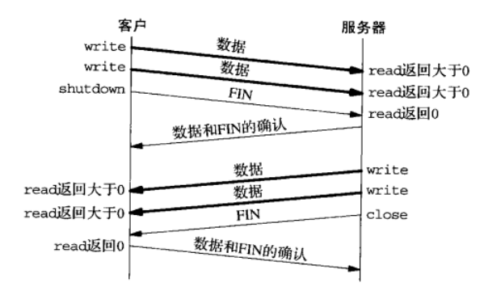
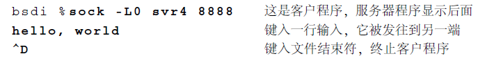
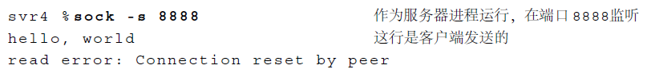
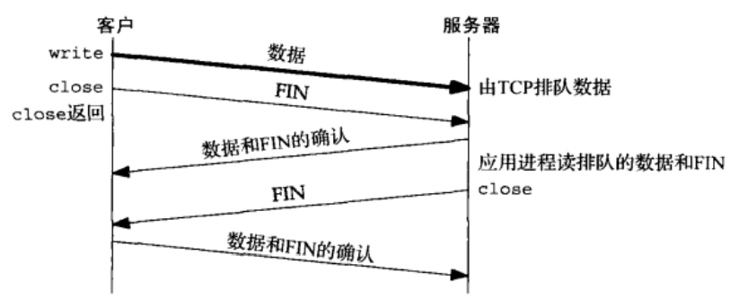
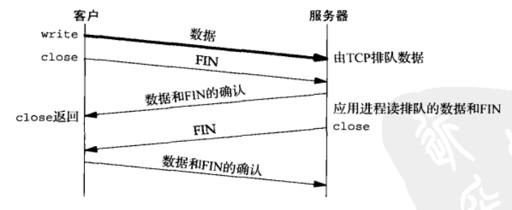
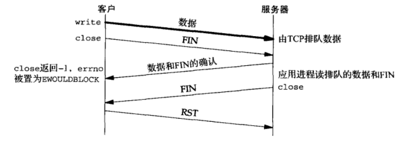
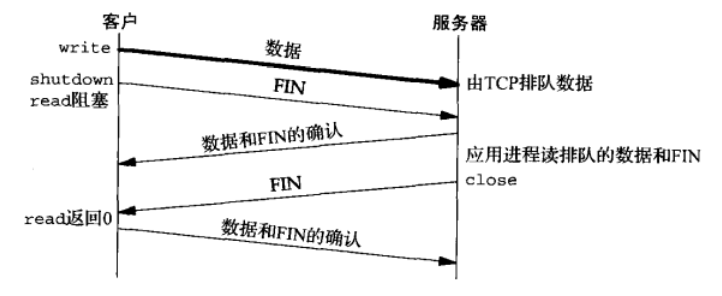

## Socket 的关闭

### 1.close 函数

通常的 Unix close 函数也用来关闭套接字，并终止 TCP 连接。成功返回 0，失败返回 -1。

```c
#include <unistd. h>
int close (int sockfd);
```

close 一个 TCP 套接字的默认行为是把该套接字标记成已关闭，然后立即返回到调用进程。该套接字描述符不能再由调用进程使用，也就是说它不能再作为 read 或 write 的第一个参数。然后 TCP 将尝试发送已排队等待发送到对端的任何数据，发送完毕后发生的是正常的 TCP 连接终止序列。

**在并发服务器中父进程关闭已连接套接字只是导致相应描述符的引用计数值减 1**，而子进程也有对应套接字的描述符。因此套接字引用计数值仍大于 0，这个 close 调用并不引发 TCP 的四分组连接终止序列。对于父进程与子进程共享已连接套接字的并发服务器来说，这正是所期望的。

如果我们确实想在某个 TCP 连接上发送一个 FIN，那么可以改用 shutdouwm 函数以代替 close。

我们还得清楚，如果父进程对每个由 accept 返回的已连接套接字都不调用 close，那么并发服务器中将会发生什么。首先，父进程最终将耗尽可用描述符，因为任何进程在任何时刻可拥有的打开着的描述符数通常是有限制的。不过更重要的是，没有一个客户连接会被终止，因为当子进程关闭已连接套接字时，它的引用计数值将由 2 递减为 1，且保持为 1，因为父进程永不关闭任何已连接套接字。

### 2.shutdown 函数

```c
#include <sys/socket.h>
int shutdown(int sockfd, int howto);
```

终止网络连接的通常方法是调用 close 函数。不过 close 有两个限制，却可以使用 shutdown 来避免。

1. close 把描述符的引用计数减 1，仅在该计数变为 0 时才关闭套接字。**使用 shutdown 可以不管引用计数就激发 TCP 的正常连接终止序列**。
2. close 终止读和写两个方向的数据传送。既然 TCP 连接是全双工的，有时候我们需要告知对端我们己经完成了数据发送，但是仍然可以接受对端发送过来的数据。

`shutdown` 函数的行为依赖于参数 `howto` 的值：

- SHUT_RD：关闭连接的读这一半，套接字接收缓冲区中的现有数据都被丢弃。进程不能再对这样的套接字调用任何读函数。对一个 TCP 套接字这样调用 shutdown 函数后，由该套接字接收的来自对端的任何数据都被确认，然后悄然丢弃。
- SHUT_WR：关闭连接的写这一半，**对于 TCP 套接字， 这称为半关闭 (half-close)。当前留在套接字发送缓冲区中的数据将被发送掉，后跟 TCP 的正常连接终止序列**。我们已经说过，不管套接字描述符的引用计数是否等于 0，这样的写半部关闭照样执行。进程不能再对这样的套接字调用任何写函数。
- SHUT_RDWR：连接的读半部和写半部都关闭一这与调用 shutdown 两次等效，第一次调用指定 SHUT_RD，第二次调用指定 SHUT_WR。

<div align="center">
    
</div>

### 3.SO_LINGER 套接字选项

#### 3.1 SO_LINGER 选项介绍

SO＿LINGER 套接字选项使得我们可以改变 close 默认设置。

前面讨论的连接终止方式都是正常的终止方式：也就是一方发送 FIN，这有时也被称为有序释放（orderly release），因为在所有排队数据都已经发送之后才发送 FIN，正常情况下没有任何数据丢失。**但也有可能发送一个复位报文段而不是 FIN 来中途释放一个连接，这有时也被称为异常释放（abortive release）**。TCP 提供了异常终止一个连接的方法，即给对方发送一个复位报文段。一旦发送了复位报文段，__发送端所有排队等待发送的数据都将被丢弃__。应用程序可以使用 socket 选项 SO_LINGER 来发送复位报文段，以异常终止一个连接。

我们使用 sock 程序可以观察这种异常关闭的过程。我们加上 -L（即开启 SO_LINGER） 选项并将停留时间设为 0。这将导致连接关闭时进行复位而不是正常的 FIN。我们连接到处于服务器上的 sock 程序，并键入一输入行:

<div align="center">
    
</div>

下面是这个例子的 tcpdump 输出显示（在这个图中我们已经删除了所有窗口大小的说明，因为它们与讨论无关）。第 1~3 行显示出建立连接的正常过程，第 4 行发送我们键入的数据行（12 个字符和 Unix 换行符），第 5 行是对收到的数据的确认。第 6 行对应为终止客户程序而键入的文件结束符 (Control D)。由于我们指明使用异常关闭而不是正常关闭（命令行中 的-L0 选项），因此主机 bsdi 端的 TCP 发送一个 RST 而不是通常的 FN。RST 报文段中包含一个序号和确认序号。**需要注意的是 RST 报文段不会导致另一端产生任何响应，即另外一端根本不发送确认**。收到 RST 的一方将终止该连接，并通知应用层连接复位。我们会在服务器上面收到如下的差错信息：

<div align="center">
    
</div>

这个服务器程序从网络中接收数据并将它接收的数据显示到其标准输出上。通常，从它的 TCP 上收到文件结束符后便将结束，**但这里我们看到当收到 RST 时，它产生了一个差错。这个差错正是我们所期待的:连接被对方复位了**。

接下来讲解一下 socket 编程中使用的 close 函数，缺省 close() 的行为是把套接字标记为已关闭，然后立即返回到调用进程，该套接字描述符不能再由调用进程使用。**如果有数据残留在 socket 发送缓冲区中则系统中 TCP 模块将继续发送这些数据给对方，后接 FIN 结束报文**。

而在多进程并发服务器中，父子进程共享着套接字，套接字描述符引用计数记录着共享着的进程个数，当父进程或某一子进程 close 掉套接字时，描述符引用技术会相应的减一，当引用计数仍大于 0 时，这个 close 调用就不会引发 TCP 的四次挥手断连过程。

以上是 close 函数的默认行为，不过我们可以利用 SO_LINGER 选项，将此缺省行为设置为以下两种：

- a：立即关闭该连接，通过发送 RST 分组(而不是用正常的 FIN|ACK|FIN|ACK 四个分组)来关闭该连接。**至于发送缓冲区中如果有未发送完的数据，则丢弃。主动关闭一方的 TCP 状态则跳过 TIME_WAIT，直接进入 CLOSED**。虽然避免了 **`TIME_WAIT`** 状态，然而存在以下可能性：在 2MSL 秒内创建该连接的另一个化身，导致来自刚被终止的连接上的旧的重复分节被不正确地递送到新的化身上。
- b：将连接的关闭设置一个超时。如果 socket 发送缓冲区中仍残留数据，进程进入睡眠，内核进入定时状态去尽量去发送这些数据。**在超时之前，如果所有数据都发送完且被对方确认，内核用正常的 FIN|ACK|FIN|ACK 四个分组来关闭该连接，close() 成功返回**。如果超时之时，数据仍然未能成功发送及被确认，用上述 1 方式（即发送 RST 报文，丢弃发送缓冲区中的数据）来关闭此连接。close() 返回 -1 并设置 **`errno`** 为 **`EWOULDBLOCK`**。

本选项要求在用户进程与内核间传递如下结构，它在头文件＜sys/socket.h＞中定义：

```c
struct linger {
    int l_onoff;   /* 0=off, nonzero=on */
    int l_linger;  /* linger time, POSIX specifies units as seconds */
);
```

- l_onoff 为 0，则该选项关闭，l_linger 的值被忽略，close() 用上述缺省方式关闭连接。
- l_onoff 非 0，l_linger 为 0，close() 用上述 a 方式关闭连接。
- l_onoff 非 0，l_linger 非 0，close() 用上述 b 方式关闭连接。

因此本小节所说的异常关闭连接，就是主动关闭一方调用已经通过 **`SO_LINGER`** 选项设置过得 close 函数，给对方发送 RST 报文，而不是 FIN 报文来关闭一条连接，这种被称为异常关闭。进程关闭 socket 的默认方式是正常关闭，如果需要异常关闭，利用 **`SO_LINGER`** 选项来控制。

#### 3.2 close 返回时机

现在我们需要看看，对于已讨论的各种情况，套接字上的 close 确切来说是什么时候返回的。我们假设客户将数据写到套接字上，然后调用 close。

##### 3.2.1 close 默认行为

<div align="center">
    
</div>

我们假设在客户数据到达时，服务器暂时处于忙状态。那么这些数据由 TCP 加入到服务器的套接字接收缓冲区中。类似地，下一个分节即客户的 FIN 也加入该套接字接收缓冲区中。默认情况下客户的 close 立即返回。如上图所示，客户的 close 可能在服务器读套接字接收缓区中的剩余数据之前就返回。对于服务器主机来说，在服务器应用进程读这些剩余数据之前就崩溃是完全可能的，而且客户应用进程永远不会知道（因为此时客户进程调用 close 关闭了连接，不会再接收到 socket 上的信息）。

##### 3.2.2 l_linger 为正值时 close 的行为

客户可以设置 **`SO_LINGER`** 套接字选项， 指定一个正的延滞时间。这种情况下客户的 close 要到它的数据和 FIN 已被服务器主机的 TCP 确认后才返回，如下图所示：

<div align="center">
    
</div>

然而我们仍然有与 __3.2.1__ 一样的问题：在服务器应用进程读剩余数据之前，服务器主机可能崩溃， 并且客户应用进程永远不会知道。使用 **`l_linger`** 选项只能确保服务器收到了客户端发送的数据（只有接受了 ACK 函数 close 才会返回），但是不能确保服务器应用进程一定会从接收缓冲区中读取数据。当然，不使用 **`l_linger`** 选项的话，连服务器是否接收到发送的数据都无法知道。

更糟糕的是，下图展示了当给 **`SO_LINGER`** 选项设置偏低的延滞时间值时可能发生的现象。

<div align="center">
    
</div>

当设置了 l_linger 不为 0，但是发生了超时现象时，会产生 RST 重置位报文，close 返回 -1，errno 被置为 **`EWOULDBLOCK`**。

这里有一个基本原则：设置 **`SO_LINGER`** 套接字选项后，close 的成功返回只是告诉我们先前发送的数据（和 FIN）已由对端 TCP 确认，而不能告诉我们对端应用进程是否已读取数据。__当然如果不设置该套接字选项，那么我们连对端 TCP 是否确认了数据都不知道__。

##### 3.2.3 shutdown 函数

为了真正让客户知道 __服务器应用进程__ 读取了自己发送的数据，我们可以改为使用 shutdown 方法（第二个参数设置为 SHUT_WR）而不是调用 close（这是因为调用 shutdown 方法之后还可以读取对端发送过来的数据）。然后等待对端 close 连接。如下图所示：

<div align="center">
    
</div>

##### 3.2.4 总结

比较 3.2.2、3.2.3、3.2.4，我们可以看到，当关闭连接的本地端（客户端）时，根据所调用的函数（close 或 shutdown）以及是否设置了 SO_LINGER 套接字选项，可在以下 3 个不同的时机返回：

- close 立即返回，根本不等待（默认状况）。
- close 一直拖延到接收了对于客户端 FIN 的 ACK 才返回。
- 后跟一个 read 调用的 shutdown 一直等到接收了对端的 FIN 才返回。

### 4.close 与 shutdown 内核执行流程

#### 4.1 close 系统调用

在深入 close(fd) 的执行流程之前，我们最好要对套接字的有一个大概的了解，一个套接字在内核是如何创建出来的呢？我们可能经常听说“linux 一切皆文件”，**那么理所当然的套接字 socket 本质也是文件**。当我们在上层使用 socket() 创建了一个套接字对象，**该 socket 结构体内部会持有一个文件的指针**，这点我们可以从内核代码中看出：

```c{.line-numbers}
// net/socket.c
// 创建一个套接字对象
int sock_create(int family, int type, int protocol, struct socket **res)
{
    // 真正创建socket的函数
    // 一个socket会与一个inode关联，而 inode 则是通过 sock_alloc_inode() 分配
    // 内部使用了一个 sock_inode_cachep 分配器，内核会缓存一些inode，不够则调用 ctor 构造inode，可以参见：init_inodecache
	return __sock_create(current->nsproxy->net_ns, family, type, protocol, res, 0);
}

// 给套接字创建文件对象
struct file *sock_alloc_file(struct socket *sock, int flags, const char *dname)
{
	struct file *file;

	if (!dname)
		dname = sock->sk ? sock->sk->sk_prot_creator->name : "";

    // 创建一个文件
	file = alloc_file_pseudo(SOCK_INODE(sock), sock_mnt, dname,
				O_RDWR | (flags & O_NONBLOCK),
				&socket_file_ops);
	if (IS_ERR(file)) {
		sock_release(sock);
		return file;
	}

    // 将文件指针赋值给 sock->file
	sock->file = file; // 注意：在 sock_close 执行完毕后，sock 将不再持有file，即 sock->file = NULL
	file->private_data = sock; // sock指针赋值给 file->private_data，这样 sock 和 file 就相互引用了
	stream_open(SOCK_INODE(sock), file);
	return file;
}

// socket() 系统调用
int __sys_socket(int family, int type, int protocol)
{
	int retval;
	struct socket *sock;
	int flags;

	// balabala...
	retval = sock_create(family, type, protocol, &sock);
	if (retval < 0)
		return retval;

	return sock_map_fd(sock, flags & (O_CLOEXEC | O_NONBLOCK));
}
```

接下来，我们再来通过内核源码来深入分析 close 的流程：

1. 内核将套接字所持有的文件从进程的文件列表中删除，然后将文件引用计数 -1；
2. 若套接字的文件引用计数为 0，则将文件释放流程加入到任务队列，待到进程从内核态返回用户态的时调用；
3. 调用设置在文件上的文件操作回调函数 release，开始进入到套接字的 close 流程；
4. __内核判断接收缓冲区是否还有数据，若有则直接关闭套接字，并向对端发送 RST__；
5. 若接收缓冲区为空，则走正常的关闭流程，__即设置套接字 FIN_WAIT1，并发送 FIN 包__；
6. 套接字与进程上下文分离，并与inode解绑，但是套接字不会在此释放，因为内核可能还需要使用到它；

以下是 linux 内核 close(fd) 调用流程:

```c{.line-numbers}
close_fd(fd) @fs/file.c
    ├─>pick_file(files, fd) @fs/open.c
    └─>filp_close(file, files) @fs/open.c
        └─>fput(file) @fs/file_table.c
            └─>__fput(file) @fs/file_table.c
                └─>sock_close(inode, file) @net/socket.c #本质是调用 file->f_op->release，即 socket_file_ops 结构体对象的 release 方法
                    └─>inet_release(sock) @net/ipv4/af_inet.c #本质是调用 sock->ops->release，即 inet_stream_ops 结构体对象的 release 方法
                        └─>tcp_close(sk, timeout) @net/ipv4/tcp.c #本质是调用 sock->sk->sk_prot->close，即 tcp_prot 结构体对象的 close 方法
```

现在就 close 函数给出以下几点结论：

1.调用 close 并不直接操控套接字，而是通过修改它的引用计数来触发真正的关闭动作；

2.当接收缓冲区没有数据时，调用 close 会走正常的四次挥手流程，对端收到 FIN 后，会给套接字设置 RCV_SHUTDOWN，epoll 则会抛出 EPOLLIN 和 EPOLLRDHUP ；在这种情况下有几点说明（假设 B -> A 发送数据包，A 关闭 socket 套接字）：

   - __A 内核会先设置套接字的状态为 FIN_WAIT_1，然后才尽力将发送缓冲区的数据发送出去，并在最后发出 FIN 包__；
   - 接上，close(fd) 调用返回成功只能表明 FIN 包已经被放入 A 的发送缓冲区，至于对方 B 是否收到是不知道的，需要等待对方的 ACK 包；
   - 在 A 发送的 FIN 包收到确认后，套接字进入 FIN_WAIT2 状态，再收到其他数据包时，则会给对端 B 返回 RST；
   - B 如果收到了 FIN，只能判断对方 A 关闭了发送通道，__至于是使用 close(fd) 还是 shutdown(fd, SHUT_WR)，B 是不知道的__，且 epoll 在水平模式下会不断抛出 EPOLLIN 和 EPOLLRDHUP；
   - 接上，B 再继续调用 write(fd)，依然能返回写入的数据长度，但是接着 epoll 会抛出 EPOLLERR（Broken pipe）、EPOLLHUP，因为已经对 A 发过来的 FIN 进行了确认回复，对方 A 已经处于 FIN_WAIT2 状态，__当 A 再次收到数据包时，会给 B 发送 RST__。
   - **B 再次调用 write(fd)，内核将触发 SIGPIPE 信号**，默认处理该信号的方式是退出进程，因此网络编程中一般都会手动处理该信号；
  
3.当接收缓冲区还有数据时，调用 close 会导致给对端发送 RST，直接重置了链接，没有走正常的四次挥手流程，对端会抛出（Connection reset by peer）、EPOLLHUP、EPOLLRDHUP、EPOLLIN（一次性抛出）；原因如下所示：

> As outlined in RFC 2525, section 2.17, we send a RST here because data was lost. To witness the awful effects of the old behavior of always doing a FIN, run an older 2.1.x kernel or 2.0.x, start a bulk GET in an FTP client, suspend the process, wait for the client to advertise a zero window, then kill -9 the FTP client, wheee…

注意，以上的结论是没有考虑 SO_LINGER 选项。

#### 4.2 shutdown 调用

与 close(fd) 不同的是，shutdown(fd, how) 会直接修改套接字，通过 how 参数可以控制 socket 的发送和接收通道，可以只关闭接收通道，也可以只关闭发送通道，也可以同时关闭接收和发送通道。

我们先说下 SHUT_WR，它与 close(fd) 的处理流程类似，**内核会将 socket 设置为 FIN_WAIT1，然后将发送缓冲区的数据发送出去，并在最后发送 FIN**，对方收到 FIN 后，epoll 会抛出 EPOLLRDHUP（该事件需要注册，表示读通道挂断），且对方调用 read 会返回 0，但是若接收缓冲区不为空时，SHUT_WR 不会像 close 那样引起 RST。

对于 SHUT_RD，**当我们只 SHUT_RD 时，对套接字是没有影响的**（可以查看内核代码 tcp_shutdown 函数），依然可以 read 到数据，不过当缓冲区没有数据时，read 会立即返回 0，即使套接字设置为阻塞，具体可以查看内核的 tcp_recvmsg_locked 函数；**当 SHUT_WR 后再 SHUT_RD，套接字将完全关闭，对方再发送数据会返回 RST**，这与 SHUT_RDWR 的效果是一样的。

关于 how 参数，同样有 3 个结论：

1. 只关闭读通道后的效果。服务端收到链接后每隔 500ms 发送一次数据，客户端则关闭读通道，结果表明客户端依然能收到数据，但 read 会立即返回。
2. 先关闭写通道再关闭读通道。服务器依然间隔 500ms 发送一次数据，客户端延迟 2s 后关闭写通道，然后再等待一段时间关闭读通道，__最后服务端因为收到 RST 重置链接，且再次写入数据时触发 SIGPIPE 信号__。
3. 同时关闭读写通道的效果，最后结果与实验 2 类似。

### 5 shutdown vs close

#### 5.1 What is the issue?

Sometimes, we have to send an unknown amount of data from one location to another. TCP, the reliable Transmission Control Protocol, sounds like it is exactly what we need. From the Linux tcp(7) manpage:

> TCP provides a reliable, stream-oriented, full-duplex connection between two sockets on top of ip(7), for both v4 and v6 versions. TCP guarantees that the data arrives in order and retransmits lost packets. It generates and checks a per-packet checksum to catch transmission errors.

However, when we naively use TCP to just send the data we need to transmit, it often fails to do what we want - with the final kilobytes or sometimes megabytes of data transmitted never arriving.

Let’s say we run the following two programs on two POSIX compliant operating systems, with the intention of sending 1 million bytes from program A to program B (programs can be found here):

A 程序的代码如下所示：

```c
sock = socket(AF_INET, SOCK_STREAM, 0);  
connect(sock, &remote, sizeof(remote));
write(sock, buffer, 1000000);             // returns 1000000
close(sock);
```

B 程序的代码如下所示：

```c
int sock = socket(AF_INET, SOCK_STREAM, 0);
bind(sock, &local, sizeof(local));
listen(sock, 128);
int client=accept(sock, &local, locallen);
write(client, "220 Welcome\r\n", 13);

int bytesRead=0, res;
for(;;) {
  res = read(client, buffer, 4096);
  if(res < 0)  {
      perror("read");
      exit(1);
  }
  if(!res)
      break;
  bytesRead += res;
}
printf("%d\n", bytesRead);
```

Quiz question - what will program B print on completion?

A) 1000000
B) something less than 1000000
C) it will exit reporting an error
D) could be any of the above

The right answer, sadly, is ‘D’. But how could this happen? Program A reported that all data had been sent correctly!

#### 5.2 What is going on

Sending data over a TCP socket really does not offer the same ‘it hit the disk’ semantics as writing to a normal file does (if you remember to call fsync()).

In fact, all a successful write() in the TCP world means is that the kernel has accepted your data, **and will now try to transmit it in its own sweet time**. Even when the kernel feels that the packets carrying your data have been sent, in reality, **they’ve only been handed off to the network adapter**, which might actually even send the packets when it feels like it.

From that point on, the data will traverse many such adapters and queues over the network, until it arrives at the remote host. The kernel there will acknowledge the data on receipt, and if the process that owns the socket is actually paying attention and trying to read from it, the data will finally have arrived at the application, and in filesystem speak, ‘hit the disk’.

Note that the acknowledgment sent out only means the kernel saw the data - it does not mean the application did!（即另外一端返回确认只能说明这些数据到达了本端的内核接收缓冲区中，并不代表被应用程序所读取）。

#### 5.3 OK, I get all that, but why didn’t all data arrive in the example above?

When we issue a close() on a TCP/IP socket, depending on the circumstances, the kernel may do exactly that: close down the socket, and with it the TCP/IP connection that goes with it.

And this does in fact happen - **even though some of your data was still waiting to be sent, or had been sent but not acknowledged**: the kernel can close the whole connection.(close 函数调用后立即返回，并不等待发送缓冲区中的数据全部被发送出去)。

This issue has led to a large number of postings on mailing lists, Usenet and fora, and these all quickly zero in on the SO_LINGER socket option, which appears to have been written with just this issue in mind:

> When enabled, a close(2) or shutdown(2) will not return until all queued messages for the socket have been successfully sent or the linger timeout has been reached. Otherwise, the call returns immediately and the closing is done in the background. When the socket is closed as part of exit(2), it always lingers in the background.

So, we set this option, rerun our program. And it still does not work, not all our million bytes arrive.

#### 5.4 How come?

It turns out that in this case, section 4.2.2.13 of RFC 1122 tells us that a close() with any pending readable data could lead to an immediate reset being sent.

> A host MAY implement a ‘half-duplex’ TCP close sequence, so that an application that has called CLOSE cannot continue to read data from the connection. **_If such a host issues a CLOSE call while received data is still pending in TCP, or if new data is received after CLOSE is called_**, its TCP SHOULD send a RST to show that data was lost.

And in our case, we have such data pending: the “220 Welcome\r\n” we transmitted in program B, but never read in program A!

#### 5.5 So, if we read that data first, and LINGER, are we good to go?

Not really. The close() call really does not convey what we are trying to tell the kernel.正如前面 3.2.2 所说，服务器应用进程读剩余数据之前，服务器主机可能崩溃， 并且客户应用进程永远不会知道。使用 l_linger 选项只能确保服务器收到了客户端发送的数据（只有接受了 ACK 函数 close 才会返回），但是不能确保服务器应用进程一定会从接收缓冲区中读取数据。

因此，这时需要借助 shutdown()，shutdown() 会确实发送一个 FIN 给对方，说明对方也即将关闭 socket，此时可以通过 read() 返回 0（收到 EOF）检测到接受端的关闭。正确的关闭逻辑如下，建议用这种方式代替 SO_LINGER：

**发送方：send() -> shutdown(WR) -> read() == 0（由接收方 close 导致） -> close()**
**接收方：read() == 0（由发送方 shutdown 导致）-> more to send? -> close()**

另外，在使用 python 时，一般先调用 shutdown，再调用 close，原因如下：

Calling close and shutdown have two different effects on the underlying socket.

The first thing to point out is that the socket is a resource in the underlying OS and multiple processes can have a handle for the same underlying socket.

When you call close it decrements the handle count by one and if the handle count has reached zero then the socket and associated connection goes through the normal close procedure (effectively sending a FIN / EOF to the peer) and the socket is deallocated.

The thing to pay attention to here is that if the handle count does not reach zero __because another process still has a handle to the socket then the connection is not closed and the socket is not deallocated__.

On the other hand calling shutdown for reading and writing closes the underlying connection and sends a FIN/EOF to the peer regardless of how many processes have handles to the socket. __However, it does not deallocate the socket and you still need to call close afterward__.

即不管有多少个进程在使用 socket 套接字，先调用 shutdown 都会产生一个 FIN 报文（SHUT_WR、SHUT_RDWR），然后其它的进程将无法进行通信（继续发送数据，会产生 SIGPIPE 错误），但是 shutdown 并不会释放掉 socket 套接字，shutdown 与 socket 描述符没有关系，即使调用 shutdown(fd, SHUT_RDWR) 也不会关闭 fd，最终还需 close(fd)，因此还是需要调用 close。

SO_LINGER 与 close，当 SO_LINGER 选项开启但超时值为 0 时，调用 close 直接发送 RST（这样可以避免进入 TIME_WAIT 状态，但破坏了 TCP 协议的正常工作方式），SO_LINGER 对 shutdown 无影响。

**TCP 连接上出现 RST 与随后可能的 TIME_WAIT 状态没有直接关系，主动发 FIN 包方必然会进入TIME_WAIT 状态，除非不发送 FIN 而直接以发送 RST 结束连接**。

#### 5.6 when to use SO_LINGER option

According to "UNIX Network Programming" third edition page 202-203, setting SO_LINGER with timeout 0 prior to calling close() will cause the normal termination sequence not to be initiated.

**Instead, the peer setting this option and calling close() will send a RST (connection reset)** which indicates an error condition and this is how it will be perceived at the other end. You will typically see errors like "Connection reset by peer".

Therefore, in the normal situation it is a really bad idea to set SO_LINGER with timeout 0 prior to calling close() – from now on called abortive close – in a server application.

However, certain situation warrants doing so anyway:

- If a client of your server application misbehaves (times out, returns invalid data, etc.) an abortive close makes sense to avoid being stuck in CLOSE_WAIT or ending up in the TIME_WAIT state.
- If you must restart your server application which currently has thousands of client connections you might consider setting this socket option to avoid thousands of server sockets in TIME_WAIT (when calling close() from the server end) as this might prevent the server from getting available ports for new client connections after being restarted.

### 6.总结

| 函数      | 说明 |
| :----: | ------ |
| shutdown, SHUT_RD      | 在套接字上不能再发出接收请求；进程仍可往套接字发送数据套接字接收缓冲区中所有数据被丢弃：再接收到的任何数据由 TCP 丢弃；对套接字发送缓冲区没有任何影响。       |
| shutdown, SHUT_WR   | 在套接字上不能再发出发送请求（会产生 SIGPIPE 错误）；进程仍可从套接字接收数据；套接字发送缓冲区中的内容被发送到对端,后跟正常的 TCP 连接终止序列 (即发送 FIN);对套接字接收缓冲区无任何影响。        |
| close, __l_onoff=0(默认情况)__ | 在套接字上不能再发出发送或接收请求：套接字发送缓冲区中的内容被发送到对端。如果描述符引用计数变为 0：__在发送完发送缓冲区中的数据后，跟以正常的 TCP 连接终止序列__（即发送 FIN）；套接字接收缓冲区中内容被丢弃。 |
|close, l_onoff = 1, l_linger = 0| 在套接字上不能再发出发送或接收请求。如果描述符引用计数变为 0：__RST 被发送到对端；连接的状态被置为 CLOSED (没有 TIME_WAIT 状态)__；套接字发送缓冲区和套接字接收缓冲区中的数据被丢弃。|
|close, l_onoff = 1, l_linger != 0| 在套接字上不能再发出发送或接收请求；套接字发送缓冲区中的数据被发送到对端。如果描述符引用计数变为 0：在发送完发送缓冲区中的数据后，跟以正常的 TCP 连接终止序列 (即发送 FIN)；套接字接收缓冲区中数据被丢弃：如果在连接变为 CLOSED 状态前延滞时间到，那么 close 返回 EWOULDBLOCK 错误。|