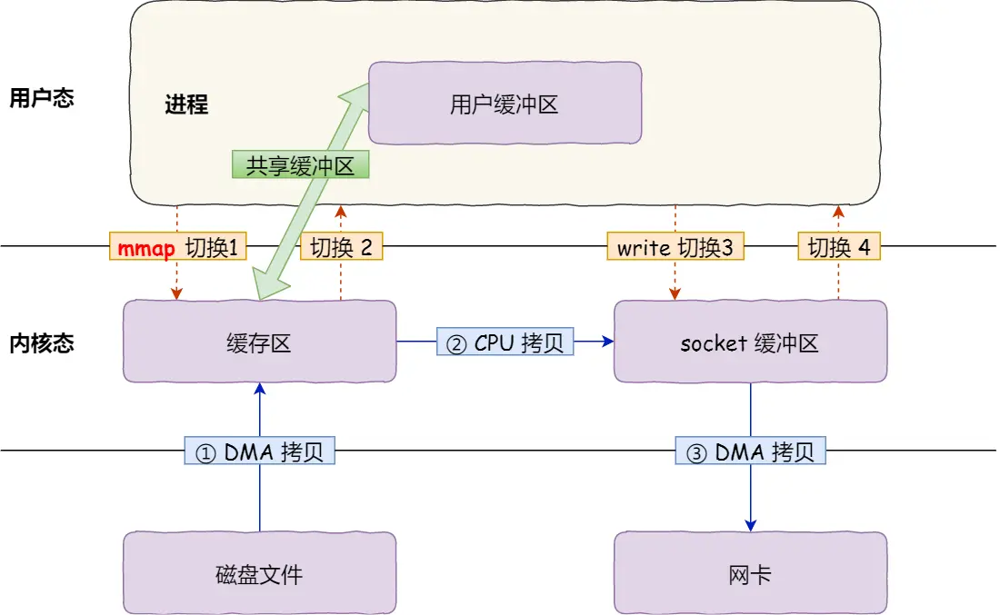
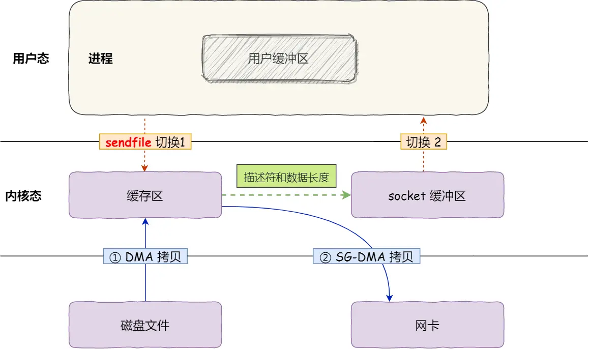

# 零拷贝

## 一、什么是零拷贝

磁盘可以说是计算机系统最慢的硬件之一，读写速度相差内存 10 倍以上，所以针对优化磁盘的技术非常的多，比如零拷贝、直接 I/O、异步 I/O 等等，这些优化的目的就是为了提高系统的吞吐量，另外操作系统内核中的磁盘高速缓存区，可以有效的减少磁盘的访问次数。

这次，我们就以「文件传输」作为切入点，来分析 I/O 工作方式，以及如何优化传输文件的性能。

## 二、为什么要有 DMA 技术

在没有 DMA 技术前，I/O 的过程是这样的：

- CPU 发出对应的指令给磁盘控制器，然后返回；
- 磁盘控制器收到指令后，于是就开始准备数据，会把数据放入到磁盘控制器的内部缓冲区中，然后产生一个中断；
- CPU 收到中断信号后，停下手头的工作，接着把磁盘控制器的缓冲区的数据一次一个字节地读进自己的寄存器，然后再把寄存器里的数据写入到内存，**而在数据传输的期间 CPU 是无法执行其他任务的**。

为了方便你理解，我画了一副图：

<div align="center">
    
</div>

可以看到，整个数据的传输过程，都要需要 CPU 亲自参与搬运数据的过程，而且这个过程，CPU 是不能做其他事情的。简单的搬运几个字符数据那没问题，但是如果我们用千兆网卡或者硬盘传输大量数据的时候，都用 CPU 来搬运的话，肯定忙不过来。

计算机科学家们发现了事情的严重性后，于是就发明了 DMA 技术，**也就是直接内存访问(Direct Memory Access)技术**。

什么是 DMA 技术？简单理解就是，**在进行【I/O 设备】和【内存】的数据传输的时候，数据搬运的工作全部交给 DMA 控制器**，而 CPU 不再参与任何与数据搬运相关的事情，这样 CPU 就可以去处理别的事务。那使用 DMA 控制器进行数据传输的过程究竟是什么样的呢？下面我们来具体看看。

<div align="center">
    
</div>

具体过程：

- 用户进程调用 read 方法，向操作系统发出 I/O 请求，请求读取数据到自己的内存缓冲区中，进程进入阻塞状态；
- 操作系统收到请求后，进一步将 I/O 请求发送 DMA，然后让 CPU 执行其他任务；
- DMA 进一步将 I/O 请求发送给磁盘；
- 磁盘收到 DMA 的 I/O 请求，**把数据从磁盘读取到磁盘控制器的缓冲区中**，当磁盘控制器的缓冲区被读满后，向 DMA 发起中断信号，告知自己缓冲区已满；
- **DMA 收到磁盘的信号，将磁盘控制器缓冲区中的数据拷贝到内核缓冲区中，此时不占用 CPU，CPU 可以执行其他任务**；
- 当 DMA 读取了足够多的数据，就会发送中断信号给 CPU；
- CPU 收到 DMA 的信号，知道数据已经准备好，于是将数据从内核拷贝到用户空间，系统调用返回；

可以看到， **CPU 不再参与「将数据从磁盘控制器缓冲区搬运到内核空间」的工作，这部分工作全程由 DMA 完成**。但是 CPU 在这个过程中也是必不可少的，因为传输什么数据，从哪里传输到哪里，都需要 CPU 来告诉 DMA 控制器。

早期 DMA 只存在在主板上，如今由于 I/O 设备越来越多，数据传输的需求也不尽相同，所以每个 I/O 设备里面都有自己的 DMA 控制器。

### 三、传统的文件传输有多糟糕

如果服务端要提供文件传输的功能，我们能想到的最简单的方式是：将磁盘上的文件读取出来，然后通过网络协议发送给客户端。传统 I/O 的工作方式是，数据读取和写入是从用户空间到内核空间来回复制，而内核空间的数据是通过操作系统层面的 I/O 接口从磁盘读取或写入。

代码通常如下，一般会需要两个系统调用：

```c
read(file, tmp_buf, len);
write(socket, tmp_buf, len);
```

代码很简单，虽然就两行代码，但是这里面发生了不少的事情。

<div align="center">
    
</div>

首先，期间共**发生了 4 次用户态与内核态的上下文切换**，因为发生了两次系统调用，一次是 **`read()`**，一次是 **`write()`**，每次系统调用都得先从用户态切换到内核态，等内核完成任务后，再从内核态切换回用户态。

上下文切换到成本并不小，一次切换需要耗时几十纳秒到几微秒，虽然时间看上去很短，但是在高并发的场景下，这类时间容易被累积和放大，从而影响系统的性能。

其次，**还发生了 4 次数据拷贝，其中两次是 DMA 的拷贝，另外两次则是通过 CPU 拷贝的**，下面说一下这个过程：

- **第一次拷贝**，把磁盘上的数据拷贝到操作系统内核的缓冲区里，这个拷贝的过程是通过 DMA 搬运的。
- **第二次拷贝**，把内核缓冲区的数据拷贝到用户的缓冲区里，于是我们应用程序就可以使用这部分数据了，这个拷贝到过程是由 CPU 完成的。
- **第三次拷贝**，把刚才拷贝到用户的缓冲区里的数据，再拷贝到内核的 socket 的缓冲区里，这个过程依然还是由 CPU 搬运的。
- **第四次拷贝**，把内核的 socket 缓冲区里的数据，拷贝到网卡的缓冲区里，这个过程又是由 DMA 搬运的。

我们回过头看这个文件传输的过程，**_我们只是搬运一份数据，结果却搬运了 4 次_**，过多的数据拷贝无疑会消耗 CPU 资源，大大降低了系统性能。这种简单又传统的文件传输方式，**存在冗余的上文切换和数据拷贝**，在高并发系统里是非常糟糕的，多了很多不必要的开销，会严重影响系统性能。

所以，要想提高文件传输的性能，**就需要减少「用户态与内核态的上下文切换」和「内存拷贝」的次数**。

### 四、如何优化文件传输的性能

**1.先来看看，如何减少「用户态与内核态的上下文切换」的次数呢?**

读取磁盘数据的时候，之所以要发生上下文切换，**这是因为用户空间没有权限操作磁盘或网卡**，内核的权限最高，这些操作设备的过程都需要交由操作系统内核来完成，所以一般要通过内核去完成某些任务的时候，就需要使用操作系统提供的系统调用函数。

而一次系统调用必然会发生 2 次上下文切换：首先从用户态切换到内核态，当内核执行完任务后，再切换回用户态交由进程代码执行。所以，要想减少上下文切换到次数，就要减少系统调用的次数。

**2.如何减少「数据拷贝」的次数?**

在前面我们知道了，传统的文件传输方式会历经 4 次数据拷贝，而且这里面，「从内核的读缓冲区拷贝到用户的缓冲区里，再从用户的缓冲区里拷贝到 socket 的缓冲区里」，这个过程是没有必要的。**因为文件传输的应用场景中，在用户空间我们并不会对数据「再加工」**，所以数据实际上可以不用搬运到用户空间（可以直接从内核读缓冲区转换到 socket 缓冲区中），因此用户的缓冲区是没有必要存在的。

### 五、如何实现零拷贝？

零拷贝技术实现的方式通常有 2 种：

- `mmap + write`：4 次上下文切换以及 3 次数据拷贝
- `sendfile`：2 次上下文切换以及 2 次数据拷贝

下面就谈一谈，它们是如何减少「上下文切换」和「数据拷贝」的次数。

#### 1.mmap + write

在前面我们知道，`read()` 系统调用的过程中会把内核缓冲区的数据拷贝到用户的缓冲区里，于是为了减少这一步开销，我们可以用 `mmap()` 替换 `read()` 系统调用函数。

```c
buf = mmap(file, len);
write(sockfd, buf, len);
```

**`mmap()`** 系统调用函数会直接把**内核缓冲区里的数据「映射」到用户空间**，这样，操作系统内核与用户空间就不需要再进行任何的数据拷贝操作。

<div align="center">
    
</div>

具体过程如下：

- 应用进程调用了 **`mmap()`** 后，DMA 会把磁盘的数据拷贝到内核的缓冲区里。接着，应用进程跟操作系统内核「共享」这个缓冲区；
- 应用进程再调用 **`write()`**，操作系统直接将内核缓冲区的数据拷贝到 socket 缓冲区中，这一切都发生在内核态，由 CPU 来搬运数据；
- 最后，把内核的 socket 缓冲区里的数据，拷贝到网卡的缓冲区里，这个过程是由 DMA 搬运的。

我们可以得知，**通过使用 mmap() 来代替 read()，可以减少一次数据拷贝的过程**。但这还不是最理想的零拷贝，因为仍然需要通过 CPU 把内核缓冲区的数据拷贝到 socket 缓冲区里，**而且仍然需要 4 次上下文切换**，因为系统调用还是 2 次。

#### 2.sendfile

在 Linux 内核版本 2.1 中，提供了一个专门发送文件的系统调用函数 **`sendfile()`**，函数形式如下：

```c
#include <sys/socket.h>
ssize_t sendfile(int out_fd, int in_fd, off_t *offset, size_t count);
```

它的前两个参数分别是**目的端和源端的文件描述符**，后面两个参数是源端的偏移量和复制数据的长度，返回值是实际复制数据的长度。首先，它可以替代前面的 read() 和 write() 这两个系统调用，这样就可以减少一次系统调用，也就减少了 2 次上下文切换的开销。

其次，该系统调用，可以直接把内核缓冲区里的数据拷贝到 socket 缓冲区里，**不再拷贝到用户态，这样就只有 2 次上下文切换，和 3 次数据拷贝**。如下图：

<div align="center">
    
</div>

但是这还不是真正的零拷贝技术，如果网卡支持 SG-DMA（The Scatter-Gather Direct Memory Access）技术（和普通的 DMA 有所不同），**我们可以进一步减少通过 CPU 把内核缓冲区里的数据拷贝到 socket 缓冲区的过程**。你可以在你的 Linux 系统通过下面这个命令，查看网卡是否支持 scatter-gather 特性：

```vb
$ ethtool -k eth0 | grep scatter-gather
scatter-gather: on
```

于是，从 Linux 内核 2.4 版本开始起，对于支持网卡支持 SG-DMA 技术的情况下，**`sendfile()`** 系统调用的过程发生了点变化，具体过程如下：

- 第一步，通过 DMA 将磁盘上的数据拷贝到内核缓冲区里；
- 第二步，缓冲区描述符和数据长度传到 socket 缓冲区，**这样网卡的 SG-DMA 控制器就可以直接将内核缓存中的数据拷贝到网卡的缓冲区里**，此过程不需要将数据从操作系统内核缓冲区拷贝到 socket 缓冲区中，这样就减少了一次数据拷贝；

所以，这个过程之中，只进行了 2 次数据拷贝，如下图：

<div align="center">
    
</div>

这就是所谓的零拷贝（Zero-copy）技术，因为我们没有在内存层面去拷贝数据，也就是说全程没有通过 CPU 来搬运数据，所有的数据都是通过 DMA 来进行传输的。零拷贝技术的文件传输方式相比传统文件传输的方式，减少了 2 次上下文切换和数据拷贝次数，**只需要 2 次上下文切换和 2 次数据拷贝次数，就可以完成文件的传输，而且 2 次的数据拷贝过程，都不需要通过 CPU，2 次都是由 DMA 来搬运**。

所以，总体来看，零拷贝技术可以把文件传输的性能提高至少一倍以上。

### 六、使用零拷贝技术的项目

事实上，Kafka 这个开源项目，就利用了「零拷贝」技术，从而大幅提升了 I/O 的吞吐率，这也是 Kafka 在处理海量数据为什么这么快的原因之一。如果你追溯 Kafka 文件传输的代码，你会发现，最终它调用了 Java NIO 库里的 **`transferTo`** 方法：

```c
@Overridepublic 
long transferFrom(FileChannel fileChannel, long position, long count) throws IOException { 
    return fileChannel.transferTo(position, count, socketChannel);
}
```

如果 Linux 系统支持 **`sendfile()`** 系统调用，那么 **`transferTo()`** 实际上最后就会使用到 **`sendfile()`** 系统调用函数。

曾经有大佬专门写过程序测试过，在同样的硬件条件下，传统文件传输和零拷拷贝文件传输的性能差异，你可以看到下面这张测试数据图，使用了零拷贝能够缩短 65% 的时间，大幅度提升了机器传输数据的吞吐量。

<div align="center">
    
</div>

另外，Nginx 也支持零拷贝技术，一般默认是开启零拷贝技术，这样有利于提高文件传输的效率，是否开启零拷贝技术的配置如下：

```c
http {
...
    sendfile on
...
}
```

sendfile 配置的具体意思:

- 设置为 on 表示，使用零拷贝技术来传输文件：sendfile ，这样只需要 2 次上下文切换，和 2 次数据拷贝。
- 设置为 off 表示，使用传统的文件传输技术：read + write，这时就需要 4 次上下文切换，和 4 次数据拷贝。

当然，要使用 sendfile，Linux 内核版本必须要 2.1 以上的版本。

### 七、PageCache 有什么作用？

回顾前面说道文件传输过程，其中第一步都是先需要先把磁盘文件数据拷贝「内核缓冲区」里，**这个「内核缓冲区」实际上是磁盘高速缓存（PageCache）**。由于零拷贝使用了 PageCache 技术，可以使得零拷贝进一步提升了性能，我们接下来看看 PageCache 是如何做到这一点的。

读写磁盘相比读写内存的速度慢太多了，所以我们应该想办法把「读写磁盘」替换成「读写内存」。于是，我们会通过 DMA 把磁盘里的数据搬运到内存里，这样就可以用读内存替换读磁盘。但是，内存空间远比磁盘要小，内存注定只能拷贝磁盘里的一小部分数据。

那问题来了，选择哪些磁盘数据拷贝到内存呢？我们都知道程序运行的时候，具有「局部性」，所以通常，刚被访问的数据在短时间内再次被访问的概率很高，**于是我们可以用 PageCache 来缓存最近被访问的数据，当空间不足时淘汰最久未被访问的缓存**。

所以，**读磁盘数据的时候，优先在 PageCache 找，如果数据存在则可以直接返回；如果没有，则从磁盘中读取，然后缓存 PageCache 中**。

还有一点，读取磁盘数据的时候，需要找到数据所在的位置，但是对于机械磁盘来说，就是通过磁头旋转到数据所在的扇区，再开始「顺序」读取数据，**但是旋转磁头这个物理动作是非常耗时的，为了降低它的影响，PageCache 使用了「预读功能」**。

比如，假设 read 方法每次只会读 32 KB 的字节，虽然 read 刚开始只会读 0 ～ 32 KB 的字节，但内核会把其后面的 32～64 KB 也读取到 PageCache，这样后面读取 32～64 KB 的成本就很低，如果在 32～64 KB 淘汰出 PageCache 前，进程读取到它了，收益就非常大。