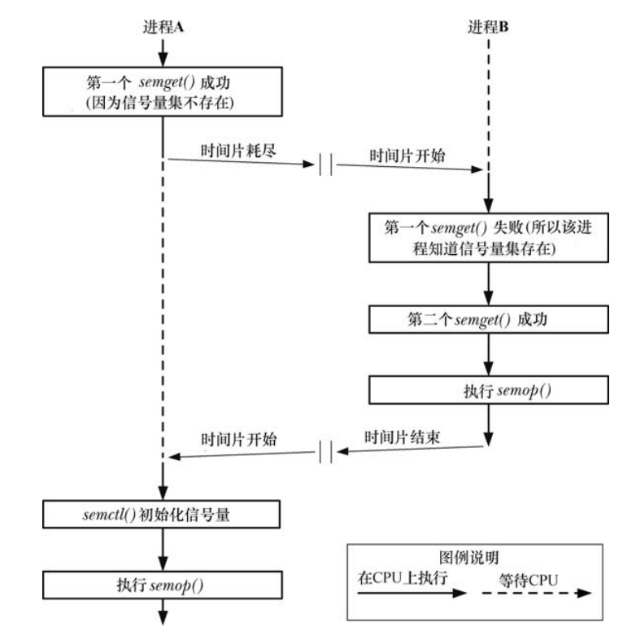

## System V IPC 之信号量

### 1.概述

信号量的一个常见用途是同步对一块共享内存的访问以防止出现一个进程在访问共享内存的同时另一个进程更新这块内存的情况。一个信号量是一个由内核维护的整数，其值被限制为大于或等于 0。在一个信号量上可以执行各种操作（即系统调用），包括：

1. 将信号量设置成一个绝对值；
2. 在信号量当前值的基础上加上一个数量；
3. 在信号量当前值的基础上减去一个数量；
4. 等待信号量的值等于 0

上面操作中的后两个可能会导致调用进程阻塞。当减小一个信号量的值时，内核会将所有试图将信号量值降低到 0 之下的操作阻塞。类似的，如果信号量的当前值不为 0，那么等待信号量的值等于 0 的调用进程将会发生阻塞；阻塞会一直持续到其它进程将信号量的值修改为允许这些操作继续前进，此时内核会唤醒阻塞在该信号量上的进程。

**信号量的意义仅由使用信号量的进程赋予其的关联关系来确定。一般来讲，进程之间会达成协议将一个信号量与一种共享资源关联起来**，如一块共享内存区域。

使用 System V 信号量的常规步骤如下：

- 使用 **`semget()`** 创建或打开一个信号量集。
- 使用 **`semctl()`** **`SETVAL`** 或 **`SETALL`** 操作初始化集合中的信号量（**只有一个进程需要完成这个任务**）。
- 使用 **`semop()`** 操作信号量值。使用信号量的进程通常会使用这些操作来表示一种共享资源的获取和释放。
- 当所有进程都不再需要使用信号量集之后使用 **`semctl()`** **`IPC_RMID`** 操作删除这个集合（**只有一个进程需要完成这个任务**）。

在使用 **`semget()`** 系统调用创建集合的时候需要指定集合中的信号量数量。虽然在同一时刻通常只操作一个信号量，但通过 **`semop()`** 系统调用可以原子地在同一个集合中的多个信号量之上执行一组操作。

下面的程序是使用信号量 api 的一个例子。下面的程序在两种模式下运行：

- 当在命令行参数中传入一个整数时程序会创建一个**只包含一个信号量的新信号量集**并将信号量值初始化为通过命令行参数传入的值；
- 当在命令行参数中传入两个整数时程序会将它们看成是（按照顺序）一个**既有信号量集的标识符**和一个将被加到集合中第一个信号量（序号为 0）上的值。程序会在该信号量上执行指定的操作；

```c{.line-numbers}
int main(int argc, char* argv[]) {

    int semid;
    if (argc == 2) {
        /* create and initialize semaphore */
        union semun arg;
        semid = semget(IPC_PRIVATE, 1, S_IRUSR | S_IWUSR);
        if (semid == -1) {
            err_exit("semid");
        }
        arg.val = getInt(argv[1], 0, "init-value");
        if (semctl(semid, 0, SETVAL, arg) == -1)
            err_exit("semctl");
        printf("semaphore id = %d\n", semid);
    } else {
        /* Structure defining operation */
        struct sembuf sop;
        /* No special options for operation */
        sop.sem_flg = 0;
        /* Specifies first semaphore in set */
        sop.sem_num = 0;
        /* Add, subtract, or wait for 0 */
        sop.sem_op = getInt(argv[2], 0, "operation");
        semid = getInt(argv[1], 0, "semid");
        printf("%ld: about to semop at %s\n", (long) getpid(), curr_time("%T"));
        // 执行对信号量的操作
        if (semop(semid, &sop, 1) == -1)
            err_exit("semop");
        printf("%ld: semop completed at %s\n", (long) getpid(), curr_time("%T"));
    }

    exit(EXIT_SUCCESS);
}
```

下面是程序的运行结果，进程 A 创建一个信号量（值为 0），然后将信号量的值减 2，此时进程 A 会阻塞在信号量上；之后进程 B 会将信号量的值增加 3，这个操作会立即完成，同时进程 A 被唤醒继续执行。

```shell{.line-numbers}
# 进程 A
xuweilin@xvm:~/CLionProjects/http_parser$ ./svsem_demo 0
semaphore id = 0
xuweilin@xvm:~/CLionProjects/http_parser$ ./svsem_demo 0 -2
3056: about to semop at 22:02:08
3056: semop completed at 22:02:20

# 进程 B
xuweilin@xvm:~/CLionProjects/http_parser$ ./svsem_demo 0 3
3071: about to semop at 22:02:20
3071: semop completed at 22:02:20
```

### 2.创建或打开一个信号量集

semget() 系统调用创建一个新信号量集或获取一个既有集合的标识符。

```c{.line-numbers}
#include <sys/sem.h>
/* returns semaphore set identifier on success, or -1 on error */
int semget(key_t key, int nsems, int semflg);
```

key 参数的值通常是 **`IPC_PRIVATE`** 或由 **`ftok()`** 返回的键。如果使用 **`semget()`** 创建一个新信号量集，那么 nsems 会指定集合中信号量的数量，并且其值必须大于 0。如果使用 **`semget()`** 来获取一个既有集的标识符，那么 nsems 必须要小于或等于集合的大小（否则会发生 **`EINVAL`** 错误）。**无法修改一个既有集中的信号量数量**。

semflg 表示施加于新信号量集之上的权限或需检查的一个既有集合的权限：

- **`IPC_CREAT`**：如果不存在与指定的 key 相关联的信号量集，那么就创建一个新集合；
- **`IPC_EXCL`**：如果同时指定了 **`IPC_CREAT`** 并且与指定的 key 关联的信号量集已经存在，那么返回 **`EEXIST`** 错误；

semget() 在成功时会返回新信号量集或既有信号量集的标识符。**后续引用单个信号量的系统调用必须要同时指定信号量集标识符和信号量在集合中的序号**。一个集合中的信号量从 0 开始计数。

### 3.信号量控制操作

semctl() 系统调用在一个信号量集或集合中的单个信号量上执行各种控制操作。

```c{.line-numbers}
#include <sys/sem.h>
/* returns nonnegative integer on success; returns -1 on error */
int semctl(int semid, int semnum, int cmd, ... /*union semun arg*/);
```

semid 参数是操作所施加的信号量集的标识符。对于那些在单个信号量上执行的操作，semnum 参数标识出了集合中的具体信号量。对于其他操作则会忽略这个参数，并且可以将其设置为 0。cmd 参数指定了需执行的操作。一些特定的操作需要向 **`semctl()`** 传入第四个参数，即 **`union semun arg`**，在程序中必须要显式地定义这个 union。

```c{.line-numbers}
#ifndef _SEMUN_H
#define _SEMUN_H

#include <sys/sem.h>

union semun {
    int val;
    struct semid_ds* buf;
    unsigned short* array;
#if defined(__linux__)
    struct seminfo* __buf;
#endif
};

#endif //_SEMUN_H
```

下面详解介绍 cmd 可以指定的各种控制操作：

1) **常规控制操作**

下面的所有这些操作都是针对信号量集整体，因此会忽略 semnum 参数。

- **`IPC_RMID`**：立即删除信号量集及其关联的 semid_ds 数据结构。**所有因在 **`semop()`** 调用中等待这个集合中的信号量而阻塞的进程都会立即被唤醒**，**`semop()`** 会报告错误 **`EIDRM`**。这个操作无需 arg 参数；
- **`IPC_STAT`**：在 arg.buf 指向的缓冲器中放置一份与这个信号量集相关联的 semid_ds 数据结构的副本；
- **`IPC_SET`**：使用 arg.buf 指向的缓冲器中的值来更新与这个信号量集相关联的 semid_ds 数据结构中选中的字段。

2) **获取和初始化信号量值**

下面的操作可以获取或初始化一个集合中的单个或所有信号量的值。**获取一个信号量的值需具备在信号量上的读权限，而初始化该值则需要修改（写）权限**。

- **`GETVAL`**：**`semctl()`** 返回由 semid 指定的信号量集中第 semnum 个信号量的值。这个操作无需 arg 参数。
- **`SETVAL`**：将由 semid 指定的信号量集中第 semnum 个信号量的值初始化为 **`arg.val`**。
- **`GETALL`**：获取由 semid 指向的信号量集中所有信号量的值并将它们放在 **`arg.array`** 指向的数组中。（通过由 **`IPC_STAT`** 操作返回的 semid_ds 数据结构中的 sem_nsems 字段可以获取集合中的信号量数量）这个操作将忽略 semnum 参数。
- **`SETALL`**：使用 **`arg.array`** 指向的数组中的值初始化 semid 指向的集合中的所有信号量。这个操作将忽略 semnum 参数。如果存在一个进程正在等待在由 **`SETVAL`** 或 **`SETALL`** 操作所修改的信号量上执行一个操作**并且对信号量所做的变更将允许该操作继续向前执行**，**那么内核就会唤醒该进程**。

> 使用或 **`SETALL`** 修改一个信号量的值会在所有进程中清除该信号量的撤销条目（**`SEM_UNDO`**）。

3) **获取单个信号量的值**

下面的操作返回（通过函数结果值）semid 引用的集合中第 **`semnum`** 个信号量的信息。所有这些操作都需要在信号量集合中具备读权限。并且无需 arg 参数。

- **`GETPID`**：返回上一个在该信号量上执行 **`semop()`** 的进程的进程 ID；这个值被称为 sempid 值。如果还没有进程在该信号量上执行过 **`semop()`**，那么就返回 0；
- **`GETNCNT`**：返回当前等待该信号量的值增长的进程数（执行信号量减操作而阻塞在信号量上的进程数）；这个值被称为 **`semncnt`** 值；
- **`GETZCNT`**：返回当前等待该信号量的值变成 0 的进程数；这个值被称为 **`semzcnt`** 值；

### 4.信号量关联的数据结构

每个信号量集都有一个关联的 semid_ds 数据结构，其形式如下所示：

```c{.line-numbers}
#include <sys/sem.h>

struct semid_ds{
    /* ownership and permissions */
    struct ipc_perm sem_perm;
    /* number of semaphores in set */
    u_short sem_nsems;
    /* time of last semop() */
    time_t sem_otime;
    /* time of last change */
    time_t sem_ctime;
};
```

各种信号量系统调用会隐式地更新 semid_ds 结构中的字段，使用 semctl() **`IPC_SET`** 操作能够显式地更新 sem_perm 字段中的特定子字段。

- **`sem_otime`**：在创建信号量集时会将这个字段设置为 0，然后在每次成功的 semop() 调用**或当信号量值因 `SEM_UNDO` 操作而发生变更时将这个字段设置为当前时间**；
- **`sem_ctime`**：在创建信号量时以及每个成功的 **`IPC_SET`**、**`SETALL`** 和 **`SETVAL`** 操作执行完毕之后将这个字段设置为当前时间；
- **`sem_nsems`**：在创建集合时将这个字段的值初始化为集合中信号量的数量；

下面是使用 semctl 函数的两个小程序，第一个程序是 svsem_mon.c，这个程序首先显示了 semid_ds 数据结构中的时间字段，然后显示了集合中各个信号量的当前值及其 sempid、semncnt 和 semzcnt 值。

```c{.line-numbers}
int main(int argc, char* argv[]) {

    struct semid_ds ds;
    union semun arg, dummy;
    int sem_id, j;

    sem_id = getInt(argv[1], 0, "sem-id");
    arg.buf = &ds;
    if (semctl(sem_id, 0, IPC_STAT, arg) == -1)
        err_exit("semctl");
    
    /* 显示 semid_ds 数据结构中的时间字段 */
    printf("semaphore changed: %s", ctime(&ds.sem_ctime));
    printf("last semop(): %s", ctime(&ds.sem_otime));

    /* display per-semaphore information */
    arg.array = calloc(ds.sem_nsems, sizeof(arg.array[0]));
    if (arg.array == NULL)
        err_exit("calloc");
    /* 获取信号量集中的所有信号量的值 */
    if (semctl(sem_id, 0, GETALL, arg) == -1)
        err_exit("semctl-GETALL");

    printf("Sem  #  Value   SEMPID   SEMNCNT   SEMZCNT\n");

    /* 获取信号量的 semncnt、semzcnt 值 */
    for (j = 0; j < ds.sem_nsems; j++) {
        printf("%3d   %5d     %5d     %5d     %5d\n",j, arg.array[j],
               semctl(sem_id, j, GETPID, dummy),
               semctl(sem_id, j, GETNCNT, dummy),
               semctl(sem_id, j, GETZCNT, dummy));
    }

    exit(EXIT_SUCCESS);
}
```

第二个程序是初始化一个信号量集中的所有信号量，第一个命令行参数是待初始化的信号量集的标识符。剩下的命令行参数指定了每个信号量所初始化的值（参数的数量必须要与集合中信号量的数量一致）。

```c{.line-numbers}
int main(int argc, char* argv[]) {

    struct semid_ds ds;
    union semun arg;
    int j, sem_id;

    sem_id = getInt(argv[1], 0, "sem-id");

    /* 获取信号量集的大小 */
    arg.buf = &ds;
    if (semctl(sem_id, 0, IPC_STAT, arg) == -1)
        err_exit("semctl");

    if (ds.sem_nsems != argc - 2)
        err_exit("number of semaphores in set are not equal to the values supplied in cmd");

    /* set up array of values; perform semaphore initialization */
    arg.array = calloc(ds.sem_nsems, sizeof(arg.array[0]));
    if (arg.array == NULL)
        err_exit("calloc");
    /* 将命令行中的信号量参数赋值给 arg.array 数组 */
    for (j = 2; j < argc; j++)
        arg.array[j - 2] = getInt(argv[j], 0, "val");
    /* 设置信号量集中每个信号量的值 */
    if (semctl(sem_id, 0, SETALL, arg) == -1)
        err_exit("semctl-SETALL");

    printf("semaphore values changed (PID=%ld)\n", (long) getpid());

    exit(EXIT_SUCCESS);
}
```

### 5.信号量的初始化

根据 SUSv3 的要求，实现无需对由 **`semget()`** 创建的集合中的信号量值进行初始化。**相反，程序员必须要使用 **`semctl()`** 系统调用显式地初始化信号量（cmd 参数为 SETALL）**。（在 Linux 上，**`semget()`** 返回的信号量实际上会被初始化为 0，但为取得移植性就不能依赖于此）。由于信号量集的创建和初始化是分开的单独操作，而不是单个原子操作使得有可能出现进程之间的竞态条件（race condition）。

假设一个应用程序由多个地位平等的进程构成，这些进程使用一个信号量来协调相互之间的动作。由于无法保证哪个进程会首先使用信号量（这就是地位平等的含义），**因此每个进程都必须要做好在信号量不存在时创建和初始化信号量的准备**。下面就是错误初始化的一个例子：

```c{.line-numbers}
semid = semget(key, 1, IPC_CREAT | IPC_EXCL | perms);

/* Successfully created the semaphore */
if (semid != -1) {                  
    union semun arg;
    /* XXXX */
    arg.val = 0;                   
    if (semctl(semid, 0, SETVAL, arg) == -1)
        errExit("semctl");
} else {
    /* We didn't create semaphore set */                            
    if (errno != EEXIST) {
        /* Unexpected error from semget() */          
        errExit("semget 1");
    } else {
        /* Someone else already created it, so just get ID */                        
        semid = semget(key, 1, perms);      
        if (semid == -1)
            errExit("semget 2");
    }
}

/* Now perform some operation on the semaphore */
sops[0].sem_op = 1;        
/* ... to semaphore 0 */
sops[0].sem_num = 0;        
sops[0].sem_flg = 0;
if (semop(semid, sops, 1) == -1)
    errExit("semop");
```

在上面的程序中，有可能出现下图中所示的竞态条件，下面的 race condition 存在两个问题，首先是进程 B 在一个未初始化的信号量（即其值是一个任意值）上执行了一个 semop()。其次，进程 A 中的 semctl() 调用覆盖了进程 B 所做出的变更。

所谓覆盖即 A 进程和 B 进程原本都需要在信号量上执行加一操作，但是 B 进程在未初始化的信号量上执行了加一操作以后，A 进程重置了信号量的值，然后执行加一操作。本来加 2 操作，现在变成了加 1 操作。

<div align="center">
    
</div>

这个问题的解决方案依赖于一个现已成为标准的特性，在一个信号量集首次被创建时，**`sem_otime`** 字段会被初始化为 0，并且只有后续的 **`semop()`** 调用才会修改这个字段的值。因此可以利用这个 **`sem_otime`** 作为一个进程完成创建、初始化信号量集及 **`semop()`** 操作的标志位来消除上面描述的竞争条件。

即只需要强制没有创建信号量的那个进程等待**直到第一个进程既初始化了信号量又执行了一个更新 **`sem_otime`** 字段但不修改信号量的值的 **`semop()`** 调用为止**。

```c{.line-numbers}
semid = semget(key, 1, IPC_CREAT | IPC_EXCL | perms);

if (semid != -1) {                  /* Successfully created the semaphore */
    union semun arg;
    struct sembuf sop;

    sleep(5);
    printf("%ld: created semaphore\n", (long) getpid());

    arg.val = 0;                    /* So initialize it to 0 */
    if (semctl(semid, 0, SETVAL, arg) == -1)
        errExit("semctl 1");
    printf("%ld: initialized semaphore\n", (long) getpid());

    /* Perform a "no-op" semaphore operation - changes sem_otime so other processes can see we've initialized the set. */
    /* Operate on semaphore 0 */
    sop.sem_num = 0;               
    /* Wait for value to equal 0 */ 
    sop.sem_op = 0;                
    sop.sem_flg = 0;
    if (semop(semid, &sop, 1) == -1)
        errExit("semop");
    printf("%ld: completed dummy semop()\n", (long) getpid());

/* We didn't create the semaphore set */
} else {                            
    /* Unexpected error from semget() */
    if (errno != EEXIST) {          
        errExit("semget 1");
    /* Someone else already created it */
    } else {                        
        const int MAX_TRIES = 10;
        int j;
        union semun arg;
        struct semid_ds ds;

        semid = semget(key, 1, perms);      
        if (semid == -1)
            errExit("semget 2");

        printf("%ld: got semaphore key\n", (long) getpid());
        /* Wait until another process has called semop() */

        arg.buf = &ds;
        /* 不断循环，直到检测到 ds.sem_otime 标志位不为 0 */
        for (j = 0; j < MAX_TRIES; j++) {
            printf("Try %d\n", j);
            if (semctl(semid, 0, IPC_STAT, arg) == -1)
                errExit("semctl 2");

            /* Semop() performed? Yes, quit loop */
            if (ds.sem_otime != 0)          
                break;                      、
            /* If not, wait and retry */
            sleep(1);                       
        }

        /* Loop ran to completion! */
        if (ds.sem_otime == 0)              
            fatal("Existing semaphore not initialized");
    }
}

/* Now perform some operation on the semaphore */
sops[0].sem_num = 0;                        
sops[0].sem_op = getInt(argv[1], 0, "sem-op");
sops[0].sem_flg = 0;
if (semop(semid, sops, 1) == -1)
    errExit("semop");
```

### 6.信号量操作

**`semop()`** 系统调用在 semid 标识的信号量集中的信号量上执行一个或多个操作。

```c{.line-numbers}
#include <sys/sem.h>
/* returns 0 on success, or -1 on error */
int semop(int semid, struct sembuf* sops, unsigned int nsops);
```

sops 参数是一个指向数组的指针，数组中包含了需要执行的操作，nsops 参数给出了数组的大小（数组至少需包含一个元素）。**操作将会按照在数组中的顺序以原子的方式被执行**。sops 数组中的元素是形式如下的结构。

```c{.line-numbers}
struct sembuf {
    /* semaphore number */
    unsigned short sem_num;
    /* operation to be performed */
    short sem_op;
    /* operation flags (IPC_NOWAIT and SEM_UNDO) */
    short sem_flg;
}
```

**`sem_num`** 字段标识出了在集合中的哪个信号量上执行操作。**`sem_op`** 字段指定了需执行的操作：

- 如果 **`sem_op`** 大于 0，那么就将 **`sem_op`** 的值加到信号量值上，其结果是其他等待减小信号量值的进程可能会被唤醒并执行它们的操作；
-  如果 sem_op 等于 0，那么就对信号量值进行检查以确定它当前是否等于 0。**如果等于 0，那么操作将立即结束**，否则 **`semop()`** 就会阻塞直到信号量值变成 0 为止；
-  如果 **`sem_op`** 小于 0，那么就将信号量值减去 **`sem_op`**。如果信号量的当前值大于或等于 **`sem_op`** 的绝对值，那么操作会立即结束。否则 **`semop()`** 会阻塞直到信号量值增长到在执行操作之后不会导致出现负值的情况为止；

从语义上来讲，**增加信号量值对应于使一种资源变得可用以便其他进程可以使用它，而减小信号量值则对应于预留（互斥地）进程需使用的资源**。在减小一个信号量值时，如果信号量的值太低——即其他一些进程已经预留了这个资源——那么操作就会被阻塞。

当 semop() 调用阻塞时，进程会保持阻塞直到发生下列某种情况为止：

- 另一个进程修改了信号量值使得待执行的操作能够继续向前；
- **一个信号中断了 semop() 调用。发生这种情况时会返回 **`EINTR`** 错误**；
- 另一个进程删除了semid 引用的信号量。发生这种情况时 semop() 会返回 **`EIDRM`** 错误；

在特定信号量上执行一个操作时可以通过在相应的 sem_flg 字段中指定 **`IPC_NOWAIT`** 标记来防止 **`semop()`** 阻塞。此时，如果 **`semop()`** 本来要发生阻塞的话就会返回 **`EAGAIN`** 错误。这里需要指出的关键一点是这组操作的执行是原子的，**即 `semop()` 要么立即执行所有操作，要么就阻塞直到能够同时执行所有操作**。

下面演示了如何使用 semop() 在一个集合中的三个信号量上执行操作：

```c{.line-numbers}
struct sembuf sops[3];

/* 将第 0 个信号量的值减 1 */
sops[0].sem_num = 0;
sops[0].sem_op = -1;
sops[0].sem_flg = 0;

/* 将第 1 个信号量的值增加 1 */
sops[1].sem_num = 1;
sops[1].sem_op = 2;
sops[1].sem_flg = 0;

/* 等待第 2 个信号量的值变为 0 */
sops[2].sem_num = 2;
sops[2].sem_op = 0;
/* but don't block if operation can't be performed immediately */
sops[2].sem_flg = IPC_NOWAIT;

if (semop(semid, sops, 3) == -1) {
    if (errno == EAGAIN) 
        printf("operation would have blocked\n");
    else 
        errExit("semop");
}
```

如果无法立即执行在信号量 0 上的操作，那么后续所有请求的操作都不会被执行，**`semop()`** 会被阻塞。另一方面，如果可以立即执行在信号量 0 上的操作，但无法立即执行在信号量 2 上的操作，由于信号量 2 上的操作标志位指定了 **`IPC_NOWAIT`** 标记，**因此所有请求的操作都不会被执行（前面可以在信号量 0 上执行的操作也不会被执行）**，并且 **`semop()`** 会立即返回 **`EAGAIN`** 错误。

> 不管是否设置了 **`IPC_NOWAIT`** 标记，这组操作的执行都是原子的，即要么都执行，要么都不执行。只不过，如果当无法立即执行的信号量上设置了 **`IPC_NOWAIT`** 标记，那么 semop 函数直接返回 **`EAGAIN`**，如果没有设置此标志位，那么会 semop 函数会直接阻塞。

下面介绍一个程序实例，这个程序接收的第一个参数是操作所施加的信号量集的标识符。剩余的命令行参数指定了在单个 **`semop()`** 调用中需要执行的一组信号量操作。单个 **`semop()`** 调用中的操作使用逗号分隔。每个操作的形式为下面中的一个：

- **`semnum+value`**：将 value 加到第 semnum 个信号量上；
- **`semnum-value`**：从第 semnum 个信号量上减去 value；
- **`semnum=0`**：测试第 semnum 信号量以确定它是否等于 0；

在每个操作的最后可以可选地包含一个 n、一个 u 或同时包含两者。字母 n 表示在这个操作的 **`sem_flg`** 值中包含 **`IPC_NOWAIT`**。字母 u 表示在 **`sem_flg`** 中包含 **`SEM_UNDO`**。

比如下面的命令行在标识符为 0 的信号量集上执行了两个 semop() 调用：

```shell
./svsem_op 0 0=0 0-1,1-2n
```

第一个命令行参数规定 **`semop()`** 调用等待直到第一个信号量值等于 0 为止。第二个参数规定 **`semop()`** 调用从信号量 0 中减去 1 以及从信号量 1 中减去 2。信号量 0 上的操作的 **`sem_flg`** 为 0，信号量 1 上的操作的 **`sem_flg`** 是 **`IPC_NOWAIT`**。

首先介绍 svsem_create.c 程序，如下所示：

```c{.line-numbers}
#include <stdio.h>
#include "sys/sem.h"
#include "../curr_time.h"
#include <unistd.h>
#include <stdlib.h>
#include "string.h"
#include <sys/stat.h>

static void usageError(const char *progName, const char *msg) {
    
    if (msg != NULL)
        fprintf(stderr, "%s", msg);
    
    fprintf(stderr, "Usage: %s [-cx] {-f pathname | -k key | -p} num-sems [octal-perms]\n", progName);
    fprintf(stderr, "    -c           Use IPC_CREAT flag\n");
    fprintf(stderr, "    -x           Use IPC_EXCL flag\n");
    fprintf(stderr, "    -f pathname  Generate key using ftok()\n");
    fprintf(stderr, "    -k key       Use 'key' as key\n");
    fprintf(stderr, "    -p           Use IPC_PRIVATE key\n");
    exit(EXIT_FAILURE);
    
}

int main(int argc, char* argv[]) {

    /* Parse command-line options and arguments */

    /* Counts -f, -k, and -p options */
    int num_key_flags = 0;        
    int flags = 0;
    long lkey;
    key_t key;
    int opt;

    /*
     * optstring 是可以处理选项字母组成的字符串。该字串里的每个字符对应于一个以 ‘-’ 开头的选项。
     * 如果该字串里的任一字符后面有冒号，那么这个选项就要求有参数（如“hd:”对应于 '-h' 和 '-d'，
     * 其中 '-d' 后需接参数）。而如果选项后面接两个冒号，则说明这个选项后的参数是可选的，即可带参数也可不带参数。
     * ./svsem_create -c -x -f file_path 3
     */
    while ((opt = getopt(argc, argv, "cf:k:px")) != -1) {
        switch (opt) {
            /* -c means IPC_CREAT */
            case 'c':
                flags |= IPC_CREAT;
                break;
            
            /* -f pathname */    
            case 'f':               
                key = ftok(optarg, 1);
                if (key == -1)
                    err_exit("ftok");
                num_key_flags++;
                break;
                
            /* -k key (octal, decimal or hexadecimal) */    
            case 'k':              
                if (sscanf(optarg, "%li", &lkey) != 1)
                    err_exit("-k option requires a numeric argument\n");
                key = lkey;
                num_key_flags++;
                break;

            /* -p means IPC_PRIVATE */
            case 'p':
                key = IPC_PRIVATE;
                num_key_flags++;
                break;

            /* -x means IPC_EXCL */
            case 'x':
                flags |= IPC_EXCL;
                break;

            default:
                usageError(argv[0], NULL);
        }
    }

    /*
     * -x 与 -c 表示的是 semget 函数调用时指定的 flags 选项
     * -p、-k 与 -f 表示的是 semget 函数调用时，指定的 key，根据这个 key 会生成信号量的标识符，每次这三个选项被调用，那么
     * num_key_flags 的值都会增加 1，这三个选项能且只能调用 1 次。
     */
    if (num_key_flags != 1)
        usageError(argv[0], "Exactly one of the options -f, -k, or -p must be supplied\n");

    if (optind >= argc)
        usageError(argv[0], "Must specify number of semaphores\n");

    int num_sems = getInt(argv[optind], 0, "num_sems");
    unsigned int perms = (argc <= optind + 1) ? (S_IRUSR | S_IWUSR) : getInt(argv[optind + 1], GN_BASE_8, "octal-perms");
    int semid = semget(key, num_sems, flags | perms);
    if (semid == -1)
        err_exit("semget");

    /* On success, display semaphore set ID */
    printf("%d\n", semid);      
    exit(EXIT_SUCCESS);
}
```

接下来介绍 svsem_rm.c，代码如下所示，以上两个函数均会使用到。

```c{.line-numbers}
#include <sys/sem.h>
#include "semun.h"
#include "../get_num.h"

int main(int argc, char *argv[]) {

    union semun dummy;
    for (int j = 1; j < argc; j++)
        if (semctl(getInt(argv[j], 0, "semid"), 0, IPC_RMID, dummy) == -1)
            err_exit("semctl");

    exit(EXIT_SUCCESS);
}
```


```c{.line-numbers}
#include <stdio.h>
#include "sys/types.h"
#include "sys/sem.h"
#include "ctype.h"
#include "../curr_time.h"
#include <unistd.h>
#include <stdlib.h>
#include "string.h"

/* Maximum operations that we permit for a single semop() */
#define MAX_SEMOPS 1000

static void usageError(const char* prog_name) {
    fprintf(stderr, "Usage: %s semid op[,op...] ...\n\n", prog_name);
    fprintf(stderr, "'op' is either: <sem#>{+|-}<value>[n][u]\n");
    /* no SEM_UNDO for <sem#>=0 */
    fprintf(stderr, "            or: <sem#>=0[n]\n");
    fprintf(stderr, "          \"n\" means include IPC_NOWAIT in 'op'\n");
    fprintf(stderr, "          \"u\" means include SEM_UNDO in 'op'\n\n");
    fprintf(stderr, "The operations in each argument are performed in a single semop() call\n\n");
    fprintf(stderr, "e.g.: %s 12345 0+1,1-2un\n", prog_name);
    fprintf(stderr, "      %s 12345 0=0n 1+1,2-1u 1=0\n", prog_name);
    exit(EXIT_FAILURE);
}

/*
 * Parse comma-delimited operations in 'arg', returning them in the array 'sops'.Return number of operations as function result.
 * 在命令行参数中解析单个 semop() 调用中用 , 分隔的操作，例如 ./svsem_op 0 0=0 0-1,1-2n 命令中的 0=0 及 0-1,1-2n 两个参数会分别被送到
 * parseOps 函数中进行解析
 */
static int parseOps(char* arg, struct sembuf sops[]) {
    char* comma, *sign, *remaining, *flags;
    /* number of operations in 'arg' */
    int num_ops;

    for (num_ops = 0, remaining = arg;; num_ops++) {
        /* 最多能够解析的操作数目是 1000 条 */
        if (num_ops >= MAX_SEMOPS) {
            fprintf(stderr, "too many operations (maximum=%d): \"%s\"\n", MAX_SEMOPS, arg);
            exit(EXIT_FAILURE);
        }

        if (*remaining == '\0') {
            fprintf(stderr, "tailing comma or empty argument: \"%s\"\n", arg);
            exit(EXIT_FAILURE);
        }
        if (!isdigit((unsigned char ) *remaining)) {
            fprintf(stderr, "expected initial digit: \"%s\"\n", arg);
            exit(EXIT_FAILURE);
        }
        /* 在 remaining 指向的字符串中找出 10 进制的字符串，直到碰到不为 10 进制数字的字符 */
        /* 比如 0-1,1-2n 字符串进行 strtol 函数调用后，sem_num 为 0，sign 为 -，而 sign 变为 -1,1-2n，但是 *sign 为 - */
        sops[num_ops].sem_num = strtol(remaining, &sign, 10);

        if (*sign == '\0' || strchr("+-=", *sign) == NULL) {
            fprintf(stderr, "expected '+', '-', or '=' in \"%s\"\n", arg);
            exit(EXIT_FAILURE);
        }
        if (!isdigit((unsigned char) *(sign + 1))) {
            fprintf(stderr, "expected digit after '%c' in \"%s\"\n", *sign, arg);
            exit(EXIT_FAILURE);
        }
        /* sign + 1 指向的是 1,1-2n，那么 flags 就变为 ,1-2n，sem_op 值为 1 */
        sops[num_ops].sem_op = strtol(sign + 1, &flags, 10);
        /* reverse sign of operation */
        if (*sign == '-')
            sops[num_ops].sem_op = -sops[num_ops].sem_op;
        /* should be '=0' */
        else if (*sign == '=') {
            if (sops[num_ops].sem_op != 0) {
                fprintf(stderr, "expected \"=0\" in \"%s\"\n", arg);
                exit(EXIT_FAILURE);
            }
        }
        /* 设置 semop() 函数中，sem_flg 的值 */
        sops[num_ops].sem_flg = 0;
        for (;; flags++) {
            if (*flags == 'n')
                sops[num_ops].sem_flg |= IPC_NOWAIT;
            else if (*flags == 'u')
                sops[num_ops].sem_flg |= SEM_UNDO;
            else
                break;
        }

        if (*flags != ',' && *flags != '\0') {
            fprintf(stderr, "bad trailing character (%c) in \"%s\"\n", *flags, arg);
            exit(EXIT_FAILURE);
        }
        /* strchr() 用于查找字符串中的一个字符，并返回该字符在字符串中第一次出现的位置 */
        /* strchr 用于查找 remaining 中 , 分隔符出现的位置，并返回指向该字符 , 的指针，如果未找到该字符则返回 NULL */
        comma = strchr(remaining, ',');
        /* no comma --> no more ops */
        if (comma == NULL)
            break;
        else
            /* 如果存在 , 分隔符，就说明还有下一个 sops 操作，循环继续 */
            remaining = comma + 1;
    }

    return num_ops + 1;
}

int main(int argc, char* argv[]) {

    struct sembuf sops[MAX_SEMOPS];
    int ind, nsops;

    for (ind = 2; argv[ind] != NULL; ind++) {
        nsops = parseOps(argv[ind], sops);
        printf("%5ld, %s: about to semop() [%s]\n", (long) getpid(), curr_time("%T"), argv[ind]);
        if (semop(getInt(argv[1], 0, "semid"), sops, nsops) == -1) {
            err_exit("semop");
        }
        printf("%5ld, %s: semop() completed [%s]\n", (long) getpid(), curr_time("%T"), argv[ind]);
    }

    return 0;
}
```

首先使用一个进程创建了一个包含两个信号量的信号量集并将这两个信号量的值分别初始化为 1 和 0：

```shell
xuweilin@xvm:~/CLionProjects/http_parser$ ./svsem_create -p 2
1
xuweilin@xvm:~/CLionProjects/http_parser$ ./svsem_setall 1 1 0
semaphore values changed (PID=19119)
```

接下来的第一个命令将两个信号量的值都减去 1，可以看出 semop 的操作被阻塞了，因为信号量 1 的值为 0。

```shell
# operation 1
xuweilin@xvm:~/CLionProjects/http_parser$ ./svsem_op 1 0-1,1-1
19129, 22:08:38: about to semop() [0-1,1-1]
```

接着执行一个命令要求将信号量 1 的值减去 1：

```shell
# operation 2
xuweilin@xvm:~/CLionProjects/http_parser$ ./svsem_op 1 1-1
19137, 22:10:23: about to semop() [1-1]
```

这个命令也会阻塞。接着执行一个命令等待信号量 0 的值等于 0，这个命令再次阻塞了，这是因为信号量 0 的值当前为 1。

```shell
# operation 3
xuweilin@xvm:~/CLionProjects/http_parser$ ./svsem_op 1 0=0
19160, 22:11:50: about to semop() [0=0]
```

接着，使用 svsem_mon 来检查信号量集：

```shell
xuweilin@xvm:~/CLionProjects/http_parser$ ./svsem_mon 1
semaphore changed: Fri Nov 24 22:06:57 2023
last semop(): Thu Jan  1 08:00:00 1970
Sem  #  Value   SEMPID   SEMNCNT   SEMZCNT
  0       1     19119         1         1
  1       0     19119         2         0
```

接着在信号量集上尝试执行一个非阻塞操作。这个操作等于信号量 0 的值等于 0。由于无法立即执行这个操作，因此 semop() 会返回 **`EAGAIN`** 错误。

```shell
xuweilin@xvm:~/CLionProjects/http_parser$ ./svsem_op 1 0=0n
19265, 22:22:20: about to semop() [0=0n]
ERROR [EAGAIN/EWOULDBLOCK] semop
```

现在向信号量 1 加上 1。这会导致之前两个被阻塞的操作（1 和 3）能够继续往前执行：

```shell
xuweilin@xvm:~/CLionProjects/http_parser$ ./svsem_op 1 1+1
19273, 22:25:27: about to semop() [1+1]
19273, 22:25:27: semop() completed [1+1]
# operation 1
xuweilin@xvm:~/CLionProjects/http_parser$ ./svsem_op 1 0-1,1-1
19129, 22:08:38: about to semop() [0-1,1-1]
19129, 22:25:27: semop() completed [0-1,1-1]
# operation 3
xuweilin@xvm:~/CLionProjects/http_parser$ ./svsem_op 1 0=0
19160, 22:11:50: about to semop() [0=0]
19160, 22:25:27: semop() completed [0=0]
```

我们再使用 svsem_mon 来检查信号量集：

```shell
xuweilin@xvm:~/CLionProjects/http_parser$ ./svsem_mon 1
semaphore changed: Fri Nov 24 22:06:57 2023
last semop(): Fri Nov 24 22:25:27 2023
Sem  #  Value   SEMPID   SEMNCNT   SEMZCNT
  0       0     19160         0         0
  1       0     19129         1         0
```

最后删除信号量集。这将会导致仍被阻塞的操作 2 返回 **`EIDRM`** 错误。

> 如果多个因减小一个信号量值而发生阻塞的进程对该信号量减去的值是一样的，**那么当条件允许时到底哪个进程会首先被允许执行操作是不确定的**（即哪个进程能够执行操作依赖于各个内核自己的进程调度算法）。
> 另一方面，如果多个因减小一个信号量值而发生阻塞的进程对该信号量减去的值是不同的，**那么会按照先满足条件先服务的顺序来进行**。
> 假设一个信号量的当值为 0，进程 A 请求将信号量值减去 2，然后进程 B 请求将信号量值减去 1。如果第三个进程将信号量值加上了 1，那么进程 B 首先会被解除阻塞并执行它的操作，即使进程 A 首先请求在该信号量上执行操作也一样。

### 7.信号量撤销值

假设一个进程在调整完一个信号量值（如减小信号量值使之等于 0）之后终止了，不管是有意终止还是意外终止。在默认情况下，信号量值将不会发生变化。这样就可能会给其他使用这个信号量的进程带来问题，因为它们可能因等待这个信号量而被阻塞着——即等待已经被终止的进程撤销对信号量所做的变更。这是因为信号量通常是与共享资源联系在一起的，一个进程在调整完一个信号量的值之后，比如减小信号量的值，那么就意味着此进程需要使用共享资源，当共享资源被使用完毕之后，需要重新调整恢复此信号量的值，好让其它阻塞等待的进程使用。

为避免这种问题的发生，在通过 semop() 修改一个信号量值时可以使用 **`SEM_UNDO`** 标记。**当指定这个标记时，内核会记录信号量操作的效果，然后在进程终止时撤销这个操作**。不管进程是正常终止还是非正常终止，撤销操作都会发生。

内核无需为所有使用 **`SEM_UNDO`** 的操作都保存一份记录。只需要记录一个进程在一个信号量上使用 **`SEM_UNDO`** 操作所作出的调整总和即可，它是一个被称为 semadj（信号量调整）的整数。**当进程终止之后，所有需要做的就是从信号量的当前值上减去这个总和**。

当使用 semctl() **`SETVAL`** 或 **`SETALL`** 操作设置一个信号量值时，所有使用这个信号量的进程中相应的 semadj 会被清空（即设置为 0）。

通过 **`fork()`** 创建的子进程不会继承其父进程的 semadj 值，因为对于子进程来讲撤销其父进程的信号量操作毫无意义。另一方面，semadj 值会在 **`exec()`** 中得到保留，__*This permits us to adjust a semaphore value using SEM_UNDO, and then exec() a program that performs no operation on the semaphore, but does automatically adjust the semaphore on process termination*__.即 exec 调用的程序可能不会去处理信号量，但是在此进程终止后，**`SEM_UNDO`** 依然会发挥作用，回调信号量的值。

下面使用一个程序来演示 **`SEM_UNDO`** 标志的效果，首先创建包含 2 个信号量的信号量集，接着执行一个命令在两个信号量上都加上 1，然后终止。信号量 0 上的操作指定了 **`SEM_UNDO`** 标记。从上面输出的最后两行中的信号量值可以看出信号量 0 上的操作被撤销了，但信号量 1 上的操作没有被撤销。

```shell
xuweilin@xvm:~/CLionProjects/http_parser$ ./svsem_op 2 0+1u 1+1
19426, 23:02:06: about to semop() [0+1u]
19426, 23:02:06: semop() completed [0+1u]
19426, 23:02:06: about to semop() [1+1]
19426, 23:02:06: semop() completed [1+1]

xuweilin@xvm:~/CLionProjects/http_parser$ ./svsem_mon 2
semaphore changed: Fri Nov 24 23:01:18 2023
last semop(): Fri Nov 24 23:02:06 2023
Sem  #  Value   SEMPID   SEMNCNT   SEMZCNT
  0       0     19426         0         0
  1       1     19426         0         0
```

