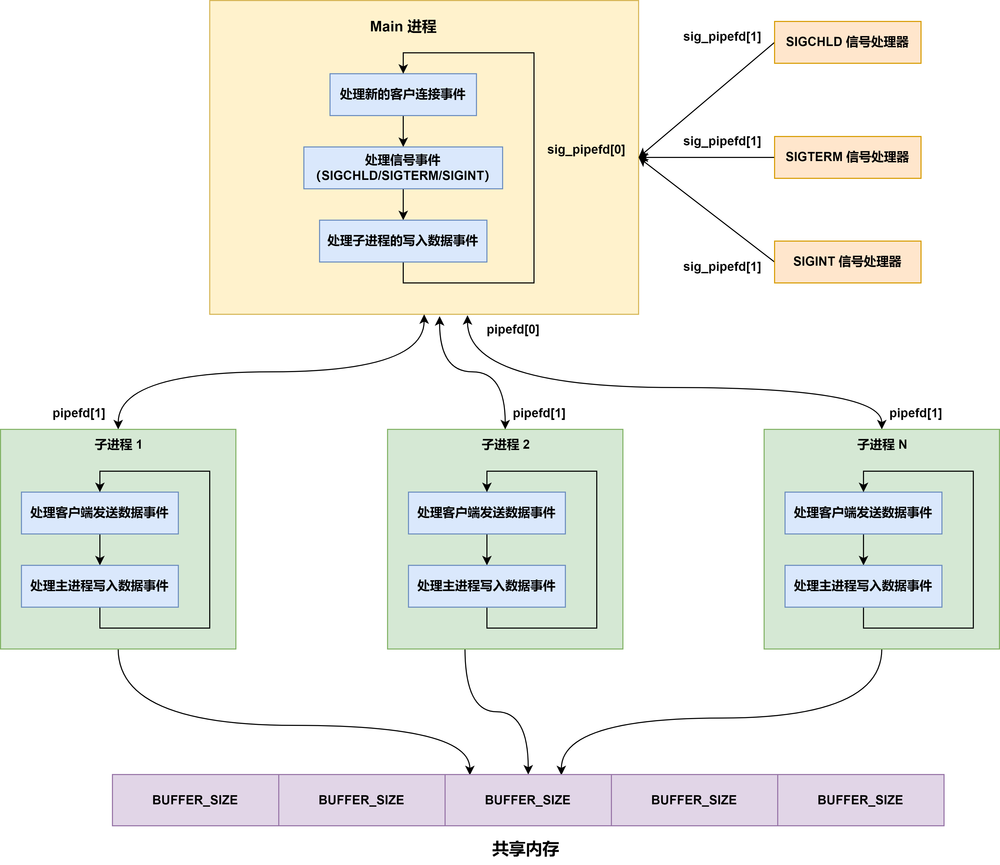

# System V IPC 之共享内存

### 1.共享内存概述

现在将介绍 System V 共享内存。**共享内存允许两个或多个进程共享物理内存的同一块区域（通常被称为段）**。由于一个共享内存段会成为一个进程用户地址空间内存的一部分，**因此这种 IPC 机制无需内核介入**，只需要添加一些页表项，进程便可像访问普通物理内存那样访问共享内存。所有需要做的就是让一个进程将数据复制进共享内存中，并且这部分数据会对其他所有共享同一个段的进程可用。

> 与管道或消息队列要求发送进程将数据从用户空间的缓冲区复制进内核内存和接收进程将数据从内核内存复制进用户空间的缓冲区的做法相比，这种 IPC 技术的速度更快。但是，**共享内存机制通常需要通过某些同步方法使得进程不会出现同时访问共享内存的情况**。

使用共享内存的概念如下所示：

- 调用 **`shmget()`** 创建一个新共享内存段或取得一个既有共享内存段的标识符（即由其他进程创建的共享内存段）；
- 使用 **`shmat()`** 来附上共享内存段，即使该段成为调用进程的虚拟内存的一部分，为引用这块共享内存，程序需要使用由 **`shmat()`** 调用返回的 addr 值，它是一个指向进程的**虚拟地址空间中该共享内存段的起点的指针**；
- 调用 **`shmdt()`** 来分离共享内存段。在这个调用之后，进程就无法再引用这块共享内存了（**在进程终止时会自动完成这一步，分离共享内存段**）；
- 调用 **`shmctl()`** 来删除共享内存段。只有当当前所有附加内存段的进程都与之分离之后，内存段才会真正被销毁，**shmctl 使用 **`IPC_RMID`** 标志更多地只是标记此共享内存段需要被删除**，而不是真正执行。**只有一个进程需要执行这一步**；

### 2.创建或者打开一个共享内存段

**`shmget()`** 系统调用创建一个新共享内存段或获取一个既有段的标识符。新创建的内存段中的内容会被初始化为 0。

```c{.line-numbers}
#include <sys/shm.h>
/* returns shared memory segment identifier on success, or -1 on error */
int shmget(key_t key, size_t size, int shmflg);
```

当使用 **`shmget()`** 创建一个新共享内存段时，size 则是一个正整数，它表示需分配的共享内存的字节数。内核是以系统分页大小的整数倍来分配共享内存的，因此实际上 size 会被提升到最近的系统分页大小的整数倍。**如果使用 shmget() 来获取一个既有段的标识符，那么 size 对段不会产生任何效果**，但它必须要小于或等于段的大小。

shmflg 指定施加于新共享内存段上的权限或需检查的既有内存段的权限：

- **`IPC_CREAT`**：如果不存在与指定的 key 对应的段，那么就创建一个新段；
- **`IPC_EXCL`**：如果同时指定了 **`IPC_CREAT`** 并且与指定的 key 对应的段已经存在，那么返回 **`EEXIST`** 错误；
- **`SHM_HUGETLB`**：特权（CAP_IPC_LOCK）进程能够使用这个标记创建一个使用巨页（huge page）的共享内存段（如 x86-32 允许使用 4MB 大小的巨页代替 4KB 大小的巨页），使用巨页可以降低硬件内存管理单元的超前转换缓冲器（TLB）中的条目数量（TLB 中的条目是一个稀缺资源）；

### 3.使用共享内存

**`shmat()`** 系统调用将 shmid 标识的共享内存段附加到调用进程的虚拟地址空间中。

```c{.line-numbers}
#include <sys/shm.h>
/* returns address at which shared memory is attached on success, or (void*) -1 on error */
void* shmat(int shmid, const void* shmaddr, int shmflg);
```

shmaddr 参数有如下几种参数：

- 

### 5.共享内存实例

接下来，我们使用共享内存来实现一个多人聊天程序（群聊），大致的思想是一个服务器子进程在接收到客户端发送过来的数据时，会将这些数据保存到共享内存中，然后通知服务器其它子进程读取共享内存中的数据，并将这些数据发送给子进程监听的客户端，这样就实现了多人群聊功能。整个多人聊天程序的架构图如下所示：

<div align="center">
    
</div>

在主进程的事件循环中，Main 进程不断循环处理三种事件：新客户端的连接事件、信号事件（**`SIGCHLD/SIGTERM/SIGINT`**）、子进程的写入数据事件。Main 进程的代码如下所示：

```c{.line-numbers}
int main() {

    const char* ip = "127.0.0.1";
    int port = 9523;

    int ret = 0;
    struct sockaddr_in address;
    bzero(&address, sizeof(address));
    address.sin_family = AF_INET;
    inet_pton(AF_INET, ip, &address.sin_addr);
    address.sin_port = htons(port);

    listenfd = socket(PF_INET, SOCK_STREAM, 0);
    int option = 1;
    setsockopt(listenfd, SOL_SOCKET, SO_REUSEADDR, &option, sizeof(option));
    ret = bind(listenfd, (struct sockaddr*) &address, sizeof(address));
    assert(ret != -1);
    ret = listen(listenfd, 5);
    assert(ret != -1);

    /* 客户连接的编号 */
    user_count = 0;
    /* user_count -> client_data */
    users = calloc(USER_LIMIT, sizeof(struct client_data));
    /* pid -> user_count（客户编号）*/
    sub_process = calloc(PROCESS_LIMIT, sizeof(int));
    for (int i = 0; i < PROCESS_LIMIT; i++) {
        sub_process[i] = -1;
    }

    struct epoll_event events[5];
    epollfd = epoll_create(5);
    assert(epollfd != -1);
    /* epoll 事件循环监听 listenfd 上的事件 */
    addfd(epollfd, listenfd);

    ret = socketpair(PF_UNIX, SOCK_STREAM, 0, sig_pipefd);
    assert(ret != -1);
    setnonblocking(sig_pipefd[1]);
    /* epoll 事件循环监听 sig_pipefd[0] 上的事件，也就是信号处理器上的事件 */
    addfd(epollfd, sig_pipefd[0]);

    addsig(SIGCHLD, sig_handler, true);
    addsig(SIGTERM, sig_handler, true);
    addsig(SIGINT, sig_handler, true);
    addsig(SIGPIPE, SIG_IGN, true);

    bool stop_server = false;
    bool terminate = false;
    struct shmid_ds dummy;

    /* 创建共享内存，作为所有客户 socket 连接的读缓存 */
    shm_id = shmget(IPC_PRIVATE, USER_LIMIT * BUFFER_SIZE, IPC_CREAT | S_IRUSR | S_IWUSR);
    shmp = shmat(shm_id, NULL, 0);
    printf("addr: %p\n", shmp);

    /* 先预先删除共享内存，当所有使用此共享内存的进程与其分离之后，操作系统就会自动删除共享内存 */
    shmctl(shm_id, IPC_RMID, &dummy);

    while (!stop_server) {
        /* epoll_wait 会监听 sig_pipefd[0] 信号处理器、listenfd 监听套接字、以及 pipefd[0] 子进程的管道描述符这三类描述符 */
        int number = epoll_wait(epollfd, events, 5, -1);
        if (number < 0 && errno != EINTR) {
            printf("epoll failure\n");
            break;
        }

        for (int i = 0; i < number; i++) {
            int sockfd = events[i].data.fd;
            /********************** 新的客户连接到来 **********************/
            if (sockfd == listenfd) {
                struct sockaddr_in client_address;
                socklen_t client_addr_len = sizeof(client_address);
                int connfd = accept(listenfd, (struct sockaddr*) &client_address, &client_addr_len);
                if (connfd < 0) {
                    printf("errno is: %d (%s)\n", errno, strerror(errno));
                    break;
                }

                if (user_count >= USER_LIMIT) {
                    const char* info = "too many users\n";
                    printf("%s", info);
                    send(connfd, info, strlen(info), 0);
                    close(connfd);
                    continue;
                }

                /* 保存第 user_count 个客户连接的相关数据 */
                users[user_count].address = client_address;
                users[user_count].connfd = connfd;
                /* 在主进程和子进程之间建立管道，以传递必要的数据 */
                ret = socketpair(PF_UNIX, SOCK_STREAM, 0, users[user_count].pipefd);
                assert(ret != -1);

                pid_t pid = fork();
                if (pid < 0) {
                    close(connfd);
                    continue;
                } else if (pid == 0) {
                    close(epollfd);
                    close(listenfd);
                    close(sig_pipefd[0]);
                    close(sig_pipefd[1]);
                    close(users[user_count].pipefd[0]);
                    run_child(user_count, users, shmp);
                    shmdt(shmp);
                    _exit(EXIT_SUCCESS);
                } else {
                    close(connfd);
                    close(users[user_count].pipefd[1]);
                    addfd(epollfd, users[user_count].pipefd[0]);
                    users[user_count].pid = pid;
                    /* 记录新的客户连接在数组 users 中的索引值，建立进程 pid 和该索引值之间的映射关系 */
                    sub_process[pid] = user_count;
                    user_count++;
                }
            }
            /********************** 处理信号事件 **********************/
            else if ((sockfd == sig_pipefd[0]) && (events[i].events & EPOLLIN)) {
                int sig;
                char signals[1024];
                while ((ret = recv(sig_pipefd[0], signals, sizeof(signals), 0)) > 0) {
                    for (int j = 0; j < ret; ++j) {
                        switch (signals[j]) {
                            /* 子进程退出，表示有某个客户端关闭了连接 */
                            case SIGCHLD: {
                                pid_t pid;
                                int stat;
                                while ((pid = waitpid(-1, &stat, WNOHANG)) > 0) {
                                    /* 用子进程的 pid 取得被关闭的客户连接的编号 */
                                    int del_user = sub_process[pid];
                                    sub_process[pid] = -1;
                                    if (del_user < 0 || del_user >= USER_LIMIT) {
                                        continue;
                                    }

                                    /* 清除第 del_user 个客户连接使用的相关数据 */
                                    epoll_ctl(epollfd, EPOLL_CTL_DEL, users[del_user].pipefd[0], 0);
                                    close(users[del_user].pipefd[0]);
                                    users[del_user] = users[--user_count];
                                    sub_process[users[del_user].pid] = del_user;
                                }

                                if (terminate && user_count == 0) {
                                    stop_server = true;
                                }

                                break;
                            }
                            case SIGINT:
                            case SIGTERM: {
                                /* 结束服务器程序 */
                                printf("kill all the child now\n");
                                /* 当外部要终止服务器程序时，如果子进程为 0，那么直接设置 stop_server */
                                if (user_count == 0) {
                                    stop_server = true;
                                    break;
                                }

                                for (int k = 0; k < user_count; k++) {
                                    int pid = users[k].pid;
                                    kill(pid, SIGTERM);
                                }

                                /* 说明服务器主进程将要被关闭退出 */
                                terminate = true;
                                break;
                            }
                            default: {
                                break;
                            }
                        }
                    }
                }

                if (ret == -1 || ret == 0) {
                    continue;
                }
            /********************** 某个子进程向父进程写入了数据 **********************/
            } else if (events[i].events & EPOLLIN) {
                int child = 0;
                /* 读取管道数据，child 变量记录了是哪个客户连接有数据到达 */
                ret = recv(sockfd, (char*)&child, sizeof(child), 0);
                printf("read data from child across pipe %d\n", ret);

                if (ret == -1) {
                    continue;
                } else if (ret == 0) {
                    continue;
                } else {
                    /* 向除负责处理第 child 个客户连接的子进程之外的其他子进程发送消息，通知它们有客户数据要写 */
                    for (int j = 0; j < user_count; j++) {
                        if (users[j].pipefd[0] != sockfd) {
                            printf("send data to child accross pipe\n");
                            send(users[j].pipefd[0], (char*) &child, sizeof(child), 0);
                        }
                    }
                }
            }
        }
    }

    del_resouce();

    return 0;
}
```

对于新客户端的连接事件（服务器最多只能与 5 个客户端建立连接），**会创建一个新的子进程来处理此客户端上的各种读/写事件，同时创建一个 **`socketpair`** 类型的 **`pipefd[2]`** 描述符，此描述符用于主/子进程之间的通信**，注意 **`socketpair`** 函数创建的 **`pipefd[2]`** 描述符是全双工的，**`pipefd[0]/pipefd[1]`** 既可以用来发送数据，也可以用来接收数据。最后会把子进程的信息保存到 **`client_data`** 数组中。

对于信号事件，主进程在启动时，注册了 **`SIGCHLD/SIGINT/SIGTERM`** 三个信号的处理函数。主进程程序中有一个全局变量 **`sig_pipefd[2]`**，由 **`socketpair`** 函数创建，也具备全双工通信的能力，此描述符用于信号处理器和主进程之间的全双工通信。当信号产生并触发信号处理器时，处理器会将此信号通过 **`sigpipefd[1]`** 写入到管道中，然后在管道中依次读取。

当产生 **`SIGCHLD`** 信号时，说明有子进程退出，由于信号处理器不具备排队机制，即在信号处理器被触发时，如果同时又有多个 **`SIGCHLD`** 信号产生，那么这些 **`SIGCHLD`** 信号都会被屏蔽处于等待状态，**待屏蔽状态被解除后，只有一个 **`SIGCHLD`** 信号会被传递给主进程**，因此在 Main 进程中，需要循环调用 **`waitpid`** 函数来避免退出子进程处于僵尸状态。同时，主进程不再监听用于和此子进程通信的 **`pipefd[0]`** 描述符，并且将子进程监听的客户连接数据也清除掉。

这里重点关注下面两行代码：

```c{.line-numbers}
users[del_user] = users[--user_count];
sub_process[users[del_user].pid] = del_user;
```

假设现在要删除的连接序号 **`del_user`** 为 2，而下一个连接序号 **`user_count`** 为 3（需注意，根据代码，在 **`user_count`** 序号之前的连接数据永远都是正常填充的），第 1 行代码将 **`user_count=2`** 的数据赋值给 **`del_user=2`** 处，看似好像没有进行删除，**但是 **`user_count`** 表示数组中最小的没有连接数据的下标值**，下一次有新的连接建立，就会将连接对应的 **`client_data`** 数据结构保存到 **`user_count`** 处，覆盖掉原有的连接数据。

<div align="center">
    
</div>

假设现在要删除的连接序号 **`del_user`** 为 1，而下一个连接序号 **`user_count`** 为 4，第 1 行代码将 **`user_count=3`** 处的数据赋值给 **`del_user=1`** 处，下次有新的连接建立，会将连接对应的 **`client_data`** 数据保存到 **`user_count=3`** 处，对原有的数据进行覆盖。

<div align="center">
    
</div>

当产生 **`SIGTERM/SIGINT`** 信号时，若 **`user_count`** 为 0，即没有任何连接了，那么直接设置 **`stop_server=true`**，否则就对剩余的每个子进程发送 **`SIGTERM`** 信号，强行关闭子进程，**`terminate`** 变量被设置为 true。当服务器处理子进程退出的 **`SIGCHLD`** 信号时，会检测 **`terminate`** 和 **`user_count`** 的值，只有当 terminate 为 true 并且 **`user_count`** 为 0 时，那么才会停止主进程的事件循环并退出。

因为 terminate 表示外部需要终止服务器的主进程，只有这个值为 true，当没有子进程时，才会终止主进程的事件循环并退出，否则单纯的子进程为 0，只能说明现在没有新的连接建立，不会终止服务器。

子进程的事件循环代码如下所示：

```c{.line-numbers}
/* 
 * 子进程运行的函数，参数 idx 指出该子进程处理的客户连接的编号，users 是保存所有客户连接数据的数组，
 * 参数 shmp 指出共享内存的起始位置
 */
void run_child(int idx, struct client_data* users, char* shmp) {
    struct epoll_event events[5];
    /* 子进程使用 I/O 复用技术来同时监听两个文件描述符：客户连接 socket、与父进程通信的管道文件描述符 */
    int child_epollfd = epoll_create(5);
    assert(child_epollfd != -1);
    /* 子进程监听的客户端套接字描述符 connfd */
    int connfd = users[idx].connfd;
    addfd(child_epollfd, connfd);
    /* pipefd[1] 用于此子进程和主进程之间的通信 */
    int pipefd = users[idx].pipefd[1];
    addfd(child_epollfd, pipefd);

    int ret;
    /* 子进程需要设置自己的信号处理函数，当收到 SIGTERM 信号时，会停止子进程的事件监听循环 */
    addsig(SIGTERM, child_term_handler, false);

    while (!stop_child) {
        int number = epoll_wait(child_epollfd, events, 5, -1);
        if ((number < 0) && (errno != EINTR)) {
            printf("epoll failure\n");
            break;
        }

        for (int i = 0; i < number; i++) {
            int sockfd = events[i].data.fd;
            /* 本子进程负责的客户连接有数据到达 */
            if ((sockfd == connfd) && (events[i].events & EPOLLIN)) {
                memset(shmp + idx * BUFFER_SIZE, '\0', BUFFER_SIZE);
                /* 将客户数据读取到对应的读缓存中。该读缓存是共享内存的一段，它开始于 idx * BUFFER_SIZE 处，长度为 BUFFER_SIZE 字节，
                 * 因此，各个客户连接的读缓存是共享的
                 */
                ret = recv(connfd, shmp + idx * BUFFER_SIZE, BUFFER_SIZE - 1, 0);

                if (ret < 0) {
                    if (errno != EAGAIN) {
                        stop_child = true;
                    }
                } else if (ret == 0) {
                    stop_child = true;
                } else {
                    /* 成功读取客户数据后就通知主进程（通过管道）来处理 */
                    send(pipefd, (char*)&idx, sizeof(idx), 0);
                }
            /* 主进程通知本进程（通过管道）将第 client 个客户的数据发送到本进程负责的客户端 */
            } else if((sockfd == pipefd) && (events[i].events & EPOLLIN)) {
                int client = 0;
                ret = recv(sockfd, (char *)&client, sizeof(client), 0);
                if (ret < 0) {
                    if (errno != EAGAIN) {
                        stop_child = true;
                    }
                } else if (ret == 0) {
                    stop_child = true;
                } else {
                    send(connfd, shmp + client * BUFFER_SIZE, BUFFER_SIZE, 0);
                }
            } else {
                continue;
            }
        }
    }

    close(connfd);
    close(pipefd);
    close(child_epollfd);
}
```

子进程需要处理客户端发送数据事件、主进程写入数据事件。

当客户端有数据发送过来时，子进程会将数据保存到共享内存中（地址为 **`shmp + idx * BUFFER_SIZE`**），然后会将客户端的编号（idx）发送给主进程。主进程会将 idx 编号转发给其余所有的子进程，这些子进程会从 **`shmp + idx * BUFFER_SIZE`** 处读取保存的数据，然后发送给客户端。这样就实现了群聊的功能。

下面程序的一些公共部分：

```c{.line-numbers}
#define USER_LIMIT 5
#define BUFFER_SIZE 1024
#define FD_LIMIT 65535
#define MAX_EVENT_NUMBER 1024
#define PROCESS_LIMIT 65536
/* key for shared memory segment */
#define SHM_KEY 0x1234

char *shmp;

/* 处理一个客户端连接必要的数据 */
struct client_data {
    /* 子进程处理连接的客户端地址 */
    struct sockaddr_in address;
    /* 子进程处理连接的套接字描述符 connfd */
    int connfd;
    /* 处理这个连接的子进程的 pid */
    pid_t pid;
    /* pipefd[2] 中的 pipefd[0] 属于主进程，而 pipefd[1] 属于子进程，pipefd[2] 是由 socketpair 函数创建的，具有双向通信功能，
     * 即每个描述符 pipefd[0]/pipefd[1] 既可以发送数据，也可以接收数据；而一般的管道 pfd[0] 用于读取数据，而 pfd[1] 用于写入数据，
     * pipefd[2] 用于主进程和子进程之间的通信使用
     */
    int pipefd[2];
};

/* 专用于主进程与信号处理器之间通信的全双工通道，由 socketpair 创建完成 */
int sig_pipefd[2];
/* 主进程的监听 epoll 描述符 */
int epollfd;
int listenfd;
int shm_id;
/* 客户连接数组，进程用客户连接的编号 user_count 来索引这个数组，即可取得相关的客户连接数据 client_data */
struct client_data* users = 0;
/* 子进程和客户连接的映射关系表，用进程的 PID 来索引这个数组，即可取得该进程所处理的客户连接的编号 user_count */
int* sub_process = 0;
/* 当前客户的数量 and 客户连接的编号 */
int user_count = 0;
bool stop_child = false;

int setnonblocking(int fd) {
    int old_option = fcntl(fd, F_GETFL);
    int new_option = old_option | O_NONBLOCK;
    fcntl(fd, F_SETFL, new_option);
    return old_option;
}

/* 将文件描述符添加到 epollfd 中进行监控 */
void addfd(int epollfd, int fd) {
    struct epoll_event event;
    event.data.fd = fd;
    event.events = EPOLLIN | EPOLLET;
    epoll_ctl(epollfd, EPOLL_CTL_ADD, fd, &event);
    setnonblocking(fd);
}

void sig_handler(int sig) {
    int save_errno = errno;
    char msg = sig;
    /* 向 sig_pipefd[1] 管道中写入 msg 即产生的信号值 sig，统一事件源 */
    send(sig_pipefd[1], &msg, 1, 0);
    errno = save_errno;
}

void addsig(int sig, void(*handler)(int), bool restart) {
    struct sigaction sa;
    memset(&sa, '\0', sizeof(sa));
    sa.sa_handler = handler;
    if (restart) {
        sa.sa_flags |= SA_RESTART;
    }
    /* 在信号处理函数被调用时，为了防止同时接收其他信号的干扰，通常会将一些信号加入到屏蔽信号集中。
     * 屏蔽信号集用于指定在当前信号处理函数执行期间应该被阻塞的信号
     * 下面会屏蔽掉所有的信号
     */
    sigfillset(&sa.sa_mask);
    assert(sigaction(sig, &sa, NULL) != -1);
}

void del_resouce() {
    close(sig_pipefd[0]);
    close(sig_pipefd[1]);
    close(listenfd);
    close(epollfd);
    free(users);
    free(sub_process);
    // 将共享内存进行分离 shmdt
    shmdt(shmp);
}

/* 停止一个子进程 */
/* 每个子进程的虚拟地址空间不同，故一个子进程中的 stop_child 变量发生变化之后，其它子进程中同样的变量不受影响 */
void child_term_handler(int sig) {
    stop_child = true;
}
```