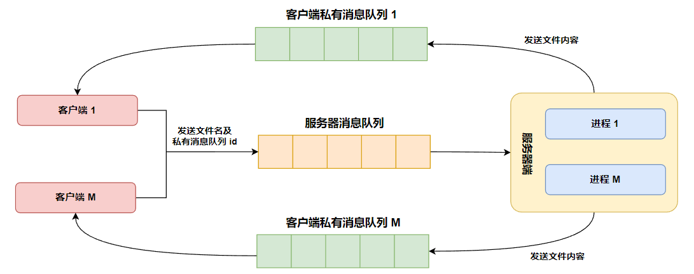
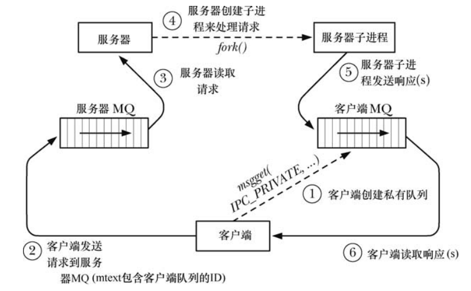

## 消息队列

### 1.概述

消息队列与管道的区别如下所示：

- 用来引用消息队列的句柄是一个由 **`msgget()`** 调用返回的标识符，而不是 **`UNIX`** 系统中 I/O 所使用的文件描述符；
- 通过消息队列进行的通信是面向消息的，**即读者接收到由写者写入的整条消息**，管道是面向字节流的。读取一条消息的一部分而让剩余部分遗留在队列中或一次读取多条消息都是不可能的；
- 除了包含数据之外，每条消息还有一个用整数表示的类型。从消息队列中读取消息既可以按照先入先出的顺序，也可以根据类型来读取消息；

### 2.创建或者打开一个消息队列

**`msgget()`** 系统调用创建一个新消息队列或取得一个既有队列的标识符：

```c{.line-numbers}
#include <sys/msg.h>
/* returns message queue identifier on success, or -1 on error */
int msgget(key_t key, int msgflg);
```

key 是使用 **`ftok()`** 返回的一个键或者值 **`IPC_PRIVATE`**；而 msgflg 的值类似于 **`shmget()/semget()`** 函数中的 **`IPC_CREAT`**、**`IPC_EXCL`** 标志位。 

**`msgget()`** 系统调用首先会在所有既有消息队列中搜索与指定的键对应的队列。如果找到了一个匹配的队列，那么就会返回该对象的标识符（**除非在 msgflg 中同时指定了 **`IPC_CREAT`** 和 **`IPC_EXCL`**，那样的话就返回一个错误**）。如果没有找到匹配的队列并且在 msgflg 中指定了 **`IPC_CREAT`**，那么就会创建一个新队列并返回该队列的标识符。

下面的程序演示了 **`msgget()`** 函数的用法：

```c{.line-numbers}
static void usageError(const char *progName, const char *msg) {

    if (msg != NULL)
        fprintf(stderr, "%s", msg);

    fprintf(stderr, "Usage: %s [-cx] {-f pathname | -k key | -p} num-sems [octal-perms]\n", progName);
    fprintf(stderr, "    -c           Use IPC_CREAT flag\n");
    fprintf(stderr, "    -x           Use IPC_EXCL flag\n");
    fprintf(stderr, "    -f pathname  Generate key using ftok()\n");
    fprintf(stderr, "    -k key       Use 'key' as key\n");
    fprintf(stderr, "    -p           Use IPC_PRIVATE key\n");
    exit(EXIT_FAILURE);

}

int main(int argc, char* argv[]) {

    /* Parse command-line options and arguments */

    /* Counts -f, -k, and -p options */
    int num_key_flags = 0;
    int flags = 0;
    long lkey;
    key_t key;
    int opt;

    /*
     * optstring 是可以处理选项字母组成的字符串。该字串里的每个字符对应于一个以 '-' 开头的选项。
     * 如果该字串里的任一字符后面有冒号，那么这个选项就要求有参数（如"hd:"对应于 '-h' 和 '-d'，
     * 其中 '-d' 后需接参数）。而如果选项后面接两个冒号，则说明这个选项后的参数是可选的，即可带参数也可不带参数。
     * ./svsem_create -c -x -p 14
     */
    while ((opt = getopt(argc, argv, "cf:k:px")) != -1) {
        switch (opt) {
            /* -c means IPC_CREAT */
            case 'c':
                flags |= IPC_CREAT;
                break;

            /* -f pathname */
            case 'f':
                key = ftok(optarg, 1);
                if (key == -1)
                    err_exit("ftok");
                num_key_flags++;
                break;

            /* -k key (octal, decimal or hexadecimal) */
            case 'k':
                if (sscanf(optarg, "%li", &lkey) != 1)
                    err_exit("-k option requires a numeric argument\n");
                key = lkey;
                num_key_flags++;
                break;

            /* -p means IPC_PRIVATE */
            case 'p':
                key = IPC_PRIVATE;
                num_key_flags++;
                break;

            /* -x means IPC_EXCL */
            case 'x':
                flags |= IPC_EXCL;
                break;

            default:
                usageError(argv[0], NULL);
        }
    }

    /*
     * -x 与 -c 表示的是 semget 函数调用时指定的 flags 选项
     * -p、-k 与 -f 表示的是 semget 函数调用时，指定的 key，根据这个 key 会生成信号量的标识符，每次这三个选项被调用，那么
     * num_key_flags 的值都会增加 1
     */
    if (num_key_flags != 1)
        usageError(argv[0], "Exactly one of the options -f, -k, or -p must be supplied\n");

    unsigned int perms = (argc == optind) ? (S_IRUSR | S_IWUSR) : getInt(argv[optind], GN_BASE_8, "octal-perms");

    int msgid = msgget(key, flags | perms);
    if (msgid == -1)
        err_exit("semget");

    /* On success, display msg queue set ID */
    printf("%d\n", msgid);
    exit(EXIT_SUCCESS);
}
```

### 3.交换消息

**`msgsnd()`** 和 **`msgrcv()`** 系统调用执行消息队列上的 I/O。这两个系统调用接收的第一个参数是消息队列标识符（msqid）。第二个参数 msgp 是一个由程序员定义的结构的指针，该结构用于存放被发送或接收的消息。这个结构的常规形式如下：

```c{.line-numnbers}
struct mymsg {
    /* message type */
    long mtype;
    /* message body */
    char mtext[];
}
```

这个定义仅仅简要地说明了消息的第一个部分包含了消息类型，它用一个类型为 long 的整数来表示，**而消息的剩余部分则是由程序员定义的一个结构，其长度和内容可以是任意的，而无需是一个字符数组**。**因此 mgsp 参数的类型为 void*，这样就允许传入任意结构的指针了**。

#### 3.1 发送消息

msgsnd() 系统调用向消息队列写入一条消息。

```c{.line-numbers}
#include <sys/msg.h>
/* returns 0 on success, or -1 on error */
int msgsnd(int msqid, const void* msgp, size_t msgsz, int msgflg);
```

使用 **`msgsnd()`** 发送消息必须要将消息结构中的 mtype 字段的值设为一个大于 0 的值，并将所需传递的信息复制到程序员定义的 mtext 字段中。**msgsz 参数指定了 mtext 字段中包含的字节数**。**在使用 **`msgsnd()`** 发送消息时并不存在 **`write()`** 所具备的部分写的概念**。这也是成功的 **`msgsnd()`** 只需要返回 0 而不是所发送的字节数的原因。

最后一个参数 msgflg 是一组标记的位掩码，目前只定义了 **`IPC_NOWAIT`**，表示执行一个非阻塞的发送操作。通常，当消息队列满时，**`msgsnd()`** 会阻塞直到队列中有足够的空间来存放这条消息。**但如果指定了这个标记，那么 **`msgsnd()`** 就会立即返回 **`EAGAIN`** 错误**。

当 **`msgsnd()/msgrcv()`** 调用因队列满而发生阻塞时可能会被信号处理器中断。当发生这种情况时，**`msgsnd()`** 总是会返回 EINTR 错误。（**`msgsnd()`** 系统调用永远不会自动重启，不管在建立信号处理器时是否设置了 **`SA_RESTART`** 标记）。

```c{.line-numbers}
#define MAX_MTEXT 1024

struct mbuf {
    long mtype;
    char mtext[MAX_MTEXT];
};

static void usage_error(const char *prog_name, const char *msg) {
    if (msg != NULL)
        fprintf(stderr, "%s", msg);
    fprintf(stderr, "usage: %s [-n] msqid msg-type [msg-text]\n", prog_name);
    fprintf(stderr, "       -n            Use IPC_NOWAIT flag\n");
    exit(EXIT_FAILURE);
}

int main(int argc, char* argv[]) {

    int msqid, flags, msg_len;
    /* message buffer for msgsnd() */
    struct mbuf msg;
    int opt;

    /* Parse command-line options and arguments */
    flags = 0;
    while ((opt = getopt(argc, argv, "n")) != -1) {
        if (opt == 'n')
            flags |= IPC_NOWAIT;
        else
            usage_error(argv[0], NULL);
    }

    msqid = getInt(argv[optind], 0, "msqid");
    msg.mtype = getInt(argv[optind + 1], 0, "msg-type");

    if (argc > optind + 2) {
        /* 'msg-text' was supplied */
        msg_len = strlen(argv[optind + 2]) + 1;
        if (msg_len > MAX_MTEXT)
            err_exit("msg-text too long\n");
        memcpy(msg.mtext, argv[optind + 2], msg_len);
    } else {
        /* no 'msg-text' ==> zero-length msg */
        msg_len = 0;
    }

    /* send message */
    if (msgsnd(msqid, &msg, msg_len, flags) == -1)
        err_exit("msgsnd");

    exit(EXIT_SUCCESS);
}
```

#### 3.2 接收消息

**`msgrcv()`** 系统调用从消息队列中读取（**以及删除**）一条消息并将其内容复制进 **`msgp`** 指向的缓冲区中。

```c{.line-numbers}
#include <sys/msg.h>
/* returns number of bytes copied into mtext field, or - 1 on error */
ssize_t msgrcv(int msqid, void* msgp, size_t maxmsgsz, long msgtyp, int msgflg);
```

msgp 缓冲区中 mtext 字段的最大可用空间是通过 maxmsgsz 参数来指定的。如果队列中待删除的消息体的大小超过了 maxmsgsz 字节，那么就不会从队列中删除消息，并且 **`msgrcv()`** 会返回错误 **`E2BIG`**。这是默认行为，可以使用 **`MSG_NOERROR`** 标记来改变这种行为。

读取消息的顺序无需与消息被发送的一致。可以根据 mtype 字段的值来选择消息，而这个选择过程是由 msgtyp 参数来控制的：

- 如果 msgtyp 等于 0，那么会删除队列中的第一条消息并将其返回给调用进程；
- 如果 msgtyp 大于 0，**那么会将队列中第一条 mtype 等于 msgtyp 的消息删除并将其返回给调用进程**。通过指定不同的 msgtyp 值，这项技术让各个进程选取与自己的进程 ID 匹配的消息；
- 如果 msgtyp 小于 0，**那么就会将等待消息当成优先队列来处理**。队列中 mtype 最小并且其值小于或等于 msgtyp 的绝对值的第一条消息会被删除并返回给调用进程；

比如现在消息队列中，有 5 条消息，消息的类型为 300、100、200、400、100，那么调用 `msgrcv(id, &msg, maxmsgsz, -300, 0);` 函数时，这个调用返回的消息顺序是 2（类型为 100）、5（类型为 100）、3（类型为 200）、1（类型为 300），然后 msgrcv 函数会直接阻塞。

msgflg 标志位有如下值：

- **`IPC_NOWAIT`**：执行一个非阻塞接收。通常如果队列中没有匹配 msgtyp 的消息，那么 **`msgrcv()`** 会阻塞直到队列中存在匹配的消息为止。指定 **`IPC_NOWAIT`** 标记会导致 **`msgrcv()`** 立即返回 **`ENOMSG`** 错误（这里在设计时，其实返回 **`EAGAIN`** 错误会使得一致性更强一点）；
- **`MSG_EXCEPT`**：只有当 msgtyp 大于 0 时这个标记才会起作用，它会强制对常规操作进行补足，即将队列中第一条 mtype 不等于 msgtyp 的消息删除并将其返回给调用者；
- **`MSG_NOERROR`**：在默认情况下，当消息的 mtext 字段的大小超过了可用空间时（由 maxmsgsz 参数定义），msgrcv() 调用会失败。如果指定了 MSG_NOERROR 标记，那么 msgrcv() 将会从队列中删除消息并将其 mtext 字段的大小截短为 maxmsgsz 字节，然后将消息返回给调用者。被截去的数据将会丢失；

```c{.line-numbers}
#define MAX_MTEXT 1024

struct mbuf {
    /* message type */
    long mtype;
    /* message body */
    char mtext[MAX_MTEXT];
};

static void usage_error(const char *prog_name, const char *msg) {
    if (msg != NULL)
        fprintf(stderr, "%s", msg);
    fprintf(stderr, "Usage: %s [options] msqid [max-bytes]\n", prog_name);
    fprintf(stderr, " Permitted options are:\n");
    fprintf(stderr, "       -e      Use MSG_NOERROR flag\n");
    fprintf(stderr, "       -t type Select message of given type\n");
    fprintf(stderr, "       -n      Use IPC_NOWAIT flag\n");
#ifdef MSG_EXCEPT
    fprintf(stderr, "       -x      Use MSG_EXCEPT flag\n");
#endif
    exit(EXIT_FAILURE);
}

int main(int argc, char* argv[]) {

    int msqid, flags, type;
    ssize_t msg_len;
    size_t max_bytes;
    /* message buffer for msgrcv() */
    struct msgbuf msg;
    int opt;

    flags = 0;
    type = 0;
    while ((opt = getopt(argc, argv, "ent:x")) != -1) {
        switch (opt) {
            case 'e':
                flags |= MSG_NOERROR;
                break;
            case 'n':
                flags |= IPC_NOWAIT;
                break;
            case 't':
                type = atoi(optarg);
                break;
#ifdef MSG_EXCEPT
            case 'x':
                flags |= MSG_EXCEPT;
                break;
#endif
            default:
                usage_error(argv[0], NULL);
        }
    }

    msqid = getInt(argv[optind], 0, "msqid");
    max_bytes = (argc > optind + 1) ? getInt(argv[optind + 1], 0, "max-bytes") : MAX_MTEXT;

    /* get message and display on stdout */
    msg_len = msgrcv(msqid, &msg, max_bytes, type, flags);
    if (msg_len == -1)
        err_exit("msgrcv");

    printf("received: type=%ld; length=%ld", msg.mtype, (long) msg_len);
    if (msg_len > 0)
        printf("; body=%s", msg.mtext);
    printf("\n");

    exit(EXIT_SUCCESS);
}
```

shell 的运行结果如下所示，首先创建一个消息队列，然后往消息队列中发送 3 个消息，消息类型分别为 20、10、30，这样当执行 **`svmsg_receive`** 程序时，消息队列变为优先级队列，先获取消息类型为 10 的消息，然后是 20，最后阻塞，因为消息队列中只剩下类型为 30 的消息。最后后执行一个从队列中读取任意类型的消息的命令，将此消息读取出来。

```shell{.line-numbers}
xuweilin@xvm:~/CLionProjects/http_parser$ ./svmsg_create -p
argc: 2  optind: 2
0
xuweilin@xvm:~/CLionProjects/http_parser$ ./svmsg_send 0 20 "I hear and I forgot."
xuweilin@xvm:~/CLionProjects/http_parser$ ./svmsg_send 0 10 "I see and I remember."
xuweilin@xvm:~/CLionProjects/http_parser$ ./svmsg_send 0 30 "I do and I understand."
xuweilin@xvm:~/CLionProjects/http_parser$ ./svmsg_receive -t -20 0
received: type=10; length=22; body=I see and I remember.
xuweilin@xvm:~/CLionProjects/http_parser$ ./svmsg_receive -t -20 0
received: type=20; length=21; body=I hear and I forgot.
xuweilin@xvm:~/CLionProjects/http_parser$ ./svmsg_receive -t -20 0
^C
xuweilin@xvm:~/CLionProjects/http_parser$ ./svmsg_receive 0
received: type=30; length=23; body=I do and I understand.
```

### 4.消息队列控制操作

**`msgctl()`** 系统调用在标识符为 msqid 的消息队列上执行控制操作。

```c{.line-numbers}
#include <sys/msg.h>
/* returns 0 on success, or -1 on error */
int msgctl(int msqid, int cmd, struct msqid_ds* buf);
```

其中 cmd 的取值如下所示：

- **`IPC_STAT`**：将与这个消息队列关联的 **`msqid_ds`** 数据结构的副本放到 buf 指向的缓冲区中；
- **`IPC_SET`**：使用 buf 指向的缓冲区提供的值更新与这个消息队列关联的 **`msqid_ds`** 数据结构中被选中的字段；
- **`IPC_RMID`**：立即删除消息队列对象及其关联的 **`msqid_ds`** 数据结构。**队列中所有剩余的消息都会丢失，所有被阻塞的读者和写者进程会立即醒来**，**`msgsnd()`** 和 **`msgrcv()`** 会失败并返回错误 **`EIDRM`**；

```c{.line-numbers}
int main(int argc, char* argv[]) {

    int j;

    for (j = 1; j < argc; j++) {
        if (msgctl(getInt(argv[j], 0, "msqid"), IPC_RMID, NULL) == -1)
            err_exit("msgctl IPC_RMID");
    }

    exit(EXIT_SUCCESS);
}
```

#### 4.1 消息队列的数据结构

每个消息队列都有一个关联的 **`msqid_ds`** 数据结构：

```c{.line-numbers}
struct msqid_ds {
    /* Ownership and permissions */
    struct ipc_perm msg_perm;
    /* Time of last msgsnd() */
    time_t msg_stime;
    /* Time of last msgrcv() */
    time_t msg_rtime;
    /* Time of last change */
    time_t msg_ctime;
    /* Number of bytes in queue */
    unsigned long __msg_cbytes;
    /* Number of messages in queue */
    /* msgqnum_t 是无符号整形 */
    msgqnum_t msg_qnum;
    /* Maximum bytes in queue */
    /* msglen_t 是无符号整形 */
    msglen_t msg_qbytes;
    /* PID of last msgsnd() */
    pid_t msg_lspid;
    /* PID of last msgrcv() */
    pid_t msg_lrpid;
}
```

下面详细解释上面结构体中的各个字段：

- **`msg_stime/msg_rtime`**：在队列被创建之后这个字段会被设置为 0；后续每次成功的 **`msgsnd()`** 调用都会将这个字段设置为当前时间；
- **`msg_ctime`**：当消息队列被创建或成功执行了 **`IPC_SET`** 操作之后会将这个字段设置为当前时间；
- **`__msg_cbytes`**：初始值为 0，后续每次成功的 **`msgsnd()`** 和 **`msgrcv()`** 调用都会对这个字段进行调整以**反映出队列中所有消息的 mtext 字段包含的字节数总和**；
- **`msg_qnum`**：初始值为 0，后续每次成功的 msgsnd() 调用会递增这个字段；
- **`msg_qbytes`**：这个字段的值为消息队列中所有消息的 mtext 字段的字节总数定义了一个上限。在队列被创建之后会将这个字段的值初始化为 **`MSGMNB`**；

#### 4.2 消息队列的限制

UNIX System V 实现会对消息队列的操作施加一些限制，如下所示：

- **`MSGMNI`**：这是系统级别的一个限制，它规定了系统中所能创建的消息队列标识符（换句话说是消息队列）的数量；
- **`MSGMAX`**：这是系统级别的一个限制，它规定了单条消息中最多可写入的字节数；
- **`MSGMNB`**：**一个消息队列中一次最多保存的字节数（mtext）**，用来初始化消息队列相关的数据结构中 **`msg_qbytes`** 字段，如果达到一个队列的 **`msg_qbytes`** 限制，那么 **`msgsnd()`** 会阻塞或在 **`IPC_NOWAIT`** 被设置时返回 **`EAGAIN`** 错误；

### 5.显示系统中所有消息队列

通过 Linux 特有的一组 IPC ctl（**`msgctl()、semctl()`** 以及 **`shmctl()`**）操作，来显示系统中所有的消息队列、信号量、共享内存 IPC 对象。这些操作如下：

**1).`MSG_INFO、SEM_INFO` 和 `SHM_INFO `**

**`MSG_INFO`** 操作完成两件事情（**`SEM_INFO`**、**`SHM_INFO`** 对信号量与共享内存的效果类似）：

- 第一件事情是它将返回一个结构来详细描述系统上所有消息队列的资源消耗情况；
- 第二件事情是作为 ctl 调用的函数结果，它将返回指向表示消息队列对象的数据结构的 entries 数组中最大项的下标；

下面的程序演示了 **`MSG_INFO`** 的使用：

```c{.line-numbers}
int main(int argc, char* argv[]) {
    struct msginfo info;

    int s = msgctl(0, MSG_INFO, (struct msqid_ds*) &info);
    /* 指向表示消息队列对象的数据结构的 entries 数组中最大项的下标 */
    printf("maximum ID index = %d\n", s);
    /* msgpool 表示 entries 数组中有多少个消息队列对象在被使用 */
    printf("queues in use    = %ld\n", (long) info.msgpool);
    printf("msg_hdrs         = %ld\n", (long) info.msgmap);
    /* msgmax 表示一条消息包含的最大字节数 */
    printf("msg_bytes        = %ld\n", (long) info.msgmax);
    /* msgmnb 表示消息队列中可以写入的最大字节数 */
    printf("max queue_bytes  = %ld\n", (long) info.msgmnb);
    exit(EXIT_SUCCESS);
}
```

使用前面的 ./svmsg_create -p 程序创建 4 个消息队列（标识符分别为 0、1、2、3），然后调用 ./svmsg_rm -2 删除其中一个消息队列，最后运行上述程序的结果如下所示：

```shell{.line-numbers}
/home/xuweilin/CLionProjects/http_parser/svmsg_info
maximum ID index = 3
queues in use    = 3
msg_hdrs         = 0
msg_bytes        = 8192
max queue_bytes  = 16384
```

**2).`MSG_STAT、SEM_STAT` 以及 `SHM_STAT`**

与 **`IPC_STAT`** 操作一样，这些操作获取一个 IPC 对象的关联数据结构，但它们之间存在两方面的不同：

- 第一，与 ctl 调用的第一个参数为 IPC 标识符不同，**这些操作的第一个参数是 entries 数组中的一个下标**；
- 第二，如果操作执行成功了，那么作为函数结果，ctl 调用会返回与该下标对应的 IPC 对象的标识符；

在介绍了上面两个操作之后，按照下面的步骤可以列出系统上所有消息队列：

1. 使用 **`MSG_INFO`** 操作找到消息队列的 entries 数组的最大下标（maxind）；
2. 执行一个循环，对 0 到 maxind（包含）之间的每一个值都执行一个 **`MSG_STAT`** 操作；在循环过程中忽略因 entries 数组中的元素为空而发生的错误（**`EINVAL`**）以及在数组中元素所引用的对象上不具备相应的权限而发生的错误（**`EACCES`**）；

```c{.line-numbers}
int main(int argc, char* argv[]) {

    int maxind, ind, msqid;
    struct msqid_ds ds;
    struct msginfo info;

    /* Obtain size of kernel 'entries' array */
    maxind = msgctl(0, MSG_INFO, (struct msqid_ds*) &info);
    if (maxind == -1)
        err_exit("msgctl-MSG_INFO");

    printf("maxind: %d\n\n", maxind);
    printf("index         id     key               messages\n");

    /* retrieve and display information from each element of 'entries' array */
    for (ind = 0; ind <= maxind; ind++) {
        msqid = msgctl(ind, MSG_STAT, &ds);
        if (msqid == -1) {
            if (errno != EINVAL && errno != EACCES) {
                /* unexpected error */
                err_exit("msgctl-MSG_STAT");
            }
            /* ignore this item */
            continue;
        }

        printf("%4d   %8d      0x%08lx     %7ld\n", ind, msqid, (unsigned long) ds.msg_perm.__key, (long) ds.msg_qnum);
    }

    exit(EXIT_SUCCESS);
}
```

上述程序运行的结果如下所示：

```shell
xuweilin@xvm:~/CLionProjects/http_parser$ ./svmsg_ls 
maxind: 3
index         id     key               messages
   0          0      0x00000000           1
   1          1      0x00000000           0
   3          3      0x00000000           0
```

### 6.使用消息队列实现客户端-服务器应用程序

本节介绍一个客户端-服务器应用程序，**每个客户端都使用一个私有的消息队列和服务器进行通信**。这个应用程序是一个简单的文件服务器。客户端向服务器的消息队列发送一个请求消息请求指定名称的文件的内容。**服务器将文件的内容作为一系列的消息返回到客户端私有的消息队列中**。服务器对客户端不做任何鉴权，因此所有使用客户端的用户都能够获取服务器所能访问的所有文件。本程序的逻辑结构如下所示：

<div align="center">
    
</div>

在上图中，客户端会向服务器消息队列发送想要获取的文件名称以及私有的消息队列标识符，服务端会重新创建一个新的子进程来处理请求，将文件字节流写入到客户端私有的消息队列。下面是该程序的时序概览图：

<div align="center">
    
</div>

#### 6.1 公共头文件

这个头文件为服务器的消息队列定义了一个众所周知的键（**`SERVER_KEY`**），并且定义了客户端和服务器之间传递的消息的格式。

requestMsg 结构定义了客户端发送给服务器的请求格式。在这个结构中，mtext 部分由两个字段构成：**客户端消息队列的标识符和客户端请求的文件路径名**。常量 **`REQ_MSG_SIZE`** 等于这两个字段大小的总和，它在使用这个结构的 **`msgsnd()`**调用中是作为 msgsz 参数使用的。

```c{.line-numbers}
#ifndef HTTP_PARSER_SVMSG_FILE_H
#define HTTP_PARSER_SVMSG_FILE_H

#include <limits.h>
#include <sys/stat.h>
#include <sys/msg.h>
#include <sys/types.h>
#include <stddef.h>
#include <fcntl.h>
#include <sys/wait.h>
#include <errno.h>
#include <stdio.h>
#include <string.h>
#include <stdlib.h>
#include <unistd.h>
#include "../get_num.h"

/* key for server's message queue */
#define SERVER_KEY 0x1aaaaaa1

/* requests (client to server) */
struct request_msg {
    long mtype;
    /* id of client's message queue */
    int client_id;
    /* file to be returned，定义在 limits.h 头文件中 */
    char pathname[PATH_MAX];
};

/*
 * 为了防止 pathname 字段和 client_id 字段之间可能出现的字节填充情况
 */
#define REQ_MSG_SIZE (offsetof(struct request_msg, pathname) - offsetof(struct request_msg, client_id) + PATH_MAX)
#define RESP_MSG_SIZE 8192

struct response_msg {
    /* one of RESP_MT_* values below */
    long mtype;
    /* File content / response message */
    char data[RESP_MSG_SIZE];
};

/* File couldn't be opened */
#define RESP_MT_FAILURE  1
/* Message contains file data */
#define RESP_MT_DATA     2
/* File data complete */
#define RESP_MT_END      3

#endif //HTTP_PARSER_SVMSG_FILE_H
```

#### 6.2 服务器程序

服务器被设计成并发地处理请求，每个客户端请求通过创建一个子进程返回请求的文件来完成，同时，主服务器进程等待后续的客户端请求。由于通过 **`fork()`** 创建的子进程会继承父进程栈的一个副本，**因此它能够获取主服务器进程读取的请求消息的一个副本**，即可以获取客户端发送过来的文件名称以及消息队列标识符。服务器子进程在处理完相关的客户端请求之后会终止。

为避免创建僵死进程，服务器为 **`SIGCHLD`** 建立了一个处理器并在处理器中循环调用 **`waitpid()`**。父服务器进程中的 **`msgrcv()`** 调用可能会阻塞，其结果是可能会被 **`SIGCHLD`** 处理器中断（msgrcv 函数被信号处理器中断之后即使设置了 **`SA_RESTART`** 标志也会出错）。**为处理这种情况，需要使用一个循环来完成 **`EINTR`** 错误发生之后的重启操作**。

> 由于 **`SIGCHLD`** 信号处理器在被触发时，会屏蔽掉 **`SIGCHLD`** 信号，这时如果有多个子进程死掉，那么处于等待状态的 **`SIGCHLD`** 信号只有一个，即无排队机制。所以在信号处理器中，需要循环调用 **`waitpid()`** 处理退出的子进程。

服务器子进程执行 **`serveRequest()`** 函数，该函数向客户端返回三种消息。mtype 为 **`RESP_MT_FAILURE`** 时表示服务器无法打开请求的文件；**`RESP_MT_DATA`** 用来表示包含文件数据的一系列消息；**`RESP_MT_END`**（data 字段的长度为零）用来表示文件数据传输的结束。

```c{.line-numbers}
#include "svmsg_file.h"

/* SIGCHLD handler */
static void grimReaper(int sig) {
    int saved_errno;

    /* waitpid might change the 'errno' */
    saved_errno = errno;
    /* WNOHANG 意味着如果没有进程的状态发生改变，那么 waitpid 函数不会阻塞 */
    /* 由于 SIGCHLD 信号处理器在被触发时，会屏蔽掉 SIGCHLD 信号，这时如果有多个子进程死掉，
     * 那么处于等待状态的 SIGCHLD 信号只有一个，即无排队机制。所以在信号处理器中，需要循环调用
     * waitpid() 处理退出的子进程
     */
    while (waitpid(-1, NULL, WNOHANG) > 0)
        continue;

    errno = saved_errno;
}

/* executed in child process: serve a single client */
static void serve_request(const struct request_msg* req) {
    int fd;
    ssize_t num_read;
    struct response_msg resp;

    fd = open(req->pathname, O_RDONLY);
    /* open failed: send error text */
    if (fd == -1) {
        resp.mtype = RESP_MT_FAILURE;
        snprintf(resp.data, sizeof(resp.data), "%s", "couldn't open");
        /* strlen(string) 返回的字符串长度不包括 \0 字符 */
        msgsnd(req->client_id, &resp, strlen(resp.data), 0);
        /* and terminate */
        exit(EXIT_FAILURE);
    }

    /* Transmit file contents in messages with type RESP_MT_DATA. We don't
     * diagnose read() and msgsnd() errors since we can't notify client.
     */
    resp.mtype = RESP_MT_DATA;
    while ((num_read = read(fd, resp.data, RESP_MSG_SIZE)) > 0)
        if (msgsnd(req->client_id, &resp, num_read, 0) == -1)
            break;

    /* send a message of type RESP_MT_END to signify end-of-file. */
    resp.mtype = RESP_MT_END;
    /* zero-length mtext */
    msgsnd(req->client_id, &resp, 0, 0);
}

int main(int argc, char* argv[]) {

    struct request_msg req;
    pid_t pid;
    ssize_t msg_len;
    int server_id;
    struct sigaction sa;

    /* create server message queue */
    server_id = msgget(SERVER_KEY, IPC_CREAT | IPC_EXCL | S_IRUSR | S_IWUSR | S_IWGRP);
    if (server_id == -1)
        err_exit("sigaction");

    /* establish SIGCHLD handler to reap terminated children */
    sigemptyset(&sa.sa_mask);
    sa.sa_handler = grimReaper;
    sa.sa_flags = SA_RESTART;
    if (sigaction(SIGCHLD, &sa, NULL) == -1)
        err_exit("sigaction-SIGCHLD");

    /* read requests, handle each in a separate child process */
    for (;;) {
        msg_len = msgrcv(server_id, &req, REQ_MSG_SIZE, 0, 0);
        if (msg_len == -1) {
            /* Interrupted by SIGCHLD handler? */
            if (errno == EINTR)
                /* restart msgrcv */
                /* 循环调用 msgrcv 防止被信号处理器中断 */
                continue;
            break;
        }

        pid = fork();
        if (pid == -1) {
            break;
        }

        /* child handles request */
        if (pid == 0) {
            serve_request(&req);
            /* 在子进程处理完客户端发送过来的请求之后直接退出 */
            _exit(EXIT_SUCCESS);
        }

        /* parent loops to receive next client request */
    }

    /* if msgrcv() or fork() fails, remove server MQ and exit */
    if (msgctl(server_id, IPC_RMID, NULL) == -1)
        err_exit("msgctl");

    exit(EXIT_SUCCESS);
}
```

#### 6.3 客户端程序

客户端使用 **`IPC_PRIVATE`** 键创建一个消息队列并使用 **`atexit()`** 建立了一个退出处理器以确保在客户端退出时删除队列。客户端将其队列标识符以及所请求的文件的路径名打包在请求中传递给服务器。客户端对服务器发送的第一个响应消息即为失败通知，（mtype 等于 **`RESP_MT_FAILURE`**），这种情况的处理方式是打印服务器返回的错误消息并退出。

如果成功打开了文件，那么客户端会循环，接收包含文件内容的一系列消息（mtype 等于 **`RESP_MT_DATA`**）。整个循环过程在收到文件结束消息（ mtype 等于 **`RESP_MT_END`**）之后结束。

```c{.line-numbers}
#include "svmsg_file.h"

static int client_id;

static void remove_queue(void) {
    if (msgctl(client_id, IPC_RMID, NULL) == -1)
        err_exit("msgctl-IPC_RMID");
}

int main(int argc, char* argv[]) {

    struct request_msg req;
    struct response_msg resp;
    int server_id, num_msgs;
    ssize_t msg_len, tot_bytes = 0;

    server_id = msgget(SERVER_KEY, S_IWUSR);
    if (server_id == -1)
        err_exit("msgget - server message queue");

    client_id = msgget(IPC_PRIVATE, S_IRUSR | S_IWUSR | S_IWGRP);
    if (client_id == -1)
        err_exit("msgget - client message queue");

    if (atexit(remove_queue) != 0)
        err_exit("atexit - remove_queue");
    
    /* 可以设置为任何类型 */
    req.mtype = 1;
    req.client_id = client_id;
    /* 将 req.pathname 中的前 sizeof(req.pathname) - 1 个字节进行填充，最后第 sizeof(req.pathname) - 1 个字节填充 \0 */
    /* 例如将 req.pathname 中的前 4 个字节进行填充，最后第 4 个字节（索引为 4，下标从 0 开始）填充为 \0 */
    strncpy(req.pathname, argv[1], sizeof(req.pathname) - 1);
    /* ensure string is terminated */
    req.pathname[sizeof(req.pathname) - 1] = '\0';

    if (msgsnd(server_id, &req, REQ_MSG_SIZE, 0) == -1)
        err_exit("msgsnd");

    /* get first response, which may be failure notification */
    /* msgrcv 函数中的 maxmsgsz 参数表示 resp 最多能容纳的字节数，故用 RESP_MSG_SIZE */
    msg_len = msgrcv(client_id, &resp, RESP_MSG_SIZE, 0, 0);
    if (msg_len == -1)
        err_exit("msgrcv");

    if (resp.mtype == RESP_MT_FAILURE) {
        /* display msg from server */
        printf("%s\n", resp.data);
        if (msgctl(client_id, IPC_RMID, NULL) == -1)
            err_exit("msgctl - IPC_RMID");
        exit(EXIT_FAILURE);
    }

    /*
     * file was opened successfully by server; process messages (including the one already
     * received) containing file data
     */
    tot_bytes += msg_len;
    for (num_msgs = 1; resp.mtype == RESP_MT_DATA; num_msgs++) {
        msg_len = msgrcv(client_id, &resp, RESP_MSG_SIZE, 0, 0);
        if (msg_len == -1)
            err_exit("msgrcv - RESP_MT_DATA");
        tot_bytes += msg_len;
    }

    printf("received %ld bytes (%d messages)\n", (long) tot_bytes, num_msgs);

    exit(EXIT_SUCCESS);
}
```