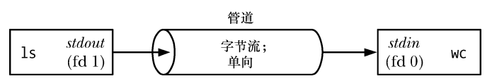
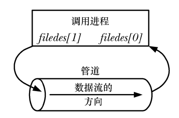
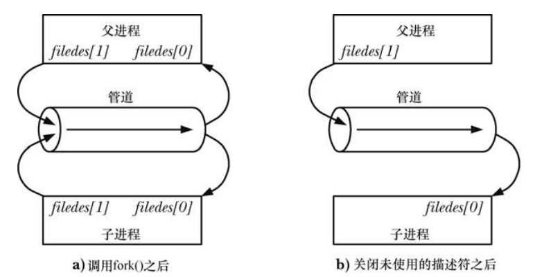
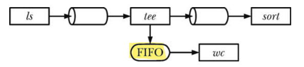
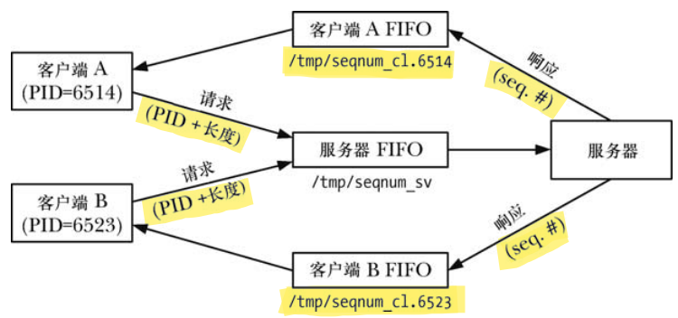
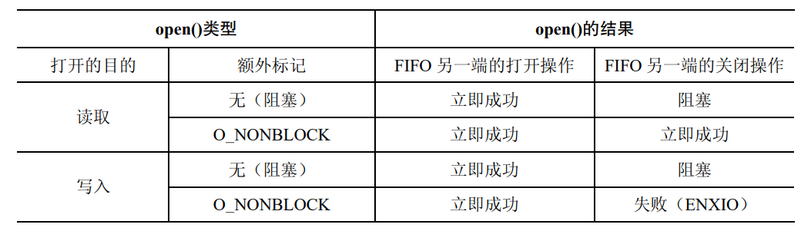
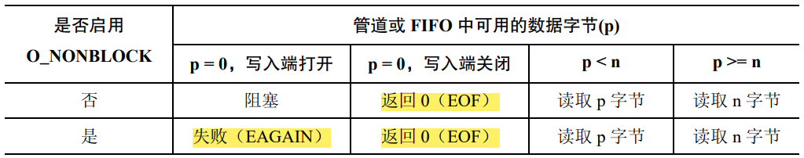
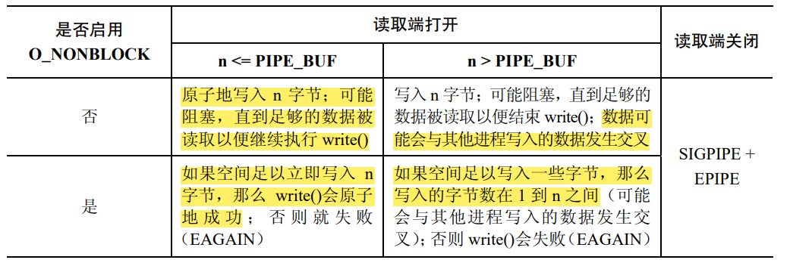

## 管道

### 1.概述

每个 shell 用户都对在命令中使用管道比较熟悉，如下面这个统计一个目录中文件的数目的命令所示：

```shell
$ ls | wc -l
```

为执行上面的命令，shell 创建了两个进程来分别执行 ls 和 wc。（这是通过使用 **`fork()`** 和 **`exec()`** 来完成的），示例图如下所示：

<div align="center">
    
</div>

在上图中 ls 和 wc 两个进程均链接到管道中，这样写入进程（ls）就将其标准输出（文件描述符为 1）连接到了管道的写入端，读取进程（wc）就将其标准输入（文件描述符为 0）连接到管道的读取端。实际上，这两个进程并不知道管道的存在，它们只是从标准文件描述符中读取数据和写入数据。

下面介绍管道的几个特征：

#### 1.1 一个管道是一个字节流

当讲到管道是一个字节流时意味着**在使用管道时是不存在消息或消息边界**的概念的。从管道中读取数据的进程可以读取任意大小的数据块，而不管写入进程写入管道的数据块的大小是什么。**从管道中读取出来的字节的顺序与它们被写入管道的顺序是完全一样的**。在管道中无法使用 lseek() 来随机地访问数据。

#### 1.2 从管道中读取数据

从管道中读取数据会有以下两种特殊情况：
- 如果试图从一个当前为空的管道中读取数据将会被阻塞直到至少有一个字节被写入到管道中为止；
- 如果管道的写入端被关闭了，那么从管道中读取数据的进程在读完管道中剩余的所有数据之后将会看到文件结束（即 **`read()`** 返回 0）；

#### 1.3 管道是单向的

在管道中数据的传递方向是单向的。管道的一端用于写入，另一端则用于读取。为了使用双向管道的功能，**可以使用 UNIX domain 流 socket 对（通过使用 **`socketpair()`** 系统调用来创建）**，它提供了一种标准的双向通信机制，并且其语义与流管道是等价的。

#### 1.4 可以确保写入不超过 PIPE_BUF 字节的操作是原子的

查看一下 manual 手册中关于 **`PIPE_BUF`** 的描述：

> POSIX.1-2001 says that **_write(2)s of less than PIPE_BUF bytes must be atomic: the output data is written to the pipe as a contiguous sequence.  Writes of more than PIPE_BUF bytes may be nonatomic: the kernel may interleave the data with data written by other processes_**. POSIX.1-2001 requires PIPE_BUF to be at least 512 bytes. (On Linux, PIPE_BUF is 4096 bytes.) The precise semantics depend on whether the file descriptor is nonblocking (O_NONBLOCK), whether there are multiple writers to the pipe, and on n, the number of bytes to be written:

**1).`O_NONBLOCK` disabled, `n <= PIPE_BUF`**

All n bytes are written atomically; **`write(2)`** may block if there is not room for n bytes to be written immediately.
阻塞模式时且 **`n < PIPE_BUF`**: 写入具有原子性，如果没有足够的空间供 n 个字节全部写入，则阻塞直到有足够空间将 n 个字节全部写入管道.

**2).`O_NONBLOCK` enabled, `n <= PIPE_BUF`**

If there is room to write n bytes to the pipe, then **`write(2)`** succeeds immediately, writing all n bytes; otherwise **`write(2)`** fails, with errno set to **`EAGAIN`**.
非阻塞模式时且 **`n < PIPE_BUF`**：写入具有原子性，立即全部成功写入，否则一个都不写入，返回错误.

**3).`O_NONBLOCK` disabled, `n > PIPE_BUF`**

The write is nonatomic: the data given to **`write(2)`** may be interleaved with **`write(2)s`** by other process; the **`write(2)`** blocks until n bytes have been written.
阻塞模式时且 **`n > PIPE_BUF`**：不具有原子性，可能中间有其他进程穿插写入，直到将 n 字节全部写入才返回，否则阻塞等待写入.

**4).`O_NONBLOCK` enabled, `n > PIPE_BUF`**

If the pipe is full, then **`write(2)`** fails, with errno set to **`EAGAIN`**.  Otherwise, from 1 to n bytes may be written (i.e., a "partial write" may occur; the caller should check the return value from **`write(2)`** to see how many bytes were actually written), and these bytes may be interleaved with writes by other processes.
非阻塞模式时且 **`n > PIPE_BUF`**：如果管道满的，则立即失败，一个都不写入，返回错误，如果不满，则返回写入的字节数为 1 ~ n，即部分写入，写入时可能有其他进程穿插写入.

当要写入的字节数 **`n > PIPE_BUF`** 时，**`O_NONBLOCK`** 开启或者关闭，写入的字节数据都不是原子的，可能会和其它进程写入的数据混合，只不过如果是非阻塞的，那么会存在部分写入的情况，而如果是阻塞的，那么写进程会阻塞直到将所有的数据都写入到管道中。

```c{.line-numbers}
#include<sys/types.h>
#include<sys/stat.h>
#include<unistd.h>
#include<fcntl.h>
#include<stdio.h>
#include<stdlib.h>
#include<errno.h>
#include<string.h>
#include<signal.h>
#define ERR_EXIT(m) \
    do { \
        perror(m); \
        exit(EXIT_FAILURE); \
    } while(0)

#define TEST_SIZE 68*1024 // 68KB
/* 默认 O_NONBLOCK disabled ，这里验证 size > PIPE_BUF(4K) 的情况 */
int main(int argc, char *argv[]) {
    char a[TEST_SIZE];
    char b[TEST_SIZE];

    memset(a, 'A', sizeof(a));
    memset(b, 'B', sizeof(b));

    int pipefd[2];
    int ret = pipe(pipefd);
    if (ret == -1)
        ERR_EXIT("pipe error");

    int pid = fork();
    if (pid == 0) {
        close(pipefd[0]);
        /* a 进程阻塞直到将所有 a 字符串写入到管道中，全部写完才返回 */
        ret = write(pipefd[1], a, sizeof(a)); 
        printf("apid=%d write %d bytes to pipe\n", getpid(), ret);
        exit(0);
    }

    pid = fork();

    if (pid == 0) {
        close(pipefd[0]);
        /* b 进程阻塞直到将所有 b 字符串写入到管道中，全部写完才返回 */
        ret = write(pipefd[1], b, sizeof(b));
        printf("bpid=%d write %d bytes to pipe\n", getpid(), ret);
        exit(0);
    }

    close(pipefd[1]);
    sleep(1);

    int fd = open("test.txt", O_WRONLY | O_CREAT | O_TRUNC, 0664);
    char buf[1024 * 4] = {0};
    int n = 1;
    while (1) {
        // 当管道被写入数据，就已经可以开始读了，每次读取 4k
        ret = read(pipefd[0], buf, sizeof(buf));
        // 管道写端全部关闭，即读到了结尾 
        if (ret == 0) 
            break;
        printf("n=%02d pid=%d read %d bytes from pipe buf[4095]=%c\n", n++, getpid(), ret, buf[4095]);
        write(fd, buf, ret);
    }

    return 0;
}
```

输出如下所示：

```shell{.line-numbers}
simba@ubuntu:~/Documents/code/linux_programming/APUE/pipe$ ./pipe_buf 
n=01 pid=7137 read 4096 bytes from pipe buf[4095]=B
n=02 pid=7137 read 4096 bytes from pipe buf[4095]=B
n=03 pid=7137 read 4096 bytes from pipe buf[4095]=B
n=04 pid=7137 read 4096 bytes from pipe buf[4095]=B
n=05 pid=7137 read 4096 bytes from pipe buf[4095]=B
n=06 pid=7137 read 4096 bytes from pipe buf[4095]=B
n=07 pid=7137 read 4096 bytes from pipe buf[4095]=B
n=08 pid=7137 read 4096 bytes from pipe buf[4095]=B
n=09 pid=7137 read 4096 bytes from pipe buf[4095]=B
n=10 pid=7137 read 4096 bytes from pipe buf[4095]=B
n=11 pid=7137 read 4096 bytes from pipe buf[4095]=B
n=12 pid=7137 read 4096 bytes from pipe buf[4095]=B
n=13 pid=7137 read 4096 bytes from pipe buf[4095]=B
n=14 pid=7137 read 4096 bytes from pipe buf[4095]=B
n=15 pid=7137 read 4096 bytes from pipe buf[4095]=B
n=16 pid=7137 read 4096 bytes from pipe buf[4095]=B
n=17 pid=7137 read 4096 bytes from pipe buf[4095]=A
n=18 pid=7137 read 4096 bytes from pipe buf[4095]=A
n=19 pid=7137 read 4096 bytes from pipe buf[4095]=A
n=20 pid=7137 read 4096 bytes from pipe buf[4095]=A
n=21 pid=7137 read 4096 bytes from pipe buf[4095]=A
n=22 pid=7137 read 4096 bytes from pipe buf[4095]=A
n=23 pid=7137 read 4096 bytes from pipe buf[4095]=A
n=24 pid=7137 read 4096 bytes from pipe buf[4095]=A
n=25 pid=7137 read 4096 bytes from pipe buf[4095]=A
n=26 pid=7137 read 4096 bytes from pipe buf[4095]=A
apid=7138 write 69632 bytes to pipe
n=27 pid=7137 read 4096 bytes from pipe buf[4095]=A
n=28 pid=7137 read 4096 bytes from pipe buf[4095]=A
n=29 pid=7137 read 4096 bytes from pipe buf[4095]=A
n=30 pid=7137 read 4096 bytes from pipe buf[4095]=A
n=31 pid=7137 read 4096 bytes from pipe buf[4095]=A
n=32 pid=7137 read 4096 bytes from pipe buf[4095]=A
n=33 pid=7137 read 4096 bytes from pipe buf[4095]=A
n=34 pid=7137 read 4096 bytes from pipe buf[4095]=B
bpid=7139 write 69632 bytes to pipe
```

现在的情况是有两个子进程 A 和 B 在对管道进行**阻塞写入各 68k，即每个子进程完全写入 68k 才返回（管道描述符是阻塞的）**，而父进程对管道进行阻塞读取，每次读取 4k，打印每 4k 中的最后一个字符，**如果没有数据到达就阻塞等待**，如果管道剩余数据不足 4k，read 很可能返回 < 4k，但因为我们写入 68k 是 4k 整数倍，故不存在这种情况。

需要注意的是是边写边读，因为前面说过管道的容量只有 64k（65536），当管道被写满时子进程就阻塞等待父进程读取后再写入。**由上面输出可以看出 B 进程先写入 64k 的 B，然后 A 进程写入 68k 的 A 之后 B 进程接着写完最后 4K 的 B，然后 write 返回**。由 A 进程 write 完毕输出的提示可知此时 A 进程已经写完成了，但父进程还没读取 A 完毕，当两个子进程全部写完退出时关闭写端文件描述符，则父进程 read 就会返回 0，退出 while 循环。可以得出结论：**当多个进程对管道进行写入，且一次性写入数据量大于 **`PIPE_BUF`** 时，则不能保证写入的原子性，即可能数据是穿插着的**。在 Linux 上，**`PIPE_BUF`** 的值是 4096。

当写入管道的数据块的大小超过了 **`PIPE_BUF`** 字节，那么内核可能会将数据分割成几个较小的片段来传输，在读者从管道中消耗数据时再附加上后续的数据。（**`write()`** 调用会阻塞直到所有数据被写入到管道为止）当只有一个进程向管道写入数据时（通常的情况），**`PIPE_BUF`** 的取值就没有关系了。但如果有多个写入进程，**那么大数据块的写入可能会被分解成任意大小的段（可能会小于 **`PIPE_BUF`** 字节），并且可能会出现与其他进程写入的数据交叉的现象**。

> 在 Linux 2.2 上，向管道写入任意数量的数据都是原子的，除非写入操作被一个信号处理器中断了。在 Linux 2.4 以及后续的版本上，写入数据量大于 **`PIPE_BUF`** 字节的所有操作都可能会与其他进程的写入操作发生交叉。

#### 1.5 管道的容量是有限的

管道其实是一个在内核内存中维护的缓冲器，这个缓冲器的存储能力是有限的。一旦管道被填满之后，后续向该管道的写入操作就会被阻塞直到读者从管道中移除了一些数据为止。

A pipe has a limited capacity.  If the pipe is full, then a **`write(2)`** will block or fail, depending on whether the **`O_NONBLOCK`** flag is set (see below).  Different implementations have different limits for the pipe capacity. Applications should not rely on a particular capacity: an application should be designed so that a reading process consumes data as soon as it is available, so that a writing process does not remain blocked.

In Linux versions before 2.6.11, the capacity of a pipe was the same as the system page size (e.g., 4096 bytes on i386). **_Since Linux 2.6.11, the pipe capacity is 65536 bytes_**.

从理论上来讲，没有任何理由可以支持存储能力较小的管道无法正常工作这个结论，哪怕管道的存储能力只有一个字节。使用较大的缓冲器的原因是效率：**每当写者充满管道时，内核必须要执行一个上下文切换以允许读者被调度来消耗管道中的一些数据。使用较大的缓冲器意味着需执行的上下文切换次数更少**。

从 Linux 2.6.35 开始就可以修改一个管道的存储能力了。Linux 特有的 **`fcntl(fd, F_SETPIPE_SZ, size)`** 调用会将 fd 引用的管道的存储能力修改为至少 size 字节。非特权进程可以将管道的存储能力修改为范围在系统的页面大小到 **`/proc/sys/fs/pipe-max-size`** 中规定的值之内的任何一个值。**`pipe-max-size`** 的默认值是 1048576 字节。特权（**`CAP_SYS_RESOURCE`**）进程可以覆盖这个限制。在为管道分配空间时，内核可能会将 size 提升为对实现来讲更加便捷的某个值。**`fcntl(fd, F_GETPIPE_SZ)`** 调用返回为管道分配的实际大小。

### 2.管道的创建与使用

#### 2.1 创建管道

pipe 系统调用创建一个新管道。

```c{.line-numbers}
#include <unistd.h>
/* returns 0 on success, or -1 on error */
int pipe(int filedes[2]);
```

成功的 **`pipe()`** 调用会在数组 filedes 中返回两个打开的文件描述符：一个表示管道的读取端（**`filedes[0]`**），另一个表示管道的写入端（**`filedes[1]`**）。

与所有文件描述符一样，可以使用 **`read()`** 和 **`write()`** 系统调用来在管道上执行 I/O。一旦向管道的写入端写入数据之后立即就能从管道的读取端读取数据。在创建完管道之后处理文件的描述符：

<div align="center">
    
</div>

在单个进程中管道的用途不多。**一般来讲都是使用管道让两个进程进行通信**。为了让两个进程通过管道进行连接，在调用完 **`pipe()`** 之后可以调用 **`fork()`**。在 **`fork()`** 期间，子进程会继承父进程的文件描述符的副本。

<div align="center">
    
</div>

虽然父进程和子进程都可以从管道中读取和写入数据，但这种做法并不常见。因此，在 **`fork()`** 调用之后，其中一个进程应该立即关闭管道的写入端的描述符，另一个则应该关闭读取端的描述符，如上图中的 b 端。

让父进程和子进程都能够从同一个管道中读取和写入数据这种做法并不常见的一个原因是如果两个进程同时试图从管道中读取数据，**那么就无法确定哪个进程会首先读取成功——两个进程竞争数据了**。要防止这种竞争情况的出现就需要使用某种同步机制。**但如果需要双向通信则可以使用一种更加简单的方法：创建两个管道，在两个进程之间发送数据的两个方向上各使用一个**。

> 虽然可以有多个进程向单个管道中写入数据，但通常只存在一个写者。

#### 2.2 管道用于进程间通信

管道除了可以用于父进程与子进程之间的通信，管道可以用于任意两个（或更多）相关进程之间的通信，只要在创建子进程的系列 **`fork()`** 调用之前通过一个共同的祖先进程创建管道即可。**管道通常用于两个兄弟进程之间的通信——它们的父进程创建了管道，然后创建两个子进程**。这就是在构建管道线时 shell 所做的工作。

#### 2.3 关闭未使用管道文件描述符

关闭未使用管道文件描述符不仅仅是为了确保进程不会耗尽其文件描述符的限制。从管道中读取数据的进程会关闭其持有的管道的写入描述符，这样当其他进程完成输出并关闭其写入描述符之后，读者就能够看到文件结束（在读完管道中的数据之后）。

**如果读取进程没有关闭管道的写入端，那么在其他进程关闭了写入描述符之后，读者也不会看到文件结束**，即使它读完了管道中的所有数据。相反，**`read()`** 将会阻塞以等待数据，这是因为内核知道至少还存在一个管道的写入描述符打开着，即读取进程自己打开了这个描述符。从理论上来讲，这个进程仍然可以向管道写入数据，即使它已经被读取操作阻塞了。这种场景就是 **`read()`** 可能被一个向管道写入数据的信号处理器中断。

当一个进程试图向一个管道中写入数据但没有任何进程拥有该管道的打开着的读取描述符时，内核会向写入进程发送一个 **`SIGPIPE`** 信号。收到 **`SIGPIPE`** 信号或得到 **`EPIPE`** 错误对于标示出管道的状态是有用的，这就是为何需要关闭管道的未使用读取描述符的原因。

如果写入进程没有关闭管道的读取端，那么即使在其他进程已经关闭了管道的读取端之后写入进程仍然能够向管道写入数据，最后写入进程会将数据充满整个管道，后续的写入请求会被永远阻塞。

关闭未使用文件描述符的最后一个原因是只有当所有进程中所有引用一个管道的文件描述符被关闭之后才会销毁该管道以及释放该管道占用的资源以供其他进程复用。此时，管道中所有未读取的数据都会丢失。

> 通常，当 **`write()`**（或其他"慢"系统调用）被一个信号处理器中断时，这个调用会根据是否使用 **`sigaction()`** 的 **`SA_RESTART`** 标记安装了处理器而自动重启或因 **`EINTR`** 错误而失败。对 **`SIGPIPE`** 的处理不同是**因为自动重启 **`write()`** 或简单标示出 **`write()`** 被一个处理器中断了是毫无意义的**（意味着需要手工重启 **`write()`**）。不管是何种处理方式，后续的 **`write()`** 都不会成功，**因为管道仍然处于被损坏的状态**。

### 3.将管道作为一种进程间同步的方法

下面这个程序创建了多个子进程（每个命令行参数对应一个子进程），每个子进程都完成某个动作，在本例中则是睡眠一段时间。父进程等待直到所有子进程完成了自己的动作为止。

为了执行同步，父进程在创建子进程之前构建了一个管道。每个子进程会继承管道的写入端的文件描述符并在完成动作之后关闭这些描述符。**当所有子进程都关闭了管道的写入端的文件描述符之后，父进程在管道上的 **`read()`** 就会结束并返回文件结束（0）**。这时，父进程就能够做其他工作了。（注意在父进程中关闭管道的未使用写入端对于这项技术的正常运转是至关重要的，否则父进程在试图从管道中读取数据时会被永远阻塞）。

```c{.line-numbers}
void err_exit(const char* str) {
    printf("%s\n", str);
    exit(EXIT_FAILURE);
}

int main(int argc, char* argv[]) {

    int pfd[2];
    int j, dummy;

    setbuf(stdout, NULL);
    printf("%s parent started\n", curr_time("%T"));

    if (pipe(pfd) == 1)
        err_exit("pipe");

    for (j = 1; j < argc; j++) {
        switch (fork()) {
            case -1:
                err_exit("fork");

            case 0:
                /* child */
                /* read end is unused */
                if (close(pfd[0]) == -1)
                    err_exit("close");

                /* child does some work, and lets parent know it's done */
                sleep(getInt(argv[j], GN_NONNEG, "sleep-time"));
                printf("%s child %d (pid=%ld) closing pipe\n", curr_time("%T"), j, (long) getpid());

                /* write end is unused */
                if (close(pfd[1]) == -1)
                    err_exit("close");

                /* child now carries on to do other things */
                exit(EXIT_SUCCESS);

            default:
                break;
        }
    }

    /* parent comes here; close write end of pipe so we can see EOF */
    if (close(pfd[1]) == -1)
        err_exit("close");

    if (read(pfd[0], &dummy, 1) != 0)
        err_exit("parent didn't get EOF");

    printf("%s parent ready to go\n", curr_time("%T"));

    /* parent can now carry on to do other things */
    exit(EXIT_SUCCESS);
}
```

上述程序运行的结果如下所示：

```shell
xuweilin@xvm:~/CLionProjects/http_parser$ ./pipe_sync 2 4 6
19:22:55 parent started
19:22:57 child 1 (pid=2914) closing pipe
19:22:59 child 2 (pid=2915) closing pipe
19:23:01 child 3 (pid=2916) closing pipe
19:23:01 parent ready to go
```

### 4.使用管道连接过滤器

当管道被创建之后，为管道的两端分配的文件描述符是可用描述符中数值最小的两个。由于在通常情况下，进程已经使用了描述符 0、1 和 2，因此会为管道分配一些数值更大的描述符。那么如何使用管道连接两个过滤器（即从 **`stdin`** 读取和写入到 **`stdout`** 的程序）使得一个程序的标准输出被定向到管道中，而另一个程序的标准输入则从管道中读取？

第一种方案，我们可以使用 **`dup()`** 函数复制文件描述符，**`dup(int oldfd)`** 函数接受一个旧的文件描述符 oldfd 作为参数，并返回一个新的文件描述符。**新的文件描述符是当前可用的最小整数值，对应于与 oldfd 相同的打开文件**。调用过程如下所示：

```c{.line-numbers}
int pfd[2];

pipe(pfd);

/* other steps here, e.g., fork() */
/* free file descriptor 1 */
close(STDOUT_FILENO);
/* duplication uses lowest free file descriptor, i.e., fd 1 */
dup(pfd[1]);
```

上面这些调用的最终结果是进程的标准输出被绑定到了管道的写入端。而对应的一组调用可以用来将进程的标准输入绑定到管道的读取端上。如果在执行上面的调用之前文件描述符 0 已经被关闭了，那么就会错误地将进程的标准输入绑定到管道的写入端上。

第二种方案，为避免这种情况的发生，可以使用 **`dup2()`** 调用来取代对 **`close()`** 和 **`dup()`** 的调用。**`dup2()`** 函数接受两个参数，oldfd 和 newfd。它会将 oldfd 所引用的打开文件复制到 newfd 所引用的文件描述符。如果 newfd 已经是一个打开的文件描述符，则会首先关闭它，然后再进行复制。

在 UNIX 系统中，每个进程都有一个文件描述符表，该表记录了该进程打开的文件描述符以及它们对应的文件或其他资源。每个文件描述符都包含一个指向文件表项的索引，文件表项中维护了文件的相关信息，如文件位置、权限等。当调用 **`dup2()`** 函数时，如果 newfd 已经是一个打开的文件描述符，那么为了将 oldfd 复制到 newfd，**就需要先清空 newfd 的文件表项，以便将其重新指向 oldfd 的文件表项**。为了实现这一点，需要先关闭 newfd，然后再进行复制操作。调用过程如下所示：

```c{.line-numbers}
/* close descriptor 1, and reopen bound to write end of pipe */
dup2(pfd[1], STDOUT_FILENO);
```

在复制完 **`pfd[1]`** 之后就拥有两个引用管道的写入端的文件描述符了：描述符 1 和 **`pfd[1]`**。由于未使用的管道文件描述符应该被关闭，因此在 **`dup2()`** 调用之后需要关闭多余的描述符：`close(pfd[1]);`。

假设，在 **`pipe()`** 调用之前，标准输入和标准输出都被关闭了。那么在这种情况下，**`pipe()`** 就会给管道分配这两个描述符，即 **`pfd[0]`** 的值可能为 0，**`pfd[1]`** 的值可能为 1，上面第二种方案的调用等同于：

```c{.line-numbers}
/* does nothing */
dup2(1, 1);
/* closes sole descriptor for write end of pipe */
close(1);
```

因此，按照防御性编程的规则，应该改成如下模式：

```c{.line-numbers}
if (pfd[1] != STDOUT_FILENO) {
    dup2(pfd[1], STDOUT_FILENO);
    close(pfd[1]);
}
```

下面程序使用本节提到的技术，首先创建了两个进程，在构建完一个管道之后，这个程序创建了两个子进程。第一个子进程将其标准输出绑定到管道的写入端，然后执行 ls。第二个子进程将其标准输入绑定到管道的写入端，然后执行 wc。

```c{.line-numbers}
void err_exit(const char* str) {
    printf("%s\n", str);
    exit(EXIT_FAILURE);
}

int main(int argc, char* argv[]) {

    int pfd[2];

    if (pipe(pfd) == -1)
        err_exit("pipe");

    switch (fork()) {
        case -1:
            err_exit("fork");

        case 0:
            /* first child: exec 'ls' to write to pipe */
            /* read end is unused */
            if (close(pfd[0]) == -1)
                err_exit("close 1");

            /* duplicate stdout on write end of pipe; close duplicated descriptor */
            if (pfd[1] != STDOUT_FILENO) {
                if (dup2(pfd[1], STDOUT_FILENO) == -1)
                    err_exit("dup2 1");
                if (close(pfd[1]) == -1)
                    err_exit("close 2");
            }

            execlp("ls", "ls", (char*) NULL);
            err_exit("execlp ls");

        default:
            break;
    }

    switch (fork()) {
        case -1:
            err_exit("fork");

        case 0:
            /* second child: exec 'wc -l' to read from pipe */
            /* write end is unused */
            if (close(pfd[1]) == -1)
                err_exit("close 3");

            /* duplicate stdin on read end of pipe; close duplicated descriptor */
            if (pfd[0] != STDIN_FILENO) {
                if (dup2(pfd[0], STDIN_FILENO) == -1)
                    err_exit("dup2 2");
                if (close(pfd[0]) == -1)
                    err_exit("close 4");
            }

            execlp("wc", "wc", "-l", (char*) NULL);
            err_exit("execlp wc");

        default:
            break;
    }

    /* parent closes unused file descriptors for pipe, and waits for children */
    if (close(pfd[0]) == -1)
        err_exit("close 5");
    if (close(pfd[1]) == -1)
        err_exit("close 6");
    if (wait(NULL) == -1)
        err_exit("wait 1");
    if (wait(NULL) == -1)
        err_exit("wait 2");

    exit(EXIT_SUCCESS);
}
```

上述程序的运行结果如下所示：

```shell
xuweilin@xvm:~/CLionProjects/http_parser$ ./pipe_ls_wc 
57
xuweilin@xvm:~/CLionProjects/http_parser$ ls | wc -l
57
```

### 5.FIFO

#### 5.1 FIFO 概述

**`FIFO`** 与管道类似，**它们两者之间最大的差别在于 **`FIFO`** 在文件系统中拥有一个名称**，并且其打开方式与打开一个普通文件是一样的。这样就能够将 **`FIFO`** 用于非相关进程之间的通信（如客户端和服务器）。

一旦打开了 FIFO，就能在它上面使用与操作管道和其他文件的系统调用一样的 I/O 系统调用了。与管道一样，FIFO 也有一个写入端和读取端，并且从管道中读取数据的顺序与写入的顺序是一样的。FIFO 有时候也被称为命名管道。与管道一样，当所有引用 FIFO 的描述符都被关闭之后，所有未被读取的数据会被丢弃。**`mkfifo()`** 函数创建一个名为 pathname 的全新的 FIFO。

```c{.line-numbers}
#include <sys/stat.h>
/* returns 0 on success, or -1 on error */
int mkfifo(const char* pathname, mode_t mode);
```

一般来讲，使用 FIFO 时唯一明智的做法是在两端分别设置一个读取进程和一个写入进程。这样在默认情况下，**打开一个 FIFO 以便读取数据（`open()` **`O_RDONLY`** 标记）将会阻塞直到另一个进程打开 FIFO 以写入数据（`open()` `O_WRONLY` 标记）为止**。相应地，打开一个 FIFO 以写入数据将会阻塞直到另一个进程打开 FIFO 以读取数据为止。换句话说，打开一个 FIFO 会同步读取进程和写入进程。如果一个 FIFO 的另一端已经打开（可能是因为一对进程已经打开了 FIFO 的两端），那么 **`open()`** 调用会立即成功。

在大多数 UNIX 实现（包括 Linux）上，当打开一个 FIFO 时可以通过指定 **`O_RDWR`** 标记来绕过打开 FIFO 时的阻塞行为。这样，**`open()`** 就会立即返回，但无法使用返回的文件描述符在 FIFO 上读取和写入数据。这是不推荐使用 O_RDWR 来打开 FIFO 的第一个理由。

> 在打开一个 FIFO 时避免使用 **`O_RDWR`** 标记还有另外一个原因。当采用那种方式调用 **`open()`** 之后，调用进程在从返回的文件描述符中读取数据时永远都不会看到文件结束，**因为永远都至少存在一个文件描述符被打开着以等待数据被写入 FIFO**，即进程从中读取数据的那个描述符。

#### 5.2 使用 FIFO 和 tee 创建双重管道线

shell 管道线的其中一个特征是它们是线性的，管道线中的每个进程都读取前一个进程产生的数据并将数据发送到其后一个进程中。使用 FIFO 就能够在管道线中创建子进程，这样除了将一个进程的输出发送给管道线中的后面一个进程之外，还可以复制进程的输出并将数据发送到另一个进程中。要完成这个任务需要使用 tee 命令，**它将其从标准输入中读取到的数据复制两份并输出：一份写入到标准输出，另一份写入到通过命令行参数指定的文件中（这个文件可以是 FIFO 文件）**。

将传给 tee 命名的 file 参数设置为一个 FIFO 可以让两个进程同时读取 tee 产生的两份数据。下面的 shell 会话演示了这种用法，它创建了一个名为 myfifo 的 FIFO，然后在后台启动一个 wc 命令，该命令会打开 FIFO 以读取数据（**这个操作会阻塞直到有进程打开 FIFO 写入数据为止**），接着执行一条管道线将 ls 的输出发送给 tee，tee 会将输出传递给管道线中的下一个命令 sort，同时还会将输出发送给名为 myfifo 的 FIFO。

```shell
$ mkfifo myfifo
$ wc -l < myfifo &
$ ls -l | tee myfifo | sort -k5n
```

上面的例子中数据流向如下所示：

<div align="center">
    
</div>

#### 5.3 使用 FIFO 实现客户端/服务端应用程序

本程序的结构图如下所示，**每个客户端向服务器发送的消息的长度是固定的**，每个发送给服务器的请求都包含了客户端的进程 ID，这样服务器就能够构建客户端用来接收响应的 **`FIFO`** 的名称了。请求中还包含了一个 **`seqLen`** 字段，**它指定了应该为这个客户端分配的序号的数量**。服务器向客户端发送的响应消息由一个字段 **`seqNum`** 构成，**它是为这个客户端分配的一组序号的起始值**。

<div align="center">
    
</div>

下面是服务端和客户端的公共头文件：

```c{.line-numbers}
#ifndef HTTP_PARSER_FIFO_SEQNUM_H
#define HTTP_PARSER_FIFO_SEQNUM_H

#include "sys/types.h"
#include "sys/stat.h"
#include "fcntl.h"

/* well-known name for server's FIFO */
#define SERVER_FIFO "/tmp/seqnum_sv"
/* template for building client FIFO name */
#define CLIENT_FIFO_TEMPLATE "/tmp/seqnum_cl.%ld"
/* Space required for client FIFO pathname, +20 as a generous allowance for the PID */
#define CLIENT_FIFO_NAME_LEN (sizeof(CLIENT_FIFO_TEMPLATE) + 20)

struct request {
    /* pid of client */
    pid_t pid;
    /* length of desired sequence */
    int seq_len;
};

struct response {
    /* start of sequence */
    int seq_num;
};

#endif //HTTP_PARSER_FIFO_SEQNUM_H
```

下面是服务端的源代码：

- 创建服务器的众所周知的 FIFO 并打开 FIFO 以便读取。服务器必须要在客户端之前运行，这样服务器 FIFO 在客户端试图打开它之前就已经存在了；
- 服务器的 **`open()`** 调用将会阻塞直到第一个客户端打开了服务器的 FIFO 的另一端以写入数据为止；
- 再次打开服务器的 FIFO，这次是为了写入数据（dummy write），第二个打开操作是为了确保服务器在所有客户端关闭了 FIFO 的写入端之后不会看到文件结束；
- 忽略 **`SIGPIPE`** 信号，这样如果服务器试图向一个没有读者的客户端 FIFO 写入数据时不会收到 **`SIGPIPE`** 信号（默认会杀死进程），而是会从 **`write()`** 系统调用中收到一个 **`EPIPE`** 错误；

```c{.line-numbers}
void err_exit(const char* msg) {
    printf("%s\n", msg);
    exit(EXIT_FAILURE);
}

int main(int argc, char* argv[]) {

    int server_fd, dummy_fd, client_fd;
    char client_fifo[CLIENT_FIFO_NAME_LEN];
    struct request req;
    struct response resp;
    int seq_num = 0;

    /* create well-known FIFO, and open it for reading */
    umask(0);
    if (mkfifo(SERVER_FIFO, S_IRUSR | S_IWUSR | S_IWGRP) == -1 && errno != EEXIST) {
        err_exit("mkfifo");
    }

    server_fd = open(SERVER_FIFO, O_RDONLY);
    if (server_fd == -1)
        err_exit("open fifo");

    /* open an extra write descriptor, so that we never see EOF */
    dummy_fd = open(SERVER_FIFO, O_WRONLY);
    if (dummy_fd == -1)
        err_exit("open fifo");

    if (signal(SIGPIPE, SIG_IGN) == SIG_ERR)
        err_exit("signal");

    /* read requests and send responses */
    for (;;) {
        if (read(server_fd, &req, sizeof(struct request)) != sizeof(struct request)) {
            /* either partial read or error */
            fprintf(stderr, "Error reading request; discarding\n");
            continue;
        }

        /* open client fifo (previously created by client) */
        snprintf(client_fifo, CLIENT_FIFO_NAME_LEN, CLIENT_FIFO_TEMPLATE, (long )req.pid);
        client_fd = open(client_fifo, O_WRONLY);
        if (client_fd == -1) {
            /* open failed, give up on client */
            fprintf(stderr, "open client fifo error\n");
            continue;
        }

        /* send response and close FIFO */
        resp.seq_num = seq_num;
        if (write(client_fd, &resp, sizeof(struct response)) != sizeof(struct response)) {
            fprintf(stderr, "error writing to FIFO %s\n", client_fifo);
        }

        if (close(client_fd) == -1)
            err_exit("close");

        /* update our sequence number */
        seq_num += req.seq_len;
    }

    return 0;
}
```

下面是客户端的代码：

- 创建一个 FIFO 以从服务器接收响应。这项工作是在发送请求之前完成的，这样才能确保 FIFO 在服务器试图打开它并向其发送响应消息之前就已经存在了；
- 构建一条发给服务器的消息，消息中包含了客户端的进程 ID 和一个指定了客户端希望服务器赋给它的序号长度的数字，如果没有提供命令行参数，那么默认的序号长度是 1；
- 打开服务器 FIFO 并将消息发送给服务器；
- 打开客户端 FIFO，然后读取和打印服务器的响应；

```c{.line-numbers}
static char client_fifo[CLIENT_FIFO_NAME_LEN];

static void remove_fifo(void) {
    unlink(client_fifo);
}

void err_exit(const char* msg) {
    printf("%s\n", msg);
    exit(EXIT_FAILURE);
}

int main(int argc, char* argv[]) {

    int server_fd, client_fd;
    struct request req;
    struct response resp;

    /* create our FIFO (before sending request, to avoid a race) */
    /* so we get the permissions we want */
    umask(0);
    snprintf(client_fifo, CLIENT_FIFO_NAME_LEN, CLIENT_FIFO_TEMPLATE, (long) getpid());

    if (mkfifo(client_fifo, S_IRUSR | S_IWUSR | S_IWGRP) == -1 && errno != EEXIST)
        err_exit("mkfifo");

    if (atexit(remove_fifo) != 0)
        err_exit("atexit");

    /* construct request message, open server FIFO, and send request */
    req.pid = getpid();
    req.seq_len = (argc > 1) ? getInt(argv[1], GN_GT_0, "seq-len") : 1;

    /* 从 SERVER_FIFO 中往其中写入 pid 和序号长度 */
    server_fd = open(SERVER_FIFO, O_WRONLY);
    if (server_fd == -1)
        err_exit("open fifo");

    if (write(server_fd, &req, sizeof(struct request)) != sizeof(struct request))
        err_exit("can't write to server");

    /* open our FIFO, read and display response */
    /* 从 CLIENT_FIFO 中读取响应，即序号开端 */
    client_fd = open(client_fifo, O_RDONLY);
    if (client_fd == 1)
        err_exit("open");

    if (read(client_fd, &resp, sizeof(struct response)) != sizeof(struct response))
        err_exit("can't read response from server");

    printf("%d\n", resp.seq_num);
    exit(EXIT_SUCCESS);
}
```

### 6.非阻塞 I/O

前面曾经提过当一个进程打开一个 FIFO 的一端时，如果 FIFO 的另一端还没有被打开，那么该进程会被阻塞，但有些时候阻塞并不是期望的行为，而这可以通过在调用 **`open()`** 时指定 **`O_NONBLOCK`** 标记来实现。

```c{.line-numbers}
fd = open("fifopath", O_RDONLY | O_NONBLOCK);
if (fd == -1)
    errExit("open");
```

如果 FIFO 的另一端已经被打开，**那么 **`O_NONBLOCK`** 对 **`open()`** 调用不会产生任何影响——它会像往常一样立即成功地打开 FIFO**。只有当 FIFO 的另一端还没有被打开的时候 **`O_NONBLOCK`** 标记才会起作用，而具体产生的影响则依赖于打开 FIFO 是用于读取还是用于写入的。

- 如果打开 FIFO 是为了读取，并且 FIFO 的写入端当前没有被打开，那么 **`open()`** 调用会立即成功（就像 FIFO 的另一端已经被打开一样）；
- 如果打开 FIFO 是为了写入，并且还没有打开 FIFO 的另一端来读取数据，那么 **`open()`** 调用会失败，并将 errno 设置为 **`ENXIO`**；

为读取而打开 FIFO 和为写入而打开 FIFO 时 **`O_NONBLOCK`** 标记所起的作用不同是有原因的。当 FIFO 的另一个端没有写者时打开一个 FIFO 以便读取数据是没有问题的，**因为任何试图从 FIFO 读取数据的操作都不会返回任何数据**。但当试图向没有读者的 FIFO 中写入数据时**将会导致 **`SIGPIPE`** 信号的产生以及 **`write()`** 返回 **`EPIPE`** 错误**。

<div align="center">
    
</div>

### 7.管道和 FIFO 中 read() 和 write() 的语义

下面这个表格对管道和 FIFO 上的 **`read()`** 操作进行了总结，包括 **`O_NONBLOCK`** 标记的作用：

<div align="center">
    
</div>

只有**当没有数据并且写入端被打开时**阻塞和非阻塞读取之间才存在差别。在这种情况下，普通的 **`read()`** 会被阻塞，而非阻塞 **`read()`** 会失败并返回 **`EAGAIN`** 错误。

下表对 write() 操作进行了总结，包括 **`O_NONBLOCK`** 和 **`PIPE_BUF`** 的作用，假设向一个管道中写入 n 个字节：

<div align="center">
    
</div>

当数据无法立即被传输时（数据无法被写入到 FIFO 管道中）**`O_NONBLOCK`** 标记会导致在一个管道或 FIFO 上的 **`write()`** 失败（错误是 **`EAGAIN`**）。这意味着当写入 **`PIPE_BUF`** 字节时，如果在管道或 FIFO 中没有足够的空间了，那么 **`write()`** 会失败，**因为内核无法立即完成这个操作并且无法执行部分写入**，否则就会破坏不超过 **`PIPE_BUF`** 字节的写入操作的原子性的要求。

当一次写入的数据量超过 **`PIPE_BUF`** 字节时，该写入操作无需是原子的。因此，**`write()`** 会尽可能多地传输字节（部分写）以充满管道或 FIFO。在这种情况下，从 **`write()`** 返回的值是实际传输的字节数，并且调用者随后必须要进行重试以写入剩余的字节。**但如果管道或 FIFO 已经满了，从而导致哪怕连一个字节都无法传输了**，那么 **`write()`** 会失败并返回 **`EAGAIN`** 错误。

