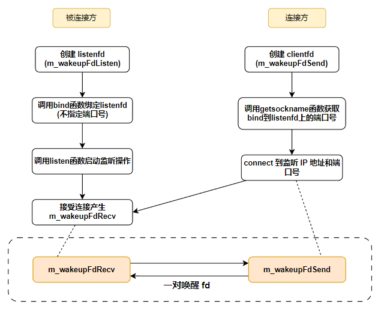

## One Thread One Loop 思想

### 1.one thread one loop 程序的基本结构

基于 Reactor 模式，我们引出 one thread one loop 思想，所谓 one thread one loop，翻译成中文的意思就是一个线程对应一个循环，这里说的线程针对的是网络相关的线程，**也就是说一个每个线程函数里面有一个循环流程，这些循环流程里面做的都是相同的事情**。这个线程函数的内容细节如下：

```c{.line-numbers}
// 线程函数
void thread_func(void* thread_arg)
{
	// 这里做一些需要的初始化工作
	while (线程退出标志)
	{
		// 步骤一：利用 select/poll/epoll 等 I/O 复用技术，分离出读写事件

		// 步骤二：处理读事件或写事件

		// 步骤三：做一些其他的事情
	}

	// 这里做一些需要的清理工作
}
```

关键部分是线程函数里面的 **while 循环部分**，步骤一利用 IO 复用技术分离出 socket 读写事件这里不再介绍了，前面已经介绍得足够多了。

重点是步骤二，处理读事件和可写事件，需要注意的是，在 Linux 操作系统下，除了 socket 对象以外，其他对象也可以挂到 IO 复用函数去（下面的章节中读者很快就会看到）。

这里我们暂时先讨论 socket 对象，以处理读事件为例：对于侦听 socket，我们认为它的读事件一般就是接收新连接“等”操作，注意这里的“等”我加了个引号，也就是说，我们不仅仅可以接收新连接，也可以多做一点事情，如将由 accep t函数新产生的客户端 socket 绑定到 IO 复用函数上去，创建代表连接的对象等等各种操作；对于普通的 socket 的读事件，在不考虑出错的情况下，我们可以调用 recv 或者 read 函数收取数据，甚至我们可以对收到的数据解包，并做一些业务逻辑的处理。举个例子，假设我们收到的数据经解包后发现是登陆请求包，我们可以接着处理这些登陆数据，并应答客户端。那么这里的处理读事件实际上就包括：收数据、解包、处理数据、应答客户端四个步骤。对于处理写事件，一般就是发送数据了。

步骤三，做一些其他的事情。其他的事情就具体问题具体对待了，如我们可以将上一步的解包或者验证数据放在这里。毕竟从程序的设计的结构来说，检测事件（步骤一）和收发数据这个属于网络通信层的工作，而解包和处理数据属于业务层的工作。一个良好的设计，这两个工作应该是分离的。当然，还可以做一些其他的事情，我们很快很介绍到。

### 2.线程的分工

根据上面介绍的线程函数中的循环结构，服务器端为了能流畅处理多个客户端连接，一般在某个线程 A 里面 accept 新的客户端连接并生成新连接的 socket，然后将这些新连接的 socket 传递给另外开的数个工作线程 B1、B2、B3、B4，这些工作线程继续处理这些新连接上的网络 IO 事件（即收发数据），同时，这些工作线程还处理系统中的另外一些事务。这里我们将线程 A 称为主线程，B1、B2、B3、B4 等称为工作线程（主从 Reactor 模式）。工作线程的代码框架上文介绍过了，我们使用伪代码表示一下：

```c{.line-numbers}
while (!m_bQuitFlag)
{
	epoll_or_select_func();

	handle_io_events();

	handle_other_things();
}
```

在 **epoll_or_select_func()** 中通过 select/poll/epoll 等 IO 复用函数去检测 socket 上的 IO 事件，若存在这些事件则下一步调用 **handle_io_events()** 来处理这些事件（收发数据），做完之后可能还要做一些其他任务，调用 **handle_other_things()** 即可。

这样做有三个好处：

1. 线程 A 只需要处理新连接的到来即可，不用处理网络 I/O 事件。如果在线程 A 里面既处理新连接又处理网络 I/O，__则可能由于线程忙于处理 I/O 事件，而无法及时处理客户端的新连接请求__，这是很不好的。
2. 线程 A 接受的新连接（每个连接对应一个 socket fd），可以根据一定的负载均衡策略将这些新的 socket 分配给各个工作线程。round robin （轮询策略）是其中一种很简便、常用的算法，即在假设不考虑中途有连接断开的情况，一个新连接来了分配给 B1，接着又来一个分配给 B2，再来一个分配给 B3，再来一个分配给 B4，如此反复。线程 A 会记录了各个工作线程上的 socket fd 数量，这样可以最大化地来平衡资源，避免一些工作线程"忙死"，另外一些工作线程"闲死"的现象。
3. 在工作线程不满载的情况下，可以让工作线程做其他的事情。比如现在有四个工作线程，但只有三个连接。那么线程 B4 就可以在 handle_other_thing() 做一些其他事情。

程序的这种基础框架需要解决一个很重要的效率问题：

在上述 while 循环里面，epoll_or_selec_func() 中的 poll/select/epoll_wait 等函数一般设置了一个超时时间。如果设置超时时间为 0，__那么在没有任何网络 I/O 事件和其他任务处理需要处理的情况下，这些工作线程实际上会空转__，白白地浪费 CPU 时间片；如果设置的超时时间大于 0，在没有网络 I/O 事件的情况，__poll/select/epoll_wait 等函数会在挂起指定时间后才能返回，导致需要 handle_other_thing() 不能及时执行__，导致其他任务不能及时处理，也就是说一旦有其他任务需要处理，由于 I/O 复用函数需要等待一段时间，导致这些其他任务在一定的延时后才能处理。这两种情形都不好。那如何解决该问题呢？

其实我们想达到的效果是，__如果没有网络 I/O 事件和其他任务要处理，那么这些工作线程最好直接挂起而不是空转；如果有其他任务要处理，这些工作线程要能立刻处理这些任务而不是在 poll/select/epoll_wait 等函数挂起指定时间后才开始处理这些任务__。

为此，我们仍然会给 poll/select/epoll_wait 等函数设置一定的超时事件，但对于 handle_other_thing() 函数的执行，我们采用一种特殊的唤醒策略。以 Linux 为例，不管 epoll_fd 上有没有文件描述符 fd，__我们都会它绑定一个特殊的 fd，这个 fd 被称为 wakeup fd（唤醒 fd）__。当我们有其他任务需要立即处理时，即让 handle_other_thing() 立刻执行，向这个唤醒 fd 上随便写入 1 个字节的，这样这个 fd 立即就变成可读的了，select/poll/epoll_wait 函数会立即被唤醒，并返回，接下来就可以马上执行 handle_other_thing() 函数了，其他任务就可以得到立即处理；反之，没有其他任务也没有网络 I/O 事件时，epoll_or_select_func() 就挂在那里什么也不做。

### 3.唤醒机制的实现

这个唤醒 fd 在 Linux 操作系统上可以通过以下几种方法实现：

#### 1.使用管道 fd（pipe）

创建一个管道，将管道的一端绑定到 epollfd 上，需要唤醒时，向管道的另一端写入一个字节，工作线程立即被唤醒。

```c{.line-numbers}
#include <unistd.h>

int pipe(int pipefd[2]);
```

```c{.line-numbers}
#include <fcntl.h>
#include <unistd.h>
int pipe2(int pipefd[2], int flags);
```

#### 2.使用 Linux 2.6 新增的 eventfd

```c{.line-numbers}
#include <sys/eventfd.h>
int eventfd(unsigned int initval, int flags);
```

eventfd 使用方法和管道 fd 使用方法一样，将生成的 eventfd() 函数返回的 eventfd 绑定到 epollfd上，需要唤醒时，向这个 eventfd 上写入一个字节，IO 复用函数被立即被唤醒。

#### 3.使用 socketpair

socketpair 是一对相互连接的 socket，相当于服务器端和客户端的两个端点，每一端都可以读写数据，向其中一端写入数据，就可以从另外一端读取数据。

```c{.line-numbers}
#include <sys/types.h>
#include <sys/socket.h>

int socketpair(int domain, int type, int protocol, int sv[2]);
```

调用这个函数返回的两个 socket 句柄就是 sv[0] 和 sv[1]，__在其中任何一个句柄上写入字节，在另外一个收取字节__。使用方法与上面其他两种一样，将收取的字节的 socket 句柄绑定到 epollfd 上。需要时，向另外一个写入的 socket 上写入一个字节，工作线程立即被唤醒。

需要注意的是，和创建普通 socket 稍微不同的是，创建 socketpair，**其第一个参数 domain 必须要设置成 AFX_UNIX**。

在 Windows 操作系统上，如果使用 select 函数作为 I/O 复用函数，由于 Windows 系统上的 select 只支持检测套接字这一种，__因此 Windows 上一般只能模仿 Linux 的 socketpair 的思路，即手动创建两个 socket，然后调用 connect/accept 函数建立一个连接__，相当于一个 socket 作为客户端连接 socket（调用 connect），去连接某个侦听 socket，另外一个 socket 作为侦听端接受连接后（调用 accept 函数）返回的 socket。__然后将读取数据的那一端的 socket 绑定到 select 函数上并检测其可读事件__。这是在写跨两个平台代码时，需要注意的地方。

> 这段文字中一共有三个 socket，这端的 socket（称为 A），调用 connect 函数传入，另外一端的侦听 socket（称为 B） 和调用 accept 函数返回的 socket（称为 C），我们这里唤醒使用 A 和 C。

#### 4.创建并唤醒 fd

下面我们看一个具体的例子：

```cpp{.line-numbers}
bool EventLoop::createWakeupfd()
{
#ifdef WIN32
    wakeupFdListen_ = sockets::createOrDie();
    wakeupFdSend_ = sockets::createOrDie();

    // Windows 上需要创建一对 socket
    struct sockaddr_in bindaddr;
    bindaddr.sin_family = AF_INET;
    bindaddr.sin_addr.s_addr = htonl(INADDR_LOOPBACK);
    // 将 port 设为 0，然后进行 bind，再接着通过 getsockname 来获取 port，这可以满足获取随机端口的情况。
    bindaddr.sin_port = 0;
    sockets::setReuseAddr(wakeupFdListen_, true);
    sockets::bindOrDie(wakeupFdListen_, bindaddr);
    sockets::listenOrDie(wakeupFdListen_);

    struct sockaddr_in serveraddr;
    int serveraddrlen = sizeof(serveraddr);
    if (getsockname(wakeupFdListen_, (sockaddr*)& serveraddr, &serveraddrlen) < 0)
    {
        // 让程序挂掉
        LOGF("Unable to bind address info, EventLoop: 0x%x", this);
        return false;
    }

    int useport = ntohs(serveraddr.sin_port);
    LOGD("wakeup fd use port: %d", useport);

    if (::connect(wakeupFdSend_, (struct sockaddr*) & serveraddr, sizeof(serveraddr)) < 0)
    {
        // 让程序挂掉
        LOGF("Unable to connect to wakeup peer, EventLoop: 0x%x", this);
        return false;
    }

    struct sockaddr_in clientaddr;
    socklen_t clientaddrlen = sizeof(clientaddr);
    wakeupFdRecv_ = ::accept(wakeupFdListen_, (struct sockaddr*) & clientaddr, &clientaddrlen);
    if (wakeupFdRecv_ < 0)
    {
        // 让程序挂掉
        LOGF("Unable to accept wakeup peer, EventLoop: 0x%x", this);
        return false;
    }

    sockets::setNonBlockAndCloseOnExec(wakeupFdSend_);
    sockets::setNonBlockAndCloseOnExec(wakeupFdRecv_);

#else
    // Linux上一个 eventfd 就够了，可以实现读写
    wakeupFd_ = ::eventfd(0, EFD_NONBLOCK | EFD_CLOEXEC);
    if (wakeupFd_ < 0)
    {
        // 让程序挂掉
        LOGF("Unable to create wakeup eventfd, EventLoop: 0x%x", this);
        return false;
    }

#endif

    return true;
}
```

上述代码中，有一个实现细节需要注意一下。在 Windows 平台上，作为服务端的一方，创建一个侦听 socket（代码中的 wakeupFdListen_）后，需要调用 bind 函数绑定特定的 ip 和端口号，__我们这里不要使用一个固定端口号，因为工作线程可能存在多个，一旦端口号固定，在创建下一个工作线程时，会因为端口号已经被占用导致 bind 函数调用失败__，导致其他工作线程无法创建出来。因此这里将端口号设置为 0（代码 12 行），操作系统会给我们分配一个可用的端口号。现在作为客户端一方，调用 connect 函数时需要指定明确的 ip 和端口号，这个时候 getsockname 函数就能获取到操作系统为 bind 函数分配的端口号（代码 19 行）。

#### 5.唤醒函数实现

```cpp{.line-numbers}
bool EventLoop::wakeup()
{
    uint64_t one = 1;
#ifdef WIN32
    int32_t n = sockets::write(wakeupFdSend_, &one, sizeof(one));
#else
    int32_t n = sockets::write(wakeupFd_, &one, sizeof(one));
#endif


    if (n != sizeof one)
    {
#ifdef WIN32
        DWORD error = WSAGetLastError();
        LOGSYSE("EventLoop::wakeup() writes %d  bytes instead of 8, fd: %d, error: %d", n, wakeupFdSend_, (int32_t)error);
#else
        int error = errno;
        LOGSYSE("EventLoop::wakeup() writes %d  bytes instead of 8, fd: %d, error: %d, errorinfo: %s", n, wakeupFd_, error, strerror(error));
#endif


        return false;
    }

    return true;
}
```

无论使用哪种 fd 作为唤醒 fd，一定要在唤醒后及时将唤醒 fd 中的数据读出来，即消耗掉这个 fd 的接收缓冲区里面的数据，否则可能会由于不断的调用，导致这个 fd 接受缓冲区被写满，导致下次唤醒失败（即向 fd 写入数据失败）。

#### 6.从唤醒 fd 中读取数据

```cpp{.line-numbers}
bool EventLoop::handleRead()
{
    uint64_t one = 1;
#ifdef WIN32
    int32_t n = sockets::read(wakeupFdRecv_, &one, sizeof(one));
#else
    int32_t n = sockets::read(wakeupFd_, &one, sizeof(one));
#endif

    if (n != sizeof one)
    {
#ifdef WIN32
        DWORD error = WSAGetLastError();
        LOGSYSE("EventLoop::wakeup() read %d  bytes instead of 8, fd: %d, error: %d", n, wakeupFdRecv_, (int32_t)error);
#else
        int error = errno;
        LOGSYSE("EventLoop::wakeup() read %d  bytes instead of 8, fd: %d, error: %d, errorinfo: %s", n, wakeupFd_, error, strerror(error));
#endif
        return false;
    }

    return true;
}
```

EventLoop::handleRead() 函数可以在触发唤醒 fd 的读事件后调用。以上的整个流程如下所示：

<div align="center">
    
</div>

#### 7.handle_other_things() 方法的逻辑

在了解了唤醒机制之后，我们来看一下 handle_other_things() 方法的使用，handle_other_things() 可以设计成从一个 "other_things" 集合中取出具体的任务来执行：

```cpp{.line-numbers}
void EventLoop::handle_other_things()
{
    std::vector<OtherThingFunctor> otherThingFunctors;
    callingPendingFunctors_ = true;

    {
        std::unique_lock<std::mutex> lock(mutex_);
        otherThingFunctors.swap(pendingOtherThingFunctors_);
    }

    for (size_t i = 0; i < otherThingFunctors.size(); ++i)
    {
        otherThingFunctors[i]();
    }
    
    callingPendingFunctors_ = false;
}
```

pendingOtherThingFunctors_ 这里是一个类成员变量，这里的实现使用了 std::vector，工作线程本身会从这个容器中取出任务来执行，这里我们将任务封装成一个个的函数对象，从容器中取出来直接执行就可以了。这里使用了一个特殊的小技巧，为了减小锁 （mutex_，也是成员变量，与 pendingOtherThingFunctors_ 作用域一致）的作用范围，提高程序执行效率，我们使用了一个局部变量 otherThingFunctors 将成员变量 pendingOtherThingFunctors_ 的中的数据倒换进这个局部变量中。

添加 "other_things"，**可以在任意线程添加（包括网络 I/O 线程与网络 I/O 之外的线程），也就是说可以在网络线程之外的线程中添加任务**，因此可能涉及到多个线程同时操作 pendingOtherThingFunctors_ 对象，因此需要对其使用锁（这里是 mutex_）进行保护。添加 "other_things" 代码如下：

```cpp{.line-numbers}
void EventLoop::queueInLoop(const Functor& cb)
{
    {
        std::unique_lock<std::mutex> lock(mutex_);
        pendingOtherThingFunctors_.push_back(cb);
    }
	
    // 如果在其他线程调用了这个函数，立即尝试唤醒 handle_other_things() 所在线程
    if (!isInLoopThread() || callingPendingFunctors_)
    {
        wakeup();
    }
}
```

最后，在某些程序结构中，根据需要执行的 other_things 的类型，可以存在多个 handle_other_things() 方法，程序结构就演变成了：

```cpp{.line-numbers}
while (!m_bQuitFlag)
{
	epoll_or_select_func();

	handle_io_events();

	handle_other_things1();
	
	handle_other_things2();
	
	handle_other_things3();
	
	// 根据实际需要可以有更多的 handle_other_things()
}
```

另外，handle_other_things() 系列的方法可以在 one thread one loop 结构中的 while 循环内部的任意位置，不一定非要放在 handle_io_events 函数后面，我们有时也称 handle_other_things() 为钩子函数（Hook Functions），例如：

```cpp{.line-numbers}
while (!m_bQuitFlag)
{
    handle_other_things1();

	epoll_or_select_func();

    handle_other_things2();

	handle_io_events();
	
	handle_other_things3();
	
	// 根据实际需要可以有更多的 handle_other_things()
}
```

#### 8.带上定时器的程序结构

定时器是程序常用的一个功能之一，上述结构中可以在线程循环执行流中加上检测和处理定时器事件的逻辑，添加的位置一般放在程序循环执行流的第一步。加上定时器逻辑后程序结构变为：

```cpp{.line-numbers}
while (!m_bQuitFlag)
{
	check_and_handle_timers();
	
	epoll_or_select_func();

	handle_io_events();

	handle_other_things();
}
```

这里需要注意的是，epoll_or_select_func() 中使用 IO 复用函数的超时时间尽量不要大于 check_and_handle_timers() 中所有定时器中的最小时间间隔，以免定时器逻辑处理延迟较多。

#### 9.one thread one loop 的效率保障

在整个 loop 结构中，为了保证各个步骤高效执行，除了 epoll_or_select_func 步骤中的 I/O 复用函数可能会造成等待，**在任何其他步骤中都不能有阻塞整个流程或者耗时的操作**。

如果业务决定了在定时器逻辑（对应 check_and_handle_timers 函数）、读写事件处理逻辑（对应 handle_io_events 函数）或其他自定义逻辑（对应 handle_other_things 函数）中有耗时的操作，**就需要再开新的业务线程去处理这些耗时的操作，I/O 线程（loop 所在的线程）本身不能处理耗时的操作**。业务线程在处理耗时操作完毕后，可以将处理结果或者数据通过特定方式返回给 I/O 线程。