## 高性能网络 Reactor 与 Proactor 模型详解

## 一、Reactor 模式

Reactor 翻译过来的意思是「反应堆」，可能大家会联想到物理学里的核反应堆，实际上并不是的这个意思。这里的反应指的是「对事件反应」，也就是来了一个事件，Reactor 就有相对应的反应/响应。事实上，Reactor 模式也叫 Dispatcher 模式，我觉得这个名字更贴合该模式的含义，即 I/O 多路复用监听事件，收到事件后，根据事件类型分配（Dispatch）给某个进程 / 线程。

Reactor 模式是处理并发 I/O 比较常见的一种模式，**用于同步 I/O**（下面会介绍为什么 Reactor 为同步 I/O），中心思想是将所有要处理的 I/O 事件注册到一个中心 I/O 多路复用器上，同时主线程/进程阻塞在多路复用器上；一旦有 I/O 事件到来或是准备就绪(文件描述符或socket 描述符可读、写)，多路复用器返回并将事先注册的相应 I/O 事件分发到对应的处理器中。

Reactor 是一种事件驱动机制，和普通函数调用的不同之处在于：应用程序不是主动的调用某个 API 完成处理，而是恰恰相反，Reactor 逆置了事件处理流程，**应用程序需要提供相应的接口并注册到 Reactor 上，如果相应的事件发生，Reactor 将主动调用应用程序注册的接口，这些接口又称为"回调函数"**。 Reactor 模式与 Observer 模式在某些方面极为相似：当一个主体发生改变时，所有依属体都得到通知。不过，观察者模式与单个事件源关联，而反应器模式则与多个事件源关联 。

## 二、Reactor 模式的基本结构

### 1.Reactor 模式的结构

在这一节中，以 logging server 为例，来介绍 Reactor 模式的结构和实例。

**1).handle**

handle（句柄或是描述符）：**本质上表示操作系统所管理的资源**；这些资源通常包括网络连接、打开文件、计时器以及同步对象(Synchronization Object)等等。在这个 logging server 的例子中，handles 用于标识不同客户端的 socket 连接集合，将这个句柄注册到 Synchronous Event Demultiplexer 中，以监听 handle 上发生的事件。在这个 logging server 的例子中，只关心handle 上发生的两类事件：连接事件(Connection Events)和读事件(Read Events)。

**2).Synchronous Event Demultiplexer**

阻塞直到 handles 上被监听的事件集中的事件发生。**等待事件一般使用 I/O 复用技术实现，在linux 系统上一般是 select、poll、epoll 等系统调用，用来等待一个或多个事件的发生**。

**3).Initiation Dispatcher (Reactor 模式的核心)**

Initiation Dispatcher 定义了用于注册、移除和分发（回调） Event Handler 的一系列接口。当调用Synchronous Event Demultiplexer 时，会阻塞直到 handle 上面新的事件发生，**当新的事件发生时，Synchronous Event Demultiplexer 就会通知 Initiation Dispatcher 回调与此 handle 相对应的 event handler 来对发生的事件进行处理**。

**4).Event Handler**

I/O 框架库提供的事件处理器通常是由一个或多个模板函数组成的接口。**这些模板函数描述了和应用程序相关的对某个事件的操作，用户需要继承它来实现自己的事件处理器（即下面的 Concrete Event Handler），即具体事件处理器**。

**5).Concrete Event Handler**

是事件处理器接口的具体实现。它实现了应用程序提供的某个服务。**每个具体的事件处理器 Event Handler 总和一个描述符 handle 相关**。应用程序会将 Concrete Event Handler 注册到 Initiation Dispatcher上，当特定的事件发生时，Initiation Dispatcher 就会调用 Concrete Event Handler 中的回调方法来进行处理。

    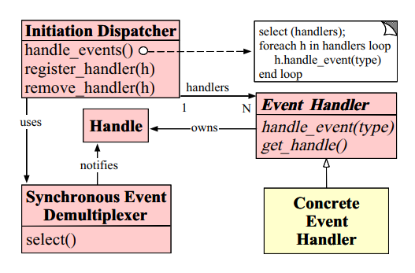

### 2.Reactor 模式流程

接下来介绍上面所讲的组件是如何互相协作的。

1. 首先，应用程序会将 Concrete Event Handler 注册到 Initiation Dispatcher 上，同时指明此 Event Handler 所关心的事件类型，形成 handle -> Event Handler 的一一对应关系。
2. Initiation Dispatcher 会要求每个 Event Handler 向其传递它内部的 handle。
3. 当所有的事件处理器注册完毕后，Initiation Dispatcher 会调用 handle_events 方法启动事件循环。在循环中，Initiation Dispatcher 会使用【Synchronous Event Demultiplexer】的select 函数来等待 handle 上的事件发生。
4. 当 handle 上的某个事件变为 ready 状态时，Initiation Dispatcher 会调用 Event Handler 中的回调方法来对事件进行处理。

    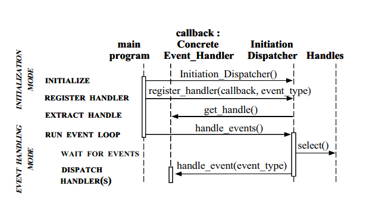

总结 Reactor 模式工作的流程为：首先将 Event Handler 注册到 Initiation Dispatcher 上，同时指明 Event Handler 想要监听的事件类型 (比如 read、connect)。然后 Initiation Dispatcher会调用 select 方法阻塞直到 handle 上感兴趣的时间就绪，如果时间就绪，则调用对应的 Event Handler。

### 3.Reactor 模式的应用场景

下面介绍两个使用 Reactor 模式的场景。

#### 3.1 客户端连接到Logging Server

    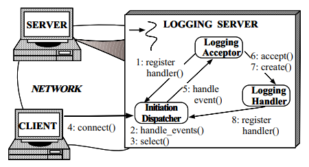

1. logging server 将 logging acceptor 注册到 initiation dispatcher 上，从而处理客户端的连接请求
2. logging server 会调用 Initiation Dispatcher 中的 handle_events 方法，调用demultiplexer 中的 select 阻塞方法等待连接请求或者日志数据到达。
3. 客户端对 logging server 发起连接
4. initiation dispatcher 调用 logging acceptor 中的 handle_event 方法（注意 logging acceptor 是一个特殊的 event handler，专门用来处理客户端到服务器端的连接事件）
5. logging acceptor 处理新的连接请求
6. logging acceptor 创建一个 logging handler 来处理新的客户端连接 client 上的后续读写事件
7. logging handler 将它的 socket handle 注册到 initiation dispatcher 上，当 handle 上的读事件就绪时，logging handler 中的回调方法就会被调用。

以上就是后面会讲到的**Reactor 单线程模型**，即建立连接事件的监听、连接的读写事件全部由一个线程来进行处理。

#### 3.2 客户端发送日志记录到 logging server

    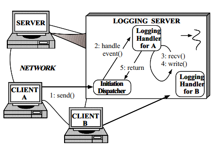

1. 客户端 A 发送了一条日志记录
2. 当日志记录到达时，initiation dispatcher 会通知 logging handlerA
3. 日志记录被 logging handlerA 所接收
4. logging handlerA 会处理日志记录，并把它写入到标准输出中
5. logging handlerA 将程序的控制权返回给 initiation dispatcher 的事件循环
6. 如果客户端 B 也发送了一条日志记录，那么会由 logging handlerB 来处理

## 三、Reactor 模式的类型

### 1.Reactor 单线程模型

    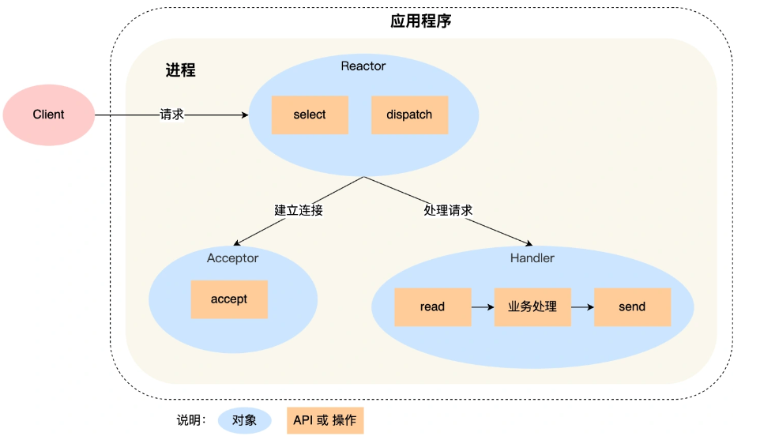

可以看到进程里有 Reactor、Acceptor、Handler 这三个对象：

- Reactor 对象的作用是监听和分发事件；
- Acceptor 对象的作用是获取连接；
- Handler 对象的作用是处理业务；

对象里的 select、accept、read、send 是系统调用函数，dispatch 和 「业务处理」是需要完成的操作，其中 dispatch 是分发事件操作。接下来，介绍下「单 Reactor 单进程」这个方案：

- Reactor 对象通过 select （IO 多路复用接口） 监听事件，收到事件后通过 dispatch 进行分发，具体分发给 Acceptor 对象还是 Handler 对象，还要看收到的事件类型；
- 如果是连接建立的事件，则交由 Acceptor 对象进行处理，Acceptor 对象会通过 accept 方法 获取连接，并创建一个 Handler 对象来处理后续的响应事件；
- 如果不是连接建立事件， 则交由当前连接对应的 Handler 对象来进行响应；
- Handler 对象通过 read -> 业务处理 -> send 的流程来完成完整的业务流程。

单 Reactor 单进程的方案因为全部工作都在同一个进程内完成，所以实现起来比较简单，不需要考虑进程间通信，也不用担心多进程竞争。但是，这种方案存在 2 个缺点：

- 第一个缺点，因为只有一个进程，无法充分利用 多核 CPU 的性能；
- 第二个缺点，Handler 对象在业务处理时，整个进程是无法处理其他连接的事件的，如果业务处理耗时比较长，那么就造成响应的延迟；

所以，单 Reactor 单进程的方案不适用计算机密集型的场景，只适用于业务处理非常快速的场景。

### 2.Reactor 多线程模型

    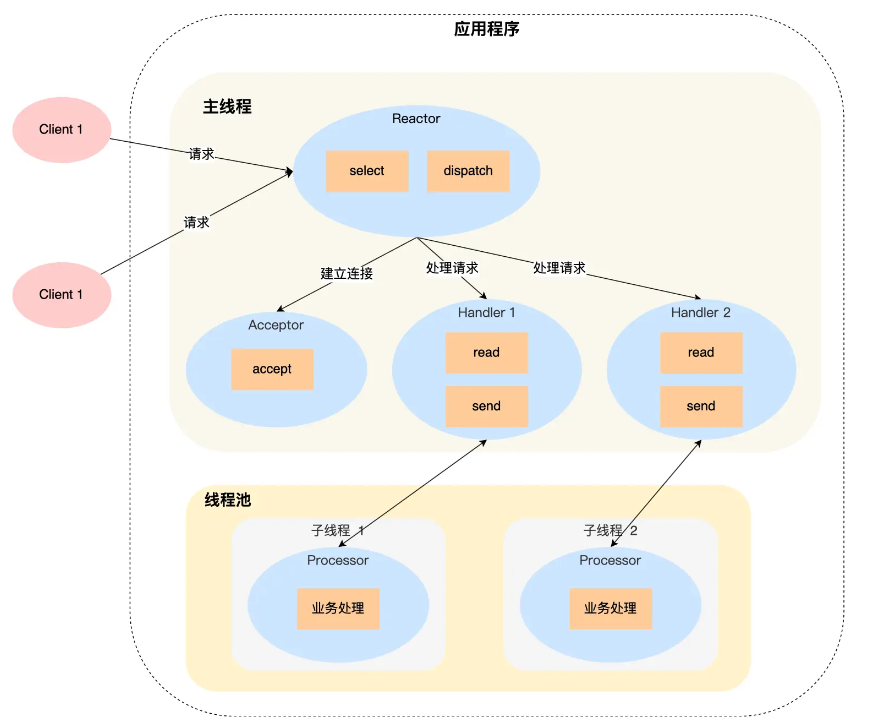

详细说一下这个方案：

- Reactor 对象通过 select （IO 多路复用接口） 监听事件，收到事件后通过 dispatch 进行分发，具体分发给 Acceptor 对象还是 Handler 对象，还要看收到的事件类型；
- 如果是连接建立的事件，则交由 Acceptor 对象进行处理，Acceptor 对象会通过 accept 方法 获取连接，并创建一个 Handler 对象来处理后续的响应事件；
- 如果不是连接建立事件， 则交由当前连接对应的 Handler 对象来进行响应；

上面的三个步骤和单 Reactor 单线程方案是一样的，接下来的步骤就开始不一样了：

- Handler 对象不再负责业务处理，只负责数据的接收和发送，Handler 对象通过 read 读取到数据后，会将数据发给子线程里的 Processor 对象进行业务处理；
- 子线程里的 Processor 对象就进行业务处理，处理完后，将结果发给主线程中的 Handler 对象，接着由 Handler 通过 send 方法将响应结果发送给 client；

单 Reator 多线程的方案优势在于能够充分利用多核 CPU 的能，那既然引入多线程，那么自然就带来了多线程竞争资源的问题。

### 3.Reactor 主从多线程（主 Reactor 唯一）

    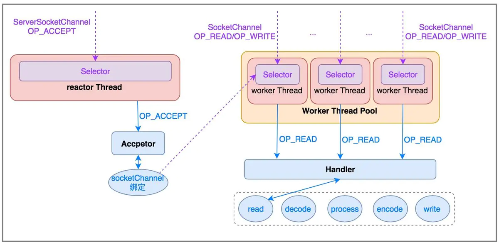

方案详细说明如下：

- 主线程中的 MainReactor 对象通过 select 监控连接建立事件，收到事件后通过 Acceptor 对象中的 accept 获取连接，将新的连接分配给某个子线程；
- 子线程中的 SubReactor 对象将 MainReactor 对象分配的连接加入 select 继续进行监听，并创建一个 Handler 用于处理连接的响应事件。
- 如果有新的事件发生时，SubReactor 对象会调用当前连接对应的 Handler 对象来进行响应。
Handler 对象通过 read -> 业务处理 -> send 的流程来完成完整的业务流程。

Reactor 主从多线程的方案虽然看起来复杂的，但是实际实现时比单 Reactor 多线程的方案要简单的多。其特点：

- 有专门一个 reactor 线程用于监听服务端 ServerSocketChannel，接收客户端的 TCP 连接请求；
- 网络 I/O 的读/写操作等由一个 worker reactor 线程池负责，由线程池中的 NIO 线程负责监听 SocketChannel 事件，进行消息的读取、解码、编码和发送。
- **一个 NIO 线程可以同时处理 N 条链路，但是一个链路只注册在一个 NIO 线程上处理，这样可以防止发生并发操作问题**。

在绝大多数场景下，Reactor 多线程模型都可以满足性能需求；但是，在极个别特殊场景中，一个 NIO 线程负责监听和处理所有的客户端连接可能会存在性能问题。例如并发百万客户端连接，或者服务端需要对客户端握手进行安全认证，但是认证本身非常损耗性能。在这类场景下，单独一个 Acceptor 线程可能会存在性能不足问题，为了解决性能问题，产生了第 4 种 Reactor 线程模型。

### 4.Reactor 主从多线程（主 Reactor 不唯一）

主从 Reactor 线程模型的特点是：

- 服务端用于接收客户端连接的不再是个 1 个单独的 NIO 线程，而是一个独立的 NIO 线程池。
- Acceptor 接收到客户端 TCP 连接请求处理完成后（可能包含接入认证等），将新创建的 SocketChannel 注册到 IO 线程池（sub reactor 线程池）的某个 IO 线程上，由它负责 SocketChannel 的读写和编解码工作。
- **Acceptor 线程池仅仅只用于客户端的登陆、握手和安全认证，一旦链路建立成功，就将链路注册到后端 subReactor 线程池的 IO 线程上，由 IO 线程负责后续的 IO 操作**。

    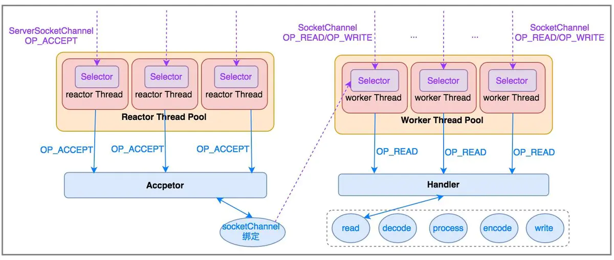

利用主从 NIO 线程模型，可以解决 1 个服务端监听线程无法有效处理所有客户端连接的性能不足问题。它的工作流程总结如下：

1. 从主线程池中随机选择一个 Reactor 线程作为 Acceptor 线程，用于绑定监听端口，接收客户端连接；
2. Acceptor 线程接收客户端连接请求之后创建新的 SocketChannel，**将其注册到主线程池的其它 Reactor 线程上，由其负责接入认证、IP 黑白名单过滤、握手等操作**；

步骤 2 完成之后，业务层的链路正式建立，将 SocketChannel 从主线程池的 Reactor 线程的多路复用器上摘除，重新注册到 Sub 线程池的线程上，用于处理 I/O 的读写操作。

## 四、Netty 线程模型

Netty 线程模型采用"服务端监听线程"和"I/O 线程"分离的方式，与 Reactor 主从多线程模型类似。抽象出 NioEventLoop 来表示一个不断循环执行处理任务的线程，每个 NioEventLoop 有一个 selector，用于监听绑定在其上的 socket 链路。

    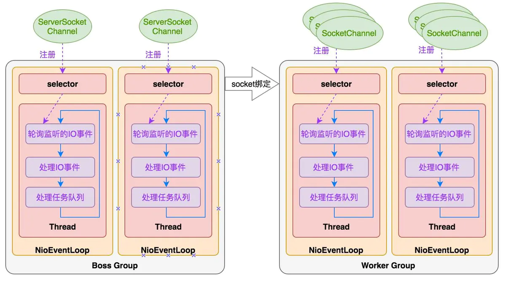

Netty 采用串行化设计理念，从消息的读取->解码->处理->编码->发送，始终由 I/O 线程NioEventLoop 负责。整个流程不会进行线程上下文切换，数据无并发修改风险。一个NioEventLoop 聚合一个多路复用器 selector，因此可以处理多个客户端连接。Netty 只负责提供和管理"I/O线程"，其他的业务线程模型由用户自己集成。

时间可控的简单业务建议直接在"I/O 线程"上处理，复杂和时间不可控的业务建议投递到后端业务线程池中处理。

## 五、Proactor 模型

前面提到的 **Reactor 是非阻塞同步网络模式，而 Proactor 是异步网络模式**。这里先给大家复习下阻塞、非阻塞、同步、异步 I/O 的概念。

先来看看**阻塞 I/O**，当用户程序执行 read，线程会被阻塞，一直等到内核数据准备好，并把数据从内核缓冲区拷贝到应用程序的缓冲区中，当拷贝过程完成，read 才会返回。这里等待内核数据准备好**指的就是数据从网卡写入到 socket 接收缓冲区中**，而数据从内核缓冲区拷贝到应用程序缓冲区**指的就是数据从 socket 缓冲区写入到应用程序自己定义的缓冲区变量中**。

注意，**阻塞 I/O 等待的是「内核数据准备好」和「数据从内核态拷贝到用户态」这两个过程**。过程如下图：

    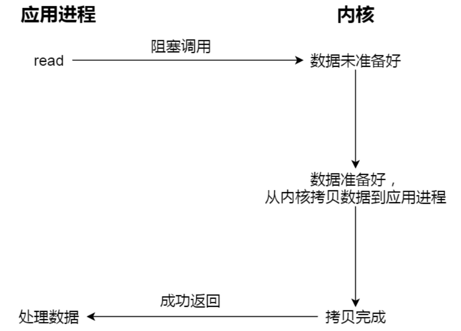

知道了阻塞 I/O ，来看看非阻塞 I/O，非阻塞的 read 请求在数据未准备好（socket 接收缓冲区中没有）的情况下立即返回，可以继续往下执行，此时应用程序不断轮询内核，直到数据准备好，内核将数据拷贝到应用程序缓冲区（**拷贝到应用程序缓冲区的过程是同步的，因为需要等待拷贝完成**），read 调用才可以获取到结果。过程如下图：

    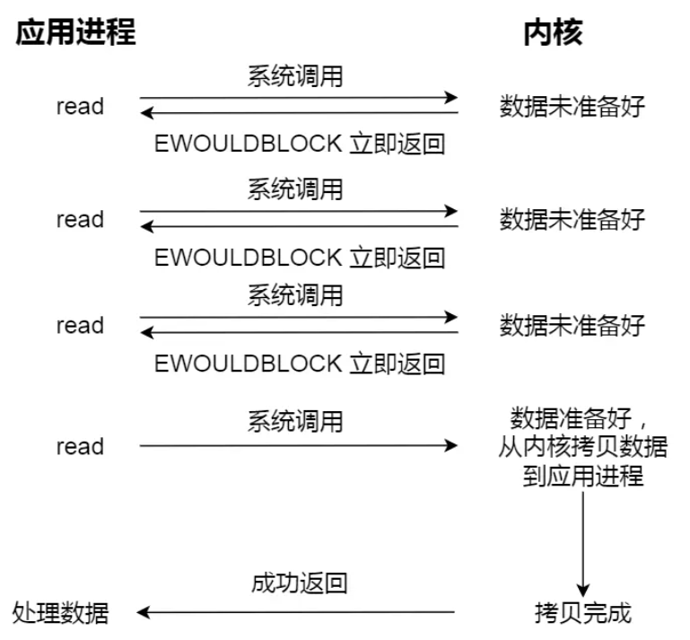

注意，这里最后一次 read 调用（即从内核拷贝到应用进程），获取数据的过程，是一个同步的过程，是需要等待的过程。这里的同步指的是内核态的数据拷贝到用户程序的缓存区这个过程。

举个例子，如果 socket 设置了 O_NONBLOCK 标志，那么就表示使用的是非阻塞 I/O 的方式访问，而不做任何设置的话，默认是阻塞 I/O。

**因此，无论 read 和 send 是阻塞 I/O，还是非阻塞 I/O 都是同步调用。因为在 read 调用时，内核将数据从内核空间拷贝到用户空间的过程都是需要等待的，也就是说这个过程是同步的**，如果内核实现的拷贝效率不高，read 调用就会在这个同步过程中等待比较长的时间。

而真正的**异步 I/O 是「内核数据准备好」和「数据从内核态拷贝到用户态」这两个过程都不用等待**。

当我们发起 aio_read （异步 I/O） 之后，就立即返回，内核自动将数据从内核空间拷贝到用户空间，这个拷贝过程同样是异步的，内核自动完成的，和前面的同步操作不一样，应用程序并不需要主动发起拷贝动作。过程如下图：

    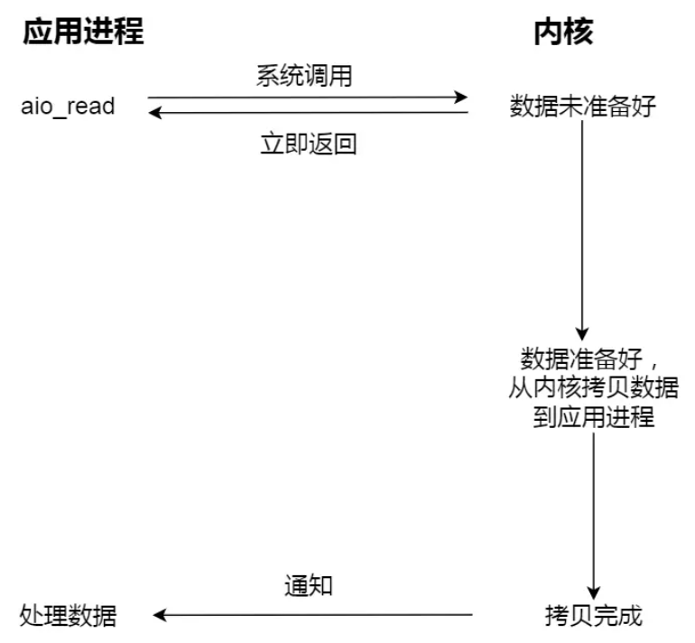

举个你去饭堂吃饭的例子，你好比应用程序，饭堂好比操作系统。

阻塞 I/O 好比，你去饭堂吃饭，但是饭堂的菜还没做好，然后你就一直在那里等啊等，等了好长一段时间终于等到饭堂阿姨把菜端了出来（数据准备的过程），但是你还得继续等阿姨把菜（内核空间）打到你的饭盒里（用户空间），经历完这两个过程，你才可以离开。

非阻塞 I/O 好比，你去了饭堂，问阿姨菜做好了没有，阿姨告诉你没，你就离开了，过几十分钟，你又来饭堂问阿姨，阿姨说做好了，于是阿姨帮你把菜打到你的饭盒里，这个过程你还是得等待的。

异步 I/O 好比，你让饭堂阿姨将菜做好并把菜打到饭盒里后，把饭盒送到你面前，整个过程你都不需要任何等待。

很明显，**异步 I/O 比同步 I/O 性能更好，因为异步 I/O 在「内核数据准备好」和「数据从内核空间拷贝到用户空间」这两个过程都不用等待**。

Proactor 正是采用了异步 I/O 技术，所以被称为异步网络模型。现在我们再来理解 Reactor 和 Proactor 的区别，就比较清晰了。

- **Reactor 是非阻塞同步网络模式，感知的是就绪可读写事件**。在每次感知到有事件发生（比如可读就绪事件）后，就需要应用进程主动调用 read 方法来完成数据的读取，也就是要应用进程主动将 socket 接收缓存中的数据读到应用进程内存中，这个过程是同步的，读取完数据后应用进程才能处理数据。
- **Proactor 是异步网络模式， 感知的是已完成的读写事件**。在发起异步读写请求时，需要传入数据缓冲区的地址（用来存放结果数据）等信息，这样系统内核才可以自动帮我们把数据的读写工作完成，**这里的读写工作全程由操作系统来做，并不需要像 Reactor 那样还需要应用进程主动发起 read/write 来读写数据**，操作系统完成读写工作后，就会通知应用进程直接处理数据。

因此，**Reactor 可以理解为「来了事件操作系统通知应用进程，让应用进程来处理」，而 Proactor 可以理解为「来了事件操作系统来处理，处理完再通知应用进程」**。这里的「事件」就是有新连接、有数据可读、有数据可写的这些 I/O 事件这里的「处理」包含从驱动读取到内核以及从内核读取到用户空间。

无论是 Reactor，还是 Proactor，都是一种基于「事件分发」的网络编程模式，区别在于 Reactor 模式是基于「待完成」的 I/O 事件，而 Proactor 模式则是基于「已完成」的 I/O 事件。

接下来，一起看看 Proactor 模式的示意图：

    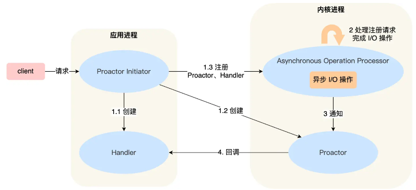

介绍一下 Proactor 模式的工作流程：

- Proactor Initiator 负责创建 Proactor 和 Handler 对象，并将 Proactor 和 Handler 都通过 Asynchronous Operation Processor 注册到内核；
- Asynchronous Operation Processor 负责处理注册请求，并处理 I/O 操作；
- Asynchronous Operation Processor 完成 I/O 操作后通知 Proactor；
- Proactor 根据不同的事件类型回调不同的 Handler 进行业务处理；
- Handler 完成业务处理；

可惜的是，在 Linux 下的异步 I/O 是不完善的， aio 系列函数是由 POSIX 定义的异步操作接口，不是真正的操作系统级别支持的，而是在用户空间模拟出来的异步，并且仅仅支持基于本地文件的 aio 异步操作，网络编程中的 socket 是不支持的，这也使得基于 Linux 的高性能网络程序都是使用 Reactor 方案。

**而 Windows 里实现了一套完整的支持 socket 的异步编程接口，这套接口就是 IOCP，是由操作系统级别实现的异步 I/O，真正意义上异步 I/O**，因此在 Windows 里实现高性能网络程序可以使用效率更高的 Proactor 方案。

