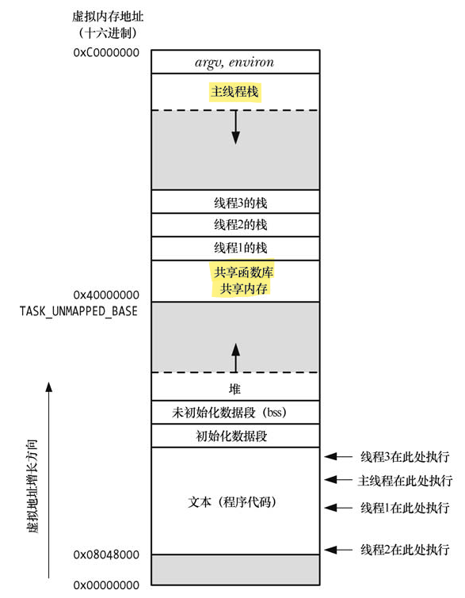

# 线程管理

## 一、线程概述

### 1.概述

在 Linux 中包含两种主流的线程实现——*`Linux Threads`* 和 *`Native POSIX Threads Library（NPTL）`*。

与进程（process）类似，线程（thread）是允许应用程序并发执行多个任务的一种机制。一个进程可以包含多个线程。**同一程序中的所有线程均会独立执行相同程序，且共享同一份全局内存区域**，其中包括初始化数据段（initialized data）、未初始化数据段（uninitialized data），以及堆内存段（heap segment）。（传统意义上的 UNIX 进程只是多线程程序的一个特例，该进程只包含一个线程）。

同一进程中的多个线程可以并发执行。**在多处理器环境下，多个线程可以同时并行**。如果一线程因等待 I/O 操作而遭阻塞，那么其他线程依然可以继续运行。

下图是同时执行 4 个线程的进程地址空间图：

<div align="center">
    
</div>

在上述图中，所有的线程栈均驻留于同一虚拟地址空间。这也意味着，利用一个合适的指针，各线程可以在对方栈中相互共享数据，**但由于局部变量的状态有效与否依赖于其所驻留栈帧的生命周期**，故而需要在编程中谨慎处理这一问题。（当函数返回时，该函数栈帧所占用的内存区域有可能为后续的函数调用所重新使用。如果线程终止，那么新线程有可能会对已终止线程的栈所占用的内存空间重新加以利用）。

使用进程的程序存在如下的限制：

- 进程间的信息难以共享。**由于除去只读代码段外，父子进程并未共享内存**，因此必须采用一些进程间通信（**`inter-process communication`**，简称 IPC）方式，在进程间进行信息交换；
- 调用 fork() 来创建进程的代价相对较高。即便利用写时复制（copy-on-write）技术，**仍然需要复制诸如内存页表（page table）和文件描述符表（file descriptor table）等**多种进程属性。

线程解决了上述两个问题：

- 线程之间能够方便、快速地共享信息。只需将数据复制到共享（全局或堆）变量中即可；
- 创建线程比创建进程通常要快 10 倍甚至更多。在 Linux 中，是通过系统调用 clone() 来实现线程的。线程的创建之所以较快，是因为调用 fork() 创建子进程时所需复制的诸多属性，**在线程间本来就是共享的。特别是，既无需采用写时复制来复制内存页，也无需复制页表**；

除了全局内存之外，线程还共享了一干其他属性：

- 进程 ID（process ID）和父进程 ID；
- 进程组 ID 与会话 ID（session ID）；
- 打开的文件描述符；
- 信号（signal）处置；
- System V 信号量撤销（undo、semadj）值；

各线程所独有的属性，如下列出了其中一部分：

- 线程 ID；
- 信号掩码（signal mask）；
- errno 变量；
- 栈，本地变量和函数的调用链接（linkage）信息；

#### 1.1 线程和 errno

在传统 UNIX API 中，errno 是一全局整型变量。然而，这无法满足多线程程序的需要。**如果线程调用的函数通过全局 errno 返回错误时，会与其他发起函数调用并检查 errno 的线程混淆在一起**。换言之，这将引发竞争条件（**`race condition`**）。因此，在多线程程序中，每个线程都有属于自己的 errno。

#### 1.2 Pthreads 函数返回值

从系统调用和库函数中返回状态，传统的做法是：返回 0 表示成功，返回 -1 表示失败，并设置 errno 以标识错误原因。然而所有 Pthreads 函数均以返回 0 表示成功，返回一正值表示失败。这一失败时的返回值，与传统 UNIX 系统调用置于 errno 中的值含义相同。

#### 1.3 编译 Pthreads 程序

在 Linux 平台上，在编译调用了 Pthreads API 的程序时，需要设置 **`cc -pthread`** 的编译选项，该选项的使用效果如下所示：

- 定义 **`_REENTRANT`** 预处理宏。这会公开对少数可重入（reentrant）函数的声明；
- 程序会与库 **`libpthread`** 进行链接（等价于 **`-lpthread`**）；

### 2.创建线程

启动程序时，产生的进程只有单条线程，称之为初始（initial）或主（main）线程。函数 **`pthread_create()`** 负载创建一条新线程。

```c{.line-numbers}
#include <pthread.h>
// returns 0 on success, or a positive error number on error
int pthread_create(pthread_t* thread, const pthread_attr_t* attr, void* (*start)(void*), void* arg);
```

新线程通过调用带有参数 arg 的函数 start（即 **`start(arg)`**）而开始执行。调用 **`pthread_create()`** 的线程会继续执行该调用之后的语句。将参数 arg 声明为 void* 类型，意味着可以将指向任意对象的指针传递给 start() 函数。一般情况下，arg 指向一个全局或堆变量，也可将其置为 NULL。如果需要向 start() 传递多个参数，可以将 arg 指向一个结构体，该结构的各个字段则对应于待传递的参数。

严格说来，对于 int 与 void* 之间相互强制转换的后果，C 语言标准并未加以定义。不过，大部分 C 语言编译器允许这样的操作，并且也能达成预期的目的，即 **`int j == (int) ((void*) j)`**。**`start()`** 的返回值类型为 void*，对其使用方式与参数 arg 相同。

> 将经强制转换的整型数作为线程 start 函数的返回值时，必须小心谨慎。原因在于，取消线程时的返回值 **`PTHREAD_CANCELED`**，通常是由实现（操作系统实现）所定义的整型值，再经强制转换为 void*。若线程某甲的 start 函数将和 **`PTHREAD_CANCELED`** 相同值的整型值返回给正在执行 **`pthread_join()`** 操作的线程某乙，某乙会误认为某甲遭到了取消。
> 应用如果采用了线程取消技术并选择将 start 函数的返回值强制转换为整型，那么就必须确保线程正常结束时的返回值与当前 Pthreads 实现中的 **`PTHREAD_CANCELED`** 不同。

参数 thread 指向 **`pthread_t`** 类型的缓冲区，在 **`pthread_create()`** 返回前，会在此保存一个该线程的唯一标识。

参数 attr 是指向 **`pthread_attr_t`** 对象的指针，该对象指定了新线程的各种属性，如果将 attr 设置为 NULL，那么创建新线程时将使用各种默认属性。

### 3.终止线程

可以使用如下方式终结线程：

- 线程 start 函数执行 return 语句并返回指定值；
- 线程调用 **`pthread_exit()`**；
- 调用 **`pthread_cancel()`** 取消线程；
- 任意线程调用了 **`exit()`**，或者主线程执行了 return 语句（在 main() 函数中），都会导致进程中的所有线程立即终止；

**`pthread_exit()`** 函数将终止调用线程，**且其返回值（即参数 retval）可由另一线程通过调用 **`pthread_join()`** 来获取**。

```c{.line-numbers}
#include <pthread.h>
void pthread_exit(void* retval);
```

**调用 **`pthread_exit()`** 相当于在线程的 start 函数中执行 return**，不同之处在于，可在线程 start 函数所调用的任意函数中调用 **`pthread_exit()`**。

参数 retval 指定了线程的返回值。retval 所指向的内容不应分配于线程栈中，**因为线程终止后，将无法确定线程栈的内容是否有效**。出于同样的理由，**也不应在线程栈中分配线程 start 函数的返回值**。如果主线程调用了 **`pthread_exit()`**，而非调用 exit() 或是执行 return 语句，那么其他线程将继续运行。

> **`pthread_exit()`** 函数中的 retval 值、 **`pthread_create()`** 函数中 start 函数的返回值以及 **`pthread_cancel()`** 函数的返回值都会被 **`pthread_join()`** 函数获取到。

### 4.线程 ID

进程内部的每个线程都有一个唯一标识，称为线程 ID。线程 ID 会返回给 **`pthread_create()`** 的调用者，**一个线程可以通过 **`pthread_self()`** 来获取自己的线程 ID**。

```c{.line-numbers}
#include <pthread.h>
// returns the thread ID of the calling thread
pthread_t pthread_self(void);
```

函数 **`pthread_equal()`** 可检查两个线程的 ID 是否相同：

```c{.line-numbers}
#include <pthread.h>
// returns nonzero value if t1 and t2 are equal, otherwise 0
int pthread_equal(pthread_t t1, pthread_t t2);
```

因为必须将 **`pthread_t`** 作为一种不透明的数据类型加以对待，所以函数 **`pthread_equal()`** 是必须的。Linux 将 **`pthread_t`** 定义为无符号长整型（unsigned long）。但在其他实现中，则有可能是一个指针或结构。

> SUSv3 并未要求将 pthread_t 实现为一个标量（scalar）类型，该类型也可以是一个结构。

**在 Linux 的线程实现中，线程 ID 在所有进程中都是唯一的**。不过在其他实现中则未必如此，SUSv3 特别指出，应用程序若使用线程 ID 来标识其他进程的线程，其可移植性将无法得到保证。此外，**在对已终止线程施以 **`pthread_join()`**，或者在已分离（detached）线程退出后，实现可以复用该线程的线程 ID**。

### 5.连接（joining）已终止

函数 **`pthread_join()`** 等待由 thread 标识的线程终止。（如果线程已经终止，**`pthread_join()`** 会立即返回）。

```c{.line-numbers}
#include <pthread.h>
// returns 0 on success, or a positive error number on error
int pthread_join(pthread_t thread, void** retval);
```

若 retval 为一非空指针，将会保存线程终止时返回值的拷贝，该返回值亦即线程调用 return 或 **`pthred_exit()`** 时所指定的值。如向 **`pthread_join()`** 传入一个之前已然连接过的线程 ID，将会导致无法预知的行为。例如，**相同的线程 ID 在参与一次连接后恰好为另一新建线程所重用，再度连接的可能就是这个新线程**。

若线程并未分离，则必须使用 **`ptherad_join()`** 来进行连接。**如果未能连接，那么线程终止时将产生僵尸线程**，僵尸线程若累积过多，应用将再也无法创建新的线程：

- 线程之间的关系是对等的（peers）。进程中的任意线程均可以调用 **`pthread_join()`** 与该进程的任何其他线程连接起来，例如，如果线程 A 创建线程 B，线程 B 再创建线程 C，那么线程 A 可以连接线程 C，线程 C 也可以连接线程 A。这与进程间的层次关系不同；
- **无法"连接任意线程"**（对于进程，则可以通过调用 **`waitpid(-1, &status, options)`** 做到这一点），**也不能以非阻塞（nonblocking）方式进行连接**（类似于设置 **`WHOHANG`** 标志的 **`waitpid()`**）；

限制 **`pthread_join()`** 只能连接特定线程 ID，其用意在于，程序应只能连接它所"知道的"线程，那么所谓"任意"线程就可以包括由库函数私自创建的线程，结果是，**函数库在获取线程返回状态时将不再能与该线程（即由库函数私自创建的线程）连接**，只会一错再错，试图连接一个已然连接过的线程 ID。

### 6.线程分离

默认情况下，线程是可连接的（joinable），也就是说，当线程退出时，其他线程可以通过调用 **`pthread_join()`** 获取其返回状态。有时，不关心线程的返回状态，只是希望系统在线程终止时能够自动清理并移除之。在这种情况下，可以调用 **`pthread_detach()`** 并向 thread 参数传入指定线程的标识符，将该线程标记为处于分离（detached）状态。

```c{.line-numbers}
#include <pthread.h>
// returns 0 on success, or a positive error number on error
int pthread_detach(pthread_t thread);
```

一旦线程处于分离状态，就不能再使用 **`pthread_join()`** 来获取其状态，也无法使其重返"可连接"状态。其他线程调用了 **`exit()`**，或是主线程执行 return 语句时，即便遭到分离的线程也还是会受到影响。**此时，不管线程处于可连接状态还是已分离状态，进程的所有线程会立即终止**。

### 7.线程与进程

多线程的优点如下所示：

- 线程间的数据共享很简单。相形之下，进程间的数据共享需要更多的投入。（例如，创建共享内存段或者使用管道 pipe）；
- 创建线程要快于创建进程。线程间的上下文切换（context-switch），其消耗时间一般也比进程要短；

线程相对于进程的一些缺点如下所示：

- 多线程编程时，需要确保调用线程安全（thread-safe）的函数，或者以线程安全的方式来调用函数。多进程应用则无需关注这些；
- 某个线程中的 bug（例如，通过一个错误的指针来修改内存）**可能会危及该进程的所有线程**，因为它们共享着相同的地址空间和其他属性。**相比之下，进程间的隔离更彻底**；
- **每个线程都在争用宿主进程（host process）中有限的虚拟地址空间**。特别是，一旦每个线程栈以及线程特有数据（或线程本地存储）消耗掉进程虚拟地址空间的一部分，则后续线程将无缘使用这些区域。与之相反，**每个进程都可以使用全部的有效虚拟内存，仅受制于实际内存和交换（swap）空间**；

影响选择的还有如下几点：

- 在多线程应用中处理信号，需要小心设计。（作为通则，一般建议在多线程程序中避免使用信号）；
- 在多线程应用中，所有线程必须运行同一个程序（尽管可能是位于不同函数中）。对于多进程应用，不同的进程可以运行不同的程序；

