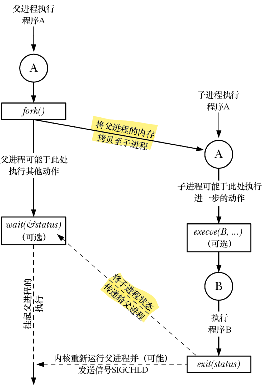
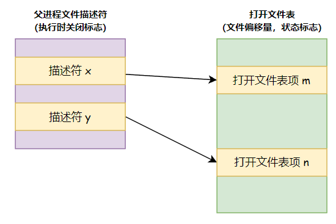
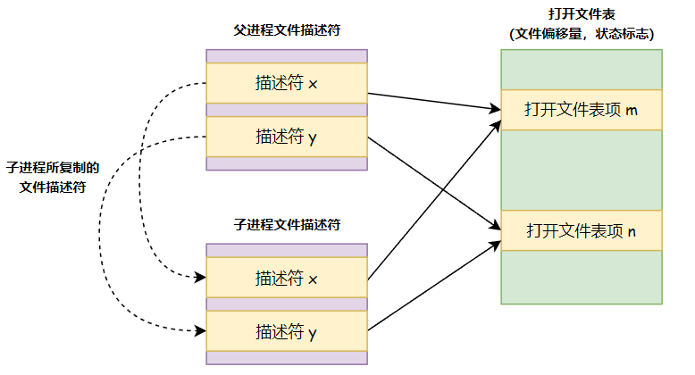
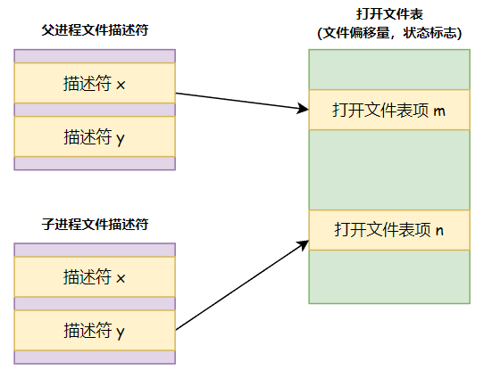
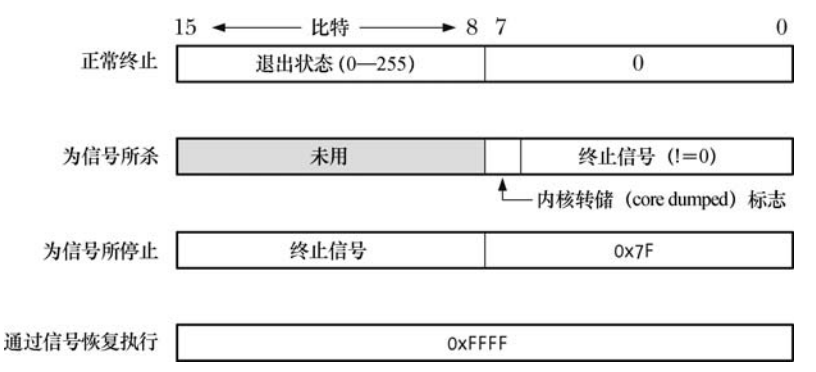

# 进程管理

## 一、进程的创建

### 1.fork()、exit()、wait() 以及 execve() 的简介

首先我们对以后将频繁用到的 4 个函数进行一个介绍：

- **系统调用 fork() 允许一进程（父进程）创建一新进程（子进程）**。子进程获得父进程的栈、数据段、堆和执行文本段的拷贝，可将此视为把父进程一分为二；
- **库函数 exit(status) 终止一进程**，将进程占用的所有资源（内存、文件描述符等）归还内核，交其进行再次分配。参数 status 为一整型变量，表示进程的退出状态。**父进程可使用系统调用 wait() 来获取该状态**；
- 系统调用 wait(&status) 的目的有二：其一，如果子进程尚未调用 exit() 终止，那么 wait() 会挂起父进程直至子进程终止；**其二，子进程的终止状态通过 wait() 的 status 参数返回**；
- 系统调用 execve(pathname, argv, envp) 加载一个新程序（路径名为 pathname，参数列表为 argv，环境变量列表为 envp）到当前进程的内存。**这将丢弃现存的程序文本段，并为新程序重新创建栈、数据段以及堆**。通常将这一动作称为执行（execing）一个新程序；

下图对 fork()、exit()、wait() 以及 execve() 之间的相互协同作了总结，此图勾勒了 shell 执行一条命令所历经的步骤：shell 读取命令，进行各种处理，随之创建子进程以执行该命令，如此循环不已。

<div align="center">
    
</div>

图中对 execve() 的调用并非必须，让子进程继续执行与父进程相同的程序反而会有妙用。最终，两种情况殊途同归：总是要通过调用 exit()（或子进程接收一个信号）来终止子进程，而父进程可调用 wait() 来获取其终止状态。

同样，对 wait() 的调用也属于可选项。父进程在创建好子进程后，完全可以对子进程的状态不管。当子进程终止时，内核会为其父进程产生此类信号（默认的处理是忽略 **`SIGCHLD`** 信号，下图将此标记为可选，原因正在于此）。

> 在调用 **`fork()`** 之后，父、子进程中一般只有一个会通过调用 **`exit()`** 退出，而另一进程则应使用 **`_exit()`** 终止。

### 2.fork() 函数

系统调用 fork() 创建一新进程（child），几近于对调用进程（parent）的翻版：

```c{.line-numbers}
#include <unistd.h>

/* 
 * In parent: returns process ID of child on success, or -1 on error;
 * in successfully created child: always returns 0
 */
pid_t fork(void);
```

在 fork 调用完成之后，将会存在两个进程，并且每个进程都会从 fork() 的返回处继续执行。这两个进程将执行相同的程序文本段，但却各自拥有不同的栈段、数据段以及堆段拷贝。**子进程的栈、数据以及栈段开始时是对父进程内存相应各部分的完全复制。执行 fork() 之后，每个进程均可修改各自的栈数据、以及堆段中的变量，而并不影响另一进程**。

程序代码则可通过 fork() 的返回值来区分父、子进程。在父进程中，fork() 将返回新创建子进程的进程 ID。而 fork() 在子进程中则返回 0。如有必要，子进程可调用 getpid() 以获取自身的进程 ID，调用 getppid() 以获取父进程 ID。

当无法创建子进程时，fork() 将返回 -1。失败的原因可能在于，进程数量要么超出了系统针对此真实用户（real user ID）在进程数量上所施加的限制（即超过了 **`RLIMIT_NPROC`** 常量的值），要么是触及允许该系统创建的最大进程数这一系统级上限。

> **`RLIMIT_NPROC`** 是一个用于限制用户可创建的进程数量的资源限制常量，**`RLIMIT_NPROC`** 常量定义了一个用户可以创建的进程数量上限。

调用 fork() 函数时，习惯采用的编程模式如下所示：

```c{.line-numbers}
pid_t child_pid;
switch(child_pid = fork()) {
    case -1:
        /* fork() failed */
        /* handle error */
    case 0:
        /* child of successful fork() comes here */
        /* perform actions specific to child */
    default:
        /* parent comes here after successful fork() */
        /* perform  actions specific to parent */        
}
```

调用 fork() 之后，系统将率先"垂青"于哪个进程（即调度其使用 CPU），是无法确定的，意识到这一点极为重要。

### 3.父、子进程间的文件共享

执行 **`fork()`** 时，子进程会获得父进程所有文件描述符的副本。这些副本的创建方式类似于 **`dup()`**，这也意味着父、子进程中对应的描述符均指向相同的打开文件句柄。

**打开文件句柄包含有当前文件偏移量**（由 read()、write() 和 lseek() 修改）**以及文件状态标志**（由 **`open()`** 设置，通过 fcntl() 的 **`F_SETFL`** 操作改变）。**一个打开文件的这些属性因之而在父子进程间实现了共享**。举例来说，如果子进程更新了文件偏移量，那么这种改变也会影响到父进程中相应的描述符。

下面的程序，fork 函数调用之后，子进程改变文件偏移量量以及文件状态标志，最后退出。父进程随即获取文件偏移量和标志。

```c{.line-numbers}
#include "fcntl.h"
#include "sys/wait.h"
#include <stdio.h>
#include <unistd.h>
#include <stdlib.h>

void err_exit(const char* str) {
    printf("%s\n", str);
    exit(EXIT_FAILURE);
}

int main() {

    int fd, flags;
    char template[] = "/tmp/testXXXXXX";

    /* disable buffering of stdout */
    setbuf(stdout, NULL);
    fd = mkstemp(template);
    if (fd == -1) {
        printf("mkstemp\n");
        exit(EXIT_FAILURE);
    }

    printf("file offset before fork(): %lld\n", (long long) lseek(fd, 0, SEEK_CUR));
    flags = fcntl(fd, F_GETFL);
    printf("O_APPEND flag before fork() is: %s\n", (flags & O_APPEND) ? "on" : "off");

    switch (fork()) {
        case -1:
            printf("fork\n");
            exit(EXIT_FAILURE);

        case 0:
            /* child: change file offset and status flag */
            if (lseek(fd, 1000, SEEK_SET) == -1) {
                err_exit("lseek");
            }

            flags = fcntl(fd, F_GETFL);
            if (flags == -1)
                err_exit("fnctl - F_GETFL");
            flags |= O_APPEND;
            if (fcntl(fd, F_SETFL, flags) == -1) {
                err_exit("fnctl - F_SETFL");
            }
            _exit(EXIT_SUCCESS);

        default:
            /* parent can see file changes made by child */
            if (wait(NULL) == -1)
                err_exit("wait");

            printf("child has exited\n");
            printf("file offset in parent: %lld\n", (long long) lseek(fd, 0, SEEK_CUR));

            flags = fcntl(fd, F_GETFL);
            if (flags == -1)
                err_exit("fcntl - F_GETFL");

            printf("O_APPEND flag in parent is: %s\n", (flags & O_APPEND) ? "on" : "off");
            exit(EXIT_SUCCESS);
    }

    return 0;
}
```

上述程序的运行结果如下所示，可以看到，子进程对文件描述符的标志位以及偏移量进行修改之后，父进程中相应的量也发生了变化：

```shell
xuweilin@xuweilin-virtual-machine:~/CLionProjects/http_parser/cmake-build-debug$ ./fork_file_sharing 
file offset before fork(): 0
O_APPEND flag before fork() is: off
child has exited
file offset in parent: 1000
O_APPEND flag in parent is: on
```

父子进程间共享打开文件属性的用处很多。例如，假设父子进程同时写入一文件，共享文件偏移量会确保二者不会覆盖彼此的输出内容。不过，这并不能阻止父子进程的输出随意混杂在一起。要想规避这一现象，需要进行进程间同步。比如，父进程可以使用系统调用 **`wait()`** 来暂停运行并等待子进程退出。**`shell 就是这么做的：只有当执行命令的子进程退出后，shell 才会打印出提示符`**。

如果不需要这种对文件描述符的共享方式，那么在设计应用程序时，应于 **`fork()`** 调用后注意两点：其一，令父、子进程使用不同的文件描述符；其二，各自立即关闭不再使用的描述符（亦即那些经由其他进程使用的描述符）。

> 在并发编程时，由于父子进程共用一个文件描述符，**父进程调用 close 关闭文件描述符时只是导致描述符的引用计数减一，当引用计数为 0 的时候才会真正关闭文件描述符**。所以各自立即关闭不再使用的描述符之后，如果还有其他进程在使用这些文件描述符，那么这些文件描述符就不会真正被关闭。

执行 fork() 期间对文件描述符的复制，以及关闭不再使用的描述符图示如下：

**a) 调用 fork() 之前的描述符和打开文件表条目**

<div align="center">
    
</div>

**b) 调用 fork() 之后的描述符**

<div align="center">
    
</div>

**c) 分别在父进程和子进程关闭不再使用的描述符**

<div align="center">
    
</div>

### 4.fork 的内存语义

从概念上说来，可以将 fork() 认作对父进程程序段、数据段、堆段以及栈段创建拷贝。不过，真要是简单地将父进程虚拟内存页拷贝到新的子进程，那就太浪费了。原因有很多，其中之一是：fork()之后常常伴随着 exec()，这会用新程序替换进程的代码段，并重新初始化其数据段、堆段和栈段。大部分现代 UNIX 实现（包括 Linux）采用两种技术来避免这种浪费：

- **内核（Kernel）将每一进程的代码段标记为只读，从而使进程无法修改自身代码**。这样，父、子进程可共享同一代码段。系统调用 fork() 在为子进程创建代码段时，其所构建的一**系列进程级页表项（page-table entries）均指向与父进程相同的物理内存页帧**。
- **对于父进程数据段、堆段和栈段中的各页，内核采用写时复制（copy-on-write）技术来处理**。最初，内核做了一些设置，令这些段的页表项指向与父进程相同的物理内存页，并将这些页面自身标记为只读。调用 fork() 之后，内核会捕获所有父进程或子进程针对这些页面的修改企图，**并为将要修改的（about-to-be-modified）页面创建拷贝**。系统将新的页面拷贝分配给遭内核捕获的进程，还会对子进程的相应页表项做适当调整。从这一刻起，父、子进程可以分别修改各自的页拷贝，不再相互影响。

### 5.fork() 之后的竞争条件（Race Condition）

**调用 fork() 后，无法确定父、子进程间谁将率先访问 CPU**（在多处理器系统中，它们可能会同时各自访问一个 CPU）。就应用程序而言，如果为了产生正确的结果而或明或暗（implicitly or explicitly）地依赖于特定的的执行序列，那么将可能因竞争条件而导致失败。**由于此类问题的发生取决于内核根据系统当时的负载而做出的调度决定**，故而往往难以发现。

我们可以使用如下的程序来验证这种不确定性，在程序中，循环使用 fork() 函数来创建多个子进程，在每个 fork() 调用之后，父子进程都会打印一条信息。

```c{.line-numbers}
#include <stdio.h>
#include <unistd.h>
#include "sys/wait.h"
#include "get_num.h"
#include <stdlib.h>
#include <pthread.h>

void err_exit(const char* msg) {
    printf("%s\n", msg);
    exit(EXIT_FAILURE);
}

int main(int argc, char* argv[]) {

    int num_children, j;
    pid_t child_pid;

    num_children = (argc > 1) ? getInt(argv[1], GN_GT_0, "num-children") : 1;
    setbuf(stdout, NULL);

    for (j = 0; j < num_children; j++) {
        switch (child_pid = fork()) {
            case -1:
                err_exit("fork");

            case 0:
                printf("%d child\n", j);
                _exit(EXIT_SUCCESS);

            default:
                printf("%d parent\n", j);
                wait(NULL);
                break;
        }
    }

    exit(EXIT_SUCCESS);
}
```

该进程的运行结果如下所示：

```shell
xuweilin@xuweilin-virtual-machine:~/CLionProjects/http_parser/cmake-build-debug$ ./fork_whos_on_first 5
0 parent
0 child
1 parent
1 child
2 parent
2 child
3 parent
3 child
4 parent
4 child
```

可以使用该程序来生成大量子进程，并且分析其输出，观察父、子进程间每次到底由谁率先输出了结果。在某一 Linux/x86-32 2.2.19 系统上令此程序生成一百万个子进程，其分析结果表明，除去 332 次之外，都是由父进程先行输出结果（占总数的 99.97%）。

依据这一结果可以推测，在 Linux 2.2.19 中，fork()之后总是继续执行父进程。而子进程之所以在 0.03%的情况中首先输出结果，是因为父进程在有机会输出消息之前，其 CPU 时间片（CPU time slice）就到期了。

虽然 Linux 2.2.19 总是在 fork()之后继续运行父进程，但在其他 UNIX 实现上，甚至不同版本的 Linux 内核之间，却不能视其为理所当然。在内核稳定版 2.4 系列中，一度曾试验性地推出了一个 "fork() 之后由子进程先运行"的补丁，其调度结果与内核 2.2.19 完全相反。Linux 专有文件 **`/proc/sys/kernel/sched_child_runs_first`** 可以改变该默认设置。

> 要了解支持 "fork() 之后先调度子进程" 行为的理由，可考虑当 fork() 产生的子进程立即执行 exec() 时"写时复制"所发生的情况。此时，**一方面父进程在 fork() 之后继续修改数据页和栈页，另一方面内核要为子进程复制那些"将要修改"的页**。由于子进程一旦获得调度会立即执行 exec()，故而这一页复制动作纯属浪费。基于这一论点，先调度子进程的决策更佳。如此一来，等到下次调度到父进程时，就无需复制内存页了。
>
> Linux 2.6.32 改回 "fork() 之后先调度父进程"，其论据则基于如下发现：fork() 之后，父进程在 CPU 中正处于活跃状态，**并且其内存管理信息也被置于硬件内存管理单元的转译后备缓冲器（TLB, translation look-aside buffer，保存了父进程页表项条目的缓存）中**。所以，先运行父进程将提高性能。

### 6.同步信号以规避竞争条件

调用 fork()之后，如果进程某甲需等待进程某乙完成某一动作，那么某乙（即活动进程）可在动作完成后向某甲发送信号；某甲则等待即可。下面的程序演示了这一技术，该程序假设父进程必须等待子进程先完成某些动作。

```c{.line-numbers}
#include <stdio.h>
#include <unistd.h>
#include <stdlib.h>
#include <pthread.h>
#include "errno.h"
#include "signal.h"

/* Synchronization signal */
#define SYNC_SIG SIGUSR1

/* Signal handler - does nothing but return */
static void handler(int sig) {
}

int main() {

    pid_t child_pid;
    sigset_t block_mask, orig_mask, empty_mask;
    struct sigaction sa;

    /*
     * 这里设置信号阻塞，是因为如果不这样设置，父进程执行到 printf 的时候，如果子进程就已经发送 SYNC_SIG 信号，那么父进程接收到此信号
     * 后，就简单调用 handler 信号处理器，然后就会调用 sigsuspend 或者 pause 函数，进入阻塞状态，而子进程的信号已经发送，所以父进程会一直
     * 阻塞。所以必须先设置信号阻塞，然后如果在父进程调用 sigsuspend 之前信号就已经被发送过来时，信号会被阻塞，处于等待状态，直到调用 sigsuspend，
     * 取消掉阻塞，信号会被传递过来，让父进程退出 sigsuspend 函数
     */
    sigemptyset(&block_mask);
    sigaddset(&block_mask, SYNC_SIG);
    if (sigprocmask(SIG_BLOCK, &block_mask, &orig_mask) == -1)
        printf("sigprocmask\n");

    sigemptyset(&sa.sa_mask);
    sa.sa_flags = SA_RESTART;
    sa.sa_handler = handler;

    if (sigaction(SYNC_SIG, &sa, NULL) == -1)
        printf("sigaction\n");

    switch (child_pid = fork()) {
        case -1:
            printf("fork\n");

        /* child */
        case 0:
            printf("[%s %ld] child started - doing some work\n", curr_time("%T"), (long) getpid());
            sleep(2);

            /* and then signals parent that it's done */
            printf("[%s %ld] child about to signal parent\n", curr_time("%T"), (long) getpid());

            if (kill(getppid(), SYNC_SIG) == -1)
                printf("kill\n");

            /* now child can do other things... */
            _exit(EXIT_SUCCESS);

        /* parent */
        default:
            printf("[%s %ld] parent about to wait for signal\n", curr_time("%T"), (long) getpid());

            sigemptyset(&empty_mask);
            if (sigsuspend(&empty_mask) == -1 && errno != EINTR) {
                printf("sigsuspend\n");
            }

            printf("[%s %ld] parent got signal\n", curr_time("%T"), (long) getpid());

            if (sigprocmask(SIG_SETMASK, &orig_mask, NULL) == -1)
                printf("sigprocmask\n");

            exit(EXIT_SUCCESS);
    }
}
```

在以上程序中，必须先设置信号阻塞，是因为如果不这样设置，父进程执行到 printf 的时候，如果子进程就已经发送 **`SYNC_SIG`** 信号，那么父进程接收到此信号后，就简单调用 **`handler`** 信号处理器，**然后就会调用 **`sigsuspend`** 或者 **`pause`** 函数，进入阻塞状态，而子进程的信号已经发送，所以父进程会一直阻塞**。所以必须先设置信号阻塞，然后如果在父进程调用 **`sigsuspend`** 之前信号就已经被发送过来时，信号会被阻塞，处于等待状态，直到调用 **`sigsuspend`**，取消掉阻塞，信号会被传递过来，让父进程退出 **`sigsuspend`** 函数。同时，父进程也不能试图在 fork() 之后才阻塞该信号，则避之唯恐不及的竞争条件恐怕将不期而遇。

上述程序的运行结果如下所示：

```shell
xuweilin@xvm:~/CLionProjects/http_parser/cmake-build-debug$ ./fork_sig_sync
[17:35:29 10608] parent about to wait for signal
[17:35:29 10609] child started - doing some work
[17:35:31 10609] child about to signal parent
[17:35:31 10608] parent got signal
```

## 二、进程的终止

### 1.进程的终止：_exit() 和 exit()

通常，进程有两种终止方式。其一为异常（abnormal）终止，如由对一信号的接收而引发，该信号的默认动作为终止当前进程，可能产生核心转储（core dump）；**此外，进程可使用 _exit() 系统调用正常（normally）终止**。

```c{.line-numbers}
#include <unistd.h>
void _exit(int status);
```

**`_exit()`** 的 status 参数定义了进程的终止状态（termination status），父进程可调用 wait() 以获取该状态。按照惯例，终止状态为 0 表示进程"功成身退"，而非 0 值则表示进程因异常而退出。对非 0 返回值的解释则并无定例；不同的应用程序自成一派。**调用 **`_exit()`** 的程序总会成功终止（即，`_exit()` 从不返回）**。SUSv3 规定有两个常量：**`EXIT_SUCCESS(0)`** 和 **`EXIT_FAILURE(1)`**。

程序一般不会直接调用 _exit()，而是调用库函数 exit()，它会在调用 _exit() 前执行各种动作：

```c{.line-numbers}
#include <stdlib.h>
void exit(int status);
```

**`exit()`** 会执行的动作如下：

- 调用退出处理程序（通过 **`atexit()`** 和 **`on_exit()`** 注册的函数），其执行顺序与注册顺序相反；
- **刷新 **`stdio`** 流缓冲区**；
- 使用由 status 提供的值执行 **`_exit()`** 系统调用；

> 与专属于 UNIX 的 _exit() 不同，exit() 则属于标准 C 语言函数库，也就是说，所有的 C 语言实现都支持 exit()。

程序的另一种终止方法是从 main() 函数中返回（return），或者或明或暗地一直执行到 main() 函数的结尾处（**即 `main()` 函数尾部无 return 语句**）。**执行 `return n` 等同于执行对 `exit(n)` 的调用**，因为调用 main() 的运行时函数会将 main() 的返回值作为 exit() 的参数。

执行未指定返回值的 return，或是无声无息地执行到 **`main()`** 函数结尾，同样会导致 **`main()`** 的调用者执行 **`exit()`** 函数，不过，视所支持的不同 C 语言标准版本，以及所使用的不同编译器选项，其结果也有所不同：
- **C89 标准未就上述情况下的行为进行定义，程序可以返回任意的 status 值**。Linux gcc 的默认行为就是如此，程序的退出状态是取自于栈或特定 CPU 寄存器中的随机值。应避免以这一方式终止程序；
- **C99 标准则要求，执行至 main 函数结尾处的情况应等同于调用** **`exit(0)`**；

### 2.退出处理程序

有时，应用程序需要在进程终止时自动执行一些操作。退出处理程序是一个由程序设计者提供的函数，**可于进程生命周期的任意时点注册，并在该进程调用 **`exit()`** 正常终止时自动执行**。如果程序直接调用 **`_exit()`** 或因信号而异常终止，则不会调用退出处理程序。

> 当进程收到信号而终止时，将不会调用退出处理程序。这一事实一定程度上限制了它们的效用。此时最佳的应对方式莫若**为可能发送给进程的信号建立信号处理程序，并于其中设置标志位，令主程序据此来调用 exit()**（不在信号处理函数中调用 exit() 的原因是 exit() 不属于异步信号安全函数，所以通常不能在信号处理程序中对其发起调用）。
> 即便如此，还是无法处理 **`SIGKILL`** 信号，因为无法改变 **`SIGKILL`** 的默认行为（进程接收到 **`SIGKILL`** 信号时，不会触发为其注册的信号处理器函数，**故也无机会调用 exit() 函数触发退出处理程序**）。这也是应该避免使用 **`SIGKILL`** 来终止进程的另一原因。建议使用信号 **`SIGTERM`**，这也是 kill 命令默认发送的信号。

GNU C 语言函数库提供两种方式来注册退出处理程序，第一种方式为 atexit() 函数：

```c{.line-numbers}
#include <stdlib.h>
// returns 0 on success, or nonzero on error
int atexit(void (func*)(void));
```

函数 atexit() 将 func 加到一个函数列表中，进程终止时会调用该函数列表的所有函数。应将函数 func 定义为不接受任何参数，也无返回值：

```c{.line-numbers}
void func() {
    /* perform some actions */
}
```

可以注册多个退出处理程序（甚至可以将同一函数注册多次）。当应用程序调用 **`exit()`** 时，这些函数的执行顺序与注册顺序相反。这一设计很符合逻辑，**因为，一般情况下较早注册的函数所执行的是更为基本的清理动作，可能需要在调用后续注册的函数后再执行**。

本质上，可以在退出处理程序中执行任何希望的动作，**包括注册附加的退出处理程序，并将其置于留待调用的剩余函数列表的头部**（整个退出处理程序或者函数的添加和执行类似于栈，即先入后出，而在退出处理程序中可以继续调用 atexit 方法，将函数添加到栈顶部，即将其置于留待调用的剩余函数列表的头部）。不过，一旦有任一退出处理程序无法返回————那么就不会再调用剩余的处理程序。**此外，调用 exit() 时通常需要执行的剩余动作也将不再执行**（比如刷新 stdio 流缓冲区）。

> SUSv3 规定，若退出处理程序自身调用 exit()，其结果未定义。在 Linux 上，会照常调用剩余的退出处理程序。不过，在某些系统上，这将导致对所有退出处理程序的再次调用，并引发无限循环调用（直至栈溢出将该进程杀死）。

SUSv3 要求系统实现应允许一个进程能够注册至少 32 个退出处理程序。通过运用动态分配链表将已注册的处理程序串接起来，glibc 允许注册的退出处理程序数量近乎于无限。对于 Linux，**`sysonf(_SC_ATEXIT_MAX)`** 返回 2147482647（即，32 位有符号整型数的最大值）。

通过 fork() 创建的子进程会继承父进程注册的退出处理函数。而进程调用 exec() 时，会移除所有已注册的退出处理程序。

> 通过 fork() 创建的子进程会继承父进程注册的退出处理函数。而进程调用 exec() 时，会移除所有已注册的退出处理程序。

glibc 提供了一个（非标准的）替代方法：**`on_exit()`**，它可以解决 **`atexit()`** 函数的两个限制，第一个是退出处理程序无法获知进程退出传递给 exit 函数的状态；第二个就是无法给退出处理函数传递参数。

```c{.line-numbers}
#define _BSD_SOURCE
#include <stdlib.h>
// returns 0 on success, or nonzero on error
int on_exit(void (*func)(int, void*), void* arg);
```

函数 **`on_exit`** 的参数 func 是一个指针，指向如下类型的函数：

```c{.line-numbers}
void func(int status, void *arg) {
    /* perform cleanup actions */
}
```

调用时，会传递两个参数给 func()：提供给 exit() 的 status 参数和注册时供给 on_exit() 的一份 arg 参数拷贝。虽然定义为指针类型，参数 arg 的意义仍然可由设计者支配。可将其用作指向结构的指针，同样，通过审慎地强制转换，也可将其作为整型或其他标量类型使用。

```c{.line-numbers}
#include <stdio.h>
#include <stdlib.h>

static void at_exit_func1() {
    printf("at exit function 1 called\n");
}

static void at_exit_func2() {
    printf("at exit function 2 called\n");
}

static void on_exit_func(int exit_status, void* arg) {
    printf("on exit function called: status=%d, arg=%ld\n", exit_status, (long) arg);
}

int main() {
    on_exit(on_exit_func, (void*) 10);
    atexit(at_exit_func1);
    atexit(at_exit_func2);
    on_exit(on_exit_func, (void*) 20);
    exit(2);
}
```

```shell
xuweilin@xuweilin-virtual-machine:~/CLionProjects/http_parser/cmake-build-debug$ ./exit_handlers 
on exit function called: status=2, arg=20
at exit function 2 called
at exit function 1 called
on exit function called: status=2, arg=10
```

### 3.fork()、stdio 缓冲区与 _exit() 之间的区别

```c{.line-numbers}
#include <stdio.h>
#include <unistd.h>
#include <stdlib.h>

int main() {

    /* setbuf 函数会将指定流的缓冲区设置为给定的字符数组，以便作为输入/输出缓冲，它接受两个参数：
     * 1.stream：要设置缓冲区的流，通常是用 fopen 函数打开的文件流
     * 2.buffer：指向字符数组的指针，用作流的缓冲区，如果 buffer 为 NULL，则禁用流的缓冲区
     * 这里将 stdout 的缓冲区设置为 NULL，相当于禁用了 printf 的缓冲功能
     */
    // setbuf(stdout, NULL);

    printf("hello world\n");
    // 也可以使用 fflush 刷新 stdout 缓冲区，这样 fork 之后，stdout 缓冲区也就没有任何字符了
    // fflush(stdout);
    write(STDOUT_FILENO, "Ciao\n", 5);

    if (fork() == -1)
        printf("fork\n");

    /* both child and parent continue execution here */
    exit(EXIT_SUCCESS);

    return 0;
}
```

当运行上述程序时，随着 **`STDOUT_FILENO`** 是否被重定向，程序运行的结果也会不同：

```shell{.line-numbers}
xuweilin@xvm:~/CLionProjects/http_parser/cmake-build-debug$ ./fork_stdio_buf 
hello world
Ciao
xuweilin@xvm:~/CLionProjects/http_parser/cmake-build-debug$ ./fork_stdio_buf > a
xuweilin@xvm:~/CLionProjects/http_parser/cmake-build-debug$ cat a
Ciao
hello world
hello world
```

在将 **`STDOUT_FILENO`** 重定向到文件 a 之后，程序运行的结果出现了两件怪事：**`printf()`** 的输出行出现了两次，且 **`write()`** 的输出先于 **`printf()`**。

要理解为什么 printf()的输出消息出现了两次，首先要记住，是在进程的用户空间内存中维护 stdio 缓冲区的。因此，通过 fork() 创建子进程时会复制这些缓冲区。当标准输出定向到终端时，因为缺省为行缓冲，所以会立即显示函数 printf() 输出的包含换行符的字符串。不过，**当标准输出重定向到文件时，由于缺省为块缓冲**，所以在本例中，当调用 fork() 时，**printf() 输出的字符串仍在父进程的 stdio 缓冲区中，并随子进程的创建而产生一份副本**。**父、子进程调用 exit() 时会刷新各自的 stdio 缓冲区，从而导致重复的输出结果**（在前面介绍 exit() 函数时，介绍了调用 exit() 函数之后系统会执行的动作，其中就包括刷新 stdio 流缓冲区）。

可以采用以下任一方法来避免重复的输出结果：

- 作为针对 stdio 缓冲区问题的特定解决方案，可以在调用 fork() 之前使用函数 fflush() 来刷新 stdio 缓冲区。也可以使用 setvbuf() 和 setbuf() 来关闭 stdio 流的缓冲功能，这样不管 **`STDOUT_FILENO`** 文件描述符是否被重定向，使用 printf 打印的内容都会被直接输出，而不会保存在 stdio 缓冲区中；
- 子进程可以调用 _exit() 而非 exit()，以便不再刷新 stdio 缓冲区。这一技术例证了一个更为通用的原则：在创建子进程的应用中，**典型情况下仅有一个进程（一般为父进程）应通过调用 exit() 终止，而其他进程应调用 _exit() 终止，从而确保只有一个进程调用退出处理程序并刷新 stdio 缓冲区**；

程序输出重定向到文件时出的第二件怪事，原因现在也清楚了。**`write()`** 的输出结果先于 printf() 而出现，是因为 **`write()`** 会将数据立即传给内核高速缓存，而 printf() 的输出则需要等到调用 exit() 刷新 stdio 缓冲区时。

## 三、监控子进程

### 1.系统调用 wait()

系统调用 wait() 等待调用进程的任一子进程终止，同时在参数 status 所指向的缓冲区中返回该子进程的终止状态。

```c{.line-numbers}
#include <sys/wait.h>
/* returns process id of terminated child, or -1 on error */
pid_t wait(int* status);
```

系统调用 wait() 将执行如下动作：

1. 如果调用进程没有子进程终止，那么调用将一直阻塞，直至某个子进程终止。如果调用时已有子进程终止，wait() 则立即返回；
2. 如果 status 非空，那么关于子进程如何终止的信息则会通过 status 指向的整型变量返回；
3. 将终止子进程的 ID 作为 wait() 的结果返回；

下面介绍一下 wait() 函数的返回值，在 man page 上是这么介绍的：wait(): *on success, returns the process ID of the terminated child; on error, -1 is returned.ECHILD (for wait()) The calling process does not have any unwaited-for children（即父进程没有任何子进程）.*

```c{.line-numbers}
int main(int argc, char* argv[]) {

    int num_children, j;
    pid_t child_pid;

    child_pid = wait(NULL);
    printf("errno %d, %s\n", errno, strerror(errno));
    exit(EXIT_SUCCESS);
}
```

上述程序中 main 进程没有创建任何子进程，然后调用 wait() 函数，最后运行的结果如下所示：

```shell
xuweilin@xvm:~/CLionProjects/http_parser/cmake-build-debug$ ./fork_whos_on_first 
errno 10, No child processes
```

所以当一个父进程没有任何子进程时（没有创建或者子进程均已退出），那么调用 wait() 函数就会返回 -1，并且 errno 被设置为 ECHILD；**如果一个父进程有多个子进程，但是这些子进程仍然在运行，没有退出，那么父进程调用 wait() 函数会一直阻塞**，比如下面这个程序：

```c{.line-numbers}
int main(int argc, char* argv[]) {

    int num_children, j;
    pid_t child_pid;

    switch (fork()) {
        case 0:
            printf("child process entering\n");
            sleep(10);
            printf("child process exiting\n");
            break;

        default:
            printf("parent process waiting\n");
            child_pid = wait(NULL);
            printf("errno %d, %s\n", errno, strerror(errno));
    }

    exit(EXIT_SUCCESS);
}
```

上述程序的运行结果如下所示，子进程一直处于 sleep 状态，父进程调用 wait 函数一直阻塞，当子进程退出 sleep 状态后，父进程成功回收子进程。

```shell
xuweilin@xvm:~/CLionProjects/http_parser/cmake-build-debug$ ./fork_whos_on_first 
parent process waiting
child process entering
# child process sleeps for 30 seconds
child process exiting
errno 0, Success
```

综上，可使用如下代码中的循环来等待调用进程的所有子进程退出：

```c{.line-numbers}
while ((child_pid = wait(NULL)) != -1)
    continue;
/* an unexpected error */
if (errno != ECHILD)
    err_exit("wait");
```

下面这个程序演示了使用 wait() 回收子进程的用法，每个子进程休眠若干秒后退出，休眠时间分别由相应各命令行参数指定。与此同时，在创建所有的子进程之后，父进程循环调用 wait()来监控这些子进程的终止。

```c{.line-numbers}
#include <stdio.h>
#include <unistd.h>
#include <stdlib.h>
#include "get_num.h"
#include "sys/wait.h"
#include "errno.h"

int main(int argc, char* argv[]) {

    /* number of children so far waited for */
    int num_dead;
    /* pid of waited for child */
    pid_t child_pid;
    int j;

    /* disable buffering of stdout */
    setbuf(stdout, NULL);
    /* create one child for each argument */
    for (j = 1; j < argc; ++j) {
        switch (fork()) {
            case -1:
                printf("fork\n");
                exit(EXIT_FAILURE);

            case 0:
                /* child sleeps for a while then exits */
                printf("[%s] child %d started with pid %ld, sleeping %s seconds\n", curr_time("%T"), j, (long )getpid(), argv[j]);
                sleep(getInt(argv[j], GN_NONNEG, "sleep-time"));
                _exit(EXIT_SUCCESS);

            default:
                /* parent just continues around loop */
                break;
        }
    }

    num_dead = 0;
    /* 父进程开始循环调用 wait() 函数回收子进程，如果 errno 变为 ECHILD 就说明所有子进程全部退出 */
    for (;;) {
        child_pid = wait(NULL);
        if (child_pid == -1) {
            if (errno == ECHILD) {
                printf("no more children - bye!\n");
                exit(EXIT_SUCCESS);
            } else {
                printf("wait\n");
                exit(EXIT_FAILURE);
            }
        }

        num_dead++;
        printf("[%s] wait() returned child PID %ld (num_dead=%d)\n", curr_time("%T"), (long) child_pid, num_dead);
    }

    return 0;
}
```

上述程序的运行结果如下所示，使用命令行创建三个进程，每个进程的休眠时间分别为 7、12、6 秒钟：

```shell{.line-numbers}
xuweilin@xvm:~/CLionProjects/http_parser/cmake-build-debug$ ./mutl_wait 7 12 6
[11:02:47] child 1 started with pid 15698, sleeping 7 seconds
[11:02:47] child 3 started with pid 15700, sleeping 6 seconds
[11:02:47] child 2 started with pid 15699, sleeping 12 seconds
[11:02:53] wait() returned child PID 15700 (num_dead=1)
[11:02:54] wait() returned child PID 15698 (num_dead=2)
[11:02:59] wait() returned child PID 15699 (num_dead=3)
no more children - bye!
```

### 2.系统调用 waitpid()

系统调用 wait() 存在诸多限制，而设计 waitpid() 则意在突破这些限制：

- 如果父进程已经创建了多个子进程，**使用 wait() 将无法等待某个特定子进程的完成**，只能按顺序等待下一个子进程的终止；
- 如果没有子进程退出，wait() 总是保持阻塞。有时候会希望执行非阻塞的等待；
- 使用 wait() 只能发现那些已经终止的子进程。**对于子进程因某个信号而停止，或是已停止子进程收到 SIGCONT 信号后恢复执行的情况就无能为力了**；

```c{.line-numbers}
#include <sys/wait.h>
/* returns process ID of child, 0 or -1 on error */
pid_t waitpid(pid_t pid, int* status, int options);
```

waitpid() 函数中参数 pid 用来表示需要等待的具体子进程：

- 如果 pid 大于 0，表示等待进程 ID 为 pid 的子进程；
- 如果 pid 等于 0，则等待与调用进程（父进程）同一个进程组（process group）的所有子进程；
- 如果 pid 小于 -1，**则会等待进程组标识符与 pid 绝对值相等的所有子进程**；
- 如果 pid 等于 -1，**则等待任意子进程。wait(&status) 的调用与 waitpid(-1, &status, 0) 等价**；

参数 options 是一个位掩码（bit mask），可以包含（按位或操作）0 个或多个如下标志：

- WUNTRACED：除了返回终止子进程的信息外，还返回因信号而停止的子进程信息；
- WCONTINUED：返回那些因收到 **`SIGCONT`** 信号而恢复执行的已停止子进程的状态信息；
- WNOHANG：**如果参数 pid 所指定的子进程并未发生状态改变，则立即返回，而不会阻塞**，亦即 poll（轮询）。**在这种情况下，`waitpid()` 返回 0**。如果调用进程并无与 pid 匹配的子进程，则 **`waitpid()`** 报错，将错误号置为 **`ECHILD`**；

对于 waitpid() 函数的返回值，man page 手册上是这么描述的：**_on success, waitpid() returns the process ID of the child whose state has changed; if WNOHANG was specified and one or more child(ren) specified by pid exist, but have not yet changed state, then 0 is returned. On error, -1 is returned.ECHILD (for waitpid()) The process specified by pid (waitpid()) does not exist or is not a child of the calling process or the calling process does not have any unwaited-for children（即父进程没有任何子进程）_**.

由 **`wait()`** 和 **`waitpid()`** 返回的 status 的值，可用来区分以下子进程事件:

- 子进程调用 **`_exit()`**（或 exit()）而终止，并指定一个整型值作为退出状态；
- 子进程收到未处理信号而终止；
- 子进程因为信号而停止（即 **`SIGSTOP`** 信号），并以 **`WUNTRACED`** 标志调用 waitpid()；
- 子进程因收到信号 **`SIGCONT`** 而恢复，并以 **`WCONTINUED`** 标志调用 waitpid()；

虽然将变量 status 定义为整型（int），但实际上仅使用了其最低的 2 个字节。对这 2 个字节的填充方式取决于子进程所发生的具体事件：

<div align="center">
    
</div>

头文件 <sys/wait.h> 定义了用于解析等待状态值的一组标准宏。对自 wait() 或 waitpid() 返回的 status 值进行处理时，**以下列表中各宏只有一个会返回真（true）值**。

- **WIFEXITED(status)**：若子进程正常结束则返回真（true）。此时，宏 **`WEXITSTATUS(status)`** 返回子进程的退出状态；
- **WIFSIGNALED(status)**：若通过信号杀掉子进程则返回真（true）。此时，宏 **`WTERMSIG(status)`** 返回导致子进程终止的信号编号。若子进程产生内核转储文件，则宏 **`WCOREDUMP(status)`** 返回真值 (true)；
- **WIFSTOPPED(status)**：若子进程因信号而停止，则此宏返回为真值（true）。此时，宏 **`WSTOPSIG(status)`** 返回导致子进程停止的信号编号；
- **WIFCONTINUED(status)**：若子进程收到 **`SIGCONT`** 而恢复执行，则此宏返回真值（true）；

下面该程序创建了一个子进程，该子进程会循环调用 **`pause()`**（在此期间可以向子进程发送信号），但如果在命令行中指定了整型参数，则子进程会立即退出，并以该整型值作为退出状态。随后父进程使用 **`print_wait_status`** 打印出子进程的退出状态，如果子进程是正常终止退出或者因某一信号而终止，那么父进程直接退出。

```c{.line-numbers}
#include <stdio.h>
#include <unistd.h>
#include <stdlib.h>
#include <pthread.h>
#include "sys/wait.h"
#include "string.h"
#include "get_num.h"

void print_wait_status(const char* msg, int status) {
    if (msg != NULL)
        printf("%s", msg);

    /* 子进程是否因为调用 exit 或者 _exit 函数而结束 */
    if (WIFEXITED(status)) {
        printf("child exited, status=%d\n", WEXITSTATUS(status));
    /* 子进程收到未处理信号而终止，比如 SIGPIPE */
    } else if (WIFSIGNALED(status)) {
        printf("child killed by signal %d (%s)", WTERMSIG(status), strsignal(WTERMSIG(status)));
        /* 如果定义了 WCOREDUMP 宏，就表示会生成核心转储文件 */
#ifdef WCOREDUMP
        printf("(core dumped)");
#endif
    /* 子进程因为信号而停止 */
    } else if (WIFSTOPPED(status)) {
        printf("child stopped by signal %d (%s)\n", WSTOPSIG(status), strsignal(WSTOPSIG(status)));
#ifdef WIFCONTINUED
    /* 子进程因收到信号 SIGCONT 而恢复 */
    } else if (WIFCONTINUED(status)) {
        printf("child continued\n");
#endif
    } else {
        printf("what happened to this child? (status=%x)\n", (unsigned int) status);
    }
}

int main(int argc, char* argv[]) {

    printf("%s\n", argv[0]);
    int status;
    pid_t child_pid;

    switch (fork()) {
        case -1:
            printf("fork\n");
            exit(EXIT_FAILURE);

        case 0:
            /* child: either exits immediately with given status or loops waiting for signals */
            printf("child started with PID = %ld\n", (long) getpid());
            if (argc > 1) {
                /* status supplied on command line? */
                exit(getInt(argv[1], 0, "exit_status"));
            } else {
                /* otherwise, wait for signals */
                for (;;)
                    pause();
            }
            exit(EXIT_FAILURE);

        default:
            /* parent: repeatedly wait on child until it either exits or is terminated by a signal */
            for (;;) {
                child_pid = waitpid(-1, &status, WUNTRACED | WCONTINUED);
                if (child_pid == -1) {
                    printf("waitpid\n");
                    exit(EXIT_FAILURE);
                }

                printf("waitpid() returned: PID = %ld; status = 0x%04x (%d, %d)\n",
                       (long)child_pid, (unsigned int) status, status>>8, status & 0xff);
                print_wait_status(NULL, status);

                if (WIFEXITED(status) || WIFSIGNALED(status)) {
                    exit(EXIT_SUCCESS);
                }
            }
    }
}
```

程序的运行结果如下所示：

```shell
# 子进程正常退出终止，退出状态为 35
xuweilin@xvm:~/CLionProjects/http_parser/cmake-build-debug$ ./child_status 35
./child_status
child started with PID = 16785
waitpid() returned: PID = 16785; status = 0x2300 (35, 0)
child exited, status=35
# 子进程收到未处理信号而终止，比如 SIGINT（2）
xuweilin@xvm:~/CLionProjects/http_parser/cmake-build-debug$ ./child_status &
[1] 16800
./child_status
child started with PID = 16801
# 用户向子进程发送 SIGINT 信号即 kill -SIGINT 16801
waitpid() returned: PID = 16801; status = 0x0002 (0, 2)
child killed by signal 2 (Interrupt)(core dumped)
# 子进程收到停止信号而终止，即 SIGSTOP
xuweilin@xVM:~/CLionProjects/http_parser/cmake-build-debug$ ./child_status &
[1] 16824
./child_status
child started with PID = 16825
# 用户向子进程发送 SIGSTOP 信号，即 kill -SIGSTOP 16825
waitpid() returned: PID = 16825; status = 0x137f (19, 127)
child stopped by signal 19 (Stopped (signal))
# 待子进程停止后，用户向子进程发送 SIGCONT 信号，使其继续运行，即 kill -SIGCONT 16825
waitpid() returned: PID = 16825; status = 0xffff (255, 255)
child continued
```

### 3.从信号处理程序中终止进程

默认情况下某些信号会终止进程。有时，可能希望在进程终止之前执行一些清理步骤。为此，可以设置一个处理程序（handler）来捕获这些信号，随即执行清理步骤，再终止进程。如果这么做，需要牢记的是：**通过 wait() 和 waitpid() 调用，父进程依然可以获取子进程的终止状态**。例如，如果在信号处理程序中调用 **`_exit(EXIT_SUCCESS)`**，父进程会认为子进程是正常终止（而不是通过信号被终止）。

如果需要通知父进程自己因某个信号而终止，那么子进程的信号处理程序应首先将自己废除（如果不将自己废除，那么之后重新发出同样的序号，此信号处理程序可能会再次被触发），然后再次发出相同信号，该信号这次将终止这一子进程。

```c{.line-numbers}
void handler(int sig) {
    /* perform cleanup steps */

    /* disestablish handler */
    signal(sig, SIG_DFL);
    /* raise signal again */
    raise(sig);
}
```

### 4.孤儿进程与僵尸进程

父进程与子进程的生命周期一般都不相同，父、子进程间互有长短。这就引出了下面两个问题：

- 谁会是孤儿（orphan）子进程的父进程？**进程 ID 为 1 的众进程之祖————init 会接管孤儿进程**。换言之，某一子进程的父进程终止后，对 getppid() 的调用将返回 1。**这是判定某一子进程之"生父"是否"在世"的方法之一**（前提是假设该子进程由 init 之外的进程创建）。
- 在父进程执行 wait() 之前，其子进程就已经终止，这将会发生什么？此处的要点在于，**即使子进程已经结束，系统仍然允许其父进程在之后的某一时刻去执行 wait()**，以确定该子进程是如何终止的。内核通过将子进程转为僵尸进程（zombie）来处理这种情况。这也意味着将释放子进程所把持的大部分资源，以便供其他进程重新使用。**该进程所唯一保留的是内核进程表中的一条记录**，其中包含了子进程ID、终止状态、资源使用数据；

进程终止之后被称为僵尸进程————这是因为**无法通过信号来杀死僵尸进程，即便是（银弹）SIGKILL**，这就确保了父进程总是可以执行 wait() 方法。当父进程执行 wait() 后，由于不再需要子进程所剩余的最后信息，故而内核将删除僵尸进程。另一方面，**如果父进程未执行 wait()随即退出，那么 init 进程将接管子进程并自动调用 wait()**，从而从系统中移除僵尸进程。

如果父进程创建了某一子进程，但子进程终止后并未执行 wait()，那么在内核的进程表中将为该子进程永久保留一条记录。如果存在大量此类僵尸进程，它们势必将填满内核进程表，从而阻碍新进程的创建。既然无法用信号杀死僵尸进程，**那么从系统中将其移除的唯一方法就是杀掉它们的父进程（或等待其父进程终止）**，此时 init 进程将接管和等待这些僵尸进程，从而从系统中将它们清理掉。

下面这个程序演示了一个僵尸进程的创建，以及发送 **`SIGKILL`** 信号无法杀死僵尸进程的例子：

```c{.line-numbers}
#include <stdio.h>
#include <unistd.h>
#include <stdlib.h>
#include "libgen.h"
#include "signal.h"

#define CMD_SIZE 200

int main(int argc, char* argv[]) {

    char cmd[CMD_SIZE];
    pid_t child_pid;

    /* disable buffering of stdout */
    setbuf(stdout, NULL);
    printf("parent pid = %ld\n", (long) getpid());

    switch (child_pid = fork()) {
        case -1:
            printf("fork\n");
            exit(EXIT_FAILURE);

        case 0:
            /* child immediately exits to become zombie */
            printf("child (pid = %ld) exiting\n", (long) getpid());
            exit(EXIT_SUCCESS);

        default:
            /* give child a chance to start and exit */
            sleep(3);
            snprintf(cmd, CMD_SIZE, "ps | grep %s", basename(argv[0]));
            /* Ensure string is null-terminated */
            cmd[CMD_SIZE - 1] = '\0';
            printf("%s\n",cmd);
            /* view zombie child */
            system(cmd);

            if (kill(child_pid, SIGKILL) == -1){
                printf("kill\n");
                exit(EXIT_FAILURE);
            }

            sleep(30);
            printf("After sending SIGKILL to zombie (pid = %ld):\n", (long) child_pid);
            /* view zombie child again */
            system(cmd);

            exit(EXIT_SUCCESS);
    }
}
```

上述程序的输出如下所示，即使是 SIGKILL 信号，也无法杀死僵尸进程：

```shell
xuweilin@xvm:~/CLionProjects/http_parser/cmake-build-debug$ ./make_zombie &
[2] 17364
parent pid = 17364
child (pid = 17365) exiting
ps | grep make_zombie
  17364 pts/0    00:00:00 make_zombie
  17365 pts/0    00:00:00 make_zombie <defunct>
# 用法尝试发送 SIGKILL 信号给 17365 子进程：kill -SIGKILL 17365
After sending SIGKILL to zombie (pid = 17365):
  17364 pts/0    00:00:00 make_zombie
  17365 pts/0    00:00:00 make_zombie <defunct>
```

### 5.SIGCHLD 信号

子进程的终止属异步事件，父进程无法预知其子进程何时终止（即使父进程向子进程发送 **`SIGKILL`** 信号，子进程终止的确切时间还依赖于系统的调度：子进程下一次在何时使用 CPU）。之前论及，父进程可以采用以下两种方法来尝试避免僵尸子进程的堆积：

- 父进程调用不带 **`WNOHANG`** 标志的 **`wait()`**，或 **`waitpid()`** 方法，此时如果尚无已经终止的子进程，那么调用将会阻塞；
- 父进程周期性地调用带有 **`WNOHANG`** 标志的 **`waitpid()`**，执行针对已终止子进程的非阻塞式检查（轮询）；

以上两种方式都有各自的问题和不足，为了规避这些问题，可以采用针对 **`SIGCHLD`** 信号的处理程序。**无论一个子进程于何时终止，系统都会向其父进程发送 **`SIGCHLD`** 信号**。对该信号的默认处理是将其忽略，不过也可以安装信号处理程序来捕获它。在 **`SIGCHLD`** 信号处理程序中，可以使用 **`wait()`**（或类似方法）来回收僵尸进程。

当调用信号处理程序时，会暂时将引发调用的信号阻塞起来（除非为 **`sigaction()`** 指定了 **`SA_NODEFER`** 标志），且不会对 **`SIGCHLD`** 之流的标准信号进行排队处理。这样一来，当 **`SIGCHILD`** 信号处理程序正在为一个终止的子进程运行时，如果相继有两个子进程终止，即使产生了两次 **`SIGCHLD`** 信号，父进程也只能捕获到一个。结果是，**如果父进程的 **SIGCHLD** 信号处理程序每次只调用一次 wait()**，那么一些僵尸子进程可能会成为"漏网之鱼"。

以上问题的解决方案是：**在 **`SIGCHLD`** 处理程序内部循环以 **`WNOHANG`** 标志来调用 **`waitpid()`**，直至再无其他终止的子进程需要处理为止**。通常 **`SIGCHLD`** 处理程序都简单地由以下代码组成，仅仅捕获已终止子进程而不关心其退出状态。

```c{.line-numbers}
while (waitpid(-1, NULL, WNOHANG) > 0)
    continue;
```

在信号处理程序中使用系统调用（如 waitpid()）可能会改变全局变量 **`errno`** 的值。出于这一原因，有时在编写 **`SIGCHLD`** 信号处理程序时，需要在一进入处理程序时就使用本地变量来保存 **`errno`** 值，而在返回前加以恢复。

```c{.line-numbers}
#include <stdio.h>
#include "signal.h"
#include <unistd.h>
#include <stdlib.h>
#include "string.h"
#include <pthread.h>
#include "wait.h"
#include "get_num.h"
#include "errno.h"

/* number of children started but not yet waited on（即没有被父进程调用 wait 函数回收的子进程） */
static volatile int num_live_children = 0;

void print_wait_status(const char* msg, int status) {
    if (msg != NULL)
        printf("%s", msg);

    /* 子进程是否因为调用 exit 或者 _exit 函数而结束 */
    if (WIFEXITED(status)) {
        printf("child exited, status=%d\n", WEXITSTATUS(status));
        /* 子进程收到未处理信号而终止，比如 SIGPIPE */
    } else if (WIFSIGNALED(status)) {
        printf("child killed by signal %d (%s)", WTERMSIG(status), strsignal(WTERMSIG(status)));
        /* 如果定义了 WCOREDUMP 宏，就表示会生成核心转储文件 */
#ifdef WCOREDUMP
        printf("(core dumped)");
#endif
        /* 子进程因为信号而停止 */
    } else if (WIFSTOPPED(status)) {
        printf("child stopped by signal %d (%s)\n", WSTOPSIG(status), strsignal(WSTOPSIG(status)));
#ifdef WIFCONTINUED
        /* 子进程因收到信号 SIGCONT 而恢复 */
    } else if (WIFCONTINUED(status)) {
        printf("child continued\n");
#endif
    } else {
        printf("what happened to this child? (status=%x)\n", (unsigned int) status);
    }
}

static void sig_chld_handler(int sig) {
    int status, saved_errno;
    pid_t child_pid;

    saved_errno = errno;

    printf("%s handler: Caught SIGCHLD\n", curr_time("%T"));
    /* 每次收到 SIGCHLD 信号之后，就循环调用 waitpid 回收僵尸进程 */
    while ((child_pid = waitpid(-1, &status, WNOHANG)) > 0) {
        printf("%s handler: reaped child %ld -", curr_time("%T"), (long) child_pid);
        print_wait_status(NULL, status);
        num_live_children--;
    }

    /* 如果 errno 为 ECHILD，那么表示没有子进程存在 */
    if (child_pid == -1 && errno != ECHILD) {
        printf("waitpid\n");
        exit(EXIT_FAILURE);
    }

    /*
     * 休眠 5s，人为模拟信号 SIGCHLD 信号阻塞，多次 SIGCHLD 信号阻塞后，
     * 只会再次触发一次 sig_child_handler 函数
     */
    sleep(5);
    printf("%s handler: returning\n", curr_time("%T"));
    errno = saved_errno;
}

int main(int argc, char* argv[]) {

    int j, sig_cnt;
    sigset_t block_mask, empty_mask;
    struct sigaction sa;

    setbuf(stdout, NULL);
    sig_cnt = 0;
    num_live_children = argc - 1;

    sigemptyset(&sa.sa_mask);
    sa.sa_flags = 0;
    sa.sa_handler = sig_chld_handler;
    /* 在调用 fork 产生子进程之前，注册 sig_chld_handler 函数，捕获 SIGCHLD 信号，来回收僵尸子进程 */
    if (sigaction(SIGCHLD, &sa, NULL) == -1) {
        printf("sigaction\n");
        exit(EXIT_FAILURE);
    }

    /* Block SIGCHLD to prevent its delivery if a child terminates before
     * the parent commences the sigsuspend() loop below
     * 需要阻塞 SIGCHLD 信号，这一做法确保了父进程中 sigsuspend() 循环的正确操作。如果以此方式未能阻塞
     * SIGCHLD 信号，而最后一个子进程又在对 num_live_children 的检查和执行 sigsuspend() 调用（也可
     * 以是 pause() 调用）之间终止，那么会触发 sig_chld_handler 函数，此信号处理函数执行完毕后，
     * 随后执行 sigsuspend() 调用会永远阻塞，等待一个早已捕获过的信号
     */
    sigemptyset(&block_mask);
    sigaddset(&block_mask, SIGCHLD);
    if (sigprocmask(SIG_SETMASK, &block_mask, NULL) == -1) {
        printf("sigprocmask\n");
        exit(EXIT_FAILURE);
    }

    for (j = 1; j < argc; j++) {
        switch (fork()) {
            case -1:
                printf("fork\n");
                exit(EXIT_FAILURE);

            case 0:
                sleep(getInt(argv[j], GN_NONNEG, "child-sleep-timer"));
                printf("%s child %d (PID = %ld) exiting\n", curr_time("%T"), j, (long) getpid());
                _exit(EXIT_SUCCESS);

            default:
                break;
        }
    }

    /* parent comes here: wait for SIGCHLD until all children are dead */
    sigemptyset(&empty_mask);
    while (num_live_children > 0) {
        if (sigsuspend(&empty_mask) == -1 && errno != EINTR) {
            printf("sigsuspend\n");
            exit(EXIT_FAILURE);
        }
        sig_cnt++;
    }

    printf("%s All %d children have terminated; SIGCHLD was caught %d times\n",
           curr_time("%T"), argc - 1, sig_cnt);

    exit(EXIT_SUCCESS);
}
```

需要阻塞 **`SIGCHLD`** 信号，这一做法确保了父进程中 **`sigsuspend()`** 循环的正确操作。如果以此方式未能阻塞 **`SIGCHLD`** 信号，而最后一个子进程又在对 **`num_live_children`** 的检查和执行 **`sigsuspend()`** 调用（也可以是 pause() 调用）之间终止，那么会触发 **`sig_chld_handler`** 函数，此信号处理函数执行完毕后，随后执行 **`sigsuspend()`** 调用会永远阻塞，等待一个早已捕获过的信号。

上述程序创建了多个子进程，每个子进程休眠一段时间之后退出，向父进程发送 **`SIGCHLD`** 信号，父进程在创建子进程的过程中屏蔽掉 **`SIGCHLD`** 信号，待子进程创建完毕之后，调用 **`sigsuspend`** 进入 pause 状态，之前那被屏蔽的处于等待状态的 **`SIGCHLD`** 信号被传递给父进程，触发注册的信号处理程序 **`sig_chld_handler`**，循环调用 waitpid() 回收退出终止的子进程（防止僵尸进程资源的累积）。

上述程序的运行结果如下：

```shell{.line-numbers}
xuweilin@xvm:~/CLionProjects/http_parser/cmake-build-debug$ ./multi_SIGCHLD 6 8 11
18:37:40 child 1 (PID = 17720) exiting
18:37:40 handler: Caught SIGCHLD
18:37:40 handler: reaped child 17720 -child exited, status=0
18:37:42 child 2 (PID = 17721) exiting
18:37:45 child 3 (PID = 17722) exiting
18:37:45 handler: returning
18:37:45 handler: Caught SIGCHLD
18:37:45 handler: reaped child 17721 -child exited, status=0
18:37:45 handler: reaped child 17722 -child exited, status=0
18:37:50 handler: returning
18:37:50 All 3 children have terminated; SIGCHLD was caught 2 times
```

更有可能像这样处理终止子进程：将对 **`SIGCHLD`** 的处置（disposition）显式置为 **`SIG_IGN`**，**系统从而会将其后终止的子进程立即删除，毋庸转为僵尸进程**。这时，会将子进程的状态弃之不问，故而所有后续的 **`wait()`**（或类似）调用不会返回子进程的任何信息。

