## 通信协议设计

### 一、TCP 协议如何解决半包和粘包问题

#### 1.TCP 协议是流式协议

很多读者从接触网络知识以来，应该听说过这句话：TCP 协议是流式协议。那么这句话到底是什么意思呢？所谓流式协议，即协议的内容是像流水一样的字节流，内容与内容之间没有明确的分界标志，需要我们人为地去给这些协议划分边界。

举个例子，A 与 B 进行 TCP 通信，A 先后给 B 发送了一个 100 字节和 200 字节的数据包，那么 B 是如何收到呢？B 可能先收到 100 字节，再收到 200 字节；也可能先收到 50 字节，再收到 250 字节；或者先收到 100 字节，再收到 100 字节，再收到 200 字节；或者先收到 20 字节，再收到 20 字节，再收到 60 字节，再收到 100 字节，再收到 50 字节，再收到 50 字节……

不知道读者看出规律没有？规律就是 A 一共给 B 发送了 300 字节，B 可能以一次或者多次任意形式的总数为 300 字节收到。假设 A 给 B 发送的 100 字节和 200 字节分别都是一个数据包，对于发送端 A 来说，这个是可以区分的，但是对于 B 来说，如果不人为规定多长为一个数据包，B 每次是不知道应该把收到的数据中多少字节作为一个有效的数据包的。而规定每次把多少数据当成一个包就是协议格式规范的内容之一。

经常会有新手写出类似下面这样的代码：

**发送端：**

```c
// ...省略创建 socket，建立连接等部分不相关的逻辑...
char buf[] = "the quick brown fox jumps over a lazy dog.";
int n = send(socket, buf, strlen(buf), 0);
// ...省略出错处理逻辑...
```

**接收端：**

```c
// 省略创建 socket，建立连接等部分不相关的逻辑...
char recvBuf[50] = { 0 };
int n = recv(socket, recvBuf, 50, 0);
// 省略出错处理逻辑...
printf("recvBuf: %s", recvBuf);
```

为了专注问题本身的讨论，我这里省略掉了建立连接和部分错误处理的逻辑。上述代码中发送端给接收端发送了一串字符 "the quick brown fox jumps over a lazy dog."，接收端收到后将其打印出来。

类似这样的代码在本机一般会工作的很好，接收端也如期打印出来预料的字符串，但是一放到局域网或者公网环境就出问题了，即接收端可能打印出来字符串并不完整；如果发送端连续多次发送字符串，接收端会打印出来的字符串不完整或出现乱码。不完整的原因很好理解，即对端某次收到的数据小于完整字符串的长度，recvBuf 数组开始被清空成 0，收到部分字符串后，该字符串的末尾仍然是 0，printf 函数寻找以 0 为结束标志的字符结束输出；乱码的原因是如果某次收入的数据不仅包含一个完整的字符串，还包含下一个字符串部分内容，那么 recvBuf 数组将会被填满，printf 函数输出时仍然会寻找以 0 为结束标志的字符结束输出，这样读取的内存就越界了，一直找到为止，而越界后的内存可能是一些不可读字符，显示出来后就乱码了。

我举这个例子希望你明白 能对 TCP 协议是流式协议有一个直观的认识。正因为如此，所以我们需要人为地在发送端和接收端规定每一次的字节流边界，以便接收端知道从什么位置取出多少字节来当成一个数据包去解析，这就是我们设计网络通信协议格式的要做的工作之一。

#### 2.如何解决粘包问题

网络通信程序实际开发中，或者技术面试时，面试官通常会问的比较多的一个问题是：网络通信时，如何解决粘包？

> 有的面试官可能会这么问：网络通信时，如何解决粘包、丢包或者包乱序问题？这个问题其实是面试官在考察面试者的网络基础知识，如果是 TCP 协议，在大多数场景下，是不存在丢包和包乱序问题的，TCP 通信是可靠通信方式，TCP 协议栈通过序列号和包重传确认机制保证数据包的有序和一定被正确发到目的地；**如果是 UDP 协议，如果不能接受少量丢包，那就要自己在 UDP 的基础上实现类似 TCP 这种有序和可靠传输机制了（例如 RTP协议、RUDP 协议）**。所以，问题拆解后，只剩下如何解决粘包的问题。

先来解释一下什么是粘包，所谓粘包就是连续给对端发送两个或者两个以上的数据包，对端在一次收取中可能收到的数据包大于 1 个，大于 1 个，可能是几个（包括一个）包加上某个包的部分，或者干脆就是几个完整的包在一起。**当然，也可能收到的数据只是一个包的部分，这种情况一般也叫半包**。

无论是半包还是粘包问题，其根源是上文介绍中 TCP 协议是流式数据格式。解决问题的思路还是想办法从收到的数据中把包与包的边界给区分出来。那么如何区分呢？目前主要有三种方法：

**1) 固定包长的数据包**

顾名思义，即每个协议包的长度都是固定的。举个例子，例如我们可以规定每个协议包的大小是 64 个字节，每次收满 64 个字节，就取出来解析（如果不够，就先存起来）。

这种通信协议的格式简单但灵活性差。如果包内容不足指定的字节数，剩余的空间需要填充特殊的信息，如 \0（如果不填充特殊内容，如何区分包里面的正常内容与填充信息呢？）；如果包内容超过指定字节数，又得分包分片，需要增加额外处理逻辑——在发送端进行分包分片，在接收端重新组装包片（分包和分片内容在接下来会详细介绍）。

**2) 以指定字符（串）为包的结束标志**

这种协议包比较常见，即字节流中遇到特殊的符号值时就认为到一个包的末尾了。例如，我们熟悉的 FTP 协议，发邮件的 SMTP 协议，一个命令或者一段数据后面加上 "\r\n"（即所谓的 CRLF）表示一个包的结束。对端收到后，每遇到一个 "\r\n" 就把之前的数据当做一个数据包。

这种协议一般用于一些包含各种命令控制的应用中，其不足之处就是如果协议数据包内容部分需要使用包结束标志字符，就需要对这些字符做转码或者转义操作，以免被接收方错误地当成包结束标志而误解析。

**3) 包头 + 包体格式**

这种格式的包一般分为两部分，**即包头和包体，包头是固定大小的，且包头中必须含有一个字段来说明接下来的包体有多大**。例如：

```c
struct msg_header
{
  int32_t bodySize;
  int32_t cmd;
};
```

这就是一个典型的包头格式，bodySize 指定了这个包的包体是多大。由于包头大小是固定的（这里是 sizeof(int32_t) + sizeof(int32_t) = 8 字节），**对端先收取包头大小字节数目（当然，如果不够还是先缓存起来，直到收够为止），然后解析包头，根据包头中指定的包体大小来收取包体，等包体收够了，就组装成一个完整的包来处理**。在有些实现中，包头中的 bodySize 可能被另外一个叫 packageSize 的字段代替，这个字段的含义是整个包的大小，这个时候，我们只要用 packageSize 减去包头大小（这里是 sizeof(msg_header)）就能算出包体的大小，原理同上。

> 在使用大多数网络库时，通常你需要根据协议格式自己给数据包分界和解析，一般的网络库不提供这种功能是出于需要支持不同的协议，由于协议的不确定性，因此没法预先提供具体解包代码。当然，这不是绝对的，也有一些网络库提供了这种功能。在 Java Netty 网络框架中，提供了FixedLengthFrameDecoder 类去处理长度是定长的协议包，提供了 DelimiterBasedFrameDecoder 类去处理按特殊字符作为结束符的协议包，提供 ByteToMessageDecoder 去处理自定义格式的协议包（可用来处理包头 + 包体 这种格式的数据包），然而在继承 ByteToMessageDecoder 子类中你需要根据你的协议具体格式重写 decode() 方法来对数据包解包。

#### 3.解包与处理

在理解了前面介绍的数据包的三种格式后，我们来介绍一下针对上述三种格式的数据包技术上应该如何处理。其处理流程都是一样的，这里我们以包头 + 包体 这种格式的数据包来说明。处理流程如下：

<div align="center">
    
</div>

假设我们的包头格式如下：

```c{.line-numbers}
// 强制一字节对齐
#pragma pack(push, 1)
// 协议头
struct msg
{   
    // 包体大小  
    int32_t  bodysize;         
};
#pragma pack(pop)
```

那么上面的流程实现代码如下：

```c{.line-numbers}
// 包最大字节数限制为 10M
#define MAX_PACKAGE_SIZE    10 * 1024 * 1024

void ChatSession::OnRead(const std::shared_ptr<TcpConnection>& conn, Buffer* pBuffer, Timestamp receivTime)
{
    while (true)
    {
        // 不够一个包头大小
        if (pBuffer->readableBytes() < (size_t)sizeof(msg))
        {
            LOGI << "buffer is not enough for a package header, pBuffer->readableBytes()=" << pBuffer->readableBytes() << ", sizeof(msg)=" << sizeof(msg);
            return;
        }

        // 取包头信息
        msg header;
        memcpy(&header, pBuffer->peek(), sizeof(msg));

        // 包头有错误，立即关闭连接
        if (header.bodysize <= 0 || header.bodysize > MAX_PACKAGE_SIZE)
        {
            // 客户端发非法数据包，服务器主动关闭之
            LOGE("Illegal package, bodysize: %lld, close TcpConnection, client: %s", header.bodysize, conn->peerAddress().toIpPort().c_str());
            conn->forceClose();
            return;
        }

        // 收到的数据不够一个完整的包
        if (pBuffer->readableBytes() < (size_t)header.bodysize + sizeof(msg))
            return;

        pBuffer->retrieve(sizeof(msg));
        // inbuf 用来存放当前要处理的包
        std::string inbuf;
        inbuf.append(pBuffer->peek(), header.bodysize);
        pBuffer->retrieve(header.bodysize);          
        // 解包和业务处理
        if (!Process(conn, inbuf.c_str(), inbuf.length()))
        {
            // 客户端发非法数据包，服务器主动关闭之
            LOGE("Process package error, close TcpConnection, client: %s", conn->peerAddress().toIpPort().c_str());
            conn->forceClose();
            return;
        }              
    }// end while-loop
}
```

上述流程代码的处理过程和流程图中是一致的，pBuffer 这里是一个自定义的接收缓冲区，这里的代码，已经将收到的数据放入了这个缓冲区，所以判断当前已收取的字节数目只需要使用这个对象的相应方法即可。上述代码有些细节我需要强调一下：

- 取包头时，你应该拷贝一份数据包头大小的数据出来，而不是从缓冲区 pBuffer 中直接将数据取出来（即取出来的数据从 pBuffer 中移除），这是因为倘若接下来根据包头中的字段得到包体大小时，如果剩余数据不够一个包体大小，你又得把这个包头数据放回缓冲区。为了避免这种不必要的操作，只有缓冲区数据大小够整个包的大小（代码中：header.bodysize + sizeof(msg)）你才需要把整个包大小的数据从缓冲区移除，这也是这里的 pBuffer->peek() 方法 peek 单词的含义（中文可以翻译成"瞟一眼"或者"偷窥"）。
- **通过包头得到包体大小时，你一定要对 bodysize 的数值进行校验**，我这里要求 bodysize 必须大于 0 且不大于 10 * 1024 * 1024（即 10 M）。当然，实际开发中，你可以根据你自己的需求要决定 bodysize 的上下限（包体大小是 0 字节的包在某些业务场景下是允许的）。记住，一定要判断这个上下限，因为假设这是一个非法的客户端发来的数据，其 bodysize 设置了一个比较大的数值，例如 1 * 1024 * 1024 * 1024（即 1 G），你的逻辑会让你一直缓存该客户端发来的数据，那么很快你的服务器内存将会被耗尽，操作系统在检测到你的进程占用内存达到一定阈值时会杀死你的进程，导致服务不能再正常对外服务。**如果你检测了 bodysize 字段的是否满足你设置的上下限，对于非法的 bodysize，直接关闭这路连接即可**。这也是服务的一种自我保护措施，避免因为非法数据包带来的损失。还有另外一种情况，bodysize 也可能不是预期的合理值，**即因为网络环境差或者某次数据解析逻辑错误，导致后续的数据错位，把不该当包头数据的数据当作了包头**，这时解析出来的 bodysize也可能不是合理的值；同样，在这种情形下也会被这段检验逻辑检测到，最终关闭连接。
- 不知道你有没有注意到整个判断包头、包体以及处理包的逻辑放在一个 while 循环里面，这是必要的。如果没有这个 while 循环，当你一次性收到多个包时，你只会处理一个，下次接着处理就需要等到新一批数据来临时再次触发这个逻辑。这样造成的结果就是，对端给你发送了多个请求，你最多只能应答一个，后面的应答得等到对端再次给你发送数据时。**这就是对粘包逻辑的正确处理**。

以上逻辑和代码是最基本的粘包和半包处理机制，也就是所谓的技术上的解包处理逻辑（业务上的解包处理逻辑后面章节再介绍）。希望读者能理解他们，在理解了他们的基础之上，我们可以给解包拓展很多功能，例如，我们再给我们的协议包增加一个支持压缩的功能，我们的包头变成下面这个样子：

```c{.line-numbers}
#pragma pack(push, 1)
// 协议头
struct msg
{
    // 压缩标志，如果为 1，则启用压缩，反之不启用压缩
    char     compressflag;     
    // 包体压缩前大小
    int32_t  originsize;       
    // 包体压缩后大小
    int32_t  compresssize;     
    // 保留字段，用于将来拓展
    char     reserved[16];       
};
#pragma pack(pop)
```

修改后的代码如下：

```c{.line-numbers}
void ChatSession::OnRead(const std::shared_ptr<TcpConnection>& conn, Buffer* pBuffer, Timestamp receivTime)
{
    while (true)
    {
        // 不够一个包头大小
        if (pBuffer->readableBytes() < (size_t)sizeof(msg))
        {
            LOGI << "buffer is not enough for a package header, pBuffer->readableBytes()=" << pBuffer->readableBytes() << ", sizeof(msg)=" << sizeof(msg);
            return;
        }

        // 取包头信息
        msg header;
        memcpy(&header, pBuffer->peek(), sizeof(msg));

        // 数据包压缩过
        if (header.compressflag == PACKAGE_COMPRESSED)
        {
            // 包头有错误，立即关闭连接
            if (header.compresssize <= 0 || header.compresssize > MAX_PACKAGE_SIZE ||
                header.originsize <= 0 || header.originsize > MAX_PACKAGE_SIZE)
            {
                // 客户端发非法数据包，服务器主动关闭之
                LOGE("Illegal package, compresssize: %lld, originsize: %lld, close TcpConnection, client: %s",  header.compresssize, header.originsize, conn->peerAddress().toIpPort().c_str());
                conn->forceClose();
                return;
            }

            // 收到的数据不够一个完整的包
            if (pBuffer->readableBytes() < (size_t)header.compresssize + sizeof(msg))
                return;

            pBuffer->retrieve(sizeof(msg));
            std::string inbuf;
            inbuf.append(pBuffer->peek(), header.compresssize);
            pBuffer->retrieve(header.compresssize);
            std::string destbuf;
            if (!ZlibUtil::UncompressBuf(inbuf, destbuf, header.originsize))
            {
                LOGE("uncompress error, client: %s", conn->peerAddress().toIpPort().c_str());
                conn->forceClose();
                return;
            }

            // 业务逻辑处理
            if (!Process(conn, destbuf.c_str(), destbuf.length()))
            {
                // 客户端发非法数据包，服务器主动关闭之
                LOGE("Process error, close TcpConnection, client: %s", conn->peerAddress().toIpPort().c_str());
                conn->forceClose();
                return;
            }
        }
        // 数据包未压缩
        else
        {
            // 包头有错误，立即关闭连接
            if (header.originsize <= 0 || header.originsize > MAX_PACKAGE_SIZE)
            {
                //客户端发非法数据包，服务器主动关闭之
                LOGE("Illegal package, compresssize: %lld, originsize: %lld, close TcpConnection, client: %s", header.compresssize, header.originsize, conn->peerAddress().toIpPort().c_str());
                conn->forceClose();
                return;
            }

            // 收到的数据不够一个完整的包
            if (pBuffer->readableBytes() < (size_t)header.originsize + sizeof(msg))
                return;

            pBuffer->retrieve(sizeof(msg));
            std::string inbuf;
            inbuf.append(pBuffer->peek(), header.originsize);
            pBuffer->retrieve(header.originsize);
            // 业务逻辑处理
            if (!Process(conn, inbuf.c_str(), inbuf.length()))
            {
                // 客户端发非法数据包，服务器主动关闭之
                LOGE("Process error, close TcpConnection, client: %s", conn->peerAddress().toIpPort().c_str());
                conn->forceClose();
                return;
            }
        }// end else

    }// end while-loop
}
```

这段代码先根据包头的压缩标志字段判断包体是否有压缩，如果有压缩，则取出包体大小去解压，解压后的数据才是真正的业务数据。整个程序执行流程图如下：

<div align="center">
    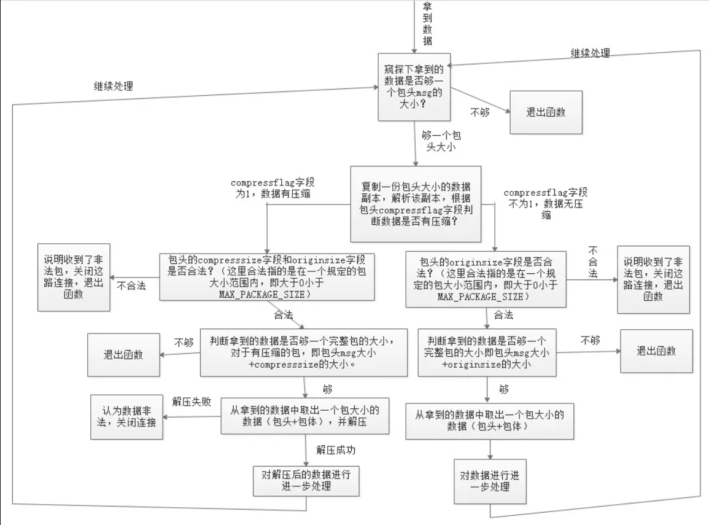
</div>

### 二、服务器端发送数据时，如果对端一直不收，怎么办？

这类问题一般出现在跨部门尤其是与外部开发人员合作的时候。假设现在有这样一种情况，我们的服务器提供对外的服务，指定好了协议，然后对外提供服务，客户端由外部人员去开发，由于存在太多的不确定性，如果我们在给对端（客户端）发送数据时，对端因为一些问题（可能是逻辑 bug 或者其他的一些问题）一直不从 socket 系统缓冲区中收取数据，而服务器端可能定期产生一些数据需要发送给客户端，再发了一段时间后，由于 TCP 窗口太小，导致数据发送不出去，这样待发送的数据会在服务器端对应的连接的发送缓冲区中积压，如果我们不做任何处理，很快系统就会因为缓冲区过大内存耗尽，导致服务被系统杀死。

对于这种情况，我们一般建议从以下几个方面来增加一些防御措施：

#### 1.场景 1

设置每路发送连接的发送缓冲区大小上限（如 2MB，或者小于这个值），当某路连接上的数据发送不出去的时候，即将数据存入发送缓冲区时，先判断一下缓冲区最大剩余空间，如果剩余空间已经小于我们要放入的数据大小，也就是说缓冲区中数据大小会超过了我们规定的上限，则认为该连接出现了问题，关闭该路连接并回收相应的资源（如清空缓冲区、回收套接字资源等）。示例代码如下：

```cpp{.line-numbers}
// outputBuffer_ 为发送缓冲区对象
size_t remainingLen = outputBuffer_.remainingBytes();
// 如果加入到缓冲区中的数据长度超出了发送缓冲区最大剩余量
if (remainingLen < dataToAppend.length())
{
		forceClose()
		return
}

outputBuffer_.append(static_cast<const char*>(dataToAppend.c_str()), dataToAppend.length());
```

#### 2.场景 2

还有另外一种场景，当有一部分数据已经积压在发送缓冲区了，此后服务器端未产生新的待发送的数据，此时如果不做任何处理，发送缓冲区的数据会一直积压，但是发送缓冲区的数据容量也不会超过上限。如果不做任何处理的话，该数据会一直在缓冲区中积压，白白浪费系统资源。对于这种情况一般我们会设置一个定时器，每隔一段时间（如 3 秒）去检查一下各路连接的发送缓冲区中是否还有数据未发送出去，也就是说如果一个连接超过一定时间内还存在未发送出去的数据，我们也认为该连接出现了问题，我们可以关闭该路连接并回收相应的资源（如清空缓冲区、回收套接字资源等）。示例代码如下：

```cpp{.line-numbers}
// 每 3 秒检测一次
const int SESSION_CHECK_INTERVAL = 3000;

SetTimer(SESSION_CHECK_TIMER_ID, SESSION_CHECK_INTERVAL);

void CSessionManager::OnTimer()
{
    for (auto iter = m_mapSession.begin(); iter != m_mapSession.end(); ++iter)
    {
        if (!CheckSession(iter->value))
        {
            // 关闭 session，回收相关的资源
            iter->value->ForceClose();

            iter = m_mapSession.erase(iter);
        }
    }
}

void CSessionManager::CheckSession(CSession* pSession)
{
    if (!pSession->GetConnection().OutputBuffer.IsEmpty())
        return false;

    return true;
}
```

### 三、网络中收发数据的正确方式

在网络通信中，我们可能既要通过 socket 去发送数据也要通过 socket 来收取数据。那么一般的网络通信框架是如何收发数据的呢？注意，这里讨论的范围是基于各种 IO 复用函数（select、poll、epoll 等）来判断 socket 读写来收发数据，其他情形比较简单，这里就不提了。

我们这里以服务器端为例。服务器端接受客户端连接后，产生一个与客户端连接对应的 socket（Linux 下也叫 fd，为了叙述方便，以后称之为 clientfd），我们可以通过这个 clientfd 收取从客户端发来的数据，也可以通过这个 clientfd 将数据发往客户端。但是收与发在操作流程上是有明显的区别的。

#### 1.收数据的正确方式

对于收数据，当接受连接成功得到 clientfd 后，我们会将该 clientfd 绑定到相应的 I/O 复用函数上并监听其可读事件。不同的 I/O 复用函数可读事件标志不一样，例如对于 poll 模型，可读标志是 POLLIN，对于 epoll 模型，可读事件标志是 EPOLLIN。当可读事件触发后，我们调用 recv 函数从 clientfd 上收取数据（这里不考虑出错的情况），根据不同的网络模式我们可能会收取部分，或一次性收完。收取到的数据我们会放入接收缓冲区内，然后做解包操作。这就是收数据的全部"姿势"。__对于使用 epoll 的 LT 模式（水平触发模式），我们每次可以只收取部分数据；但是对于 ET 模式（边缘触发模式），我们必须将本次收到的数据全部收完__。

> ET 模式收完的标志是 recv 或者 read 函数的返回值是 -1，错误码是 EWOULDBLOCK，针对 Windows 和 Linux 下区别，前面章节已经详细地说过了。

这就是读数据的全部姿势。流程图如下：

<div align="center">
    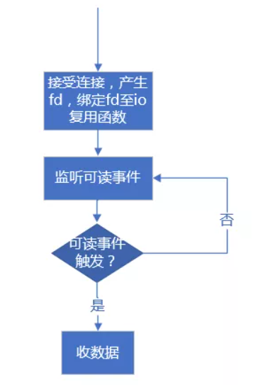
</div>

#### 2.发数据的正确方式

对于发数据，除了 epoll 模型的 ET 模式外，epoll 的 LT 模式或者其他 IO 复用函数，我们通常都不会去注册监听该 clientfd 的可写事件。**这是因为，只要对端正常收数据，一般不会出现 TCP 窗口太小导致 send 或 write 函数无法写的问题**。因此大多数情况下，clientfd 都是可写的，如果注册了可写事件，会导致一直触发可写事件，而此时不一定有数据需要发送。故而，如果有数据要发送一般都是调用 **`send`** 或者 **`write`** 函数直接发送，__如果发送过程中，**`send`** 函数返回 -1，并且错误码是 **`EWOULDBLOCK`** 表明由于 TCP 窗口太小数据已经无法写入时，而仍然还剩下部分数据未发送，此时我们才注册监听可写事件__，并将剩余的服务存入自定义的发送缓冲区中，等可写事件触发后再接着将发送缓冲区中剩余的数据发送出去，如果仍然有部分数据不能发出去，继续注册可写事件，当已经无数据需要发送时应该立即移除对可写事件的监听。这是目前主流网络库的做法。

如果在监听写事件期间，业务层又产生了新的数据需要发送，**我们就需要将这些新来的数据放到刚才剩余的待发数据的后面，即下次写事件触发后，先发送旧的数据再接着发送后来的新数据**。

流程图如下所示：

<div align="center">
    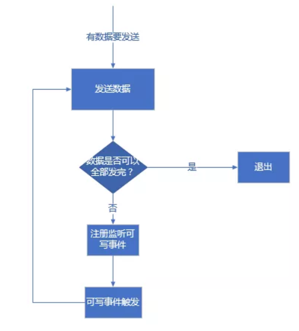
</div>

上述逻辑可以表述如下所示：

**直接尝试发送消息处理逻辑：**

```cpp{.line-numbers}
/**
 *@param data 待发送的数据
 *@param len  待发送数据长度
 */
void TcpConnection::sendMessage(const void* data, size_t len)
{    
    int32_t nwrote = 0;
    size_t remaining = len;
    bool faultError = false;
    if (state_ == kDisconnected) {
        LOGW("disconnected, give up writing");
        return;
    }

    // 当前未监听可写事件，且发送缓冲区中没有遗留数据
    if (!channel_->isWriting() && outputBuffer_.readableBytes() == 0) {
        // 直接发送数据
        nwrote = sockets::write(channel_->fd(), data, len);      
        if (nwrote >= 0) {
            remaining = len - nwrote;           
        }
        // nwrote < 0
        else {
            nwrote = 0;
            // 错误码不等于 EWOULDBLOCK 说明发送出错了
            if (errno != EWOULDBLOCK) {
                LOGSYSE("TcpConnection::sendInLoop");
                if (errno == EPIPE || errno == ECONNRESET) {
                    faultError = true;
                }
            }
        }
    }

    // 发送未出错且还有剩余字节未发出去
    if (!faultError && remaining > 0) {
        // 将剩余部分加入发送缓冲区
        outputBuffer_.append(static_cast<const char*>(data) + nwrote, remaining);
        if (!channel_->isWriting()) {
            // 注册可写事件
            channel_->enableWriting();
        }
    }
}
```

**不能全部发出去监听可写事件后，可写事件触发后处理逻辑：**

```cpp{.line-numbers}
// 可写事件触发后会调用 handleWrite() 函数
void TcpConnection::handleWrite()
{  
    // 将发送缓冲区中的数据发送出去
    int32_t n = sockets::write(channel_->fd(), outputBuffer_.peek(), outputBuffer_.readableBytes());
    if (n > 0) {
        // 发送多少从发送缓冲区移除多少
        outputBuffer_.retrieve(n);
        // 如果发送缓冲区中已经没有剩余，则移除监听可写事件
        if (outputBuffer_.readableBytes() == 0) {
            // 移除监听可写事件
            channel_->disableWriting();

            if (state_ == kDisconnecting) {
                shutdown();
            }
        }
    }
    else {
        // 发数据出错处理
        LOGSYSE("TcpConnection::handleWrite");           
        handleClose();
    } 
}
```

对于 epoll LT 模式注册监听一次可写事件后，可写事件触发后，尝试发送数据，如果数据此时还不能全部发送完，不用再次注册可写事件；如果是 epoll 的 ET 模式，注册监听可写事件后，可写事件触发后，尝试发送数据，如果数据此时还不能全部发送完，**需要再次注册可写事件以便让可写事件下次再次触发（给予再次发数据的机会）**。当然，这只是理论上的情况，实际开发中，如果一段数据反复发送都不能完全发送完（例如对端先不收，后面每隔很长时间再收一个字节），我们可以设置一个最大发送次数或最大发送总时间，超过这些限定，我们可以认为对端出了问题，应该立即清空发送缓冲区并关闭连接。

本节的标题是"收发数据的正确姿势"，其实还可以换一种说法，即"检测网络事件的正确姿势"，这里意指检测一个 fd 的读写事件的区别（对于侦听 fd，只检测可读事件）：

- 在 select、poll 和 epoll 的 LT 模式下，可以直接设置检测 fd 的可读事件；
- 在 select、poll 和 epoll 的 LT 模式下**不要直接设置检测 fd 的可写事件，应该先尝试发送数据，因为 TCP 窗口太小发不出去再设置检测 fd 的可写事件**，一旦数据发出去应立即取消对可写事件的检测。
- 在 epoll 的 ET 模式下，**需要发送数据时，每次都要设置检测可写事件**。

对于监听 **`fd`**，一般只监听其读事件，监听 **`fd`** 没有写事件处理逻辑。

#### 3.不要多个线程同时利用一个 socket 收（发）数据

TCP 连接是全双工的，收取数据和发送数据是独立的，所以利用同一个 socket 收取数据和发送数据不会相互影响。**在实际开发中，有不少应用对同一个 socket 收取数据使用一个线程，发送数据使用另一个线程**。

一定不要多个线程同时使用一个 socket 发送数据，或者多个线程同时使用一个 socket 收取数据。TCP 数据是有序的，以发送数据为例，如果多个线程同时对一个 socket 调用 send 函数，最终对端收到的数据顺序就无法保证了。例如现在有 3 个线程分别要发送 A、B、C三个数据块，对端期望收到的顺序是 A、B、C，但由于发送端使用了 3 个线程发送，所以对端收到的数据顺序不一定是 A、B、C，除非使用一定的线程同步策略让三个线程按 A、B、C 的顺序发送数据，但这种同步策略是非常麻烦的，而且没有必要。与其写这样的逻辑，还不如将其放在一个线程中操作。对于收取数据同理。

有读者可能会问：“我们平时所说的多线程上传或者下载文件，不是多线程同时对一个文件内容做读写吗？”这是不一样的，多线程上传或下载文件的原理是将文件按一定的大小切割成不同的内容块，然后开启多个连接，每个线程都操作一个连接对指定编号的文件内容块进行读写操作，在各个线程都完工后，按内容编号将文件重新组织起来。这在本质上并不是多个线程同时操作一个 socket，而是每个线程都只操作属于自己的文件块。

### 四、从 struct 到 TLV 编码

通信协议可以理解**两个节点之间为了协同工作实现信息交换，协商一定的规则和约定**，例如规定字节序，各个字段类型，使用什么压缩算法或加密算法等。常见的有 tcp，udp，http，sip 等常见协议。协议有流程规范和编码规范。流程如呼叫流程等信令流程，编码规范规定所有信令和数据如何打包/解包。

编码规范就是我们通常所说的**编解码，序列化**。**不光是用在通信工作上，在存储工作上我们也经常用到**。如我们经常想把内存中对象存放到磁盘上，就需要对对象进行数据序列化工作。本文采用先循序渐进，先举一个例子，然后不断提出问题-解决完善，这样一个迭代进化的方式，介绍一个协议逐步进化和完善，最后总结。看完之后，大家以后在工作就很容易制定和选择自己的编码协议。

本文例子是 A 和 B 通信，获取或设置基本资料，一般开发人员第一步就是定义一个协议结构：

```c
#pragma pack(push, 1)
struct userinfo {
    // 1 - get, 2 - set, 定义一个 short，为了扩展更多命令(理想那么丰满)
    int32_t cmd;
    // 1 – man , 2 - woman, 3 - ??
    char gender; 
    // 当然这里可以定义为 string name；或 len + value 组合，为了叙述方便，就使用简单定长数据
    char name[8]; 
}
#pragma pack(pop)
```

在这种方式下，A 基本不用编码，直接从内存 copy 出来，再把 cmd 做一下网络字节序变换，发送给 B。B 也能解析，一切都很和谐愉快。这时候编码结果可以用图表示为 (1 格一个字节)：

<div align="center">
    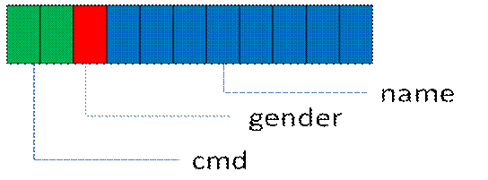
</div>

这种编码方式，我称之为紧凑模式，意思是除了数据本身外，没有一点额外冗余信息，可以看成是Raw Data。相信很多读者都定义过这样的协议，其数据结构简单明了，对端只要直接拷贝数据并按顺序解析各个字段就可以了。但是，需求总在变化，例如随着业务的发展，我们需要在这个结构中增加一个字段表示用户的年龄，则可将协议结构修改如下：

```c
#pragma pack(push, 1)
struct userinfo {
    int32_t cmd;
    char gender; 
    char name[8]; 
    int32_t age;
}
#pragma pack(pop)
```

在这种情况下，在技术上直接增加一个字段并不能完全解决问题，**因为新修改的协议格式在旧的客户端上无法兼容（旧的客户端已经分发出去）**，这时我们升级服务端的协议格式，会导致旧的客户端无法使用。所以在最初设计协议时，需要增加一个版本号字段，针对不同的版本做不同的处理：

```c
// 旧版协议，版本号为 1
#pragma pack(push, 1)
struct userinfo {
    // 版本号
    short version;
    // 命令号
    int32_t cmd;
    // 用户性别
    char gender;
    // 用户昵称
    char name[8]; 
}
#pragma pack(pop)

// 新的协议，版本号为 2
#pragma pack(push, 1)
struct userinfo {
    // 版本号
    short version;
    // 命令号
    int32_t cmd;
    // 用户性别
    char gender;
    // 用户昵称
    char name[8];
    // 用户年龄 
    int32_t age;
}
#pragma pack(pop)
```

可以用以下伪代码来兼容新旧协议：

```c{.line-numbers}
// 从包中读取一个 short 类型字段
short version = <从包中读取一个 short 类型字段>;
if (version == 1) {
    // 当作旧的协议格式进行处理
} else if (version == 2) {
    // 当作新的协议格式进行处理
}
```

以上是兼容旧版协议的常见做法，这样也存在一个问题，如果我们的业务需求变化快，则可能需要经常调整协议字段（增、删、改），这样我们的版本号数量会较多，代码会变成类似下面这种形式：

```c
// 从包中读取一个 short 类型字段
short version = <从包中读取一个 short 类型字段>;
if (version == 版本号 1) {
    // 对版本号 1 的格式进行处理
} else if (version == 版本号 2) {
    // 对版本号 2 的格式进行处理
} else if (version == 版本号 3) {
    // 对版本号 3 的格式进行处理
} else if (version == 版本号 4) {
    // 对版本号 4 的格式进行处理
} else if (version == 版本号 5) {
    // 对版本号 5 的格式进行处理
}
```

以上只考虑了协议顶层结构，没有考虑更复杂的嵌套结构，不管怎样，这样的代码会变得越来越难以维护。这里只是为了说明问题，在实际开发中，建议读者在设计协议时尽量考虑周全，避免反复修改协议的结构。

前述协议格式还存在另一个问题：对于 name 字段，其长度为 8 字节，这种定长的字段，长度大小不具有伸缩性：若太长，则在很多情况下都用不完，会造成内存和网络带宽的浪费；若太短，则在某些情况下不够用。那么有没有方法来解决呢？

我们可以在 `struct userinfo` 消息包中每一个属性中添加一个 len 字段，用来表示每个属性的长度。如下所示（每一个空格代表一个字节）：

<div align="center">
    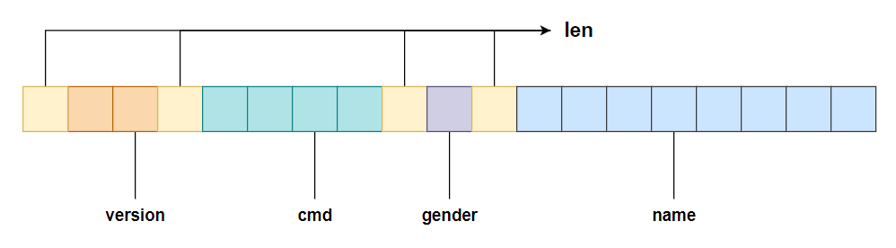
</div>

这种方法解决了定义字符串类型时太长浪费、太短不够用的问题，但是没有解决修改协议（如新增字段）需要兼容众多旧版本的问题，对于后面的问题，可以通过在每个字段前面都加一个 type 类型来解决。我们可以使用一个 char 类型来表示常用的类型，规定如下表所示。

<div align="center">
    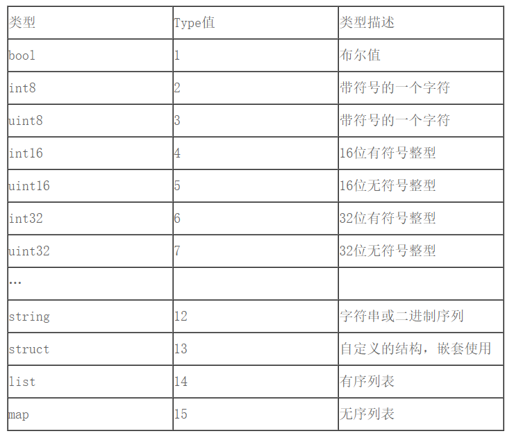
</div>

这样，每个字段的类型就是自解释了，**这就是 TLV（Type、Length、Value）**。对这种格式的协议，我们可以方便地增删改字段类型，程序在解析时会根据每个字段的 type 得到字段的类型。示意图如下所示：

<div align="center">
    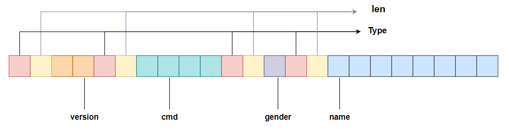
</div>

**其中 L 在 type 是定长的基本数据类型如 int、short、long、byte 时候，因为其长度是已知的，所以 L 不需要**。因此可以化简为如下图所示：

<div align="center">
    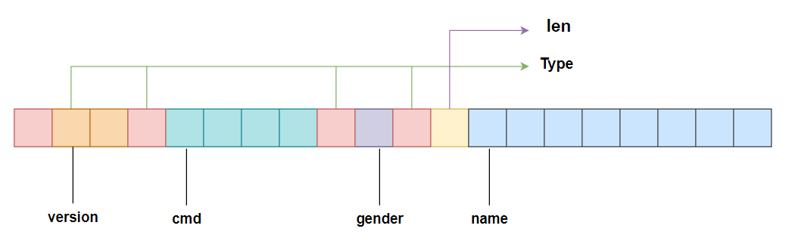
</div>

在实际开发中，TLV 类型虽然易于扩展，但也存在以下缺点：

1. TLV 格式因为每个字段都增加了一个 type 类型，所以占用的空间增大
2. 我们在解析字段时需要额外增加一些判断 type 的逻辑，去判断字段的类型并做相应的处理，如下面的代码所示，对每个字段都需要有这样的逻辑判断，这样的编码方式是非常麻烦的。

```c{.line-numbers}
// 读取第 1 字节得到 type
if (type == Type::BOOL) {
    // bool 型处理
}else if (type == Type::CHAR) {
    // char 型处理
}else if (type == Type::SHORT) {
    // short 处理
}
// 省略更多的类型
```

3. 即使我们知道了每个字段的技术类型（相对于业务来说），每个字段的业务含义也仍然需要我们制定文档格式，也就是说，TLV 格式只是做到了在技术上自解释。

有的项目在 `TLV` 格式的基础上扩展了一种 **`TTLV`** 格式的协议，即 **`Tag-Type-Length-Value`**，在每个字段前面都增加了一个 `Tag` 类型，这时 `Type` 表示数据类型，`Tag` 的含义由协议双方协定。

### 五、整形数值的压缩

在实际设计协议时，整型数值（如 int32、int64）在协议字段中出现的频率非常高。以上面介绍的 TLV 格式为例，**L 代表每个字段的长度（所占的字节数）**，假设用一个 int32 类型表示，int32 占 4 字节，则对于无符号的 int32 类型来说，其可表示的范围为 0～4294967295（Value 最多包括 4294967295 个字节）。在实际应用中不会用到太长的字段值，**因此可以根据字段实际的 length 值使用 1～n 字节表示这个 int32 的值**。

在实际处理中，一字节（Byte）共有 8 位（bit），**该字节的最高位用来作为标志位，说明一个整型数值是否到此字节结束，如果某字节的最高位为 0，则表示该整型值的内容到此字节结束；最高位为 1，表示下一字节仍然是该整型值的内容**。说得有点抽象，来看一个具体的例子。假设在一串字节流中存在如下二进制数字表示某个整型值：

<div align="center">
    
</div>

其中，第 1 字节是 **`10111011`**，其最高位是 1，说明其下一字节仍然属于表示该整型的序列；第 2 字节是 **`11110000`**，最高位仍然是 1；第 3 字节是 **`01110000`**，最高位是 0，表示这个整数的字节序列到此结束。**假定我们压缩时的顺序是低位内容在内存地址较小的位置，高位内容在内存地址较大的位置**，则将每字节的标志位（最高位）去掉后，其值如下：

<div align="center">
    
</div>

也就是 **`11100 00111000 00111011`**，转换成十进制为 1849403。使用上述技巧进行压缩的整型，由于一字节只使用了低 7 位（**最高位为标志位，一般称之为"字节前导位"**），一个int32 的整型数值共 4 字节（4 × 8 = 32）位，对其使用上述技巧压缩后，其长度可能是1～5 字节。**在实际的协议中基本上很少使用超过 3 字节以上的长度，因此这种压缩还是比较实用的（节省空间）**。

有了上面的分析，对于一个无符号 int32 的整型数值的压缩算法如下（节选自 POCO C++ 库，代码格式略有调整）：

```c{.line-numbers}
void BinaryWriter::write7BitEncoded(UInt32 value) {
    do {
        unsigned char c = (unsigned char) (value & 0x7F);
        value >>= 7;
        if (value) {
            c |= 0x80;
        }
        _ostr.write((const char*) &c, 1);
    } while(value);
}
```

以上代码对一个 **`uint32_t`** 整型 value 从低到高每次取 7 bit（因为上述压缩算法 1 byte 是由 1 个字节前导位和 7 个数据位组成），**判断 value 的值在去掉 7 bit 数据位后是否有剩余 (非 0 则说明有剩余)**，如果有剩余，则将当前字节最高 bit（标志位）设置为 1（如前所述，最高位为 1，说明下一个字节仍然属于表示该整形的序列），这样在得到一字节的值后，将其放入字节流容器 **`_ostr`** 中，字节流容器的类型只要有连续的内存存储序列即可。

假设现在 value 的值为十进制 125678，其二进制是 **`1 1110 1010 1110 1110`**，来看一下上述函数的执行过程。

**1) 第一次循环**

<div align="center">
    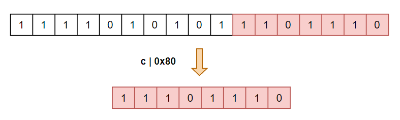
</div>

执行第 3 行的代码后，c = 110（十进制），二进制为 **`0110 1110`**（上图中红色部分），接着 value 右移 7 位，变为 981（二进制为 **`11 1101 0101`**），因此第 5 行代码为真，说明一个字节代表不了这个数值。给算出的 c 最高 bit 设置标志值为 1（通过第 6 行，`c |= 0x80`），得到第 1 字节值 238，二进制位 **`1110 1110`**。

**2) 第二次循环**

<div align="center">
    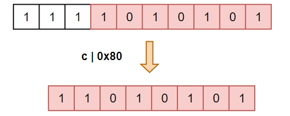
</div>

第二次循环 c 等于 85（十进制），二进制为 **`0101 0101`**，接着 value 右移 7 位后，value 的值为 7，因此仍然需要给算出的 c 最高 bit 设置标志位 1，得到第 2 字节值 213，二进制位 **`1101 0101`**。

**3) 第三次循环**

第三次循环 c 等于 7（十进制），二进制位 **`0111`**，然后将 value 右移 7 位，value 变为 0，因此直接得到第 3 字节的值为 7，退出循环。

理解整型的压缩算法后，就很容易弄明白其对应的解压缩算法了，代码如下（同样节选自 POCO C++ 库，代码格式略有调整）：

```c{.line-numbers}
void BinaryReader::read7BitEncoded(UInt32& value) {
    char c;
    value = 0;
    int s = 0;
    do {
        c = 0;
        _istr.read(&c, 1);
        UInt32 x = (c & 0x7F);
        x <<= s;
        value += x;
        s += 7;
    } while(c & 0x80);
}
```

以上代码从字节流容器 _istr 中挨个读取 1 字节，将当前字节与 0x7F 进行与运算，以取得该字节的低 7 位内容（代码第 8 行），然后将字节的内容与 0x80 进行与运算，以判断该字节的最高位是否为 1，进而确定下一字节是不是也属于整型值的内容。

### 六、设计通信协议时的注意事项

#### 1.字节对齐

在前面讨论的协议示例中有一组成对的 **`#pragma XX`** 指令，其中，**`#pragma pack(push, n)`** 用于告诉编译器将接下来的所有结构体（这里就是 userinfo 协议）的每一个字段都按 n 字节对齐，这里 n 为 1，所以按一字节对齐，即去除所有 padding 字节。这样做是为了使内存更加紧凑及节省存储空间。不再需要这个对齐功能后，应该使用 **`#pragma pack(pop)`** 让编译器恢复之前的对齐方式。

注意：#pragma pack(push，n) 与 #pragma pack(pop) 一定要成对使用，如果漏掉其中任何一个，则编译出来的代码可能会出现很多奇怪的运行结果。

#### 2.显式地指定整型字段的长度

对于一个 int 型字段，在其作为协议传输时，我们应该显式地指定该类型的长度，也就是说，应该使用 **`int32_t`**、**`int64_t`** 这样的类型代替 int、long。之所以这么做，是因为**在不同字长的机器上，默认的 int 和 long 的长度可能不一样**，例如 long 型在 32 位操作系统上的长度是 4 字节，在 64 位机器上的长度是 8 字节。如果不显式指定这种整形的长度，则可能因为不同机器字长的不同，导致协议解析出错或者产生错误的结果。

#### 3.涉及浮点数时要考虑精度问题

计算机表示浮点数时存在精度取舍不准确的问题，例如对于 1.000000，有的计算机可能会得到 0.999999。在某些应用中，如果这个浮点数的业务单位较大（例如表示金额，单位为亿），就会造成很大的影响。因此为了避免不同的机器解析得到不同的结果，**建议在网络传输时将浮点数值放大相应的倍数，变成整数或者转换为字符串来传输**。

#### 4.大小端问题

**在设计协议格式时，如果在协议中存在整型字段，则建议使用同一字节序**。通常的做法是在进行网络传输时将所有整型都转换为网络字节序（大端编码，Big Endian），避免不同的机器在解析时因为大小端问题而得到不同的整型值。当然，不一定非要转换为网络字节序，如果明确地知道通信双方使用的是相同的字节序，则也可以不转换。

### 七、包分片

包分片指的是应用层对包的拆分。当一个包的数据较大，超过一个包的最长长度时，我们需要对包进行分片。有人可能会有疑问：分成多个包就行了，为什么要对包进行分片？在实际应用中一般会根据业务需求对包的类型进行编号，例如使用一个 **`wCmd`** 表示业务号，但某些业务类型某次携带的数据可能较大，超过了单个包的最大长度，**这时需要将该数据拆分成多个包片，但其业务号隶属于同一个包，这就是包分片**。

理解包分片的原理后，设计包分片的功能就很简单了，这里提供了一种思路。在每个包分片的包头部分都有**是否包分片的标志位、该包的总分片数量和当前分片编号**。对于 TCP 来说，由于其数据传输本身是有序的，所以对于多个分片，只要我们的一端按顺序依次发送，另外一端收包时就一定会按发送的顺序收到，我们也不用考虑包分片的顺序问题。

来看一个具体的包分片的例子。假设现在有如下协议头定义：

```cpp{.line-numbers}
// 与客户端交互协议包头
#pragma pack(push, 1)
typedef struct tagNtPkgHead {
    // 协议包起始标志 0xFF
    unsigned char bStartFlag; 
    // 版本号
    unsigned char bVer;       
    // 加密标志（如果不加密，则为 0）
    unsigned char bEncryptFlag;  
    // 是否有包分片（1：有包分片；0：无包分片）
    unsigned char bFrag;
    // 总包长（header + body）
    unsigned short wLen;
    // 命令号
    unsigned short wCmd;
    // 包的序列号，业务使用
    unsigned short wSeq;
    // CRC16 校验码
    unsigned short wCrc;
    // 会话 ID
    unsigned int dwSID;
    // 有包分片时的分片总数
    unsigned short wTotal;
    // 有包分片时的分片序号，从 0 开始，无分片时也为 0
    unsigned short wCurSeq;
} NtPkgHead, *PNtPkgHead;
#pragma pack(pop)
```

对端处理包分片时的逻辑伪代码如下：

```cpp{.line-numbers}
UINT CSocketClient::RecvDataThreadProc(LPVOID lpParam) {
    LOG_NORMAL("Start recv data thread,");
    DWORD dwWaitResult;
    std:istring strPkg;
    // 临时存放一个完整的包数据（如果有多个包分片的话，将这多个包分片合并起来）的变量
    std::string strTotalPkg;
    // 接收到的一个完整数据包的长度（header + body）
    unsigned short uPkgLen = 0;
    // 接收到的一个完整数据包的包体长度
    unsigned int uBodyLen = 0;
    // 如果有包分片的话，多个包分片合起来的长度
    unsigned int uTotalPkgLen = 0;
    unsigned int uCmd = 0;
    NtPkaHead pkgHead;
    // 有包分片时的分片总数
    unsigned short uTotal = 0;
    // 记录上一次的包分片序号，包分片序号从 0 开始
    unsigned short uCurSeq = 0;
    int nWaitTimeout = 1;
    CSocketClient* pSocketClient = (CSocketClient*) lpParam;

    while (!m_bExit) {      
        // 检测是否有数据
        if (!pSocketClient->CheckReceivedData()) {
            // 休眠 10 豪秒
            Sleep(10);
            continue;
        }
            
        // 接收数据，并放入 pSocketClient->m_strRecvBuf 中
        if (!pSocketClient->Recv()) {
            LOG_ERROR("Recv data error"); 
            // 收数据出错，清空接收缓冲区，可以做一些关闭连接、重连等动作，
            pSocketClient->m_strRecvBuf.clear();
            Reconnect();
            continue;
        }

        // 一定要放在一个循环里面解包，因为可能一片数据中有多个包，
        while (true) {
            // 判断当前收到的数据是否够一个包头大小
            if (pSocketClient->m_strRecvBuf.length() < sizeof(NtPkgHead))
                break;

            memset(&pkgHead, 0, sizeof(pkgHead));
            // 将接收缓冲区中的包头数据（header）保存到 pkgHead 中
            memcpy_s(&pkgHead, sizeof(pkgHead), pSocketClient->m_strRecvBuf.c_str(), sizeof(pkgHead));
			
			// 对包消息头检验
            if (!CheckPkgHead(&pkgHead)) {
                // 如果包头检验不通过，缓冲区里面的数据已经是脏数据了，直接清空掉，
                // 可以做一些关闭连接并重连的动作             
                LOG_ERROR("Check package head error, discard data %d bytes", (int)pSocketClient->m_strRecvBuf.length());
                pSocketClient->m_strRecvBuf.clear();
                Reconnect();
                break;
            }

            // 判断当前数据是否够一个整包的大小
            uPkgLen = ntohs(pkgHead.wLen);
            if (pSocketClient->m_strRecvBuf.length() < uPkgLen)
                break;

            strPkg.clear();
            // 将接收缓冲区中完整的包数据（header + body）保存到 strPkg 中
            strPkg.append(pSocketClient->m_strRecvBuf.c_str(), uPkgLen);
            // 从收取缓冲区中移除已经处理的数据部分
            pSocketClient->m_strRecvBuf.erase(0, uPkgLen);
       
            // 包分片的总数
            uTotal = ::ntohs(pkgHead.wTotal);
            // 包分片的序号
            uCurSeq = ::ntohs(pkgHead.wCurSeq);
            // 无分片或第一个分片
            if (uCurSeq == 0) {
                strTotalPkg.clear();
                uTotalPkgLen = 0;
            }

            uBodyLen = uPkgLen - sizeof(NtPkgHead);
            uTotalPkgLen += uBodyLen;
            strTotalPkg.append(strPkg.data() + sizeof(NtPkgHead), uBodyLen);

            // 无分包 或 分包的最后一个包 则将组装后的包发送出去
            if (uTotal == 0 || (uTotal != 0 && uTotal == uCurSeq + 1)) {
                uCmd = ::ntohs(pkgHead.wCmd);
                // ProxyPackage 是解析出来的业务包定义
                ProxyPackage proxyPackage;
                // 拷贝业务号
                proxyPackage.nCmd = uCmd;
                // 拷贝包长度
                proxyPackage.nLength = uTotalPkgLen;
                // 拷贝包体内容
                proxyPackage.pszJson = new char[uTotalPkgLen];
                memset(proxyPackage.pszJson, 0, uTotalPkgLen * sizeof(char));
                memcpy_s(proxyPackage.pszJson, uTotalPkgLen, strTotalPkg.c_str(), strTotalPkg.length());

                // 将一个完整的包交给业务处理
                pSocketClient->m_pNetProxy->AddPackage((const char*)&proxyPackage, sizeof(proxyPackage));
            }
        }// end inner-while-loop
    }// end outer-while-loop

    LOG_NORMAL("Exit recv data thread.");
    return 0;
}
```

以上代码在一个网络数据收取线程中，先检测是否有可读数据，如果有可读数据，则从 socket 上读取该数据并存入接收缓冲区 **`pSocketClient->m_strRecvBuf`** 中，然后判断收到的数据是否够一个包头大小（**`sizeof(NtPkgHead)`**），如果不够，则退出当前循环，等待后续数据的到来；如果够，则对包头数据进行校验，然后从包头中得到整包的大小（**`ntohs(pkgHead.wLen)`**），这里表示整包大小的字段 wLen 使用了网络字节序，我们调用 ntohs函数可以得到本机字节序）。接着判断收到的数据是否够一个整包的大小，如果不够，则退出当前循环等待后续数据的到来；如果够，则根据记录当前包分片序号的变量 **`uCurSeq`**（**`uCurSeq = ntohs(pkgHead.wCurSeq)`**）确定该包是否是某个分片。

**`uCurSeq`** 等于 0，说明此次是从一个新的包片或完整的包开始的；从接收缓冲区中将当前包片或者完整包的数据放入变量 **`strTotalPkg`** 中存储起来。接着，根据包头字段 **`pkgHead.wTotal`** 和 **`pkgHead.wCurSeq`** 转换成本机字节序的值，判断这是否是一个完整的包或者是最后一个包分片，如果是的话，此时 **`strTotalPkg`** 存放的就是一个完整的包数据了，接着将其拷贝出来（这里是拷贝到 **`ProxyPackage`** 结构中）进行业务逻辑处理。

如果当前包片只是一个大包的中间包片，则继续进行下一轮数据的处理。在 **`strTotalPkg`** 中存放的数据在到达一个完整的包时，会在业务处理后、下一轮循环存入新的包片数据前清空。

### 八、一个自定义协议示例

本节结合前面的理论知识，演示如何自定义一个灵活的通信协议类。这个协议也分为包头和包体两部分，其中包头的定义如下：

```c
#pragma pack(push, 1)
// 协议头
struct chat_msg_header {
    // 压缩标志，如果为 1，则启用压缩，反之不启用压缩
    char compressflag;
    // 包体压缩前的大小
    int32_t originsize;
    // 包体压缩后的大小
    int32_t compresssize;
    // 保留字段，用于将来扩展
    char reserved[16];
}
#pragma pack(pop)
```

在得到了包体的内容后，我们就可以按通信两端规定好的协议逐个解析业务字段了。假设这是一个聊天内容协议，发送方的示例代码如下：

```cpp{.line-numbers}
// 发送方组装包体的格式
std::string outbuf;
net::BinaryStreamWriter writeStream(&outbuf);
// 消息类型，msgType
writeStream.WriteInt32(msg_type_chat);
// 消息序号，seq
writeStream.whiteInt32(m_seq);
// 发送者 ID，senderId
writeStream.Write(sendezId);
// 消息内容，chatMsg
writeStream.WriteString(chatMsg);
// 接受者ID，receiverId
writeStream.WriteInt32(receiverId):
writeStream.Flush();
```

在以上代码开始处定义了一个自动扩展的字符串缓冲区 **`outbuf`**（这里使用了 **`std::string`**），然后依次写入字段信息（如下表所示）。写入上述几个字段后，消息体的结构如下图所示。

<div align="center">
    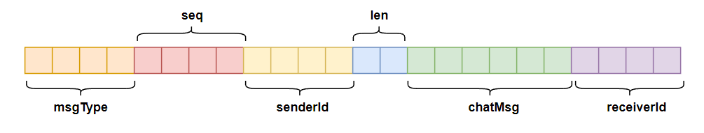
</div>

在上图中有一个小细节，即对于 **`string`** 类型的消息，在写入实际的字符串内容之前会先写入这个字符串的长度，**`writeStream.WriteString(chatMsg)`** 函数的实现如下：

```cpp{.line-numbers}
bool BinaryStreamWriter::WriteString(const string& str) {
    // 实际调用了 WriteCString 方法
    return WriteCString(str.c_str(), str.length());
}

bool BinaryStreamWriter::WriteCString(const char* str, size_t len) {
    std::string buf;
    write7BitEncoded(len, buf);
    // 先把字符串消息的长度保存到 m_data 中
    m_data->append(buf);
    // 再把字符串消息保存到 m_data
    m_data->append(str, len);

    return true;
}
```

这里的 **`m_data`** 是前面介绍的 outbuf 的指针，也就是说，使用一个 **`std::string`** 存放二进制流时，**`BinaryStreamWriter::WriteCString`** **方法会先将字符串的长度写入流中，再写入字符串本身的内容**，对于字符串的长度，会根据其长度值压缩成 1～5 字节：

```cpp{.line-numbers}
// 将一个 1~5 个字节的字符数组值还原成 4 字节的整型值
void read7BitEncoded(const char* buf, uint32_t len, uint32_t& value) {
    char c;
    value = 0;
    int bitCount = 0;
    int index = 0;
    do {
        c = buf[index];
        uint32_t x = (c & 0x7F);
        x <<= bitCount;
        value += x;
        bitCount += 7;
        ++index;
    }while(c & 0x80);
}
```

写入上述 5 个字段后会调用 **`writeStream.Flush`** 方法，该方法的实现如下：

```cpp{.line-numbers}
void BinaryStreamWriter::Flush() {
    char* ptr = &(*m_data)[0];
    unsigned int ulen = htonl(m_data->length());
    // 将数据流的长度写入到流中
    memcpy(ptr, &ulen, sizeof(ulen));
}
```

**其作用是在流的前 4 字节处存放流数据的长度**，存储长度使用的是网络字节序，这 4 字节在创建 BinaryStreamWriter 对象时被预留出来：

```cpp{.line-numbers}
namespace net
{
    enum
    {
        // 4 字节头长度
        BINARY_PACKLEN_LEN_2 = 4,               
        // 包最大长度是 256M，足够了
        BINARY_PACKAGE_MAXLEN_2 = 0x10000000,  
        // 2 字节的检验和 
        CHECKSUM_LEN = 2,
    };
}

BinaryStreamWriter::BinaryStreamWriter(string* data): m_data(data) {
    m_data->clear();
    char str[BINARY_PACKLEN_LEN_2 + CHECKSUM_LEN];
    m_data->append(str, sizeof(str));
}
```

实际上，在 **`m_data`** 指向的流起始处一共预留了 6 字节，前 4 字节存放将来整个流数据的长度（网络字节序），后两字节存放数据的校验和（checksum，这里未使用）。

这个二进制流虽然在这里的含义是包体部分，但是已经可以做到自我分界和解析了。**在简单的业务中，我们先读取 4 字节的** **`streamLength`**，然后根据 **`streamLength`** **转换成本机字节序后的长度来获取实际的内容长度**。但是这样不够方便，所以这里没有在这个流的基础上继续扩展，而是选择在这个流的前面再加一个包头定义（即以上代码中的 **`chat_msg_header struct`**）。**`chat_msg_header struct`**（包头）和这里的流（包体）组装成一个完整的包：

```cpp{.line-numbers}
// p 即包体流的指针
void TcpSession::sendPackage(const char* p, int32_t length) {
    string srcbuf(p, length);
    string destbuf;
    // 按需压缩
    if (m_bNeedCompress) {
        if (!ZlibUtil::compressBuf(srcbuf, destbuf)) {
            LOGE("compress buf error");
            return;
        }
    }

    string strPackageData;
    chat_msg_header header;
    if (m_bNeedCompress) {
        // 设置压缩标志
        header.compressflag = PACKAGE_COMPRESSED;
        // 设置压缩后的包体大小
        header.compresssize = destbuf.length();
    } else {
        header.compressflag = PACKAGE_UNCOMPRESSED;
    }

    // 设置压缩前的包体大小
    header.originsize = length;
    // 插入真正的包头
    strPackageData.append((const char*) &header, sizeof(header));
    strPackageData.append(destbuf);

    // 将整个包发送到网络上
    conn->send(strPackageData);
}
```

BinaryStreamWriter 对浮点数的处理，是先将浮点数按一定的精度转换成字符串，然后将字符串写入流中：

```cpp{.line-numbers}
// isNULL 参数表示可以写入一个 double 类型的占位符
bool BinaryStreamWriter::WriteDouble(double value, bool isNULL) {
    char doublestr[128];
    if (isNULL == false) {
        sprintf(doublestr, "%f", value);
        WriteCString(doublestr, strlen (doublestr));
    } else {
        WriteCString (doublestr, 0);
    }
    
    return true;
}
```

以上便是对这个自定义协议的装包过程，在解包过程中实现了一个 **`BinaryStreamReader`** 类，该类的操作对象是去除了包头的 **`chat_msg_header`** 结构后拿到的包体流。

