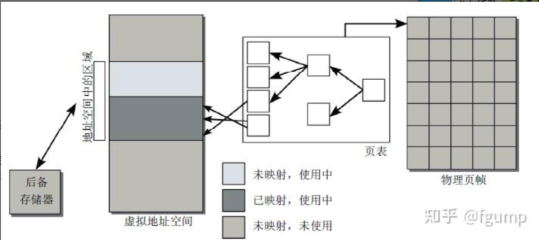
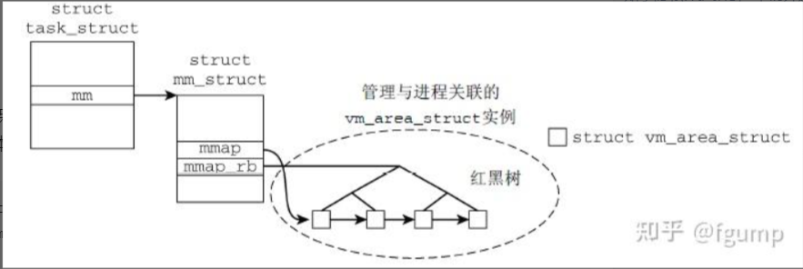
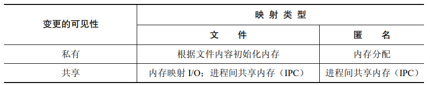
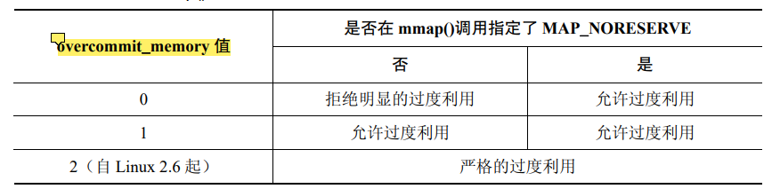
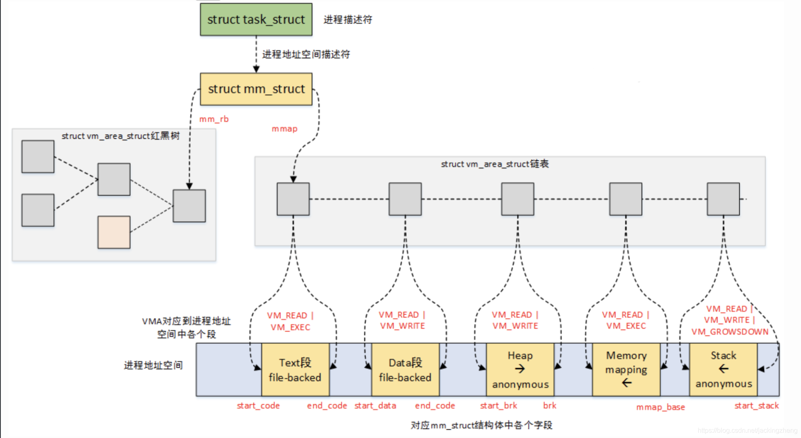
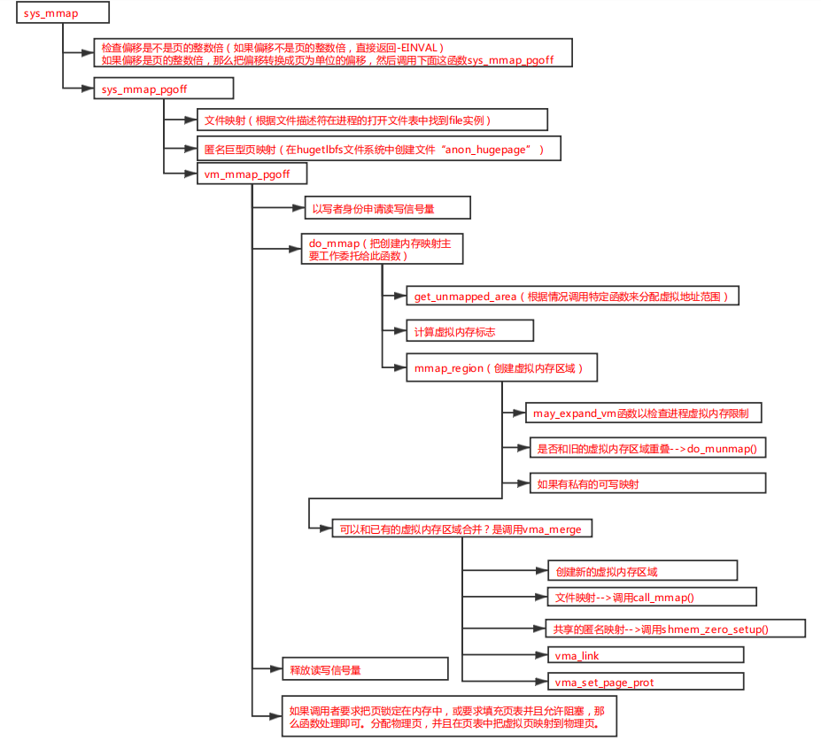

# 高级 I/O 函数之 mmap

## 1.mmap 函数原理讲解

首先尝试从内核的角度来介绍一下 mmap 函数，我们都知道虚拟地址空间的概念，它向每个运行进程提供了同样的系统视图，这使得多个进程可以同时运行，而不会干扰到其他进程内存中的内容。其本质上是通过页表将虚拟地址空间中的页与物理内存中的页帧关联起来。

<div align="center">
    
</div>

而虚拟内存区域在内核中实现如下。Linux 使用 **`task_struct`** 来表示进程/线程，因为 Linux 内核本身并不区分进程和线程，都表达为一个 **`task_struct`** 供内核调度。与每个进程相关联的虚拟内存信息使用结构体 **`mm_struct`** 表示。而具体的每个虚拟内存区域使用 **`vm_area_struct`** 表示，并且将这些 **`vm_area_struct`** 组织为线性链表和红黑树数据结构。也就是说每个进程的虚拟内存区域都在这个数据结构里。

<div align="center">
    
</div>

**`vm_area_struct`** 结构体里保存了这块区域的起始地址和结束地址，以及 **`file`** 对象，如果没有与文件相关联的话，**`file`** 为空。具体还有其他的属性如下。

```c{.line-numbers}
struct vm_area_struct {
    /* 所属地址空间。 */
    struct mm_struct * vm_mm; 
    /* vm_mm 内的起始地址。 */
    unsigned long vm_start;   
    /* 在 vm_mm 内结束地址之后的第一个字节的地址。 */
    unsigned long vm_end;     
    
    /* 各进程的虚拟内存区域链表，按地址排序 */
    struct vm_area_struct *vm_next;
    /* 该虚拟内存区域的访问权限。 */
    pgprot_t vm_page_prot; 
    /* 标志，如下列出。 */
    unsigned long vm_flags; 
    struct rb_node vm_rb;
    ...
    /* 后备存储器的有关信息： */
    /* （vm_file 内）的偏移量，单位是 PAGE_SIZE，不是 PAGE_CACHE_SIZE */
    unsigned long vm_pgoff;
    /* 映射到的文件（可能是 NULL）。 */ 
    struct file * vm_file; 
}
```

那么现在来看 mmap 实现其实本质上就是新建了一个 **`vm_area_struct`** 对象，然后插入到红黑树的合适位置 (**`vm_area_struct`** 根据指向的区域起始地址有序)，然后什么都不干。那么当进程试图访问这段内存区域中包含的虚拟地址时，会发生如下情况：

1. 通过页表发现物理内存中没有关联页（不在物理内存中）。
2. 处理器接下来触发一个缺页异常，发送到内核。
3. **内核会搜索负责缺页区域的进程地址空间的** **`vm_area_struct`** 红黑树，找到对应的虚拟内存区域，发现与之关联的文件对象。
4. 分配物理内存页，并从文件中读取所需数据填充，如果不特别指明的话，内存页是从内核空间中分配。
5. 填充页表，应用程序恢复执行，重新执行指令。

总结上述内容，原理部分就是相当于把文件内容映射成一个内存页，当访问的对应的内存页的时候，触发缺页中断，然后由操作系统走文件系统驱动去读取文件。接下来详细介绍 **`mmap`** 的原理，

要知道，**`Windows`** 的文件系统驱动，默认都是 **`PAGING_IO`** 模式，按道理说 **`Windows`** 上的文件系统访问，默认都是 mmap 形式的变种，那么为什么各个操作系统又额外提供一套 mmap 的 API 呢？

我们正常读写一个文件，用户代码通常需要先申请一块内存，然后把这块内存下发给内核，然后通过文件系统代码读、写文件。但是这么做有一个性能问题。用户代码的这块内存，通常是不对齐的（不对齐到 4K 页），那么当文件系统要通过 DMA 的方式访问磁盘的时候，这块内存通常是不能直接作为 **`DMA buffer`** 下发到硬件驱动里。

于是，用户要读一个文件，就需要内核先准备一个对齐的内存下发给驱动（也就是 block cache），驱动再下发给硬件，读好数据以后，再从内核的这个内存里复制到用户的内存，需要 1-2 次内存拷贝（memcpy），如果数据量比较巨大的话，拷贝的开销是很大的。

而 mmap 就不一样，**mmap 的内存是由内核初始化的，用户代码只是拿到了一个 fd，内核初始化这块内存以后，是可以直接交给文件系统，甚至是块设备驱动使用的**，加上 Linux 的零拷贝（zero copy）技术，可以减少或者避免 memcpy 动作。同时这块内存又是对用户直接可见的，从内核态切换到用户态的过程中，不需要执行任何拷贝动作。

> 可以理解成一般的进程读文件，所开辟的内存是进程自己开辟的用户态中的内存。而 mmap 进程读取的内存直接是内核中开辟的内存。内核的虚拟地址空间和应用进程的虚拟地址空间都会映射（共享）这块物理内存。

## 2.mmap 详解

### 2.1 四种不同的内存映射创建和使用方式

在 mmap 中根据映射变更的可见性，可以分为私有、共享映射，根据映射的类型，可以分为文件、匿名映射，因此得到的组合如下所示：

<div align="center">
    
</div>

**1) 私有文件映射**

映射的内容被初始化为一个文件区域中的内容。**多个映射同一个文件的进程初始时会共享同样的内存物理分页**，但系统使用**写时复制技术**使得一个进程对映射所做出的变更对其他进程不可见。这种映射的主要用途是使用一个文件的内容来初始化一块内存区域。

**2) 私有匿名映射**

每次调用 mmap() 创建一个私有匿名映射时都会产生一个新映射，该映射与同一（或不同）进程创建的其他匿名映射是不同的（即不会共享物理分页）。尽管子进程会继承其父进程的映射，但写时复制语义确保在 fork() 之后父进程和子进程不会看到其他进程对映射所做出的变更。**私有匿名映射的主要用途是为一个进程分配新（用零填充）内存（如在分配大块内存时 malloc() 会为此而使用 mmap()）**。

**3) 共享文件映射**

所有映射一个文件的同一区域的进程会共享同样的内存物理分页，这些分页的内容将被初始化为该文件区域。这种映射主要用于两个用途。第一，它允许内存映射 I/O，这表示一个文件会被加载到进程的虚拟内存中的一个区域中**并且对该块内容的变更会自动被写入到这个文件中**。这种映射的第二种用途是允许无关进程共享一块内容执行（快速）IPC。

**4) 共享匿名映射**

与私有匿名映射一样，每次调用 mmap() 创建一个共享匿名映射时**都会产生一个新的、与任何其他映射不共享分页的**截然不同的映射。这里的差别在于映射的分页不会被写时复制。这意味着当一个子进程在 fork() 之后继承映射时，父进程和子进程共享同样的 RAM 分页，并且一个进程对映射内容所做出的变更会对其他进程可见。共享匿名映射允许 IPC，**但只有相关进程之间才能这么做**。

mmap 的 **`prot`** 参数指定了新内存映射上的保护信息，如果一个进程在访问一个内存区域时违反了该区域上的保护位，那么内核会向该进程发送一个 **`SIGSEGV`** 信号。底层硬件在保护粒度上的限制（如老式的 x86-32 架构）意味着在很多 UNIX 实现上 **`PROT_READ`** 会隐含 **`PROT_EXEC`**，反之亦然，并且在一些实现上指定 **`PROT_WRITE`** 会隐含 **`PROT_READ`**。但应用程序不应该依赖于这种行为。

### 2.2 解除映射区域 munmap

**`munmap()`** 系统调用执行的操作和 mmap() 相反，它从调用进程的虚拟地址空间中删除一个映射。一般来讲通常会解除整个映射。因此可以将 addr 指定为上一个 **`mmap()`** 调用返回的地址，并且 length 的值与 **`mmap()`** 调用中使用的 length 的值一样。

```c{.line-numbers}
addr = mmap(NULL, length, PROT_READ | PROT_WRITE, MAP_PRIVATE, fd, 0);
if (addr == MAP_FAILED)
    errExit("mmap");
/* Code for working with mapped region */
if (munmap(addr, length) == -1) 
    errExit("munmap");
```

或者也可以解除一个映射中的部分映射，这样原来的映射要么会收缩，要么会被分成两个。还可以指定一个跨越多个映射的地址范围，这样的话所有在范围内的映射都会被解除。如果在由 addr 和 length 指定的地址范围中不存在映射，那么 **`munmap()`** 将不起任何作用并返回 0（表示成功）。

当一个进程终止或执行了一个 **`exec()`** 之后进程中所有的映射会自动被解除。

### 2.3 文件映射

在打开描述符 fd 引用的文件时必须要具备与 prot 和 flags 参数值匹配的权限。特别地，文件必须总是被打开以允许读取（即将文件中的内容读取到内存区域），并且如果在 flags 中指定了 **`PROT_WRITE`** 和 **`MAP_SHARED`**，那么文件必须总是被打开以允许读取和写入，这是因为指定了以上两个属性，进程对于映射区内容的修改会被写回到磁盘文件中，因此文件必须可写。

#### 2.3.1 私有文件映射

私有文件映射最常见的两个用途如下所示：

- 允许多个执行同一个程序或使用同一个共享库的进程共享同样的（只读的）文本段，它是从底层可执行文件或库文件的相应部分映射而来的。
> 尽管可执行文件的文本段通常是被保护成只允许读取和执行访问（**`PROT_READ | PROT_EXEC`**），但在被映射时仍然使用了 **`MAP_PRIVATE`** 而不是 **`MAP_SHARED`**，这是因为**调试器或自修改的程序能够修改程序文本（在修改了内存上的保护信息之后），而这样的变更是不应该发生在底层文件上或影响到其他进程的**。
- 映射一个可执行文件或共享库的初始化数据段。这种映射会被处理成私有使得对映射数据段内容的变更不会发生在底层文件上。

#### 2.3.2 共享文件映射

共享文件映射存在两个用途：内存映射 I/O 和 IPC：

内存映射：由于共享文件映射中的内容是从文件初始化而来的，并且对映射内容所做出的变更都会自动反应到文件上，因此可以简单地通过访问内存中的字节来执行文件 I/O，而依靠内核来确保对内存的变更会被传递到映射文件中。这项技术它是使用 **`read()`** 和 **`write()`** 来访问文件内容这种方法的替代方案。

内存映射相比于传统的 **`read()/write()`** 函数优点有两个，第一个是减少了一次内核到用户空间的内存拷贝，第二个是节省了内存空间，当使用 read() 或 write() 时，数据将被保存在内核/用户空间两个缓冲区中。当使用 **`mmap()`** 时，内核空间和用户空间会共享同一个缓冲区（内核页表与用户页表中的表项指向相同的物理分页），对于多进程同理。

共享文件映射也可以作为进程间通信的一种方式。

### 2.4 内存保护和文件访问模式交互

从一般原则来讲，**`PROT_READ`** 和 **`PROT_EXEC`** 保护要求被映射的文件使用 **`O_RDONLY`** 或 **`O_RDWR`** 打开，而 **`PROT_WRITE`** 保护要求被映射的文件使用 **`O_RDWR`** 打开，这是因为如果映射区属性为 **`MAP_SHARED`**，那么在内存区中的修改会被写回到磁盘文件中，因此必须可写，如果映射区属性为 **`MAP_PRIVATE`**，那么文件可以以只读模式打开。

对于不同的硬件架构，下述结论是适用的：

- 所有内存保护组合与使用 **`O_RDWR`** 标记打开文件是兼容的
- 没有内存保护组合 —— 哪怕仅仅是 **`PROT_WRITE`** —— 与使用 **`O_WRONLY`** 标记打开的文件是兼容的（导致 **`EACCES`** 错误的发生）。这与一些硬件架构不允许对一个分页的只写访问这样一个事实是一致的。使用 **`O_WRONLY`** 标记打开的文件是不能暴露文件的初始内容的。
- 使用 **`O_RDONLY`** 标记打开一个文件的结果依赖于在调用 mmap() 时是否指定了 **`MAP_PRIVATE`** 或 **`MAP_SHARED`**。对于一个 **`MAP_PRIVATE`** 映射来讲，在 mmap() 中可以指定任意的内存保护组合——因为对 **`MAP_PRIVATE`** 分页内容做出的变更不会被写入到文件中，因此无法写入文件不会成为问题。对于一个 **`MAP_SHARED`** 映射来讲，唯一与 **`O_RDONLY`** 兼容的内存保护是 **`PROT_READ`** 和 (PROT_READ | PROT_EXEC)。这是符合逻辑的，因为一个 PROT_WRITE，MAP_SHARED 映射允许更新被映射的文件。

### 2.5 MAP_FIXED

在 mmap() flags 参数中指定 **`MAP_FIXED`** 标记会强制内核原样地解释 addr 中的地址，而不是只将其作为一种提示信息。如果指定了 **`MAP_FIXED`**，那么 addr 就必须是分页对齐的。

存在一种可移植应用程序需要使用 **`MAP_FIXED`** 的情况。如果在调用 mmap() 时指定了 **`MAP_FIXED`**，并且内存区域的起始位置为 addr，覆盖的 length 字节与之前的映射的分页重叠了，那么重叠的分页会被新映射替代。使用这个特性可以可移植地将一个文件（或多个文件）的多个部分映射进一块连续的内存区域，如下所述。

1. 使用 mmap() 创建一个匿名映射。在 mmap() 调用中将 addr 指定为 NULL 并且不指定 **`MAP_FIXED`** 标记。这样就允许内核为映射选择一个地址了。
2. 使用一系列指定了 **`MAP_FIXED`** 标记的 mmap()调用来将文件区域映射（即重叠）进在上一步中创建的映射的不同部分中。

尽管可以忽略第一个步骤而直接使用一系列 mmap() **`MAP_FIXED`** 操作来在应用程序选中的地址范围内创建一组连续的映射，但这种做法的可移植性与上面这种两步式做法相比就要差一些了。上面提及过，一个可移植的应用程序应该避免在固定的地址处创建新映射。上面的第一步避免了移植性问题的出现，因为这一步让内核选择了一个连续的地址范围，然后在该地址范围中创建新映射。

### 2.6 匿名映射

#### 2.6.1 MAP_PRIVATE 匿名映射

**`MAP_PRIVATE`** 匿名映射用来分配进程私有的内存块并将其中的内容初始化为 0。在 glibc 中的 malloc() 实现使用 **`MAP_PRIVATE`** 匿名映射来分配大小大于 **`MMAP_THRESHOLD`** 字节的内存块。这样在后面将这些内存块传递给 free() 之后就能高效地释放这些块（通过 munmap()）。它还降低了重复分配和释放大内存块而导致内存分片的可能性。**`MMAP_THRESHOLD`** 在默认情况下是 128 kB，但可以通过 mallopt() 库函数来调整这个参数。

#### 2.6.2 MAP_SHARED 匿名映射

**`MAP_SHARED`** 匿名映射允许相关进程（如父进程和子进程）共享一块内存区域而无需一个对应的映射文件。

## 3.MAP_NORESERVE 与过度利用交换空间

### 3.1 memory overcommit 介绍

虽然我们总是宣称每个进程都有自己独立的地址空间，但是这些地址空间都是虚拟地址空间。当进程需要内存时（例如通过 brk 分配内存），进程从内核获得的仅仅是一段虚拟地址的使用权，而不是实际的物理地址，进程并没有获得物理内存。实际的物理内存只有当进程真的去访问新获取的虚拟地址时（即开始要使用物理内存时），就会产生 "page fault (缺页异常)"，从而进入分配实际物理地址的过程，也就是分配实际的 page frame 并建立 page table。

因此，看起来虚拟内存和物理内存的分配被分割开了，这是否意味着进程可以任意的申请虚拟地址空间呢？也不行，毕竟 virtual memory 需要 physical memory 做为支撑，如果分配了太多的 virtual memory，和物理内存不成比例，超过了实际可用的内存，对性能会有影响。对于这个状况，我们称之为 overcommit。有个概念需要谨记：**内存申请不等于内存分配，内存只在实际用到的时候才分配**。

Linux 默认是允许 memory overcommit 的，所以 Linux 设计了一个 OOM killer 机制 (OOM = out-of-memory) 来处理 overcommit：挑选一个进程出来杀死，以腾出部分内存，如果还不够就继续杀。也可通过设置内核参数 **`vm.panic_on_oom`** 使得发生 OOM 时自动重启系统。这都是有风险的机制，重启有可能造成业务中断，杀死进程也有可能导致业务中断。因此 Linux 2.6 之后允许通过内核参数 **`vm.overcommit_memory`** 禁止 memory overcommit。

### 3.2 overcommit 相关参数介绍

#### 3.2.1 overcommit_memory

**`overcommit_memory`** 这个参数就是用来控制内核对 **`overcommit`** 的策略。该参数可以设定的值如下：

```c{.line-numbers}
include/uapi/linux/mman.h
#define OVERCOMMIT_GUESS        0
#define OVERCOMMIT_ALWAYS        1
#define OVERCOMMIT_NEVER        2
```

- **`OVERCOMMIT_GUESS`**：这是 Linux 的缺省值，它允许 overcommit，但是它会根据当前的系统可用虚拟内存来判断是否允许虚拟内存的申请。内核利用 **`__vm_enough_memory`** 判断你的内存申请是否合理，它认为不合理就会拒绝 overcommit。
- **`OVERCOMMIT_ALWAYS`**：内核不限制 overcommit，无论进程们 commit 了多少的地址空间的申请都不会拒绝。
- **`OVERCOMMIT_NEVER`**：always 的反面，禁止 overcommit，不允许超过系统设置的虚拟内存限制。

#### 3.2.2 overcommit_kbytes 和 overcommit_ratio

**`OVERCOMMIT_ALWAYS`** 总是允许出现 overcommit 现象，但是 **`OVERCOMMIT_NEVER`** 不行，这个策略下，系统不允许出现 overcommit。判断 overcommit 的标准，可以从 **`vm_commit_limit`** 这个函数看出端倪，需要注意的是这个标准的定义的内存大小既不是物理内存的大小，也不是 free memory 的大小：

```c{.line-numbers}
arch/arm/include/asm/page.h
/* PAGE_SHIFT determines the page size */
#define PAGE_SHIFT      12
 
mm/util.c
/*
 * Committed memory limit enforced when OVERCOMMIT_NEVER policy is used
 */
unsigned long vm_commit_limit(void)
{
    unsigned long allowed;
    // 如果 sysctl_overcommit_kbytes，则使用 overcommit_kbytes
    if (sysctl_overcommit_kbytes)
        // 这个操作实际上是将 kB 转换成以 page 为单位（1page = 4K），右移 2 位，相当于除以 4
        allowed = sysctl_overcommit_kbytes >> (PAGE_SHIFT - 10);
    else
        // 否则使用 overcommit_ratio
        allowed = ((totalram_pages - hugetlb_total_pages()) * sysctl_overcommit_ratio / 100);
    allowed += total_swap_pages;
    // 返回判断 overcommit 的阈值，是以 page（1page=4K）为单位的
    return allowed;
}
```

overcommit 的标准有两个途径来设定，第一个是直接定义 **`overcommit_kbytes`**（函数中 **`sysctl_overcommit_kbytes`** 非 0），这时候标准值是 **`overcommit_kbytes`** ＋ **`total_swap_pages`**。对于 **`total_swap_pages`**，稍微讲一下页面回收（page frame reclaim）机制。

内核是将一个较小的物理内存空间映射到一个较大的各个用户进程组成的虚拟地址空间之上。怎么办，最简单的方法就是“拆东墙补西墙（换入换出策略）”。但是，拆东墙（swap out）也是技术活，并不是所有进程的任何虚拟空间都可以拆。**比如说程序的正文段是可以拆，因为这些内存中的内容在磁盘上有保留**，当再次需要的时候（补西墙），可以从磁盘上中重新加载进来。不是所有的进程地址空间都在磁盘上有备份的，**像堆、stack这些进程的虚拟地址段都没有磁盘文件与之对应的**，也就是传说中的 anonymous page。对于 anonymous page，如果我们建立 swap file 或者 swap space，那么这些 anonymous page 也同样可以被交换到磁盘，并且在需要的时候 load 进内存。

现在回到 **`total_swap_pages`** 这个变量，它其实就是系统可以将 anonymous page 交换到磁盘的大小，如果我们建立 32MB 的 swap file 或者 swap space，那么 **`total_swap_pages`** 就是（32M/page size），这个 page size 默认是 4K。

overcommit 的第二个标准是：在 **`sysctl_overcommit_kbytes`** 设定为 0 的时候使用，**`和系统当前可用的 page frame 相关`**。不是系统中的物理内存有多少，**`totalram_pages`** 就有多少，实际上很多的 page 是不能使用的，例如 linux kernel 本身的正文段，数据段等就不能计入 **`totalram_pages`**，还有一些系统 reserve 的 page 也不算数，最终 **`totalram_pages`** **实际上就是系统可以管理分配的总内存数目**。**`overcommit_ratio`** 是一个百分比的数字，50 表示可以使用 50％ 的 **`totalram_pages`**，当然还有考虑 **`total_swap_pages`** 的数目，上文已经描述。

同时在使用 **`overcommit_ratio`** 时，要考虑是否使用了 huge pages，传统的 4K 的 page 和 huge page 的选择也是一个平衡问题。normal page 可以灵活的管理内存段，浪费少。但是不适合大段虚拟内存段的管理（**因为要建立大量的页表，TLB size 有限，因此会导致 TLB miss，影响性能**），huge page 和 normal page 相反。内核可以同时支持这两种机制，不过是分开管理的。由于本节描述的 overcommit 相关参数都是和 normal page 相关的，**因此在计算 allowed page 的时候要减去** **`hugetlb_total_pages`**。

如下就是 Linux 里面的跟 overcommit 相关的两个参数。其中 CommitLimit 就是 overcommit 的阈值，申请的内存总数超过 CommitLimit 的话就算是 overcommit。Committed_AS 表示所有进程已经申请的内存总大小（**注意是已经申请的，不是已经分配的**），**如果 Committed_AS 超过 CommitLimit 就表示发生了 overcommit**，超出越多表示 overcommit 越严重。由于这个 Linux 的 **`overcommit_memory`** 参数是 1，根据前面描述，可以知道是不限制 overcommit 的，所以出现 Committed_AS 大于 CommitLimit 情况。如果参数为 2，就绝对不会出现这种情况。同时当前 Linux 使用的是 **`overcommit_ratio`**（50%）而不是 **`overcommit_kbytes`**（为0）。

```shell{.line-numbers}
grep -i commit /proc/meminfo
CommitLimit:    12174056 kB
Committed_AS:   149507868 kB

User:/proc/sys/vm # cat overcommit_memory
cat overcommit_memory
1

User:/proc/sys/vm # cat overcommit_kbytes
cat overcommit_kbytes
0
User:/proc/sys/vm # cat  overcommit_ratio
cat  overcommit_ratio
50
```

#### 3.2.3 admin_reserve_kbytes 和 user_reserve_kbytes

这两个参数主要是防止内存管理模块把自己逼到绝境，避免出现意想不到的情况。上面我们提到拆东墙补西墙的机制，但是这种机制在某些情况下其实也不能正常的运作。例如进程A在访问自己的内存的时候，出现 page fault，通过 scan，将其他进程（B、C、D…）的“东墙”拆掉，分配给进程 A，以便让 A 可以正常运行。需要注意的是，"拆东墙"不是那么简单的事情，有可能需要进行磁盘 I/O 操作（比如：将 dirty 的 page cache flush 到磁盘）。

但是，系统很快调度到了 B 进程，而 B 进程立刻需要刚刚拆除的东墙，怎么办？B 进程立刻需要分配物理内存，如果没有 free memory，这时候也只能启动 scan 过程，继续找新的东墙。在极端的情况下，很有可能把刚刚补好的西墙拆除（在操作系统中，这也被称为抖动），这时候，整个系统的性能就会显著的下降，有的时候，用户点击一个 button，很可能半天才能响应。面对这样的情况，用户当然想恢复，例如 kill 那个吞噬大量内存的进程。这个操作也需要内存（需要 fork 进程），因此，为了能够让用户顺利逃脱绝境，系统会保留 **`user_reserve_kbytes`** 的内存。

对于支持多用户的 GNU/linux 系统而言，恢复系统可能需要 root 用来来完成，这时候需要保留一定的内存来支持 root 用户的登录操作，支持 root 进行 trouble shooting（使用ps，top 等命令），找到那个闹事的进程并 kill 掉它。这些为 root 用户操作而保留的 memory 定义在 **`admin_reserve_kbytes`** 参数中。**`sysctl_admin_reserve_kbytes`** 受内核参数 /proc/sys/vm/admin_reserve_kbytes 控制，同样 **`sysctl_user_reserve_kbytes`** 受内核参数 /proc/sys/vm/user_reserve_kbytes 控制。不过系统一般会给一个初始值，如下代码就是分别初始化 **`sysctl_admin_reserve_kbytes`** 和 **`sysctl_user_reserve_kbytes`** 参数，值分别为 8M 和 128M，正常这点内存大小是够用的，实际上就是最终值。如下函数解释里面也描述了。

```c{.line-numbers}
/*
 * Initialise sysctl_user_reserve_kbytes.
 *
 * This is intended to prevent a user from starting a single memory hogging
 * process, such that they cannot recover (kill the hog) in OVERCOMMIT_NEVER
 * mode.
 *
 * The default value is min(3% of free memory, 128MB)
 * 128MB is enough to recover with sshd/login, bash, and top/kill.
 */
static int init_user_reserve(void) {

    unsigned long free_kbytes;
 
    free_kbytes = global_zone_page_state(NR_FREE_PAGES) << (PAGE_SHIFT - 10);
    // 初始化时，默认设置为 128MB
    sysctl_user_reserve_kbytes = min(free_kbytes / 32, 1UL << 17);
    return 0;
}
subsys_initcall(init_user_reserve);
 
/*
 * Initialise sysctl_admin_reserve_kbytes.
 *
 * The purpose of sysctl_admin_reserve_kbytes is to allow the sys admin
 * to log in and kill a memory hogging process.
 *
 * Systems with more than 256MB will reserve 8MB, enough to recover
 * with sshd, bash, and top in OVERCOMMIT_GUESS. Smaller systems will
 * only reserve 3% of free pages by default.
 */
static int init_admin_reserve(void) {

    unsigned long free_kbytes;
 
    free_kbytes = global_zone_page_state(NR_FREE_PAGES) << (PAGE_SHIFT - 10);
    // 初始化时，默认设置为 8MB
    sysctl_admin_reserve_kbytes = min(free_kbytes / 32, 1UL << 13);
    return 0;
}
subsys_initcall(init_admin_reserve);
```

在 **`__vm_enough_memory`** 函数对应文件下，也再次设置了 **`sysctl_admin_reserve_kbytes`** 和 **`sysctl_user_reserve_kbytes`** 参数：

```c{.line-numbers}
// mm/util.c
int sysctl_overcommit_memory __read_mostly = OVERCOMMIT_GUESS;
int sysctl_overcommit_ratio __read_mostly = 50;
unsigned long sysctl_overcommit_kbytes __read_mostly;
int sysctl_max_map_count __read_mostly = DEFAULT_MAX_MAP_COUNT;
unsigned long sysctl_user_reserve_kbytes __read_mostly = 1UL << 17; /* 128MB */
unsigned long sysctl_admin_reserve_kbytes __read_mostly = 1UL << 13; /* 8MB */
```

### 3.3 MAP_NORESERVE 详解

一些应用程序**会创建大（通常是私有匿名的）映射，但只使用映射区域中的一小部分**。如特定的科学应用程序会分配非常大的数组，但只使用其中一些散落在数组各处的元素（所谓的稀疏数组）。

如果内核总是为此类映射分配（或预留）足够的交换空间，那么很多交换空间可能会被浪费。相反，内核可以只在需要用到映射分页的时候（即当应用程序访问分页时）为它们预留交换空间。这种方法被称为懒交换预留（lazy swap reservation）。

所谓为此类映射分配（或预留）足够的交换空间，其实就是程序使用 mmap 分配了 100MB 的空间（私有可写映射或者共享匿名映射），**那么交换空间中需要预留 100MB 的空间**，但是整个映射空间中可能只有很少的一部分被用到，因此所谓的过度利用交换空间/懒交换预留/MAP_NORESERVE 的意思其实就是，当映射中某个分页真正被使用到时，才在交换空间中预留相应大小的空间。

内核如何处理交换空间的预留是由调用 **`mmap()`** 时是否使用了 **`MAP_NORESERVE`** 标记以及影响系统层面的交换空间过度利用操作的 /proc 接口来控制的。**`MAP_NORESERVE`** 设置为是，那么就说明不提前预留交换空间，使用懒交换预留策略，允许过度利用内存。

<div align="center">
    
</div>

> **`#define OVERCOMMIT_GUESS  0`**
> **`#define OVERCOMMIT_ALWAYS  1`**
> **`#define OVERCOMMIT_NEVER  2`**

Linux 特有的 /proc/sys/vm/overcommit_memory 文件包含了一个整数值，它控制着内核对交换空间过度利用的处理。在 2.6 之前的 Linux 上这个文件中的整数只能取两个值：0 表示拒绝明显的过度利用（遵从 **`MAP_NORESERVE`** 标记的使用），大于 0 表示在所有情况下都允许过度利用。

从上面表格可以看出，当 **`overcommit_memory`** 值为 0 时，采用启发式算法，根据 **`MAP_NORESERVE`** 的值来判断是否允许过度利用；当 **`overcommit_memory`** 值为 1 或者 2 时，直接全部允许过度利用，或者拒绝的过度利用。拒绝过度利用意味着大小不超过当前可用空闲内存的映射是被允许的。

从 Linux 2.6 起，1 的含义与之前的内核中正数的含义一样，但 2（或更大）则会导致使用采用严格的过度利用。在这种情况下，内核会在所有 **`mmap()`** 分配上执行严格的记账并将系统中此类分配的总量控制在小于或等于：

```shell
[swap size] + [RAM size] * overcommit_ratio / 100
```

注意过度利用监控只适用于下面这些映射：

- 私有可写映射（包括文件和匿名映射），这种映射的交换"开销"等于所有使用该映射的进程为该映射所分配的空间总和。私有可写映射中发生的变更不会被写回，所以映射区域中发生的变更（文件、匿名映射）需要保存到交换空间中。
- 共享匿名映射，这种映射的交换"开销"等于映射的大小（因为所有进程共享该映射）。

为只读私有映射（包括文件和匿名映射）预留交换空间是没有必要的，因为映射中的内容是不可变更的，从而无需使用交换空间。共享文件映射也不需要使用交换空间，因为映射文件本身担当了映射的交换空间，物理内存空间不够时，直接将对应物理内存写回到磁盘文件中。当一个子进程在 **`fork()`** 调用中继承了一个映射时，它将会继承该映射的 **`MAP_NORESERVE`** 设置。

上面提及过当使用懒交换预留时，如果应用程序试图使用整个映射的话就会导致内存被耗尽。在这种情况下，内核会通过杀死进程来缓解内存消耗情况。

内核中用来在内存被耗尽时选择杀死哪个进程的代码通常被称为 **out-of-memory (OOM)** 杀手。OOM 杀手会尝试选择杀死能够缓解内存消耗情况的最佳进程，这里的"最佳"是由一组因素来确定的。如一个进程消耗的内存越多，它就越可能成为 OOM 杀手的候选目标。其他能提高一个进程被选中的可能性的因素包括进程是否创建了很多子进程以及进程是否拥有一个较低的 nice 值（即大于 0 的值）。内核一般不会杀死下列进程。

- 特权进程，因为它们可能正在执行重要的任务;
- 正在访问裸设备的进程，因为杀死它们可能会导致设备处理一个不可用的状态;
- 已经运行了很长时间或已经消耗了大量 CPU 的进程，因为杀死它们可能会导致丢失很多"工作";

## 4.mmap 函数源码

**`mmap`** 分为文件映射和匿名映射：

- 文件映射：将进程的虚拟内存区域映射到文件。即读取那些内存区域将导致文件被读取，这是默认的映射类型。
- 匿名映射：会映射该进程的虚拟内存中没有任何文件支持的区域，内容初始化为零。系统都通过 **`MAP_ANONYMOUS`** 和 **`MAP_ANON`** 标志实现了匿名映射，但它并不是 **`POSIX`** 标准的一部分。

如果设置 **`MAP_SHARED`** 标志，则将在 **`fork()`** 系统调用中保留该映射。即所有相关（及其子进程）进程中，一个进程对映射区域的写操作，对相关其他进程立即可见。说成人话：不同进程映射了同一块内存，所有进程对这块区域具有可见性。

**1) task_struct 结构体**

**`task_struct`** 这个结构体，它被叫做进程描述符，内部成员包含了很多与进程相关的信息，表示一个进程：

```c{.line-numbers}
struct task_struct {
    // 进程状态
    // -1 不可运行，0 可运行，>0 已停止
    volatile long state; 
    int exit_state;

    // 进程地址空间 
    // 进程所拥有的内存空间描述符，对于内核线程的 mm 为 NULL
    struct mm_struct *mm; 
    // 指进程运行时所使用的进程描述符
    struct mm_struct *active_mm; 

    // 进程标识符（PID） 
    pid_t pid;
    pid_t tgid;

    // 指定调度程序行为
    unsigned int flags;    
    // 表示进程亲属关系的成员 
    struct task_struct __rcu *real_parent;

    // 进程调度 
    int prio, static_prio, normal_prio;
    // 表示进程的调度策略 
    unsigned int policy; 
}
```

**2) mm_struct**

内存描述符的结构体———— **`mm_struct`**，抽象的来描述 Linux 下进程的地址空间的所有的信息，一个 **`task_struct`** 只有一个 **`mm_struct`**。

```c{.line-numbers}
struct mm_struct {
    // 指向线性区对象的链表头
    struct vm_area_struct * mmap;       /* list of VMAs */
    // 指向线性区对象的红黑树
    struct rb_root mm_rb;
    // vma 缓存存放最近找到的 vma（数组结构）
    struct vm_area_struct * mmap_cache; 
    // 标识第一个分配文件内存映射的线性地址
    unsigned long mmap_base;    /* base of mmap area */
    // 用来在进程地址空间中搜索有效的进程地址空间的函数
    unsigned long (*get_unmapped_area) (struct file *filp,
                unsigned long addr, unsigned long len,
                unsigned long pgoff, unsigned long flags);
  
    // 指向页表的目录
    pgd_t * pgd;
  
    // 进程地址空间的页数
    unsigned long total_vm;    
    // 锁住的页数，不能换出    
    unsigned long locked_vm;  
}
```

**3) vm_area_struct**

进程虚拟内存描述符，Linux 内核使用 **`vm_area_struct`** 结构来表示一个独立的虚拟内存区域。**`vm_area_struct`** 结构中包含区域起始和终止地址以及其他相关信息，同时也包含一个 **`vm_ops`** 指针，其内部可引出所有针对这个区域可以使用的系统调用函数。这样，进程对某一虚拟内存区域的任何操作需要用要的信息，都可以从 **`vm_area_struct`** 中获得。**mmap 函数就是要创建一个新的 **`vm_area_struct`** 结构，并将其与文件的物理磁盘地址相连**。

```c{.line-numbers}
// 该结构定义了一个内存 VMA 内存区域。
struct vm_area_struct {
    // 所属的内存描述符
    struct mm_struct *vm_mm; 
    // vma 的起始地址
    unsigned long vm_start;        
    // vma 的结束地址
    unsigned long vm_end;     

    // 该 vma 的在一个进程的 vma 链表中的前驱 vma 和后驱 vma 指针，链表中的 vma 都是按地址来排序的
    struct vm_area_struct *vm_next, *vm_prev;

    // 红黑树 rb(red black) 中对应的节点（红黑树的引入就是为了解决当查找数量 vma 非常多时效率低下的问题，在红黑树中，搜索元素，插入，删除等操作，都会变得非常高效）
    struct rb_node vm_rb;      
  
    // vma 的访问权限
    pgprot_t vm_page_prot;    
    // 标志，请参见 mm.h
    unsigned long vm_flags;    
    // 映射文件的偏移量，以 PAGE_SIZE 为单位
    unsigned long vm_pgoff;   
    // 我们映射到的文件（可以为 NULL）     
    struct file *vm_file;    
}
```

**4) task_struct、mm_struct 和 vm_area_struct 的关系**

<div align="center">
    
</div>

一个进程 **`task_struct`** 的虚拟地址空间主要由两个数据结来描述。一个是最高层次的：**`mm_struct`**，一个是较高层次的：**`vm_area_structs`**。最高层次的 **`mm_struct`** 结构描述了一个进程的整个虚拟地址空间。较高层次的结构 **`vm_area_struct`** 描述了虚拟地址空间的一个区间（简称虚拟区）。**每个进程只有一个 **`mm_struct`** 结构，在每个进程的 **`task_struct`** 结构中，有一个指向该进程的结构**。可以说，**`mm_struct`** 结构是对整个用户空间的描述。

Linux 内存使用红黑树和链表的作用是什么？红黑树是方便遍历查找符合要求的结点（比如 **`mmap`** 的时候查找 **`vma`**），链表是顺序结构，当需要顺序遍历时起到作用（比如 **`mm_take_all_locks()`**）。

**5) mmap 函数**

```c{.line-numbers}
void *mmap(void *start, size_t length, int prot, int flags, int fd, off_t offset);
```

参数说明：

- start：指向欲映射的内存起始地址，通常设为 NULL，代表让系统自动选定地址，映射成功后返回该地址。
- length：映射区的大小
- prot：映射区域的保护方式
  - **`PROT_EXEC`** 映射区域可被执行
  - **`PROT_READ`** 映射区域可被读取
  - **`PROT_WRITE`** 映射区域可被写入
  - **`PROT_NONE`** 映射区域不能存取
- flags：影响映射区域的各种特性
  - **`MAP_SHARED`** 对映射区域的写入数据会复制回文件内，而且允许其他映射该文件的进程共享。
  - **`MAP_PRIVATE`** 对映射区域的写入操作会产生一个映射文件的复制（写时复制），对此区域作的任何修改都不会写回原来的文件内容。
  - **`MAP_ANONYMOUS`** 匿名映射，映射区不与任何文件关联
- fd：如果 **`MAP_ANONYMOUS`** 被设定，为了兼容问题，其值应为 -1
- offset：文件映射的偏移量，通常设置为 0，代表从文件最前方开始对应，**offset 必须是分页大小的整数倍**

返回值：若映射成功则返回映射区的内存起始地址，否则返回 **`MAP_FAILED`**(－1)，错误原因存于 **`errno`** 中。

问：为什么映射区的大小必须是物理页的整数倍？物理内存的单位是页，而进程虚拟地址空间和内存的映射也是以页为单位，32 位系统中一个物理页大小 (page_size) 通常是 4K = 4096

**6) mmap 函数的调用过程**

**`mmap`** 内存映射的实现过程，总的来说可以分为三个阶段：

- 进程在用户空间调用库函数 mmap()
- 在当前进程的虚拟地址空间中，寻找一段空闲的满足要求的连续的虚拟地址
- 为此虚拟区分配一个 **`vm_area_struct`** 结构，接着对这个结构的各个域进行了初始化，比如设置 **`vma->vm_file`** 以及根据文件系统类型，将 **`vma->vm_ops`** 设为对应的 **`file_operations`**
- 将新建的虚拟区结构 **`vm_area_struct`** 插入进程的虚拟地址区域链表或树中

我们从一个简单的 mmap demo 开始入手，我们先 open 一个 mapTest.txt，获得 fd，然后在 mmap() 中传入 fd。

```c{.line-numbers}
int main(int argc, const char* argv[]) {
    // 打开一个文件
    int fd = open("mapTest.txt", O_RDWR);
    int len = lseek(fd, 0, SEEK_END);
    // 创建内存映射区
    void *ptr = mmap(NULL, len, PROT_READ | PROT_WRITE, MAP_SHARED, fd, 0);
    if (ptr == MAP_FAILED) {
        perror("error");
        exit(1);
    }

    printf("%s", (char*)ptr);

    // 释放内存映射区
    munmap(ptr, len);
    close(fd);

    return 0;
}
```

**`mmap()`** 对应系统调用哪个函数呢？查看系统调用表，发现是 9 号系统调用（进入内核态）**`sys_mmap()`** 就是 **`mmap()`** 的内核实现。

```c{.line-numbers}
// syscall.tbl
9    common    mmap    sys_mmap
```

```c{.line-numbers}
#define offset_in_page(p)  ((unsigned long)(p) & ~PAGE_MASK)

// sys_ia64.c
asmlinkage unsigned long
sys_mmap (unsigned long addr, unsigned long len, int prot, int flags, int fd, long off) {
    // 检查偏移量 off 是否页面对齐
    if (offset_in_page(off) != 0)
        return -EINVAL;
    // ksys_mmap_pgoff
    addr = ksys_mmap_pgoff(addr, len, prot, flags, fd, off >> PAGE_SHIFT);
    if (!IS_ERR((void *) addr))
        force_successful_syscall_return();
    return addr;
}
```

```c{.line-numbers}
unsigned long ksys_mmap_pgoff(unsigned long addr, unsigned long len, unsigned long prot, unsigned long flags, unsigned long fd, unsigned long pgoff) {
  
  struct file *file = NULL;
  
  // 省略代码...

  retval = vm_mmap_pgoff(file, addr, len, prot, flags, pgoff);
}
```

```c{.line-numbers}
unsigned long vm_mmap_pgoff(struct file *file, unsigned long addr,
    unsigned long len, unsigned long prot,
    unsigned long flag, unsigned long pgoff) {

    unsigned long ret;

    // 省略代码...

    ret = do_mmap_pgoff(file, addr, len, prot, flag, pgoff, &populate, &uf);
}
```

在下面的 **`do_mmap_pgoff`** 函数中需要用到 **`round_hint_to_min`** 函数，这个函数将 **`hint`** 地址设置为大于 **`mmap_min_addr`** 并且为 **`PAGE_SIZE`** 整数倍的最小地址。我们首先看看 Red Hat 对于 **`mmap_min_addr`** 地址作用的解释（为了防止 NULL pointer dereference）：

> NULL pointer dereference flaws in the Linux kernel can often be abused by a local, unprivileged user to gain root privileges by **_mapping attacker-controlled data to low memory pages_**. In the Linux kernel version 2.6.23, the /proc/sys/vm/mmap_min_addr tunable was introduced to prevent unprivileged users from creating new memory mappings below the minimum address.

在默认的 x86 Linux 上，小于 0x10000 的虚地址是没有办法 mmap 的。而 x86 Linux 不让用户 **`mmap`** 低于 0x10000 的虚地址也是有它的道理的。

有时候因为某些设计缺陷，程序使用了错误的指针，访问了错误的内存。如果指针指向的地址在进程中没有被映射，那么执行时会产生 page fault 异常，操作系统会给进程发送 **`SIGSEGV`** 信号。如果程序没有注册 **`SIGSEGV`** 信号处理函数，接收到这个信号就会退出，并报告我们熟悉的 'Segmentation Fault'。

但是，**如果指针指向的地址在进程中被映射了，错误的内存访问就会悄无声息地发生，给 debug 带来了很大的难度**。在设计进程的虚拟空间的时候，x86 Linux 不让用户 mmap 低于 0x10000 的虚地址空间，那么这段空间永远不会被映射，所有非法访问这段内存的行为都会被发现，为程序 debug 带来了一些便利。其实，在不同的 Linux 系统下，默认可以 mmap 的最低地址是不同的。比如 x86 上是 0x10000，mips 上是 0x4000，arm 上是 0x1000。

下面这个小程序可以输出当前系统下可以 mmap 的最低地址：

```c{.line-numbers}
#include <sys/mman.h>
#include <stdio.h>
#include <unistd.h>

int main(){
    int i;
    void *start = NULL;
    size_t page_size = getpagesize();
    while(1){
        void *addr = mmap(start, page_size, PROT_READ|PROT_WRITE, \
        MAP_PRIVATE|MAP_FIXED|MAP_ANONYMOUS, -1, 0);
        if(addr != MAP_FAILED) {
            printf("lowest mapable address: %p\n", start);
            break;
        }
        start += page_size;
    }
    return 0;
}
```

下面继续看 **`do_mmap_pgoff`** 函数的内容：

```c{.line-numbers}
/* align addr on a size boundary - adjust address up/down if needed */
#define _ALIGN_UP(addr, size)    ((addr) + (size - 1)) & (~(size - 1))

/* align addr on a size boundary - adjust address up if needed */
#define _ALIGN(addr, size)     _ALIGN_UP(addr,size)

/* to align the pointer to the (next) page boundary */
#define PAGE_ALIGN(addr)    _ALIGN(addr, PAGE_SIZE)

static inline unsigned long round_hint_to_min(unsigned long hint) {
    // hint &= PAGE_MASK 表示将 hint 变为 PAGE 大小的整数倍并且修改后的 hint <= 修改前的 hint
    // 比如一个页面的大小为 64B，而现在地址大小为 286，即 
    // PAGE_SHIFT = 6
    // PAGE_SIZE = 1 << 6 = 64
    // PAGE_MASK = ~(PAGE_SIZE - 1) = ~(011 1111) = 100 0000
    // hint = 286 = 1 0001 1110 
    // hint & PAGE_MASK = 1 0000 0000 = 256
    // 同理，当 hint 为 336 时，hint & PAGE_MASK 为 320，即均为 64 的整数倍
    hint &= PAGE_MASK;
    // hint 地址的值不能小于 mmap_min_addr，这是为了防止 NULL pointer dereference
    if (((void *)hint != NULL) &&
        (hint < mmap_min_addr))
        // (mmap_min_addr + PAGE_SIZE - 1) & PAGE_MASK
        // 即大于 mmap_min_addr 并且是 PAGE_SIZE 整数倍的最小地址
        return PAGE_ALIGN(mmap_min_addr);
    return hint;
}

unsigned long do_mmap_pgoff(struct file *file, unsigned long addr,
            unsigned long len, unsigned long prot,
            unsigned long flags, unsigned long pgoff) {
    struct mm_struct * mm = current->mm;
    struct inode *inode;
    unsigned int vm_flags;
    int error;
    unsigned long reqprot = prot;

    /*
     * Does the application expect PROT_READ to imply PROT_EXEC?
     *
     * (the exception is when the underlying filesystem is noexec mounted, in which case we dont add PROT_EXEC.)
     */
    if ((prot & PROT_READ) && (current->personality & READ_IMPLIES_EXEC))
        if (!(file && path_noexec(&file->f_path)))
            prot |= PROT_EXEC;

    /*
     * 函数对传入的参数进行一系列检查，假如任一参数出错，都会返回一个 errno
     */
    if (!len)
        return -EINVAL;
    
    /* 
     * MAP_FIXED 参数指定内存段必须位于 start 参数指定的地址处，start 必须是内存页面大小（4K）的整数倍，
     * 假如没有设置 MAP_FIXED 标志，且 addr 小于 mmap_min_addr，因为可以修改 addr，所以就需要将 addr 设为 mmap_min_addr 的页对齐后的地址，
     * 即 addr 为大于 mmap_min_addr 的并且 PAGE_SIZE 对齐的最小地址
     */
    if (!(flags & MAP_FIXED))
        addr = round_hint_to_min(addr);

    /* Careful about overflows.. */
    /* 
     * (len + PAGE_SIZE - 1) & PAGE_MASK
     * 将 len 调整为大于原有值同时 PAGE_SIZE 对齐的大小
     */
    len = PAGE_ALIGN(len);
    if (!len)
        return -ENOMEM;

    /* offset overflow? */
    // 注意 offset 是以页为单位的，len >> PAGE_SHIFT 表示 len（上面对齐以后）包含多少页
    // 如果 pgoff + (len >> PAGE_SHIFT) < pgoff 说明 pgoff 发生了溢出
    if ((pgoff + (len >> PAGE_SHIFT)) < pgoff)
               return -EOVERFLOW;

    /* Too many mappings? */
    /* 判断该进程的地址空间的虚拟区间数量是否超过了限制 */
    /*
     * sysctl_max_map_count 参数的解释如下所示：
     * 
     * This file contains the maximum number of memory map areas a process may have (VMA). Memory map areas are used as a side-effect of 
     * calling malloc, directly by mmap and mprotect, and also when loading shared libraries.
     *  
     * While most applications need less than a thousand maps, certain programs, particularly malloc debuggers, may consume lots of 
     * them, e.g., up to one or two maps per allocation.
     *
     * The default value is 65536.
     */
    if (mm->map_count > sysctl_max_map_count)
        return -ENOMEM;

    /* 
     * Obtain the address to map to. we verify (or select) it and ensure that it represents a valid section of the address space.
     * get_unmapped_area 从当前进程的用户空间获取一个未被映射区间的起始地址 
     */
    addr = get_unmapped_area(file, addr, len, pgoff, flags);
    // 如果地址不是是页对齐，addr 值可能是错误值(大概类似 -EINVAL 这种?)，然后将错误结果返回给用户了
    if (addr & ~PAGE_MASK)
        return addr;

    /* 
     * Do simple checking here so the lower-level routines won't have to. we assume access permissions have 
     * been handled by the open of the memory object, so we don't do any here.
     * 以下是检查 flag 的参数设置，将 mmap 的 flags 和 prot 标志位转换为 vm_area_struct 的 flag
     * mmap 的 prot 标志为：PROT_READ、PROT_WRITE、PROT_EXEC
     * mmap 的 flags 值为：MAP_SHARED、MAP_PRIVATE、MAP_ANONYMOUS
     * vm_area_struct 的 vm_flags 为：VM_READ、VM_WRITE、VM_EXEC、VM_SHARED、VM_MAYREAD（The VM_READ flag can be set）、
     * VM_MAYWRITE（The VM_WRITE flag can be set）、VM_MAYEXEC（The VM_EXEC flag can be set）
     */
    vm_flags = calc_vm_prot_bits(prot) | calc_vm_flag_bits(flags) | mm->def_flags | VM_MAYREAD | VM_MAYWRITE | VM_MAYEXEC;

    if (flags & MAP_LOCKED)
        if (!can_do_mlock())
            return -EPERM;

    /* mlock MCL_FUTURE? */
    if (vm_flags & VM_LOCKED) {
        unsigned long locked, lock_limit;
        locked = len >> PAGE_SHIFT;
        locked += mm->locked_vm;
        lock_limit = rlimit(RLIMIT_MEMLOCK);
        lock_limit >>= PAGE_SHIFT;
        if (locked > lock_limit && !capable(CAP_IPC_LOCK))
            return -EAGAIN;
    }

    inode = file ? file->f_path.dentry->d_inode : NULL;

    // 如果 file 不为 NULL，则表示是基于文件的映射，如果是 NULL 则是匿名映射
    if (file) {
        // 根据是私有映射还是共享映射进行不同的处理
        /*
         * 根据标志指定的 map 种类，把为文件设置的访问权考虑进去。
         * 如果所请求的内存映射是共享可写的，就要检查要映射的文件是为写入而打开的，而不是以追加模式打开的，还要检查文件上没有上强制锁。
         * 对于任何种类的内存映射，都要检查文件是否为读操作而打开的。
        */
        switch (flags & MAP_TYPE) {
            case MAP_SHARED:
                /*
                 * prot 的值可以为 PROT_EXEC、PROT_WRITE、PROT_READ、PROT_NONE，表示映射区的属性
                 * 如果 prot 表示映射区可以被写入，但是文件创建时指定的文件模式 f_mode 不为 FMODE_WRITE（不可写），
                 * 那么返回错误信息，这是因为共享文件映射，对于映射区的任何更改，都会被写回到磁盘文件中，因此文件在
                 * 创建时不指定可写（FMODE_WRITE），那么就会出现错误
                 */
                if ((prot & PROT_WRITE) && !(file->f_mode & FMODE_WRITE))
                    return -EACCES;

                /*
                 * Make sure we don't allow writing to an append-only file.
                 * 一个文件在创建时，指定的文件模式为：可读、可写、既可读又可写，对于后面两种情况，因为文件映射区中的修改可能发生在
                 * 任何地方，如果文件是追加模式，那么内核也无法将修改写回到磁盘文件中；如果文件以只读的方式打开，那么文件映射区中的
                 * 内容不会发生变化，共享文件映射中最重要的特性，映射区中的变化会写回到磁盘中就没有任何意义，因此可以降级成私有文件映射
                 */
                if (IS_APPEND(inode) && (file->f_mode & FMODE_WRITE))
                    return -EACCES;

                /*
                 * Make sure there are no mandatory locks on the file.
                 * 确保文件的 inode 结点没有被上锁
                 */
                if (locks_verify_locked(inode))
                    return -EAGAIN;

                // 设置 vm_area_struct 的 flag 标志，可共享
                vm_flags |= VM_SHARED | VM_MAYSHARE;
                /*
                 * This looks strange, but when we don't have the file open for writing, we can demote the shared mapping 
                 * to a simpler private mapping. 
                 *
                 * We leave the VM_MAYSHARE bit on, just to get correct output from /proc/xxx/maps..
                 */
                // 如果 file 文件在创建时指明不可写，那么就将前面代码中 VM_MAYREAD | VM_MAYWRITE | VM_MAYEXEC 的 VM_MAYWRITE 删除掉
                // 并且由于文件被打开为只读，映射区 prot 的属性也只能为 PROT_READ，而不能包含 PROT_WRITE，那么文件映射区中的内容不会发生变化，
                // 共享文件映射中最重要的特性，映射区中的变化会写回到磁盘中就没有任何意义，因此将内存映射方式更改为 PRIVATE MAPPING（私有映射）
                if (!(file->f_mode & FMODE_WRITE))
                    vm_flags &= ~(VM_MAYWRITE | VM_SHARED);

            /* 上面 MAP_SHARED 选项没有 break，直接 fall through */
            case MAP_PRIVATE:
                // 如果 file 没有在创建时设置读属性，那么直接返回，因为没有读属性，则表明无法将文件中的内容映射到内存中
                // Makes sense, as the contents of the file needs to be read to initialize parts of the memory you don't write.
                if (!(file->f_mode & FMODE_READ))
                    return -EACCES;
                if (path_noexec(&file->f_path)) {
                    if (vm_flags & VM_EXEC)
                        return -EPERM;
                    vm_flags &= ~VM_MAYEXEC;
                }

                if (!file->f_op || !file->f_op->mmap)
                    return -ENODEV;
                break;

            default:
                return -EINVAL;
        }
    } else {
        switch (flags & MAP_TYPE) {
            case MAP_SHARED:
                /*
                 * Ignore pgoff.
                 * 共享匿名映射忽略 pgoff
                 */
                pgoff = 0;
                vm_flags |= VM_SHARED | VM_MAYSHARE;
                break;
            case MAP_PRIVATE:
                /*
                 * Set pgoff according to addr for anon_vma.
                 * 匿名私有映射使用分配出来的 addr 作为 pgoff
                 */
                pgoff = addr >> PAGE_SHIFT;
                break;
            default:
                return -EINVAL;
        }
    }

    error = security_file_mmap(file, reqprot, prot, flags, addr, 0);
    if (error)
        return error;

    return mmap_region(file, addr, len, flags, vm_flags, pgoff);
}
```

**`mmap_region`** 函数完成最后的映射过程，即将用户需要映射的虚拟地址范围建立起来，然后再将其加入当前进程的 **`mm_struct`** 结构中。根据源码我们可以知道，该函数根据用户需要分配的地址空间的信息，或扩展当前的进程的虚拟地址空间范围，或创建一个新的 vma 结构加入到进程的 **`mm_struct`** 当中，**这样当前进程就有了可以直接访问的 mmap 分配的内存区域**。这样就完成了整个 mmap 的映射过程，**但实质上只是分配了 vma 结构去进程的虚拟地址空间当中**，访问的时候会触发 **`page-fault`** 缺页异常，才会给这些刚刚分配的虚拟地址空间的 vma 结构建立虚拟地址和物理地址的映射关系。

下面是 **`mmap_region`** 函数中用到的相关 helper 方法：

```c{.line-numbers}
// 查找第一个满足 addr < vm_end 的 VMA，如果没有，则为 NULL。
struct vm_area_struct *find_vma(struct mm_struct *mm, unsigned long addr) {

    struct rb_node *rb_node;
    struct vm_area_struct *vma;
  
    // 1.首先尝试从 mmap_cache 缓存中查找 vma，如果不满足下列条件中的任意一个则从红黑树中查找合适的 vma
    vma = vmacache_find(mm, addr);
    if (likely(vma))
        return vma;
    
    // 获取红黑树根节点
    rb_node = mm->mm_rb.rb_node; 
    
    // 2.遍历红黑树，找到合适的vma
    while (rb_node) {
        struct vm_area_struct *tmp;

        tmp = rb_entry(rb_node, struct vm_area_struct, vm_rb);
        
        // 条件 1: vma 的结束地址是否大于给定地址 addr
        if (tmp->vm_end > addr) { 
            vma = tmp;
            // 条件 2: vma 的起始地址是否小于给定地址 addr
            if (tmp->vm_start <= addr)
                // 条件 1 和条件 2 同时满足保证给定的地址 addr 是处于 vma 的范围之内的
                // vma_start < addr < addr vma_end
                break; 
            // 如果满足条件 1 不满足条件 2，则只能找到一个距离给定地址最近的 vma 并且该 vma 的结束地址要大于给定地址
            // addr < vma_start < vma_end
            rb_node = rb_node->rb_left;
        } else
            rb_node = rb_node->rb_right;
    }

    if (vma)
        // 3.将结果保存在 mmap_cache 中
        vmacache_update(addr, vma); 

    return vma;
}

// find_vma_prepare 和 find_vma 的逻辑大致相同，都是查找第一个满足 addr < vm_end 的 VMA，如果没有，则为 NULL。
static struct vm_area_struct *find_vma_prepare(struct mm_struct *mm, unsigned long addr, struct vm_area_struct **pprev, 
            struct rb_node ***rb_link, struct rb_node ** rb_parent) {
                
    struct vm_area_struct* vma;
    struct rb_node** __rb_link, * __rb_parent, * rb_prev;

    __rb_link = &mm->mm_rb.rb_node;
    rb_prev = __rb_parent = NULL;
    vma = NULL;

    while (*__rb_link) {
        struct vm_area_struct *vma_tmp;

        __rb_parent = *__rb_link;
        vma_tmp = rb_entry(__rb_parent, struct vm_area_struct, vm_rb);

        if (vma_tmp->vm_end > addr) {
            vma = vma_tmp;
            if (vma_tmp->vm_start <= addr)
                break;
            __rb_link = &__rb_parent->rb_left;
        } else {
            rb_prev = __rb_parent;
            __rb_link = &__rb_parent->rb_right;
        }
    }

    *pprev = NULL;
    if (rb_prev)
        *pprev = rb_entry(rb_prev, struct vm_area_struct, vm_rb);

    *rb_link = __rb_link;
    *rb_parent = __rb_parent;
    return vma;
}
```

下面是 **`mmap_region`** 的真正源代码：

```c{.line-numbers}
/*
 * Return true if the calling process may expand its vm space by the passed number of pages
 */
int may_expand_vm(struct mm_struct *mm, unsigned long npages) {
    /* pages */
    // mm_struct 结构体中的 total_vm 表示在进程虚拟内存空间中总共与物理内存映射的页的总数
    unsigned long cur = mm->total_vm;    
    unsigned long lim;

    // 每个进程在运行时系统不会无限制的允许单个进程不断的消耗资源，因此都会设置资源限制。
    // Linux 系统中使用 resource limit 来表示，每个进程都可以设置不同的资源限制，当前进程和其以后 fork 的子进程会遵循此限制，而其他进程不受当前进程条件的影响。
    // RLIMIT_AS/RLIMIT_VMEM: 这两个资源表示的是同一个含义，都是只 address space 限制，可用内存用户地址空间最大长度，会影响到 sbrk 和 mmap 函数。
    lim = rlimit(RLIMIT_AS) >> PAGE_SHIFT;

    if (cur + npages > lim)
        return 0;
    return 1;
}

/*
 * We account for memory if it's a private writeable mapping, not hugepages and VM_NORESERVE wasn't set.
 * over-commit 或者说过度利用交换空间（MAP_NORESERVE）只对私有可写映射（包含文件、匿名映射）、共享匿名映射有作用，因为只有这两种映射
 * 需要使用交换空间，只读私有映射中的内容是不可变的，无需使用交换空间，而共享文件映射由于映射文件本身担当了映射的交换空间，所以也不需要
 */
static inline int accountable_mapping(struct file *file, unsigned int vm_flags) {

    /*
     * hugetlb has its own accounting separate from the core VM
     * VM_HUGETLB may not be set yet so we cannot check for that flag.
     */
    if (file && is_file_hugepages(file))
        return 0;

    return (vm_flags & (VM_NORESERVE | VM_SHARED | VM_WRITE)) == VM_WRITE;
}

#define OVERCOMMIT_GUESS        0
#define OVERCOMMIT_ALWAYS       1
#define OVERCOMMIT_NEVER        2
/* heuristic overcommit */
int sysctl_overcommit_memory = OVERCOMMIT_GUESS;  

/*
 * __vm_enough_memory 函数，返回 0 表示进程有足够内存分配，返回 -ENOMEM 表示没有足够内存分配
 * Check that a process has enough memory to allocate a new virtual mapping. 0 means there is enough memory for the allocation to
 * succeed and -ENOMEM implies there is not.
 *
 * We currently support three overcommit policies, which are set via the vm.overcommit_memory sysctl.  
 * See Documentation/vm/overcommit-accounting
 *
 * 如果是内核 root 用户，那么 cap_sys_admin 是 1，否则 cap_sys_admin 为 0
 * cap_sys_admin is 1 if the process has admin privileges, 0 otherwise. Note this is a helper function intended to be used by 
 * LSMs which wish to use this logic.
 */
 // 参数：内存描述符 mm_struct，申请的内存大小 pages(1 page = 4K)，cap_sys_admin 是否是 root 用户还是普通用户
int __vm_enough_memory(struct mm_struct *mm, long pages, int cap_sys_admin) {

    unsigned long free, allowed;
    vm_acct_memory(pages);

    /*
     * Sometimes we want to use more memory than we have
     * 由于内核不限制 overcommit，直接返回 0，
     * sysctl_overcommit_memory 受内核参数 /proc/sys/vm/overcommit_memory 控制
     */
    if (sysctl_overcommit_memory == OVERCOMMIT_ALWAYS)
        return 0;

    // 若为 OVERCOMMIT_GUESS，内核会进行判断内存分配是否合理
    if (sysctl_overcommit_memory == OVERCOMMIT_GUESS) {
        unsigned long n;
        // 首先会计算当前系统的可用内存，计算有多少空闲 page frame
        free = global_zone_page_state(NR_FREE_PAGES);
        // 计算有多少 page cache 使用的 page frame，主要是用户空间进程读写文件造成的
        // 这些 cache 都是为了加快系统性能而增加的，提高 CPU 读写命中率，因此，如果直接操作到磁盘，本质上这些 page cache 都是 free 的
        free += global_page_state(NR_FILE_PAGES);

        /*
         * shmem pages shouldn't be counted as free in this case, they can't be purged, only swapped out, and
         * that won't affect the overall amount of available memory in the system.
         */
        // 用于进程间的 share memory 机制的这些 shmem page frame 不能认为是 free 的，需要减去
        // 而且它们不能被清除 (free)，只能换出 (swap out)
        free -= global_node_page_state(NR_SHMEM);

        // 加上 swap file 或者 swap space 上空闲的 "page frame" 数目。
        // 本质上，swap file 或者 swap space 上的磁盘空间都是给 anonymous page 做腾挪之用，其实这里的 "page frame" 不是真的 page frame，称之 swap page 好了
        // 这里把 free swap page 的数目也计入 free 主要是因为可以把使用中的 page frame swap out 到 free swap page 上，因此也算是 free page
        free += get_nr_swap_pages();

        /*
         * Any slabs which are created with the SLAB_RECLAIM_ACCOUNT flag claim to have contents
         * which are reclaimable, under pressure.  The dentry cache and most inode caches should fall into this
         */ 
        // 加上被标记为可回收的 slab 对应的页面
        free += global_page_state(NR_SLAB_RECLAIMABLE);

        /*
         * Part of the kernel memory, which can be released under memory pressure.
         */
        // 加上被标记为可回收的非 slab 的内核页面
        free += global_node_page_state(NR_KERNEL_MISC_RECLAIMABLE);

        // totalreserve_pages，这是一个能让系统运行需要预留的 page frame 的数目，
        // 因此我们要从减去 totalreserve_pages。如果当前 free page 数目小于 totalreserve_pages，则拒绝本次对内核空间里面的虚拟内存的申请。
        if (free <= totalreserve_pages)
            goto error;
        else
            free -= totalreserve_pages;

        /*
         * Leave the last 3% for root
         * 如果是普通的进程，还需要保留 admin_reserve_kbytes 的 free page，以便在出问题时可以让 root 用户可以登录并进行恢复操作
         */
        if (!cap_sys_admin)
            free -= sysctl_admin_reserve_kbytes >> (PAGE_SHIFT - 10);;

        // 最关键的判断来了
        // 比对当前系统的可用内存（free）和本次请求分配 virtual memory 的 page 数目 (pages)，
        // 如果在前面减去了所必须的 page frame 之后，还有足够的 page 可以满足本次分配，那么就批准本次对内核空间里面的虚拟内存的分配。
        if (free > pages)
            return 0;

        goto error;
    }

    // 下面为 OVERCOMMIT_NEVER 的情况，是禁止出现 overcommit
    // 这里调用 vm_commit_limit 得到判断是否出现 overcommit 的阈值 allowed，以 page 为单位
    allowed = vm_commit_limit();

    /*
     * Leave the last 3% for root
     * 同前面一样，需要减去预留给 root 用户的内存
     */
    if (!cap_sys_admin)
        allowed -= sysctl_admin_reserve_kbytes >> (PAGE_SHIFT - 10);

    allowed += total_swap_pages;

    /*
     * Don't let a single process grow so big a user can't recover
     */
    // 如果是用户空间的进程，要为用户能够从绝境中恢复而保留一些 page frame，具体保留多少需要考量两个因素，
    // 一个是单一进程的 total virtual memory，一个是用户设定的运行时参数 user_reserve_kbytes。
    // 更具体的考量因素可以参考 https://lkml.org/lkml/2013/3/18/812
    if (mm) {
        reserve = sysctl_user_reserve_kbytes >> (PAGE_SHIFT - 10);
        // 注意：至于为什么要除以 32，就跟上面链接里面描述的一样，取一个进程 total_vm 的 3%，即接近是 1/32，
        // 然后跟用户设定的 reserve 取 min，主要是避免用户把 sysctl_user_reserve_kbytes 设置的太大了，给了一个保护性措施
        allowed -= min_t(long, mm->total_vm / 32, reserve);
    }

    // allowed 变量保存了判断 overcommit 的上限（CommitLimit），vm_committed_as（Committed_AS）保存了当前系统中已经申请（包括本次）
    // 的 virtual memory 的数目。如果大于这个上限就判断 overcommit，本次申请虚拟内存失败
    if (percpu_counter_read_positive(&vm_committed_as) < allowed)
        return 0;
error:
    vm_unacct_memory(pages);

    return -ENOMEM;
}

unsigned long mmap_region(struct file *file, unsigned long addr, unsigned long len, unsigned long flags, 
                            unsigned int vm_flags, unsigned long pgoff) {

    struct mm_struct *mm = current->mm;
    struct vm_area_struct *vma, *prev;
    int correct_wcount = 0;
    int error;
    struct rb_node **rb_link, *rb_parent;
    unsigned long charged = 0;
    struct inode *inode =  file ? file->f_path.dentry->d_inode : NULL;

    /* Check against address space limit. */
    // 检查需要的申请的页面长度 + 进程虚拟内存空间中已经映射的页数，是否超过的虚拟内存地址空间的限制
    if (!may_expand_vm(mm, len >> PAGE_SHIFT))
        return -ENOMEM;

    /*
     * 函数 find_vma_prepare() 与 find_vma() 基本相同，它扫描当前进程地址空间的 vm_area_struct 结构所形成的红黑树，
     * 试图找到结束地址高于 addr 的第一个区间 vma；如果找到了一个虚拟区，并且 addr + len > vma.start，说明 addr 所在的虚拟区已经在使用，也就是已经有映射存在，
     * 因此要调用 do_munmap() 把这个老的虚拟区从进程地址空间中撤销，如果撤销不成功，就返回一个负数；如果撤销成功，就继续查找，
     * 直到在红黑树中找不到 addr 所在的虚拟区
     */
munmap_back:
    vma = find_vma_prepare(mm, addr, &prev, &rb_link, &rb_parent);
    if (vma && vma->vm_start < addr + len) {
        // returns 0 on success or -1 on error
        if (do_munmap(mm, addr, len))
            return -ENOMEM;
        goto munmap_back;
    }

    /*
     * Set 'VM_NORESERVE' if we should not account for the memory use of this mapping.
     * VM_NORESERVE: Do not reserve swap space for this mapping. When swap space is not reserved one might get 
     * SIGSEGV upon a write if no physical memory is available. 
     *
     * 为映射分配（或预留）足够的交换空间，就是程序使用 mmap 分配了 100MB 的空间（私有可写映射或者共享匿名映射），那么交换空间中
     * 需要预留 100MB 的空间，但是这整个映射中可能只有很少的一部分被用到，因此允许过度利用空间（over-commit）/懒交换预留/MAP_NORESERVE 
     * 的意思其实就是，当映射中某个物理分页真正被使用到时，才在交换空间中预留对应的空间，而不提前为整个映射预留空间
     */
    if ((flags & MAP_NORESERVE)) {
        /* We honor MAP_NORESERVE if allowed to overcommit */
        // 如果在系统中允许 over-commit，允许你申请超过系统实际拥有的内存（默认都是允许），那么增加 VM_NORESERVE 标志
        // 如果在系统中不允许 over-commit，那么内核会直接忽略掉 VM_NORESERVE 参数，在这种情况下，内核会在所有 mmap() 分配上执行严格的记账并将系统
        // 中此类分配的总量控制在小于或等于 swap_size + ram_size * overcommit_ratio / 100
        if (sysctl_overcommit_memory != OVERCOMMIT_NEVER)
            vm_flags |= VM_NORESERVE;

        /* hugetlb applies strict overcommit unless MAP_NORESERVE */
        if (file && is_file_hugepages(file))
            vm_flags |= VM_NORESERVE;
    }

    /*
     * Private writable mapping: check memory availability
     * 对只读私有映射，且没有设置 MAP_NORESERVE 时（即不允许过度利用交换空间），才考虑检查是否有足够的内存来进行映射分配
     */
    if (accountable_mapping(file, vm_flags)) {
        charged = len >> PAGE_SHIFT;
        // 检查是否有足够的内存进行映射分配
        if (security_vm_enough_memory(charged))
            return -ENOMEM;
        vm_flags |= VM_ACCOUNT;
    }

    /*
     * Can we just expand an old mapping?
     * 当前申请的虚拟地址空间是否可以当前进程的虚拟地址空间进行合并，如果可以合并，直接修改当前进程的 vma 的 vm_start 和 vm_end 的值
     */
    vma = vma_merge(mm, prev, addr, addr + len, vm_flags, NULL, file, pgoff, NULL);
    if (vma)
        goto out;

    /*
     * Determine the object being mapped and call the appropriate specific mapper. the address has already been validated, but
     * not unmapped, but the maps are removed from the list.
     * 如果无法合并，根据用户申请的地址空间范围，分配一个新的 vma 结构
     */
    vma = kmem_cache_zalloc(vm_area_cachep, GFP_KERNEL);
    if (!vma) {
        error = -ENOMEM;
        goto unacct_error;
    }

     // 初始化 vma 的信息
    vma->vm_mm = mm;
    vma->vm_start = addr;
    vma->vm_end = addr + len;
    vma->vm_flags = vm_flags;
    vma->vm_page_prot = vm_get_page_prot(vm_flags);
    vma->vm_pgoff = pgoff;
    INIT_LIST_HEAD(&vma->anon_vma_chain);

    if (file) {
        // 省略代码.....
    } else if (vm_flags & VM_SHARED) {
        // 省略代码.....
    }

    if (vma_wants_writenotify(vma)) {
        // 省略代码.....
    }

    vma_link(mm, vma, prev, rb_link, rb_parent);
    file = vma->vm_file;

    /* Once vma denies write, undo our temporary denial count */
    if (correct_wcount)
        atomic_inc(&inode->i_writecount);
out:
    perf_event_mmap(vma);

    // 更新当前的虚拟地址空间的使用统计信息
    mm->total_vm += len >> PAGE_SHIFT;
    vm_stat_account(mm, vm_flags, file, len >> PAGE_SHIFT);
    if (vm_flags & VM_LOCKED) {
        if (!mlock_vma_pages_range(vma, addr, addr + len))
            mm->locked_vm += (len >> PAGE_SHIFT);
    } else if ((flags & MAP_POPULATE) && !(flags & MAP_NONBLOCK))
        make_pages_present(addr, addr + len);
    // 返回分配的 addr
    return addr;

unmap_and_free_vma:
    if (correct_wcount)
        atomic_inc(&inode->i_writecount);
    vma->vm_file = NULL;
    fput(file);

    /* Undo any partial mapping done by a device driver. */
    unmap_region(mm, vma, prev, vma->vm_start, vma->vm_end);
    charged = 0;
free_vma:
    kmem_cache_free(vm_area_cachep, vma);
unacct_error:
    if (charged)
        vm_unacct_memory(charged);
    return error;
}
```

通过分析 mmap 的源码我们发现在调用 mmap() 的时候仅仅申请一个 vm_area_struct 来建立文件与虚拟内存的映射，并没有建立虚拟内存与物理内存的映射。假如没有设置 MAP_POPULATE 标志位，Linux 并不在调用 mmap() 时就为进程分配物理内存空间，直到下次真正访问地址空间时发现数据不存在于物理内存空间时，触发 Page Fault 即缺页中断，Linux 才会将缺失的 Page 换入内存空间。最后，整个 mmap 函数的调用流程如下所示：

<div align="center">
    
</div>