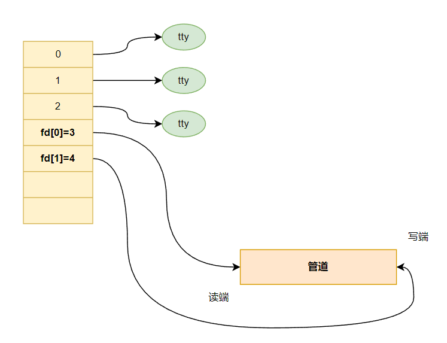
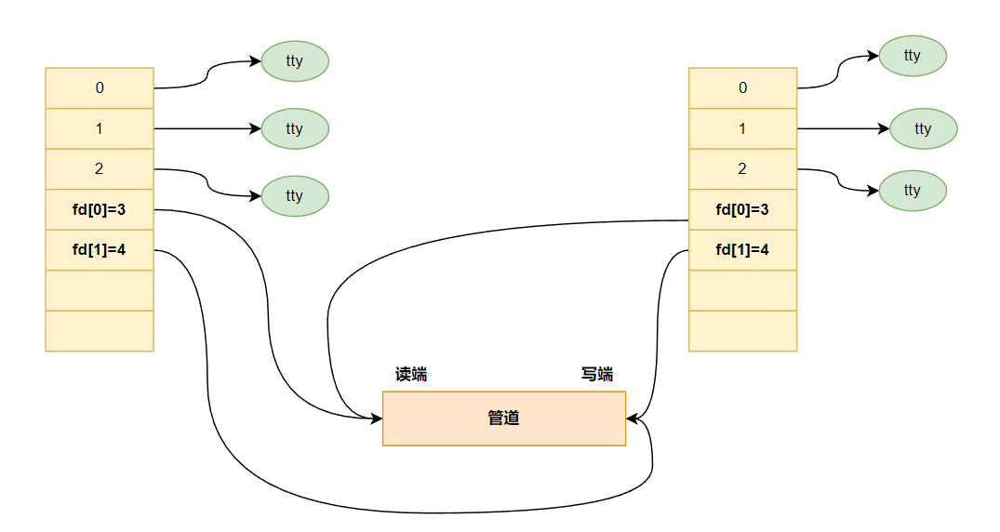
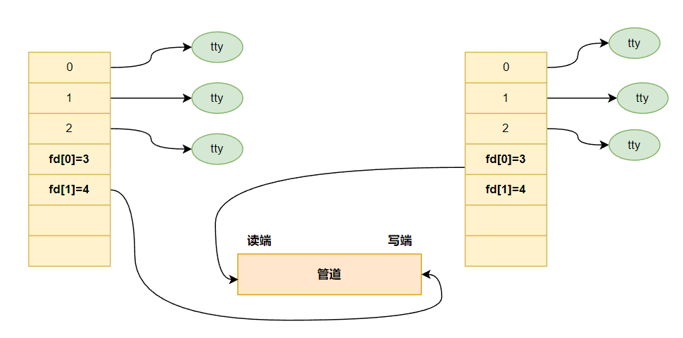
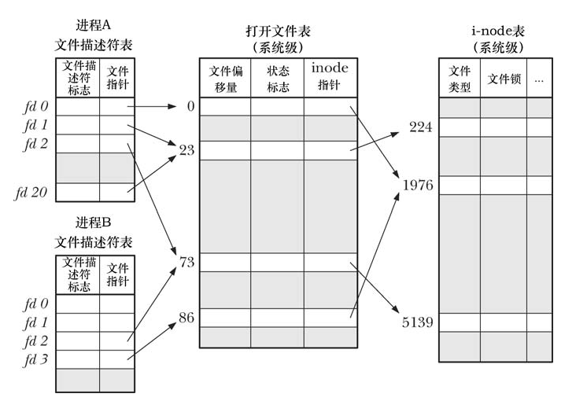
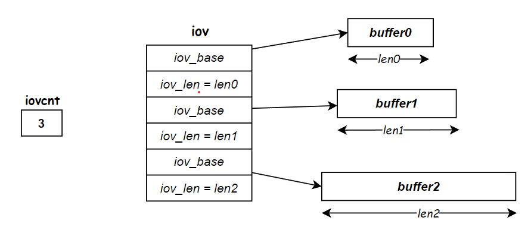
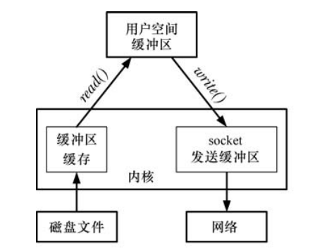
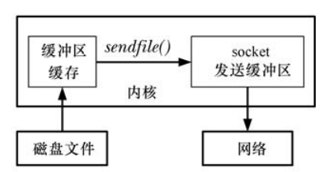
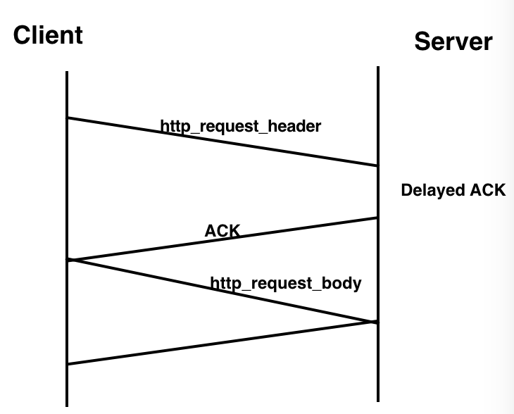

## 高级 I/O 函数之一

### 一、pipe 函数

**`Linux`** 环境下，进程地址空间相互独立，每个进程各自有不同的用户地址空间。**任何一个进程的全局变量在另一个进程中都看不到，所以进程和进程之间不能相互访问，要交换数据必须通过内核**，在内核中开辟一块缓冲区，进程 1 把数据从用户空间拷到内核缓冲区，进程 2 再从内核缓冲区把数据读走，内核提供的这种机制称为进程间通信（IPC，InterProcess Communication）。

在进程间完成数据传递需要借助操作系统提供特殊的方法，如：文件、管道、信号、共享内存、消息队列、套接字、命名管道等。随着计算机的蓬勃发展，一些方法由于自身设计缺陷被淘汰或者弃用。现今常用的进程间通信方式有：

- 管道（使用最简单）
- 信号（开销最小）
- 共享映射区（无血缘关系）
- 本地套接字（最稳定）

#### 1.管道

管道是一种最基本的 **`IPC`** 机制，作用于有血缘关系的进程之间，完成数据传递。调用 **`pipe`** 系统函数即可创建一个管道，管道实为内核使用环形队列机制，借助内核缓冲区实现。有如下特质：

- 其本质是一个伪文件(实为内核缓冲区) 
- 由两个文件描述符引用，一个表示读端，一个表示写端。
- 规定数据从管道的写端流入管道，从读端流出。

管道的局限性如下所示：

- 数据不能进程自己写、自己读。
- 管道中的数据不可反复读取。**一旦读取，管道中不再存在**。
- 采用半双工通信方式，**数据只能在单方向上流动**。

#### 2.pipe 函数详解

```c{.line-numbers}
#include <unistd.h>
// 成功返回 0，失败返回 -1，设置 errno
int pipe(int pipefd[2]);
```

**`pipe`** 函数的参数是一个包含两个 int 型整数的数组指针。该函数成功时返回 0，并且将一对打开的文件描述符值填入其参数指向的数组。

函数调用成功返回 **`r/w`** 两个文件描述符。**无需 `open`，但需手动 `close`**。规定：**`fd[0]` 代表读端；`fd[1]` 代表写端**（不能反过来使用），默认情况下，这一对文件描述符都是阻塞的。向管道文件读写数据其实是在读写内核缓冲区。管道创建成功以后，创建该管道的进程（父进程）同时掌握着管道的读端和写端。

管道内部传输的数据是字节流，这和 TCP 字节流的概念相同。但二者又有细微的区别。应用层程序能往一个 TCP 连接中写入多少字节的数据，**取决于对方的接收通告窗口的大小和本端的拥塞窗口的大小**。**而管道本身拥有一个容量限制**，它规定如果应用程序不将数据从管道读走的话，该管道最多能被写入多少字节的数据。自 Linux2.6.11 内核起，管道容量的大小默认是 65536 字节。我们可以使用 fcntl 函数来修改管道容量。

如何实现父子进程间通信呢？通常可以采用如下步骤：

**1) 步骤一**

父进程调用 **`pipe`** 函数创建管道，得到两个文件描述符 **`fd[0]、fd[1]`** 指向管道的读端和写端。

<div align="center">
    
</div>

**2) 步骤二**

父进程调用 **`fork`** 创建子进程，那么子进程也有两个文件描述符指向同一管道。

<div align="center">
    
</div>

**3) 步骤三**

**父进程关闭管道读端，子进程关闭管道写端**。父进程可以向管道中写入数据，子进程将管道中的数据读出。由于管道是利用环形队列实现的，数据从写端流入管道，从读端流出，这样就实现了进程间通信。

<div align="center">
    
</div>

#### 3.管道的读写行为

使用管道需要注意以下 4 种特殊情况（假设都是阻塞 I/O 操作，没有设置 **`O_NONBLOCK`** 标志）：

1. 如果所有指向管道写端的文件描述符都关闭了（管道写端引用计数为 0），而仍然有进程从管道的读端读数据，那么管道中剩余的数据都被读取后，**再次 read 会返回 0，就像读到文件末尾一样**。
2. 如果有指向管道写端的文件描述符没关闭（管道写端引用计数大于 0），而持有管道写端的进程也没有向管道中写数据，**这时有进程从管道读端读数据，那么管道中剩余的数据都被读取后，再次 read 会阻塞**，直到管道中有数据可读了才读取数据并返回。
3. 如果所有指向管道读端的文件描述符都关闭了（管道读端引用计数为 0），这时有进程向管道的写端 write，**那么该进程会收到信号 `SIGPIPE`，通常会导致进程异常终止**。当然也可以对 **`SIGPIPE`** 信号实施捕捉，不终止进程。
4. 如果有指向管道读端的文件描述符没关闭（管道读端引用计数大于 0），而持有管道读端的进程也没有从管道中读数据，这时有进程向管道写端写数据，**那么在管道被写满时再次 write 会阻塞，直到管道中有空位置了才写入数据并返回**。

总结：

- 读管道：
  - 读管道中有数据，**`read`** 返回实际读到的字节数
  - 管道中无数据：
    - 管道写端被全部关闭，**`read`** 返回 0 (好像读到文件结尾)
    - 写端没有全部被关闭，**`read`** 阻塞等待 (不久的将来可能有数据递达，此时会让出 cpu)
- 写管道：
  - 管道读端全部被关闭， 进程异常终止 (也可使用捕捉 **`SIGPIPE`** 信号，使进程不终止)
  - 管道读端没有全部关闭：
     - 管道已满，**`write`** 阻塞
     - 管道未满，**`write`** 将数据写入，并返回实际写入的字节数。

此外，**`socket`** 的基础 API 中有一个 **`socketpair`** 函数。它能够方便地创建双向管道。其定义如下：

```c{.line-numbers}
#include<sys/types.h>
#include<sys/socket.h>
int socketpair(int domain, int type, int protocol, int fd[2]);
```

**`socketpair`** 前三个参数的含义与 **`socket`** 系统调用的三个参数完全相同，但 domain 只能使用 UNIX 本地域协议族 **`AF_UNIX`**，因为我们仅能在本地使用这个双向管道。最后一个参数则和 **`pipe`** 系统调用的参数一样，**只不过 **`socketpair`** 创建的这对文件描述符都是既可读又可写的。**`socketpair`** 成功时返回 0，失败时返回 -1 并设置 errno。

#### 4.管道示例 1

使用 pipe 管道来实现父子进程之间的通信，创建打开管道之后，fd[0] 为读端，fd[1] 为写端，管道 pipe 只能在父子进程之间使用，或者兄弟进程之间使用，不能在无血缘关系之间的进程使用。

```c{.line-numbers}
int pipe_test() {
    int ret;
    int fd[2];
    pid_t pid;

    char *str = "hello pipe\n";
    char buf[1024];

    ret = pipe(fd);
    if (ret == -1) {
        perror("pipe error");
        exit(1);
    }

    pid = fork();
    if (pid > 0) {
        // 父进程往管道中写入数据，因此需要关闭管道的读端 fd[0]
        close(fd[0]);
        sleep(3);
        write(fd[1], str, strlen(str));
        close(fd[1]);
    } else if (pid == 0){
        // 子进程往管道中读出数据，因此需要关闭管道的写端 fd[1]
        close(fd[1]);
        ret = read(fd[0], buf, sizeof(buf));
        write(STDOUT_FILENO, buf, ret);
        close(fd[0]);
    }

    return 0;
}
```

程序运行的结果如下所示：

```shell{.line-numbers}
/home/xuweilin/CLionProjects/linux_programming/cmake-build-debug/linux_programming
hello pipe

Process finished with exit code 0
```

#### 5.管道示例 2

**`pipe`** 管道可以用于两个兄弟进程之间的通信，下面的程序 1# 进程将 **`ls`** 命令的结果写入到管道中，2# 进程从管道中读取结果执行 **`wc`** 命令。

```c{.line-numbers}
int pipe_broth() {
    int fd[2];
    int ret, i;
    pid_t pid;

    ret = pipe(fd);
    if (ret == -1) {
        perror("pipe error");
        exit(1);
    }

    for (i = 0; i < 2; i++) {
        pid = fork();
        if (pid == -1) {
            perror("fork error");
            exit(1);
        }
        if (pid == 0)
            break;
    }

    if (i == 2) {
        // 父进程不使用管道，所以一定要关闭父进程的管道，保证数据单向流动
        close(fd[0]);
        close(fd[1]);

        // 父进程回收两个子进程
        wait(NULL);
        wait(NULL);
    } else if(i == 0) {
        close(fd[1]);
        // 将 STDIN 标准输入重定向到 fd[0]，也就是 wc 命令从管道中读取数据
        // fd[0] 为读端
        dup2(fd[0], STDIN_FILENO);
        execlp("wc", "wc", "-l", NULL);
        perror("execlp error");
        exit(1);
    } else if (i == 1) {
        close(fd[0]);
        // 将 STDOUT 标准输出重定向到 fd[1]，也就是 ls 命令的结果输出到管道中
        // fd[1] 为写端
        dup2(fd[1], STDOUT_FILENO);
        execlp("ls", "ls", NULL);
        perror("execlp error");
        exit(1);
    }

    return 0;
}
```

在 12~20 行的 **`for`** 循环中，父进程调用 **`fork`** 不断循环创建两个子进程，并且子进程一旦被创建出来之后就退出 for 循环（根据第 18 行的 if 判断，子进程的 **`pid`** 为 0），**`1#`** 进程将 **`STDIN`** 标准输入重定向到 fd[0]，也就是 wc 命令从管道中读取数据，而 **`2#`** 进程将 **`STDOUT`** 标准输出重定向到 fd[1]，也就是 ls 命令的结果输出到管道中，即 ls 命令正常会将结果集写到 **`STDOUT`**，但现在会写入管道写端，wc -l 命令正常应该从 **`STDIN`** 读取数据，但此时会从管道的读端读。 类似于 **`ls | wc -l`**， 即统计当前目录下所有的文件的个数。

程序运行结果如下所示：

```shell{.line-numbers}
/home/xuweilin/CLionProjects/linux_programming/cmake-build-debug/linux_programming
30

Process finished with exit code 0
```

### 二、dup 函数和 dup2 函数

#### 1.dup 和 dup2 函数示例

```c
#include <unistd.h>

// Returns (new) file descriptor on success, or -1 on error
int dup(int oldfd);
```

**`dup()`** 调用**复制一个打开的文件描述符 oldfd，并返回一个新描述符，二者都指向同一打开的文件句柄**。系统会保证新描述符一定是编号值最低的未用文件描述符。我们假设发起了如下调用：

```c{.line-numbers}
newfd = dup(1);
```

再假定在正常情况下，shell 已经代表程序打开了文件描述符 0、1 和 2，且没有其他描述符在用，**`dup()`** 调用会创建文件描述符 1 的副本，返回的文件描述符编号值为 3。如果希望返回文件描述符 2，可以使用如下技术：

```c{.line-numbers}
/* Frees file descriptor 2 */
close(2);
/* Should reuse file descriptor 2 */
newfd = dup(1);
```

如果想进一步简化上述代码，同时总是能获得所期望的文件描述符，可以调用 **`dup2()`**：

```c{.line-numbers}
#include <unistd.h>

int dup2(int oldfd, int newfd);
```

**`dup2()`** 系统调用会为 oldfd 参数所指定的文件描述符创建副本，副本的编号由 newfd 参数指定。**如果由 newfd 参数所指定编号的文件描述符之前已经打开，那么 **`dup2()`** 会首先将其关闭**。（**`dup2()`** 调用会默认忽略 newfd 关闭期间出现的任何错误。故此，编码时更为安全的做法是：在调用 **`dup2()`** 之前，若 newfd 已经打开，则应显式调用 **`close()`** 将其关闭）前述调用 **`close(2)`** 和 **`dup(1)`** 的代码可以简化为：

```c{.line-numbers}
dup2(1, 2);
```

若调用 **`dup2()`** 成功，则将返回副本的文件描述符编号（即 **`newfd`** 参数指定的值）。如果 **`oldfd`** 并非有效的文件描述符，那么 **`dup2()`** 调用将失败并返回错误 **`EBADF`**，且不关闭 newfd。如果 oldfd 有效，且与 newfd 值相等，那么 **`dup2()`** 将什么也不做，不关闭 newfd，并将其作为调用结果返回。

**文件描述符的正、副本之间共享同一打开文件句柄所含的文件偏移量和状态标志（如图5-2）**。然而，新文件描述符有其自己的一套文件描述符标志，且其 **`close-on-exec`** 标志（**`FD_CLOEXEC`**）总是处于关闭状态。

<div align="center">
    
</div>

#### 2.dup2 函数示例 1

```c{.line-numbers}
#include <stdio.h>
#include <unistd.h>
#include <stdlib.h>
#include <pthread.h>
#include <fcntl.h>

int main() {

    int fd1 = open("../hello.c", O_RDWR);
    int fd2 = open("../hello2.c", O_RDWR);

    int fdret = dup2(fd1, fd2);
    printf("fdret = %d\n", fdret);

    int ret = write(fd2, "hello world xwl", 15);
    printf("ret = %d\n", ret);

    return 0;
}
```

上面的程序将文件描述符 fd1 指向 **`hello.c`**，而 fd2 指向 **`hello2.c`**， 然后使用 **`dup2`** 函数将 fd2 指向 fd1，接着将字符串 "hello world xwl" 写入到 fd2 里面，其实就是将其写入到 fd1 中（即 **`hello.c`** 文件）。这里需要注意一个问题，如果 **`hello.c`** 是非空的，刚打开 **`hello.c`** 文件时，文件偏移量为 0，而 **`dup2`** **导致文件描述符的正、副本之间共享同一打开文件句柄所含的文件偏移量和状态标志**，因此写进去的内容默认从文件头部开始写，会覆盖原有内容。

假设 hello.c 的文件之前的内容如下所示：

```c
aaaa
bbbb
cccc
dddd
eeee
```

那么运行上述程序之后，hello.c 的文件内容变成如下：

```c
hello world xwldddd
eeee
```

这是因为，先前的内容在计算机看来为：**`aaaa\nbbbb\ncccc\ndddd\neeee`**，那么写入 **`"hello world xwl"`** 字符串后，会把 ASCII 字符和换行符一起覆盖掉，变成 **`hello world xwldddd\neeee`**。dup2 函数也可以用于标准输入输出的重定向。

#### 3.dup2 的函数示例 2

```c{.line-numbers}
#include <stdio.h>
#include <unistd.h>
#include <stdlib.h>
#include <pthread.h>
#include <fcntl.h>

int main() {

    int fd1 = open("../hello.c", O_RDWR);
    int fd2 = open("../hello2.c", O_RDWR);

    int fdret = dup2(fd1, fd2);
    printf("fdret = %d\n", fdret);

    int ret = write(fd2, "hello world xwl", 15);
    printf("ret = %d\n", ret);

    dup2(fd1, STDOUT_FILENO);
    printf("\nhello world ZzZ");

    return 0;
}
```

程序的运行之前，**`hello.c`** 的内容为：

```c
aaaa
bbbb
cccc
dddd
eeee
```

运行之后，**`hello.c`** 的内容如下所示：

```c
hello world xwl
hello world ZzZ
```

这个程序，将 fd1 的内容复制给了 fd2，使得原来指向 **`hello2.c`** 的 fd2 也指向了 **`hello.c`**，并通过 fd2 向 **`hello.c`** 里写入了 **`hello world xwl`**。完事儿将标准输出重定向至 fd1，就是将要显示在标准输出的内容，写入了 fd1 指向的文件，就是 **`hello.c`** 中。这里有一点和上面程序不同，就是 **`hello.c`** 是处于打开状态的，连续写入两段话，写入 **`hello world ZzZ`**，读写指针在 **`hello world xwl`** 末尾，就不会覆盖先前写入的内容。

#### 4.fcntl 实现 dup 描述符

**`fcntl()`** 的 **`F_DUPFD`** 操作是复制文件描述符的另一接口，更具灵活性。

```c{.line-numbers}
newfd = fcntl(oldfd, F_DUPFD, startfd);
```

该调用为 **`oldfd`** 创建一个副本，且将使用大于等于 **`startfd`** 的最小未用值作为描述符编号。该调用还能保证新描述符（newfd）编号落在特定的区间范围内。总是能将 **`dup()`** 和 **`dup2()`** 调用改写为对 **`close()`** 和 **`fcntl()`** 的调用，虽然前者更为简洁。

对于 **`startfd`** 这个参数，可以这么理解，即传入一个文件描述符 k，如果 k 没被占用，则直接用 k 复制 fd1 的内容。如果 k 被占用，则返回描述符表中最小可用描述符。

```c{.line-numbers}
#include <stdio.h>
#include <unistd.h>
#include <stdlib.h>
#include <pthread.h>
#include <fcntl.h>

int main() {

    int fd1 = open("../hello.c", O_RDWR);

    printf("fd1 = %d\n", fd1);

    int newfd = fcntl(fd1, F_DUPFD, 0);
    printf("newfd = %d\n", newfd);

    int newfd2 = fcntl(fd1, F_DUPFD, 9);
    printf("newfd2 = %d\n", newfd2);

    int ret = write(newfd2, "hello world ZzZ", 15);
    printf("ret = %d\n", ret);

    return 0;
}
```

程序运行的结果如下所示：

```shell
/home/xuweilin/CLionProjects/linux_programming/cmake-build-debug/pipe
fd1 = 3
newfd = 4
newfd2 = 9
ret = 15

Process finished with exit code 0
```

hello.c 文件的内容如下所示：

```shell
hello world ZzZ
```

因为 0 被占用，所以返回最小可用的文件描述符，第 13 行的 **`newfd`** 结果为 4；因为 9 没有被占用，所以第 16 行的 **`newfd2`** 结果为 9；最后往 newfd2 中写入数据，实际上写入到 **`hello.c`** 文件中（**`hello.c`** 文件初始为空）。

#### 5.使用 dup 实现基本 CGI 服务器

```c{.line-numbers}
int main() {

    int cfd, lfd;

    struct sockaddr_in serv_addr, clit_addr;
    socklen_t clit_addr_len;

    serv_addr.sin_family = AF_INET;
    serv_addr.sin_port = htons(SERV_PORT);
    serv_addr.sin_addr.s_addr = htonl(INADDR_ANY);

    lfd = socket(AF_INET, SOCK_STREAM, 0);
    if (lfd == -1) {
        sys_err("socket error");
    }

    int val = 1;
    setsockopt(lfd, SOL_SOCKET, SO_REUSEADDR, &val, sizeof(val));

    bind(lfd, (struct sockaddr *) &serv_addr, sizeof(serv_addr));
    listen(lfd, 256);

    clit_addr_len = sizeof(clit_addr);
    cfd = accept(lfd, (struct sockaddr *) &clit_addr, &clit_addr_len);

    if (cfd < 0) {
        if (errno == ECONNABORTED) {
            printf("accept: connect reset by peer\n");
        }
        return 1;
    }

    close(STDOUT_FILENO);
    dup(cfd);
    printf("abcdefghijklmn\n\n");

    close(cfd);
    close(lfd);
    return 0;
}
```

在上述代码中，我们先关闭标准输出文件描述符 **`STDOUT_FILENO`** (其值是 1)，然后复制 **`socket`** 文件描述符 **`connfd`**。因为 **`dup`** 总是返回系统中最小的可用文件描述符，所以它的返回值实际上是 1，即之前关闭的标准输出文件描述符的值。这样一来，**服务器输出到标准输出的内容（这里是 **`"abcdefghijklmn\n\n"`**）就会直接发送到与客户连接对应的 **`socket`** 上，因此 printf 调用的输出将被客户端获得（而不是显示在服务器程序的终端上）**。这就是 CGI 服务器的基本工作原理。

使用 telnet 命令来连接上述服务器进程，得到的结果如下所示：

```shell
xuweilin@xuweilin-virtual-machine:~$ telnet 127.0.0.1 9523
Trying 127.0.0.1...
Connected to 127.0.0.1.
Escape character is '^]'.
abcdefghijklmn

Connection closed by foreign host.
```

### 三、readv 函数和 writev 函数

#### 1.readv 和 writev 函数介绍

readv 和 writev 函数实现了分散输入和集中输出的功能，函数原型如下所示：

```c
#include <sys/uio.h>

// On success, readv() return the number of bytes read
// writev() return the number of bytes written
// Note that it is not an error for a successful call to transfer fewer bytes than requested.
// On error, -1 is returned, and errno is set appropriately.
ssize_t readv(int fd, const struct iovec* iov, int iovcnt);

ssize_t writev(int fd, const struct iovec* iov, int iovcnt);
```

这些系统调用并非只对单个缓冲区进行读写操作，**而是一次即可传输多个缓冲区的数据**。数组 iov 定义了一组用来传输数据的缓冲区。整型数 iovcnt 则指定了 iov 的成员个数。iov 中的每个成员都是如下形式的数据结构。

```c
struct iovec {
    // start address of the buffer
    void* iov_base;
    /* Number of bytes to transfer to/from the buffer */
    size_t iov_len;
}
```

下图展示的是一个关于 iov、iovcnt 以及 iov 指向缓冲区之间关系的示例。

<div align="center">
    
</div>

#### 2.分散读入

readv() 系统调用实现了分散输入的功能：从文件描述符 fd 所指代的文件中读取一片连续的字节，然后将其散置（“分散放置”）于 iov 指定的缓冲区中。这一散置动作从 iov[0] 开始，依次填满每个缓冲区。

调用 readv() 成功将返回读取的字节数，如果调用出错，返回 -1，并设置 errno。示例代码如下所示：

```c{.line-numbers}
int main() {

    int fd;
    struct iovec iov[3];
    struct stat my_struct;
    int x;
#define STR_SIZE 100
    char str[STR_SIZE];
    ssize_t numRead, totRequired = 0;

    fd = open("../hello.c", O_RDONLY);
    if (fd == -1)
        printf("open file error");

    iov[0].iov_base = &my_struct;
    iov[0].iov_len = sizeof(struct stat);
    totRequired += iov[0].iov_len;

    iov[1].iov_base = &x;
    iov[1].iov_len = sizeof(x);
    totRequired += iov[1].iov_len;

    iov[2].iov_base = str;
    iov[2].iov_len = STR_SIZE;
    totRequired += iov[2].iov_len;

    numRead = readv(fd, iov, 3);
    printf("numRead = %ld\n", numRead);

    printf("total bytes requested: %ld; bytes read: %ld\n", (long) totRequired, (long) numRead);

    return 0;
}
```

运行结果为：

```shell
/home/xuweilin/CLionProjects/linux_programming/cmake-build-debug/pipe
numRead = 187
total bytes requested: 248; bytes read: 187

Process finished with exit code 0
```

#### 3.集中输出

**`writev()`** 系统调用实现了集中输出：将 iov 所指定的所有缓冲区中的数据拼接（"集中"）起来，然后以连续的字节序列写入文件描述符 **`fd`** 指代的文件中。**对缓冲区中数据的“集中”始于 **`iov[0]`** 所指定的缓冲区，并按数组顺序展开**。

像 **`readv()`** 调用一样，**`writev()`** 调用也**属于原子操作**，即所有数据将一次性地从用户内存传输到 fd 指代的文件中。因此，在向普通文件写入数据时，**`writev()`** 调用会把所有的请求数据连续写入文件，而不会在其他进程（或线程）写操作的影响下分散地写入文件。

如下两种方案，任选其一都可替代对 writev() 的调用。

- 编码时，首先分配一个大缓冲区，随即再从进程地址空间的其他位置将数据复制过来，最后调用 write() 输出其中的所有数据。
- 发起一系列 write() 调用，逐一输出每个缓冲区中的数据。

尽管方案一在语义上等同于 writev() 调用，但需要在用户空间内分配缓冲区，进行数据复制，很不方便（效率也低）。方案二在语义上就不同于单次的 writev() 调用，**因为发起多次 write() 调用将无法保证原子性**。更何况，执行一次 writev() 调用比执行多次 write() 调用开销要小（系统调用次数更少）。

我们考虑一个 **`writev`** 函数的实际使用场景，当 Web 服务器解析完一个 HTTP 请求之后，如果目标文档存在且客户具有读取该文档的权限，那么它就需要发送一个 HTTP 应答来传输该文档。**这个 HTTP 应答包含 1 个状态行、多个头部字段、1 个空行和文档的内容**。其中，前 3 部分的内容可能被 Web 服务器放置在一块内存中，而文档的内容则通常被读入到另外一块单独的内存中（通过 read 函数或 mmap 函数）。**我们并不需要把这两部分内容拼接到一起再发送，而是可以使用 writev 函数将它们同时写出**。

```c{.line-numbers}
#define SERV_PORT 9523
#define BUFFER_SIZE 1024
/* 定义两种 HTTP 状态码和状态信息 */
static const char* status_line[2] = {"200 OK", "500 Internal server error"};

void sys_err(const char* str) {
    perror(str);
    exit(1);
}

int main() {
    const char* file_name = "../hello.c";
    int cfd, lfd;
    struct sockaddr_in serv_addr, clit_addr;
    socklen_t clit_addr_len;
    int ret = 0;

    serv_addr.sin_family = AF_INET;
    serv_addr.sin_port = htons(SERV_PORT);
    serv_addr.sin_addr.s_addr = htonl(INADDR_ANY);

    lfd = socket(PF_INET, SOCK_STREAM, 0);
    if (lfd == -1) {
        sys_err("socket error");
    }

    int val = 1;
    setsockopt(lfd, SOL_SOCKET, SO_REUSEADDR, &val, sizeof(val));

    bind(lfd, (struct sockaddr *) &serv_addr, sizeof(serv_addr));
    listen(lfd, 256);

    clit_addr_len = sizeof(clit_addr);
    cfd = accept(lfd, (struct sockaddr *) &clit_addr, &clit_addr_len);

    if (cfd < 0) {
        if (errno == ECONNABORTED) {
            printf("accept: connect reset by peer\n");
        }
        return 1;
    }

    /* 用于保存 HTTP 应答的状态行、头部字段和一个空行的缓冲区 */
    char header_buf[BUFFER_SIZE];
    memset(header_buf, '\0', BUFFER_SIZE);
    /* 用于存放目标文件内容的应用程序缓存 */
    char* file_buf;
    /* 用于获取目标文件的属性，比如是否为目录，文件大小 */
    struct stat file_stat;
    /* 记录目标文件是否为有效文件 */
    bool valid = true;
    /* 缓存区 header_buf 目前已经使用了多少字节的空间 */
    int len = 0;
    
    /* 目标文件不存在 */
    if (stat(file_name, &file_stat) < 0) {
        valid = false;
    } else {
        /* 目标文件是一个目录 */
        if (S_ISDIR(file_stat.st_mode)) {
            valid = false;
        
        /* 目标文件是一个常规文件 */    
        } else if (S_ISREG(file_stat.st_mode)) {
            int fd = open(file_name, O_RDONLY);
            /* 动态分配缓存区 file_buf，并指定其大小为目标文件大小 file_stat.st_size 加 1，然后将目标文件读入缓存区 file_buf */
            file_buf = malloc((file_stat.st_size + 1)* sizeof(char ));
            memset(file_buf, '\0', file_stat.st_size + 1);
            if (read(fd, file_buf, file_stat.st_size) < 0) {
                valid = false;
            }
        } else {
            valid = false;
        }
    }

    /* 如果目标文件有效，则发送正常的 HTTP 应答 */
    if (valid) {
        
        /* 下面这部分内容将 HTTP 应答的状态行、"Content-Length" 头部字段和一个空行依次加入 header_buf 中 */
        ret = snprintf(header_buf, BUFFER_SIZE - 1, "%s %s\r\n", "HTTP/1.1", status_line[0]);
        len += ret;

        ret = snprintf(header_buf + len, BUFFER_SIZE - 1 - len, "Content-Length: %ld\r\n", file_stat.st_size);
        len += ret;
        
        // 空行
        ret = snprintf(header_buf + len, BUFFER_SIZE - 1 - len, "%s", "\r\n");
        
        /* 利用 writev 将 header_buf 和 file_buf 中的内容一并写出 */
        struct iovec iov[2];
        iov[0].iov_base = header_buf;
        iov[0].iov_len = sizeof(header_buf);

        iov[1].iov_base = file_buf;
        iov[1].iov_len = file_stat.st_size - 1;

        writev(cfd, iov, 2);
    } else {
        /* 如果目标文件无效，则通知客户端服务器发生了"内部错误" */
        ret = snprintf(header_buf, BUFFER_SIZE - 1, "%s %s\r\n", "HTTP/1.1", status_line[1]);
        len += ret;

        ret = snprintf(header_buf + len, BUFFER_SIZE - 1 - len, "%s", "\r\r");
        send(cfd, header_buf, sizeof(header_buf), 0);
    }

    close(cfd);
    close(lfd);

    return 0;
}
```

### 四、sendfile 函数

#### 1.sendfile 系统调用

像 Web 服务器和文件服务器这样的应用程序常常需要将磁盘上的文件内容不做修改地通过（已连接）套接字传输出去。一种方法是通过循环按照如下方式处理。

```c{.line-numbers}
    while((n = read(diskfilefd, buf, BUF_SIZE)) > 0)
        write(sockfd, buf, n);
```

对于许多应用程序来说，这样的循环是完全可接受的。但是，如果我们需要通过套接字频繁地传输大文件的话，这种技术就显得很不高效。为了传输文件，我们必须使用两个系统调用（可能需要在循环中多次调用）：**一个用来将文件内容从内核缓冲区 cache 中拷贝到用户空间，另一个用来将用户空间缓冲区拷贝回内核空间，以此才能通过套接字进行传输**。下图展示了这种场景。如果应用程序在发起传输之前根本不对文件内容做任何处理的话，那么这种两步式的处理就是一种浪费。

<div align="center">
    
</div>

系统调用 sendfile() 被设计为用来消除这种低效性。如下图所示，当应用程序调用 sendfile() 时，文件内容会直接传送到套接字上，而不会经过用户空间。这种技术被称为零拷贝传输（zero-copy transfer）。

<div align="center">
    
</div>

sendfile 的函数原型如下所示：

```c{.line-numbers}
#include <sys/sendfile.h>

ssize_t sendfile(int out_fd, int in_fd,  off_t* offset, size_t count);
```

系统调用 **`sendfile()`** 在代表输入文件的描述符 **`in_fd`** 和代表输出文件的描述符 **`out_fd`** 之间传送文件内容（字节）。描述符 **`out_fd`** 必须指向一个套接字。参数 **`in_fd`** 指向的文件必须是可以进行 **`mmap()`** 操作的。在实践中，这通常表示一个普通文件。

如果参数 **`offset`** 不是 **`NULL`**，它应该指向一个 **`off_t`** 值，该值指定了起始文件的偏移量，意即从 **`in_fd`** 指向的文件的这个位置开始，可以传输字节。这是一个传入传出参数（又叫值一结果参数）。在返回的值中，**_it contains the offset of the next byte following the last byte that was transferred from in_fd_**。在这里，sendfile() 不会更改 in_fd 的文件偏移量

如果参数 **`offset`** 指定为 **`NULL`** 的话，**那么从 **`in_fd`** 传输的字节就从当前的文件偏移量处开始，且在传输时会更新文件偏移量以反映出已传输的字节数**。

参数 **`count`** 指定了请求传输的字节数。如果在 **`count`** 个字节完成传输前就遇到了文件结尾符，那么只有文件结尾符之前的那些字节能传输。调用成功后，**`sendfile()`** 会返回实际传输的字节数。

#### 2.程序示例

下面的代码利用 sendfile 函数将服务器上的一个文件传送给客户端：

```c{.line-numbers}
#define SERV_PORT 9523

void sys_err(const char* str) {
    perror(str);
    exit(1);
}

int main() {

    const char* file_name = "../hello.c";
    int cfd, lfd, file_fd;
    struct sockaddr_in serv_addr, clit_addr;
    socklen_t clit_addr_len;
    int ret = 0;

    serv_addr.sin_family = AF_INET;
    serv_addr.sin_port = htons(SERV_PORT);
    serv_addr.sin_addr.s_addr = htonl(INADDR_ANY);

    lfd = socket(AF_INET, SOCK_STREAM, 0);
    if (lfd == -1) {
        sys_err("socket error");
    }

    int val = 1;
    setsockopt(lfd, SOL_SOCKET, SO_REUSEADDR, &val, sizeof(val));

    bind(lfd, (const struct sockaddr*) &serv_addr, sizeof(serv_addr));
    listen(lfd, 256);

    cfd = accept(lfd, (struct sockaddr*) &clit_addr, &clit_addr_len);
    if (cfd < 0) {
        if (errno == ECONNABORTED) {
            printf("accept: connect reset by peer\n");
        }
        return 1;
    }

    file_fd = open(file_name, O_RDONLY);
    struct stat stat_buf;
    if (stat(file_name, &stat_buf) < 0) {
        sys_err("stat error");
    }

    sendfile(cfd, file_fd, NULL, stat_buf.st_size);

    close(lfd);
    close(cfd);
    close(file_fd);

    return 0;
}
```

使用 telnet 连接上述服务器程序，得到的结果如下所示：

```vb
xuweilin@xuweilin-virtual-machine:~$ telnet 127.0.0.1 9523
Trying 127.0.0.1...
Connected to 127.0.0.1.
Escape character is '^]'.
typedef __off64_t off64_t;
# define __off64_t_defined
# endif
#endif

#ifdef __USE_XOPEN2K8
# ifndef __ssize_t_defined
typedef __ssize_t ssize_t;
# define __ssize_t_defined
# endif
#endif

Connection closed by foreign host.
```

#### 3.TCP_CORK 选项

在介绍 TCP_CORK 选项之前需要首先讲解 Nagle 和 Delayed ACK 选项。

**1) Nagle 算法**

Nagle 算法由 John Nagle 在 1984 年提出，**这个算法可以减少网络中小的 packet 的数量，从而降低网络的拥塞程度**。一个常见的例子就是 Telnet 程序，用户在控制台的每次击键都会发送一个 packet，这个 packet 通常包含 41 个字节，然而只有一个字节是 payload，其余 40 个字节都是 header，如果每次击键都发送一个 packet，那就会造成了巨大的开销。

为了减小这种开销，Nagle 算法指出，**当 TCP 发送了一个小的 segment(小于 MSS)，它必须等到接收了对方的 ACK 之后，才能继续发送另一个小的 segment**。那么在等待的过程中(一个 RTT 时间)，TCP 就能尽量多地将要发送的数据收集在一起，从而减少要发送的 segment 的数量。

默认情况下，TCP 开启了 Nagle 算法，然而 Nagle 算法并不是灵丹妙药，它会增加 TCP 发送数据的延迟。在一些要求低延迟的应用程序中(例如即时通讯应用)，则需要禁用 Nagle 算法：

```c{.line-numbers}
int optval = 1;
// 设置 TCP_NODELAY 可以禁用 Nagle 算法
setsockopt(sockfd, IPPROTO_TCP, TCP_NODELAY, &optval, sizeof(optval));
```

**2) Delayed ACK**

TCP 的 **`Delayed ACK`** 与 Nagle 算法有异曲同工之妙，Delayed ACK 很好理解，**当 TCP 接收到数据时，并不会立即发送 ACK 给对方，相反，它会等待应用层产生数据，以便将 ACK 和数据一起发送**(在 Linux 最多等待 40ms)。

我们知道，Nagle 算法会增加 TCP 发送数据的延迟，然而，在某些情况下，**`Delayed ACK`** 会放大这种延迟。一个常见的例子客户端 HTTP POST 协议，首先看看客户端的代码：

```c{.line-numbers}
write(http_request_header);
write(http_request_body);
// get response from server ...
```

客户端调用两次 write() 来发送 **`HTTP POST`** 请求，服务端则需要调用两次 read() 读取客户端的 HTTP 请求：

```c{.line-numbers}
http_request_header = read(...);
http_request_body = read(...);
// write response to client ...
```

通常来说，HTTP 请求的 header 和 body 都是小的 segment，但由于 TCP 默认开启 Nagle 算法，因此客户端在发送请求的 header 之后，**如果还未收到 ACK，则不能发送 body**。

<div align="center">
    
</div>

Server 在收到请求的 header 之后，由于还没有收到请求的 body，因此无法立即产生HTTP 响应给客户端，**这就导致了 http_request_header 的 ACK 大概会延迟 40ms 才发送**。

为避免这种延迟的出现，需要做两件事：

- 设置 **`TCP_NODELAY`** 选项。
- 将客户端的两次 write() 合并成一个，避免服务端的 Delayed ACK。

**3) Scatter-Gather I/O**

write() 函数负责将应用程序缓冲区的数据写入内核缓冲区中，那么合并两次 write() 操作，一种常见的做法是先分配一块比较大的缓冲区，接着将两块小的缓冲区的数据依次拷贝到这块大的缓冲区中，最后调用 write() 一次性写入这块大的缓冲区的数据。然而这种做法带来不小的开销，一次内存分配操作和两次 memcpy() 操作。幸运的是，Linux 提供了 writev() 函数，它可以将几块不连续的缓冲区的数据写入内核中。

```C{.line-numbers}
struct iovec iov[2];
iov[0].iov_base = http_request_header;
iov[0].iov_len = sizeof(http_request_header);
iov[1].iov_base = http_request_body;
iov[1].iov_len = sizeof(http_request_body);
ssize_t nwritten = writev(fd, iov, 2);
```

**4) TCP_CORK**

大多数 Web Server 为了提高性能，在发送数据是并不会直接使用 write()，一个典型的例子就是，Web Server 响应客户端请求的时候，它需要先发送 HTTP 响应 header，接着发送网页的内容，**而网页的内容存在于磁盘中，为了减少数据的拷贝开销，通常是使用 sendfile() 去发送页面内容的**，这种情况下，应用程序就不需要在用户态分配内存来存储页面内容了。

```c{.line-numbers}
const char *filename = "index.html";
fd = open(filename, O_RDONLY)
write(http_resp_header);
sendfile(sockfd, fd, &off, len);
```

为了发送 HTTP 响应，Server 调用了一次 write() 和一次 sendfile()，在开启 **`TCP_NODELAY`** 的情况下，这会导致至少两个 TCP segment 发送出去。但更多时候页面的数据是很少的，在这种情况下，write() 会发送一个 segment，sendfile() 也会发送一个 segment，那么有没有办法让这两个 segment 合并在一起再发送出去呢？

为解决这个问题，Linux 提供了 **`TCP_CORK`** 选项，如果在某个 TCP socket 上开启了这个选项，**那就相当于在这个 socket 的出口堵上了塞子，往这个 socket 写入的数据都会聚集起来**。虽然堵上了塞子，但是 segment 总得发送，不然数据会塞满整个 TCP 发送缓冲区的，那么什么时候塞子会打开呢？下面几种情况都会导致这个塞子打开，这样 TCP 就能继续发送 segment 出来了。

- 程序取消设置 **`TCP_CORK`** 这个选项。
- socket 聚集的数据大于一个 MSS 的大小。
- 自从堵上塞子写入第一个字节开始，已经经过 200ms。
- socket 被关闭了。

一旦满足上面的任何一个条件，TCP 就会将数据发送出去。对于 Server 来说，发送 HTTP 响应既要发送尽量少的 segment，同时又要保证低延迟，那么需要在写完数据后显式取消设置 **`TCP_CORK`** 选项，让数据立即发送出去：

```c{.line-numbers}
int state = 1;
setsockopt(sockfd, IPPROTO_TCP, TCP_CORK, &state, sizeof(state));
write(http_resp_header);
sendfile(sockfd, fd, &off, len);
state = 0;
setsockopt(sockfd, IPPROTO_TCP, TCP_CORK, &state, sizeof(state));
```