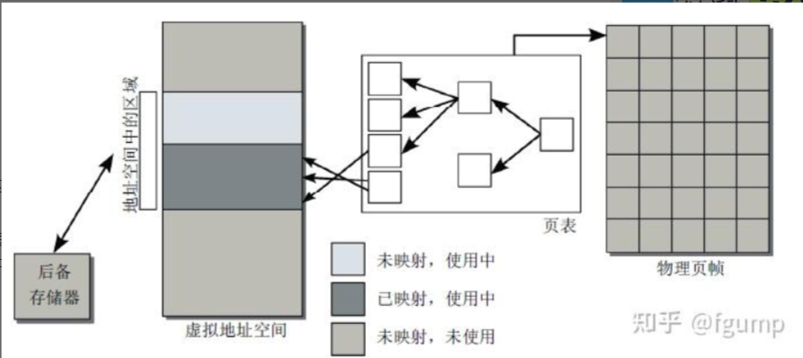
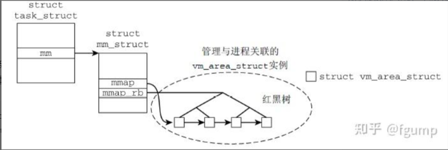

## 高级 I/O 函数之二

### 五、mmap 函数

#### 1.mmap 函数原理讲解

首先尝试从内核的角度来介绍一下 mmap 函数，我们都知道虚拟地址空间的概念，它向每个运行进程提供了同样的系统视图，这使得多个进程可以同时运行，而不会干扰到其他进程内存中的内容。其本质上是通过页表将虚拟地址空间中的页与物理内存中的页帧关联起来。

<div align="center">
    
</div>

而虚拟内存区域在内核中实现如下。Linux 使用 **`task_struct`** 来表示进程/线程，因为 Linux 内核本身并不区分进程和线程，都表达为一个 **`task_struct`** 供内核调度。与每个进程相关联的虚拟内存信息使用结构体 **`mm_struct`** 表示。而具体的每个虚拟内存区域使用 **`vm_area_struct`** 表示，并且将这些 **`vm_area_struct`** 组织为线性链表和红黑树数据结构。也就是说每个进程的虚拟内存区域都在这个数据结构里。

<div align="center">
    
</div>

**`vm_area_struct`** 结构体里保存了这块区域的起始地址和结束地址，以及 **`file`** 对象，如果没有与文件相关联的话，**`file`** 为空。具体还有其他的属性如下。

```c{.line-numbers}
struct vm_area_struct {
    /* 所属地址空间。 */
    struct mm_struct * vm_mm; 
    /* vm_mm 内的起始地址。 */
    unsigned long vm_start;   
    /* 在 vm_mm 内结束地址之后的第一个字节的地址。 */
    unsigned long vm_end;     
    
    /* 各进程的虚拟内存区域链表，按地址排序 */
    struct vm_area_struct *vm_next;
    /* 该虚拟内存区域的访问权限。 */
    pgprot_t vm_page_prot; 
    /* 标志，如下列出。 */
    unsigned long vm_flags; 
    struct rb_node vm_rb;
    ...
    /* 后备存储器的有关信息： */
    /* （vm_file 内）的偏移量，单位是 PAGE_SIZE，不是 PAGE_CACHE_SIZE */
    unsigned long vm_pgoff;
    /* 映射到的文件（可能是 NULL）。 */ 
    struct file * vm_file; 
}
```

那么现在来看 mmap 实现其实本质上就是新建了一个 **`vm_area_struct`** 对象，然后插入到红黑树的合适位置 (**`vm_area_struct`** 根据指向的区域起始地址有序)，然后什么都不干。那么当进程试图访问这段内存区域中包含的虚拟地址时，会发生如下情况：

1. 通过页表发现物理内存中没有关联页（不在物理内存中）。
2. 处理器接下来触发一个缺页异常，发送到内核。
3. **内核会搜索负责缺页区域的进程地址空间的** **`vm_area_struct`** 红黑树，找到对应的虚拟内存区域，发现与之关联的文件对象。
4. 分配物理内存页，并从文件中读取所需数据填充，如果不特别指明的话，内存页是从内核空间中分配。
5. 填充页表，应用程序恢复执行，重新执行指令。

总结上述内容，原理部分就是相当于把文件内容映射成一个内存页，当访问的对应的内存页的时候，触发缺页中断，然后由操作系统走文件系统驱动去读取文件。接下来详细介绍 **`mmap`** 的原理，

要知道，**`Windows`** 的文件系统驱动，默认都是 **`PAGING_IO`** 模式，按道理说 **`Windows`** 上的文件系统访问，默认都是 mmap 形式的变种，那么为什么各个操作系统又额外提供一套 mmap 的 API 呢？

我们正常读写一个文件，用户代码通常需要先申请一块内存，然后把这块内存下发给内核，然后通过文件系统代码读、写文件。但是这么做有一个性能问题。用户代码的这块内存，通常是不对齐的（不对齐到 4K 页），那么当文件系统要通过 DMA 的方式访问磁盘的时候，这块内存通常是不能直接作为 **`DMA buffer`** 下发到硬件驱动里。

于是，用户要读一个文件，就需要内核先准备一个对齐的内存下发给驱动（也就是 block cache），驱动再下发给硬件，读好数据以后，再从内核的这个内存里复制到用户的内存，需要 1-2 次内存拷贝（memcpy），如果数据量比较巨大的话，拷贝的开销是很大的。

而 mmap 就不一样，**mmap 的内存是由内核初始化的，用户代码只是拿到了一个 fd，内核初始化这块内存以后，是可以直接交给文件系统，甚至是块设备驱动使用的**，加上 Linux 的零拷贝（zero copy）技术，可以减少或者避免 memcpy 动作。同时这块内存又是对用户直接可见的，从内核态切换到用户态的过程中，不需要执行任何拷贝动作。

> 可以理解成一般的进程读文件，所开辟的内存是进程自己开辟的用户态中的内存。而 mmap 进程读取的内存直接是内核中开辟的内存。内核的虚拟地址空间和应用进程的虚拟地址空间都会映射（共享）这块物理内存。

#### 2.mmap 函数源码

**`mmap`** 分为文件映射和匿名映射：

- 文件映射：将进程的虚拟内存区域映射到文件。即读取那些内存区域将导致文件被读取，这是默认的映射类型。
- 匿名映射：会映射该进程的虚拟内存中没有任何文件支持的区域，内容初始化为零。系统都通过 **`MAP_ANONYMOUS`** 和 **`MAP_ANON`** 标志实现了匿名映射，但它并不是 **`POSIX`** 标准的一部分。

如果设置 **`MAP_SHARED`** 标志，则将在 **`fork()`** 系统调用中保留该映射。即所有相关（及其子进程）进程中，一个进程对映射区域的写操作，对相关其他进程立即可见。说成人话：不同进程映射了同一块内存，所有进程对这块区域具有可见性。

**1) task_struct 结构体**

**`task_struct`** 这个结构体，它被叫做进程描述符，内部成员包含了很多与进程相关的信息，表示一个进程：

```c{.line-numbers}
struct task_struct {
    // 进程状态
    // -1 不可运行，0 可运行，>0 已停止
    volatile long state; 
    int exit_state;

    // 进程地址空间 
    // 进程所拥有的内存空间描述符，对于内核线程的 mm 为 NULL
    struct mm_struct *mm; 
    // 指进程运行时所使用的进程描述符
    struct mm_struct *active_mm; 

    // 进程标识符（PID） 
    pid_t pid;
    pid_t tgid;

    // 指定调度程序行为
    unsigned int flags;    
    // 表示进程亲属关系的成员 
    struct task_struct __rcu *real_parent;

    // 进程调度 
    int prio, static_prio, normal_prio;
    // 表示进程的调度策略 
    unsigned int policy; 
}
```

**2) mm_struct**

内存描述符的结构体———— **`mm_struct`**，抽象的来描述 Linux 下进程的地址空间的所有的信息，一个 **`task_struct`** 只有一个 **`mm_struct`**。

```c{.line-numbers}
struct mm_struct {
    // 指向线性区对象的链表头
    struct vm_area_struct * mmap;       /* list of VMAs */
    // 指向线性区对象的红黑树
    struct rb_root mm_rb;
    // vma 缓存存放最近找到的 vma（数组结构）
    struct vm_area_struct * mmap_cache; 
    // 标识第一个分配文件内存映射的线性地址
    unsigned long mmap_base;    /* base of mmap area */
    // 用来在进程地址空间中搜索有效的进程地址空间的函数
    unsigned long (*get_unmapped_area) (struct file *filp,
                unsigned long addr, unsigned long len,
                unsigned long pgoff, unsigned long flags);
  
    // 指向页表的目录
    pgd_t * pgd;
  
    // 进程地址空间的页数
    unsigned long total_vm;    
    // 锁住的页数，不能换出    
    unsigned long locked_vm;  
}
```

**3) vm_area_struct**

进程虚拟内存描述符，Linux 内核使用 **`vm_area_struct`** 结构来表示一个独立的虚拟内存区域。**`vm_area_struct`** 结构中包含区域起始和终止地址以及其他相关信息，同时也包含一个 **`vm_ops`** 指针，其内部可引出所有针对这个区域可以使用的系统调用函数。这样，进程对某一虚拟内存区域的任何操作需要用要的信息，都可以从 **`vm_area_struct`** 中获得。**mmap 函数就是要创建一个新的 **`vm_area_struct`** 结构，并将其与文件的物理磁盘地址相连**。

```c{.line-numbers}
// 该结构定义了一个内存 VMA 内存区域。
struct vm_area_struct {
    // 所属的内存描述符
    struct mm_struct *vm_mm; 
    // vma 的起始地址
    unsigned long vm_start;        
    // vma 的结束地址
    unsigned long vm_end;     

    // 该 vma 的在一个进程的 vma 链表中的前驱 vma 和后驱 vma 指针，链表中的 vma 都是按地址来排序的
    struct vm_area_struct *vm_next, *vm_prev;

    // 红黑树 rb(red black) 中对应的节点（红黑树的引入就是为了解决当查找数量 vma 非常多时效率低下的问题，在红黑树中，搜索元素，插入，删除等操作，都会变得非常高效）
    struct rb_node vm_rb;      
  
    // vma 的访问权限
    pgprot_t vm_page_prot;    
    // 标志，请参见 mm.h
    unsigned long vm_flags;    
    // 映射文件的偏移量，以 PAGE_SIZE 为单位
    unsigned long vm_pgoff;   
    // 我们映射到的文件（可以为 NULL）     
    struct file *vm_file;    
}
```

**4) task_struct、mm_struct 和 vm_area_struct 的关系**

<div align="center">
    
</div>

一个进程 **`task_struct`** 的虚拟地址空间主要由两个数据结来描述。一个是最高层次的：**`mm_struct`**，一个是较高层次的：**`vm_area_structs`**。最高层次的 **`mm_struct`** 结构描述了一个进程的整个虚拟地址空间。较高层次的结构 **`vm_area_struct`** 描述了虚拟地址空间的一个区间（简称虚拟区）。**每个进程只有一个 **`mm_struct`** 结构，在每个进程的 **`task_struct`** 结构中，有一个指向该进程的结构**。可以说，**`mm_struct`** 结构是对整个用户空间的描述。

Linux 内存使用红黑树和链表的作用是什么？红黑树是方便遍历查找符合要求的结点（比如 **`mmap`** 的时候查找 **`vma`**），链表是顺序结构，当需要顺序遍历时起到作用（比如 **`mm_take_all_locks()`**）。

**5) mmap 函数**

```c{.line-numbers}
void *mmap(void *start, size_t length, int prot, int flags, int fd, off_t offset);
```

参数说明：

- start：指向欲映射的内存起始地址，通常设为 NULL，代表让系统自动选定地址，映射成功后返回该地址。
- length：映射区的大小
- prot：映射区域的保护方式
  - **`PROT_EXEC`** 映射区域可被执行
  - **`PROT_READ`** 映射区域可被读取
  - **`PROT_WRITE`** 映射区域可被写入
  - **`PROT_NONE`** 映射区域不能存取
- flags：影响映射区域的各种特性
  - **`MAP_SHARED`** 对映射区域的写入数据会复制回文件内，而且允许其他映射该文件的进程共享。
  - **`MAP_PRIVATE`** 对映射区域的写入操作会产生一个映射文件的复制（写时复制），对此区域作的任何修改都不会写回原来的文件内容。
  - **`MAP_ANONYMOUS`** 匿名映射，映射区不与任何文件关联
- fd：如果 **`MAP_ANONYMOUS`** 被设定，为了兼容问题，其值应为 -1
- offset：文件映射的偏移量，通常设置为 0，代表从文件最前方开始对应，**offset 必须是分页大小的整数倍**

返回值：若映射成功则返回映射区的内存起始地址，否则返回 **`MAP_FAILED`**(－1)，错误原因存于 **`errno`** 中。

问：为什么映射区的大小必须是物理页的整数倍？物理内存的单位是页，而进程虚拟地址空间和内存的映射也是以页为单位，32 位系统中一个物理页大小 (page_size) 通常是 4K = 4096

**6) mmap 函数的调用过程**

**`mmap`** 内存映射的实现过程，总的来说可以分为三个阶段：

- 进程在用户空间调用库函数 mmap()
- 在当前进程的虚拟地址空间中，寻找一段空闲的满足要求的连续的虚拟地址
- 为此虚拟区分配一个 **`vm_area_struct`** 结构，接着对这个结构的各个域进行了初始化，比如设置 vma->vm_file 以及根据文件系统类型，将 **`vma->vm_ops`** 设为对应的 **`file_operations`**
- 将新建的虚拟区结构 **`vm_area_struct`** 插入进程的虚拟地址区域链表或树中

我们从一个简单的 mmap demo 开始入手，我们先 open 一个 mapTest.txt，获得 fd，然后在 mmap() 中传入 fd。

```c{.line-numbers}
int main(int argc, const char* argv[]) {
    // 打开一个文件
    int fd = open("mapTest.txt", O_RDWR);
    int len = lseek(fd, 0, SEEK_END);
    // 创建内存映射区
    void *ptr = mmap(NULL, len, PROT_READ | PROT_WRITE, MAP_SHARED, fd, 0);
    if (ptr == MAP_FAILED) {
        perror("error");
        exit(1);
    }

    printf("%s", (char*)ptr);

    // 释放内存映射区
    munmap(ptr, len);
    close(fd);

    return 0;
}
```

**`mmap()`** 对应系统调用哪个函数呢？查看系统调用表，发现是 9 号系统调用（进入内核态）**`sys_mmap()`** 就是 **`mmap()`** 的内核实现。

```c{.line-numbers}
// syscall.tbl
9    common    mmap    sys_mmap
```

```c{.line-numbers}
#define offset_in_page(p)  ((unsigned long)(p) & ~PAGE_MASK)

// sys_ia64.c
asmlinkage unsigned long
sys_mmap (unsigned long addr, unsigned long len, int prot, int flags, int fd, long off) {
    // 检查偏移量 off 是否页面对齐
    if (offset_in_page(off) != 0)
        return -EINVAL;
    // ksys_mmap_pgoff
    addr = ksys_mmap_pgoff(addr, len, prot, flags, fd, off >> PAGE_SHIFT);
    if (!IS_ERR((void *) addr))
        force_successful_syscall_return();
    return addr;
}
```

```c{.line-numbers}
unsigned long ksys_mmap_pgoff(unsigned long addr, unsigned long len, unsigned long prot, unsigned long flags, unsigned long fd, unsigned long pgoff) {
  
  struct file *file = NULL;
  
  // 省略代码...

  retval = vm_mmap_pgoff(file, addr, len, prot, flags, pgoff);
}
```

```c{.line-numbers}
unsigned long vm_mmap_pgoff(struct file *file, unsigned long addr,
    unsigned long len, unsigned long prot,
    unsigned long flag, unsigned long pgoff) {

    unsigned long ret;

    // 省略代码...

    ret = do_mmap_pgoff(file, addr, len, prot, flag, pgoff, &populate, &uf);
}
```

```c{.line-numbers}
/* align addr on a size boundary - adjust address up/down if needed */
#define _ALIGN_UP(addr, size)    ((addr) + (size - 1)) & (~(size - 1))

/* align addr on a size boundary - adjust address up if needed */
#define _ALIGN(addr, size)     _ALIGN_UP(addr,size)

/* to align the pointer to the (next) page boundary */
#define PAGE_ALIGN(addr)    _ALIGN(addr, PAGE_SIZE)

static inline unsigned long round_hint_to_min(unsigned long hint) {
    // hint &= PAGE_MASK 表示将 hint 变为 PAGE 大小的整数倍并且修改后的 hint <= 修改前的 hint
    // 比如一个页面的大小为 64B，而现在地址大小为 286，即 
    // PAGE_SHIFT = 6
    // PAGE_SIZE = 1 << 6 = 64
    // PAGE_MASK = ~(PAGE_SIZE - 1) = ~(011 1111) = 100 0000
    // hint = 286 = 1 0001 1110 
    // hint & PAGE_MASK = 1 0000 0000 = 256
    // 同理，当 hint 为 336 时，hint & PAGE_MASK 为 320
    hint &= PAGE_MASK;
    // hint 地址的值不能小于 mmap_min_addr，这是为了防止 NULL pointer dereference
    if (((void *)hint != NULL) &&
        (hint < mmap_min_addr))
        // (mmap_min_addr + PAGE_SIZE - 1) & PAGE_MASK
        // 即大于 mmap_min_addr 并且是 PAGE_SIZE 整数倍的最小地址
        return PAGE_ALIGN(mmap_min_addr);
    return hint;
}
```

在下面的 **`do_mmap_pgoff`** 函数中需要用到 **`round_hint_to_min`** 函数，这个函数将 **`hint`** 地址设置为大于 **`mmap_min_addr`** 并且为 **`PAGE_SIZE`** 整数倍的最小地址。我们首先看看 Red Hat 对于 **`mmap_min_addr`** 地址作用的解释（为了防止 NULL pointer dereference）：

> NULL pointer dereference flaws in the Linux kernel can often be abused by a local, unprivileged user to gain root privileges by **_mapping attacker-controlled data to low memory pages_**. In the Linux kernel version 2.6.23, the /proc/sys/vm/mmap_min_addr tunable was introduced to prevent unprivileged users from creating new memory mappings below the minimum address.

在默认的 x86 Linux 上，小于 0x10000 的虚地址是没有办法 mmap 的。而 x86 Linux 不让用户 **`mmap`** 低于 0x10000 的虚地址也是有它的道理的。

有时候因为某些设计缺陷，程序使用了错误的指针，访问了错误的内存。如果指针指向的地址在进程中没有被映射，那么执行时会产生 page fault 异常，操作系统会给进程发送 **`SIGSEGV`** 信号。如果程序没有注册 **`SIGSEGV`** 信号处理函数，接收到这个信号就会退出，并报告我们熟悉的 'Segmentation Fault'。

但是，**如果指针指向的地址在进程中被映射了，错误的内存访问就会悄无声息地发生，给 debug 带来了很大的难度**。在设计进程的虚拟空间的时候，x86 Linux 不让用户 mmap 低于 0x10000 的虚地址空间，那么这段空间永远不会被映射，所有非法访问这段内存的行为都会被发现，为程序 debug 带来了一些便利。其实，在不同的 Linux 系统下，默认可以 mmap 的最低地址是不同的。比如 x86 上是 0x10000，mips 上是 0x4000，arm 上是 0x1000。

下面这个小程序可以输出当前系统下可以 mmap 的最低地址：

```c{.line-numbers}
#include <sys/mman.h>
#include <stdio.h>
#include <unistd.h>

int main(){
    int i;
    void *start = NULL;
    size_t page_size = getpagesize();
    while(1){
        void *addr = mmap(start, page_size, PROT_READ|PROT_WRITE, \
        MAP_PRIVATE|MAP_FIXED|MAP_ANONYMOUS, -1, 0);
        if(addr != MAP_FAILED) {
            printf("lowest mapable address: %p\n", start);
            break;
        }
        start += page_size;
    }
    return 0;
}
```

下面继续看 **`do_mmap_pgoff`** 函数的内容：

```c{.line-numbers}
unsigned long do_mmap_pgoff(struct file *file, unsigned long addr,
            unsigned long len, unsigned long prot,
            unsigned long flags, unsigned long pgoff) {
    struct mm_struct * mm = current->mm;
    struct inode *inode;
    unsigned int vm_flags;
    int error;
    unsigned long reqprot = prot;

    /*
     * Does the application expect PROT_READ to imply PROT_EXEC?
     *
     * (the exception is when the underlying filesystem is noexec mounted, in which case we dont add PROT_EXEC.)
     */
    if ((prot & PROT_READ) && (current->personality & READ_IMPLIES_EXEC))
        if (!(file && path_noexec(&file->f_path)))
            prot |= PROT_EXEC;

    /*
     * 函数对传入的参数进行一系列检查, 假如任一参数出错，都会返回一个 errno
     */
    if (!len)
        return -EINVAL;
    
    /* 
     * MAP_FIXED 参数指定内存段必须位于 start 参数指定的地址处，start 必须是内存页面大小（4K）的整数倍，
     * 假如没有设置 MAP_FIXED 标志，且 addr 小于 mmap_min_addr，因为可以修改 addr，所以就需要将 addr 设为 mmap_min_addr 的页对齐后的地址，
     * 即 addr 为大于 mmap_min_addr 的并且 PAGE_SIZE 对齐的最小地址
     */
    if (!(flags & MAP_FIXED))
        addr = round_hint_to_min(addr);

    /* Careful about overflows.. */
    /* 
     * (len + PAGE_SIZE - 1) & PAGE_MASK
     * 将 len 调整为大于原有值同时 PAGE_SIZE 对齐的大小
     */
    len = PAGE_ALIGN(len);
    if (!len)
        return -ENOMEM;

    /* offset overflow? */
    // 注意 offset 是以页为单位的，len >> PAGE_SHIFT 表示 len（上面对齐以后）包含多少页
    // 如果 pgoff + (len >> PAGE_SHIFT) < pgoff 说明 pgoff 发生了溢出
    if ((pgoff + (len >> PAGE_SHIFT)) < pgoff)
               return -EOVERFLOW;

    /* Too many mappings? */
    /* 判断该进程的地址空间的虚拟区间数量是否超过了限制 */
    if (mm->map_count > sysctl_max_map_count)
        return -ENOMEM;

    /* 
     * Obtain the address to map to. we verify (or select) it and ensure that it represents a valid section of 
     * the address space.
     * get_unmapped_area 从当前进程的用户空间获取一个未被映射区间的起始地址 
     */
    addr = get_unmapped_area(file, addr, len, pgoff, flags);
    // 如果地址不是是页对齐，addr 值可能是错误值(大概类似 -EINVAL 这种?)，然后将错误结果返回给用户了
    if (addr & ~PAGE_MASK)
        return addr;

    /* 
     * Do simple checking here so the lower-level routines won't have to. we assume access permissions have 
     * been handled by the open of the memory object, so we don't do any here.
     * 以下是检查 flag 的参数设置，将 mmap 的 flag 转换为 vm_area_struct 的 flag
     * mmap 的 flags 值为：MAP_SHARED、MAP_PRIVATE、MAP_ANONYMOUS
     * vm_area_struct 的 vm_flags 为：VM_READ、VM_WRITE、VM_EXEC、VM_SHARED、VM_MAYREAD（The VM_READ flag can be set）、
     * VM_MAYWRITE（The VM_WRITE flag can be set）、VM_MAYEXEC（The VM_EXEC flag can be set）
     */
    vm_flags = calc_vm_prot_bits(prot) | calc_vm_flag_bits(flags) | mm->def_flags | VM_MAYREAD | VM_MAYWRITE | VM_MAYEXEC;

    if (flags & MAP_LOCKED)
        if (!can_do_mlock())
            return -EPERM;

    /* mlock MCL_FUTURE? */
    if (vm_flags & VM_LOCKED) {
        unsigned long locked, lock_limit;
        locked = len >> PAGE_SHIFT;
        locked += mm->locked_vm;
        lock_limit = rlimit(RLIMIT_MEMLOCK);
        lock_limit >>= PAGE_SHIFT;
        if (locked > lock_limit && !capable(CAP_IPC_LOCK))
            return -EAGAIN;
    }

    inode = file ? file->f_path.dentry->d_inode : NULL;

    // 如果 file 不为 NULL，则表示是基于文件的映射，如果是 NULL 则是匿名映射
    if (file) {
        // 根据是私有映射还是共享映射进行不同的处理
        /*
         * 根据标志指定的map种类，把为文件设置的访问权考虑进去。
         * 如果所请求的内存映射是共享可写的，就要检查要映射的文件是为写入而打开的，而不是以追加模式打开的，还要检查文件上没有上强制锁。
         * 对于任何种类的内存映射，都要检查文件是否为读操作而打开的。
        */
        switch (flags & MAP_TYPE) {
            case MAP_SHARED:
                /*
                 * prot 的值可以为 PROT_EXEC、PROT_WRITE、PROT_READ、PROT_NONE，表示映射区的属性
                 * 如果 prot 表示映射区可以被写入，但是文件创建时指定的文件模式 f_mode 不为 FMODE_WRITE（不可写），
                 * 那么返回错误信息
                 */
                if ((prot & PROT_WRITE) && !(file->f_mode & FMODE_WRITE))
                    return -EACCES;

                /*
                 * Make sure we don't allow writing to an append-only file.
                 */
                if (IS_APPEND(inode) && (file->f_mode & FMODE_WRITE))
                    return -EACCES;

                /*
                 * Make sure there are no mandatory locks on the file.
                 * 确保文件的 inode 结点没有被上锁
                 */
                if (locks_verify_locked(inode))
                    return -EAGAIN;

                // 设置 vm_area_struct 的 flag 标志，可共享
                vm_flags |= VM_SHARED | VM_MAYSHARE;
                /*
                 * This looks strange, but when we don't have the file open for writing, we can demote the shared mapping 
                 * to a simpler private mapping. 
                 *
                 * We leave the VM_MAYSHARE bit on, just to get correct output from /proc/xxx/maps..
                 */
                // 如果 file 文件在创建时指明不可写，那么就将前面代码中 VM_MAYREAD | VM_MAYWRITE | VM_MAYEXEC 的 VM_MAYWRITE 删除掉
                // 并且由于文件被打开为只读，那么将内存映射方式更改为 PRIVATE MAPPING（私有映射）
                // 私有映射和共享映射的区别是私有映射对内存映射区采用写时复制机制，并且内存中更改的内容不会被写回到文件中
                // 一般私有映射用在：多个执行同一个程序或使用同一个共享库的进程共享同样的（只读的）文本段，映射一个可执行文件或共享库的初始化数据段
                if (!(file->f_mode & FMODE_WRITE))
                    vm_flags &= ~(VM_MAYWRITE | VM_SHARED);

            /* 上面 MAP_SHARED 选项没有 break，直接 fall through */
            case MAP_PRIVATE:
                // 如果 file 没有在创建时设置读属性，那么直接返回，因为没有读属性，则表明无法将文件中的内容映射到内存中
                // Makes sense, as the contents of the file needs to be read to initialize parts of the memory you don't write.
                if (!(file->f_mode & FMODE_READ))
                    return -EACCES;
                if (path_noexec(&file->f_path)) {
                    if (vm_flags & VM_EXEC)
                        return -EPERM;
                    vm_flags &= ~VM_MAYEXEC;
                }

                if (!file->f_op || !file->f_op->mmap)
                    return -ENODEV;
                break;

            default:
                return -EINVAL;
        }
    } else {
        switch (flags & MAP_TYPE) {
            case MAP_SHARED:
                /*
                 * Ignore pgoff.
                 * 共享匿名映射忽略 pgoff
                 */
                pgoff = 0;
                vm_flags |= VM_SHARED | VM_MAYSHARE;
                break;
            case MAP_PRIVATE:
                /*
                 * Set pgoff according to addr for anon_vma.
                 * 匿名私有映射使用分配出来的 addr 作为 pgoff
                 */
                pgoff = addr >> PAGE_SHIFT;
                break;
            default:
                return -EINVAL;
        }
    }

    error = security_file_mmap(file, reqprot, prot, flags, addr, 0);
    if (error)
        return error;

    return mmap_region(file, addr, len, flags, vm_flags, pgoff);
}
```

**`mmap_region`** 函数完成最后的映射过程，即将用户需要映射的虚拟地址范围建立起来，然后再将其加入当前进程的 **`mm_struct`** 结构中。根据源码我们可以知道，该函数根据用户需要分配的地址空间的信息，或扩展当前的进程的虚拟地址空间范围，或创建一个新的 vma 结构加入到进程的 **`mm_struct`** 当中，**这样当前进程就有了可以直接访问的 mmap 分配的内存区域**。这样就完成了整个 mmap 的映射过程，**但实质上只是分配了 vma 结构去进程的虚拟地址空间当中**，访问的时候会触发 **`page-fault`** 缺页异常，才会给这些刚刚分配的虚拟地址空间的 vma 结构建立虚拟地址和物理地址的映射关系。

```c{.line-numbers}
// 查找第一个满足 addr < vm_end 的 VMA，如果没有，则为 NULL。
struct vm_area_struct *find_vma(struct mm_struct *mm, unsigned long addr) {

    struct rb_node *rb_node;
    struct vm_area_struct *vma;
  
    // 1.首先尝试从 mmap_cache 缓存中查找 vma，如果不满足下列条件中的任意一个则从红黑树中查找合适的 vma
    vma = vmacache_find(mm, addr);
    if (likely(vma))
        return vma;
    
    // 获取红黑树根节点
    rb_node = mm->mm_rb.rb_node; 
    
    // 2.遍历红黑树，找到合适的vma
    while (rb_node) {
        struct vm_area_struct *tmp;

        tmp = rb_entry(rb_node, struct vm_area_struct, vm_rb);
        
        // 条件 1: vma 的结束地址是否大于给定地址 addr
        if (tmp->vm_end > addr) { 
            vma = tmp;
            // 条件 2: vma 的起始地址是否小于给定地址 addr
            if (tmp->vm_start <= addr)
                // 条件 1 和条件 2 同时满足保证给定的地址 addr 是处于 vma 的范围之内的
                // vma_start < addr < addr vma_end
                break; 
            // 如果满足条件 1 不满足条件 2，则只能找到一个距离给定地址最近的 vma 并且该 vma 的结束地址要大于给定地址
            // addr < vma_start < vma_end
            rb_node = rb_node->rb_left;
        } else
            rb_node = rb_node->rb_right;
    }

    if (vma)
        // 3.将结果保存在 mmap_cache 中
        vmacache_update(addr, vma); 

    return vma;
}

// find_vma_prepare 和 find_vma 的逻辑大致相同，都是查找第一个满足 addr < vm_end 的 VMA，如果没有，则为 NULL。
static struct vm_area_struct *find_vma_prepare(struct mm_struct *mm, unsigned long addr, struct vm_area_struct **pprev, 
            struct rb_node ***rb_link, struct rb_node ** rb_parent) {
                
    struct vm_area_struct* vma;
    struct rb_node** __rb_link, * __rb_parent, * rb_prev;

    __rb_link = &mm->mm_rb.rb_node;
    rb_prev = __rb_parent = NULL;
    vma = NULL;

    while (*__rb_link) {
        struct vm_area_struct *vma_tmp;

        __rb_parent = *__rb_link;
        vma_tmp = rb_entry(__rb_parent, struct vm_area_struct, vm_rb);

        if (vma_tmp->vm_end > addr) {
            vma = vma_tmp;
            if (vma_tmp->vm_start <= addr)
                break;
            __rb_link = &__rb_parent->rb_left;
        } else {
            rb_prev = __rb_parent;
            __rb_link = &__rb_parent->rb_right;
        }
    }

    *pprev = NULL;
    if (rb_prev)
        *pprev = rb_entry(rb_prev, struct vm_area_struct, vm_rb);

    *rb_link = __rb_link;
    *rb_parent = __rb_parent;
    return vma;
}
```

do_mmap() 根据用户传入的参数做了一系列的检查，然后根据参数初始化 vm_area_struct 的标志 vm_flags，vma->vm_file = get_file(file) 建立文件与 vma 的映射，mmap_region() 负责创建虚拟内存区域:

```c{.line-numbers}
/*
 * Return true if the calling process may expand its vm space by the passed number of pages
 */
int may_expand_vm(struct mm_struct *mm, unsigned long npages) {
    /* pages */
    // mm_struct 结构体中的 total_vm 表示在进程虚拟内存空间中总共与物理内存映射的页的总数
    unsigned long cur = mm->total_vm;    
    unsigned long lim;

    // 每个进程在运行时系统不会无限制的允许单个进程不断的消耗资源，因此都会设置资源限制。
    // Linux 系统中使用 resource limit 来表示，每个进程都可以设置不同的资源限制，当前进程和其以后 fork 的子进程会遵循此限制，而其他进程不受当前进程条件的影响。
    // RLIMIT_AS/RLIMIT_VMEM: 这两个资源表示的是同一个含义，都是只 address space 限制，可用内存用户地址空间最大长度，会影响到 sbrk 和 mmap 函数。
    lim = rlimit(RLIMIT_AS) >> PAGE_SHIFT;

    if (cur + npages > lim)
        return 0;
    return 1;
}

/*
 * We account for memory if it's a private writeable mapping, not hugepages and VM_NORESERVE wasn't set.
 */
static inline int accountable_mapping(struct file *file, unsigned int vm_flags)
{
    /*
     * hugetlb has its own accounting separate from the core VM
     * VM_HUGETLB may not be set yet so we cannot check for that flag.
     */
    if (file && is_file_hugepages(file))
        return 0;

    return (vm_flags & (VM_NORESERVE | VM_SHARED | VM_WRITE)) == VM_WRITE;
}

#define OVERCOMMIT_GUESS        0
#define OVERCOMMIT_ALWAYS       1
#define OVERCOMMIT_NEVER        2
/* heuristic overcommit */
int sysctl_overcommit_memory = OVERCOMMIT_GUESS;  

/*
 * __vm_enough_memory 函数，返回 0 表示进程有足够内存分配，返回 -ENOMEM 表示没有足够内存分配
 * Check that a process has enough memory to allocate a new virtual mapping. 0 means there is enough memory for the allocation to
 * succeed and -ENOMEM implies there is not.
 *
 * We currently support three overcommit policies, which are set via the vm.overcommit_memory sysctl.  
 * See Documentation/vm/overcommit-accounting
 *
 * 如果是内核 root 用户，那么 cap_sys_admin 是 1，否则 cap_sys_admin 为 0
 * cap_sys_admin is 1 if the process has admin privileges, 0 otherwise. Note this is a helper function intended to be used by 
 * LSMs which wish to use this logic.
 */
 // 参数：内存描述符 mm_struct，申请的内存大小 pages(1 page = 4K)，cap_sys_admin 是否是 root 用户还是普通用户
int __vm_enough_memory(struct mm_struct *mm, long pages, int cap_sys_admin) {

    unsigned long free, allowed;
    vm_acct_memory(pages);

    /*
     * Sometimes we want to use more memory than we have
     * 由于内核不限制 overcommit，直接返回 0，
     * sysctl_overcommit_memory 受内核参数 /proc/sys/vm/overcommit_memory 控制
     */
    if (sysctl_overcommit_memory == OVERCOMMIT_ALWAYS)
        return 0;

    // 若为 OVERCOMMIT_GUESS，内核会进行判断内存分配是否合理
    if (sysctl_overcommit_memory == OVERCOMMIT_GUESS) {
        unsigned long n;
        // 首先会计算当前系统的可用内存，计算有多少空闲 page frame
        free = global_zone_page_state(NR_FREE_PAGES);
        // 计算有多少 page cache 使用的 page frame，主要是用户空间进程读写文件造成的
        // 这些 cache 都是为了加快系统性能而增加的，提高 CPU 读写命中率，因此，如果直接操作到磁盘，本质上这些 page cache 都是 free 的
        free += global_page_state(NR_FILE_PAGES);

        /*
         * shmem pages shouldn't be counted as free in this case, they can't be purged, only swapped out, and
         * that won't affect the overall amount of available memory in the system.
         */
        // 用于进程间的 share memory 机制的这些 shmem page frame 不能认为是 free 的，需要减去
        // 而且它们不能被清除 (free)，只能换出 (swap out)
        free -= global_node_page_state(NR_SHMEM);

        // 加上 swap file 或者 swap space 上空闲的 "page frame" 数目。
        // 本质上，swap file 或者 swap space 上的磁盘空间都是给 anonymous page 做腾挪之用，其实这里的 "page frame" 不是真的 page frame，称之 swap page 好了
        // 这里把 free swap page 的数目也计入 free 主要是因为可以把使用中的 page frame swap out 到 free swap page 上，因此也算是 free page
        free += get_nr_swap_pages();

        /*
         * Any slabs which are created with the SLAB_RECLAIM_ACCOUNT flag claim to have contents
         * which are reclaimable, under pressure.  The dentry cache and most inode caches should fall into this
         */ 
        // 加上被标记为可回收的 slab 对应的页面
        free += global_page_state(NR_SLAB_RECLAIMABLE);

        /*
         * Part of the kernel memory, which can be released under memory pressure.
         */
        // 加上被标记为可回收的非 slab 的内核页面
        free += global_node_page_state(NR_KERNEL_MISC_RECLAIMABLE);

        // totalreserve_pages，这是一个能让系统运行需要预留的 page frame 的数目，
        // 因此我们要从减去 totalreserve_pages。如果当前 free page 数目小于 totalreserve_pages，则拒绝本次对内核空间里面的虚拟内存的申请。
        if (free <= totalreserve_pages)
            goto error;
        else
            free -= totalreserve_pages;

        /*
         * Leave the last 3% for root
         * 如果是普通的进程，还需要保留 admin_reserve_kbytes 的 free page，以便在出问题时可以让 root 用户可以登录并进行恢复操作
         */
        if (!cap_sys_admin)
            free -= sysctl_admin_reserve_kbytes >> (PAGE_SHIFT - 10);;

        // 最关键的判断来了
        // 比对当前系统的可用内存（free）和本次请求分配 virtual memory 的 page 数目 (pages)，
        // 如果在前面减去了所必须的 page frame 之后，还有足够的 page 可以满足本次分配，那么就批准本次对内核空间里面的虚拟内存的分配。
        if (free > pages)
            return 0;

        goto error;
    }

    // 下面为 OVERCOMMIT_NEVER 的情况，是禁止出现 overcommit
    // 这里调用 vm_commit_limit 得到判断是否出现 overcommit 的阈值 allowed，以 page 为单位
    allowed = vm_commit_limit();

    /*
     * Leave the last 3% for root
     * 同前面一样，需要减去预留给 root 用户的内存
     */
    if (!cap_sys_admin)
        allowed -= sysctl_admin_reserve_kbytes >> (PAGE_SHIFT - 10);

    allowed += total_swap_pages;

    /*
     * Don't let a single process grow so big a user can't recover
     */
    // 如果是用户空间的进程，要为用户能够从绝境中恢复而保留一些 page frame，具体保留多少需要考量两个因素，
    // 一个是单一进程的 total virtual memory，一个是用户设定的运行时参数 user_reserve_kbytes。
    // 更具体的考量因素可以参考https://lkml.org/lkml/2013/3/18/812
    if (mm) {
        reserve = sysctl_user_reserve_kbytes >> (PAGE_SHIFT - 10);
        // 注意：至于为什么要除以 32，就跟上面链接里面描述的一样，取一个进程 total_vm 的 3%，即接近是 1/32，
        // 然后跟用户设定的 reserve 取 min，主要是避免用户把 sysctl_user_reserve_kbytes 设置的太大了，给了一个保护性措施
        allowed -= min_t(long, mm->total_vm / 32, reserve);
    }

    // allowed 变量保存了判断 overcommit 的上限（CommitLimit），vm_committed_as（Committed_AS）保存了当前系统中已经申请（包括本次）
    // 的 virtual memory 的数目。如果大于这个上限就判断 overcommit，本次申请虚拟内存失败
    if (percpu_counter_read_positive(&vm_committed_as) < allowed)
        return 0;
error:
    vm_unacct_memory(pages);

    return -ENOMEM;
}

unsigned long mmap_region(struct file *file, unsigned long addr, unsigned long len, unsigned long flags, 
                            unsigned int vm_flags, unsigned long pgoff) {

    struct mm_struct *mm = current->mm;
    struct vm_area_struct *vma, *prev;
    int correct_wcount = 0;
    int error;
    struct rb_node **rb_link, *rb_parent;
    unsigned long charged = 0;
    struct inode *inode =  file ? file->f_path.dentry->d_inode : NULL;

    /* Check against address space limit. */
    // 检查需要的申请的页面长度是否超过的虚拟内存地址空间的限制
    if (!may_expand_vm(mm, len >> PAGE_SHIFT))
        return -ENOMEM;

    /*
     * 函数 find_vma_prepare() 与 find_vma() 基本相同，它扫描当前进程地址空间的 vm_area_struct 结构所形成的红黑树，
     * 试图找到结束地址高于 addr 的第一个区间；如果找到了一个虚拟区，并且 addr + len > start，说明 addr 所在的虚拟区已经在使用，也就是已经有映射存在，
     * 因此要调用 do_munmap() 把这个老的虚拟区从进程地址空间中撤销，如果撤销不成功，就返回一个负数；如果撤销成功，就继续查找，
     * 直到在红黑树中找不到 addr 所在的虚拟区
     */
munmap_back:
    vma = find_vma_prepare(mm, addr, &prev, &rb_link, &rb_parent);
    if (vma && vma->vm_start < addr + len) {
        if (do_munmap(mm, addr, len))
            return -ENOMEM;
        goto munmap_back;
    }

    /*
     * Set 'VM_NORESERVE' if we should not account for the memory use of this mapping.
     * VM_NORESERVE: Do not reserve swap space for this mapping. When swap space is not reserved one might get 
     * SIGSEGV upon a write if no physical memory is available. VM_NORESERVE 表示不在交换空间中为进程预留空间，表示
     * 现在物理内存资源非常充足或者进程不需要使用太多物理内存，即不为此映射考虑内存使用的问题
     */
    if ((flags & MAP_NORESERVE)) {
        /* We honor MAP_NORESERVE if allowed to overcommit */
        // 如果在系统中允许 over-commit，允许你申请超过系统实际拥有的内存（默认都是允许），那么增加 VM_NORESERVE 标志
        // 如果再系统中不允许 over-commit，那么说明现在物理内存 + 交换空间的资源非常紧张，不应该使用 VM_NORESERVE 标志
        if (sysctl_overcommit_memory != OVERCOMMIT_NEVER)
            vm_flags |= VM_NORESERVE;

        /* hugetlb applies strict overcommit unless MAP_NORESERVE */
        if (file && is_file_hugepages(file))
            vm_flags |= VM_NORESERVE;
    }

    /*
     * Private writable mapping: check memory availability
     */
    if (accountable_mapping(file, vm_flags)) {
        charged = len >> PAGE_SHIFT;
        // 检查是否有足够的内存进行映射分配
        if (security_vm_enough_memory(charged))
            return -ENOMEM;
        vm_flags |= VM_ACCOUNT;
    }

    /*
     * Can we just expand an old mapping?
     * 当前申请的虚拟地址空间是否可以当前进程的虚拟地址空间进行合并，如果可以合并，直接修改当前进程的 vma 的 vm_start 和 vm_end 的值
     */
    vma = vma_merge(mm, prev, addr, addr + len, vm_flags, NULL, file, pgoff, NULL);
    if (vma)
        goto out;

    /*
     * Determine the object being mapped and call the appropriate specific mapper. the address has already been validated, but
     * not unmapped, but the maps are removed from the list.
     * 如果无法合并，根据用户申请的地址空间范围，分配一个新的 vma 结构
     */
    vma = kmem_cache_zalloc(vm_area_cachep, GFP_KERNEL);
    if (!vma) {
        error = -ENOMEM;
        goto unacct_error;
    }

     // 初始化 vma 的信息
    vma->vm_mm = mm;
    vma->vm_start = addr;
    vma->vm_end = addr + len;
    vma->vm_flags = vm_flags;
    vma->vm_page_prot = vm_get_page_prot(vm_flags);
    vma->vm_pgoff = pgoff;
    INIT_LIST_HEAD(&vma->anon_vma_chain);

    if (file) {
        // 省略代码.....
    } else if (vm_flags & VM_SHARED) {
        // 省略代码.....
    }

    if (vma_wants_writenotify(vma)) {
        // 省略代码.....
    }

    vma_link(mm, vma, prev, rb_link, rb_parent);
    file = vma->vm_file;

    /* Once vma denies write, undo our temporary denial count */
    if (correct_wcount)
        atomic_inc(&inode->i_writecount);
out:
    perf_event_mmap(vma);

    // 更新当前的虚拟地址空间的使用统计信息
    mm->total_vm += len >> PAGE_SHIFT;
    vm_stat_account(mm, vm_flags, file, len >> PAGE_SHIFT);
    if (vm_flags & VM_LOCKED) {
        if (!mlock_vma_pages_range(vma, addr, addr + len))
            mm->locked_vm += (len >> PAGE_SHIFT);
    } else if ((flags & MAP_POPULATE) && !(flags & MAP_NONBLOCK))
        make_pages_present(addr, addr + len);
    // 返回分配的 addr
    return addr;

unmap_and_free_vma:
    if (correct_wcount)
        atomic_inc(&inode->i_writecount);
    vma->vm_file = NULL;
    fput(file);

    /* Undo any partial mapping done by a device driver. */
    unmap_region(mm, vma, prev, vma->vm_start, vma->vm_end);
    charged = 0;
free_vma:
    kmem_cache_free(vm_area_cachep, vma);
unacct_error:
    if (charged)
        vm_unacct_memory(charged);
    return error;
}
```

通过分析 mmap 的源码我们发现在调用 mmap() 的时候仅仅申请一个 vm_area_struct 来建立文件与虚拟内存的映射，并没有建立虚拟内存与物理内存的映射。假如没有设置 MAP_POPULATE 标志位，Linux 并不在调用 mmap() 时就为进程分配物理内存空间，直到下次真正访问地址空间时发现数据不存在于物理内存空间时，触发 Page Fault 即缺页中断，Linux 才会将缺失的 Page 换入内存空间。