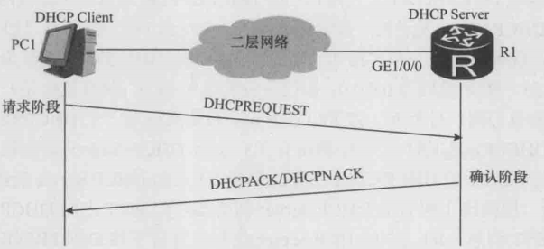

# DHCP 与网络地址转换技术

## 一、DHCP 协议

### 1.DHCP 协议简介

**`DHCP (Dynamic Host Configuration Protocol)`**，即动态主机配置协议。该协议提供了一种动态分配网络配置参数（比如主机 IP 地址、二层网络网关地址等）的机制，并且可以后向兼容 **`BOOTP`** 协议。在这里我们只关注 **`DHCP`** 协议对于主机 IP 地址的分配过程。

> 需要说明的是，通常情况下，**路由器是不适合通过 DHCP 来自动获取它的 IP 地址的**。对于路由器，我们一般应该根据它所处的网络环境来手工配置它的 IP 地址等参数。

DHCP 是一种 Client/Server 模式的网络协议。需要特别说明的是，这里的 Server 只是一个应用程序而已，它可以运行在个人电脑上，也可以运行在服务器（高性能计算机）上，还可以运行在路由器等其他设备上。

DHCP 协议的运行过程为：电脑上电之后，会自动运行 DHCP Client。DHCP Client 会与运行在公司其他设备上的 DHCP Server 进行交互，请求从 DHCP Server 那里获取自己的 IP 地址。DHCP Server 在收到 DHCP Client 的请求后，会根据某种规则在自己的地址池中选择一个 IP 地址，然后将它分配给DHCP Client。**最后，你的电脑就会把 `DHCP Client` 得到的 `IP` 地址作为你的电脑网口的 `IP` 地址**。

### 2.DHCP 协议工作流程

DHCP 的基本工作流程分为 4 个阶段，**即发现阶段，提供阶段，请求阶段，确认阶段**，具体如下所示：

    

#### 1).发现阶段

PC1 上的 DHCP Client 开始运行后，会发送一个广播帧，这个广播帧的源 MAC 地址为 PC1 的 MAC 地址，类型字段的值为 0x0800，载荷数据为一个**广播 `IP` 报文**。该 IP 报文的目的 IP 地址为有限广播地址 255.255.255.255（**当一个数据包发送到这个地址时，它将被发送到同一局域网中的所有设备**），源 IP 地址为 0.0.0.0，协议字段的值为 0x11，载荷数据是一个 UDP 报文。该 UDP 报文的目的端口号为 67，源端口号为 68，载荷数据是一个 **`DHCPDISCOVER`** 消息。

> 广播 **`MAC`** 帧 **`->`** 广播 IP 报文 **`->`** **`UDP`** 报文 **`->`** **`DHCPDISCOVER`** 消息报文

与 PC1 处于同一个二层网络中的所有设备（包括路由器 R1）都会收到这个广播帧（交换机收到这个广播帧后会将它泛洪出去）。但是只有运行了 **`DHCP Server`** 的设备才会识别出目的端口号 67，并将其载荷数据（**`DHCPDISCOVER`** 消息）上送至应用层的 **`DHCP Server`**。

如果有其他设备也运行了 DHCP Server，那么所有这些 DHCP Server 都会接收到 PC1 发送的 **`DHCPDISCOVER`** 消息，也都会对所收到的 **`DHCPDISCOVER`** 消息做出回应。

> **`DHCP`** 的传输层协议时 UDP，而 UDP 是无连接、不可靠的协议，**`DHCP`** 自定义了一套消息重传机制。

#### 2).提供阶段

提供阶段也就是 **`DHCP Server`** 向 **`DHCP Client`** 提供 IP 地址的阶段。在上面流程图中，每个接收到 **`DHCPDISCOVER`** 消息的 **`DHCP Server`** （包括路由器 R1 上运行的 **`DHCP Server`**）都会从自己维护的地址池中选择一个合适的 IP 地址，**并通过 `DHCPOFFER` 消息将这个 IP 地址发送给 `DHCP Client`**。**`DHCPOFFER`** 也是封装在 UDP 报文中进行传输，UDP 报文又是封装在一个广播 IP 报文（目的 IP 地址是 255.255.255.255）中进行传输，该广播 IP 报文又是封装在一个广播帧中。

每个 **`DHCP Client`** 在发送 **`DHCPDISCOVER`** 消息的时候，都会在 **`DHCPDISCOVER`** 消息中设定一个交易号（Transaction ID），**`DHCP Server`** 在回应 **`DHCPDISCOVER`** 消息的时候，会将这个交易号拷贝至 **`DHCPOFFER`** 消息中。所以当多个 PC 中运行 **`DHCP Client`** 时，在收到 **`DHCPOFFER`** 时，只有交易号与 PC 端自己之前设定的相符，才会接受此 offer。

#### 3).请求阶段

在请求阶段中，PC1 的 DHCP Client 会收到若干个 DHCPOFFER，通常情况下，DHCP Client 会接受它所收到的第一个 DHCPOFFER。于是，PC1 的 DHCP Client 会发送一个广播帧，这个广播帧的意图就是向路由器 R1 上的 DHCP Server 提出请求，希望获取到该 DHCP Server 发送给自己的 DHCPOFFER 消息中所提供的那个 IP 地址。

PC1 的 DHCP Client 发送的广播帧的源 MAC 地址为 PC1 的 MAC 地址，载荷数据是一个广播 IP 报文。该 IP 报文的载荷数据是一个 UDP 报文。该 UDP 报文的目的端口号为 67，源端口号为 68，载荷数据是一个 **`DHCPREQUEST`** 消息。注意，这个 **`DHCPREQUEST`** 消息中携带有 R1 上的 **`DHCP Server`** 的标识(称为 Server Identifier)，表示 PC1 的 DHCP Client 只愿意接受 R1 上的 DHCP Server 所给出的 Offer。

显然，该二层网络上所有的 **`DHCP Server`** 都会接收到 PC1 上的 **`DHCP Client`** 发送的 **`DHCPREQUEST`** 消息，但是只有 R1 上的 **`DHCP Server`** 明白 R1 接受了自己的 offer，其他的 **`DHCP Server`** 会收回自己发送的 IP 地址，分配给其他设备。

#### 4).确认阶段

在确认阶段，R1 上的 **`DHCP Server`** 会向 PC1 上的 **`DHCP Client`** 发送一个 **`DHCPACK`** 消息。**`DHCPACK`** 消息是封装在目的端口号为 68、源端口号为 67 的 UDP 报文中的，该 UDP 报文又是封装在一个广播 IP 报文中的。注意，该 IP 报文是封装在一个单播帧里的，这个帧的源 MAC 地址为 DHCP Server 所对应的单播 MAC 地址，目的 MAC 地址为 PC1 的 MAC 地址。在收到 **`DHCPACK`** 消息后，意味着 PC1 首次获得了 **`DHCP Server`** 分配给自己 IP 地址。

注意，由于种种原因，R1 上的 **`DHCP Server`** 也可能会向 PC1 上的 DHCP Client 发送一个 **`DHCPNACK`** 消息。如果 PC1 接收到了 **`DHCPNACK`** 消息，就说明这次获取 IP 地址的尝试失败了。在这种情况下，PC1 只能重新回到发现阶段来开始新一轮的 IP 地址申请过程。

PC1 会记住自己上次所获得的 IP 地址的，并且也能记住当初分配这个 IP 地址的那个 **`DHCP Server`** 的 Server Identifier 以及此 **`DHCP Server`** 所对应的单播 IP 地址和单播 MAC 地址等信息。所以，PC1 重新启动的时候，只需要直接进入第 3 个阶段(请求阶段)，以广播帧及广播 IP 报文的方式发送 **`DHCPREQUEST`** 消息（表示希望继续使用上次分配给自己的 IP 地址）。PC1 在收到 **`DHCPACK`** 消息后，就可以继续使用原来的 IP 地址了。**否则如果 server 回应一个 **`DHCPNACK`** 消息，PC1 必须放弃使用原来的 IP 地址，必须重新从发现阶段开始来申请一个 IP 地址**。下图是 PC1 非首次获取 IP 地址时的基本工作流程。

    

### 3.DHCP 租期

**`DHCP Server`** 每次给 **`DHCP Client`** 分配一个 IP 地址时，只是跟 **`DHCP Client`** 订立了一个关于这个 IP 地址的租约(Lease)。每个租约都有一个租约期 (Duration of Lease)，实际部署 DHCP 时，租约期的缺省值通常都是 24 小时。当租约期到期之后，**`DHCP Client`** 是不被允许继续使用这个 IP 地址的。不过在租约期还没有到时候，**`DHCP Client`** 会申请续租这个 IP 地址的。下图是 PC1 申请 IP 地址续租的流程。

    

按照 DHCP 协议的要求，$T_{1}$ 是租约到了一半的时刻，而 $T_{2}$ 是租约到了 $87.5\%$ 的时刻。如果直到租约期到期时，PC1 上的 **`DHCP Client`** 仍未收到回应的 **`DHCPACK`** 消息，那么 PC1 就必须停止使用原来的 IP 地址，也就是说，PC1 只能重新从发现阶段开始来重新申请一个 IP 地址。

### 4.DHCP 中继代理

**`DHCP Client`** 总是以广播（广播帧及广播 IP 报文）方式来发送 **`DHCPDISCOVER`** 消息和 **`DHCPREQUEST`** 消息的。如果 DHCP Server 和 DHCP Client 不在同一个二层网络(二层广播域)中，那么 DHCP Server 不可能接收到这些 **`DHCPDISCOVER`** 消息和 **`DHCPREQUEST`** 消息。因此，我们之前所描述的 DHCP 工作流程，只适合于 DHCP Server 和 DHCP Client 位于同一个二层网络的场景。

事实上，DHCP 协议还定义了 **`DHCP Relay Agent`**（DHCP 中继代理）这种角色。**`DHCP Relay Agent`** 的基本作用就是专门在 DHCP Client 和 DHCP Server之间进行 DHCP 消息的中转。

**`DHCP Client`** 利用 **`DHCP Relay Agent`** 来从 **`DHCP Server`** 那里获取 IP 地址等配置参数时，**`DHCP Relay Agent`** 必须与 DHCP Client 位于同一个二层网络，但 **`DHCP Server`** 可以与 **`DHCP Relay Agent`** 位于同一个二层网络，也可以与 **`DHCP Relay Agent`** 位于不同的二层网络。

**`DHCP Client`** 与 **`DHCP Relay Agent`** 之间是以广播方式交换 DHCP 消息的，但 **`DHCP Relay Agent`** 与 **`DHCP Server`** 之间是以单播方式交换 DHCP 消息的。

    

## 二、网络地址转换技术

凡是 Internet（公网）上的网络设备，**均不会接收、发送或者转发源 IP 地址或目的 IP 地址为私网 IP 地址的 IP 报文**。简而言之，私网 IP 地址是不能出现在 Internet 上的。另外，在 Internet上，IP 地址还需要满足唯一性的要求。在同一个私网中，私有 IP 地址也需要满足唯一性的要求。**然而，在不同的私网中，私有 IP 地址则无需满足唯一性的要求**。

为了实现私网与 Internet 之间的通信，以及通过 Internet 实现私网与私网之间的通信，人们便引入了 NAT 技术。下面所列举的 NAT 技术本身都是基于这样一种假设：**在私网与公网进行通信时，发起通信的一方都是私网**。

### 1.静态 NAT 技术

为了能够实现私网与 Internet 之间的通信，我们可以在下图 R2 上部署静态 NAT。**静态 NAT 技术的核心内容就是建立并维护一张静态地址映射表**。静态地址映射表反映了公有 IP 地址与私有 IP 地址之间的一一对应关系。

    

上图中 R2 的 **`GE2/0/0`** 接口一侧是公网，而 **`GE1/0/0`** 是公司内部的私网，私网包含 192.168.1.0/24 和 192.168.2.0/24 两个网段，两个网段一共包含 7 个私网 IP 地址。并且该公司获得了 7 个公网 IP 地址。当 PC1 向服务器发送一个 IP 报文 X1 时（X1 的源地址是 192.168.1.1，目的地址是 211.100.7.34），当 X1 经过 R2 时，根据静态地址映射表，会将源地址 192.168.1.1 替换为公有地址 200.24.5.1，X1 变为 X2 发送给服务器。

同理，当服务器发送 IP 报文 Y1 给 PC1 时，Y1 经过 R2 时查找静态映射表，目的 IP 地址会被替换成 192.168.1.1，Y1 会变成 Y2 发送给 PC1。

### 2.动态 NAT 技术

仔细分析一下静态 NAT 技术，**其实每个用户所发起的绝大部分通信都是私网内部的通信，与 Internet 的通信只占极少的比例**。换句话说就是，私网中同时与 Internet 进行通信的用户数几乎不可能超过 7 个。基于这样的分析，我们可以在 R2 上部署动态 NAT，使用动态 NAT 技术来进行通信图如下所示：

    

动态 NAT 包含了一个公有 IP 地址资源池和一张动态地址映射表。当某个私网用户发起与 Internet 的通信时，**NAT 会先去检查公有 IP 地址资源池中是否还有可用的地址**。如果没有，则这次与Internet的通信就无法进行。如果有，则 NAT 会在公有地址资源池中选中一个公有 IP 地址，并在动态地址映射表中创建一个表项，该表项反映了该公有IP地址与该用户的私有 IP 地址之间的映射关系。

当该用户结束通信后，该表项会被清除，同时将该表项中的公有 IP 地址释放回公有地址资源池。**使用动态 NAT 技术，同一个公有 IP 地址可以分配给不同的私网用户使用，但在使用的时间上必须错开**。

### 3.NAPT 

当公司用户数量进一步发展时，同一时刻需要与 Internet 进行通信的用户数量可能超过 7 个，**无论是静态 NAT 还是动态 NAT，同一时刻一个公有 IP 地址只能与一个私有 IP 地址进行映射（绑定）**。为了进一步提高公有 IP 地址的利用率，使得同一个公有 IP 地址在同一时刻可以与多个私有 IP 地址进行映射，我们可以使用 NAPT 技术。NAPT 是 Network Address and Port Translation 的简称，其根本的原理就是**将 TCP 报文或 UDP 报文中的端口号作为映射参数纳入公有 IP 地址与私有 IP 地址之间的映射关系中**。NAPT 通信的详细流程图如下所示。

    

### 4.EasyIP 技术

Easy IP 技术是 NAPT 的一种简化情况。如下图所示，**Easy IP 无需建立公有 IP 地址资源池，因为 Easy IP 只会用到一个公有 IP 地址，该 IP 地址就是路由器 R2 的 GE2/0/0 接口的中地址**。Easy IP 也会建立并维护一张动态地址及端口映射表，并且，Easy IP 会将这张表中的公有 IP 地址绑定成 R2 的 GE2/0/0 接口的 IP 地址。R2 的 GE2/0/0 接口的 IP 地址如果发生了变化，那么，这张表中的公有IP地址也会自动跟着变化。GE2/0/0 接口的 IP 地址可以是手工配置的，也可以是动态分配的。EasyIP 技术的通信流程图如下所示：

    

